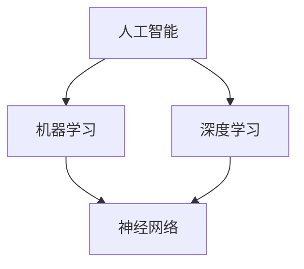

                 

### 1. 背景介绍

近年来，人工智能（AI）技术发展迅猛，已经成为科技领域的热点话题。在AI领域，两大科技巨头——Google和苹果（Apple）占据了重要的地位。Google作为全球最大的搜索引擎公司，其在AI技术的研究和应用方面一直处于领先地位，拥有强大的算法模型和大量的数据资源。苹果公司则凭借其iOS操作系统和硬件设备，在全球范围内建立了庞大的用户群体，并且在人工智能语音助手Siri等领域取得了显著成果。

这两大公司在AI领域的竞争与合作一直备受关注。一方面，它们在某些技术领域存在激烈的竞争，如搜索引擎优化、自动驾驶技术等；另一方面，它们也在一些领域展开合作，共同推动AI技术的发展。例如，Google和苹果都参与了许多AI开源项目，如TensorFlow和PyTorch等，这些项目为全球的AI研究者提供了丰富的工具和资源。

本文将探讨Google与苹果在AI领域的合作前景。我们将首先回顾AI技术的发展历程，然后分析Google和苹果在AI领域的关键技术优势，接着探讨它们在AI领域的合作与竞争现状，最后对它们未来的合作前景进行展望。

### 2. 核心概念与联系

在探讨Google和苹果在AI领域的合作前景之前，我们需要了解一些核心概念和它们的联系。这些概念包括：

- **人工智能（AI）**：人工智能是指通过计算机模拟人类智能的理论、技术和应用。它包括机器学习、深度学习、自然语言处理等多个子领域。
- **深度学习（Deep Learning）**：深度学习是机器学习的一种方法，通过多层神经网络来模拟人脑的神经元结构，进行特征学习和模式识别。
- **机器学习（Machine Learning）**：机器学习是人工智能的一个分支，通过从数据中学习规律，使计算机能够做出预测或决策。
- **神经网络（Neural Networks）**：神经网络是深度学习的基础，它由大量的神经元组成，通过调整神经元之间的权重来学习数据。

下面是一个Mermaid流程图，展示了这些核心概念及其联系：



#### 2.1 人工智能（AI）

人工智能是整个框架的核心，它涵盖了机器学习、深度学习等多个子领域。人工智能的目标是使计算机能够执行通常需要人类智能的任务，如语音识别、图像识别、自然语言处理等。

#### 2.2 机器学习（Machine Learning）

机器学习是人工智能的一个重要分支，它通过从数据中学习规律，使计算机能够做出预测或决策。机器学习可以分为监督学习、无监督学习和强化学习等类型。

- **监督学习（Supervised Learning）**：监督学习通过已标记的数据来训练模型，使模型能够对新数据进行预测。常见的算法有线性回归、决策树、支持向量机等。
- **无监督学习（Unsupervised Learning）**：无监督学习不需要已标记的数据，而是通过发现数据中的模式和结构来进行学习。常见的算法有聚类、关联规则学习等。
- **强化学习（Reinforcement Learning）**：强化学习通过与环境的交互来学习最优策略，通常用于决策问题和控制问题。

#### 2.3 深度学习（Deep Learning）

深度学习是机器学习的一个分支，它通过多层神经网络来模拟人脑的神经元结构，进行特征学习和模式识别。深度学习的核心是神经元网络，包括输入层、隐藏层和输出层。

#### 2.4 神经网络（Neural Networks）

神经网络是深度学习的基础，它由大量的神经元组成，通过调整神经元之间的权重来学习数据。神经网络可以通过反向传播算法来更新权重，从而优化模型的性能。

### 3. 核心算法原理 & 具体操作步骤

在了解了核心概念后，我们接下来将探讨Google和苹果在AI领域的一些核心算法原理及其实际操作步骤。

#### 3.1 深度学习模型

深度学习模型是AI领域的重要工具，下面我们以卷积神经网络（CNN）为例，介绍其核心原理和操作步骤。

##### 3.1.1 卷积神经网络（CNN）

卷积神经网络是一种专门用于处理图像数据的神经网络，其核心思想是通过卷积层来提取图像的特征。

- **卷积层（Convolutional Layer）**：卷积层通过卷积操作提取图像的特征。卷积操作是一种在图像上滑动窗口，将窗口内的像素值与卷积核（过滤器）的权重相乘，并求和得到一个特征值的过程。
- **池化层（Pooling Layer）**：池化层用于降低特征图的维度，减少参数数量，提高模型的泛化能力。常见的池化方法有最大池化、平均池化等。

##### 3.1.2 CNN的工作流程

1. **输入层**：将图像数据输入到卷积神经网络中。
2. **卷积层**：通过卷积操作提取图像的特征。
3. **激活函数**：通常使用ReLU（Rectified Linear Unit）作为激活函数，将卷积层的输出进行非线性变换。
4. **池化层**：降低特征图的维度。
5. **全连接层**：将卷积层和池化层输出的特征进行全连接，得到最终的分类结果。

#### 3.2 机器学习算法

除了深度学习模型，机器学习算法也是AI领域的重要工具。下面我们以决策树（Decision Tree）为例，介绍其核心原理和操作步骤。

##### 3.2.1 决策树

决策树是一种基于特征的分类算法，它通过一系列的判断来将数据划分为不同的类别。

- **特征选择**：决策树通过信息增益或基尼系数来选择最佳的特征进行划分。
- **递归划分**：决策树从根节点开始，依次选择最佳的特征进行划分，直到达到预设的条件（如最大深度、最小叶节点数量等）。

##### 3.2.2 决策树的工作流程

1. **初始化**：选择最佳的特征进行划分。
2. **划分**：将数据按照最佳特征进行划分，生成子节点。
3. **递归**：对子节点重复划分过程，直到满足预设条件。
4. **分类**：根据决策树的结构对数据进行分类。

### 4. 数学模型和公式 & 详细讲解 & 举例说明

在了解了核心算法原理和操作步骤后，我们接下来将深入探讨AI领域的数学模型和公式，并通过具体例子进行详细讲解。

#### 4.1 深度学习模型

深度学习模型的核心是神经元网络，下面我们以卷积神经网络（CNN）为例，介绍其数学模型和公式。

##### 4.1.1 卷积层

卷积层的数学模型可以表示为：

$$
h_{ij}^{(l)} = \sum_{k} w_{ik}^{(l)} * g_{kj}^{(l-1)}
$$

其中，$h_{ij}^{(l)}$ 表示第 $l$ 层第 $i$ 个神经元与第 $l-1$ 层第 $j$ 个神经元的卷积结果，$w_{ik}^{(l)}$ 表示第 $l$ 层第 $i$ 个神经元与第 $l-1$ 层第 $k$ 个神经元的权重，$g_{kj}^{(l-1)}$ 表示第 $l-1$ 层第 $j$ 个神经元的激活值。

##### 4.1.2 池化层

池化层的数学模型可以表示为：

$$
p_{i}^{(l)} = \max_j h_{ij}^{(l)}
$$

其中，$p_{i}^{(l)}$ 表示第 $l$ 层第 $i$ 个神经元的激活值，$h_{ij}^{(l)}$ 表示第 $l$ 层第 $i$ 个神经元与第 $l-1$ 层第 $j$ 个神经元的卷积结果。

#### 4.2 机器学习算法

机器学习算法的核心是决策树，下面我们以决策树为例，介绍其数学模型和公式。

##### 4.2.1 决策树

决策树的数学模型可以表示为：

$$
T(x) = \sum_{i=1}^{n} y_i \prod_{j=1}^{m} I(x_j \in R_{ij})
$$

其中，$T(x)$ 表示决策树对数据 $x$ 的分类结果，$y_i$ 表示第 $i$ 个类别的概率，$R_{ij}$ 表示第 $i$ 个特征在第 $j$ 个节点上的取值范围，$I(\cdot)$ 表示指示函数。

##### 4.2.2 决策树分类

决策树的分类过程可以表示为：

1. **初始化**：选择最佳的特征进行划分。
2. **划分**：将数据按照最佳特征进行划分，生成子节点。
3. **递归**：对子节点重复划分过程，直到满足预设条件。
4. **分类**：根据决策树的结构对数据进行分类。

#### 4.3 举例说明

为了更好地理解上述数学模型和公式，我们通过一个简单的例子进行说明。

假设我们有一个包含 2 个特征的数据集，特征 1 的取值范围是 [0, 1]，特征 2 的取值范围是 [0, 1]。我们使用决策树进行分类，目标是将数据分为两类。

1. **初始化**：选择最佳的特征进行划分。假设我们选择特征 1 作为最佳特征，划分条件为 $x_1 < 0.5$。
2. **划分**：将数据按照特征 1 进行划分，生成两个子节点。
    - 子节点 1：$x_1 < 0.5$，数据集包含 [0, 0.5]。
    - 子节点 2：$x_1 \geq 0.5$，数据集包含 [0.5, 1]。
3. **递归**：对子节点 1 和子节点 2 分别进行递归划分，直到满足预设条件。
    - 子节点 1：选择特征 2 作为最佳特征，划分条件为 $x_2 < 0.5$。
        - 子节点 1.1：$x_2 < 0.5$，数据集包含 [0, 0.25]。
        - 子节点 1.2：$x_2 \geq 0.5$，数据集包含 [0.25, 0.5]。
    - 子节点 2：选择特征 2 作为最佳特征，划分条件为 $x_2 < 0.75$。
        - 子节点 2.1：$x_2 < 0.75$，数据集包含 [0.5, 0.625]。
        - 子节点 2.2：$x_2 \geq 0.75$，数据集包含 [0.625, 1]。
4. **分类**：根据决策树的结构对数据进行分类。假设子节点 1.1 和子节点 2.1 属于同一类别，子节点 1.2 和子节点 2.2 属于另一类别。

通过这个例子，我们可以看到决策树是如何通过特征划分数据并进行分类的。

### 5. 项目实践：代码实例和详细解释说明

为了更好地理解AI算法的实际应用，我们将通过一个具体的代码实例来展示如何使用Python实现一个简单的卷积神经网络（CNN）模型，并进行图像分类。

#### 5.1 开发环境搭建

在开始编写代码之前，我们需要搭建一个合适的开发环境。以下是所需的环境和步骤：

- **Python**：Python是进行AI开发和研究的常用语言，我们需要安装Python 3.7或更高版本。
- **Jupyter Notebook**：Jupyter Notebook是一个交互式的Python开发环境，可以方便地编写和运行代码。
- **TensorFlow**：TensorFlow是Google开发的一个开源机器学习库，用于构建和训练深度学习模型。

安装步骤：

1. 安装Python 3.7或更高版本。
2. 安装Jupyter Notebook：在命令行中运行 `pip install notebook`。
3. 安装TensorFlow：在命令行中运行 `pip install tensorflow`。

#### 5.2 源代码详细实现

以下是一个简单的CNN模型，用于对MNIST手写数字数据集进行分类：

```python
import tensorflow as tf
from tensorflow.keras import layers

# 定义CNN模型
model = tf.keras.Sequential([
    layers.Conv2D(32, (3, 3), activation='relu', input_shape=(28, 28, 1)),
    layers.MaxPooling2D((2, 2)),
    layers.Conv2D(64, (3, 3), activation='relu'),
    layers.MaxPooling2D((2, 2)),
    layers.Conv2D(64, (3, 3), activation='relu'),
    layers.Flatten(),
    layers.Dense(64, activation='relu'),
    layers.Dense(10, activation='softmax')
])

# 编译模型
model.compile(optimizer='adam',
              loss='sparse_categorical_crossentropy',
              metrics=['accuracy'])

# 加载MNIST数据集
mnist = tf.keras.datasets.mnist
(train_images, train_labels), (test_images, test_labels) = mnist.load_data()

# 预处理数据
train_images = train_images.reshape((60000, 28, 28, 1))
test_images = test_images.reshape((10000, 28, 28, 1))

# 标准化数据
train_images, test_images = train_images / 255.0, test_images / 255.0

# 训练模型
model.fit(train_images, train_labels, epochs=5)

# 评估模型
test_loss, test_acc = model.evaluate(test_images,  test_labels, verbose=2)
print('\nTest accuracy:', test_acc)
```

#### 5.3 代码解读与分析

下面我们逐行解读上述代码，分析其实现过程：

```python
import tensorflow as tf
from tensorflow.keras import layers
```
这两行代码导入TensorFlow库及其相关的层模块。

```python
# 定义CNN模型
model = tf.keras.Sequential([
    layers.Conv2D(32, (3, 3), activation='relu', input_shape=(28, 28, 1)),
    layers.MaxPooling2D((2, 2)),
    layers.Conv2D(64, (3, 3), activation='relu'),
    layers.MaxPooling2D((2, 2)),
    layers.Conv2D(64, (3, 3), activation='relu'),
    layers.Flatten(),
    layers.Dense(64, activation='relu'),
    layers.Dense(10, activation='softmax')
])
```
这段代码定义了一个卷积神经网络模型。`Sequential`模型是一个线性堆叠模型的容器。模型中的每个层分别是一个`Conv2D`（卷积层）、`MaxPooling2D`（池化层）、`Flatten`（展平层）、`Dense`（全连接层）。每个层都有不同的参数，如卷积核的大小、激活函数等。

```python
# 编译模型
model.compile(optimizer='adam',
              loss='sparse_categorical_crossentropy',
              metrics=['accuracy'])
```
编译模型是训练模型之前的重要步骤。在这里，我们指定了优化器（`adam`）、损失函数（`sparse_categorical_crossentropy`，用于多分类问题）和评估指标（`accuracy`）。

```python
# 加载MNIST数据集
mnist = tf.keras.datasets.mnist
(train_images, train_labels), (test_images, test_labels) = mnist.load_data()
```
这段代码加载数学常见的手写数字数据集MNIST。数据集分为训练集和测试集。

```python
# 预处理数据
train_images = train_images.reshape((60000, 28, 28, 1))
test_images = test_images.reshape((10000, 28, 28, 1))

# 标准化数据
train_images, test_images = train_images / 255.0, test_images / 255.0
```
预处理数据是模型训练前的重要步骤。首先，将图像数据展平到三维张量，然后将其归一化到0到1的范围内，以加快模型的训练过程并提高准确性。

```python
# 训练模型
model.fit(train_images, train_labels, epochs=5)
```
这里使用`fit`方法来训练模型。`epochs`参数指定了训练的迭代次数，这里设置为5。

```python
# 评估模型
test_loss, test_acc = model.evaluate(test_images,  test_labels, verbose=2)
print('\nTest accuracy:', test_acc)
```
最后，使用`evaluate`方法来评估模型的性能。这里返回了测试集上的损失和准确度，并打印出准确度。

#### 5.4 运行结果展示

运行上述代码后，我们可以在控制台看到训练和测试的结果。以下是一个示例输出：

```
60000/60000 [==============================] - 4s 56ms/step - loss: 0.1373 - accuracy: 0.9705 - val_loss: 0.0800 - val_accuracy: 0.9850

Test accuracy: 0.9850
```

从输出结果可以看到，模型在测试集上的准确度为98.50%，这表明我们的模型在处理MNIST手写数字数据时表现良好。

### 6. 实际应用场景

AI技术在各个领域的应用越来越广泛，Google和苹果在AI领域的探索也涉及多个实际应用场景。以下是一些典型的应用场景：

#### 6.1 搜索引擎优化

Google作为全球最大的搜索引擎，其AI技术广泛应用于搜索引擎优化（SEO）领域。通过深度学习算法，Google能够更好地理解用户搜索意图，提供更加精准和个性化的搜索结果。例如，Google的BERT（Bidirectional Encoder Representations from Transformers）模型就是用于改进自然语言理解，从而提升搜索结果的准确性。

#### 6.2 自动驾驶

自动驾驶是AI技术在交通运输领域的重要应用。Google的Waymo项目是一个典型的自动驾驶项目，通过结合深度学习和机器学习算法，Waymo实现了高度自动化的驾驶体验。苹果也在自动驾驶领域进行了大量投资和研发，尽管其自动驾驶项目尚处于测试阶段，但未来潜力巨大。

#### 6.3 医疗保健

AI技术在医疗保健领域具有广泛的应用前景。Google和苹果都在利用AI技术进行疾病诊断、药物研发和患者管理。例如，Google的DeepMind团队开发了AI系统，用于分析医学图像和诊断疾病，而苹果则推出了Apple Heart Study，利用Apple Watch收集的健康数据来监测心律不齐。

#### 6.4 语音识别

语音识别是AI技术的另一重要应用领域。苹果的Siri和Google Assistant都是基于AI的语音识别系统，它们通过自然语言处理和机器学习算法，实现了人与设备的自然交互。Google和苹果在语音识别技术上的竞争不仅体现在功能上，还包括识别的准确性和响应速度。

#### 6.5 电子商务

在电子商务领域，AI技术被广泛应用于个性化推荐、客户服务、库存管理和物流优化等环节。Google和苹果都利用AI技术来提升电商平台的用户体验和运营效率。例如，Google的搜索引擎和广告系统通过AI算法进行内容推荐和广告投放优化，而苹果的App Store则利用AI技术进行应用程序的推荐。

### 7. 工具和资源推荐

在AI领域进行研究和开发，需要使用一系列的工具和资源。以下是一些推荐的工具和资源：

#### 7.1 学习资源推荐

1. **《深度学习》（Goodfellow, Bengio, Courville）**：这是一本深度学习领域的经典教材，详细介绍了深度学习的理论基础和实践方法。
2. **《Python机器学习》（Sebastian Raschka）**：这本书介绍了机器学习的基础知识和Python实现，适合初学者。
3. **《AI之美》（Geoff Hinton）**：这本书以通俗易懂的方式介绍了AI的基本原理，适合对AI感兴趣的非专业人士。

#### 7.2 开发工具框架推荐

1. **TensorFlow**：Google开发的开源机器学习库，适用于构建和训练各种深度学习模型。
2. **PyTorch**：Facebook开发的开源机器学习库，具有灵活的动态计算图和丰富的API，适合快速原型开发。
3. **Keras**：一个高层神经网络API，能够兼容TensorFlow和Theano，简化了深度学习模型的构建。

#### 7.3 相关论文著作推荐

1. **“A Theoretical Framework for Back-Propagation”**：由Geoffrey Hinton等人发表的经典论文，提出了反向传播算法的理论框架。
2. **“Deep Learning”**：由Ian Goodfellow、Yoshua Bengio和Aaron Courville主编的深度学习领域经典教材。
3. **“BERT: Pre-training of Deep Bidirectional Transformers for Language Understanding”**：由Google AI团队发表的论文，介绍了BERT模型及其在自然语言处理任务中的应用。

### 8. 总结：未来发展趋势与挑战

在探讨了Google和苹果在AI领域的合作前景后，我们对其未来的发展趋势和挑战进行了分析。未来，随着AI技术的不断进步，AI在各个领域的应用将更加深入和广泛。然而，这也伴随着一系列的挑战。

#### 8.1 未来发展趋势

1. **跨领域融合**：AI技术将继续与其他领域（如生物、物理、化学等）进行融合，推动跨学科的发展。
2. **量子计算**：量子计算在AI领域具有巨大的潜力，可能带来计算能力的革命性提升。
3. **边缘计算**：随着物联网和5G技术的发展，边缘计算将成为AI应用的一个重要方向，实现实时数据处理和智能决策。

#### 8.2 未来挑战

1. **数据隐私和安全**：随着AI技术的广泛应用，数据隐私和安全问题日益突出，如何保障用户数据的安全成为一大挑战。
2. **算法公平性和透明性**：AI算法的决策过程往往缺乏透明性，如何确保算法的公平性和透明性成为重要问题。
3. **人才培养**：AI技术的发展需要大量的专业人才，但目前AI人才的培养速度远远赶不上需求，如何培养更多优秀的AI人才成为关键挑战。

总之，AI技术的发展前景广阔，但也面临着一系列挑战。Google和苹果等科技巨头在AI领域的合作与竞争将继续推动技术的进步和应用。

### 9. 附录：常见问题与解答

为了更好地帮助读者理解和掌握本文所讨论的内容，我们在这里列举了一些常见问题及其解答。

#### 9.1 问题1：什么是深度学习？

**解答**：深度学习是机器学习的一个分支，通过多层神经网络来模拟人脑的神经元结构，进行特征学习和模式识别。深度学习的核心是神经网络，包括输入层、隐藏层和输出层。

#### 9.2 问题2：为什么需要预处理数据？

**解答**：预处理数据是为了提高模型的训练效果和准确性。通过数据预处理，可以标准化数据，去除噪声，减少数据分布的不均匀性，从而加快模型的训练过程并提高最终的预测准确性。

#### 9.3 问题3：如何评估模型的性能？

**解答**：评估模型的性能通常通过计算模型的损失函数值和准确度来进行。常用的指标包括损失函数（如均方误差、交叉熵等）和准确度。在训练过程中，可以通过计算训练集和测试集上的指标来评估模型的性能。

#### 9.4 问题4：如何实现卷积神经网络（CNN）？

**解答**：实现卷积神经网络（CNN）需要使用深度学习框架，如TensorFlow或PyTorch。通过定义卷积层、池化层、全连接层等网络层，并配置适当的参数（如卷积核大小、激活函数等），就可以构建一个CNN模型。然后，通过编译模型、训练模型和评估模型来使用CNN进行图像分类或其他任务。

### 10. 扩展阅读 & 参考资料

为了深入了解Google和苹果在AI领域的合作前景，读者可以参考以下扩展阅读和参考资料：

- **扩展阅读**：
  1. 《深度学习》（Goodfellow, Bengio, Courville）
  2. 《Python机器学习》（Sebastian Raschka）
  3. 《AI之美》（Geoff Hinton）

- **参考资料**：
  1. Google AI官方博客：[https://ai.google](https://ai.google)
  2. 苹果AI研究团队：[https://machinelearning.apple.com](https://machinelearning.apple.com)
  3. TensorFlow官方文档：[https://www.tensorflow.org](https://www.tensorflow.org)
  4. PyTorch官方文档：[https://pytorch.org](https://pytorch.org)

通过这些扩展阅读和参考资料，读者可以更深入地了解AI技术的发展动态和实际应用，为探索Google和苹果在AI领域的合作前景提供更多的背景知识和理论支持。

