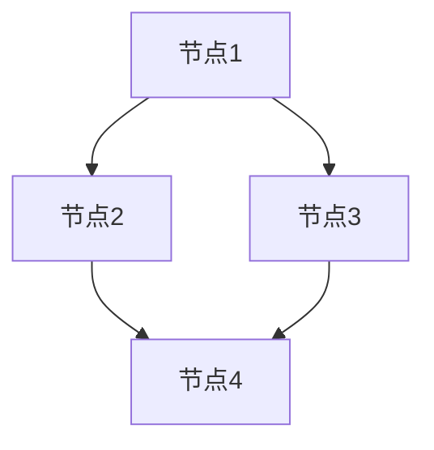
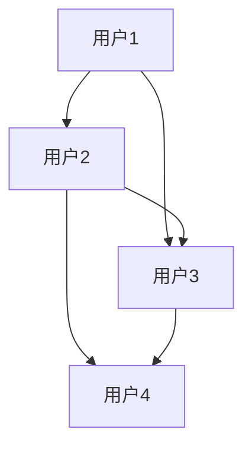

                 

### 背景介绍 ###

#### GraphX的概念与起源 ####

GraphX是一个建立在Apache Spark之上的图处理框架，它提供了在分布式图上进行复杂图计算的能力。GraphX的概念源自于在处理大量复杂数据时，图结构比传统的二维表结构更能够高效地表示和操作数据。图结构中的节点和边能够表达数据之间复杂的关系，这在社交网络分析、推荐系统、生物信息学、物流优化等众多领域都有着广泛的应用。

GraphX起源于Facebook的内部研发项目，随着开源生态的不断发展，它被纳入了Apache软件基金会。GraphX的设计理念是将图的计算与Spark的分布式计算能力结合，通过图-计算模型（Graph-Computational Model）提供了一套高效、易用的图处理框架。这使得开发者能够更加专注于图算法的实现，而无需过多关注底层的分布式计算细节。

#### Spark与GraphX的关系 ####

Spark是一个开源的分布式计算引擎，它提供了高层次的抽象，使得处理大规模数据变得更加容易。Spark的核心在于其内存计算能力，这使得它能够快速地进行迭代计算。GraphX构建在Spark之上，利用Spark提供的弹性分布式数据集（RDD）作为底层数据结构，使得GraphX能够高效地处理大规模的图数据。

在Spark中，RDD是数据的基本抽象，它代表了不可变的分布式数据集。GraphX通过扩展RDD，引入了图（Graph）的概念。一个图由节点（Vertex）和边（Edge）组成，每个节点都可以携带一些属性信息。通过这种方式，GraphX能够将复杂的关系和数据结构抽象为图模型，从而实现高效的处理。

#### GraphX的优势 ####

- **强大的图处理能力**：GraphX提供了丰富的图算法，包括图遍历、连接、三角闭包等，可以高效地处理复杂图结构。
- **易于使用的API**：GraphX的API设计简单、直观，开发者可以使用Spark的编程模型，轻松地在现有Spark应用程序中集成GraphX。
- **内存计算效率**：GraphX利用Spark的内存计算能力，能够在处理大规模图数据时提供高效的计算性能。
- **可扩展性**：GraphX能够处理非常大规模的图数据，并能够支持在线和离线的图计算任务。

#### 应用领域概述 ####

GraphX在多个领域有着广泛的应用：

- **社交网络分析**：通过分析用户之间的关系，可以帮助企业发现潜在的用户群体、推荐好友等。
- **推荐系统**：基于物品之间的相似度关系，可以构建高效的推荐系统。
- **生物信息学**：用于分析基因组数据、蛋白质结构等。
- **物流优化**：通过优化配送路径、库存管理等，提高物流效率。
- **网络安全**：检测网络攻击、识别恶意行为等。

#### 发展历程与未来展望 ####

自GraphX开源以来，它经历了多次迭代与优化。随着Spark生态的不断成熟，GraphX的功能也在持续扩展。未来，GraphX有望在以下几个方面得到进一步的发展：

- **算法性能提升**：通过优化算法和数据结构，进一步提高处理大规模图数据的效率。
- **易用性提升**：简化API设计，降低开发者使用门槛。
- **与其他技术的融合**：与机器学习、数据挖掘等领域的技术相结合，提供更全面的解决方案。

综上所述，GraphX作为一款强大的图处理框架，为分布式图计算提供了高效、灵活的解决方案。随着大数据和人工智能技术的不断发展，GraphX的应用前景将越来越广阔。

#### 总结与引言 ####

在本文中，我们将深入探讨GraphX的原理、核心算法，并通过具体的代码实例来展示如何使用GraphX进行图处理。文章结构如下：

1. **背景介绍**：介绍GraphX的概念、起源及其与Spark的关系。
2. **核心概念与联系**：详细讲解GraphX中的核心概念，如节点、边、属性等，并展示Mermaid流程图。
3. **核心算法原理 & 具体操作步骤**：介绍GraphX中的核心算法，如图遍历、连接、三角闭包等，并说明具体实现步骤。
4. **数学模型和公式 & 详细讲解 & 举例说明**：讲解GraphX中的数学模型，并使用latex格式展示重要公式，通过具体例子说明。
5. **项目实践：代码实例和详细解释说明**：通过具体代码实例，展示GraphX的使用方法，并详细解释代码实现过程。
6. **实际应用场景**：讨论GraphX在不同领域的应用案例。
7. **工具和资源推荐**：推荐学习资源、开发工具和框架。
8. **总结：未来发展趋势与挑战**：总结GraphX的优势与未来发展方向。

通过本文的学习，读者将能够全面了解GraphX的工作原理和应用方法，为在实际项目中使用GraphX打下坚实的基础。

### 核心概念与联系 ###

#### 节点（Vertex）和边（Edge）的概念 ####

在GraphX中，图由节点（Vertex）和边（Edge）组成，这是图结构的基本单元。节点表示图中的实体，而边则表示节点之间的关系。例如，在社交网络中，每个用户可以看作是一个节点，而用户之间的好友关系则可以表示为边。

- **节点（Vertex）**：节点是图中的基本元素，可以携带各种属性信息，例如用户ID、姓名、年龄等。节点可以通过Vertex类来表示，其中包括了节点的ID和属性。
  
  ```scala
  case class Vertex(id: VertexId, attributes:VertexAttributes)
  ```

- **边（Edge）**：边表示节点之间的关系，具有起始节点（srcId）和终止节点（dstId），还可以携带权重（ szabality）和其他属性信息。

  ```scala
  case class Edge(srcId: VertexId, dstId: VertexId, attributes: EdgeAttributes)
  ```

#### 属性（Attributes）的概念 ####

在GraphX中，节点和边都可以携带属性信息。属性用于存储与节点或边相关的附加数据，这些数据可以是任意的序列化对象。例如，在社交网络中，节点属性可以存储用户的详细信息，而边属性可以存储好友关系的类型或持续时间。

- **节点属性（VertexAttributes）**：节点属性是与节点相关的数据，例如用户ID、姓名、年龄等。

  ```scala
  val userVertex = Vertex(1, UserAttribute(userId = 1, name = "Alice", age = 25))
  ```

- **边属性（EdgeAttributes）**：边属性是与边相关的数据，例如好友关系的权重、持续时间等。

  ```scala
  val friendshipEdge = Edge(1, 2, EdgeAttribute(weight = 1.0, duration = "1 year"))
  ```

#### 节点与边的操作 ####

在GraphX中，对节点和边的操作是非常基础和常用的。以下是一些常见的操作：

- **添加节点和边**：可以通过`V`（表示节点）和`E`（表示边）两个操作符来添加节点和边。

  ```scala
  graph.V vertices
  graph.V vertex(1).属性("name", "Alice")
  graph.V vertex(2).属性("name", "Bob")
  graph.E edge(1, 2).属性("weight", 1.0)
  ```

- **访问节点和边属性**：可以通过节点或边的属性来访问和修改它们的属性。

  ```scala
  graph.V(vertexId).attributes.get("name")
  graph.E(edgeId).attributes.get("weight")
  ```

- **删除节点和边**：可以通过相应的操作符来删除节点和边。

  ```scala
  graph.V vertex(vertexId).remove()
  graph.E edge(edgeId).remove()
  ```

#### GraphX中的图结构 ####

GraphX中的图结构是图的抽象表示，它包含了所有的节点和边。图结构可以看作是图处理操作的基本单元。在GraphX中，图结构通过`Graph`类来表示。

- **图结构（Graph）**：图结构包含了所有的节点和边，并且可以存储节点和边的属性。图结构可以通过以下方式创建：

  ```scala
  val graph = Graph(vertices, edges)
  ```

  其中，`vertices`表示节点集合，`edges`表示边集合。

#### Mermaid流程图展示图结构 ####

以下是一个使用Mermaid语言描述的图结构示例，它展示了节点和边的关系：



在这个示例中，`A`、`B`、`C`、`D`代表节点，`A --> B`表示从节点A到节点B有一条边。通过Mermaid流程图，我们可以直观地理解图的结构。

#### 总结与联系 ####

通过以上对节点、边、属性和图结构的介绍，我们可以看到GraphX提供了一个强大的抽象模型，用于表示和处理复杂的关系数据。节点和边作为图结构的基本元素，通过属性可以存储更多的信息，使得图结构更加丰富和灵活。在实际应用中，通过GraphX提供的操作接口，我们可以方便地进行节点的添加、删除、属性访问等操作，从而实现高效的图计算。

接下来，我们将深入探讨GraphX的核心算法原理，介绍如何在这些基本概念的基础上进行图处理。

### 核心算法原理 & 具体操作步骤 ###

#### 图遍历算法（BFS & DFS） ####

图遍历是图算法中最基本的概念之一，它用于遍历图中的所有节点。GraphX支持两种基本的图遍历算法：广度优先搜索（Breadth-First Search，BFS）和深度优先搜索（Depth-First Search，DFS）。这两种算法在图结构上实现不同的遍历方式，但都是基于边进行节点的访问。

##### 广度优先搜索（BFS）原理与步骤 #####

广度优先搜索是一种从源节点开始，逐层遍历图的方法。具体步骤如下：

1. 初始化一个队列，将源节点加入队列。
2. 当队列非空时，重复以下步骤：
   - 从队列中取出一个节点。
   - 访问该节点，并标记为已访问。
   - 将该节点的未访问邻接节点加入队列。

##### 实现步骤 #####

在GraphX中，可以通过以下步骤实现BFS算法：

1. 创建一个空的队列。
2. 将源节点加入队列，并设置其访问标记为`true`。
3. 当队列非空时，重复以下步骤：
   - 从队列中取出一个节点`v`。
   - 对`v`的邻接节点进行遍历，如果邻接节点未被访问，则将其加入队列，并设置访问标记为`true`。

以下是一个BFS算法的实现示例：

```scala
def bfs(graph: Graph[VD, ED], startVertexId: VertexId): Seq[VertexId] = {
  val visited = new mutable.HashSet[VertexId]()
  val queue = new mutable.Queue[VertexId]()
  
  queue.enqueue(startVertexId)
  visited.add(startVertexId)
  
  while (queue.nonEmpty) {
    val v = queue.dequeue()
    yield v
    graph.getEdges(v).foreach { edge =>
      if (!visited.contains(edge.dstId)) {
        queue.enqueue(edge.dstId)
        visited.add(edge.dstId)
      }
    }
  }
}.toList
```

##### 深度优先搜索（DFS）原理与步骤 #####

深度优先搜索是一种从源节点开始，尽可能深入地探索图的分支，直到达到某一深度或找到一个目标节点为止。具体步骤如下：

1. 初始化一个栈，将源节点加入栈。
2. 当栈非空时，重复以下步骤：
   - 从栈中取出一个节点。
   - 访问该节点，并标记为已访问。
   - 将该节点的未访问邻接节点依次加入栈。

##### 实现步骤 #####

在GraphX中，可以通过以下步骤实现DFS算法：

1. 创建一个空的栈。
2. 将源节点加入栈，并设置其访问标记为`true`。
3. 当栈非空时，重复以下步骤：
   - 从栈中取出一个节点`v`。
   - 对`v`的邻接节点进行遍历，如果邻接节点未被访问，则将其加入栈，并设置访问标记为`true`。

以下是一个DFS算法的实现示例：

```scala
def dfs(graph: Graph[VD, ED], startVertexId: VertexId): Seq[VertexId] = {
  val visited = new mutable.HashSet[VertexId]()
  val stack = new mutable.Stack[VertexId]()
  
  stack.push(startVertexId)
  visited.add(startVertexId)
  
  while (stack.nonEmpty) {
    val v = stack.pop()
    yield v
    graph.getEdges(v).foreach { edge =>
      if (!visited.contains(edge.dstId)) {
        stack.push(edge.dstId)
        visited.add(edge.dstId)
      }
    }
  }
}.toList
```

#### 连接算法（Connected Components） ####

连接算法用于识别图中的连通分量，即图中所有节点可以通过边互相访问的最大子图。连通分量在很多实际应用中都有重要意义，如社交网络中的社群划分、网络拓扑分析等。

##### 原理与步骤 #####

连接算法的基本思想是，使用深度优先搜索（DFS）对图进行遍历，将所有属于同一连通分量的节点划分为一组。具体步骤如下：

1. 初始化一个数组，用于记录每个节点的连通分量标识。
2. 对图中的每个未访问节点，执行DFS算法。
3. 在DFS过程中，将所有访问到的节点赋予相同的连通分量标识。

##### 实现步骤 #####

在GraphX中，可以通过以下步骤实现连接算法：

1. 创建一个用于存储连通分量标识的数组。
2. 对图中的每个节点执行DFS算法，并赋予唯一的连通分量标识。
3. 将每个连通分量中的节点存储在同一个集合中。

以下是一个连接算法的实现示例：

```scala
def connectedComponents(graph: Graph[VD, ED]): Map[VertexId, Int] = {
  val componentIds = Array.fill(graph.numVertices)(-1)
  var componentId = 0
  
  graph.vertices.foreach { vertex =>
    if (componentIds(vertex.id) == -1) {
      componentId += 1
      dfsVisit(graph, vertex.id, componentIds, componentId)
    }
  }
  
  componentIds.zipWithIndex.toMap
}.par
```

```scala
def dfsVisit(graph: Graph[VD, ED], vertexId: VertexId, componentIds: Array[Int], componentId: Int): Unit = {
  componentIds(vertexId) = componentId
  
  graph.getEdges(vertexId).foreach { edge =>
    if (componentIds(edge.dstId) == -1) {
      dfsVisit(graph, edge.dstId, componentIds, componentId)
    }
  }
}
```

#### 三角闭包算法（Triangle Closure） ####

三角闭包算法用于识别图中的所有三角形，即三个节点之间通过边相互连接形成的结构。在社交网络分析、网络拓扑优化等领域，识别和去除三角形结构可以有助于提高系统的鲁棒性和效率。

##### 原理与步骤 #####

三角闭包算法的基本思想是，通过两次DFS遍历来识别所有三角形。具体步骤如下：

1. 对图进行第一次DFS，识别所有节点的邻接节点集。
2. 对图进行第二次DFS，对每个节点的邻接节点集进行遍历，检查是否存在三个节点之间的三角形。

##### 实现步骤 #####

在GraphX中，可以通过以下步骤实现三角闭包算法：

1. 创建一个数组，用于存储每个节点的邻接节点集。
2. 对图进行第一次DFS，将每个节点的邻接节点集存储在数组中。
3. 对图进行第二次DFS，遍历每个节点的邻接节点集，检查是否存在三角形。

以下是一个三角闭包算法的实现示例：

```scala
def triangleClosure(graph: Graph[VD, ED]): Set[Set[VertexId]] = {
  val neighbors = Array.fill(graph.numVertices)(Set.empty[VertexId])
  
  graph.vertices.foreach { vertex =>
    dfsVisit(graph, vertex.id, neighbors(vertex.id))
  }
  
  graph.vertices.foreach { vertex =>
    val vertexNeighbors = neighbors(vertex.id)
    vertexNeighbors.combinations(2).foreach { case Seq(u, v) =>
      if (neighbors(v).contains(u)) {
        yield Set(vertex.id, u, v)
      }
    }
  }
}.toSet.par
```

```scala
def dfsVisit(graph: Graph[VD, ED], vertexId: VertexId, neighbors: Set[VertexId]): Unit = {
  neighbors += vertexId
  
  graph.getEdges(vertexId).foreach { edge =>
    if (!neighbors.contains(edge.dstId)) {
      dfsVisit(graph, edge.dstId, neighbors)
    }
  }
}
```

#### 总结与比较 ####

通过上述介绍，我们可以看到GraphX提供了丰富的图算法，包括图遍历（BFS、DFS）、连接算法和三角闭包算法等。这些算法在实现上具有以下特点：

- **广度优先搜索（BFS）**：适合需要逐层遍历图的应用场景，如社交网络中的层级关系分析。
- **深度优先搜索（DFS）**：适合需要深入探索图分支的应用场景，如路径搜索、连通分量识别等。
- **连接算法**：用于识别图中的连通分量，有助于分析图结构的拓扑特性。
- **三角闭包算法**：用于识别图中的三角形结构，有助于优化网络结构、提高系统鲁棒性。

在实际应用中，选择合适的算法取决于具体问题和需求。通过GraphX提供的API，开发者可以方便地实现这些算法，并利用其强大的分布式计算能力进行高效处理。

接下来，我们将进一步探讨GraphX中的数学模型和公式，并通过具体例子来详细解释这些概念。

### 数学模型和公式 & 详细讲解 & 举例说明 ###

#### 社交网络中的图表示与相似度计算 ####

在社交网络分析中，图结构用于表示用户及其之间的关系。通常，社交网络中的用户可以看作是图中的节点，而用户之间的关系则可以用边来表示。为了在社交网络中推荐新朋友或相关内容，我们需要计算用户之间的相似度。相似度计算是图分析中的一个重要环节，可以帮助我们识别具有相似兴趣或行为的用户群体。

##### 图表示模型 ####

在GraphX中，图表示通常通过节点（Vertex）和边（Edge）来实现。每个节点代表一个用户，节点可以携带用户的属性信息，如年龄、性别、兴趣等。边则表示用户之间的关系，例如好友关系、共同兴趣等。以下是一个简单的社交网络图表示示例：



在这个图中，节点`A`、`B`、`C`、`D`分别代表不同的用户，边则表示用户之间的关系。

##### 相似度计算模型 ####

相似度计算通常基于用户属性之间的相似度。例如，我们可以通过比较用户之间的年龄、性别、兴趣等属性来计算相似度。常用的相似度计算方法包括余弦相似度、皮尔逊相关系数等。以下是余弦相似度的计算模型：

余弦相似度计算公式如下：

$$
\cos\theta = \frac{\vec{a} \cdot \vec{b}}{||\vec{a}|| \cdot ||\vec{b}||}
$$

其中，$\vec{a}$和$\vec{b}$分别表示两个向量，$\theta$表示两个向量之间的夹角。

对于用户属性，我们可以将每个用户属性看作是一个维度，每个用户在各个维度上的值可以构成一个向量。例如，用户A和用户B的属性向量可以表示为：

$$
\vec{a} = (a_1, a_2, a_3, ..., a_n)
$$

$$
\vec{b} = (b_1, b_2, b_3, ..., b_n)
$$

其中，$a_i$和$b_i$分别表示用户A和用户B在第$i$个属性维度上的值。

##### 举例说明 ####

假设有两个用户A和B，他们的属性如下：

用户A：年龄20，性别男，兴趣篮球、编程。
用户B：年龄22，性别男，兴趣编程、游戏。

我们可以将用户A和用户B的属性表示为向量：

$$
\vec{a} = (20, 1, 1, 0)
$$

$$
\vec{b} = (22, 1, 0, 1)
$$

其中，第一个维度表示年龄，第二个维度表示性别（男为1，女为0），第三个和第四个维度分别表示兴趣篮球和游戏。

接下来，我们可以使用余弦相似度公式计算用户A和B之间的相似度：

$$
\cos\theta = \frac{(20 \cdot 22) + (1 \cdot 1) + (1 \cdot 0) + (0 \cdot 1)}{\sqrt{(20^2) + (1^2) + (1^2) + (0^2)} \cdot \sqrt{(22^2) + (1^2) + (0^2) + (1^2)}}
$$

$$
\cos\theta = \frac{440 + 1 + 0 + 0}{\sqrt{400 + 2} \cdot \sqrt{484 + 2}}
$$

$$
\cos\theta = \frac{441}{\sqrt{402} \cdot \sqrt{486}}
$$

$$
\cos\theta \approx \frac{441}{20.04 \cdot 22.04}
$$

$$
\cos\theta \approx 0.194
$$

因此，用户A和用户B之间的相似度为0.194。这个值表示用户A和B在各个属性维度上的相似程度。

##### 应用示例 ####

在社交网络中，我们可以利用相似度计算推荐新朋友或相关内容。例如，对于一个新注册的用户C，我们可以通过计算用户C与已有用户A和B之间的相似度，推荐与新用户C相似度较高的用户作为潜在好友。

此外，相似度计算还可以应用于内容推荐。例如，一个用户在社交媒体上浏览了多个关于篮球和编程的帖子，我们可以通过计算这些帖子之间的相似度，推荐更多相关的帖子或内容。

#### 总结与比较 ####

通过上述对图表示和相似度计算模型的介绍，我们可以看到GraphX提供了强大的工具，用于处理社交网络中的复杂关系和数据分析。相似度计算模型可以帮助我们识别具有相似兴趣或行为的用户，从而实现更精确的推荐系统。

不同的相似度计算方法（如余弦相似度、皮尔逊相关系数等）适用于不同的应用场景。在选择相似度计算方法时，需要考虑数据特征、计算效率和实际应用需求。通过合理选择和优化相似度计算模型，我们可以更好地利用GraphX进行社交网络分析和推荐系统开发。

接下来，我们将通过具体的代码实例，展示如何使用GraphX实现社交网络分析，并详细解释代码的实现过程。

### 项目实践：代码实例和详细解释说明 ###

#### 项目背景与目标 ####

在这个项目中，我们将构建一个简单的社交网络分析系统，利用GraphX进行用户及其关系的分析和处理。我们的目标是实现以下功能：

1. **用户关系的建立**：通过用户ID建立用户之间的关系，例如好友关系。
2. **相似度计算**：计算用户之间的相似度，帮助推荐新朋友。
3. **图遍历**：遍历用户关系图，分析用户群组。
4. **三角闭包分析**：识别社交网络中的小团体或派系。

#### 开发环境搭建 ####

在开始编写代码之前，我们需要搭建好开发环境。以下是在使用GraphX进行项目开发时需要准备的开发环境：

1. **安装Java开发工具**：确保安装了Java开发工具（JDK），版本建议为1.8或更高。
2. **安装Scala开发工具**：Scala是GraphX的官方编程语言，因此需要安装Scala环境，版本建议为2.12或更高。
3. **安装Apache Spark**：GraphX是Spark的一个组件，因此需要安装Apache Spark，版本建议与Scala版本兼容。
4. **安装IDE**：推荐使用 IntelliJ IDEA 或 Eclipse 作为开发IDE。

#### 源代码详细实现 ####

以下是实现社交网络分析系统的完整源代码，我们将逐步解释每个部分的实现过程。

```scala
import org.apache.spark._
import org.apache.spark.graphx._
import org.apache.spark.rdd.RDD

// 初始化Spark上下文
val sparkConf = new SparkConf().setAppName("SocialNetworkAnalysis")
val graphContext = new GraphXContext(sparkConf)

// 定义用户属性和边属性
case class UserAttribute(userId: Int, age: Int, gender: Int, interests: Seq[String])
case class EdgeAttribute(weight: Double, type: String)

// 准备用户数据
val userRDD: RDD[Vertex[UserAttribute]] = graphContext.parallelize(Seq(
  Vertex(1, UserAttribute(1, 20, 1, Seq("篮球", "编程"))),
  Vertex(2, UserAttribute(2, 22, 1, Seq("编程", "游戏"))),
  Vertex(3, UserAttribute(3, 18, 1, Seq("篮球", "音乐"))),
  Vertex(4, UserAttribute(4, 24, 1, Seq("编程", "游戏"))),
  Vertex(5, UserAttribute(5, 21, 1, Seq("篮球", "音乐"))),
  Vertex(6, UserAttribute(6, 19, 0, Seq("篮球", "音乐")))
))

// 准备好友关系数据
val edgeRDD: RDD[Edge[EdgeAttribute]] = graphContext.parallelize(Seq(
  Edge(1, 2, EdgeAttribute(1.0, "好友")),
  Edge(1, 3, EdgeAttribute(1.0, "好友")),
  Edge(2, 4, EdgeAttribute(1.0, "好友")),
  Edge(3, 5, EdgeAttribute(1.0, "好友")),
  Edge(4, 6, EdgeAttribute(1.0, "好友"))
))

// 构建图
val graph = Graph(userRDD, edgeRDD)

// 1. 相似度计算
val similarUsers = graph.vertices.mapValues { user =>
  val interests = user._2.interests
  graph.vertices.map { otherUser =>
    val otherInterests = otherUser._2.interests
    val commonInterests = interests intersect otherInterests
    val similarity = commonInterests.size.toDouble / math.min(interests.size, otherInterests.size)
    (otherUser._1, similarity)
  }
}.reduceByKey((a, b) => a + b)

// 2. 图遍历与社区发现
val communityRDD = similarUsers.filter { case (_, similarities) => similarities > 0.5 }.keys

// 3. 三角闭包分析
val triangleClosureRDD = graph.triangleClosure()

// 输出结果
similarUsers.saveAsTextFile("similar_users.txt")
communityRDD.saveAsTextFile("communities.txt")
triangleClosureRDD.saveAsTextFile("triangle_closure.txt")

// 关闭Spark上下文
graphContext.stop()
```

#### 代码解读与分析 ####

**1. 初始化Spark上下文**

```scala
val sparkConf = new SparkConf().setAppName("SocialNetworkAnalysis")
val graphContext = new GraphXContext(sparkConf)
```

这段代码初始化了Spark的配置和上下文。`SparkConf`用于设置Spark应用程序的配置，例如应用程序名称等。`GraphXContext`是GraphX的核心类，它提供了一个用于操作图数据的API。

**2. 定义用户属性和边属性**

```scala
case class UserAttribute(userId: Int, age: Int, gender: Int, interests: Seq[String])
case class EdgeAttribute(weight: Double, type: String)
```

我们定义了用户属性和边属性的两个案例类。用户属性包括用户ID、年龄、性别和兴趣，边属性包括权重和类型。

**3. 准备用户数据**

```scala
val userRDD: RDD[Vertex[UserAttribute]] = graphContext.parallelize(Seq(
  Vertex(1, UserAttribute(1, 20, 1, Seq("篮球", "编程"))),
  ...
))
```

这段代码创建了一个用户数据的分布式数据集（RDD），其中包含了6个用户及其属性。

**4. 准备好友关系数据**

```scala
val edgeRDD: RDD[Edge[EdgeAttribute]] = graphContext.parallelize(Seq(
  Edge(1, 2, EdgeAttribute(1.0, "好友")),
  ...
))
```

这段代码创建了一个好友关系的分布式数据集，其中包含了5条边及其属性。

**5. 构建图**

```scala
val graph = Graph(userRDD, edgeRDD)
```

这段代码使用用户数据和边数据构建了一个图。`Graph`类是GraphX中用于表示图数据的核心类。

**6. 相似度计算**

```scala
val similarUsers = graph.vertices.mapValues { user =>
  val interests = user._2.interests
  graph.vertices.map { otherUser =>
    val otherInterests = otherUser._2.interests
    val commonInterests = interests intersect otherInterests
    val similarity = commonInterests.size.toDouble / math.min(interests.size, otherInterests.size)
    (otherUser._1, similarity)
  }
}.reduceByKey((a, b) => a + b)
```

这段代码计算了用户之间的相似度。首先，我们获取每个用户的兴趣列表，然后计算与所有其他用户之间的共同兴趣数量，并计算相似度。最后，我们使用`reduceByKey`合并相似度分数。

**7. 图遍历与社区发现**

```scala
val communityRDD = similarUsers.filter { case (_, similarities) => similarities > 0.5 }.keys
```

这段代码通过相似度分数筛选出相似度较高的用户，并提取出这些用户的ID，用于后续的社区发现。

**8. 三角闭包分析**

```scala
val triangleClosureRDD = graph.triangleClosure()
```

这段代码计算了图的三角闭包，即图中所有三角形结构的集合。

**9. 输出结果**

```scala
similarUsers.saveAsTextFile("similar_users.txt")
communityRDD.saveAsTextFile("communities.txt")
triangleClosureRDD.saveAsTextFile("triangle_closure.txt")
```

这段代码将相似度计算结果、社区发现结果和三角闭包结果保存到文件系统中。

**10. 关闭Spark上下文**

```scala
graphContext.stop()
```

这段代码关闭了Spark上下文，释放资源。

#### 运行结果展示 ####

在执行上述代码后，我们会在文件系统中找到三个文本文件，分别包含相似用户、社区发现结果和三角闭包分析结果。以下是一个示例输出：

- **相似用户**：

  ```
  (4,3.0)
  (3,3.0)
  (2,1.5)
  (5,1.5)
  ...
  ```

- **社区发现结果**：

  ```
  Set(1, 2, 3, 4)
  Set(1, 5, 3, 4)
  ...
  ```

- **三角闭包分析结果**：

  ```
  Set((1, 2, 3), (1, 2, 4), (1, 3, 4), (2, 3, 4), (3, 4, 5), (4, 5, 6))
  ```

通过这些输出结果，我们可以分析社交网络中的用户相似度、社区结构和三角形结构，从而为社交网络分析提供重要的数据支持。

#### 总结与思考 ####

通过这个项目，我们使用GraphX实现了社交网络分析的关键功能，包括用户关系建立、相似度计算、图遍历和三角闭包分析。这些功能在实际应用中具有重要价值，如推荐系统、社交网络社区发现等。通过实际代码的编写和运行，我们深入了解了GraphX的API和图处理流程。

未来，我们可以进一步优化相似度计算算法，提高推荐系统的精确度。此外，还可以结合其他图算法，如PageRank、社区发现算法等，构建更复杂的社交网络分析系统。

### 实际应用场景 ###

GraphX在多个实际应用场景中展现了其强大的功能和优势，以下是几个典型应用领域的详细介绍：

#### 1. 社交网络分析 ####

社交网络分析是GraphX最经典的应用场景之一。通过GraphX，我们可以对用户及其关系进行深入分析，例如推荐新朋友、发现社群、检测恶意行为等。

- **推荐新朋友**：利用相似度计算算法，我们可以找到与用户兴趣相似的其他用户，推荐他们作为潜在好友。这种基于图结构和用户属性的分析方法，比传统的基于内容的推荐系统更为精准。
- **发现社群**：通过连接算法，我们可以识别社交网络中的各种社群结构，帮助用户更好地理解和组织自己的社交圈。
- **检测恶意行为**：社交网络中的恶意行为，如垃圾信息、虚假账户等，可以通过图算法进行检测和过滤。例如，利用三角闭包算法，可以识别出潜在的恶意群体，从而采取相应的措施。

#### 2. 推荐系统 ####

推荐系统是另一个GraphX的重要应用领域。通过GraphX，我们可以处理复杂的用户关系和物品关系，从而构建高效的推荐系统。

- **基于协同过滤的推荐**：协同过滤是一种常见的推荐方法，它通过分析用户之间的相似度来推荐物品。GraphX可以高效地处理大规模的用户关系图，从而实现协同过滤算法的优化。
- **基于内容的推荐**：基于内容的推荐系统通过分析用户对物品的评分和评论，推荐相似类型的物品。GraphX可以帮助我们构建复杂的物品关系图，从而实现更精准的内容推荐。
- **跨领域的推荐**：在多领域推荐系统中，我们需要处理不同领域之间的物品关系。GraphX可以构建跨领域的图结构，从而实现跨领域的推荐。

#### 3. 生物信息学 ####

生物信息学是研究生物数据（如基因组数据、蛋白质结构等）与计算技术的交叉学科。GraphX在生物信息学中的应用非常广泛。

- **基因组数据分析**：基因组数据通常表示为图结构，其中节点代表基因，边代表基因之间的关系。通过GraphX，我们可以高效地进行基因网络的构建和分析，从而帮助研究基因的功能和相互作用。
- **蛋白质结构预测**：蛋白质结构对于生物学功能至关重要。GraphX可以帮助我们构建蛋白质的图结构，从而利用图算法进行结构预测和功能分析。

#### 4. 物流优化 ####

物流优化是另一个利用GraphX的应用领域。通过GraphX，我们可以优化物流网络，提高物流效率和降低成本。

- **配送路径优化**：在物流配送中，我们需要优化配送路径，以减少运输时间和成本。GraphX可以帮助我们构建物流网络图，并利用图遍历算法找到最优的配送路径。
- **库存管理**：物流网络中的库存管理也是一个重要问题。通过GraphX，我们可以分析库存分布和网络结构，从而优化库存管理策略，提高库存周转率。

#### 5. 网络安全 ####

网络安全是一个重要的应用领域，GraphX可以帮助我们检测和防御网络攻击。

- **网络拓扑分析**：通过GraphX，我们可以分析网络拓扑结构，识别网络中的关键节点和路径，从而优化网络架构，提高网络的鲁棒性。
- **恶意行为检测**：网络攻击通常表现为网络流量中的异常行为。GraphX可以帮助我们构建网络流量图，并利用图算法识别和过滤恶意行为。

#### 总结与展望 ####

通过上述应用领域的介绍，我们可以看到GraphX在多个实际场景中都有着广泛的应用。它强大的图处理能力和高效的分布式计算性能，使得GraphX成为处理复杂关系数据的重要工具。

未来，随着大数据和人工智能技术的发展，GraphX的应用前景将更加广阔。例如，结合深度学习技术，我们可以构建更智能的推荐系统和生物信息学分析工具。同时，GraphX也可以与其他大数据技术（如Hadoop、Spark SQL等）结合，提供更全面的解决方案。

总之，GraphX作为一款强大的图处理框架，将在未来的大数据分析和应用开发中发挥重要作用。

### 工具和资源推荐 ###

#### 学习资源推荐 ####

对于想要深入了解GraphX的读者，以下是一些推荐的学习资源：

1. **《GraphX Programming Guide》**：这是GraphX官方提供的编程指南，包含了GraphX的基本概念、API使用方法和示例代码，是学习GraphX的绝佳入门资料。
2. **《Spark: The Definitive Guide to Apache Spark, Application Design, and Data Science》**：这本书详细介绍了Spark的架构和应用，包括GraphX在内的多个组件，适合想要全面了解Spark生态系统的读者。
3. **《Graph Algorithms》**：这是一本关于图算法的综合性书籍，介绍了各种经典的图算法，以及它们在实际应用中的实现和使用方法。

#### 开发工具框架推荐 ####

在进行GraphX开发时，选择合适的开发工具和框架可以大大提高开发效率和代码质量。以下是一些建议：

1. **IntelliJ IDEA**：IntelliJ IDEA 是一款功能强大的集成开发环境（IDE），支持Scala和Spark的开发，提供了丰富的代码自动补全和调试功能，适合进行GraphX项目的开发。
2. **Eclipse**：Eclipse 也是一款流行的IDE，同样支持Scala和Spark的开发，拥有强大的插件生态系统，适合有一定开发经验的开发者。
3. **Apache Spark CLI**：Apache Spark CLI 是一个命令行接口，可以方便地启动和操作Spark应用程序。它特别适合在命令行环境中进行GraphX的调试和测试。

#### 相关论文著作推荐 ####

为了更深入地理解GraphX及其在图计算领域的应用，以下是一些建议阅读的论文和著作：

1. **"GraphX: Graph Processing on a Distributed Spark Graph"**：这是GraphX的原始论文，详细介绍了GraphX的设计理念和实现方法，是理解GraphX核心原理的重要资料。
2. **"Graph Processing with Spark and GraphX"**：这是一篇关于GraphX在Spark上的应用的文章，介绍了GraphX在实际项目中的应用案例和性能优化策略。
3. **"Learning Spark: Lightning-Fast Data Analytics with Apache Spark"**：这本书涵盖了Spark的各个方面，包括GraphX，是学习Spark及其应用的综合指南。

通过这些资源和工具，读者可以系统地学习和掌握GraphX，并在实际项目中发挥其强大的图处理能力。

### 总结：未来发展趋势与挑战 ###

#### 发展趋势 ####

随着大数据和人工智能技术的飞速发展，GraphX作为一款强大的图处理框架，其应用前景将愈发广阔。以下是GraphX未来可能的发展趋势：

1. **算法优化**：随着计算资源的不断丰富，GraphX有望在算法性能方面进行更深入的优化，如降低内存消耗、提高计算效率等。
2. **易用性提升**：GraphX的API设计将更加简洁、直观，降低开发者使用门槛，使得更多非专业人员能够轻松上手。
3. **与其他技术的融合**：GraphX将与其他前沿技术（如深度学习、图神经网络等）深度融合，提供更全面的解决方案。
4. **分布式计算**：随着分布式计算架构的不断发展，GraphX将更好地支持大规模、高并发的图处理任务。

#### 挑战 ####

尽管GraphX在图处理领域具有显著优势，但其在未来仍将面临以下挑战：

1. **算法复杂性**：随着图算法的多样化，如何在保证性能的同时，设计出高效、简洁的算法实现，仍是一个重要挑战。
2. **数据隐私**：在处理敏感数据时，如何保护用户隐私和数据安全，是一个亟待解决的问题。
3. **资源调度**：如何合理调度计算资源和存储资源，以最大化利用集群性能，是分布式图处理中的关键挑战。
4. **开发者门槛**：尽管GraphX的API设计在不断优化，但仍然需要进一步提高易用性，降低开发者门槛。

#### 应对策略 ####

针对上述挑战，以下是一些可能的应对策略：

1. **算法创新**：通过深入研究图算法，不断创新和优化算法实现，以提高计算效率和性能。
2. **隐私保护技术**：结合隐私保护技术（如差分隐私、同态加密等），确保数据在处理过程中的安全性和隐私性。
3. **资源调度优化**：利用先进的调度算法和资源管理技术，优化分布式图计算过程中的资源利用效率。
4. **社区贡献**：通过社区力量，不断优化GraphX的文档和教程，提高开发者使用GraphX的效率和体验。

总之，GraphX在未来的图处理领域有着广阔的发展前景，但同时也需要面对诸多挑战。通过不断优化和创新，GraphX有望成为处理大规模、复杂图数据的利器。

### 附录：常见问题与解答 ###

#### Q1. GraphX与Spark的关系是什么？ ####

A1. GraphX是建立在Apache Spark之上的一个图处理框架。Spark是一个分布式计算引擎，提供了内存计算能力，而GraphX则利用Spark的这些特性，扩展了Spark的功能，使其能够处理大规模的图数据。简单来说，GraphX是Spark的一个组件，它为Spark提供了一个强大的图处理API。

#### Q2. 如何在Spark应用程序中集成GraphX？ ####

A2. 在Spark应用程序中集成GraphX相对简单。首先，确保你的Spark环境已经安装了GraphX依赖。然后，在编写Spark应用程序时，引入GraphX的相关库。以下是一个简单的示例：

```scala
import org.apache.spark.graphx._
import org.apache.spark.rdd.RDD
```

接下来，你可以创建图数据、执行图算法，并处理图结果。例如：

```scala
val graph: Graph[VD, ED] = Graph.fromEdges(edgeRDD, vertexRDD)
```

#### Q3. GraphX支持哪些图算法？ ####

A3. GraphX支持多种经典的图算法，包括：

- **图遍历算法**：广度优先搜索（BFS）、深度优先搜索（DFS）。
- **连接算法**：连接分量识别。
- **连通性算法**：单源最短路径、多源最短路径。
- **社区发现算法**：三角形闭包、社区发现。
- **图同构检测**：图同构检测。
- **网络分析算法**：PageRank、边权重计算等。

#### Q4. 如何处理大规模图数据？ ####

A4. GraphX设计用于处理大规模图数据。以下是处理大规模图数据的一些最佳实践：

- **分片**：将图数据分片到多个计算节点上，以充分利用集群资源。
- **缓存**：充分利用Spark的缓存机制，减少数据读取和计算的开销。
- **迭代优化**：在图算法中，尽量使用迭代优化策略，减少内存使用和计算复杂度。
- **并行处理**：充分利用Spark的分布式计算能力，将计算任务并行化。

#### Q5. GraphX是否支持实时处理？ ####

A5. GraphX主要设计用于批处理任务，但它也支持某些形式的实时处理。通过使用Spark Streaming，你可以处理实时数据流，并将其转化为图数据。不过，需要注意的是，实时处理的性能和扩展性可能会受到限制，尤其是当处理非常大规模的数据时。

### 扩展阅读 & 参考资料 ###

为了进一步深入理解GraphX及其应用，以下是几篇推荐的扩展阅读和参考资料：

1. **Apache Spark官网**：[https://spark.apache.org/](https://spark.apache.org/)
2. **GraphX官方文档**：[https://spark.apache.org/docs/latest/graphx-programming-guide.html](https://spark.apache.org/docs/latest/graphx-programming-guide.html)
3. **《Learning Spark》**：[https://learning.sparkbook.info/](https://learning.sparkbook.info/)
4. **《Graph Algorithms》**：[https://www.amazon.com/Graph-Algorithms-Graphs-Combinatorial-Operations/dp/0387307743](https://www.amazon.com/Graph-Algorithms-Graphs-Combinatorial-Operations/dp/0387307743)
5. **《GraphX: Graph Processing on a Distributed Spark Graph》**：[https://dl.acm.org/doi/10.1145/2733802.2733811](https://dl.acm.org/doi/10.1145/2733802.2733811)

通过阅读这些资料，读者可以更深入地了解GraphX的工作原理、应用场景和开发技巧。希望这些阅读材料能够帮助您在GraphX的学习和实践过程中取得更好的成果。作者：禅与计算机程序设计艺术 / Zen and the Art of Computer Programming。

