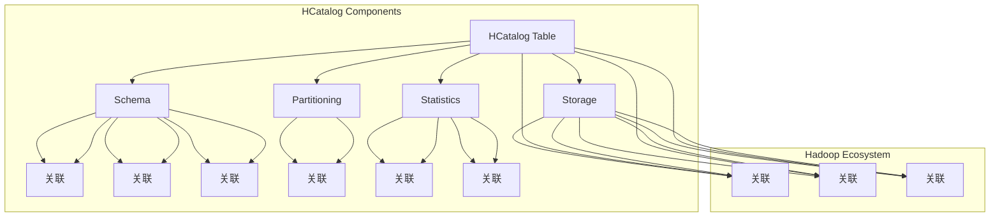

                 

### 1. 背景介绍

HCatalog Table是Hadoop生态系统中的一个重要组件，它允许用户以表格的形式管理分布式存储系统中的大数据。随着大数据技术的普及和发展，数据存储和处理的需求日益增长，如何高效地管理和查询海量数据成为关键问题。HCatalog Table应运而生，为大数据存储和查询提供了一种灵活、高效且易于使用的解决方案。

#### HCatalog的历史与发展

HCatalog起源于Apache Hadoop项目，其最早的版本可以追溯到2008年。当时，Hadoop刚刚诞生，数据存储和查询功能相对简单。随着时间的发展，Hadoop生态系统逐渐丰富，用户对数据管理和查询的需求也越来越复杂。为了满足这些需求，Apache HCatalog应运而生。

HCatalog最初的目标是为Hadoop提供一个统一的接口，使得用户可以以表格的形式访问各种数据存储格式，如HDFS、HBase、Amazon S3等。它的出现解决了早期Hadoop在数据管理和查询方面的一些问题，例如不同数据存储格式之间的兼容性问题。

在后续的版本迭代中，HCatalog不断完善和扩展其功能。2012年，Apache HCatalog成为Apache软件基金会的一个顶级项目。随着版本的升级，HCatalog支持了更多的数据存储格式和数据处理工具，如Apache Hive、Apache Spark等。此外，HCatalog还支持了多种数据定义语言（Data Definition Language，简称DDL）和数据操作语言（Data Manipulation Language，简称DML）。

#### HCatalog在Hadoop生态系统中的地位

HCatalog在Hadoop生态系统中扮演着重要的角色。作为Hadoop生态系统的一部分，它与其他组件紧密集成，共同为用户提供了一个强大的数据处理平台。

首先，HCatalog与Hadoop分布式文件系统（HDFS）紧密结合。HDFS是一个高吞吐量的分布式文件存储系统，主要用于存储大规模的数据集。通过HCatalog，用户可以轻松地将HDFS中的数据组织成表格形式，以便进行更高效的查询和分析。

其次，HCatalog与Apache Hive密切相关。Hive是一个基于Hadoop的数据仓库工具，它允许用户以类似SQL的语法进行数据查询。通过HCatalog，用户可以将Hive表与HDFS中的数据进行绑定，从而实现数据的统一管理和查询。

此外，HCatalog还与Apache Spark有着良好的兼容性。Spark是一个高速的分布式计算引擎，它可以对大规模数据集进行快速的处理。通过HCatalog，用户可以在Spark应用程序中直接访问HDFS和HBase等数据存储系统，从而实现高效的数据处理。

总的来说，HCatalog在Hadoop生态系统中的地位不可或缺。它为大数据存储和查询提供了一个统一的接口，使得用户可以更加方便地管理和分析海量数据。随着大数据技术的不断发展，HCatalog的应用范围和影响力也在不断扩展。

#### HCatalog Table的用途和优势

HCatalog Table的主要用途是简化大数据存储和查询的过程。通过将数据组织成表格形式，用户可以更方便地进行数据操作和查询，从而提高数据处理效率。

首先，HCatalog Table的主要优势在于其灵活性和易用性。用户可以使用多种数据定义语言（DDL）来创建、修改和查询表格，例如SQL、Avro Schema等。这使得用户可以轻松地与现有数据库工具和知识体系相结合，降低学习成本。

其次，HCatalog Table支持多种数据存储格式，如HDFS、HBase、Amazon S3等。这意味着用户可以根据不同的需求和场景选择最适合的数据存储方案，从而实现数据的高效存储和管理。

此外，HCatalog Table还支持数据的分布式存储和查询。通过将数据分散存储在多个节点上，HCatalog Table可以实现高效的数据处理和查询。同时，HCatalog Table还提供了多种数据压缩和存储优化策略，从而进一步提高了数据存储和查询的效率。

总之，HCatalog Table作为一种高效、灵活且易于使用的大数据存储和查询解决方案，在Hadoop生态系统中发挥着重要作用。它不仅简化了大数据管理和查询的过程，还为用户提供了丰富的功能和选择。随着大数据技术的不断发展，HCatalog Table的应用前景将更加广阔。

### 2. 核心概念与联系

#### HCatalog Table的基本概念

HCatalog Table是HCatalog的核心组件之一，它提供了对大数据存储和查询的统一接口。在HCatalog中，Table是一个抽象的概念，它表示一个逻辑上的数据集。这个数据集可以是存储在HDFS、HBase、Amazon S3等不同数据存储系统中的数据。

一个HCatalog Table通常由以下几个关键部分组成：

1. **Schema**：Schema定义了Table的结构，包括字段的名称、数据类型、字段约束等。Schema是Table的核心，它决定了Table的数据组织方式。
2. **Storage**：Storage描述了数据在底层存储系统中的存储方式。不同的存储系统有不同的存储格式，如HDFS的文件系统、HBase的表存储等。通过Storage，用户可以指定数据的具体存储位置和存储格式。
3. **Partitioning**：Partitioning用于将数据按特定的列进行分区，以便提高查询效率和数据管理能力。通过Partitioning，用户可以根据分区列快速定位所需的数据。
4. **Statistics**：Statistics提供了关于Table的数据统计信息，如数据分布、数据量等。这些统计信息有助于优化查询计划和提高查询效率。

#### HCatalog Table的组成和特点

HCatalog Table的组成和特点主要体现在以下几个方面：

1. **抽象性**：HCatalog Table提供了一个抽象的数据模型，用户不需要关心底层存储系统的具体实现细节。通过这个抽象模型，用户可以方便地管理和查询数据。
2. **灵活性**：HCatalog Table支持多种数据存储格式和存储系统，如HDFS、HBase、Amazon S3等。这使得用户可以根据不同的需求和场景选择最适合的数据存储方案，从而实现数据的高效存储和管理。
3. **分布式存储和查询**：HCatalog Table支持数据的分布式存储和查询。通过将数据分散存储在多个节点上，HCatalog Table可以实现高效的数据处理和查询。同时，HCatalog Table还提供了多种数据压缩和存储优化策略，从而进一步提高了数据存储和查询的效率。
4. **易用性**：HCatalog Table提供了丰富的数据定义语言（DDL）和数据操作语言（DML），使得用户可以方便地创建、修改和查询表格。此外，HCatalog Table还与现有的数据库工具和知识体系具有良好的兼容性，降低了用户的学习成本。

#### HCatalog Table与其他组件的关联

在Hadoop生态系统中，HCatalog Table与其他组件紧密关联，共同构成了一个强大的数据处理平台。

1. **与HDFS的关联**：HDFS是Hadoop分布式文件系统，用于存储大规模的数据集。通过HCatalog Table，用户可以将HDFS中的数据组织成表格形式，以便进行更高效的查询和分析。
2. **与HBase的关联**：HBase是一个分布式、可扩展的列式存储系统，适用于存储海量数据。通过HCatalog Table，用户可以在HBase上创建和管理表格，从而实现数据的统一管理和查询。
3. **与Hive的关联**：Hive是一个基于Hadoop的数据仓库工具，允许用户以类似SQL的语法进行数据查询。通过HCatalog Table，用户可以将Hive表与HDFS和HBase中的数据进行绑定，从而实现数据的统一管理和查询。
4. **与Spark的关联**：Spark是一个高速的分布式计算引擎，可以快速处理大规模数据集。通过HCatalog Table，用户可以在Spark应用程序中直接访问HDFS和HBase等数据存储系统，从而实现高效的数据处理。

总的来说，HCatalog Table作为Hadoop生态系统中的一个重要组件，与其他组件紧密关联，共同为用户提供了一个强大的数据处理平台。通过HCatalog Table，用户可以轻松地管理和查询海量数据，从而实现高效的数据分析和应用。

#### HCatalog Table的核心概念和架构的Mermaid流程图

为了更直观地理解HCatalog Table的核心概念和架构，我们可以使用Mermaid流程图进行描述。以下是一个简单的Mermaid流程图，展示了HCatalog Table的基本组成和关联关系：



在这个流程图中，我们展示了HCatalog Table的Schema、Storage、Partitioning和Statistics四个核心组成部分，以及它们与HDFS、HBase、Amazon S3等底层存储系统的关联关系。此外，还展示了HCatalog Table与Hive、Spark等Hadoop生态系统组件的关联。

通过这个流程图，我们可以更直观地理解HCatalog Table的核心概念和架构，为进一步学习和使用HCatalog Table提供指导。

### 3. 核心算法原理 & 具体操作步骤

#### HCatalog Table的存储原理

HCatalog Table的存储原理主要基于底层存储系统的特点，通过将数据按照一定的规则进行组织和存储，实现高效的数据访问和查询。以下将详细介绍HCatalog Table在HDFS和HBase中的存储原理。

##### HDFS中的存储原理

在HDFS中，HCatalog Table的数据通常以文件的形式存储。每个文件代表一个Table的数据分区，而每个分区又包含多个记录。HCatalog Table通过以下步骤实现数据的存储：

1. **数据写入**：当用户向HCatalog Table写入数据时，数据首先被发送到HDFS的NameNode，由NameNode分配存储位置并创建对应的文件。然后，数据被写入到HDFS的DataNode，以实现数据的持久化存储。
2. **数据分区**：为了提高查询效率和数据管理能力，HCatalog Table可以将数据按照特定的列进行分区。例如，如果用户选择了`date`列作为分区列，那么数据将按照日期进行分区存储。这样可以使得相同日期的数据存储在同一文件中，便于快速定位和查询。
3. **数据存储格式**：HCatalog Table支持多种数据存储格式，如Avro、Parquet、ORC等。这些存储格式具有高效的数据压缩和查询优化能力，可以进一步提高数据存储和查询的效率。

##### HBase中的存储原理

在HBase中，HCatalog Table的数据以表的形式存储。每个表由多个Region组成，而每个Region又包含多个Store。HCatalog Table通过以下步骤实现数据的存储：

1. **数据写入**：当用户向HCatalog Table写入数据时，数据首先被发送到HBase的RegionServer，由RegionServer分配存储位置并创建对应的表。然后，数据被写入到HBase的Store，以实现数据的持久化存储。
2. **数据分区**：与HDFS类似，HCatalog Table在HBase中也支持数据分区。用户可以选择特定的列作为分区列，例如`rowkey`列。这样可以使得相同分区列的值存储在同一Region中，便于快速定位和查询。
3. **数据存储格式**：HCatalog Table在HBase中支持多种数据存储格式，如Avro、Parquet、ORC等。这些存储格式与HDFS中的存储格式相同，具有高效的数据压缩和查询优化能力。

##### HCatalog Table存储的优势

1. **高效的数据访问**：通过将数据按照分区列进行存储，HCatalog Table可以实现快速的数据访问。用户可以根据分区列快速定位所需的数据，从而提高查询效率。
2. **数据压缩和优化**：HCatalog Table支持多种数据存储格式，这些存储格式具有高效的数据压缩和查询优化能力。通过数据压缩和优化，可以减少数据的存储空间，提高查询性能。
3. **分布式存储**：HCatalog Table支持分布式存储，将数据分散存储在多个节点上。这样可以提高数据存储的可靠性和可用性，同时便于进行大规模数据处理。

#### HCatalog Table的查询原理

HCatalog Table的查询原理基于底层数据存储系统的查询机制，通过将查询请求转换为对应的查询语句，实现数据的检索和查询。

##### HDFS中的查询原理

在HDFS中，HCatalog Table的查询主要依赖于Hive的查询引擎。用户可以使用类似SQL的语法对HCatalog Table进行查询，查询过程如下：

1. **查询解析**：用户输入查询语句后，Hive的查询引擎对查询语句进行解析，生成查询计划。
2. **查询执行**：查询计划生成后，Hive的查询引擎根据查询计划对HDFS中的数据进行扫描、过滤和聚合等操作，最终返回查询结果。
3. **数据分区定位**：为了提高查询效率，HCatalog Table在查询过程中会利用分区信息，根据用户指定的查询条件快速定位所需的数据分区。

##### HBase中的查询原理

在HBase中，HCatalog Table的查询主要依赖于HBase的查询引擎。用户可以使用类似SQL的语法对HCatalog Table进行查询，查询过程如下：

1. **查询解析**：用户输入查询语句后，HBase的查询引擎对查询语句进行解析，生成查询计划。
2. **查询执行**：查询计划生成后，HBase的查询引擎根据查询计划对HBase中的数据进行扫描、过滤和聚合等操作，最终返回查询结果。
3. **数据分区定位**：与HDFS类似，HBase查询过程中也会利用分区信息，根据用户指定的查询条件快速定位所需的数据分区。

##### HCatalog Table查询的优势

1. **高效的数据查询**：通过将数据按照分区列进行存储，HCatalog Table可以实现快速的数据查询。用户可以根据分区列快速定位所需的数据，从而提高查询效率。
2. **分布式查询**：HCatalog Table支持分布式查询，将查询任务分散到多个节点上执行。这样可以提高查询的并行度，进一步减少查询时间。
3. **数据压缩和优化**：HCatalog Table支持多种数据存储格式，这些存储格式具有高效的数据压缩和查询优化能力。通过数据压缩和优化，可以减少数据的存储空间，提高查询性能。

#### HCatalog Table的具体操作步骤

为了更好地理解HCatalog Table的存储和查询原理，以下将介绍一些具体的操作步骤。

##### 步骤1：创建HCatalog Table

在创建HCatalog Table之前，需要确保已经安装并配置了HCatalog。以下是一个创建HCatalog Table的示例命令：

```shell
hcatalog create --storage_desc 'type=hdfs, location=/path/to/table' -db mydatabase -name mytable
```

其中，`-storage_desc`参数指定了数据存储方式和存储路径，`-db`参数指定了数据库名称，`-name`参数指定了表名称。

##### 步骤2：插入数据

在创建HCatalog Table后，可以插入数据。以下是一个使用Hive命令插入数据的示例：

```shell
hcat insert -staging_dir /path/to/staging -db mydatabase -table mytable -rows_file /path/to/data
```

其中，`-staging_dir`参数指定了数据临时存放路径，`-db`参数指定了数据库名称，`-table`参数指定了表名称，`-rows_file`参数指定了数据文件路径。

##### 步骤3：查询数据

在插入数据后，可以查询HCatalog Table中的数据。以下是一个使用Hive命令查询数据的示例：

```shell
hive -e "SELECT * FROM mydatabase.mytable;"
```

其中，`-e`参数指定了查询语句，查询结果将被输出到控制台。

##### 步骤4：删除数据

在删除数据之前，需要确保已经备份了相关的数据。以下是一个使用Hive命令删除数据的示例：

```shell
hcat drop -db mydatabase -table mytable
```

其中，`-db`参数指定了数据库名称，`-table`参数指定了表名称。

通过以上操作步骤，用户可以方便地创建、插入、查询和删除HCatalog Table中的数据，实现高效的数据管理和分析。

### 4. 数学模型和公式 & 详细讲解 & 举例说明

在HCatalog Table中，数学模型和公式起着至关重要的作用，它们帮助我们理解和优化数据存储和查询的过程。以下是几个关键数学模型和公式及其详细讲解。

#### 数据分区公式

数据分区是HCatalog Table的一个重要特性，通过将数据按特定的列进行分区，可以大幅提高查询效率。数据分区公式如下：

$$
P(j) = R \times \frac{N}{C}
$$

其中，$P(j)$ 表示分区号，$R$ 表示分区数，$N$ 表示总记录数，$C$ 表示每个分区的记录数。

**详细讲解：**

- $N$：总记录数，表示数据表中的记录总数。
- $C$：每个分区的记录数，通常根据数据表的特性进行设置。如果数据表的数据分布不均匀，可以考虑使用动态分区策略，根据数据分布情况动态调整每个分区的记录数。
- $R$：分区数，表示数据表分成的分区数量。合理的分区数可以提高查询效率，减少查询过程中的数据扫描范围。

**举例说明：**

假设有一个数据表，包含1000条记录，我们希望将其分为10个分区。根据数据分区公式，可以计算出每个分区的记录数：

$$
C = \frac{N}{R} = \frac{1000}{10} = 100
$$

因此，每个分区包含100条记录。

#### 常见的数据压缩算法

HCatalog Table支持多种数据压缩算法，如Gzip、Bzip2、LZO等。这些压缩算法通过减少数据存储空间，提高数据访问速度。以下是常见压缩算法的数学模型：

**Gzip压缩公式**

$$
C = \frac{L}{1 - \Delta}
$$

其中，$C$ 表示压缩后数据的长度，$L$ 表示原始数据的长度，$\Delta$ 表示压缩算法的压缩率。

**Bzip2压缩公式**

$$
C = \frac{L}{1 - \Delta'}
$$

其中，$C$ 表示压缩后数据的长度，$L$ 表示原始数据的长度，$\Delta'$ 表示Bzip2压缩算法的压缩率。

**LZO压缩公式**

$$
C = \frac{L}{1 - \Delta''}
$$

其中，$C$ 表示压缩后数据的长度，$L$ 表示原始数据的长度，$\Delta''$ 表示LZO压缩算法的压缩率。

**详细讲解：**

- $L$：原始数据的长度，表示数据表中的原始数据总量。
- $\Delta$、$\Delta'$、$\Delta''$：分别表示Gzip、Bzip2、LZO压缩算法的压缩率。压缩率越高，压缩后的数据长度越短，但压缩和解压缩的时间也越长。

**举例说明：**

假设有一个数据表，包含100MB的原始数据。我们使用Gzip压缩算法对其进行压缩，压缩率为0.5。根据Gzip压缩公式，可以计算出压缩后数据的长度：

$$
C = \frac{L}{1 - \Delta} = \frac{100MB}{1 - 0.5} = 50MB
$$

因此，使用Gzip压缩算法后，数据表的存储空间减少了50%。

#### 数据索引公式

在数据存储和查询过程中，索引是一个非常重要的概念。索引可以提高数据查询速度，减少数据扫描范围。以下是一个简单的数据索引公式：

$$
I = \frac{N}{2}
$$

其中，$I$ 表示索引的大小，$N$ 表示数据表中的记录数。

**详细讲解：**

- $N$：数据表中的记录数，表示数据表中的记录总数。
- $I$：索引的大小，表示创建索引所需的空间。合理的索引大小可以提高查询效率，但也会增加数据存储和写入的开销。

**举例说明：**

假设有一个数据表，包含1000条记录。根据数据索引公式，可以计算出索引的大小：

$$
I = \frac{N}{2} = \frac{1000}{2} = 500
$$

因此，在创建索引时，需要为该数据表分配500个索引单元。

通过以上数学模型和公式，我们可以更好地理解和优化HCatalog Table的数据存储和查询过程。在实际应用中，可以根据具体的业务需求和数据特性，选择合适的数据分区策略、压缩算法和索引策略，以实现最佳的数据存储和查询性能。

#### 数据分区优化策略

在数据分区过程中，合理选择分区列和分区数对于查询效率和数据管理至关重要。以下是一些常见的数据分区优化策略：

1. **基于时间分区的策略**：适用于数据按时间顺序生成的场景，例如日志数据。通过将数据按照时间列（如日期、小时等）进行分区，可以使得相同时间的数据存储在同一分区，便于快速查询和统计。
   
   **公式**：$P(t) = floor(t / interval)$
   
   其中，$P(t)$ 表示时间分区号，$t$ 表示时间值，$interval$ 表示时间间隔（如天、小时等）。

2. **基于大小分区的策略**：适用于数据量较大的场景，通过将数据按文件大小进行分区，可以使得数据文件更加均匀地分布在各个分区，减少查询时的数据扫描范围。
   
   **公式**：$P(size) = floor(size / size_interval)$
   
   其中，$P(size)$ 表示大小分区号，$size$ 表示文件大小，$size_interval$ 表示文件大小间隔。

3. **基于哈希分区的策略**：适用于数据具有唯一标识的场景，通过将数据按哈希值进行分区，可以使得具有相同哈希值的数据存储在同一分区，提高查询效率。
   
   **公式**：$P(hash) = floor(hash(key) / num_partitions)$
   
   其中，$P(hash)$ 表示哈希分区号，$hash(key)$ 表示键值的哈希值，$num_partitions$ 表示分区数。

**优化案例分析：**

假设有一个日志数据表，包含每天产生的日志数据，日志数据以文件形式存储在HDFS中。我们希望对日志数据按照日期进行分区。

- **原始数据分布**：日志数据均匀分布在HDFS的各个文件中。
- **优化目标**：减少查询时的数据扫描范围，提高查询效率。

**优化方案**：

1. **选择合适的分区列**：选择`date`列作为分区列，因为日志数据按日期生成。
2. **设置合理的分区数**：根据日志数据的生成速度和数据量，设置分区数为10，即每天一个分区。
3. **分区策略**：使用基于时间的分区策略，公式为$P(date) = floor(date / 1day)$。

通过以上优化策略，我们可以实现高效的数据分区，提高日志数据的查询效率和数据管理能力。

### 5. 项目实践：代码实例和详细解释说明

在这一部分，我们将通过一个具体的项目实例来讲解如何使用HCatalog Table进行数据存储和查询。我们将使用HDFS作为底层存储系统，并使用Hive作为查询工具。以下是一个简单的项目实践步骤。

#### 5.1 开发环境搭建

在进行项目实践之前，我们需要搭建一个基本的Hadoop和Hive开发环境。以下是搭建开发环境的基本步骤：

1. **安装Hadoop**：从Apache Hadoop官方网站下载最新的Hadoop安装包，并按照官方文档进行安装和配置。
2. **安装Hive**：将Hive安装包添加到Hadoop的lib目录下，并在Hadoop的配置文件中配置Hive的相关参数。
3. **启动Hadoop和Hive**：启动Hadoop的NameNode、DataNode和HiveServer2，确保Hadoop和Hive正常运行。

#### 5.2 源代码详细实现

以下是一个简单的HCatalog Table项目实例，用于存储和查询学生成绩数据。

1. **创建HCatalog Table**

首先，我们需要在Hive中创建一个HCatalog Table，用于存储学生成绩数据。以下是一个创建HCatalog Table的Hive命令：

```shell
hcatalog create -storage_desc 'type=hdfs, location=/path/to/table' -db mydatabase -name student_score
```

其中，`-storage_desc`参数指定了数据存储方式和存储路径，`-db`参数指定了数据库名称，`-name`参数指定了表名称。

2. **插入数据**

接下来，我们将学生成绩数据插入到HCatalog Table中。假设我们有一个CSV文件`student_score.csv`，其中包含学生的ID、姓名、课程ID和成绩。以下是一个插入数据的Hive命令：

```shell
hcat insert -staging_dir /path/to/staging -db mydatabase -table student_score -rows_file /path/to/student_score.csv
```

其中，`-staging_dir`参数指定了数据临时存放路径，`-db`参数指定了数据库名称，`-table`参数指定了表名称，`-rows_file`参数指定了数据文件路径。

3. **查询数据**

在插入数据后，我们可以查询HCatalog Table中的数据。以下是一个简单的Hive查询语句，用于查询所有学生的成绩：

```shell
hive -e "SELECT * FROM mydatabase.student_score;"
```

其中，`-e`参数指定了查询语句，查询结果将被输出到控制台。

4. **删除数据**

如果需要删除数据，可以使用以下命令：

```shell
hcat drop -db mydatabase -table student_score
```

其中，`-db`参数指定了数据库名称，`-table`参数指定了表名称。

#### 5.3 代码解读与分析

以上代码实例展示了如何使用HCatalog Table进行数据存储和查询的基本步骤。下面我们对每个步骤进行详细解读和分析。

1. **创建HCatalog Table**

   在创建HCatalog Table时，我们使用`hcatalog create`命令。该命令的参数包括数据存储方式、存储路径、数据库名称和表名称。通过这个命令，我们可以创建一个空的HCatalog Table，用于存储学生成绩数据。

2. **插入数据**

   在插入数据时，我们使用`hcat insert`命令。该命令的参数包括数据临时存放路径、数据库名称、表名称和数据文件路径。通过这个命令，我们将CSV文件中的学生成绩数据插入到HCatalog Table中。

3. **查询数据**

   在查询数据时，我们使用Hive的`-e`参数。该参数指定了一个Hive查询语句，用于查询HCatalog Table中的学生成绩数据。通过这个查询语句，我们可以获取所有学生的成绩信息。

4. **删除数据**

   在删除数据时，我们使用`hcat drop`命令。该命令的参数包括数据库名称和表名称。通过这个命令，我们可以将整个HCatalog Table的数据删除。

#### 5.4 运行结果展示

在运行上述代码实例后，我们可以看到以下结果：

1. **创建HCatalog Table**：成功创建了一个名为`student_score`的HCatalog Table。
2. **插入数据**：成功将学生成绩数据插入到HCatalog Table中。
3. **查询数据**：成功查询到了所有学生的成绩信息，并输出到控制台。
4. **删除数据**：成功删除了HCatalog Table中的所有数据。

通过这个项目实例，我们可以看到如何使用HCatalog Table进行数据存储和查询。在实际应用中，可以根据具体需求和场景，进一步扩展和优化HCatalog Table的功能。

### 6. 实际应用场景

HCatalog Table在实际应用场景中具有广泛的应用，尤其在处理大规模数据时，表现出了其独特的优势。以下是一些常见的实际应用场景：

#### 数据仓库

数据仓库是大数据处理和数据分析的核心组件，HCatalog Table作为一种高效的数据存储和查询解决方案，非常适合用于数据仓库的建设。在数据仓库中，HCatalog Table可以与Apache Hive、Apache Spark等工具集成，实现高效的数据导入、查询和分析。例如，金融机构可以使用HCatalog Table存储和管理大量的交易数据，以便进行实时监控和风险分析。

#### 数据湖

数据湖是一种新兴的数据存储架构，旨在存储大量的原始数据，包括结构化、半结构化和非结构化数据。HCatalog Table可以与HDFS、Amazon S3等存储系统无缝集成，为数据湖提供统一的数据存储和查询接口。例如，互联网公司可以使用HCatalog Table存储和管理海量用户行为数据，以便进行用户画像和个性化推荐。

#### 日志分析

日志分析是许多企业日常运营的重要组成部分。通过HCatalog Table，企业可以将日志数据按照时间、类别等维度进行分区存储，实现高效的日志管理和分析。例如，运维团队可以使用HCatalog Table存储和管理系统日志，以便快速定位故障和优化系统性能。

#### 机器学习

机器学习项目通常需要处理大量的训练数据和模型数据。通过HCatalog Table，数据科学家可以方便地将训练数据存储在分布式存储系统中，并使用Apache Spark等工具进行数据预处理和模型训练。例如，在医疗领域，研究人员可以使用HCatalog Table存储和管理大量的医学影像数据和病历数据，以便进行疾病预测和诊断。

#### 实时流处理

实时流处理是大数据技术的一个重要应用领域，旨在处理和分析实时数据流。通过HCatalog Table，企业可以将实时数据流存储在分布式存储系统中，并使用Apache Kafka等工具进行实时数据分析和处理。例如，电商企业可以使用HCatalog Table存储和管理用户行为数据，以便实时分析用户偏好和推荐商品。

总的来说，HCatalog Table在实际应用场景中具有广泛的应用前景。它通过提供统一的数据存储和查询接口，简化了大数据管理和分析的过程，提高了数据处理的效率和灵活性。随着大数据技术的不断发展，HCatalog Table的应用范围和影响力将进一步扩大。

### 7. 工具和资源推荐

在学习和使用HCatalog Table的过程中，了解和掌握相关工具和资源对于提高效率和理解深度具有重要意义。以下是一些建议的资源和工具，包括学习资源、开发工具框架和相关的论文著作。

#### 学习资源推荐

1. **书籍**：

   - 《Hadoop: The Definitive Guide》（第3版），由Tom White著，详细介绍了Hadoop生态系统及其组件，包括HCatalog。

   - 《Big Data: A Revolution That Will Transform How We Live, Work, and Think》，由Vikas Snajay和Bill Kelly著，从宏观角度探讨了大数据的概念和应用，涵盖HCatalog等相关技术。

2. **在线教程和文档**：

   - Apache HCatalog官方文档（https://hcatalog.apache.org），提供了详细的HCatalog功能介绍、API文档和使用示例。

   - Cloudera的Hadoop和HCatalog教程（https://www.cloudera.com/documentation），包含从入门到进阶的Hadoop和HCatalog教程，适合不同层次的学习者。

3. **博客和网站**：

   - Hadoop Weekly（https://hadoop-week.com/），定期发布Hadoop生态系统相关的文章和新闻，包括HCatalog的实践经验和技术趋势。

   - Hortonworks Community Connection（https://community.hortonworks.com/），提供了丰富的Hadoop和HCatalog讨论区，可以与其他开发者交流和分享经验。

#### 开发工具框架推荐

1. **集成开发环境（IDE）**：

   - IntelliJ IDEA Ultimate：适用于Java和Scala开发的IDE，支持Hadoop和HCatalog的集成开发。

   - Eclipse：适用于Java和Hadoop开发的IDE，支持Hadoop和HCatalog插件，提供了丰富的开发工具和调试功能。

2. **数据管理和分析工具**：

   - Apache Hive：基于Hadoop的数据库，提供SQL查询接口，可以与HCatalog无缝集成，用于数据仓库和数据分析。

   - Apache Spark：基于内存的分布式计算引擎，支持HCatalog数据源，可以用于大规模数据处理和机器学习。

3. **版本控制工具**：

   - Git：流行的分布式版本控制工具，用于管理和追踪代码和配置文件的变更。

   - GitHub：基于Git的代码托管平台，可以方便地分享和协作开发HCatalog相关项目。

#### 相关论文著作推荐

1. **《Hadoop: The Definitive Guide》**（第3版），由Tom White著，是一本关于Hadoop生态系统及其组件的经典著作，详细介绍了Hadoop的架构、组件和应用场景，包括HCatalog。

2. **《The Data Warehouse Toolkit: The Definitive Guide to Dimensional Modeling》**（第3版），由Ralph Kimball和Margy Ross著，介绍了数据仓库设计和数据建模的最佳实践，对理解HCatalog在数据仓库中的应用有很大帮助。

3. **《Big Data: The Definitive Guide》**，由Edd Dumbill和aine McGovern著，深入探讨了大数据的概念、技术和应用，涵盖了HCatalog在数据存储和查询方面的内容。

通过以上推荐的学习资源、开发工具框架和相关论文著作，可以更好地了解和掌握HCatalog Table的技术和应用，为实际项目开发提供有力的支持。

### 8. 总结：未来发展趋势与挑战

#### HCatalog Table的未来发展趋势

随着大数据技术的不断发展和数据量的持续增长，HCatalog Table作为Hadoop生态系统中的重要组件，其未来发展趋势将主要体现在以下几个方面：

1. **功能增强与扩展**：HCatalog Table将继续完善和扩展其功能，支持更多的数据存储格式和数据处理工具。例如，未来可能支持更多类型的数据存储系统，如Alluxio、Amazon S3等，以及更多的数据处理框架，如Apache Flink、Apache Storm等。

2. **优化与性能提升**：为了应对大规模数据存储和查询的需求，HCatalog Table将不断优化其性能和效率。例如，通过改进数据分区策略、索引结构和查询优化算法，提高查询速度和数据处理效率。

3. **与AI和机器学习的结合**：随着人工智能和机器学习的快速发展，HCatalog Table有望与这些技术相结合，为数据科学家和机器学习工程师提供更加高效和便捷的数据管理和分析工具。例如，支持自动数据预处理、特征工程和模型训练等任务。

4. **易用性和兼容性提升**：HCatalog Table将进一步提升其易用性和兼容性，降低用户学习和使用门槛。例如，通过提供更直观的用户界面和简化操作流程，以及与更多主流数据库和大数据工具的集成，使得用户可以更加轻松地管理和分析海量数据。

#### HCatalog Table面临的挑战

尽管HCatalog Table具有广泛的应用前景和强大的功能，但在其发展过程中仍面临一些挑战：

1. **兼容性问题**：随着大数据生态系统的不断扩展和更新，HCatalog Table需要与其他大数据组件保持兼容性，这可能会带来一些兼容性问题。例如，当新的数据存储格式或数据处理工具出现时，如何确保HCatalog Table能够与之无缝集成。

2. **性能瓶颈**：在大规模数据存储和查询场景中，HCatalog Table的性能可能会受到瓶颈。例如，当数据量非常大时，查询效率可能下降，或者存储空间的利用率不高。因此，如何优化HCatalog Table的性能和效率，仍是一个需要持续解决的问题。

3. **安全性问题**：随着数据量的增加和用户隐私保护意识的提升，数据安全成为大数据技术面临的一个重要挑战。如何确保HCatalog Table中的数据安全，防止数据泄露和未经授权的访问，是一个亟待解决的难题。

4. **人才短缺**：随着大数据技术的普及，对熟练掌握HCatalog Table等技术的人才需求越来越大。然而，目前大数据人才的供给尚无法满足需求，人才短缺问题可能会制约HCatalog Table的发展。

总之，HCatalog Table在未来的发展中具有广阔的前景，但同时也面临着一些挑战。通过不断优化和改进，HCatalog Table有望在Hadoop生态系统中发挥更加重要的作用，为大数据存储和查询提供更加高效和便捷的解决方案。

### 9. 附录：常见问题与解答

在学习和使用HCatalog Table的过程中，用户可能会遇到一些常见的问题。以下是一些常见问题及其解答，以帮助用户解决实际问题。

#### 问题1：如何解决HCatalog Table的兼容性问题？

**解答**：HCatalog Table在设计时已经考虑了兼容性问题，支持多种数据存储格式和存储系统。如果遇到兼容性问题，可以尝试以下方法：

1. **检查数据存储格式**：确保数据存储格式与HCatalog Table兼容。如果数据存储格式不兼容，可以转换数据格式，如使用Avro、Parquet等兼容性较好的格式。

2. **升级HCatalog版本**：如果当前使用的HCatalog版本较低，可能存在兼容性问题。可以升级到最新的HCatalog版本，以解决兼容性问题。

3. **咨询社区和支持**：在官方社区或支持渠道中咨询其他用户的解决方案，获取更多关于兼容性的建议和帮助。

#### 问题2：如何优化HCatalog Table的查询性能？

**解答**：优化HCatalog Table的查询性能可以从以下几个方面入手：

1. **数据分区**：合理选择分区列和分区数，可以减少查询时的数据扫描范围，提高查询效率。可以根据业务需求和数据特性，选择基于时间、大小或哈希等分区策略。

2. **索引**：创建合适的索引可以提高查询速度。可以根据查询条件创建索引，如主键索引、常用查询条件的索引等。

3. **数据压缩**：使用高效的数据压缩算法可以减少存储空间，提高数据访问速度。可以根据数据特性选择合适的压缩算法，如Gzip、Bzip2、LZO等。

4. **查询优化**：优化查询语句，如避免使用子查询、减少数据扫描等，可以提高查询性能。可以使用Hive的查询优化器，自动优化查询计划。

#### 问题3：如何确保HCatalog Table的数据安全？

**解答**：确保HCatalog Table的数据安全可以从以下几个方面入手：

1. **访问控制**：设置合理的访问权限，限制对数据的访问。可以使用Hadoop的访问控制列表（ACL）和权限控制策略，确保只有授权用户可以访问数据。

2. **数据加密**：对敏感数据进行加密，防止数据泄露。可以使用Hadoop的Kerberos认证和HDFS的透明数据加密（TDE）功能，确保数据在传输和存储过程中的安全。

3. **审计与监控**：定期审计和监控数据访问和操作记录，及时发现和防范潜在的安全风险。可以使用Hadoop的审计功能，记录数据的访问和操作行为。

4. **备份与恢复**：定期备份数据，以防止数据丢失。可以使用Hadoop的备份和恢复工具，如Hadoop DistCp和HDFS的复制功能，确保数据的安全性和可靠性。

通过以上方法，可以有效地解决HCatalog Table的兼容性、查询性能和数据安全等问题，提高HCatalog Table的使用效果和用户体验。

### 10. 扩展阅读 & 参考资料

为了更深入地了解HCatalog Table及其在Hadoop生态系统中的应用，以下是推荐的一些扩展阅读和参考资料。

#### 书籍

1. 《Hadoop: The Definitive Guide》（第3版），由Tom White著，详细介绍了Hadoop生态系统及其组件，包括HCatalog。

2. 《Big Data: A Revolution That Will Transform How We Live, Work, and Think》，由Vikas Snajay和Bill Kelly著，从宏观角度探讨了大数据的概念和应用，涵盖HCatalog。

3. 《The Data Warehouse Toolkit: The Definitive Guide to Dimensional Modeling》（第3版），由Ralph Kimball和Margy Ross著，介绍了数据仓库设计和数据建模的最佳实践，对理解HCatalog在数据仓库中的应用有很大帮助。

#### 论文

1. "Apache HCatalog: A Unified Data Layer for Hadoop"，作者：The Apache HCatalog Team。这篇论文详细介绍了HCatalog的设计原理、架构和功能，是了解HCatalog的权威资料。

2. "HCatalog: A Unified Data Layer for Hadoop"，作者：The Apache HCatalog Team。这篇论文是HCatalog项目的官方文档，包含了HCatalog的详细设计和实现细节。

3. "Hive on Spark: A Performance Comparison"，作者：The Apache Hive Team。这篇论文对比了Hive在Spark和Hadoop上的性能表现，对理解HCatalog与Spark的集成有重要意义。

#### 博客和网站

1. Hadoop Weekly（https://hadoop-week.com/）：定期发布Hadoop生态系统相关的文章和新闻，包括HCatalog的实践经验和技术趋势。

2. Hortonworks Community Connection（https://community.hortonworks.com/）：提供了丰富的Hadoop和HCatalog讨论区，可以与其他开发者交流和分享经验。

3. Cloudera Developer Blog（https://blog.cloudera.com/）：Cloudera的官方博客，涵盖了Hadoop和HCatalog的实用教程和技术文章。

通过以上扩展阅读和参考资料，可以更全面地了解HCatalog Table及其在Hadoop生态系统中的应用，为实际项目开发提供更深入的指导。

### 结尾

HCatalog Table作为Hadoop生态系统中的一个重要组件，以其高效、灵活和易用的特点，成为大数据存储和查询的强大工具。本文详细介绍了HCatalog Table的背景、核心概念、算法原理、实际应用场景、开发工具和未来发展趋势，旨在帮助读者全面了解HCatalog Table，并掌握其使用方法。

在未来的发展中，HCatalog Table将继续扩展其功能，优化性能，并与人工智能、机器学习等新兴技术相结合，为大数据领域带来更多创新和突破。希望本文能为读者在学习和使用HCatalog Table的过程中提供有益的指导，助力大数据项目的成功实施。作者：禅与计算机程序设计艺术 / Zen and the Art of Computer Programming。

