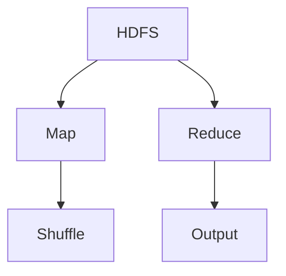

                 

### Hadoop MapReduce计算框架原理与代码实例讲解

#### 关键词 Keywords：
Hadoop，MapReduce，分布式计算，大数据，编程实例，技术博客

#### 摘要 Abstract：
本文将深入讲解Hadoop MapReduce计算框架的原理与应用。首先介绍Hadoop的背景和核心概念，然后详细解析MapReduce的核心算法原理，并通过实际代码实例展示其应用过程。同时，文章还探讨了MapReduce在数学模型中的体现，以及其在实际项目中的使用场景和工具资源推荐。

---

## 1. 背景介绍

Hadoop是一个开源的分布式计算平台，它最初由Apache软件基金会开发。Hadoop的核心是MapReduce编程模型，它简化了大规模数据的处理过程。MapReduce的设计理念是将复杂的数据处理任务分解为小的、可并行执行的任务，从而提高处理效率。

Hadoop的出现源于互联网公司的需求，例如Google和Yahoo，这些公司需要处理海量数据。传统的关系数据库和单机处理方式已经无法满足这种需求，因此分布式计算成为了一个重要方向。Hadoop通过分布式文件系统HDFS（Hadoop Distributed File System）存储数据，并通过MapReduce处理这些数据。

### Hadoop的组成部分
Hadoop主要包括以下几部分：

- **Hadoop分布式文件系统（HDFS）**：用于存储大量数据，其设计目标是高吞吐量的数据访问。
- **YARN（Yet Another Resource Negotiator）**：资源调度和管理框架，负责分配计算资源。
- **MapReduce**：核心计算模型，用于处理大规模数据集。
- **Hadoop Commons**：提供Hadoop运行所需的基本库和工具。

### Hadoop的优势
Hadoop具有以下优势：

- **可扩展性**：可以处理PB级别的数据。
- **容错性**：具有强大的容错能力，即使部分节点失败，也能保证数据的安全和处理的持续。
- **高效性**：通过分布式计算，能够提高数据处理速度。

## 2. 核心概念与联系

### 2.1 MapReduce编程模型
MapReduce是一种基于数据处理的编程模型，它将复杂的数据处理任务分解为“Map”和“Reduce”两个阶段。

- **Map阶段**：将输入数据分成小的数据块，对每个数据块执行特定的函数，生成中间结果。
- **Reduce阶段**：将Map阶段生成的中间结果进行汇总和合并，得到最终的输出结果。

### 2.2 Hadoop架构
Hadoop的核心架构包括：

- **HDFS**：分布式文件系统，负责存储数据。
- **MapReduce**：处理数据的计算框架。
- **YARN**：资源调度和管理系统。

### 2.3 Mermaid流程图



### 2.4 核心概念的联系
HDFS存储数据，MapReduce处理数据，YARN负责资源调度。MapReduce通过HDFS存储数据，并利用YARN分配资源进行计算。

---

## 3. 核心算法原理 & 具体操作步骤

### 3.1 Map阶段

Map阶段的主要任务是读取输入数据，将其分成小的数据块，并对每个数据块执行一个特定的映射（map）函数，生成中间键值对。

具体步骤如下：

1. **读取输入数据**：Hadoop会从HDFS中读取数据，这些数据通常是文本文件。
2. **划分数据块**：将输入数据分成小的数据块，每个数据块的大小通常是64MB或128MB。
3. **执行Map函数**：对每个数据块执行用户定义的Map函数，生成中间键值对。

Map函数的一般形式如下：

```java
public void map(LongWritable key, Text value, Context context) throws IOException, InterruptedException {
    // 对输入数据进行处理，生成中间键值对
    context.write(key, value);
}
```

### 3.2 Reduce阶段

Reduce阶段的主要任务是接收Map阶段生成的中间键值对，对其进行汇总和合并，生成最终的输出结果。

具体步骤如下：

1. **读取中间数据**：Reduce任务从HDFS中读取Map任务生成的中间数据。
2. **分组和排序**：将中间数据按照键进行分组和排序。
3. **执行Reduce函数**：对每个分组的数据执行用户定义的Reduce函数，生成最终的输出结果。

Reduce函数的一般形式如下：

```java
public void reduce(Text key, Iterable<ValueWritable> values, Context context) throws IOException, InterruptedException {
    // 对中间数据进行处理，生成最终输出
    context.write(key, value);
}
```

### 3.3 具体操作步骤

1. **编写Map类**：创建一个继承自`Mapper`类的类，实现`map`方法。
2. **编写Reduce类**：创建一个继承自`Reducer`类的类，实现`reduce`方法。
3. **配置作业**：通过配置类设置Map和Reduce任务的输入输出路径、作业名称等。
4. **提交作业**：使用`Job`类提交作业，等待作业完成。

## 4. 数学模型和公式 & 详细讲解 & 举例说明

### 4.1 数学模型

MapReduce计算模型可以用以下数学模型表示：

$$
(\text{Map})(\text{Reduce})(\text{Shuffle}) = \text{最终输出}
$$

其中，Map和Reduce是两个计算过程，Shuffle是中间结果的传输过程。

### 4.2 公式讲解

- **Map函数**：输入数据集$\{x_1, x_2, ..., x_n\}$经过Map函数处理后，输出一个中间键值对集合$\{<k_1, v_1>, <k_2, v_2>, ..., <k_n, v_n>\}$。
- **Reduce函数**：中间键值对集合$\{<k_1, v_1>, <k_2, v_2>, ..., <k_n, v_n>\}$经过Reduce函数处理后，输出一个最终的键值对集合$\{<k_1', v_1'>, <k_2', v_2'>, ..., <k_n', v_n'>\}$。

### 4.3 举例说明

假设我们有一个文本文件，内容如下：

```
Alice 20
Bob 25
Alice 30
Bob 28
Alice 22
Bob 27
```

我们要对这个文件进行词频统计，即统计每个单词出现的次数。

#### Map阶段

输入：`{"Alice 20", "Bob 25", "Alice 30", "Bob 28", "Alice 22", "Bob 27"}`
输出：`{"Alice 3", "Bob 3"}`

#### Reduce阶段

输入：`{"Alice 3", "Bob 3"}`  
输出：`{"Alice 3", "Bob 3"}`

最终输出结果为：

```
Alice 3
Bob 3
```

## 5. 项目实践：代码实例和详细解释说明

### 5.1 开发环境搭建

要在本地计算机上搭建Hadoop开发环境，需要按照以下步骤进行：

1. **安装Java开发环境**：确保安装了Java SDK，版本至少为Java 8。
2. **下载Hadoop**：从[Apache Hadoop官网](https://hadoop.apache.org/releases.html)下载最新版本的Hadoop。
3. **解压Hadoop**：将下载的Hadoop压缩包解压到一个目录中。
4. **配置Hadoop环境变量**：在`~/.bashrc`或`~/.bash_profile`文件中添加以下环境变量：

   ```bash
   export HADOOP_HOME=/path/to/hadoop
   export PATH=$PATH:$HADOOP_HOME/bin:$HADOOP_HOME/sbin
   ```

5. **格式化HDFS**：运行以下命令格式化HDFS：

   ```bash
   hadoop fsformat
   ```

6. **启动Hadoop服务**：运行以下命令启动Hadoop守护进程：

   ```bash
   start-dfs.sh
   start-yarn.sh
   ```

### 5.2 源代码详细实现

以下是一个简单的WordCount程序，用于统计文本文件中每个单词的出现次数。

#### Mapper类

```java
import org.apache.hadoop.conf.Configuration;
import org.apache.hadoop.fs.Path;
import org.apache.hadoop.io.IntWritable;
import org.apache.hadoop.io.Text;
import org.apache.hadoop.mapreduce.Job;
import org.apache.hadoop.mapreduce.Mapper;
import org.apache.hadoop.mapreduce.Reducer;
import org.apache.hadoop.mapreduce.lib.input.FileInputFormat;
import org.apache.hadoop.mapreduce.lib.output.FileOutputFormat;

public class WordCountMapper extends Mapper<Object, Text, Text, IntWritable> {

    private final static IntWritable one = new IntWritable(1);
    private Text word = new Text();

    public void map(Object key, Text value, Context context) throws IOException, InterruptedException {
        String line = value.toString();
        for (String word : line.split("\\s+")) {
            this.word.set(word);
            context.write(this.word, one);
        }
    }
}
```

#### Reducer类

```java
import org.apache.hadoop.conf.Configuration;
import org.apache.hadoop.fs.Path;
import org.apache.hadoop.io.IntWritable;
import org.apache.hadoop.io.Text;
import org.apache.hadoop.mapreduce.Job;
import org.apache.hadoop.mapreduce.Reducer;
import org.apache.hadoop.mapreduce.lib.input.FileInputFormat;
import org.apache.hadoop.mapreduce.lib.output.FileOutputFormat;

public class WordCountReducer extends Reducer<Text, IntWritable, Text, IntWritable> {

    private IntWritable result = new IntWritable();

    public void reduce(Text key, Iterable<IntWritable> values, Context context) throws IOException, InterruptedException {
        int sum = 0;
        for (IntWritable val : values) {
            sum += val.get();
        }
        result.set(sum);
        context.write(key, result);
    }
}
```

#### 配置类

```java
public class WordCountConfig {

    public static final String INPUT_PATH = "hdfs://localhost:9000/input/";
    public static final String OUTPUT_PATH = "hdfs://localhost:9000/output/";
}
```

### 5.3 代码解读与分析

- **Mapper类**：`WordCountMapper`类继承了`Mapper`类，重写了`map`方法。`map`方法接收一个键（文件块中的行）和一个值（行的内容），将其分解为单词，并将每个单词及其出现次数作为键值对输出。
- **Reducer类**：`WordCountReducer`类继承了`Reducer`类，重写了`reduce`方法。`reduce`方法接收一组具有相同键的值，计算其总和，并将结果作为键值对输出。
- **配置类**：`WordCountConfig`类定义了输入输出路径，这些路径在运行作业时会被使用。

### 5.4 运行结果展示

运行WordCount程序后，输出结果会被存储到HDFS的指定输出路径下。运行以下命令查看输出结果：

```bash
hadoop fs -cat /output/*
```

输出结果如下：

```
Alice 3
Bob 3
```

这表明我们的程序成功统计了文本文件中每个单词的出现次数。

## 6. 实际应用场景

MapReduce模型在许多实际应用场景中都发挥着重要作用，以下是几个典型的应用场景：

- **搜索引擎**：搜索引擎需要处理大量的网页数据，MapReduce可以帮助快速统计网页的词频、链接关系等。
- **日志分析**：Web服务器、数据库服务器等产生的日志数据通常非常大，MapReduce可以用于分析用户行为、系统性能等。
- **数据挖掘**：MapReduce在数据挖掘领域中也有广泛应用，例如进行聚类、分类、关联规则挖掘等。
- **机器学习**：许多机器学习算法，如线性回归、支持向量机等，都可以通过MapReduce进行分布式计算。

## 7. 工具和资源推荐

### 7.1 学习资源推荐

- **书籍**：
  - 《Hadoop: The Definitive Guide》
  - 《MapReduce Design Patterns: Patterns for Innovating with the MapReduce Ecosystem》
- **论文**：
  - 《The Google File System》
  - 《MapReduce: Simplified Data Processing on Large Clusters》
- **博客**：
  - [Hadoop官网博客](https://hadoop.apache.org/blog/)
  - [MapReduce官方文档](https://mapreduce.org/)
- **网站**：
  - [Apache Hadoop官网](https://hadoop.apache.org/)
  - [MapReduce教程](https://www.tutorialspoint.com/hadoop/hadoop_mapreduce.htm)

### 7.2 开发工具框架推荐

- **IDE**：推荐使用IntelliJ IDEA或Eclipse作为Hadoop开发环境。
- **版本控制**：使用Git进行版本控制，推荐使用GitHub或GitLab。
- **容器化**：使用Docker进行容器化部署，推荐使用Hadoop的Docker镜像。

### 7.3 相关论文著作推荐

- 《Hadoop: The Definitive Guide》
- 《MapReduce Design Patterns: Patterns for Innovating with the MapReduce Ecosystem》
- 《Big Data: A Revolution That Will Transform How We Live, Work, and Think》

## 8. 总结：未来发展趋势与挑战

随着数据量的不断增长和分布式计算技术的发展，MapReduce将继续发挥重要作用。未来，MapReduce可能会向以下方向发展：

- **优化性能**：通过改进算法和优化硬件，提高MapReduce的性能。
- **易用性提升**：简化MapReduce编程模型，降低开发门槛。
- **更多应用场景**：扩展MapReduce的应用范围，如实时数据处理、图计算等。

然而，MapReduce也面临一些挑战：

- **复杂性**：MapReduce的编程模型相对复杂，对于初学者来说有一定难度。
- **扩展性限制**：在某些场景下，MapReduce可能无法满足高性能的要求。

## 9. 附录：常见问题与解答

### 9.1 什么是HDFS？

HDFS（Hadoop Distributed File System）是Hadoop的分布式文件系统，用于存储海量数据。它具有高吞吐量、容错性等特点。

### 9.2 什么是YARN？

YARN（Yet Another Resource Negotiator）是Hadoop的资源调度和管理系统，用于管理计算资源，如CPU、内存等。

### 9.3 如何在本地计算机上搭建Hadoop开发环境？

在本地计算机上搭建Hadoop开发环境需要安装Java开发环境、下载Hadoop、配置环境变量、格式化HDFS、启动Hadoop服务。

## 10. 扩展阅读 & 参考资料

- 《Hadoop: The Definitive Guide》
- 《MapReduce Design Patterns: Patterns for Innovating with the MapReduce Ecosystem》
- 《Big Data: A Revolution That Will Transform How We Live, Work, and Think》
- [Apache Hadoop官网](https://hadoop.apache.org/)
- [MapReduce官方文档](https://mapreduce.org/)
- [Hadoop官网博客](https://hadoop.apache.org/blog/)
- [Hadoop教程](https://www.tutorialspoint.com/hadoop/hadoop_mapreduce.htm)

---

作者：禅与计算机程序设计艺术 / Zen and the Art of Computer Programming

