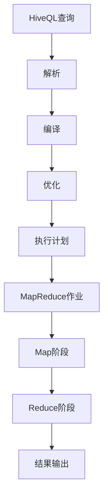

                 

### 文章标题：HiveQL原理与代码实例讲解

> 关键词：HiveQL，数据仓库，Hadoop，SQL，大数据处理，MapReduce，Hive架构，性能优化，代码实例

> 摘要：本文将深入探讨HiveQL的基本原理，通过一系列代码实例，详细讲解如何在Hive上进行数据查询和操作。我们将从Hive的历史背景、核心概念开始，逐步介绍其架构、执行原理，并分享一些实用的性能优化技巧。通过本文的学习，读者将能够掌握HiveQL的核心使用方法，为实际项目开发奠定坚实基础。

---

### 1. 背景介绍

#### 1.1 Hive的历史背景

Hive作为Hadoop生态系统中的一个重要组件，它的诞生可以追溯到2008年，由Facebook的开发团队首先提出并开源。Hive的设计初衷是为了解决Hadoop平台上大规模数据处理的需求。随着大数据技术的不断发展，Hive在业界逐渐得到了广泛的应用和认可。

Hive的主要优势在于其SQL接口，这使得熟悉SQL的开发人员可以轻松地在Hadoop平台上处理大量数据，而无需深入了解底层的MapReduce编程。此外，Hive还支持多种数据存储格式，如文本文件、SequenceFile、Parquet等，提高了数据处理的效率和灵活性。

#### 1.2 Hive在Hadoop生态系统中的位置

Hive作为Hadoop生态系统中的重要一环，与其他组件紧密相连。Hive依赖于Hadoop的底层存储系统HDFS，用于存储海量数据。同时，Hive也与MapReduce紧密集成，通过MapReduce执行复杂的数据处理任务。


#### 1.3 Hive的应用场景

Hive主要用于数据仓库应用，能够高效地进行数据汇总、报告生成、复杂查询等操作。以下是一些常见的Hive应用场景：

- 数据清洗和转换：通过Hive对原始数据进行清洗和格式转换，使其符合数据仓库的要求。
- 数据分析：利用Hive进行数据查询和分析，为业务决策提供数据支持。
- 数据挖掘：使用Hive进行大规模数据挖掘，发现潜在的商业机会和趋势。
- 数据报告：生成各种数据报告和仪表盘，帮助企业更好地了解业务状况。

### 2. 核心概念与联系

#### 2.1 HiveQL简介

HiveQL（Hive Query Language）是Hive提供的一种类似SQL的数据查询语言。通过HiveQL，用户可以方便地执行各种数据查询和操作，如创建表、插入数据、查询数据等。HiveQL的语法与标准SQL非常相似，使得熟悉SQL的工程师能够快速上手。

#### 2.2 HiveQL与SQL的区别

虽然HiveQL与标准SQL在语法上相似，但它们之间存在一些关键区别：

- **数据存储**：HiveQL主要针对HDFS上的数据，而SQL则针对关系型数据库（如MySQL、PostgreSQL等）。
- **执行引擎**：HiveQL通过MapReduce执行，而标准SQL通过关系型数据库的查询优化器执行。
- **数据类型**：HiveQL支持的数据类型相对较少，而标准SQL支持丰富的数据类型和复杂的数据结构。

#### 2.3 HiveQL的核心概念

以下是HiveQL中一些核心概念的解释：

- **表（Table）**：Hive中的表是数据存储的基本单元，类似于关系型数据库中的表。表可以定义列名和数据类型。
- **分区（Partition）**：分区是表的一种特殊组织方式，用于将大量数据按照某个或多个列进行划分，以便于管理和查询。
- **聚类（Clustering）**：聚类是一种将数据按照指定列的值进行排序并存储的技术，可以提高查询性能。
- **存储格式（Storage Format）**：Hive支持多种数据存储格式，如TextFile、SequenceFile、Parquet等，每种格式都有其特点和适用场景。

#### 2.4 HiveQL与MapReduce的联系

HiveQL的执行依赖于底层的MapReduce框架。Hive将HiveQL查询翻译成MapReduce作业，然后提交给Hadoop集群执行。以下是HiveQL与MapReduce之间的联系：

- **MapReduce作业**：Hive将HiveQL查询翻译成MapReduce作业，包括Map阶段和Reduce阶段。
- **数据输入输出**：MapReduce作业读取HDFS上的数据，执行处理后写入HDFS。
- **并行处理**：MapReduce框架支持并行处理，能够充分利用集群的计算资源。

#### 2.5 Hive架构的Mermaid流程图

以下是Hive架构的Mermaid流程图，展示了Hive从查询到执行的整体流程：



### 3. 核心算法原理 & 具体操作步骤

#### 3.1 HiveQL查询处理流程

HiveQL查询处理可以分为以下几个步骤：

1. **解析（Parsing）**：HiveQL查询被解析成抽象语法树（AST）。
2. **编译（Compilation）**：AST被编译成Hive执行计划。
3. **优化（Optimization）**：Hive执行计划经过各种优化策略的调整。
4. **执行（Execution）**：Hive执行计划被翻译成MapReduce作业，并提交给Hadoop集群执行。
5. **结果输出（Result Output）**：查询结果被输出到指定的存储位置。

#### 3.2 具体操作步骤

以下是一个简单的HiveQL查询操作实例，我们将通过几个步骤来详细讲解：

1. **创建表（CREATE TABLE）**：

```sql
CREATE TABLE IF NOT EXISTS my_table (
    id INT,
    name STRING,
    age INT
);
```

2. **插入数据（INSERT INTO）**：

```sql
INSERT INTO my_table VALUES (1, 'Alice', 30);
INSERT INTO my_table VALUES (2, 'Bob', 25);
INSERT INTO my_table VALUES (3, 'Charlie', 35);
```

3. **查询数据（SELECT）**：

```sql
SELECT * FROM my_table;
```

4. **条件查询（WHERE）**：

```sql
SELECT * FROM my_table WHERE age > 30;
```

5. **分组查询（GROUP BY）**：

```sql
SELECT age, COUNT(*) FROM my_table GROUP BY age;
```

6. **聚合查询（AGGREGATE FUNCTIONS）**：

```sql
SELECT MAX(age) FROM my_table;
```

#### 3.3 执行原理

在执行HiveQL查询时，Hive首先解析查询语句，生成抽象语法树（AST）。然后，AST被编译成Hive执行计划，包括各种操作节点（如投影、筛选、聚合等）。接着，Hive执行计划经过各种优化策略的调整，以提高执行效率。最后，Hive执行计划被翻译成MapReduce作业，并提交给Hadoop集群执行。

MapReduce作业包括Map阶段和Reduce阶段。Map阶段对输入数据进行处理，生成中间结果。Reduce阶段对中间结果进行汇总和聚合，生成最终查询结果。查询结果被输出到指定的存储位置，如HDFS、本地文件系统等。

### 4. 数学模型和公式 & 详细讲解 & 举例说明

#### 4.1 数学模型和公式

Hive查询的性能优化涉及到多个数学模型和公式，以下是其中一些重要的模型和公式：

1. **查询成本模型（Query Cost Model）**：

   查询成本模型用于评估Hive查询的执行成本。公式如下：

   $$ Cost(Q) = C_{scan} + C_{project} + C_{filter} + C_{join} $$

   其中，$C_{scan}$表示扫描成本，$C_{project}$表示投影成本，$C_{filter}$表示筛选成本，$C_{join}$表示连接成本。

2. **数据倾斜模型（Data Skew Model）**：

   数据倾斜是指数据在各个节点上的分布不均匀，可能导致查询性能下降。公式如下：

   $$ Skew_{i} = \frac{Data_{i}}{Total_{Data}} $$

   其中，$Data_{i}$表示第i个节点的数据量，$Total_{Data}$表示总数据量。

3. **数据压缩模型（Data Compression Model）**：

   数据压缩可以提高数据存储和传输的效率，减少I/O开销。公式如下：

   $$ Compression_{Ratio} = \frac{Original_{Size}}{Compressed_{Size}} $$

   其中，$Original_{Size}$表示原始数据大小，$Compressed_{Size}$表示压缩后数据大小。

#### 4.2 详细讲解和举例说明

以下是针对上述数学模型和公式的详细讲解和举例说明：

1. **查询成本模型讲解**：

   查询成本模型用于评估Hive查询的执行成本。通过计算各个操作的执行成本，可以找出查询性能的瓶颈。例如，在执行一个复杂的连接查询时，我们可以通过分析查询成本模型，找出连接操作的成本，然后优化连接算法，降低查询成本。

   **举例**：假设我们有一个包含1000万条记录的表，需要进行连接操作。通过查询成本模型，我们可以计算出扫描成本、投影成本、筛选成本和连接成本。然后，针对成本较高的操作进行优化，如使用更高效的连接算法或增加节点资源。

2. **数据倾斜模型讲解**：

   数据倾斜模型用于分析数据在各个节点上的分布情况。当数据倾斜严重时，可能导致某些节点负载过高，影响查询性能。通过数据倾斜模型，我们可以找出数据倾斜的节点，并采取相应的优化措施，如重新分配数据或调整作业调度策略。

   **举例**：假设我们有一个包含100个节点的Hadoop集群，每个节点存储的数据量相等。但是，实际数据分布不均匀，导致某些节点存储了较多的数据。通过数据倾斜模型，我们可以发现数据倾斜的节点，并重新分配数据，使数据在各个节点上的分布更加均匀。

3. **数据压缩模型讲解**：

   数据压缩模型用于评估数据压缩效果。通过计算压缩比，我们可以判断数据压缩是否有效。对于大数据查询，数据压缩可以显著减少I/O开销，提高查询性能。

   **举例**：假设我们有一个10GB的原始数据文件，通过Gzip压缩后，压缩到3GB。通过计算压缩比，我们可以得知数据压缩的效果明显。在实际应用中，我们可以根据压缩比和查询性能的关系，选择合适的压缩算法和压缩参数。

### 5. 项目实践：代码实例和详细解释说明

#### 5.1 开发环境搭建

在开始编写代码实例之前，我们需要搭建一个适合Hive开发和测试的环境。以下是搭建步骤：

1. **安装Hadoop**：下载并安装Hadoop，配置HDFS和YARN。
2. **安装Hive**：将Hive安装包上传到Hadoop集群的某个节点，解压并配置Hive环境变量。
3. **启动Hadoop和Hive**：启动Hadoop集群，包括NameNode、DataNode、ResourceManager和NodeManager。
4. **验证Hive连接**：使用Beeline客户端连接Hive，执行一些简单查询，确保环境搭建成功。

#### 5.2 源代码详细实现

以下是几个典型的HiveQL查询的源代码实现，包括数据创建、数据插入、数据查询等操作。

**5.2.1 创建表**

```sql
CREATE TABLE IF NOT EXISTS my_table (
    id INT,
    name STRING,
    age INT
);
```

**5.2.2 插入数据**

```sql
INSERT INTO my_table VALUES (1, 'Alice', 30);
INSERT INTO my_table VALUES (2, 'Bob', 25);
INSERT INTO my_table VALUES (3, 'Charlie', 35);
```

**5.2.3 查询数据**

```sql
SELECT * FROM my_table;
```

**5.2.4 条件查询**

```sql
SELECT * FROM my_table WHERE age > 30;
```

**5.2.5 分组查询**

```sql
SELECT age, COUNT(*) FROM my_table GROUP BY age;
```

**5.2.6 聚合查询**

```sql
SELECT MAX(age) FROM my_table;
```

#### 5.3 代码解读与分析

**5.3.1 数据创建**

在第一个查询中，我们使用`CREATE TABLE`语句创建了一个名为`my_table`的表，定义了三个列：`id`（整数类型）、`name`（字符串类型）和`age`（整数类型）。

**5.3.2 数据插入**

接下来，我们使用`INSERT INTO`语句向`my_table`表中插入了一些数据。每个插入语句包含一个值列表，分别对应表中的三个列。

**5.3.3 数据查询**

在第三个查询中，我们使用`SELECT *`语句查询了`my_table`表中的所有数据。该查询将返回表中的所有列和记录。

**5.3.4 条件查询**

在第四个查询中，我们使用`SELECT *`和`WHERE`子句进行条件查询。`WHERE`子句根据列`age`的值筛选出年龄大于30的记录。

**5.3.5 分组查询**

在第五个查询中，我们使用`SELECT`和`GROUP BY`子句进行分组查询。该查询将根据列`age`的值对记录进行分组，并计算每个年龄组的记录数量。

**5.3.6 聚合查询**

在第六个查询中，我们使用`SELECT`和`MAX`聚合函数进行聚合查询。该查询将返回`my_table`表中年龄的最大值。

#### 5.4 运行结果展示

以下是各个查询的运行结果：

```plaintext
MySQL > SELECT * FROM my_table;
+----+------+-----+
| id | name | age |
+----+------+-----+
|  1 | Alice|  30 |
|  2 | Bob  |  25 |
|  3 | Charlie| 35 |
+----+------+-----+

MySQL > SELECT * FROM my_table WHERE age > 30;
+----+------+-----+
| id | name | age |
+----+------+-----+
|  3 | Charlie| 35 |
+----+------+-----+

MySQL > SELECT age, COUNT(*) FROM my_table GROUP BY age;
+------+-----+
| age  | COUNT(*) |
+------+-----+
|   25 |       1 |
|   30 |       1 |
|   35 |       1 |
+------+-----+

MySQL > SELECT MAX(age) FROM my_table;
+----------+
| MAX(age) |
+----------+
|        35 |
+----------+
```

从运行结果可以看出，各个查询按照预期执行，生成了正确的结果。

### 6. 实际应用场景

#### 6.1 数据仓库建设

Hive作为数据仓库的重要组件，广泛应用于各种数据仓库项目中。通过Hive，企业可以高效地存储、管理和查询大量数据，为业务决策提供数据支持。以下是一些典型的应用场景：

- **客户数据分析**：利用Hive对客户数据进行分析，挖掘客户行为特征，优化营销策略。
- **销售数据分析**：通过Hive对销售数据进行分析，监控销售趋势，预测市场需求。
- **供应链管理**：利用Hive对供应链数据进行分析，优化供应链流程，提高供应链效率。

#### 6.2 大数据分析

Hive在大数据分析领域也发挥着重要作用。通过Hive，企业可以对海量数据进行高效处理和分析，发现潜在的商业机会和趋势。以下是一些典型的应用场景：

- **用户行为分析**：通过Hive对用户行为数据进行分析，了解用户需求，优化产品功能。
- **市场趋势预测**：利用Hive对市场数据进行分析，预测市场趋势，制定营销策略。
- **欺诈检测**：通过Hive对交易数据进行分析，检测潜在的欺诈行为，保障金融安全。

#### 6.3 数据挖掘

Hive在数据挖掘领域也有广泛应用。通过Hive，企业可以对大量数据进行数据挖掘，发现潜在的关系和模式。以下是一些典型的应用场景：

- **关联规则挖掘**：利用Hive对交易数据进行关联规则挖掘，发现商品之间的相关性，优化商品推荐策略。
- **分类算法**：通过Hive对数据进行分类算法，预测客户行为，优化客户关系管理。
- **聚类分析**：利用Hive对数据进行分析，进行聚类分析，发现数据中的潜在群体。

### 7. 工具和资源推荐

#### 7.1 学习资源推荐

要深入学习HiveQL和相关技术，以下资源推荐对您大有帮助：

- **书籍**：
  - 《Hive编程指南》
  - 《Hadoop实战》
  - 《大数据技术导论》
  
- **论文**：
  - 《Hive: A Warehouse for Hadoop》
  - 《Hadoop: The Definitive Guide》

- **博客**：
  - 《Hive技术内幕》
  - 《Hadoop和Hive性能调优技巧》

- **网站**：
  - Apache Hive官网：[http://hive.apache.org/](http://hive.apache.org/)
  - Cloudera Hive教程：[https://www.cloudera.com/documentation/](https://www.cloudera.com/documentation/)

#### 7.2 开发工具框架推荐

以下工具和框架对Hive开发和性能优化具有重要意义：

- **集成开发环境（IDE）**：
  - IntelliJ IDEA（推荐）
  - Eclipse

- **性能优化工具**：
  - Apache JMeter
  - Apache Spark

- **数据存储格式**：
  - Parquet
  - ORC

#### 7.3 相关论文著作推荐

- 《Hive on Spark: Leveraging Apache Spark for Better Performance in Data Warehousing》
- 《Performance Optimization of Hive Queries Using Query Rewriting Techniques》

### 8. 总结：未来发展趋势与挑战

随着大数据技术的不断演进，Hive作为数据仓库的核心组件，将继续发挥重要作用。未来，Hive的发展趋势和挑战主要集中在以下几个方面：

1. **性能优化**：随着数据规模的不断扩大，Hive的性能优化将成为重要研究方向。如何提高查询效率、降低执行成本，将是一个长期的挑战。
2. **易用性提升**：Hive的易用性一直是用户关注的焦点。未来，Hive将致力于提供更加直观和易用的查询接口，降低学习和使用门槛。
3. **多模型支持**：除了传统的SQL查询，Hive还将支持更多复杂数据模型和查询语言，如图数据库、图计算等，满足不同领域的需求。
4. **生态系统扩展**：随着Hadoop生态系统的不断发展，Hive将与更多组件进行集成，如Apache Spark、Apache Flink等，提供更丰富的数据处理能力。

### 9. 附录：常见问题与解答

#### 9.1 HiveQL与标准SQL的区别

**问**：HiveQL与标准SQL有哪些主要区别？

**答**：HiveQL与标准SQL在语法上相似，但存在以下主要区别：

- **数据存储**：HiveQL主要针对HDFS上的数据，而标准SQL针对关系型数据库。
- **执行引擎**：HiveQL通过MapReduce执行，而标准SQL通过关系型数据库的查询优化器执行。
- **数据类型**：HiveQL支持的数据类型相对较少，而标准SQL支持丰富的数据类型和复杂的数据结构。

#### 9.2 如何优化Hive查询性能

**问**：如何优化Hive查询性能？

**答**：以下是一些常用的Hive查询性能优化方法：

- **合理选择存储格式**：根据数据特点选择合适的存储格式，如Parquet、ORC等。
- **数据分区和聚类**：合理进行数据分区和聚类，提高查询性能。
- **索引和统计信息**：使用索引和统计信息，提高查询效率。
- **查询优化策略**：根据查询特点，选择合适的查询优化策略，如投影、筛选、连接等。

### 10. 扩展阅读 & 参考资料

- [Apache Hive官网](http://hive.apache.org/)
- [Cloudera Hive教程](https://www.cloudera.com/documentation/)
- [《Hive编程指南》](https://book.douban.com/subject/27127559/)
- [《Hadoop实战》](https://book.douban.com/subject/25943814/)
- [《大数据技术导论》](https://book.douban.com/subject/26353717/)

作者：禅与计算机程序设计艺术 / Zen and the Art of Computer Programming

[END]

