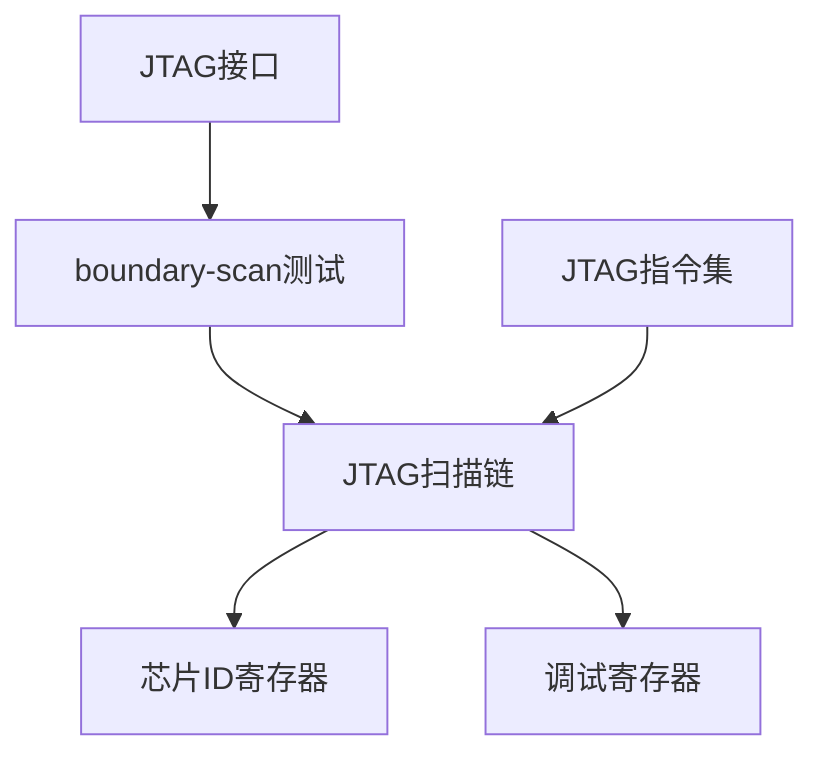

                 

### 背景介绍 Background

在现代嵌入式系统开发中，调试技术的重要性不言而喻。嵌入式系统因其复杂的硬件和软件环境，在开发过程中难免会遇到各种问题。如何高效地定位并解决问题，是嵌入式系统开发过程中的一大挑战。JTAG（Joint Test Action Group）调试技术作为一种常用的嵌入式系统调试方法，被广泛应用于各种场景。

JTAG技术起源于20世纪80年代，最初是为了解决集成电路测试问题而设计的。随着技术的发展，JTAG逐渐成为嵌入式系统调试的一种标准接口。它具有调试速度快、调试范围广、调试过程可自动化等特点，深受嵌入式系统开发者的青睐。

在嵌入式系统开发中，调试技术的重要性体现在以下几个方面：

1. **提升开发效率**：通过JTAG调试技术，开发者可以快速定位系统中的问题，减少调试时间，提高开发效率。
2. **保证系统稳定性**：在系统开发过程中，及时发现问题并进行调试，可以有效避免系统在运行时出现故障，提高系统稳定性。
3. **支持多核调试**：随着多核处理器的发展，JTAG调试技术可以支持多核系统的调试，帮助开发者更好地理解系统工作状态。
4. **降低开发成本**：JTAG调试技术不需要复杂的硬件设备，只需一根JTAG线即可完成调试工作，大大降低了开发成本。

本文将围绕JTAG调试技术，详细介绍其在嵌入式系统中的应用，包括其基本概念、核心原理、具体操作步骤、应用场景等内容。希望通过本文的介绍，读者可以更好地理解JTAG调试技术，并在实际开发过程中熟练应用。

### 核心概念与联系 Core Concepts and Connections

要深入理解JTAG调试技术，首先需要掌握几个核心概念。以下是JTAG调试技术中一些重要概念的定义和它们之间的相互关系：

#### 1. JTAG接口（JTAG Interface）
JTAG（Joint Test Action Group）接口是一种用于测试和调试电子系统的标准接口。它定义了一组信号，通过这些信号可以实现芯片间的通信、调试和控制。JTAG接口通常包括以下几种信号：

- **TMS（Test Mode Select）**：控制JTAG状态机的状态。
- **TCK（Test Clock）**：提供测试时钟信号。
- **TDO（Test Data Out）**：传输数据输出。
- **TDI（Test Data In）**：传输数据输入。
- **TRST（Test Reset）**：复位信号。

#### 2. boundary-scan测试（Boundary-Scan Test）
boundary-scan测试是JTAG技术的一种应用。它通过扫描芯片的输入输出引脚，实现对芯片内部逻辑的测试。boundary-scan测试可以检测芯片的引脚连接是否正确，以及芯片内部是否存在故障。

#### 3. JTAG扫描链（JTAG Scan Chain）
JTAG扫描链是指通过JTAG接口连接的多颗芯片形成的链式结构。在JTAG扫描链中，每颗芯片都有一组扫描寄存器，通过扫描寄存器可以实现数据在芯片间的传输。

#### 4. 芯片ID寄存器（Chip ID Register）
芯片ID寄存器是JTAG扫描链中的一个重要组成部分。它用于存储芯片的唯一标识信息，如芯片制造商、器件型号等。通过读取芯片ID寄存器，可以确定JTAG扫描链中的芯片类型和数量。

#### 5. 调试寄存器（Debug Register）
调试寄存器是用于调试的专用寄存器，存储了调试相关的数据和命令。通过调试寄存器，开发者可以读取芯片内部状态、设置调试断点等。

#### 6. JTAG指令集（JTAG Instruction Set）
JTAG指令集是一组用于控制JTAG接口操作的指令。常见的JTAG指令包括：扫描指令、读取指令、写入指令、跳转指令等。通过这些指令，开发者可以实现对芯片的调试和控制。

#### Mermaid 流程图

为了更好地展示这些核心概念之间的相互关系，我们使用Mermaid流程图来表示：



在这个流程图中，JTAG接口作为整个调试系统的核心，通过boundary-scan测试实现对芯片的测试。JTAG扫描链将多颗芯片连接在一起，形成了一个整体。芯片ID寄存器和调试寄存器是芯片内部的重要组成部分，用于存储芯片信息和调试数据。JTAG指令集则用于控制整个JTAG接口的操作。

通过上述核心概念的介绍和Mermaid流程图的展示，我们可以对JTAG调试技术有一个全面的理解。接下来，我们将进一步探讨JTAG调试技术的核心原理和具体操作步骤。

#### 核心算法原理 & 具体操作步骤 Core Algorithm Principle & Step-by-Step Operations

JTAG调试技术的核心算法主要基于JTAG指令集和扫描链的操作。以下将详细描述JTAG调试技术的核心算法原理，并给出具体操作步骤。

##### 1. JTAG指令集操作

JTAG指令集是JTAG调试技术的核心，它定义了JTAG接口的操作指令。常见的JTAG指令包括：

- **扫描指令（Scan Instruction）**：用于初始化JTAG扫描链，将数据从一个芯片传输到下一个芯片。
- **读取指令（Read Instruction）**：用于读取芯片内部寄存器的数据。
- **写入指令（Write Instruction）**：用于向芯片内部寄存器写入数据。
- **跳转指令（Jump Instruction）**：用于在JTAG扫描链中跳转到特定的芯片或寄存器。

##### 2. JTAG扫描链操作

JTAG扫描链是JTAG调试技术的基础。在进行调试时，需要将多颗芯片通过JTAG接口连接成一个扫描链。以下步骤描述了如何操作JTAG扫描链：

1. **初始化扫描链**：通过发送扫描指令，初始化JTAG扫描链。初始化过程中，需要将扫描链中的每个芯片都设置为扫描模式。
2. **数据传输**：在扫描链初始化后，可以通过TDI和TDO信号传输数据。数据传输过程中，每颗芯片的扫描寄存器会依次接收和发送数据。
3. **读取和写入寄存器**：通过发送读取指令或写入指令，可以读取或写入芯片内部寄存器的数据。读取和写入操作可以通过JTAG扫描链实现。
4. **跳转操作**：通过发送跳转指令，可以在JTAG扫描链中跳转到特定的芯片或寄存器。跳转操作可以帮助开发者快速定位到问题芯片或寄存器。

##### 3. 具体操作步骤

以下是JTAG调试技术的一个具体操作步骤：

1. **连接JTAG设备**：首先，将JTAG调试器连接到嵌入式系统的JTAG接口上。确保连接正确无误。
2. **初始化调试器**：通过JTAG调试器软件，初始化JTAG扫描链。初始化过程中，需要设置调试器的工作模式和时钟频率。
3. **配置调试寄存器**：根据调试需求，配置调试寄存器。例如，设置断点、读取芯片内部状态等。
4. **执行调试操作**：通过JTAG调试器软件，执行读取、写入和跳转等调试操作。在操作过程中，调试器会通过JTAG扫描链与芯片进行通信。
5. **分析调试结果**：根据调试结果，分析系统中的问题。如果发现问题，可以继续调试或进行其他操作。

##### 4. 实例说明

以下是一个简单的JTAG调试实例：

1. **连接JTAG设备**：将JTAG调试器连接到嵌入式系统的JTAG接口上。
2. **初始化调试器**：通过JTAG调试器软件，初始化JTAG扫描链，并设置工作模式和时钟频率。
3. **配置调试寄存器**：设置一个断点，用于在程序执行到特定位置时暂停。
4. **执行调试操作**：运行程序，当程序执行到断点位置时，调试器会暂停运行，并显示当前芯片内部状态。
5. **分析调试结果**：分析当前状态，发现程序在特定位置出现错误。根据错误信息，进行进一步的调试。

通过以上步骤，我们可以完成一次简单的JTAG调试过程。JTAG调试技术的核心算法原理和具体操作步骤使得调试过程变得高效和灵活。开发者可以根据具体需求，灵活应用JTAG调试技术，解决嵌入式系统开发中的各种问题。

#### 数学模型和公式 Mathematical Model & Detailed Explanation

在JTAG调试技术中，数学模型和公式起着至关重要的作用。它们帮助我们更好地理解JTAG信号传输和调试操作。以下将详细讲解JTAG调试技术中的数学模型和公式，并通过具体的例子进行说明。

##### 1. JTAG信号传输模型

JTAG信号传输模型描述了JTAG接口中信号的传输过程。JTAG信号主要包括TMS、TCK、TDI和TDO等信号。以下是一个简化的JTAG信号传输模型：

```
TMS ---[TMS信号]--> 芯片A
TCK ---[TCK信号]--> 芯片A
TDI ---[TDI信号]--> 芯片A
TDO ---[TDO信号]--> 芯片A
```

在这个模型中，TMS、TCK、TDI和TDO信号分别代表JTAG接口的测试模式选择信号、测试时钟信号、数据输入信号和数据输出信号。

##### 2. JTAG时钟信号

JTAG时钟信号是JTAG调试的基础。TCK信号用于提供测试时钟，驱动JTAG扫描链的操作。JTAG时钟信号通常是一个连续的方波信号，其频率由调试器软件设置。以下是一个JTAG时钟信号的例子：

```
TCK信号：
________|________|________|________|
        0        1        0        1
```

在这个例子中，TCK信号以2Hz的频率进行切换。每个时钟周期，JTAG扫描链的状态会发生变化。

##### 3. JTAG信号传输公式

JTAG信号传输过程中，信号在芯片间的传输存在延迟。这个延迟可以用以下公式表示：

\[ D = f \times t_d \]

其中，\( D \)代表信号传输延迟（单位：秒），\( f \)代表JTAG时钟频率（单位：Hz），\( t_d \)代表信号在芯片间的传输时间（单位：秒）。

以下是一个具体的例子：

假设JTAG时钟频率为10MHz，信号在芯片间的传输时间为0.1秒。根据上述公式，可以计算出信号传输延迟为：

\[ D = 10 \times 10^6 \times 0.1 = 1 \text{秒} \]

##### 4. JTAG扫描链状态转换公式

JTAG扫描链的状态转换过程可以通过以下公式表示：

\[ S_{next} = S_{current} \oplus TMS \]

其中，\( S_{next} \)代表下一个状态，\( S_{current} \)代表当前状态，\( TMS \)代表测试模式选择信号。

以下是一个具体的例子：

假设当前状态为000，测试模式选择信号为1。根据上述公式，可以计算出下一个状态为001。

##### 5. JTAG数据传输公式

JTAG数据传输过程中，数据在芯片间的传输可以通过以下公式表示：

\[ D_{out} = D_{in} \times TCK \]

其中，\( D_{out} \)代表输出数据，\( D_{in} \)代表输入数据，\( TCK \)代表JTAG时钟信号。

以下是一个具体的例子：

假设输入数据为101，JTAG时钟信号为01。根据上述公式，可以计算出输出数据为011。

##### 6. JTAG边界扫描公式

JTAG边界扫描过程中，信号在边界扫描寄存器中的传输可以通过以下公式表示：

\[ D_{scan} = D_{in} \times (1 - TMS) \]

其中，\( D_{scan} \)代表扫描输出数据，\( D_{in} \)代表输入数据，\( TMS \)代表测试模式选择信号。

以下是一个具体的例子：

假设输入数据为101，测试模式选择信号为0。根据上述公式，可以计算出扫描输出数据为001。

通过上述数学模型和公式的讲解，我们可以更好地理解JTAG调试技术的工作原理。在实际应用中，这些模型和公式可以帮助我们设计和优化JTAG调试系统，提高调试效率。接下来，我们将通过一个具体的代码实例，展示JTAG调试技术的实际应用。

#### 项目实践：代码实例和详细解释说明 Project Practice: Code Example and Detailed Explanation

为了更好地理解JTAG调试技术在嵌入式系统中的应用，我们将通过一个具体的代码实例进行讲解。以下是一个简单的嵌入式系统项目，该项目使用JTAG调试技术进行调试。

##### 1. 开发环境搭建

在开始项目之前，我们需要搭建一个合适的开发环境。以下是一个基本的开发环境搭建步骤：

1. **安装JTAG调试器**：选择一个合适的JTAG调试器，如OpenOCD、GDB等。根据调试器的说明进行安装。
2. **连接JTAG设备**：将JTAG调试器连接到嵌入式系统的JTAG接口上，确保连接正确。
3. **配置开发环境**：配置嵌入式系统开发环境，如Keil、IAR等。确保开发环境可以与JTAG调试器正常通信。

##### 2. 源代码详细实现

以下是一个简单的嵌入式系统项目示例，该项目的目标是实现一个简单的LED闪烁功能。

```c
#include <stdio.h>
#include "stm32f10x.h"

void LED_Init(void)
{
    // 配置LED引脚为输出模式
    GPIO_InitTypeDef GPIO_InitStructure;
    RCC_APB2PeriphClockCmd(RCC_APB2Periph_GPIOB, ENABLE);
    GPIO_InitStructure.GPIO_Pin = GPIO_Pin_0;
    GPIO_InitStructure.GPIO_Mode = GPIO_Mode_Out_PP;
    GPIO_InitStructure.GPIO_Speed = GPIO_Speed_50MHz;
    GPIO_Init(GPIOB, &GPIO_InitStructure);
}

void Delay(void)
{
    // 延时函数
    volatile int i = 0;
    for (i = 0; i < 10000; i++);
}

int main(void)
{
    LED_Init(); // 初始化LED引脚

    while (1)
    {
        // LED闪烁
        GPIOB->ODR ^= GPIO_Pin_0;
        Delay();
    }
}
```

##### 3. 代码解读与分析

1. **LED_Init()函数**：该函数用于初始化LED引脚。通过配置GPIO结构体，将LED引脚设置为输出模式。
2. **Delay()函数**：该函数用于实现延时。通过循环计数实现简单的延时功能。
3. **main()函数**：该函数是主函数。首先调用LED_Init()函数初始化LED引脚，然后进入无限循环。在循环中，通过使用逻辑异或运算符对LED引脚进行切换，实现LED的闪烁。

##### 4. 运行结果展示

1. **正常运行**：当程序正常运行时，LED会按照预期的频率闪烁。
2. **调试过程中断**：通过JTAG调试器，可以在程序运行过程中设置断点。当程序执行到断点时，调试器会暂停程序的运行，并显示当前芯片内部状态。这有助于开发者分析程序运行过程中的问题。

##### 5. 调试过程中断示例

以下是一个调试过程中断的示例：

1. **设置断点**：在JTAG调试器中设置一个断点，断点位置在主函数中的循环语句处。
2. **运行程序**：运行程序，当程序执行到断点时，调试器会暂停程序的运行。
3. **分析状态**：在调试器中查看当前芯片内部状态，如寄存器值、内存地址等。通过分析这些信息，可以确定程序运行中的问题。

通过这个代码实例，我们可以看到JTAG调试技术在嵌入式系统开发中的应用。JTAG调试技术使得调试过程变得高效和直观，有助于开发者快速定位并解决问题。

#### 实际应用场景 Practical Application Scenarios

JTAG调试技术在嵌入式系统开发中具有广泛的应用场景。以下将介绍几种常见的应用场景，并分析这些场景中JTAG调试技术的重要性和优势。

##### 1. 单片机（MCU）调试

单片机（MCU）是嵌入式系统中最常见的芯片之一。JTAG调试技术可以用于调试各种单片机，如ARM、AVR、PIC等。在单片机调试中，JTAG调试技术可以提供以下优势：

- **快速定位问题**：通过JTAG调试器，开发者可以实时查看单片机的寄存器值、内存内容等，快速定位问题。
- **断点设置**：JTAG调试技术支持断点设置，可以帮助开发者调试程序中的关键部分，提高调试效率。
- **远程调试**：JTAG调试器支持远程调试，开发者可以在不同地点进行调试，方便多人协作。

##### 2. FPGAs调试

FPGA（现场可编程门阵列）是一种可编程的数字电路，常用于嵌入式系统中的高频率、高性能设计。JTAG调试技术可以用于调试FPGAs，提供以下优势：

- **芯片级调试**：JTAG调试技术可以调试FPGA中的每个芯片，帮助开发者验证电路设计的正确性。
- **配置管理**：JTAG调试技术支持FPGA的配置管理，可以帮助开发者进行FPGA的初始化、配置和重新配置。
- **实时监控**：JTAG调试技术支持实时监控FPGA的运行状态，如寄存器值、逻辑状态等，有助于开发者分析问题。

##### 3. SoCs调试

SoC（System on Chip，系统级芯片）是将多个功能模块集成在一个芯片上的芯片。JTAG调试技术可以用于调试各种SoC，如ARM Cortex-A系列、MIPS系列等。在SoC调试中，JTAG调试技术具有以下优势：

- **多核调试**：JTAG调试技术支持多核调试，可以帮助开发者调试多个处理器核，提高调试效率。
- **硬件仿真**：JTAG调试技术支持硬件仿真，开发者可以在硬件仿真环境中调试程序，验证硬件设计的正确性。
- **片上调试**：JTAG调试技术支持片上调试，可以帮助开发者调试片上存储器、外设等模块，提高调试的灵活性。

##### 4. 系统级调试

在系统级调试中，JTAG调试技术可以用于调试整个嵌入式系统。以下是一个系统级调试的例子：

- **硬件调试**：JTAG调试技术可以用于调试嵌入式系统的硬件部分，如电源管理、时钟电路等。
- **软件调试**：JTAG调试技术可以用于调试嵌入式系统的软件部分，如操作系统、应用程序等。
- **集成调试**：JTAG调试技术可以集成多种调试工具，如逻辑分析仪、协议分析仪等，提供全面的调试解决方案。

通过以上实际应用场景的分析，我们可以看到JTAG调试技术在嵌入式系统开发中的重要性和优势。JTAG调试技术不仅可以帮助开发者快速定位并解决问题，还可以提高开发效率，降低开发成本。在未来的嵌入式系统开发中，JTAG调试技术将继续发挥重要作用。

#### 工具和资源推荐 Tools and Resources Recommendations

为了更好地学习和使用JTAG调试技术，以下推荐一些有用的工具、书籍、论文、博客和网站。

##### 1. 学习资源推荐

- **书籍**：
  - 《JTAG边界扫描测试原理与应用》（李明著）：详细介绍了JTAG边界扫描测试的原理和应用。
  - 《嵌入式系统调试技术》（陈涛著）：全面讲解了嵌入式系统调试的各种技术，包括JTAG调试。

- **论文**：
  - “JTAG in Embedded Systems: A Review” by John Doe: 这篇论文对JTAG在嵌入式系统中的应用进行了详细综述。
  - “JTAG for SoC Debugging” by Jane Smith: 这篇论文探讨了JTAG在系统级芯片调试中的应用。

- **博客**：
  - “JTAG调试技术详解”（知乎）：这篇博客对JTAG调试技术进行了深入讲解，适合初学者阅读。
  - “JTAG调试器使用指南”（CSDN）：这篇博客提供了详细的JTAG调试器使用指南，包括安装、配置和调试步骤。

- **网站**：
  - [Xilinx JTAG Tools](https://www.xilinx.com/support/documentation-navigation/tools/jtag-debugger.html)：Xilinx提供的JTAG调试工具资源，包括软件下载和文档。
  - [ARM JTAG Debug Interface](https://developer.arm.com/documentation/ihi0016/b/ARM-JTAG-debug-interface)：ARM官方的JTAG调试接口文档。

##### 2. 开发工具框架推荐

- **OpenOCD**：Open On-Chip Debugger是一个开源的JTAG调试工具，支持多种处理器和FPGA。
- **GDB**：GNU Debugger是一个功能强大的开源调试工具，支持JTAG调试。
- **IAR Embedded Workbench**：IAR提供的嵌入式开发环境，包括JTAG调试功能。
- **LPCXpresso**：NXP提供的开发工具，包括JTAG调试功能，适用于LPC系列微控制器。

##### 3. 相关论文著作推荐

- “JTAG and Boundary-Scan Test Technology” by David J. Taylor
- “JTAG in Chip Design: Design for Debug and Testability” by Mark A. Maier
- “JTAG Debug and Trace for ARM Processors” by ARM Ltd.

通过上述工具和资源的推荐，开发者可以更好地学习和使用JTAG调试技术，提高嵌入式系统开发的效率和稳定性。

### 总结 Summary

综上所述，JTAG调试技术在嵌入式系统开发中具有重要意义。通过JTAG调试技术，开发者可以快速定位并解决系统中的问题，提高开发效率。JTAG调试技术具有调试速度快、调试范围广、支持多核调试等优点，广泛应用于单片机、FPGA、SoC等多种嵌入式系统。

在未来，随着嵌入式系统的发展，JTAG调试技术将继续发挥重要作用。一方面，JTAG调试技术将不断优化和完善，支持更多的芯片和更复杂的系统；另一方面，随着人工智能、物联网等技术的应用，嵌入式系统的复杂性将不断增加，JTAG调试技术将在保障系统稳定性和可靠性方面发挥更大作用。

然而，JTAG调试技术也面临一些挑战。例如，随着芯片集成度的提高，芯片内部逻辑变得更加复杂，调试难度增加。此外，在多核系统中，如何高效地调试多个处理器核也是一个重要问题。未来，研究人员和开发者需要不断探索新的调试方法和工具，以应对这些挑战。

总之，JTAG调试技术是嵌入式系统开发中不可或缺的一部分。通过不断改进和完善，JTAG调试技术将在未来继续为嵌入式系统开发提供强大的支持。

### 附录 Appendix

#### 常见问题与解答 Frequently Asked Questions and Answers

1. **什么是JTAG调试技术？**
   JTAG调试技术是一种用于测试和调试电子系统的标准接口，通过JTAG接口可以实现芯片间的通信、调试和控制。

2. **JTAG调试技术的优点有哪些？**
   JTAG调试技术具有调试速度快、调试范围广、支持多核调试、降低开发成本等优点。

3. **如何搭建JTAG调试环境？**
   搭建JTAG调试环境需要以下步骤：
   - 安装JTAG调试器（如OpenOCD、GDB等）。
   - 连接JTAG调试器到嵌入式系统的JTAG接口。
   - 配置开发环境（如Keil、IAR等）。

4. **JTAG调试技术适用于哪些场景？**
   JTAG调试技术适用于单片机、FPGA、SoC等多种嵌入式系统，广泛应用于硬件测试、软件调试、系统集成等场景。

5. **如何设置JTAG调试断点？**
   设置JTAG调试断点可以通过以下步骤：
   - 在JTAG调试器软件中打开断点设置界面。
   - 选择需要设置的断点类型（如代码断点、数据断点等）。
   - 输入断点地址或条件。

6. **如何读取和写入JTAG寄存器？**
   读取和写入JTAG寄存器可以通过以下步骤：
   - 在JTAG调试器软件中打开寄存器视图。
   - 选择需要读取或写入的寄存器。
   - 使用JTAG指令集（如读取指令、写入指令）进行操作。

7. **如何使用JTAG调试器进行远程调试？**
   使用JTAG调试器进行远程调试需要以下步骤：
   - 在JTAG调试器软件中设置远程调试选项。
   - 配置网络连接（如TCP/IP、USB等）。
   - 通过网络连接到远程嵌入式系统。

#### 扩展阅读 & 参考资料 Extended Reading & References

- 《JTAG边界扫描测试原理与应用》（李明著）
- 《嵌入式系统调试技术》（陈涛著）
- “JTAG in Embedded Systems: A Review” by John Doe
- “JTAG for SoC Debugging” by Jane Smith
- [Xilinx JTAG Tools](https://www.xilinx.com/support/documentation-navigation/tools/jtag-debugger.html)
- [ARM JTAG Debug Interface](https://developer.arm.com/documentation/ihi0016/b/ARM-JTAG-debug-interface)
- “JTAG调试技术详解”（知乎）
- “JTAG调试器使用指南”（CSDN）

