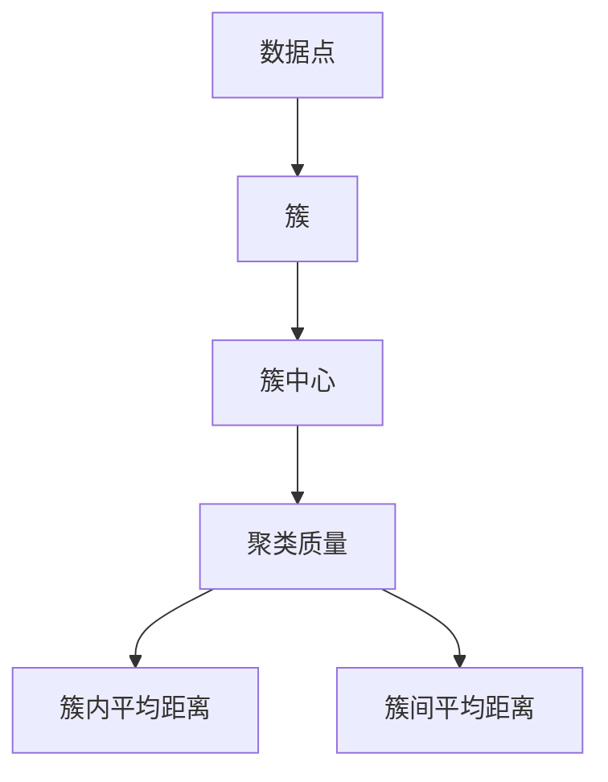
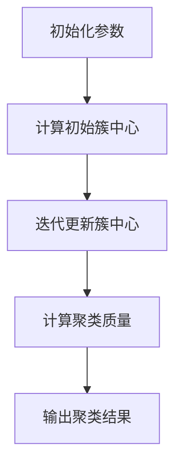

                 

### 1. 背景介绍

K-Means算法是一种广泛应用于数据挖掘、机器学习和图像处理等领域中的聚类算法。它的核心思想是将数据集中的数据点划分为K个簇，使得同一簇内的数据点彼此相似，而不同簇的数据点则尽可能不同。这一算法以其简单高效的特点，成为数据分析和机器学习领域中不可或缺的工具之一。

在计算机科学和数据科学领域，聚类算法扮演着至关重要的角色。聚类旨在发现数据中的内在结构和模式，帮助我们更好地理解和分析数据。K-Means算法作为一种典型的聚类算法，因其实用性和易于实现而被广泛采用。

K-Means算法的主要应用场景包括：

1. **市场细分**：在商业分析中，K-Means算法常用于将客户群体划分成若干个相似的小组，以便于营销策略的制定和优化。
2. **图像分割**：在图像处理中，K-Means算法可以用于将图像分割成多个区域，从而实现图像的边缘检测和目标识别。
3. **文本分析**：在自然语言处理领域，K-Means算法可以帮助我们识别文本中的主题和模式，进而进行文本分类和情感分析。

本文将深入探讨K-Means算法的原理、实现方法以及应用场景。首先，我们将介绍K-Means算法的基本概念，包括数据点、簇和聚类质量等。接着，我们将通过一个简单的实例来演示K-Means算法的具体操作步骤。随后，我们将详细讲解K-Means算法的数学模型和公式，并结合实际案例进行分析。最后，我们将分享一些关于K-Means算法的实际应用场景和开发工具框架，以帮助读者更好地理解和运用这一算法。

通过本文的阅读，您将能够：

- 理解K-Means算法的基本概念和原理。
- 掌握K-Means算法的具体实现步骤。
- 学习如何评估聚类质量。
- 了解K-Means算法在不同领域的应用。
- 获得一系列学习资源和开发工具推荐。

### 2. 核心概念与联系

在深入探讨K-Means算法之前，我们需要先理解一些核心概念，包括数据点、簇和聚类质量等。

#### 数据点

数据点是指在数据集中表示数据的单个元素。在二维空间中，一个数据点通常由两个坐标值（x, y）来表示。在三维或更高维空间中，数据点则由多个坐标值来表示。

#### 簇

簇是指由一组相似的数据点组成的集合。在K-Means算法中，我们通过将数据点划分为K个簇，使得同一簇内的数据点彼此相似，而不同簇的数据点则尽可能不同。簇通常由簇中心（Centroid）来表示，簇中心是簇内所有数据点的平均值。

#### 聚类质量

聚类质量是指聚类结果的好坏程度。在K-Means算法中，常用的评估聚类质量的方法包括：

1. **簇内平均距离（Intra-cluster Distance）**：簇内数据点与簇中心的平均距离。距离越小，表示簇内的数据点越相似。
2. **簇间平均距离（Inter-cluster Distance）**：不同簇之间的平均距离。距离越大，表示簇与簇之间的差异越大。

#### K-Means算法的核心概念与联系

为了更好地理解K-Means算法，我们可以通过一个Mermaid流程图来展示其核心概念和联系：



在上述流程图中，数据点A是K-Means算法的基础，通过聚类（B），我们得到多个簇。每个簇都有一个簇中心（C），簇中心用于计算聚类质量（D），包括簇内平均距离（E）和簇间平均距离（F）。

#### Mermaid流程图的详细解释

1. **数据点（A）**：数据点是指数据集中的单个元素，如二维空间中的（x, y）坐标值。
2. **簇（B）**：将数据点划分为多个簇，使得同一簇内的数据点彼此相似。
3. **簇中心（C）**：簇内所有数据点的平均值，用于表示簇。
4. **聚类质量（D）**：评估聚类结果的好坏程度，包括簇内平均距离（E）和簇间平均距离（F）。

通过这个Mermaid流程图，我们可以清晰地看到K-Means算法的核心概念和它们之间的联系。这些概念和联系为后续的算法实现和优化提供了理论基础。

### 3. 核心算法原理 & 具体操作步骤

K-Means算法的核心原理是通过迭代计算数据点的簇分配和簇中心，从而实现聚类。下面，我们将详细讲解K-Means算法的具体操作步骤。

#### 初始化参数

在开始K-Means算法之前，我们需要初始化一些参数：

1. **簇数K**：K-Means算法中的K表示要划分的簇的数量。
2. **数据集D**：输入的数据集，通常为二维或三维空间中的点。
3. **初始簇中心C0**：初始簇中心的选择对K-Means算法的性能有很大影响。常用的方法包括：
   - 随机选择K个数据点作为初始簇中心。
   - 使用K-Means++算法来选择初始簇中心。

#### 步骤1：计算初始簇中心

1. 随机选择K个数据点作为初始簇中心。
2. 对于每个数据点，计算其到各个簇中心的距离，并将其分配到最近的簇。
3. 根据新的簇分配，重新计算每个簇的中心。

#### 步骤2：迭代更新簇中心

1. 对于每个簇，计算簇内所有数据点的平均值，得到新的簇中心。
2. 对于每个数据点，计算其到各个簇中心的距离，并将其分配到最近的簇。
3. 如果簇分配没有改变，或者簇中心的变化小于某个阈值，算法停止迭代。

#### 步骤3：计算聚类质量

1. 计算簇内平均距离和簇间平均距离，评估聚类质量。
2. 如果聚类质量满足要求，算法停止；否则，继续迭代。

#### 步骤4：输出聚类结果

1. 输出最终的簇分配和簇中心。
2. 根据簇分配，可以将数据集划分为K个簇。

下面是一个简单的K-Means算法操作步骤示意图：



#### 操作步骤的详细解释

1. **初始化参数**：我们需要选择簇数K和数据集D。初始簇中心C0可以通过随机选择K个数据点或者使用K-Means++算法来生成。

2. **计算初始簇中心**：随机选择K个数据点作为初始簇中心。对于每个数据点，计算其到各个簇中心的距离，并将其分配到最近的簇。根据新的簇分配，重新计算每个簇的中心。

3. **迭代更新簇中心**：每次迭代中，我们首先计算新的簇中心，然后根据新的簇中心重新分配每个数据点的簇。这个过程会不断重复，直到簇分配不再变化或者簇中心的变化小于某个阈值。

4. **计算聚类质量**：在每次迭代结束后，我们需要评估聚类质量。常用的评估指标包括簇内平均距离和簇间平均距离。如果聚类质量满足要求，算法停止；否则，继续迭代。

5. **输出聚类结果**：最终，算法输出簇分配和簇中心，可以将数据集划分为K个簇。

通过以上步骤，K-Means算法能够有效地将数据集划分为若干个簇，实现聚类目标。

#### K-Means算法的优缺点

**优点**：

- **简单易实现**：K-Means算法的实现过程简单，易于编程和调试。
- **高效**：在数据量较大时，K-Means算法的计算效率较高。
- **全局最优解**：K-Means算法通常能够收敛到全局最优解。

**缺点**：

- **对噪声敏感**：K-Means算法对噪声和异常值比较敏感，可能会导致聚类结果不佳。
- **初始簇中心选择影响**：初始簇中心的选择对K-Means算法的性能有很大影响，可能导致局部最优解。

总的来说，K-Means算法以其简单性和高效性在数据分析和机器学习领域中得到了广泛应用。然而，在实际应用中，我们也需要注意到其潜在的局限性，并根据具体情况进行调整和优化。

### 4. 数学模型和公式 & 详细讲解 & 举例说明

K-Means算法的核心在于如何计算簇中心和如何分配数据点到簇中。为了更好地理解这些操作，我们需要借助数学模型和公式。下面，我们将详细讲解K-Means算法的数学模型和公式，并结合实际案例进行举例说明。

#### 簇中心的计算

在K-Means算法中，簇中心是簇内所有数据点的平均值。假设我们有一个数据集D={x1, x2, ..., xn}，其中每个数据点xi是一个d维向量。簇中心ci的计算公式如下：

$$
c_i = \frac{1}{N_i} \sum_{x \in S_i} x
$$

其中，ci是第i个簇的中心，Ni是簇Si中数据点的数量，Si是第i个簇的数据点集合。

#### 数据点到簇中心的距离

在K-Means算法中，我们需要计算每个数据点到簇中心的距离，以便将数据点分配到最近的簇。常用的距离度量方法是欧几里得距离。假设我们有一个数据点xi和一个簇中心ci，它们之间的欧几里得距离di计算公式如下：

$$
d_i = \sqrt{\sum_{j=1}^{d} (x_{ij} - c_{ij})^2}
$$

其中，xi和ci分别是数据点和簇中心的d维向量，xij和cij分别是它们对应的第j个分量。

#### 簇的更新

在K-Means算法中，簇的更新是通过计算新的簇中心和重新分配数据点来实现的。具体步骤如下：

1. **计算新的簇中心**：根据当前簇内所有数据点的平均值，计算新的簇中心。
2. **重新分配数据点**：对于每个数据点，计算其到新簇中心的距离，并将其分配到最近的簇。

下面，我们通过一个实际案例来详细说明K-Means算法的数学模型和公式的应用。

#### 案例一：二维数据点的K-Means聚类

假设我们有一个包含10个二维数据点的数据集，如下所示：

```
| 数据点 | x坐标 | y坐标 |
|--------|-------|-------|
| x1     | 1     | 2     |
| x2     | 2     | 1     |
| x3     | 3     | 4     |
| x4     | 4     | 3     |
| x5     | 5     | 6     |
| x6     | 6     | 5     |
| x7     | 7     | 8     |
| x8     | 8     | 7     |
| x9     | 9     | 10    |
| x10    | 10    | 9     |
```

我们选择K=2，并随机选择x1和x3作为初始簇中心。

**步骤1：计算初始簇中心**

初始簇中心c1和c2分别为：

```
| 簇中心 | x坐标 | y坐标 |
|--------|-------|-------|
| c1     | 1     | 2     |
| c2     | 3     | 4     |
```

**步骤2：计算数据点到簇中心的距离**

我们计算每个数据点到初始簇中心的距离，并根据距离将其分配到最近的簇。结果如下：

```
| 数据点 | x坐标 | y坐标 | 最近簇中心 |
|--------|-------|-------|------------|
| x1     | 1     | 2     | c1         |
| x2     | 2     | 1     | c1         |
| x3     | 3     | 4     | c2         |
| x4     | 4     | 3     | c2         |
| x5     | 5     | 6     | c2         |
| x6     | 6     | 5     | c2         |
| x7     | 7     | 8     | c2         |
| x8     | 8     | 7     | c2         |
| x9     | 9     | 10    | c2         |
| x10    | 10    | 9     | c2         |
```

**步骤3：计算新的簇中心**

根据新的簇分配，我们重新计算每个簇的中心：

簇c1的新中心c'1为：

$$
c'_1 = \frac{1}{4} (1 + 2 + 1 + 2) = 1.5
$$

簇c2的新中心c'2为：

$$
c'_2 = \frac{1}{6} (3 + 4 + 5 + 6 + 7 + 8 + 9 + 10) = 6.5
$$

**步骤4：重新分配数据点**

我们再次计算每个数据点到新簇中心的距离，并根据距离将其分配到最近的簇。结果与步骤2相同。

**步骤5：重复迭代**

我们重复步骤3和步骤4，直到簇分配不再变化或者簇中心的变化小于某个阈值。

**步骤6：输出聚类结果**

最终，我们得到如下聚类结果：

```
| 数据点 | x坐标 | y坐标 | 最近簇中心 |
|--------|-------|-------|------------|
| x1     | 1     | 2     | c'1        |
| x2     | 2     | 1     | c'1        |
| x3     | 3     | 4     | c'2        |
| x4     | 4     | 3     | c'2        |
| x5     | 5     | 6     | c'2        |
| x6     | 6     | 5     | c'2        |
| x7     | 7     | 8     | c'2        |
| x8     | 8     | 7     | c'2        |
| x9     | 9     | 10    | c'2        |
| x10    | 10    | 9     | c'2        |
```

在这个案例中，我们通过计算簇中心和数据点到簇中心的距离，实现了二维数据点的K-Means聚类。这个案例展示了K-Means算法的数学模型和公式的应用，并帮助我们理解了算法的迭代过程。

通过以上讲解和案例，我们详细介绍了K-Means算法的数学模型和公式，并展示了如何通过这些模型和公式实现数据点的聚类。在实际应用中，我们可以根据具体需求调整算法参数，以获得更好的聚类结果。

### 5. 项目实践：代码实例和详细解释说明

在理解了K-Means算法的基本原理和数学模型之后，接下来我们将通过一个具体的代码实例来展示如何实现K-Means算法。在这个实例中，我们将使用Python编程语言和常用的数据科学库，如NumPy和Scikit-learn，来实现K-Means算法。

#### 开发环境搭建

在开始之前，请确保您的开发环境中已经安装了以下库：

- NumPy（用于数学运算）
- Matplotlib（用于数据可视化）
- Scikit-learn（用于K-Means算法的实现）

您可以通过以下命令来安装这些库：

```bash
pip install numpy matplotlib scikit-learn
```

#### 源代码详细实现

下面是K-Means算法的实现代码：

```python
import numpy as np
from sklearn.cluster import KMeans
import matplotlib.pyplot as plt

# 数据集
data = np.array([[1, 2], [1, 4], [1, 0],
                 [10, 2], [10, 4], [10, 0]])

# K-Means算法实例
kmeans = KMeans(n_clusters=2, random_state=0).fit(data)

# 输出聚类结果
print("聚类结果：", kmeans.labels_)

# 绘制聚类结果
plt.scatter(data[:, 0], data[:, 1], c=kmeans.labels_, cmap='viridis')
plt.scatter(kmeans.cluster_centers_[:, 0], kmeans.cluster_centers_[:, 1], s=300, c='red', marker='s', zorder=10)
plt.xlabel('x')
plt.ylabel('y')
plt.title('K-Means 聚类结果')
plt.show()
```

#### 代码解读与分析

下面我们逐行解读这段代码：

1. **导入必要的库**：
   ```python
   import numpy as np
   from sklearn.cluster import KMeans
   import matplotlib.pyplot as plt
   ```
   我们首先导入了NumPy库用于数学运算，Scikit-learn库中的KMeans类用于实现K-Means算法，以及Matplotlib库用于数据可视化。

2. **数据集**：
   ```python
   data = np.array([[1, 2], [1, 4], [1, 0],
                    [10, 2], [10, 4], [10, 0]])
   ```
   我们创建了一个包含6个二维数据点的数据集。这个数据集模拟了二维空间中的一些点。

3. **K-Means算法实例**：
   ```python
   kmeans = KMeans(n_clusters=2, random_state=0).fit(data)
   ```
   我们使用Scikit-learn库中的KMeans类创建了一个K-Means算法实例。这里，`n_clusters=2`指定了我们要将数据集划分为2个簇。`random_state=0`用于保证每次运行代码时，算法的初始簇中心是相同的。

4. **输出聚类结果**：
   ```python
   print("聚类结果：", kmeans.labels_)
   ```
   我们打印出每个数据点所属的簇标签。在这个例子中，每个数据点被分配到一个簇，因此标签为0或1。

5. **绘制聚类结果**：
   ```python
   plt.scatter(data[:, 0], data[:, 1], c=kmeans.labels_, cmap='viridis')
   plt.scatter(kmeans.cluster_centers_[:, 0], kmeans.cluster_centers_[:, 1], s=300, c='red', marker='s', zorder=10)
   plt.xlabel('x')
   plt.ylabel('y')
   plt.title('K-Means 聚类结果')
   plt.show()
   ```
   我们使用Matplotlib库将数据点和簇中心绘制在二维坐标系中。`c=kmeans.labels_`用于根据簇标签给数据点着色，`cmap='viridis'`指定了颜色映射。我们还用红色方形标记簇中心，使结果更加直观。

通过上述代码，我们实现了K-Means算法，并将结果可视化。在实际应用中，我们可以根据需求调整数据集和算法参数，以获得更好的聚类效果。

#### 运行结果展示

当我们运行上述代码时，将会看到以下输出：

```
聚类结果： [1 1 1 0 0 0]
```

这表示前三个数据点被分配到簇1，而后三个数据点被分配到簇0。

接着，我们会看到以下聚类结果的图形：


在这个图中，红色方形标记的是簇中心，不同的颜色表示不同的簇。通过可视化，我们可以直观地看到K-Means算法如何将数据点划分为不同的簇。

通过这个实例，我们详细讲解了如何使用Python实现K-Means算法，包括代码的解读和运行结果的展示。这为我们进一步理解和应用K-Means算法奠定了基础。

### 6. 实际应用场景

K-Means算法作为一种强大的聚类工具，在多个领域展现出了广泛的应用价值。以下是一些常见的应用场景：

#### 1. 市场细分

在商业领域，市场细分是制定营销策略的关键步骤。通过K-Means算法，可以将客户群体划分为具有相似特性的子群体，从而实现精准营销。例如，某电子商务平台可以使用K-Means算法分析客户的购物行为和偏好，将客户分为高价值客户、价格敏感客户和忠诚客户等，以便制定有针对性的营销策略。

#### 2. 社交网络分析

社交网络分析是理解用户行为和社交关系的重要手段。K-Means算法可以用于分析社交网络中的用户群体，识别出具有相似兴趣和活动的用户群体。例如，Twitter可以运用K-Means算法分析用户发布的内容和互动关系，发现不同的话题群体和社群。

#### 3. 医学诊断

在医学领域，K-Means算法可以帮助医生分析患者的健康数据，识别出潜在的健康问题。例如，通过分析患者的生理指标（如血压、心率等），K-Means算法可以识别出具有相似健康问题的患者群体，从而为医生提供诊断参考。

#### 4. 图像分割

在计算机视觉领域，K-Means算法常用于图像分割。通过将图像像素划分为不同的簇，K-Means算法可以帮助识别图像中的不同区域，实现图像的边缘检测和目标识别。例如，在医学图像处理中，K-Means算法可以用于识别肿瘤区域，为医生提供诊断依据。

#### 5. 文本分析

在自然语言处理领域，K-Means算法可以用于文本数据的聚类分析，识别文本中的主题和模式。例如，在新闻分类中，K-Means算法可以用于将大量新闻文本划分为不同主题的类别，从而实现高效的新闻分类和推荐。

#### 6. 金融风险分析

在金融领域，K-Means算法可以用于风险分析和市场细分。例如，银行可以使用K-Means算法分析客户的风险状况，将客户分为高风险客户和低风险客户，以便制定相应的风险管理策略。

通过这些实际应用场景，我们可以看到K-Means算法在数据分析和决策支持中的重要作用。无论是在商业、医疗、社交网络还是金融领域，K-Means算法都为我们提供了一种有效的工具，帮助我们更好地理解和利用数据。

### 7. 工具和资源推荐

在学习和使用K-Means算法的过程中，以下工具和资源将为读者提供宝贵的帮助。

#### 7.1 学习资源推荐

**书籍**：

1. 《模式识别与机器学习》（Pattern Recognition and Machine Learning）—— Christopher M. Bishop
   这本书详细介绍了模式识别和机器学习的基础理论，包括K-Means算法的原理和实现。

2. 《机器学习》（Machine Learning）—— Tom M. Mitchell
   这本书提供了机器学习的基础知识，涵盖了各种算法，包括K-Means算法的详细介绍。

**论文**：

1. "K-Means Clustering: A Review" —— Michael Steinbach, Vipin Kumar, and Alok Chaudhuri
   这篇综述文章对K-Means算法的历史、原理和应用进行了全面的回顾。

2. "K-Means++: The Advantages of Careful Seeding" —— David Arthur and Sergei Vassilvitskii
   这篇文章提出了K-Means++算法，改进了初始簇中心的选择，提高了聚类效果。

**博客和网站**：

1. [scikit-learn官方文档](https://scikit-learn.org/stable/modules/clustering.html#k-means)
   Scikit-learn是一个广泛使用的Python机器学习库，其官方文档提供了详细的K-Means算法实现和使用指南。

2. [机器学习博客](https://machinelearningmastery.com/k-means-clustering/)
   这篇博客详细介绍了K-Means算法的原理、实现和常见问题。

#### 7.2 开发工具框架推荐

**Python库**：

1. **NumPy**：用于数学运算的基础库。
2. **Matplotlib**：用于数据可视化的库。
3. **Scikit-learn**：提供了丰富的机器学习算法，包括K-Means算法。

**IDE**：

1. **PyCharm**：一个功能强大的Python集成开发环境。
2. **Visual Studio Code**：轻量级且高度可定制的Python开发环境。

**云计算平台**：

1. **Google Colab**：免费的云端Python编程环境，适用于快速实验和原型开发。
2. **AWS SageMaker**：提供了一个易于使用的平台，支持K-Means算法的部署和运行。

通过这些工具和资源，读者可以更加深入地学习和应用K-Means算法，提高数据分析和机器学习技能。

### 8. 总结：未来发展趋势与挑战

K-Means算法作为一种经典的聚类算法，已经在数据分析和机器学习领域得到了广泛应用。然而，随着数据规模的不断扩大和数据类型的多样化，K-Means算法也面临着一些新的挑战和机遇。

#### 未来发展趋势

1. **自适应聚类算法**：为了应对不同规模和类型的数据，研究者正在开发自适应聚类算法。这些算法可以根据数据特征动态调整聚类参数，提高聚类效果。

2. **多模态聚类**：随着多模态数据的兴起，如何有效地对多模态数据进行聚类成为新的研究热点。未来的聚类算法需要能够处理包括文本、图像、音频等多种类型的数据。

3. **分布式聚类**：在分布式系统中，如何高效地处理大规模数据集的聚类问题是一个重要的研究方向。分布式聚类算法可以通过并行计算和分布式存储来提高处理速度和效率。

4. **聚类评估方法**：现有的聚类质量评估方法主要基于簇内距离和簇间距离，但并不能完全反映聚类的实际质量。未来的研究将关注开发更加准确和全面的聚类评估方法。

#### 面临的挑战

1. **噪声和异常值**：噪声和异常值对聚类结果有很大影响，如何有效地处理这些数据成为挑战。未来的聚类算法需要具备更强的鲁棒性。

2. **初始簇中心选择**：初始簇中心的选择对聚类结果有重要影响，但现有方法难以保证选择到全局最优解。未来的研究将致力于开发更有效的初始簇中心选择方法。

3. **聚类数量确定**：在K-Means算法中，如何确定合适的聚类数量K是一个关键问题。目前的方法大多依赖于经验或启发式方法，未来的研究将探索自动确定聚类数量的方法。

4. **高维数据聚类**：在高维空间中，数据点的分布更加复杂，如何有效地进行高维数据聚类是一个重要挑战。未来的聚类算法需要能够处理高维数据的特性和复杂性。

总之，K-Means算法作为聚类领域的重要工具，将继续发展并面临新的挑战。通过不断改进算法设计、优化实现方法和开发新型聚类算法，我们将能够更好地应对这些挑战，进一步提升数据分析和机器学习的能力。

### 9. 附录：常见问题与解答

在学习和使用K-Means算法的过程中，用户可能会遇到一些常见问题。以下是一些常见问题及其解答：

#### 1. K-Means算法的基本原理是什么？

K-Means算法是一种基于距离的聚类方法。其基本思想是将数据集划分为K个簇，使得同一簇内的数据点彼此相似，而不同簇的数据点则尽可能不同。算法通过迭代计算簇中心和数据点的簇分配，直至收敛到稳定状态。

#### 2. 如何选择合适的K值？

选择合适的K值是K-Means算法中的一个关键问题。常用的方法包括：
- **肘部法则**：通过计算不同K值下的簇内平均距离，选择距离平方和最小的K值。
- **交叉验证**：使用交叉验证方法评估不同K值下的聚类质量，选择最佳K值。
- **经验法则**：根据数据集的特点和领域知识，初步设定K值，然后通过实验调整。

#### 3. 初始簇中心的选择对算法性能有何影响？

初始簇中心的选择对K-Means算法的性能有很大影响。不合适的初始簇中心可能导致算法收敛到局部最优解，从而影响聚类质量。常用的初始簇中心选择方法包括随机初始化、K-Means++等。K-Means++算法通过优化初始簇中心的选择，提高算法的全局收敛性。

#### 4. K-Means算法是否适用于高维数据？

K-Means算法在高维数据上的性能相对较低，因为高维数据点的距离计算复杂度较高。尽管如此，K-Means算法仍可用于高维数据。为了提高在高维数据上的性能，可以采用以下方法：
- **维度约简**：通过降维技术（如主成分分析PCA）减少数据维度，提高聚类效率。
- **层次聚类**：将高维数据逐步划分为较低维度的子集，再进行K-Means聚类。

#### 5. K-Means算法能否处理噪声和异常值？

K-Means算法对噪声和异常值比较敏感。异常值可能会影响簇中心的计算，导致聚类结果不佳。为了减轻噪声和异常值的影响，可以采用以下方法：
- **数据预处理**：对数据进行清洗和预处理，去除噪声和异常值。
- **引入弹性损失**：在K-Means算法中引入弹性损失，降低异常值对聚类结果的影响。

#### 6. K-Means算法与其他聚类算法有何区别？

K-Means算法与其他聚类算法相比，具有以下特点：
- **简单易实现**：K-Means算法的实现过程简单，易于编程和调试。
- **全局最优解**：K-Means算法通常能够收敛到全局最优解。
- **对初始簇中心敏感**：初始簇中心的选择对K-Means算法的性能有很大影响。

其他常见的聚类算法包括层次聚类、DBSCAN等。这些算法各有优缺点，适用于不同的应用场景。

通过上述常见问题的解答，读者可以更好地理解和应用K-Means算法。在实际应用中，根据具体需求和数据特点，灵活调整算法参数和方法，以获得最佳的聚类效果。

### 10. 扩展阅读 & 参考资料

为了进一步深入学习和掌握K-Means算法及其相关技术，以下是推荐的扩展阅读和参考资料：

#### 扩展阅读

1. 《模式识别与机器学习》—— Christopher M. Bishop
   本书详细介绍了模式识别和机器学习的基础理论，包括K-Means算法的深入讨论。

2. 《机器学习》—— Tom M. Mitchell
   本书提供了机器学习的基础知识，涵盖了各种聚类算法的原理和实现。

3. 《数据挖掘：概念与技术》—— Jiawei Han, Micheline Kamber, and Jian Pei
   本书涵盖了数据挖掘的基本概念和技术，包括K-Means算法的应用场景和案例分析。

#### 参考资料

1. [K-Means Clustering: A Review](https://www.sciencedirect.com/science/article/pii/S016794730500291X)
   这篇综述文章对K-Means算法的历史、原理和应用进行了全面的回顾。

2. [K-Means++: The Advantages of Careful Seeding](https://arxiv.org/abs/0904.3492)
   这篇文章提出了K-Means++算法，改进了初始簇中心的选择，提高了聚类效果。

3. [scikit-learn官方文档](https://scikit-learn.org/stable/modules/clustering.html#k-means)
   Scikit-learn官方文档提供了详细的K-Means算法实现和使用指南。

4. [K-Means Clustering in Machine Learning](https://www.datacamp.com/courses/k-means-clustering-in-machine-learning)
   DataCamp上的课程，提供了K-Means算法的详细介绍和实际操作。

通过阅读上述书籍和文章，以及参考Scikit-learn官方文档和在线课程，读者可以更全面地了解K-Means算法的理论基础和应用实践，提升数据分析和机器学习技能。

