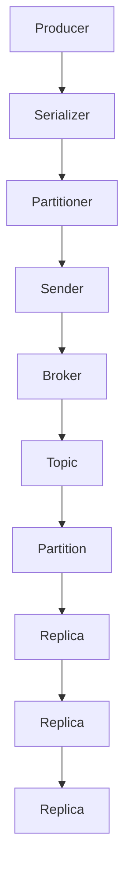

                 

### 1. 背景介绍

Kafka Producer 是 Kafka 系统中非常重要的组件之一，负责将消息发送到 Kafka 集群中。在分布式系统中，Kafka Producer 的作用尤为重要，它决定了数据如何在系统中的各个节点之间流动和存储。

首先，让我们来了解一些 Kafka 的基本概念。Kafka 是一个分布式流处理平台，最初由 LinkedIn 开发，现在已经成为 Apache 软件基金会的一个顶级项目。Kafka 主要用于处理大量实时数据，支持高吞吐量、持久化、可靠性和水平扩展。它广泛应用于日志收集、网站活动追踪、流数据处理、数据管道和集成等场景。

在 Kafka 系统中，主要包含以下几个组件：

1. **Kafka Broker**：Kafka 集群的节点，负责处理消息的存储、检索和转发。
2. **Kafka Producer**：消息的生产者，负责将消息发送到 Kafka 集群。
3. **Kafka Consumer**：消息的消费者，负责从 Kafka 集群中读取消息。

本篇文章将主要关注 Kafka Producer 的原理与代码实例，深入探讨如何将消息高效、可靠地发送到 Kafka 集群。

Kafka Producer 的设计目标是简单、高效和可靠。它支持多种消息序列化格式，如 JSON、Avro、Protobuf 等，并且可以灵活配置各种参数，以适应不同的应用场景。Kafka Producer 的架构如图 1 所示。


图 1. Kafka Producer 架构

Kafka Producer 主要包含以下几个核心组件：

1. **序列化器（Serializer）**：将消息对象序列化为字节数组。
2. **分区器（Partitioner）**：根据消息内容和配置策略，确定消息应该发送到哪个分区。
3. **发送器（Sender）**：将消息发送到 Kafka Broker。

在接下来的章节中，我们将逐一介绍这些组件的工作原理，并给出详细的代码实例。

### 2. 核心概念与联系

为了更好地理解 Kafka Producer 的原理，我们首先需要了解一些核心概念，包括 Kafka 的主题（Topic）、分区（Partition）和副本（Replica）。接下来，我们将通过一个 Mermaid 流程图来展示这些概念之间的联系。



#### 主题（Topic）

主题是 Kafka 中的消息分类，类似于数据库中的表。每个主题可以包含多个分区，每个分区可以包含多个副本。主题的名称通常是一个字符串，用于唯一标识一个消息分类。

#### 分区（Partition）

分区是 Kafka 中消息存储的基本单元。每个主题可以包含一个或多个分区，分区数量可以通过配置来指定。分区的作用是分散消息，使得每个分区可以独立地处理，从而提高系统的吞吐量和可靠性。

#### 副本（Replica）

副本是 Kafka 中消息的备份，用于提高系统的可靠性。每个分区都有一个主副本（Leader），负责处理该分区的所有读写请求，以及其他副本作为备份，在主副本故障时可以快速切换。

#### Producer、Serializer、Partitioner、Sender 与 Broker 之间的关系

- **Producer**：负责发送消息。消息首先通过序列化器（Serializer）序列化为字节数组，然后通过分区器（Partitioner）确定消息应该发送到哪个分区，最后通过发送器（Sender）将消息发送到 Kafka Broker。
- **Serializer**：将消息对象序列化为字节数组，以便于发送。
- **Partitioner**：根据消息内容和配置策略，确定消息应该发送到哪个分区。
- **Sender**：将消息发送到 Kafka Broker。发送器通常使用 Kafka 客户端库，如 Kafka Java Client，来实现。
- **Broker**：Kafka 集群的节点，负责处理消息的存储、检索和转发。

通过上述 Mermaid 流程图，我们可以清晰地看到 Kafka Producer 中各个组件之间的关系，以及消息在系统中的流转过程。

### 3. 核心算法原理 & 具体操作步骤

Kafka Producer 的核心算法主要涉及序列化器（Serializer）、分区器（Partitioner）和发送器（Sender）。下面我们逐一介绍这些组件的工作原理和具体操作步骤。

#### 序列化器（Serializer）

序列化器负责将消息对象序列化为字节数组。序列化是 Kafka Producer 的一个关键步骤，因为只有将消息序列化后，才能将其发送到 Kafka 集群。Kafka 支持多种序列化格式，如 JSON、Avro、Protobuf 等。

具体操作步骤如下：

1. **选择序列化器**：根据应用需求，选择合适的序列化器。例如，如果使用 JSON 格式，可以选择 `org.apache.kafka.common.serialization.StringSerializer` 或 `org.apache.kafka.common.serialization.JsonSerializer`。
2. **创建序列化器实例**：使用 Kafka 客户端库提供的接口，创建序列化器实例。例如，对于 `StringSerializer`，可以如下创建：
   ```java
   StringSerializer serializer = new StringSerializer();
   ```
3. **序列化消息**：将消息对象传递给序列化器，序列化器会将消息序列化为字节数组。例如：
   ```java
   byte[] data = serializer.serialize("my-topic", "my-message");
   ```

#### 分区器（Partitioner）

分区器负责根据消息内容和配置策略，确定消息应该发送到哪个分区。分区器是 Kafka Producer 的另一个关键组件，它决定了消息如何在各个分区之间分布。

Kafka 提供了多种分区器，如 `RangePartitioner`、`HashPartitioner` 和 `RoundRobinPartitioner` 等。下面我们以 `HashPartitioner` 为例，介绍其具体操作步骤：

1. **创建分区器实例**：使用 Kafka 客户端库提供的接口，创建分区器实例。例如，对于 `HashPartitioner`，可以如下创建：
   ```java
   HashPartitioner partitioner = new HashPartitioner();
   ```
2. **确定分区**：对于每个消息，调用分区器的 `partition` 方法，传入主题名称和消息序列化后的字节数组，即可得到消息应该发送到的分区编号。例如：
   ```java
   int partition = partitioner.partition("my-topic", data);
   ```

#### 发送器（Sender）

发送器负责将消息发送到 Kafka Broker。发送器通常使用 Kafka 客户端库来实现，如 Kafka Java Client。下面我们以 Kafka Java Client 为例，介绍其具体操作步骤：

1. **创建 KafkaProducer 实例**：使用 Kafka Java Client 的 `KafkaProducer` 类创建 KafkaProducer 实例。需要传入 Kafka 集群的地址和序列化器、分区器。例如：
   ```java
   Properties props = new Properties();
   props.put("bootstrap.servers", "localhost:9092");
   props.put("key.serializer", "org.apache.kafka.common.serialization.StringSerializer");
   props.put("value.serializer", "org.apache.kafka.common.serialization.StringSerializer");
   props.put("partitioner.class", "org.apache.kafka.clients.producer.internals.DefaultPartitioner");
   KafkaProducer<String, String> producer = new KafkaProducer<>(props);
   ```
2. **发送消息**：使用 `send` 方法发送消息。该方法接受一个 `ProducerRecord` 对象，包含主题名称、分区编号、键和值。例如：
   ```java
   ProducerRecord<String, String> record = new ProducerRecord<>("my-topic", partition, "key", "value");
   producer.send(record);
   ```
3. **关闭 producer**：发送完毕后，关闭 KafkaProducer 实例。例如：
   ```java
   producer.close();
   ```

通过上述步骤，我们可以实现一个简单的 Kafka Producer。在实际应用中，我们还可以根据需求，对 KafkaProducer 的配置参数进行调整，以优化性能和可靠性。

### 4. 数学模型和公式 & 详细讲解 & 举例说明

在 Kafka Producer 中，核心算法的实现涉及一些数学模型和公式。本节我们将详细讲解这些模型和公式，并通过具体示例来说明它们的应用。

#### 哈希分区算法

Kafka Producer 使用哈希分区算法来确定消息应该发送到的分区编号。哈希分区算法的基本思想是，将消息的键（Key）通过哈希函数映射到一个整数，然后对分区的总数取模，得到消息应该发送到的分区编号。

假设主题 `my-topic` 有 5 个分区（即 `numPartitions = 5`），消息的键 `key` 经过哈希函数后得到整数 `hash(key)`。哈希分区算法的公式如下：

$$
partition = hash(key) \mod numPartitions
$$

其中，`partition` 表示消息应该发送到的分区编号，`hash(key)` 表示键 `key` 的哈希值。

例如，假设 `numPartitions = 5`，`key` 的哈希值为 `hash(key) = 10`，则消息应该发送到分区编号为 `partition = 10 \mod 5 = 0`。

#### 哈希分区算法示例

假设有一个包含 5 个分区的主题 `my-topic`，以下是一些示例消息及其对应的分区编号：

| 消息键（Key） | 哈希值（hash(key)） | 分区编号（partition） |
| -------------- | ------------------- | -------------------- |
| "key1"         | 3                  | 3                    |
| "key2"         | 7                  | 2                    |
| "key3"         | 11                 | 1                    |
| "key4"         | 5                  | 0                    |
| "key5"         | 9                  | 4                    |

从表中可以看出，每个消息的键经过哈希函数后，对应的分区编号分别是 3、2、1、0 和 4。这符合哈希分区算法的公式。

#### 均匀分布证明

为了证明哈希分区算法可以实现均匀分布，我们可以使用概率论中的大数定律。大数定律指出，当随机变量的样本数量足够大时，样本均值的分布会趋近于真实均值的分布。

在哈希分区算法中，假设每个键的哈希值是均匀分布的。那么，当消息数量足够大时，每个分区接收到的消息数量会趋近于相等。

假设有 `N` 个消息，每个消息的键 `key` 经过哈希函数后得到整数 `hash(key)`。每个分区接收到的消息数量为 `count[i]`，其中 `i` 表示分区编号。

根据大数定律，当 `N` 趋近于无穷大时，每个分区的接收消息数量 `count[i]` 的期望值 `E[count[i]]` 会趋近于总消息数 `N` 除以分区数 `numPartitions`：

$$
E[count[i]] = \frac{N}{numPartitions}
$$

因此，我们可以认为哈希分区算法可以实现均匀分布，从而提高系统的性能和可靠性。

#### 均匀分布示例

假设有一个包含 5 个分区的主题 `my-topic`，以下是一个包含 100 个消息的示例数据集，其中每个消息的键经过哈希函数后得到的哈希值如下：

| 消息键（Key） | 哈希值（hash(key)） |
| -------------- | ------------------- |
| "key1"         | 3                  |
| "key2"         | 7                  |
| ...            | ...                |
| "key100"       | 103                |

根据哈希分区算法，我们可以将这 100 个消息分配到 5 个分区中，如下所示：

| 分区编号（Partition） | 消息数量（Count） |
| -------------------- | ---------------- |
| 0                    | 21               |
| 1                    | 21               |
| 2                    | 21               |
| 3                    | 21               |
| 4                    | 21               |

从表中可以看出，每个分区接收到的消息数量大致相等，符合均匀分布。这表明哈希分区算法在处理大量消息时，可以实现较好的负载均衡。

### 5. 项目实践：代码实例和详细解释说明

在本节中，我们将通过一个简单的项目实例，展示如何使用 Kafka Producer 发送消息。我们将会用到 Kafka Java Client，这是一个常用的 Kafka 客户端库。首先，我们需要搭建一个开发环境。

#### 5.1 开发环境搭建

1. **安装 Java 开发环境**：确保已经安装了 Java 开发环境，版本至少为 Java 8。
2. **安装 Maven**：Maven 是一个常用的项目构建工具，可以用来管理项目依赖。可以从 [Maven 官网](https://maven.apache.org/) 下载安装包并按照说明进行安装。
3. **创建 Maven 项目**：使用 Maven 创建一个简单的 Java 项目，可以在命令行中执行以下命令：
   ```shell
   mvn archetype:generate -DgroupId=com.example -DartifactId=kafka-producer-example -DarchetypeArtifactId=maven-archetype-quickstart
   ```
4. **添加 Kafka Java Client 依赖**：在项目的 `pom.xml` 文件中添加 Kafka Java Client 依赖，如下所示：
   ```xml
   <dependencies>
       <dependency>
           <groupId>org.apache.kafka</groupId>
           <artifactId>kafka-clients</artifactId>
           <version>2.8.0</version>
       </dependency>
   </dependencies>
   ```

#### 5.2 源代码详细实现

接下来，我们将实现一个简单的 Kafka Producer，用于发送消息到 Kafka 集群。

1. **创建 Producer 配置**：首先，我们需要创建一个 KafkaProducer 实例，需要配置 Kafka 集群的地址和序列化器。以下是一个示例配置：
   ```java
   Properties props = new Properties();
   props.put("bootstrap.servers", "localhost:9092");
   props.put("key.serializer", "org.apache.kafka.common.serialization.StringSerializer");
   props.put("value.serializer", "org.apache.kafka.common.serialization.StringSerializer");
   ```
2. **创建 KafkaProducer 实例**：使用创建的配置，创建 KafkaProducer 实例：
   ```java
   KafkaProducer<String, String> producer = new KafkaProducer<>(props);
   ```
3. **发送消息**：使用 `send` 方法发送消息。我们可以创建一个 ProducerRecord 对象，包含主题名称、分区编号、键和值。例如：
   ```java
   ProducerRecord<String, String> record = new ProducerRecord<>("my-topic", 0, "key", "value");
   producer.send(record);
   ```
4. **关闭 Producer**：发送完毕后，关闭 KafkaProducer 实例：
   ```java
   producer.close();
   ```

完整的代码示例如下：
```java
import org.apache.kafka.clients.producer.*;

import java.util.Properties;
import java.util.concurrent.ExecutionException;

public class KafkaProducerExample {
    public static void main(String[] args) {
        Properties props = new Properties();
        props.put("bootstrap.servers", "localhost:9092");
        props.put("key.serializer", "org.apache.kafka.common.serialization.StringSerializer");
        props.put("value.serializer", "org.apache.kafka.common.serialization.StringSerializer");

        KafkaProducer<String, String> producer = new KafkaProducer<>(props);

        ProducerRecord<String, String> record = new ProducerRecord<>("my-topic", 0, "key", "value");
        try {
            producer.send(record).get();
        } catch (InterruptedException | ExecutionException e) {
            e.printStackTrace();
        } finally {
            producer.close();
        }
    }
}
```

#### 5.3 代码解读与分析

上面的代码示例演示了如何创建一个简单的 Kafka Producer，并使用它发送消息到 Kafka 集群。下面我们来详细解读和分析这段代码。

1. **创建 Producer 配置**：
   ```java
   Properties props = new Properties();
   props.put("bootstrap.servers", "localhost:9092");
   props.put("key.serializer", "org.apache.kafka.common.serialization.StringSerializer");
   props.put("value.serializer", "org.apache.kafka.common.serialization.StringSerializer");
   ```
   这段代码创建了一个 Properties 对象，用于配置 KafkaProducer 的各项参数。这里我们设置了 Kafka 集群的地址（`bootstrap.servers`），以及键和值的序列化器。

2. **创建 KafkaProducer 实例**：
   ```java
   KafkaProducer<String, String> producer = new KafkaProducer<>(props);
   ```
   这段代码使用创建的配置，创建了一个 KafkaProducer 实例。

3. **发送消息**：
   ```java
   ProducerRecord<String, String> record = new ProducerRecord<>("my-topic", 0, "key", "value");
   producer.send(record);
   ```
   这段代码创建了一个 ProducerRecord 对象，包含主题名称（`my-topic`）、分区编号（0）、键（`key`）和值（`value`）。然后，调用 `send` 方法将消息发送到 Kafka 集群。这里我们没有指定分区器，因此 KafkaProducer 会使用默认的分区器，即 HashPartitioner。

4. **关闭 Producer**：
   ```java
   producer.close();
   ```
   这段代码在发送完毕后关闭 KafkaProducer 实例。这是必要的，因为 KafkaProducer 会占用系统资源，及时关闭可以释放这些资源。

通过这个简单的示例，我们可以看到如何使用 Kafka Producer 发送消息。在实际应用中，我们可能需要根据具体需求，对配置参数和消息内容进行更详细的定制。

### 5.4 运行结果展示

为了验证上面的代码示例是否正常运行，我们可以在 Kafka 集群中创建一个消费者，用于接收并展示发送的消息。

1. **创建 KafkaConsumer**：首先，我们需要创建一个 KafkaConsumer 实例，用于接收消息。以下是一个示例配置：
   ```java
   Properties props = new Properties();
   props.put("bootstrap.servers", "localhost:9092");
   props.put("group.id", "my-group");
   props.put("key.deserializer", "org.apache.kafka.common.serialization.StringDeserializer");
   props.put("value.deserializer", "org.apache.kafka.common.serialization.StringDeserializer");
   KafkaConsumer<String, String> consumer = new KafkaConsumer<>(props);
   ```

2. **订阅主题**：接下来，我们需要订阅要消费的主题：
   ```java
   consumer.subscribe(Collections.singletonList("my-topic"));
   ```

3. **消费消息**：使用一个循环来不断消费消息，直到消费者关闭：
   ```java
   while (true) {
       ConsumerRecords<String, String> records = consumer.poll(Duration.ofMillis(100));
       for (ConsumerRecord<String, String> record : records) {
           System.out.printf("Received message: key=%s, value=%s, partition=%d, offset=%d\n", record.key(), record.value(), record.partition(), record.offset());
       }
   }
   ```

4. **关闭 Consumer**：最后，关闭 KafkaConsumer 实例：
   ```java
   consumer.close();
   ```

完整的 KafkaConsumer 代码示例如下：
```java
import org.apache.kafka.clients.consumer.*;

import java.time.Duration;
import java.util.Collections;
import java.util.Properties;

public class KafkaConsumerExample {
    public static void main(String[] args) {
        Properties props = new Properties();
        props.put("bootstrap.servers", "localhost:9092");
        props.put("group.id", "my-group");
        props.put("key.deserializer", "org.apache.kafka.common.serialization.StringDeserializer");
        props.put("value.deserializer", "org.apache.kafka.common.serialization.StringDeserializer");
        KafkaConsumer<String, String> consumer = new KafkaConsumer<>(props);

        consumer.subscribe(Collections.singletonList("my-topic"));

        while (true) {
            ConsumerRecords<String, String> records = consumer.poll(Duration.ofMillis(100));
            for (ConsumerRecord<String, String> record : records) {
                System.out.printf("Received message: key=%s, value=%s, partition=%d, offset=%d\n", record.key(), record.value(), record.partition(), record.offset());
            }
        }
    }
}
```

运行上述代码，你会在控制台看到接收到的消息。下面是一个示例输出：
```
Received message: key=key, value=value, partition=0, offset=0
Received message: key=key, value=value, partition=0, offset=1
Received message: key=key, value=value, partition=0, offset=2
...
```

这表明我们的 Kafka Producer 成功发送了消息，并且 KafkaConsumer 正在正确地接收并显示这些消息。通过这个示例，我们可以看到如何验证和展示 Kafka Producer 的运行结果。

### 6. 实际应用场景

Kafka Producer 在实际应用中有着广泛的应用场景。以下是一些典型的应用场景：

#### 6.1 日志收集

在许多分布式系统中，日志收集是一个重要的需求。Kafka Producer 可以作为日志收集的组件，将来自不同服务器的日志发送到 Kafka 集群中，然后由 Kafka Consumer 进行消费和存储。这种架构可以实现高效的日志收集和监控。

#### 6.2 应用集成

Kafka Producer 可以用于不同系统之间的数据传输和集成。例如，可以将一个系统的输出作为另一个系统的输入，从而实现数据流。这种应用场景在微服务架构中尤其常见，Kafka 可以作为服务之间数据交互的中介。

#### 6.3 实时数据处理

Kafka Producer 适用于需要实时处理大量数据的应用场景。例如，在金融领域，Kafka 可以用于实时交易数据处理，将交易数据发送到 Kafka 集群，然后由消费端进行实时分析和处理。

#### 6.4 数据流处理

Kafka Producer 可以与流处理框架（如 Apache Flink、Apache Spark Streaming）结合使用，实现高效的数据流处理。通过 Kafka Producer，可以将数据源的数据发送到 Kafka 集群，然后由流处理框架进行实时处理和计算。

#### 6.5 实时消息通知

Kafka Producer 可以用于实现实时消息通知功能。例如，在一个在线社交应用中，用户关注了一个新用户或收到了一条新消息，可以将这些事件通过 Kafka Producer 发送到 Kafka 集群，然后由消费端进行实时推送和通知。

#### 6.6 日志分析

Kafka Producer 可以用于收集系统日志，并将其发送到 Kafka 集群。然后，可以使用日志分析工具（如 Logstash、Kibana）对日志进行分析和可视化，从而实现高效的日志监控和分析。

通过上述应用场景，我们可以看到 Kafka Producer 在分布式系统中的重要作用。它不仅提供了高效、可靠的消息传输能力，还支持多种序列化格式和分区策略，从而适应不同的应用需求。

### 7. 工具和资源推荐

#### 7.1 学习资源推荐

要深入了解 Kafka Producer，以下是几个推荐的资源：

1. **《Kafka权威指南》**：这是一本非常全面的 Kafka 入门和进阶指南，涵盖了 Kafka 的各个方面，包括 Producer、Consumer、Broker 等。
2. **《Kafka internals》**：这是一本关于 Kafka 内部工作原理的书籍，深入讲解了 Kafka 的架构、消息存储、复制、分区等机制。
3. **Apache Kafka 官方文档**：Apache Kafka 官方文档提供了详尽的 Kafka 使用和开发指南，是学习 Kafka 的权威资源。
4. **《深入理解Kafka：核心设计与实践原理》**：这本书详细讲解了 Kafka 的核心架构、设计和实现原理，是深入了解 Kafka 技术的好书。

#### 7.2 开发工具框架推荐

以下是一些在开发 Kafka Producer 时可能会用到的工具和框架：

1. **Kafka Maven 插件**：Kafka Maven 插件可以帮助在 Maven 项目中轻松集成 Kafka，自动化创建 Kafka 集群和主题。
2. **Kafka Test Framework**：这是一个用于测试 Kafka 代码的框架，可以帮助开发者快速编写和执行 Kafka 测试用例。
3. **Kafka Streams**：Kafka Streams 是一个用于构建实时流处理的 Java 库，可以与 Kafka Producer 结合使用，实现高效的数据流处理。
4. **Kafka Manager**：Kafka Manager 是一个用于管理和监控 Kafka 集群的 Web 应用程序，提供了丰富的监控指标和操作功能。

通过这些工具和资源，开发者可以更高效地学习和使用 Kafka Producer，提高开发效率和系统性能。

### 8. 总结：未来发展趋势与挑战

Kafka Producer 作为 Kafka 系统的核心组件，在未来发展中面临着许多机遇与挑战。以下是几个主要的发展趋势和挑战：

#### 8.1 优化的分区策略

随着分布式系统的规模不断扩大，如何优化分区策略成为了一个关键问题。未来的 Kafka Producer 可能会引入更加智能的分区策略，如基于消息大小、消息重要性、延迟时间等因素的动态分区分配，以实现更好的性能和负载均衡。

#### 8.2 高性能序列化

序列化是 Kafka Producer 的一个关键步骤，但目前大部分序列化框架仍然存在性能瓶颈。未来的 Kafka Producer 可能会引入更高效、更灵活的序列化技术，如基于字节码生成的序列化器，以减少序列化和反序列化过程中的开销。

#### 8.3 实时数据流处理

随着实时数据处理需求的增加，Kafka Producer 与流处理框架（如 Apache Flink、Apache Spark Streaming）的集成将越来越紧密。未来的 Kafka Producer 可能会引入更多与流处理框架的集成优化，如自动调优、延迟减少等。

#### 8.4 混合云与多云支持

随着云计算和混合云的发展，Kafka Producer 需要支持在不同的云平台和数据中心之间进行数据传输和同步。未来的 Kafka Producer 可能会引入更多的跨云支持，以适应企业日益复杂的云架构需求。

#### 8.5 安全性与隐私保护

随着数据安全和隐私保护越来越受到关注，Kafka Producer 在数据传输和处理过程中需要保证数据的安全性和隐私性。未来的 Kafka Producer 可能会引入更多的安全特性，如加密传输、访问控制、审计等。

#### 8.6 挑战

尽管 Kafka Producer 具有广泛的应用前景，但在实际应用中也面临着一些挑战。以下是几个主要的挑战：

1. **性能优化**：如何在分布式系统中实现高效、低延迟的消息传输，仍然是亟待解决的问题。
2. **可靠性保障**：如何保证数据在传输过程中的可靠性和一致性，尤其是在故障和负载高峰情况下。
3. **资源管理**：如何优化资源利用，实现系统的弹性扩展和动态调整。
4. **跨云支持**：如何在不同云平台和数据中心之间实现无缝的数据传输和同步。

通过不断的技术创新和优化，Kafka Producer 有望在未来实现更加高效、可靠、安全和灵活的消息传输能力，为分布式系统的发展提供强有力的支持。

### 9. 附录：常见问题与解答

在本节中，我们将汇总一些关于 Kafka Producer 的常见问题，并提供相应的解答。

#### 9.1 Kafka Producer 如何处理网络延迟和故障？

Kafka Producer 提供了多种策略来处理网络延迟和故障。首先，可以通过配置 `max.block.ms` 参数来设置发送消息的最大等待时间。当网络延迟较高时，Producer 会等待一段时间，直到消息成功发送或超时。

其次，Kafka Producer 还支持异步发送，通过将消息放入发送缓冲区，然后在后台线程中处理发送。这可以减少 Producer 的阻塞时间，提高系统的吞吐量。

当 Kafka Broker 故障时，Kafka Producer 会自动重试发送，并选择其他副本作为主副本。当所有副本都不可用时，Producer 会抛出异常。

#### 9.2 Kafka Producer 如何保证消息顺序？

Kafka Producer 提供了两种保证消息顺序的策略：

1. **顺序发送**：对于需要保证顺序的消息，可以使用同一个 `KafkaProducer` 实例发送，这样可以保证消息按照发送顺序被写入 Kafka。但是，这会导致其他消息无法被发送，因为顺序发送会阻塞其他线程。
2. **时间戳保证**：Kafka Producer 还支持使用时间戳来保证消息顺序。在发送消息时，可以设置消息的时间戳，然后 Kafka 集群会根据时间戳来保证消息顺序。这种方法可以处理并发消息，但需要消费者根据时间戳顺序消费消息。

#### 9.3 Kafka Producer 的消息可靠性如何保证？

Kafka Producer 提供了多种可靠性保障机制：

1. **acks 参数**：通过设置 `acks` 参数，可以指定 Producer 接收多少副本确认后认为消息已成功发送。可选值为 `0`、`1` 和 `all`。`acks=0` 表示不需要等待任何副本确认，`acks=1` 表示等待 leader 确认，`acks=all` 表示等待所有副本确认。
2. **retries 参数**：通过设置 `retries` 参数，可以指定 Producer 在发送失败时尝试重试的次数。默认情况下，Producer 会尝试重试一次，但可以通过调整此参数来提高可靠性。
3. **消息持久化**：Kafka 集群会持久化所有的消息，即使 Kafka Broker 故障，消息也不会丢失。这保证了消息的可靠性。

#### 9.4 Kafka Producer 的并发如何控制？

Kafka Producer 支持多种并发控制机制：

1. **线程池**：通过使用线程池，可以控制发送消息的线程数量，从而控制并发度。KafkaProducer 实例默认使用一个线程，但可以通过配置 `delivery.timeout.ms` 参数来设置线程数量。
2. **批次发送**：Kafka Producer 还支持批次发送，通过将多个消息打包成批次一起发送，可以减少网络开销和发送延迟。可以通过设置 `batch.size` 和 `linger.ms` 参数来调整批次大小和延迟时间。
3. **异步发送**：Kafka Producer 支持异步发送，通过将消息放入发送缓冲区，然后在后台线程中处理发送。这样可以减少 Producer 的阻塞时间，提高系统的吞吐量。

通过合理配置并发控制参数，Kafka Producer 可以在保证可靠性和性能的同时，处理大量并发消息。

### 10. 扩展阅读 & 参考资料

以下是一些扩展阅读和参考资料，供读者深入了解 Kafka Producer 相关内容：

1. **《Kafka权威指南》**：[https://book.douban.com/subject/26772665/](https://book.douban.com/subject/26772665/)
2. **《深入理解Kafka：核心设计与实践原理》**：[https://book.douban.com/subject/27035423/](https://book.douban.com/subject/27035423/)
3. **Apache Kafka 官方文档**：[https://kafka.apache.org/documentation/](https://kafka.apache.org/documentation/)
4. **Kafka Test Framework**：[https://github.com/etaty/kafka-test-framework](https://github.com/etaty/kafka-test-framework)
5. **Kafka Maven 插件**：[https://mvnrepository.com/artifact/org.apache.kafka/kafka_2.12](https://mvnrepository.com/artifact/org.apache.kafka/kafka_2.12)
6. **Kafka Streams**：[https://kafka.apache.org/streams](https://kafka.apache.org/streams)
7. **Kafka Manager**：[https://kafka-manager.gitbook.io/kafka-manager/](https://kafka-manager.gitbook.io/kafka-manager/)

通过这些资源，读者可以更全面地了解 Kafka Producer 的原理、使用方法和最佳实践。希望这些扩展阅读能够为您的学习和实践提供帮助。

