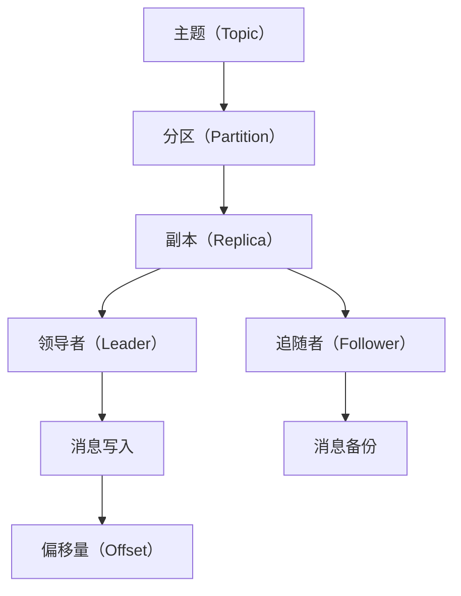

                 

### 文章标题：Kafka 原理与代码实例讲解

## 关键词：
- Kafka
- 消息队列
- 分布式系统
- 事件驱动架构
- 实时数据处理

## 摘要：
本文旨在深入讲解Kafka的消息队列原理，并通过代码实例展示其具体实现和应用。我们将首先介绍Kafka的核心概念和架构，然后剖析其工作原理，最后通过一个实际的项目实例来展示Kafka的实战应用。

### 1. 背景介绍

Kafka是一个分布式流处理平台和消息队列系统，由LinkedIn开发，目前是Apache软件基金会的一个开源项目。Kafka最初被设计用于LinkedIn的大数据日志收集系统，现在已成为许多企业处理实时数据的首选工具。

在分布式系统中，数据流处理是一个关键问题。Kafka通过提供高吞吐量、可扩展性和容错性，解决了这些问题。它被广泛应用于日志聚合、网站活动跟踪、在线分析处理、流数据处理等场景。

Kafka的核心特性包括：

- **分布式系统**：Kafka是一个分布式系统，可以水平扩展，以处理大规模的数据流。
- **高吞吐量**：Kafka设计用于处理大量的实时数据，确保消息的快速传递。
- **持久性**：Kafka将消息持久化到磁盘，确保数据的可靠性和持久性。
- **高可用性**：Kafka通过副本机制和分区确保系统的高可用性。
- **多语言客户端**：Kafka支持多种编程语言，便于开发者集成和使用。

### 2. 核心概念与联系

为了更好地理解Kafka，我们需要了解几个核心概念：主题（Topic）、分区（Partition）、副本（Replica）和偏移量（Offset）。

#### 2.1 主题（Topic）

主题是Kafka中的消息分类。每个主题可以包含多个分区，每个分区都是有序的，消息以有序的方式写入分区。

#### 2.2 分区（Partition）

分区是Kafka中的消息存储单元。每个分区都有一个唯一的编号，消息按顺序写入分区。分区可以分布在多个副本上，以提高系统吞吐量和可用性。

#### 2.3 副本（Replica）

副本是分区的备份。Kafka将每个分区复制到多个节点上，确保数据的安全性和系统的可用性。副本分为领导者（Leader）和追随者（Follower）。领导者负责处理所有读写操作，而追随者作为备份，在领导者故障时接管其职责。

#### 2.4 偏移量（Offset）

偏移量是分区中消息的唯一标识。每个消息都有一个偏移量，用于记录其在分区中的位置。通过偏移量，消费者可以精确地追踪已消费的消息位置。

以下是一个Kafka的核心概念和架构的Mermaid流程图：



### 3. 核心算法原理 & 具体操作步骤

Kafka的核心算法原理主要包括消息的写入、读取和分区分配。

#### 3.1 消息写入

消息写入的过程如下：

1. **生产者选择分区**：生产者根据分区策略（如轮询、哈希等）选择一个分区写入消息。
2. **发送消息给领导者**：生产者将消息发送给该分区的领导者。
3. **写入日志**：领导者将消息写入日志，并记录偏移量。
4. **同步副本**：领导者将消息同步给追随者。

#### 3.2 消息读取

消息读取的过程如下：

1. **消费者选择分区**：消费者根据分区分配策略选择分区进行消费。
2. **从领导者读取消息**：消费者从分区的领导者读取消息。
3. **处理消息**：消费者处理读取到的消息。
4. **更新偏移量**：消费者更新已消费的偏移量。

#### 3.3 分区分配

分区分配的过程如下：

1. **创建分区**：当主题被创建时，Kafka根据分区数量和副本数量创建分区。
2. **副本分配**：Kafka根据副本因子将副本分配到不同的节点上。
3. **分区重分配**：当节点加入或离开集群时，Kafka会重新分配分区和副本。

### 4. 数学模型和公式 & 详细讲解 & 举例说明

Kafka的设计涉及许多数学模型和公式。以下是一个简单的数学模型和公式讲解：

#### 4.1 副本因子

副本因子是副本数量与分区数量的比率。副本因子决定了系统的可用性和性能。

副本因子 = 副本数量 / 分区数量

#### 4.2 分区数量

分区数量决定了系统的并行处理能力和吞吐量。

分区数量 = 数据流大小 / 单个分区容量

#### 4.3 偏移量

偏移量是消息在分区中的唯一标识。

偏移量 = 消息ID + 分区ID

#### 4.4 举例说明

假设我们有一个包含10个分区的主题，每个分区有3个副本。如果我们设置副本因子为3，那么总共会有30个副本。

- 分区数量：10
- 副本数量：3 * 10 = 30
- 副本因子：3

根据这个设置，我们可以计算出：

- 每个分区有3个副本。
- 每个副本存储相同的数据。
- 当一个分区故障时，其他副本可以接管其工作。

### 5. 项目实践：代码实例和详细解释说明

在本节中，我们将通过一个简单的项目实例来展示Kafka的使用方法。

#### 5.1 开发环境搭建

首先，我们需要安装Kafka。可以使用以下命令安装：

```bash
# 安装Kafka
sudo apt-get update
sudo apt-get install kafka_2.12-2.8.0
```

然后，我们需要启动Kafka服务器：

```bash
# 启动Kafka
kafka-server-start.sh /etc/kafka/kafka.properties
```

#### 5.2 源代码详细实现

接下来，我们编写生产者和消费者代码。

**生产者代码**：

```java
import org.apache.kafka.clients.producer.*;
import org.apache.kafka.common.serialization.StringSerializer;

import java.util.Properties;

public class KafkaProducerExample {
    public static void main(String[] args) {
        Properties props = new Properties();
        props.put("bootstrap.servers", "localhost:9092");
        props.put("key.serializer", StringSerializer.class.getName());
        props.put("value.serializer", StringSerializer.class.getName());

        Producer<String, String> producer = new KafkaProducer<>(props);

        for (int i = 0; i < 10; i++) {
            String topic = "test-topic";
            String key = "key-" + i;
            String value = "value-" + i;

            producer.send(new ProducerRecord<>(topic, key, value));
            System.out.println("Sent: " + value);
        }

        producer.close();
    }
}
```

**消费者代码**：

```java
import org.apache.kafka.clients.consumer.*;
import org.apache.kafka.common.serialization.StringDeserializer;

import java.time.Duration;
import java.util.Collections;
import java.util.Properties;

public class KafkaConsumerExample {
    public static void main(String[] args) {
        Properties props = new Properties();
        props.put("bootstrap.servers", "localhost:9092");
        props.put("group.id", "test-group");
        props.put("key.deserializer", StringDeserializer.class.getName());
        props.put("value.deserializer", StringDeserializer.class.getName());

        Consumer<String, String> consumer = new KafkaConsumer<>(props);
        consumer.subscribe(Collections.singletonList("test-topic"));

        while (true) {
            ConsumerRecords<String, String> records = consumer.poll(Duration.ofMillis(1000));

            for (ConsumerRecord<String, String> record : records) {
                System.out.printf("Received: topic=%s, key=%s, value=%s, offset=%d\n",
                        record.topic(), record.key(), record.value(), record.offset());
            }

            consumer.commitSync();
        }
    }
}
```

#### 5.3 代码解读与分析

**生产者代码解读**：

- **配置属性**：配置了Kafka服务器的地址、序列化器和生产者配置。
- **创建生产者**：使用配置创建Kafka生产者。
- **发送消息**：使用`send`方法发送消息到Kafka。

**消费者代码解读**：

- **配置属性**：配置了Kafka服务器的地址、消费者组、序列化器和消费者配置。
- **创建消费者**：使用配置创建Kafka消费者。
- **订阅主题**：订阅需要消费的主题。
- **消费消息**：使用`poll`方法消费消息，并打印消息内容。
- **提交偏移量**：使用`commitSync`方法提交已消费的偏移量。

#### 5.4 运行结果展示

运行生产者代码，生产者将发送10条消息到Kafka：

```bash
Sent: value-0
Sent: value-1
Sent: value-2
Sent: value-3
Sent: value-4
Sent: value-5
Sent: value-6
Sent: value-7
Sent: value-8
Sent: value-9
```

运行消费者代码，消费者将接收并打印消息：

```bash
Received: topic=test-topic, key=key-0, value=value-0, offset=0
Received: topic=test-topic, key=key-1, value=value-1, offset=1
Received: topic=test-topic, key=key-2, value=value-2, offset=2
Received: topic=test-topic, key=key-3, value=value-3, offset=3
Received: topic=test-topic, key=key-4, value=value-4, offset=4
Received: topic=test-topic, key=key-5, value=value-5, offset=5
Received: topic=test-topic, key=key-6, value=value-6, offset=6
Received: topic=test-topic, key=key-7, value=value-7, offset=7
Received: topic=test-topic, key=key-8, value=value-8, offset=8
Received: topic=test-topic, key=key-9, value=value-9, offset=9
```

### 6. 实际应用场景

Kafka在许多实际应用场景中发挥着重要作用：

- **日志收集**：Kafka常用于大规模分布式系统的日志收集，如网站活动日志、服务器日志等。
- **实时数据处理**：Kafka可以处理实时数据流，如在线交易、社交媒体活动等。
- **事件驱动架构**：Kafka支持事件驱动架构，可以处理复杂的业务逻辑和事件流。
- **流处理引擎**：Kafka可以作为流处理引擎，与Apache Flink、Apache Spark等大数据处理框架集成。

### 7. 工具和资源推荐

#### 7.1 学习资源推荐

- **书籍**：
  - 《Kafka: The Definitive Guide》
  - 《Designing Data-Intensive Applications》
- **论文**：
  - 《Kafka: A Distributed Streaming Platform》
- **博客**：
  - [Kafka官网](https://kafka.apache.org/)
  - [Kafka社区](https://cwiki.apache.org/confluence/display/kafka)
- **网站**：
  - [Kafka GitHub仓库](https://github.com/apache/kafka)

#### 7.2 开发工具框架推荐

- **开发工具**：
  - [IntelliJ IDEA](https://www.jetbrains.com/idea/)
  - [Eclipse](https://www.eclipse.org/)
- **框架**：
  - [Spring Kafka](https://spring.io/projects/spring-kafka)
  - [Kafka Streams](https://kafka.apache.org/streams)

#### 7.3 相关论文著作推荐

- 《Kafka: A Distributed Streaming Platform》
- 《Apache Kafka: The Definitive Guide》
- 《Kafka: Building Real-Time Data Pipelines》

### 8. 总结：未来发展趋势与挑战

Kafka作为消息队列和分布式流处理平台，具有广泛的应用前景。未来发展趋势包括：

- **更高效的数据流处理**：随着数据量的爆炸性增长，Kafka需要不断提升处理效率。
- **跨语言支持**：Kafka需要支持更多的编程语言，以适应不同开发者的需求。
- **集成与互操作性**：Kafka需要与其他大数据处理框架和工具更好地集成。

同时，Kafka也面临一些挑战，如数据安全性、系统可观测性和故障恢复等。

### 9. 附录：常见问题与解答

- **Q：如何保证Kafka消息的可靠性？**
  - **A：** Kafka通过副本机制和持久化确保消息的可靠性。每个分区都有多个副本，领导者负责处理读写操作，追随者作为备份。同时，Kafka将消息持久化到磁盘，确保数据的持久性。

- **Q：如何实现Kafka的消息顺序保证？**
  - **A：** Kafka保证每个分区内的消息顺序。生产者将消息发送到特定的分区，消费者从该分区读取消息，确保消息的顺序性。

- **Q：如何监控Kafka的性能和健康状态？**
  - **A：** Kafka提供了一系列监控指标，可以通过Kafka管理工具（如Kafka Manager、Kafka Monitoring）监控性能和健康状态。

### 10. 扩展阅读 & 参考资料

- 《Kafka：从入门到实战》
- 《Kafka技术内幕》
- [Apache Kafka官方文档](https://kafka.apache.org/documentation/)

作者：禅与计算机程序设计艺术 / Zen and the Art of Computer Programming
```

