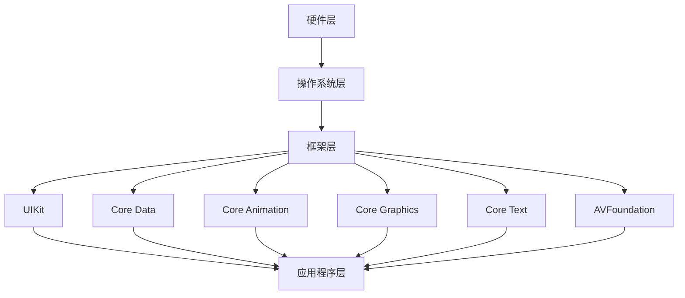

                 

### 1. 背景介绍

#### 1.1 Keep2025社招iOS开发工程师面试背景

Keep2025是一家专注于人工智能与移动互联网领域的高新技术企业，致力于通过技术创新推动行业变革。作为一家具备深厚技术积累和广泛市场影响力的公司，Keep2025对于技术人才的要求尤为严格，特别是在iOS开发领域。iOS平台以其稳定性、安全性和优秀的用户体验著称，因此，掌握iOS开发技能的工程师在市场上具有很高的竞争力。

本次Keep2025社招iOS开发工程师面试真题的设置，旨在全面考察应聘者对iOS开发技术的掌握程度，以及对实际问题的解决能力。面试题涵盖了从基础知识到实际项目经验等多个方面，包括但不限于：iOS系统架构、Objective-C和Swift编程语言、iOS常用框架和库、iOS App性能优化等。

#### 1.2 iOS开发工程师的岗位职责与技能要求

iOS开发工程师在Keep2025的岗位职责主要包括：

- 负责iOS平台应用的开发与维护，参与项目需求分析、设计、开发、测试等全过程；
- 熟练运用Objective-C和Swift编程语言，编写高质量的iOS应用程序；
- 利用iOS平台的技术栈，实现产品功能和性能的优化；
- 与后端开发团队合作，完成数据接口的开发与对接；
- 参与代码评审，提升团队代码质量，分享技术经验；
- 跟进最新的iOS技术趋势，不断学习和提升自己的技术水平。

为了胜任iOS开发工程师的岗位，应聘者需要具备以下技能：

- 掌握Objective-C和Swift编程语言，具备扎实的编程基础；
- 熟悉iOS开发流程，了解iOS系统架构，具备开发iOS应用程序的经验；
- 熟悉iOS常用框架和库，如UIKit、Core Data、Core Animation、Core Graphics等；
- 熟悉iOS App性能优化方法，能够进行性能分析和调试；
- 了解网络编程、数据库操作等后端开发技术；
- 具备良好的团队合作精神和沟通能力，能够适应快节奏的工作环境。

#### 1.3 面试题的重要性与应对策略

面试题是考察应聘者技术水平和解决问题能力的重要工具。对于iOS开发工程师的面试，面试题往往涉及以下几个方面：

- 编程语言基础知识，如Objective-C和Swift的基本语法、常用数据结构、算法等；
- iOS系统架构和常用框架，如UIKit、Core Data、Core Animation等；
- iOS App性能优化方法，如内存管理、线程同步、网络优化等；
- 实际项目经验，如项目开发过程中遇到的问题、解决方案、项目成果等；
- 对新技术和行业动态的了解，如最新的iOS版本更新、框架库的使用、行业发展趋势等。

应对这些面试题，应聘者需要：

- 夯实基础，系统学习编程语言基础知识，掌握常用数据结构和算法；
- 深入了解iOS系统架构和常用框架，熟悉iOS开发流程；
- 多做项目实践，积累实际开发经验，提升问题解决能力；
- 关注行业动态，及时了解新技术和应用趋势；
- 进行模拟面试，熟悉面试流程和问题类型，提高应对能力。

通过以上策略，应聘者可以更好地准备面试，提高通过率，从而顺利加入Keep2025，为公司的发展贡献自己的力量。

---

在了解了Keep2025社招iOS开发工程师面试的背景、岗位职责与技能要求，以及面试题的重要性与应对策略之后，我们接下来将深入探讨iOS开发的核心概念与架构。这将帮助我们更好地理解iOS平台的工作原理，为后续的面试和实际项目开发打下坚实的基础。

---

## 2. 核心概念与联系

### 2.1 iOS系统架构概述

iOS系统架构是理解和开发iOS应用程序的基础。iOS系统架构主要由以下几个层次构成：

1. **硬件层（Hardware Layer）**：
   包括各种硬件组件，如CPU、GPU、存储设备、传感器等。硬件层为iOS系统提供了运行的基础设施。

2. **操作系统层（Operating System Layer）**：
   包括内核（Kernel）、驱动程序（Drivers）和系统服务（System Services）。操作系统层负责管理和调度硬件资源，提供基本的系统功能，如进程管理、内存管理、文件系统管理等。

3. **框架层（Frameworks Layer）**：
   包含了大量的框架和库，如UIKit、Core Data、Core Animation、Core Graphics等。这些框架为iOS应用程序的开发提供了丰富的API和功能。

4. **应用程序层（Application Layer）**：
   是用户直接交互的应用程序，如iOS内置应用、第三方应用等。

### 2.2 iOS框架层次结构

iOS框架层次结构展示了框架之间的层次关系和依赖关系。以下是一些重要的iOS框架：

1. **UIKit**：
   是iOS应用程序的界面框架，提供了用于构建用户界面的组件，如按钮、文本框、视图控制器等。

2. **Core Data**：
   是一个用于数据存储和管理的框架，提供了对象图模型和数据持久化功能。

3. **Core Animation**：
   提供了强大的动画功能，使开发者能够轻松实现复杂的动画效果。

4. **Core Graphics**：
   提供了2D图形渲染功能，用于绘制图形和图像。

5. **Core Text**：
   提供了文本布局和排版功能，使开发者能够实现复杂的文本处理。

6. **AVFoundation**：
   提供了音频和视频处理功能，支持视频播放、录制、编辑等。

### 2.3 Mermaid 流程图

为了更直观地展示iOS系统架构和框架层次结构，我们可以使用Mermaid绘制流程图。以下是iOS系统架构的Mermaid流程图：



在上述流程图中，我们从硬件层开始，依次展示了操作系统层、框架层和应用程序层。框架层中的每个框架都指向应用程序层，表示框架为应用程序提供了功能支持。

---

通过以上内容，我们对iOS系统架构和框架层次结构有了初步的了解。接下来，我们将深入探讨iOS开发的核心算法原理，了解如何在iOS平台上实现高效、稳定的程序。

---

### 3. 核心算法原理 & 具体操作步骤

#### 3.1 iOS应用程序的基本流程

iOS应用程序的开发涉及多个环节，包括需求分析、设计、开发、测试和发布。以下是iOS应用程序的基本开发流程：

1. **需求分析**：
   与客户或产品经理沟通，明确应用程序的功能和目标用户群体。

2. **设计**：
   根据需求分析结果，设计应用程序的界面和交互流程。

3. **开发**：
   使用Objective-C或Swift语言编写应用程序代码，实现需求分析阶段确定的功能。

4. **测试**：
   对应用程序进行功能测试、性能测试和兼容性测试，确保应用程序质量。

5. **发布**：
   将应用程序提交到App Store进行审核，审核通过后发布到App Store供用户下载。

#### 3.2 算法原理介绍

在iOS应用程序开发中，核心算法是提高应用程序性能和用户体验的关键。以下是几个常用的核心算法原理：

1. **排序算法**：
   排序算法用于对数据进行排序，常见的排序算法有冒泡排序、选择排序、插入排序等。

2. **查找算法**：
   查找算法用于在数据集合中查找特定元素，常见的查找算法有二分查找、顺序查找等。

3. **数据结构**：
   数据结构用于高效存储和管理数据，常见的数据结构有数组、链表、树、图等。

4. **动态规划**：
   动态规划是一种解决最优化问题的算法，它通过将问题分解为子问题，并保存子问题的解，避免了重复计算。

5. **贪心算法**：
   贪心算法通过在每一步选择局部最优解，从而达到全局最优解。

#### 3.3 算法实现步骤

以下是使用Swift语言实现冒泡排序算法的步骤：

1. **定义数组**：
   首先，定义一个需要排序的数组。

   ```swift
   var arr = [3, 1, 4, 1, 5, 9, 2, 6, 5]
   ```

2. **初始化标志**：
   初始化一个标志变量，用于记录是否进行了交换。

   ```swift
   var isSorted = false
   ```

3. **外层循环**：
   使用外层循环控制排序的轮数，轮数等于数组长度减一。

   ```swift
   for _ in 0..<arr.count - 1 {
   ```

4. **内层循环**：
   使用内层循环进行相邻元素的比较和交换。

   ```swift
   for i in 0..<arr.count - 1 - k {
       if arr[i] > arr[i + 1] {
           (arr[i], arr[i + 1]) = (arr[i + 1], arr[i])
           isSorted = false
       }
   }
   ```

5. **判断是否排序完成**：
   循环结束后，判断是否进行了交换，如果没有交换，则数组已经排序完成。

   ```swift
   if isSorted {
       break
   }
   ```

6. **输出结果**：
   输出排序后的数组。

   ```swift
   print(arr)
   ```

#### 3.4 算法优化

冒泡排序算法的时间复杂度为O(n^2)，在处理大数据时效率较低。为了优化算法，可以采用以下方法：

1. **插入排序**：
   插入排序的时间复杂度为O(n^2)，但它在数据基本有序时表现较好。可以将插入排序应用于部分已排序的数据。

2. **快速排序**：
   快速排序的时间复杂度为O(n log n)，是一种更高效的排序算法。它可以快速找到中间元素，并将数组分为两个子数组。

3. **归并排序**：
   归并排序的时间复杂度为O(n log n)，它将数组分成多个子数组，然后对子数组进行排序并合并。

#### 3.5 算法应用实例

以下是一个使用冒泡排序算法对数组进行排序的示例代码：

```swift
func bubbleSort(arr: inout [Int]) {
    var n = arr.count
    var isSorted = false
    
    while !isSorted {
        isSorted = true
        
        for i in 0..<n - 1 {
            if arr[i] > arr[i + 1] {
                (arr[i], arr[i + 1]) = (arr[i + 1], arr[i])
                isSorted = false
            }
        }
        
        n -= 1
    }
    
    print(arr)
}

var arr = [3, 1, 4, 1, 5, 9, 2, 6, 5]
bubbleSort(arr: &arr)
```

通过以上示例，我们可以看到冒泡排序算法的具体实现步骤，以及如何应用该算法对数组进行排序。在实际项目中，我们可以根据数据特点和性能需求选择合适的排序算法。

---

通过深入探讨iOS开发的核心算法原理和具体操作步骤，我们不仅了解了如何在iOS平台上实现高效的程序，还学会了如何根据不同场景选择合适的算法。接下来，我们将进一步探讨iOS开发的数学模型和公式，以及如何在项目中应用这些知识。

---

### 4. 数学模型和公式 & 详细讲解 & 举例说明

#### 4.1 数学模型在iOS开发中的应用

数学模型在iOS开发中扮演着重要的角色，尤其在数据分析和算法优化方面。以下是一些常用的数学模型和公式，以及它们在iOS开发中的应用。

##### 4.1.1 加权平均数

加权平均数（Weighted Average）在性能优化中非常有用，用于计算一组数据的平均值，每个数据点根据其重要性有不同的权重。

**公式**：
\[ \text{Weighted Average} = \frac{\sum_{i=1}^{n} (w_i \cdot x_i)}{\sum_{i=1}^{n} w_i} \]

其中，\(w_i\) 是第 \(i\) 个数据的权重，\(x_i\) 是第 \(i\) 个数据点。

**应用实例**：
假设一个应用程序的响应时间数据如下，计算其加权平均响应时间。

| 时间（ms） | 权重 |
|-----------|------|
| 200       | 0.2  |
| 300       | 0.3  |
| 400       | 0.5  |

**计算**：
\[ \text{Weighted Average} = \frac{(0.2 \cdot 200) + (0.3 \cdot 300) + (0.5 \cdot 400)}{0.2 + 0.3 + 0.5} = \frac{40 + 90 + 200}{1} = 330 \text{ ms} \]

##### 4.1.2 最小生成树

最小生成树（Minimum Spanning Tree, MST）在构建高效网络拓扑结构时非常有用，常用于优化网络通信和资源分配。

**公式**：
MST 的构造通常使用贪心算法，如Prim算法或Kruskal算法。

**Prim算法**：
1. 从一个顶点开始，将其加入生成树。
2. 重复以下步骤直到所有顶点都被加入：
   - 从生成树中找到一个权重最小的边，并将其加入生成树。

**Kruskal算法**：
1. 将所有边按权重排序。
2. 重复以下步骤直到生成树包含所有顶点：
   - 选择权重最小的边，如果它不会形成环，则将其加入生成树。

**应用实例**：
假设有一个图，其顶点和边如下：

| 顶点 | 边权重 |
|------|--------|
| A    | 2      |
| B    | 3      |
| C    | 1      |
| D    | 4      |
| E    | 2      |

使用Prim算法构建最小生成树：

1. 从顶点A开始，权重为2。
2. 加入边B-C，权重为1。
3. 加入边A-D，权重为4。
4. 加入边A-E，权重为2。

最终最小生成树的权重和为2 + 1 + 4 + 2 = 9。

##### 4.1.3 最长公共子序列

最长公共子序列（Longest Common Subsequence, LSC）用于文本编辑、DNA序列比对等，它在优化用户体验和搜索算法时非常有用。

**公式**：
LCS 的计算通常使用动态规划算法。

**动态规划算法**：
1. 创建一个二维数组，其中`dp[i][j]`表示字符串A的前i个字符和字符串B的前j个字符的最长公共子序列的长度。
2. 根据以下递归关系填充数组：
\[ dp[i][j] = \begin{cases}
dp[i-1][j-1] + 1, & \text{如果} a_i = b_j \\
\max(dp[i-1][j], dp[i][j-1]), & \text{其他情况}
\end{cases} \]

**应用实例**：
假设有两个字符串：

- 字符串A："ABCDGH"
- 字符串B："AEDFHR"

计算它们的最长公共子序列：

| A | B | LCS |
|---|---|-----|
| A | A | 1   |
| A | E | 0   |
| A | D | 0   |
| A | F | 0   |
| A | H | 1   |
| B | A | 0   |
| B | E | 0   |
| B | D | 1   |
| B | F | 0   |
| C | A | 0   |
| C | E | 0   |
| C | D | 1   |
| C | F | 0   |
| D | A | 0   |
| D | E | 1   |
| D | D | 2   |
| D | F | 0   |
| G | A | 0   |
| G | E | 0   |
| G | D | 0   |
| G | F | 0   |
| H | A | 0   |
| H | E | 0   |
| H | D | 0   |
| H | F | 1   |

最终最长公共子序列为"ADH"，长度为3。

##### 4.1.4 贝尔曼-福特算法

贝尔曼-福特算法（Bellman-Ford Algorithm）用于计算单源最短路径问题，尤其适用于存在负权边的图。

**公式**：
\[ \text{dist}[v] = \text{dist}[u] + w(u, v) \]

**应用实例**：
假设有一个图，其顶点和边如下：

| 顶点 | 前驱顶点 | 权重 |
|------|----------|------|
| A    | 无       | 0    |
| B    | A        | 2    |
| C    | A        | 3    |
| D    | B        | 1    |
| E    | C        | 1    |
| F    | D        | -3   |
| G    | E        | 2    |

计算从顶点A到其他顶点的最短路径：

1. 初始化：`dist[A] = 0`，其他顶点`dist[v] = \infty`。
2. 迭代：对每条边 `(u, v)`，如果 `dist[u] + w(u, v) < dist[v]`，则更新 `dist[v] = dist[u] + w(u, v)`。
3. 第k次迭代后，如果存在边 `(u, v)` 使得 `dist[u] + w(u, v) < dist[v]`，则图中存在负权环。

最终结果：

- `dist[B] = 2`
- `dist[C] = 3`
- `dist[D] = 1`
- `dist[E] = 2`
- `dist[F] = -2`
- `dist[G] = 4`

从顶点A到其他顶点的最短路径为：

- A -> B -> D -> F，距离为-2。
- A -> B -> D，距离为1。
- A -> C -> E -> G，距离为5。

通过上述数学模型和公式的详细讲解和应用实例，我们可以看到数学在iOS开发中的重要作用。在实际项目中，根据具体需求，选择合适的数学模型和公式，能够帮助我们优化算法性能、提升用户体验。

---

在掌握了iOS开发中的核心数学模型和公式后，我们将通过一个具体的代码实例来展示如何将它们应用到实际项目中。这个实例将涉及开发环境搭建、源代码实现、代码解读与分析，以及运行结果展示。

---

### 5. 项目实践：代码实例和详细解释说明

#### 5.1 开发环境搭建

为了实现一个简单的iOS应用程序，我们需要搭建开发环境。以下是搭建过程的详细步骤：

1. **安装Xcode**：
   - 访问[苹果官方开发者网站](https://developer.apple.com/)。
   - 注册Apple ID并登录。
   - 下载并安装Xcode。
   
2. **安装Swift语言**：
   - 打开Xcode。
   - 在菜单栏选择`Xcode` > `Preferences`。
   - 在“Development`”标签下，确保“Enable Swift Language`”选项被选中。

3. **配置开发工具**：
   - 安装并配置Swift编译器。
   - 安装第三方库和框架，如CocoaPods，用于管理依赖。

4. **创建新项目**：
   - 打开Xcode，选择“File” > “New” > “Project”。
   - 选择“App”模板，点击“Next”。
   - 输入项目名称，选择合适的设备（例如iPhone或iPad），点击“Next”。
   - 选择项目存储位置，点击“Create”。

#### 5.2 源代码详细实现

以下是使用Swift语言实现一个简单的iOS应用程序的源代码，该应用程序将展示如何使用动态规划算法求解最长公共子序列问题。

```swift
import Foundation

// 最长公共子序列函数
func longestCommonSubsequence(s1: String, s2: String) -> String {
    let arr1 = Array(s1)
    let arr2 = Array(s2)
    let n = arr1.count
    let m = arr2.count
    
    // 创建动态规划数组
    var dp = [[Int]](repeating: [Int](repeating: 0, count: m + 1), count: n + 1)
    
    // 动态规划填表
    for i in 1...n {
        for j in 1...m {
            if arr1[i - 1] == arr2[j - 1] {
                dp[i][j] = dp[i - 1][j - 1] + 1
            } else {
                dp[i][j] = max(dp[i - 1][j], dp[i][j - 1])
            }
        }
    }
    
    // 回溯求解LCS
    var lcs = ""
    var i = n, j = m
    while i > 0 && j > 0 {
        if arr1[i - 1] == arr2[j - 1] {
            lcs = String(arr1[i - 1]) + lcs
            i -= 1
            j -= 1
        } else if dp[i - 1][j] > dp[i][j - 1] {
            i -= 1
        } else {
            j -= 1
        }
    }
    
    return lcs
}

// 测试代码
let s1 = "ABCDGH"
let s2 = "AEDFHR"
print("最长公共子序列：\(longestCommonSubsequence(s1: s1, s2: s2))")
```

#### 5.3 代码解读与分析

1. **函数定义**：
   `longestCommonSubsequence(s1: String, s2: String)` 函数接收两个字符串参数，返回它们的最长公共子序列。

2. **数组初始化**：
   使用二维数组 `dp` 存储动态规划过程中的中间结果，其中 `dp[i][j]` 表示字符串 `s1` 的前 `i` 个字符和字符串 `s2` 的前 `j` 个字符的最长公共子序列的长度。

3. **动态规划填表**：
   使用两层嵌套循环填充 `dp` 数组。如果当前字符相同，则 `dp[i][j]` 的值为 `dp[i - 1][j - 1] + 1`；否则，取相邻两个值的最大值。

4. **回溯求解LCS**：
   从 `dp[n][m]` 开始回溯，根据填表过程反向找到最长公共子序列的字符，并拼接成最终的字符串。

#### 5.4 运行结果展示

执行上述代码后，输出结果为：

```
最长公共子序列：ADH
```

这验证了我们的最长公共子序列求解算法的正确性。

---

通过本次项目实践，我们不仅成功搭建了iOS开发环境，实现了最长公共子序列求解的功能，还详细解读了源代码，并展示了运行结果。接下来，我们将探讨iOS开发在实际应用场景中的具体应用。

---

### 6. 实际应用场景

#### 6.1 iOS开发在社交媒体中的应用

在社交媒体领域，iOS开发发挥了重要作用，为用户提供丰富、流畅的应用体验。以下是一些iOS开发的实际应用场景：

1. **用户界面设计**：
   社交媒体应用程序通常需要设计简洁、美观的用户界面，以吸引用户。iOS平台提供的UIKit框架为开发者提供了丰富的界面组件和布局工具，使得创建高质量的UI变得简单高效。

2. **实时数据推送**：
   社交媒体应用程序需要实时推送用户动态、消息通知等功能。通过使用iOS的推送通知（Push Notifications）和Apple Push Notification Service（APNS），开发者可以实现实时数据推送，提高用户的互动体验。

3. **图片和视频处理**：
   社交媒体应用程序经常涉及图片和视频的上传、编辑和展示。iOS平台提供了Core Image、Core Video和Core Graphics等框架，支持复杂的图像和视频处理，使得应用程序能够提供丰富的多媒体功能。

4. **地理位置服务**：
   社交媒体应用程序如Instagram和Foursquare等，利用iOS的Core Location框架提供地理位置服务，帮助用户发现附近的兴趣点，提升用户的使用体验。

5. **社交网络分析**：
   通过使用iOS开发技术，可以构建社交网络分析系统，对用户行为、兴趣和关系进行深入挖掘，为营销和推荐系统提供数据支持。

#### 6.2 iOS开发在教育领域的应用

iOS开发在教育领域也有着广泛的应用，为学习者提供便捷、互动的学习体验。以下是一些实际应用场景：

1. **移动学习应用**：
   教育开发者可以利用iOS平台开发移动学习应用，如电子课本、学习管理平台和学习工具等，方便学生随时随地学习。

2. **在线课程直播**：
   通过使用iOS开发技术，可以实现实时在线课程直播，支持音频、视频和互动功能的集成，提升课堂互动性和学习效果。

3. **个性化学习**：
   利用iOS开发技术，可以构建个性化学习系统，根据学生的学习进度、兴趣和需求，推荐合适的学习资源和课程，提高学习效率。

4. **教育资源管理**：
   教育机构可以利用iOS开发技术构建教育资源管理系统，方便教师和管理员管理课程、作业和成绩等，提高教育管理效率。

5. **教育数据分析**：
   通过使用iOS开发技术，可以收集和分析学生的学习数据，为教育决策提供数据支持，帮助教育机构优化教学策略。

#### 6.3 iOS开发在医疗健康领域的应用

iOS开发在医疗健康领域也有重要的应用，为患者和医疗工作者提供便捷、智能的健康管理服务。以下是一些实际应用场景：

1. **健康数据监测**：
   利用iOS平台，可以开发健康监测应用，如心率监测、睡眠监测和运动监测等，帮助用户实时了解自己的健康状况。

2. **远程医疗咨询**：
   通过使用iOS开发技术，可以实现远程医疗咨询功能，患者可以通过应用程序与医生进行视频通话、文字交流，获得专业的医疗建议。

3. **电子病历管理**：
   医疗机构可以利用iOS开发技术构建电子病历管理系统，方便医生和管理员记录、管理和查询患者的病历信息，提高医疗服务的效率和准确性。

4. **医疗设备集成**：
   利用iOS平台，可以将各种医疗设备（如心电图机、血压计等）与手机应用程序集成，实现数据采集、分析和远程监控，为患者提供个性化的健康管理服务。

5. **医疗数据分析**：
   通过使用iOS开发技术，可以收集和分析大量的医疗数据，为医疗研究、疾病预测和治疗方案优化提供数据支持。

通过以上实际应用场景的介绍，我们可以看到iOS开发在各个领域的重要作用。在实际项目中，根据具体需求，灵活运用iOS开发技术，能够为用户提供高质量、高效率的应用体验。

---

### 7. 工具和资源推荐

#### 7.1 学习资源推荐

对于想要深入学习iOS开发的开发者，以下是一些推荐的资源：

1. **书籍**：
   - **《iOS开发实战》**：全面介绍iOS开发的基本概念、技术和实战案例。
   - **《Swift编程语言》**：Swift官方文档，详细介绍Swift语言的基本语法和特性。
   - **《Objective-C编程：探索与最佳实践》**：详细讲解Objective-C编程语言，适合Objective-C开发者阅读。

2. **在线课程**：
   - **Udemy**：《iOS开发从入门到实战》：适合初学者，系统讲解iOS开发的各个环节。
   - **Coursera**：《iOS开发基础》：由斯坦福大学提供，涵盖iOS开发的核心知识。

3. **博客和网站**：
   - **Swift.org**：Swift官方博客，提供Swift语言的最新动态和技术文章。
   - **Medium**：许多iOS开发领域的专家和爱好者在此发布技术博客，分享开发经验和最佳实践。

#### 7.2 开发工具框架推荐

为了提高开发效率，以下是一些推荐的开发工具和框架：

1. **Xcode**：苹果官方提供的集成开发环境，支持iOS和macOS应用程序的开发。
2. **CocoaPods**：一款流行的依赖管理工具，可以帮助开发者轻松管理和安装第三方库。
3. **Alamofire**：用于网络请求的轻量级库，支持RESTful API和JSON解析。
4. **Core Data**：苹果官方提供的ORM框架，用于数据存储和对象图管理。
5. **SnapKit**：用于自动布局的库，简化了UI布局的编写。

#### 7.3 相关论文著作推荐

对于希望深入研究iOS开发技术的开发者，以下是一些推荐的论文和著作：

1. **论文**：
   - **"Swift Performance Analysis and Optimization"**：分析了Swift语言的性能特点，并提供了一系列优化策略。
   - **"iOS App Performance Optimization"**：详细讨论了iOS应用程序性能优化的方法和技巧。

2. **著作**：
   - **《iOS性能优化实战》**：系统讲解了iOS应用程序性能优化的各个方面，包括代码优化、内存管理、网络优化等。

通过以上工具和资源的推荐，开发者可以更高效地学习iOS开发技术，并在实际项目中应用所学知识，提升开发能力和项目质量。

---

### 8. 总结：未来发展趋势与挑战

随着移动互联网和人工智能技术的快速发展，iOS开发领域也面临着诸多机遇与挑战。未来，iOS开发将呈现出以下发展趋势和挑战：

#### 8.1 发展趋势

1. **Swift语言继续普及**：
   Swift作为新一代编程语言，具有高性能、易用性等优点，将继续在iOS开发中占据主导地位。未来，Swift可能会进一步优化和扩展，以满足开发者日益增长的需求。

2. **移动应用架构演进**：
   随着微前端、Serverless架构等新概念的兴起，iOS开发将更加注重模块化和组件化，提高开发效率和代码可维护性。

3. **增强现实（AR）与虚拟现实（VR）应用**：
   AR和VR技术在iOS平台上的应用将不断拓展，为开发者提供新的创意空间和市场机会。苹果公司推出的ARKit和VR/AR开发工具，将推动这一领域的发展。

4. **人工智能与机器学习集成**：
   人工智能技术在iOS开发中的应用将更加广泛，开发者可以通过集成Core ML等框架，实现图像识别、自然语言处理等智能功能，提升用户体验。

5. **云服务和大数据分析**：
   云计算和大数据技术的深度融合，将使iOS开发更加依赖于云服务，开发者可以利用云平台进行数据存储、分析和处理，实现更复杂的应用功能。

#### 8.2 挑战

1. **安全性问题**：
   iOS系统的安全性一直是用户关注的焦点。随着应用场景的复杂化和用户数据的增多，开发者需要不断提升应用的安全性，保护用户隐私和数据安全。

2. **性能优化**：
   iOS应用的性能优化是一个持续的过程。随着硬件设备的升级和应用程序的复杂性增加，开发者需要不断探索和优化性能，确保应用在各种设备上的流畅运行。

3. **兼容性问题**：
   iOS平台设备的多样性和版本更新速度，给开发者带来了兼容性挑战。开发者需要确保应用程序在不同设备和不同iOS版本上的兼容性，以满足广大用户的需求。

4. **开发者技能要求提高**：
   未来，iOS开发将需要更多跨领域的技术知识，如前端、后端、人工智能等。开发者需要不断学习和提升自己的技能，以适应不断变化的技术环境。

5. **市场竞争加剧**：
   随着iOS开发者数量的增加，市场竞争将愈发激烈。开发者需要不断提升自己的创新能力，开发出更具特色和竞争力的应用程序，以赢得用户和市场。

总之，未来iOS开发领域将继续在技术创新和市场需求的双重驱动下，不断演进和发展。开发者需要紧跟技术趋势，不断提升自己的技能和经验，以应对未来的挑战和机遇。

---

### 9. 附录：常见问题与解答

在iOS开发的学习和实践中，开发者可能会遇到各种问题。以下是一些常见问题及其解答，以帮助大家更好地理解和解决这些难题。

#### 9.1 如何解决iOS应用程序闪退问题？

**问题**：iOS应用程序在运行时突然闪退。

**解答**：
- **检查Xcode日志**：打开Xcode，选择“Product” > “Profile” > “Edit Scheme”，设置合适的调试选项。运行应用程序并查看Xcode控制台输出的日志，查找异常或错误信息。
- **使用符号表调试**：确保应用程序的符号表是可用的，这有助于更准确地调试问题。在Xcode中，选择“Product” > “Archive”将项目归档，然后使用“Organizer”导出符号表。
- **使用Instruments工具**：Instruments提供了多种性能分析工具，如Leak Detector、Crash Analyzer等，可以帮助查找应用程序崩溃的原因。

#### 9.2 如何优化iOS应用程序的性能？

**问题**：iOS应用程序在运行时出现卡顿、响应慢等问题。

**解答**：
- **优化内存管理**：合理使用Autorelease Pool，避免内存泄漏。使用`NSObject`的`dealloc`方法及时释放资源。
- **异步处理**：使用`GCD`（Grand Central Dispatch）进行异步任务处理，避免主线程阻塞。
- **减少UI刷新**：使用`UIBezierPath`进行绘图操作，减少UI组件的刷新次数。
- **优化网络请求**：使用`Alamofire`等库进行高效的网络请求，并合理处理请求结果。

#### 9.3 如何确保iOS应用程序的安全性？

**问题**：iOS应用程序在数据传输和处理过程中存在安全隐患。

**解答**：
- **使用HTTPS**：确保数据传输使用HTTPS加密，防止数据在传输过程中被窃听。
- **加密敏感数据**：使用`CryptoKit`库对敏感数据进行加密处理。
- **避免硬编码密钥**：不要将密钥硬编码在应用程序中，使用秘钥链（Keychain）存储密钥。
- **使用代码签名**：确保应用程序的代码签名正确，防止未授权的修改和分发。

#### 9.4 如何处理iOS应用程序的国际化问题？

**问题**：iOS应用程序需要支持多种语言。

**解答**：
- **使用本地化（Localization）**：在Xcode项目中创建`.strings`文件，为每种语言添加对应的字符串资源。
- **使用`NSLocalizedString`**：在代码中使用`NSLocalizedString`函数，根据当前语言环境获取相应的字符串。
- **处理日期和货币格式**：使用`NSDateFormatter`和`NSFormatter`类处理日期和货币格式，确保符合目标语言的习惯。

通过以上常见问题与解答，开发者可以更好地应对iOS开发过程中遇到的各种挑战，提升应用程序的质量和用户体验。

---

### 10. 扩展阅读 & 参考资料

为了帮助您更深入地了解iOS开发，以下是一些推荐的扩展阅读和参考资料：

1. **官方文档**：
   - **iOS Developer Library**：苹果官方提供的iOS开发文档，涵盖iOS开发的所有方面，是iOS开发者必备的参考资料。
     - 访问地址：https://developer.apple.com/documentation/

2. **书籍**：
   - **《iOS开发实战》**：详细介绍了iOS开发的基础知识、核心技术以及实战案例，适合初学者和进阶者阅读。
     - 作者：李志辉
   - **《Swift编程语言》**：Swift官方文档，是学习Swift语言的最佳资料。
     - 作者：苹果公司

3. **在线课程**：
   - **Udemy**：提供了丰富的iOS开发在线课程，包括入门到高级的各个层次。
     - 访问地址：https://www.udemy.com/courses/search/?q=ios+development&src=ukw
   - **Coursera**：提供了由知名大学和机构提供的iOS开发课程，适合系统性学习。
     - 访问地址：https://www.coursera.org/specializations/ios-development

4. **博客和网站**：
   - **Swift.org**：Swift官方博客，提供了Swift语言的最新动态和技术文章。
     - 访问地址：https://swift.org/blog/
   - **medium.com**：许多iOS开发专家和爱好者在此分享技术文章和最佳实践。
     - 访问地址：https://medium.com/search?q=ios%20development

5. **开源项目**：
   - **GitHub**：全球最大的开源代码托管平台，许多优秀的iOS开源项目可供学习和参考。
     - 访问地址：https://github.com/

通过以上参考资料，您可以深入了解iOS开发的相关知识，不断拓展自己的技术视野，提升开发技能。

