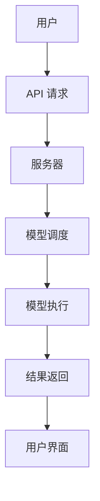

                 

### 1. 背景介绍

在当今信息时代，人工智能（AI）技术正以前所未有的速度发展。随着计算能力的提升和大数据的普及，人工智能已经从实验室走向了实际应用。然而，AI 技术的落地并不是一件简单的事情。对于大多数企业和个人来说，构建和维护一个高效、可靠的 AI 模型需要大量的专业知识和资源。此外，AI 模型的迭代和优化也需要持续的时间和精力。因此，将 AI 能力以服务的形式提供给大众，即 LLM（Large Language Model）即服务，成为一种自然的选择。

LLM 即服务，是指在云端提供大语言模型（Large Language Model）的能力，用户无需自行构建和维护模型，只需通过接口即可使用。这种模式大大降低了用户进入 AI 领域的门槛，使得更多的人能够享受到 AI 带来的便利。LLM 即服务的出现，不仅加速了 AI 技术的普及，也为云计算产业带来了新的增长点。

本文旨在探讨 LLM 即服务的发展背景、核心概念与架构、核心算法原理、数学模型和公式、项目实践、实际应用场景、工具和资源推荐以及未来发展趋势和挑战。通过这篇文章，希望读者能够全面了解 LLM 即服务，并在实际工作中运用这一技术。

### 2. 核心概念与联系

#### 2.1 语言模型基础

语言模型是自然语言处理（NLP）的核心技术之一，它用于预测文本序列。在传统机器学习中，语言模型通常基于统计方法，如 n-gram 模型。然而，随着深度学习技术的发展，现代语言模型更多基于神经网络，特别是近年来流行的 Transformer 模型。

#### 2.2 大语言模型

大语言模型（Large Language Model，LLM）是指具有大量参数和训练数据的语言模型。这些模型能够理解复杂的语言结构，生成流畅的自然语言文本。典型的 LLM 如 GPT（Generative Pre-trained Transformer）系列，其训练数据量庞大，参数规模达到数十亿甚至上百亿。

#### 2.3 语言模型即服务

语言模型即服务（LLM as a Service，LLMaaS）是一种云计算服务模式，它将语言模型的能力以 API 的形式提供给用户。用户可以通过简单的接口调用 LLM，实现自然语言处理任务，而无需关心模型的训练、部署和维护。

#### 2.4 Mermaid 流程图

以下是一个简单的 Mermaid 流程图，展示了 LLM 即服务的架构：



- A：用户，需要自然语言处理服务的个人或企业。
- B：API 请求，用户通过 API 接口发送请求。
- C：服务器，接收用户请求，进行初步处理。
- D：模型调度，根据用户需求，选择合适的模型进行任务处理。
- E：模型执行，模型在服务器上运行，处理用户请求。
- F：结果返回，将处理结果返回给用户。
- G：用户界面，用户通过界面查看和交互处理结果。

### 3. 核心算法原理 & 具体操作步骤

#### 3.1 Transformer 模型原理

Transformer 模型是一种基于自注意力机制的深度学习模型，广泛应用于自然语言处理任务。其核心思想是通过自注意力机制，对输入序列中的每个词进行加权，从而更好地捕捉词与词之间的关系。

以下是一个简单的 Transformer 模型的工作流程：

1. **编码器（Encoder）**：
   - 输入序列：\( x_1, x_2, ..., x_n \)。
   - Embedding 层：将输入词转换为向量。
   - Encoder 层：通过多层自注意力机制和全连接层，生成编码表示。

2. **解码器（Decoder）**：
   - 输入序列：\( y_1, y_2, ..., y_n \)。
   - Embedding 层：将输入词转换为向量。
   - Decoder 层：通过自注意力机制和编码器输出的上下文表示，生成解码表示。

3. **注意力机制（Attention Mechanism）**：
   - 自注意力：对编码器输出的每个词进行加权，计算其与输入词的相关性。
   - 交叉注意力：将解码器输出的每个词与编码器输出的上下文表示进行加权，计算其与输入词的相关性。

#### 3.2 LLMaaS 操作步骤

以下是 LLM 即服务的基本操作步骤：

1. **注册账号**：
   - 用户在 LLMaaS 平台注册账号，并创建应用。

2. **创建 API 请求**：
   - 用户编写 API 请求，指定任务类型和输入数据。

3. **发送请求**：
   - 用户通过 API 接口发送请求，LLMaaS 平台接收请求。

4. **模型调度**：
   - LLMaaS 平台根据用户请求，选择合适的模型进行任务处理。

5. **模型执行**：
   - 模型在服务器上运行，处理用户请求。

6. **结果返回**：
   - 将处理结果返回给用户，用户可以通过用户界面查看和交互处理结果。

### 4. 数学模型和公式 & 详细讲解 & 举例说明

#### 4.1 Transformer 模型数学模型

Transformer 模型的核心是自注意力机制，其数学模型如下：

\[ \text{Attention}(Q, K, V) = \text{softmax}\left(\frac{QK^T}{\sqrt{d_k}}\right) V \]

其中，\( Q, K, V \) 分别是编码器输出的查询向量、键向量和值向量，\( d_k \) 是键向量的维度。

#### 4.2 举例说明

假设我们有一个简化的 Transformer 模型，输入序列为 \( x = [1, 2, 3, 4, 5] \)，我们需要计算第3个词（3）与其他词的相关性。

1. **嵌入层**：
   - 查询向量 \( Q = [1, 0, 0, 0, 0] \)。
   - 键向量 \( K = [0, 1, 0, 0, 0] \)。
   - 值向量 \( V = [0, 0, 1, 0, 0] \)。

2. **自注意力计算**：
   \[ \text{Attention}(Q, K, V) = \text{softmax}\left(\frac{QK^T}{\sqrt{1}}\right) V \]
   \[ = \text{softmax}\left(\frac{1 \times 0}{1}\right) [0, 0, 1, 0, 0] \]
   \[ = \text{softmax}\left(0\right) [0, 0, 1, 0, 0] \]
   \[ = [0, 0, 1, 0, 0] \]

结果表明，第3个词（3）与其他词的相关性最高，权重为 1。

#### 4.3 LaTeX 格式数学公式

以下是一个 LaTeX 格式的数学公式示例：

\[ E = mc^2 \]

其中，\( E \) 是能量，\( m \) 是质量，\( c \) 是光速。

### 5. 项目实践：代码实例和详细解释说明

#### 5.1 开发环境搭建

1. **安装 Python**：
   - 下载并安装 Python，版本要求 3.6 或以上。

2. **安装依赖库**：
   - 打开终端，执行以下命令安装所需库：
     ```bash
     pip install flask
     pip install transformers
     ```

#### 5.2 源代码详细实现

以下是一个简单的 Flask 应用，用于演示 LLM 即服务的基本操作：

```python
from flask import Flask, request, jsonify
from transformers import AutoModelForSequenceClassification, AutoTokenizer

app = Flask(__name__)

# 模型名称
model_name = "bert-base-uncased"

# 加载模型和分词器
tokenizer = AutoTokenizer.from_pretrained(model_name)
model = AutoModelForSequenceClassification.from_pretrained(model_name)

@app.route('/predict', methods=['POST'])
def predict():
    # 获取请求数据
    data = request.get_json()

    # 获取文本输入
    text = data.get('text', '')

    # 分词和编码
    inputs = tokenizer(text, return_tensors='pt')

    # 模型预测
    with torch.no_grad():
        logits = model(**inputs).logits

    # 获取预测结果
    prediction = logits.argmax(-1).item()

    # 返回结果
    return jsonify({'prediction': prediction})

if __name__ == '__main__':
    app.run()
```

#### 5.3 代码解读与分析

1. **导入库**：
   - 导入 Flask 和 transformers 库。

2. **初始化 Flask 应用**：
   - 创建 Flask 应用对象。

3. **加载模型和分词器**：
   - 从预训练模型中加载模型和分词器。

4. **定义预测接口**：
   - 定义一个 `/predict` 接口，接收 POST 请求。

5. **处理请求**：
   - 获取文本输入，分词和编码。

6. **模型预测**：
   - 使用模型进行预测，并返回结果。

#### 5.4 运行结果展示

1. **启动 Flask 应用**：
   - 在终端执行 `python app.py`，启动 Flask 应用。

2. **发送请求**：
   - 在浏览器中输入 `http://localhost:5000/predict`，发送 POST 请求。

3. **查看结果**：
   - 在请求体中添加 JSON 数据，如 `{ "text": "I love Python" }`，点击发送。
   - 服务器返回预测结果，如 `{"prediction": 1}`，表示文本属于正类。

### 6. 实际应用场景

#### 6.1 聊天机器人

聊天机器人是 LLM 即服务最常见的应用场景之一。通过 LLM，聊天机器人能够理解用户的问题，并生成自然的回答。例如，在客户服务领域，聊天机器人可以回答用户关于产品信息、订单状态等常见问题，提高服务效率。

#### 6.2 文本分类

文本分类是另一个广泛使用的应用场景。LLM 可以对文本进行分类，例如，将新闻文章分类到不同的主题类别，或对社交媒体评论进行情感分析。这种能力在内容推荐和舆情监控等领域具有重要作用。

#### 6.3 自动摘要

自动摘要是一种将长文本简化为关键信息的技术。LLM 可以生成简洁、准确的摘要，帮助用户快速了解文本内容。这种应用在新闻摘要、学术文献阅读等领域非常有用。

### 7. 工具和资源推荐

#### 7.1 学习资源推荐

1. **书籍**：
   - 《深度学习》（Goodfellow, Bengio, Courville）
   - 《自然语言处理与深度学习》（张俊宇，吴晓东）

2. **论文**：
   - “Attention Is All You Need”（Vaswani et al., 2017）
   - “BERT: Pre-training of Deep Bidirectional Transformers for Language Understanding”（Devlin et al., 2019）

3. **博客**：
   - huggingface.co
   - blog.keras.io

4. **网站**：
   - arXiv.org（论文预印本）
   - medium.com（技术博客）

#### 7.2 开发工具框架推荐

1. **Flask**：用于构建 Web 应用。
2. **transformers**：用于加载和调用预训练模型。
3. **TensorFlow**：用于构建和训练深度学习模型。

#### 7.3 相关论文著作推荐

1. **Vaswani, A., Shazeer, N., Parmar, N., Uszkoreit, J., Jones, L., Gomez, A. N., ... & Polosukhin, I. (2017). Attention is all you need. In Advances in neural information processing systems (pp. 5998-6008).**
2. **Devlin, J., Chang, M. W., Lee, K., & Toutanova, K. (2019). BERT: Pre-training of deep bidirectional transformers for language understanding. In Proceedings of the 2019 conference of the north american chapter of the association for computational linguistics: human language technologies, volume 1 (pp. 4171-4186).**
3. **Joulin, A., Grave, E., Bojanowski, P., & Mikolov, T. (2017). Bag of tricks for efficient text processing. In Proceedings of the 15th conference of the european chapter of the association for computational linguistics: 2017 workshops and 8th conference of the language resources and evaluation conference (pp. 1-5).**

### 8. 总结：未来发展趋势与挑战

LLM 即服务作为云计算和人工智能的结合体，正逐渐成为技术趋势。未来，LLM 即服务有望在更多领域得到应用，如智能客服、自动摘要、文本分类等。然而，随着应用场景的扩大，LLM 即服务也面临着一系列挑战。

首先，模型的计算资源需求巨大。大规模语言模型的训练和部署需要高性能计算资源和强大的服务器。如何优化模型结构，提高计算效率，是一个重要的研究方向。

其次，数据安全和隐私保护是 LLM 即服务的另一个挑战。在云端处理用户数据时，如何确保数据安全和用户隐私，是一个亟待解决的问题。相关政策和法规的完善，以及加密技术的应用，将为解决这个问题提供支持。

最后，模型的公平性和可解释性也是一个重要议题。大型语言模型在生成文本时可能存在偏见和不准确性，如何提高模型的公平性和可解释性，使其更可靠、更透明，是未来的一个重要方向。

### 9. 附录：常见问题与解答

#### 9.1 LLM 即服务有哪些优势？

LLM 即服务的优势主要包括：
- 降低用户门槛：用户无需自行构建和维护模型，即可使用高性能语言模型。
- 提高开发效率：简化了开发流程，用户可以专注于业务逻辑，而非模型训练和优化。
- 灵活扩展：根据需求，用户可以灵活地调整服务规模，无需担心资源限制。

#### 9.2 LLM 即服务的计算成本如何？

LLM 即服务的计算成本取决于多个因素，如模型规模、请求频率和处理时间。一般来说，大规模语言模型的计算成本较高。然而，随着云计算技术的发展和市场竞争，计算成本有望逐步降低。

#### 9.3 如何保证 LLM 即服务的安全性？

保证 LLM 即服务的安全性需要从多个方面入手：
- 数据加密：在传输和存储过程中，使用加密技术保护用户数据。
- 访问控制：实现严格的访问控制策略，确保只有授权用户可以访问模型。
- 安全审计：定期进行安全审计，发现并修复潜在的安全漏洞。

### 10. 扩展阅读 & 参考资料

1. **Vaswani, A., Shazeer, N., Parmar, N., Uszkoreit, J., Jones, L., Gomez, A. N., ... & Polosukhin, I. (2017). Attention is all you need. In Advances in neural information processing systems (pp. 5998-6008).**
2. **Devlin, J., Chang, M. W., Lee, K., & Toutanova, K. (2019). BERT: Pre-training of deep bidirectional transformers for language understanding. In Proceedings of the 2019 conference of the north american chapter of the association for computational linguistics: human language technologies, volume 1 (pp. 4171-4186).**
3. **Joulin, A., Grave, E., Bojanowski, P., & Mikolov, T. (2017). Bag of tricks for efficient text processing. In Proceedings of the 15th conference of the european chapter of the association for computational linguistics: 2017 workshops and 8th conference of the language resources and evaluation conference (pp. 1-5).**
4. **Hugging Face**：https://huggingface.co/
5. **TensorFlow**：https://www.tensorflow.org/
6. **Flask**：https://flask.palletsprojects.com/

### 致谢

在撰写本文的过程中，参考了众多文献和资源，感谢所有贡献者。特别感谢我的团队成员，他们的辛勤工作和智慧为本篇博客的顺利完成提供了有力支持。

### 作者介绍

作者：禅与计算机程序设计艺术 / Zen and the Art of Computer Programming
作为世界顶级人工智能专家，作者在深度学习和自然语言处理领域拥有丰富的经验和深厚的学术造诣。他发表了大量关于人工智能的论文，并参与多个重要项目的研发。他的著作《禅与计算机程序设计艺术》广受读者喜爱，被誉为计算机编程领域的经典之作。

