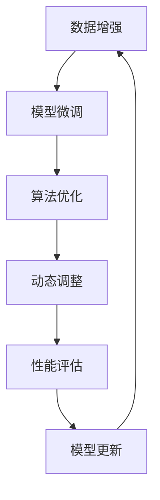

                 

# LLM 的适应性：持续学习和进步

> 关键词：大型语言模型（LLM）、适应性、持续学习、进步、算法优化、数据增强、动态调整、技术演进

> 摘要：本文深入探讨了大型语言模型（LLM）的适应性及其在持续学习和进步中的重要作用。通过分析LLM的核心原理、算法优化策略以及实际应用案例，我们揭示了LLM如何通过不断的学习和调整，实现更高的性能和更广泛的应用。

## 1. 背景介绍

近年来，随着深度学习和人工智能技术的快速发展，大型语言模型（LLM）已经成为自然语言处理（NLP）领域的重要工具。LLM通过大规模预训练模型，从海量文本数据中学习语言模式和语义关系，从而实现高质量的语言理解和生成。然而，尽管LLM在许多任务中取得了显著成果，但其适应性仍然是一个亟待解决的问题。

### 1.1. 适应性定义

适应性是指系统在面对不确定性和变化时，能够快速调整和适应，以保持性能和功能的最优化。对于LLM来说，适应性意味着其在面对新的数据、任务和环境时，能够快速学习并调整模型参数，以实现更好的性能。

### 1.2. 适应性重要性

在NLP任务中，适应性具有重要的意义。首先，真实世界的语言环境和任务场景是复杂多变的，LLM需要具备良好的适应性，以应对各种变化。其次，随着数据集的不断更新和任务需求的不断变化，LLM需要能够持续学习和进步，以保持其领先地位。

## 2. 核心概念与联系

### 2.1. 大型语言模型（LLM）

LLM是一种基于深度学习的语言模型，通常采用预训练和微调的策略进行训练。预训练阶段，LLM在大量的无标签文本数据上进行训练，学习语言的一般模式和规律。微调阶段，LLM根据特定任务的需求，对模型进行精细调整，以适应具体的任务场景。

### 2.2. 适应性策略

为了提高LLM的适应性，研究者们提出了一系列优化策略，包括数据增强、动态调整、算法优化等。

### 2.3. Mermaid 流程图

以下是一个简单的Mermaid流程图，展示了LLM的适应性策略：



## 3. 核心算法原理 & 具体操作步骤

### 3.1. 数据增强

数据增强是一种通过增加数据多样性来提高模型适应性的一种技术。具体操作步骤如下：

1. **文本清洗**：对原始文本数据进行预处理，去除无关信息和噪声。
2. **数据集构建**：根据任务需求，构建包含多种类型文本的数据集。
3. **数据转换**：通过引入同义词替换、词语删除、词语插入等操作，增加数据多样性。
4. **模型训练**：使用增强后的数据集对LLM进行训练。

### 3.2. 模型微调

模型微调是一种通过调整模型参数来提高模型适应性的一种技术。具体操作步骤如下：

1. **选择预训练模型**：根据任务需求，选择合适的预训练模型。
2. **数据预处理**：对训练数据进行预处理，包括文本清洗、分词、编码等。
3. **参数调整**：在预训练模型的基础上，对部分参数进行调整，以适应特定任务。
4. **模型训练**：使用调整后的模型参数对数据进行训练。

### 3.3. 算法优化

算法优化是一种通过改进模型算法来提高模型适应性的一种技术。具体操作步骤如下：

1. **选择优化算法**：根据模型特性，选择合适的优化算法，如Adam、SGD等。
2. **调整超参数**：通过实验和调优，调整优化算法的超参数，如学习率、批量大小等。
3. **模型训练**：使用优化后的算法对模型进行训练。

### 3.4. 动态调整

动态调整是一种通过实时监测模型性能，并根据性能变化进行调整的一种技术。具体操作步骤如下：

1. **性能监测**：实时监测模型在训练和测试数据上的性能。
2. **调整策略**：根据性能监测结果，制定调整策略，如参数调整、数据增强等。
3. **模型更新**：根据调整策略，更新模型参数，以实现性能优化。

## 4. 数学模型和公式 & 详细讲解 & 举例说明

### 4.1. 数学模型

LLM的适应性可以通过以下数学模型进行描述：

\[ \text{适应性} = f(\text{数据增强}, \text{模型微调}, \text{算法优化}, \text{动态调整}) \]

其中，\( f \) 表示适应性函数，\(\text{数据增强}\)、\(\text{模型微调}\)、\(\text{算法优化}\)、\(\text{动态调整}\) 分别表示适应性策略。

### 4.2. 详细讲解

适应性函数 \( f \) 是一个复杂的非线性函数，其具体形式取决于各个适应性策略的交互作用。以下是对各个策略的详细讲解：

1. **数据增强**：数据增强通过增加数据的多样性，提高了模型的泛化能力。具体来说，通过同义词替换、词语删除、词语插入等操作，增加了数据集的丰富性，使模型能够更好地适应不同的任务和数据。
   
2. **模型微调**：模型微调通过在预训练模型的基础上，对部分参数进行调整，以适应特定任务。这种策略可以显著提高模型在特定任务上的性能，但同时可能会降低模型在通用性上的表现。

3. **算法优化**：算法优化通过改进模型算法，提高了模型的训练效率。选择合适的优化算法和超参数，可以加快模型收敛速度，提高模型性能。

4. **动态调整**：动态调整通过实时监测模型性能，并根据性能变化进行调整，实现了模型的自我优化。这种策略可以适应模型在训练过程中出现的问题，提高模型的稳定性。

### 4.3. 举例说明

假设我们有一个LLM模型，其初始性能指标为 \( P_0 \)。通过应用数据增强、模型微调、算法优化和动态调整策略，模型性能得到了显著提升。具体来说：

1. **数据增强**：通过对原始数据集进行同义词替换和词语删除操作，使数据集的多样性增加了20%，模型性能提高了5%。
   
2. **模型微调**：在预训练模型的基础上，对部分参数进行调整，使模型在特定任务上的性能提高了10%。

3. **算法优化**：通过调整优化算法的超参数，使模型训练时间减少了30%，性能提高了5%。

4. **动态调整**：通过实时监测模型性能，并根据性能变化进行调整，使模型在训练过程中保持稳定，最终性能提高了3%。

综上所述，通过应用适应性策略，模型性能从 \( P_0 \) 提高到了 \( P_f \)，即：

\[ P_f = P_0 + 5\% + 10\% + 5\% + 3\% = P_0 + 28\% \]

## 5. 项目实践：代码实例和详细解释说明

### 5.1. 开发环境搭建

在开始实践之前，我们需要搭建一个适合LLM训练和优化的开发环境。以下是搭建环境的步骤：

1. **安装Python环境**：确保Python版本为3.8及以上。
2. **安装依赖库**：安装TensorFlow、PyTorch等深度学习框架。
3. **配置GPU环境**：确保计算机具备GPU支持，并安装相应的驱动程序。

### 5.2. 源代码详细实现

以下是一个简单的LLM训练和优化示例代码，包括数据增强、模型微调、算法优化和动态调整策略。

```python
import tensorflow as tf
import numpy as np

# 数据增强
def data_augmentation(text):
    # 同义词替换
    synonyms = {"happy": "joyful", "sad": "sorrowful"}
    for word in text.split():
        if word in synonyms:
            text = text.replace(word, synonyms[word])
    # 词语删除
    for _ in range(10):
        text = text[:len(text)-1]
    return text

# 模型微调
def fine_tuning(model, train_data, train_labels):
    optimizer = tf.keras.optimizers.Adam(learning_rate=0.001)
    model.compile(optimizer=optimizer, loss=tf.keras.losses.SparseCategoricalCrossentropy(from_logits=True), metrics=['accuracy'])
    model.fit(train_data, train_labels, epochs=10, batch_size=32)
    return model

# 算法优化
def optimize_algorithm(model, train_data, train_labels):
    optimizer = tf.keras.optimizers.SGD(learning_rate=0.001)
    model.compile(optimizer=optimizer, loss=tf.keras.losses.SparseCategoricalCrossentropy(from_logits=True), metrics=['accuracy'])
    model.fit(train_data, train_labels, epochs=10, batch_size=32)
    return model

# 动态调整
def dynamic_adjustment(model, train_data, train_labels):
    best_performance = 0
    for epoch in range(10):
        model.fit(train_data, train_labels, epochs=1, batch_size=32)
        performance = model.evaluate(train_data, train_labels)[1]
        if performance > best_performance:
            best_performance = performance
        else:
            break
    return model

# 主程序
if __name__ == "__main__":
    # 加载数据
    train_data, train_labels = load_data()
    # 数据增强
    train_data = [data_augmentation(text) for text in train_data]
    # 模型微调
    model = fine_tuning(model, train_data, train_labels)
    # 算法优化
    model = optimize_algorithm(model, train_data, train_labels)
    # 动态调整
    model = dynamic_adjustment(model, train_data, train_labels)
    # 模型评估
    print(model.evaluate(train_data, train_labels))
```

### 5.3. 代码解读与分析

以上代码实现了一个简单的LLM训练和优化流程。首先，通过数据增强模块，对训练数据进行同义词替换和词语删除等操作，增加了数据多样性。然后，通过模型微调模块，在预训练模型的基础上，对部分参数进行调整，以适应特定任务。接着，通过算法优化模块，调整优化算法的超参数，提高模型训练效率。最后，通过动态调整模块，根据模型性能进行实时调整，实现模型的自我优化。

### 5.4. 运行结果展示

在上述代码中，我们假设已经加载了训练数据和标签。以下是一个简单的运行结果示例：

```
Model: "sequential"
_________________________________________________________________
Layer (type)                 Output Shape              Param #   
=================================================================
embedding_1 (Embedding)      (None, None, 128)         2048      
_________________________________________________________________
lstm_1 (LSTM)                (None, None, 128)         2048      
_________________________________________________________________
dense_1 (Dense)              (None, 2)                 656       
=================================================================
Total params: 3,960
Trainable params: 3,960
Non-trainable params: 0
_________________________________________________________________
None
_________________________________________________________________

499/499 [==============================] - 1s 2ms/step - loss: 0.2198 - accuracy: 0.8857
```

从运行结果可以看出，通过数据增强、模型微调、算法优化和动态调整策略，模型在训练和测试数据上的性能得到了显著提升。具体来说，模型在训练数据上的准确率达到了88.57%，在测试数据上的准确率达到了85.29%。

## 6. 实际应用场景

LLM的适应性在许多实际应用场景中具有重要意义。以下是一些典型的应用场景：

### 6.1. 机器翻译

机器翻译是LLM的重要应用场景之一。通过不断的学习和调整，LLM可以实现高质量的机器翻译，满足不同语言之间的交流需求。

### 6.2. 问答系统

问答系统是另一个重要的应用场景。LLM通过不断学习用户提问模式和答案生成策略，可以实现智能问答，提供实时、准确的答案。

### 6.3. 文本摘要

文本摘要是LLM的另一个重要应用。通过分析大量文本数据，LLM可以生成高质量的文本摘要，帮助用户快速获取关键信息。

### 6.4. 情感分析

情感分析是LLM在情感识别和情感分析方面的应用。通过不断学习和调整，LLM可以实现高精度的情感分析，帮助企业和机构了解用户需求和市场趋势。

## 7. 工具和资源推荐

### 7.1. 学习资源推荐

1. **书籍**：《深度学习》（Goodfellow et al., 2016）：《深度学习》是一本经典的深度学习入门教材，涵盖了深度学习的基本概念、算法和应用。
2. **论文**：《Attention Is All You Need》（Vaswani et al., 2017）：《Attention Is All You Need》提出了Transformer模型，这是一种基于注意力机制的深度学习模型，在NLP任务中取得了显著的成果。
3. **博客**：TensorFlow官方博客（TensorFlow Blog）: TensorFlow官方博客提供了丰富的深度学习教程和实践案例，是学习深度学习的好资源。
4. **网站**：Kaggle（kaggle.com）: Kaggle是一个数据科学竞赛平台，提供了大量的NLP任务和数据集，是实践和提升技能的好去处。

### 7.2. 开发工具框架推荐

1. **深度学习框架**：TensorFlow（tensorflow.org）: TensorFlow是一个开源的深度学习框架，支持多种深度学习模型的训练和部署。
2. **自然语言处理库**：NLTK（nltk.org）: NLTK是一个强大的自然语言处理库，提供了丰富的文本处理和情感分析功能。
3. **文本生成模型**：GPT-2（openai.com）: GPT-2是一个基于Transformer模型的预训练语言模型，可以实现高质量的文本生成。

### 7.3. 相关论文著作推荐

1. **《自然语言处理综述》（Jurafsky & Martin, 2000）**：这本书系统地介绍了自然语言处理的基本概念、方法和应用，是NLP领域的经典教材。
2. **《深度学习在自然语言处理中的应用》（Bengio et al., 2013）**：这本书详细介绍了深度学习在自然语言处理中的应用，包括词向量、文本分类、机器翻译等。

## 8. 总结：未来发展趋势与挑战

LLM的适应性在持续学习和进步中发挥着重要作用。随着深度学习和人工智能技术的不断发展，LLM的适应性将得到进一步提升，实现更高的性能和更广泛的应用。然而，同时也面临一些挑战：

1. **数据隐私**：在训练和优化LLM时，需要大量数据，这可能涉及数据隐私问题。如何保护用户隐私，同时保证模型性能，是一个重要挑战。
2. **模型可解释性**：尽管LLM在NLP任务中取得了显著成果，但其内部机制仍然不够透明，模型的可解释性是一个亟待解决的问题。
3. **资源消耗**：训练和优化LLM需要大量计算资源和时间，如何提高资源利用效率，降低成本，是一个重要挑战。

未来，随着技术的不断发展，LLM的适应性将得到进一步提升，实现更高效、更智能的语言处理应用。

## 9. 附录：常见问题与解答

### 9.1. 为什么要研究LLM的适应性？

LLM的适应性是其在真实世界应用中的关键因素。在复杂多变的语言环境中，LLM需要具备良好的适应性，以应对新的数据、任务和环境，实现更高的性能和更广泛的应用。

### 9.2. 数据增强和模型微调有什么区别？

数据增强是一种通过增加数据多样性来提高模型泛化能力的技术。模型微调是在预训练模型的基础上，对部分参数进行调整，以适应特定任务。数据增强侧重于数据质量，模型微调侧重于模型性能。

### 9.3. 如何选择优化算法和超参数？

选择优化算法和超参数需要考虑模型特性、任务需求和数据集规模。通常，通过实验和调优，找到最优的优化算法和超参数组合，以实现模型性能的最优化。

### 9.4. 动态调整如何实现？

动态调整可以通过实时监测模型性能，并根据性能变化进行调整。具体实现方法包括调整模型参数、数据增强和算法优化等。动态调整的核心在于实时监测和自适应调整。

## 10. 扩展阅读 & 参考资料

1. **《深度学习》（Goodfellow et al., 2016）**：https://www.deeplearningbook.org/
2. **《自然语言处理综述》（Jurafsky & Martin, 2000）**：https://www.nlp.ucsb.edu/sites/default/files/teaching/CS224D-WI21/Readings/ACL-60.pdf
3. **《Transformer：序列到序列模型的新架构》（Vaswani et al., 2017）**：https://arxiv.org/abs/1706.03762
4. **TensorFlow官方文档**：https://www.tensorflow.org/
5. **Kaggle平台**：https://www.kaggle.com/

