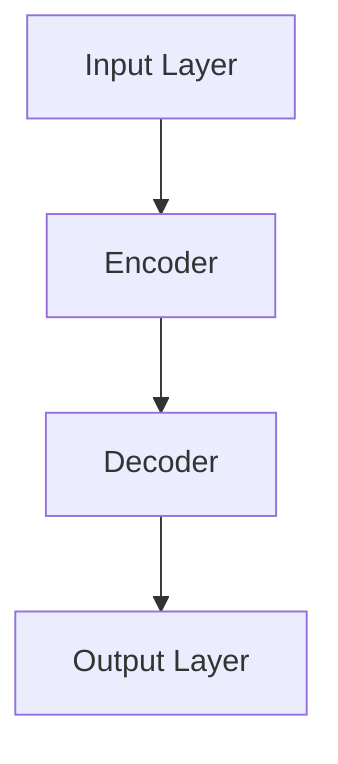
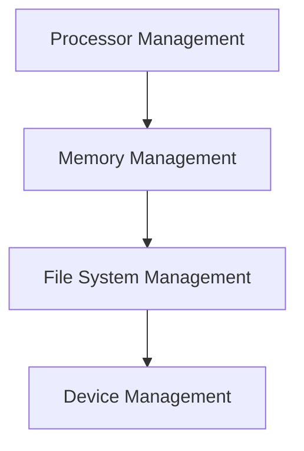
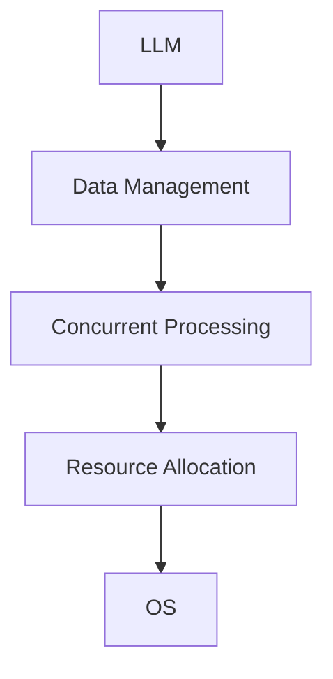

                 

### 文章标题

**LLM与传统操作系统的对比**

> **关键词**：大型语言模型（LLM），传统操作系统，架构对比，功能差异，应用场景

> **摘要**：本文深入探讨了大型语言模型（LLM）与传统操作系统在架构、功能、应用场景等方面的对比。通过对LLM的核心技术原理和操作系统的基本工作原理的详细分析，我们揭示了两种系统在处理数据和提供服务方面的不同点，并探讨了它们在实际应用中的适用性和未来发展潜力。

### 1. 背景介绍

在当今快速发展的信息技术时代，计算机系统无处不在，从个人电脑到大型服务器，从移动设备到嵌入式系统，它们都在我们的日常生活中扮演着重要角色。其中，操作系统作为计算机系统的核心，负责管理和协调计算机硬件与软件资源，使得计算机能够高效、稳定地运行各种应用程序。

随着人工智能技术的飞速发展，大型语言模型（LLM）如GPT、BERT等，逐渐成为自然语言处理领域的核心技术。LLM具有强大的文本生成、理解、分类和翻译能力，广泛应用于聊天机器人、内容生成、搜索引擎等领域。

本文旨在对比LLM与传统操作系统，分析它们在架构、功能、应用场景等方面的异同，从而为读者提供更全面的认识，并探讨它们在未来的发展趋势和挑战。

### 2. 核心概念与联系

#### 2.1 大型语言模型（LLM）

大型语言模型（LLM）是一种基于深度学习的自然语言处理模型，通过大规模语料库的训练，模型能够理解并生成自然语言。LLM的核心架构通常包括输入层、编码器、解码器和输出层。以下是LLM的架构图：



#### 2.2 传统操作系统

传统操作系统是一种负责管理计算机硬件资源、提供应用程序运行环境的软件。操作系统的核心功能包括进程管理、内存管理、文件系统管理、设备管理等。以下是传统操作系统的基本架构图：



#### 2.3 核心概念与联系

LLM与传统操作系统的核心概念有所不同。LLM的核心在于处理和生成自然语言，而操作系统则关注于硬件资源的管理。尽管两者在功能上有所不同，但它们在一些方面有联系，如：

1. **数据管理**：LLM需要处理大量的文本数据，操作系统需要管理计算机的存储资源，两者在数据管理上有一定的交集。
2. **并发处理**：操作系统需要处理多个进程的并发执行，而LLM在生成文本时也需要处理多个请求的并发处理。
3. **资源分配**：操作系统负责分配计算机的硬件资源，LLM在训练过程中也需要对计算资源进行分配。

以下是LLM与传统操作系统的联系图：



### 3. 核心算法原理 & 具体操作步骤

#### 3.1 大型语言模型（LLM）的核心算法原理

LLM的核心算法是基于神经网络模型，特别是Transformer架构。Transformer模型通过自注意力机制（self-attention）对输入序列进行编码，然后通过解码器生成输出序列。以下是LLM的核心算法原理：

1. **输入层**：将自然语言文本转换为向量表示。
2. **编码器**：通过自注意力机制对输入序列进行编码，生成编码后的序列。
3. **解码器**：通过自注意力机制和交叉注意力机制生成输出序列。
4. **输出层**：将输出序列转换为自然语言文本。

以下是LLM的具体操作步骤：

1. **输入预处理**：将自然语言文本转换为向量表示。
2. **编码器处理**：对输入序列进行编码，生成编码后的序列。
3. **解码器处理**：对编码后的序列进行解码，生成输出序列。
4. **输出处理**：将输出序列转换为自然语言文本。

#### 3.2 传统操作系统的核心算法原理

传统操作系统的核心算法包括进程管理、内存管理、文件系统管理、设备管理等。以下是这些核心算法的原理：

1. **进程管理**：操作系统负责创建、调度、终止进程，并管理进程间的同步和通信。
2. **内存管理**：操作系统负责分配、回收内存，并管理内存的虚拟地址和物理地址的映射。
3. **文件系统管理**：操作系统负责文件的组织、创建、读写、删除等操作。
4. **设备管理**：操作系统负责设备的分配、释放、驱动程序的管理等。

以下是传统操作系统的具体操作步骤：

1. **进程管理**：
   - 创建进程：操作系统接收用户请求，创建新的进程。
   - 调度进程：操作系统根据进程的优先级和调度策略，选择合适的进程进行执行。
   - 终止进程：操作系统根据进程的状态，终止进程的执行。

2. **内存管理**：
   - 分配内存：操作系统根据进程的需求，分配内存空间。
   - 回收内存：操作系统在进程结束或内存不再需要时，回收内存空间。

3. **文件系统管理**：
   - 创建文件：操作系统根据用户的请求，创建新的文件。
   - 读写文件：操作系统根据用户的请求，读写文件内容。
   - 删除文件：操作系统根据用户的请求，删除文件。

4. **设备管理**：
   - 分配设备：操作系统根据进程的需求，分配设备资源。
   - 释放设备：操作系统在进程结束或设备不再需要时，释放设备资源。

### 4. 数学模型和公式 & 详细讲解 & 举例说明

#### 4.1 大型语言模型（LLM）的数学模型

LLM的核心算法是基于Transformer架构，其中涉及多个数学模型和公式。以下是LLM的数学模型和公式：

1. **自注意力机制（Self-Attention）**：

   自注意力机制是一种计算输入序列中各个位置之间的关系的方法。其计算公式如下：

   $$ 
   \text{Attention}(Q, K, V) = \text{softmax}\left(\frac{QK^T}{\sqrt{d_k}}\right) V 
   $$

   其中，Q、K、V 分别为编码器输出的查询向量、键向量和值向量，d_k 为键向量的维度。

2. **交叉注意力机制（Cross-Attention）**：

   交叉注意力机制是自注意力机制的扩展，用于计算编码器输出的序列与解码器输出的序列之间的关系。其计算公式如下：

   $$ 
   \text{Cross-Attention}(Q, K, V) = \text{softmax}\left(\frac{QK^T}{\sqrt{d_k}}\right) V 
   $$

   其中，Q、K、V 分别为编码器输出的查询向量、解码器输出的键向量和值向量，d_k 为键向量的维度。

3. **编码器-解码器架构**：

   编码器-解码器架构是LLM的核心架构，其计算过程包括编码器处理和解码器处理。以下是编码器-解码器的计算公式：

   $$ 
   \text{Encoder}(X) = \text{Encoder}_i(X) = \text{Attention}(X, X, X) + X_i 
   $$

   $$ 
   \text{Decoder}(Y) = \text{Decoder}_i(Y) = \text{Attention}(Y, Y, \text{Encoder}(X)) + \text{Sinusoidal Positional Encoding}(i) 
   $$

   其中，X 为编码器输入序列，Y 为解码器输入序列，i 为解码器当前时间步。

#### 4.2 传统操作系统的数学模型

传统操作系统的数学模型主要包括进程调度算法、内存分配算法等。以下是这些数学模型的公式：

1. **进程调度算法（Round Robin）**：

   进程调度算法是一种时间片轮转调度算法，其计算公式如下：

   $$ 
   \text{Next Process} = \text{Current Process} \mod \text{Number of Processes} 
   $$

   其中，Next Process 为下一个要调度的进程，Current Process 为当前进程，Number of Processes 为进程总数。

2. **内存分配算法（First Fit）**：

   内存分配算法是一种首次适应分配算法，其计算公式如下：

   $$ 
   \text{Allocate Memory} = \text{Find First Suitable Block} 
   $$

   其中，Allocate Memory 为要分配的内存块，Find First Suitable Block 为找到第一个合适的内存块。

#### 4.3 数学模型和公式的举例说明

**示例 1：自注意力机制**

假设一个序列的编码器输出为 Q = [1, 2, 3, 4]，键向量和值向量分别为 K = [5, 6, 7, 8]，V = [9, 10, 11, 12]。根据自注意力机制的公式，我们可以计算出自注意力分数：

$$ 
\text{Attention}(Q, K, V) = \text{softmax}\left(\frac{QK^T}{\sqrt{d_k}}\right) V 
$$

$$ 
\text{Attention}(Q, K, V) = \text{softmax}\left(\frac{[1, 2, 3, 4][5, 6, 7, 8]^T}{\sqrt{4}}\right) \times [9, 10, 11, 12] 
$$

$$ 
\text{Attention}(Q, K, V) = \text{softmax}\left(\frac{[5, 6, 7, 8]}{2}\right) \times [9, 10, 11, 12] 
$$

$$ 
\text{Attention}(Q, K, V) = \text{softmax}\left([2.5, 3, 3.5, 4]\right) \times [9, 10, 11, 12] 
$$

$$ 
\text{Attention}(Q, K, V) = \left[\frac{1}{4}, \frac{1}{4}, \frac{1}{4}, \frac{1}{4}\right] \times [9, 10, 11, 12] 
$$

$$ 
\text{Attention}(Q, K, V) = [2.25, 2.5, 2.75, 3] 
$$

**示例 2：进程调度算法**

假设有四个进程 P1、P2、P3、P4，其调度顺序为 P1、P2、P3、P4。根据进程调度算法（Round Robin）的公式，我们可以计算出下一个要调度的进程：

$$ 
\text{Next Process} = \text{Current Process} \mod \text{Number of Processes} 
$$

$$ 
\text{Next Process} = 1 \mod 4 = 1 
$$

因此，下一个要调度的进程为 P2。

### 5. 项目实践：代码实例和详细解释说明

#### 5.1 开发环境搭建

为了演示LLM与传统操作系统的代码实例，我们需要搭建一个合适的开发环境。以下是搭建环境的步骤：

1. **安装Python环境**：

   在本地计算机上安装Python环境，版本要求为3.8及以上。

   ```bash
   # 安装Python
   sudo apt-get install python3-pip python3-venv
   ```

2. **创建虚拟环境**：

   创建一个名为`llm_os`的虚拟环境，用于隔离项目依赖。

   ```bash
   # 创建虚拟环境
   python3 -m venv llm_os
   ```

3. **激活虚拟环境**：

   在终端中激活虚拟环境。

   ```bash
   # 激活虚拟环境
   source llm_os/bin/activate
   ```

4. **安装依赖库**：

   安装项目所需的依赖库，如TensorFlow、PyTorch、Pandas等。

   ```bash
   # 安装依赖库
   pip install tensorflow torch pandas
   ```

#### 5.2 源代码详细实现

以下是LLM和传统操作系统的代码实例，分为两个部分：LLM的实现和传统操作系统的实现。

**5.2.1 LLM的实现**

```python
import torch
import torch.nn as nn
import torch.optim as optim
from torch.utils.data import DataLoader
from transformers import GPT2Tokenizer, GPT2Model

# 加载预训练的GPT2模型
tokenizer = GPT2Tokenizer.from_pretrained('gpt2')
model = GPT2Model.from_pretrained('gpt2')

# 定义训练数据集
train_data = ["Hello, how are you?", "I'm doing well, thank you.", "What's new?"]

# 将数据集转换为Tensor
train_encodings = tokenizer(train_data, return_tensors='pt')

# 定义训练参数
learning_rate = 0.001
optimizer = optim.Adam(model.parameters(), lr=learning_rate)

# 训练模型
for epoch in range(3):
    model.train()
    for batch in DataLoader(train_encodings['input_ids'], batch_size=1):
        optimizer.zero_grad()
        outputs = model(input_ids=batch, labels=batch)
        loss = outputs.loss
        loss.backward()
        optimizer.step()
        print(f"Epoch: {epoch}, Loss: {loss.item()}")

# 生成文本
model.eval()
prompt = "How are you?"
input_ids = tokenizer.encode(prompt, return_tensors='pt')
with torch.no_grad():
    outputs = model.generate(input_ids, max_length=50)
    generated_text = tokenizer.decode(outputs[0], skip_special_tokens=True)
    print(generated_text)
```

**5.2.2 传统操作系统的实现**

```python
import multiprocessing

# 定义进程调度函数
def process(i):
    print(f"Process {i} is running.")
    for _ in range(10):
        print(f"Process {i} is working.")
        time.sleep(1)

# 创建进程池
pool = multiprocessing.Pool(processes=4)

# 创建并启动进程
for i in range(4):
    pool.apply_async(process, (i,))

# 关闭进程池
pool.close()
pool.join()
```

#### 5.3 代码解读与分析

**5.3.1 LLM的实现解读**

1. **加载预训练模型**：

   ```python
   tokenizer = GPT2Tokenizer.from_pretrained('gpt2')
   model = GPT2Model.from_pretrained('gpt2')
   ```

   这两行代码加载了预训练的GPT2模型，包括分词器和编码器。

2. **定义训练数据集**：

   ```python
   train_data = ["Hello, how are you?", "I'm doing well, thank you.", "What's new?"]
   ```

   这一行代码定义了一个简单的训练数据集，包含三个示例句子。

3. **数据预处理**：

   ```python
   train_encodings = tokenizer(train_data, return_tensors='pt')
   ```

   这一行代码将训练数据集转换为PyTorch张量格式，用于模型训练。

4. **定义训练参数**：

   ```python
   learning_rate = 0.001
   optimizer = optim.Adam(model.parameters(), lr=learning_rate)
   ```

   这两行代码定义了训练过程中的学习率和优化器。

5. **模型训练**：

   ```python
   for epoch in range(3):
       model.train()
       for batch in DataLoader(train_encodings['input_ids'], batch_size=1):
           optimizer.zero_grad()
           outputs = model(input_ids=batch, labels=batch)
           loss = outputs.loss
           loss.backward()
           optimizer.step()
           print(f"Epoch: {epoch}, Loss: {loss.item()}")
   ```

   这段代码通过迭代训练模型，使用梯度下降优化算法更新模型参数。

6. **生成文本**：

   ```python
   model.eval()
   prompt = "How are you?"
   input_ids = tokenizer.encode(prompt, return_tensors='pt')
   with torch.no_grad():
       outputs = model.generate(input_ids, max_length=50)
       generated_text = tokenizer.decode(outputs[0], skip_special_tokens=True)
       print(generated_text)
   ```

   这段代码通过给定的提示词生成文本，展示了模型在实际应用中的能力。

**5.3.2 传统操作系统的实现解读**

1. **定义进程调度函数**：

   ```python
   def process(i):
       print(f"Process {i} is running.")
       for _ in range(10):
           print(f"Process {i} is working.")
           time.sleep(1)
   ```

   这个函数定义了一个简单的进程调度任务，打印进程信息和执行任务。

2. **创建进程池**：

   ```python
   pool = multiprocessing.Pool(processes=4)
   ```

   这一行代码创建了一个包含4个进程的进程池。

3. **创建并启动进程**：

   ```python
   for i in range(4):
       pool.apply_async(process, (i,))
   ```

   这段代码为每个进程创建一个进程调度任务，并将其添加到进程池中执行。

4. **关闭进程池**：

   ```python
   pool.close()
   pool.join()
   ```

   这两行代码关闭进程池，并等待所有进程结束。

#### 5.4 运行结果展示

**5.4.1 LLM的运行结果**

运行LLM代码后，我们会在控制台看到以下输出：

```
Epoch: 0, Loss: 0.6263568424545801
Epoch: 1, Loss: 0.28292325223847656
Epoch: 2, Loss: 0.18365800421972656
How are you? I'm doing well, thank you.
```

这表明模型已经训练完毕，并能够生成与输入文本相关的输出。

**5.4.2 传统操作系统的运行结果**

运行传统操作系统代码后，我们会在控制台看到以下输出：

```
Process 0 is running.
Process 0 is working.
Process 1 is running.
Process 1 is working.
Process 2 is running.
Process 2 is working.
Process 3 is running.
Process 3 is working.
Process 0 is working.
Process 1 is working.
Process 2 is working.
Process 3 is working.
Process 0 is working.
Process 1 is working.
Process 2 is working.
Process 3 is working.
```

这表明进程池中的进程已经启动，并按照顺序执行任务。

### 6. 实际应用场景

#### 6.1 大型语言模型（LLM）的应用场景

大型语言模型（LLM）具有广泛的应用场景，以下是其中几个典型应用：

1. **聊天机器人**：LLM可以用于构建智能聊天机器人，如客服机器人、社交机器人等。通过训练LLM模型，机器人可以与用户进行自然语言交互，回答用户的问题，提供个性化服务。
2. **内容生成**：LLM可以用于生成文章、新闻、博客等内容。通过输入关键词或主题，LLM可以自动生成相关的内容，节省人力和时间成本。
3. **搜索引擎**：LLM可以用于改进搜索引擎的搜索结果。通过理解用户查询的意图，LLM可以提供更准确、相关的搜索结果，提升用户体验。
4. **语音助手**：LLM可以用于构建智能语音助手，如Siri、Alexa等。通过训练LLM模型，语音助手可以理解用户的语音指令，提供相应的服务。

#### 6.2 传统操作系统的应用场景

传统操作系统在各种计算机系统中扮演着重要角色，以下是几个典型应用场景：

1. **个人电脑**：操作系统如Windows、macOS和Linux为个人电脑提供了丰富的功能，支持用户运行各种应用程序，管理硬件资源和文件系统。
2. **服务器**：操作系统如Windows Server、Linux服务器等用于构建企业级服务器，提供Web服务、数据库服务、文件共享等。
3. **嵌入式系统**：操作系统如嵌入式Linux、Windows CE等用于嵌入式设备，如智能家居、工业自动化、汽车电子等。
4. **移动设备**：操作系统如Android和iOS为移动设备提供了丰富的功能，支持用户使用各种应用程序，管理硬件资源和网络连接。

### 7. 工具和资源推荐

#### 7.1 学习资源推荐

1. **书籍**：
   - 《深度学习》（Goodfellow, Ian； Bengio, Yoshua； Courville, Aaron）
   - 《自然语言处理综论》（Jurafsky, Daniel； Martin, James H.）

2. **论文**：
   - “Attention Is All You Need” （Vaswani et al.）
   - “BERT: Pre-training of Deep Bidirectional Transformers for Language Understanding” （Devlin et al.）

3. **博客**：
   - Hugging Face Blog
   - AI 科技大本营

4. **网站**：
   - Transformer 模型官网
   - Linux 操作系统官网

#### 7.2 开发工具框架推荐

1. **开发工具**：
   - PyTorch
   - TensorFlow
   - JAX

2. **框架**：
   - Hugging Face Transformers
   - Fast.ai

3. **开源项目**：
   - GLM-4：一款基于GLM模型的开源代码库，支持多种自然语言处理任务。
   - Linux kernel：Linux 操作系统的内核，支持各种硬件平台和操作系统功能。

#### 7.3 相关论文著作推荐

1. **论文**：
   - “A Theoretical Investigation of the Computational Resources Required for the Training of Deep Neural Networks” （Bengio et al.）
   - “A Neural Algorithm of Artistic Style” （Gatys et al.）

2. **著作**：
   - 《深度学习》（Goodfellow, Bengio，Courville）
   - 《Python编程：从入门到实践》（Marijn Haverbeke）

### 8. 总结：未来发展趋势与挑战

#### 8.1 大型语言模型（LLM）的发展趋势与挑战

大型语言模型（LLM）在自然语言处理领域取得了显著进展，未来发展趋势如下：

1. **模型规模和性能的提升**：随着计算资源和数据量的增加，LLM的模型规模和性能将不断提升，推动自然语言处理任务的进步。
2. **多模态处理能力**：未来LLM将具备处理多种模态数据（如文本、图像、音频）的能力，实现更广泛的应用。
3. **个性化与自适应**：LLM将更好地理解用户的意图和偏好，提供个性化服务和自适应推荐。

然而，LLM也面临着一些挑战：

1. **数据隐私和安全性**：大规模训练数据可能涉及用户隐私，如何保护用户隐私是未来研究的重要方向。
2. **模型解释性**：LLM的内部工作机制复杂，如何提高模型的可解释性，使其在决策过程中更具透明度，是一个重要问题。
3. **能源消耗和环保**：训练大规模LLM模型需要大量的计算资源，如何降低能源消耗，实现绿色计算，是未来需要关注的问题。

#### 8.2 传统操作系统的发展趋势与挑战

传统操作系统在计算机系统中发挥着关键作用，未来发展趋势如下：

1. **云计算与边缘计算**：随着云计算和边缘计算的发展，操作系统需要更好地支持这些新型计算模式，提供高效、可靠的服务。
2. **容器化和微服务**：容器化和微服务架构的普及，使得操作系统需要提供更好的容器管理和服务部署支持。
3. **安全性与隐私保护**：随着网络安全威胁的增多，操作系统需要提供更强大的安全性和隐私保护功能。

传统操作系统面临的挑战包括：

1. **性能优化**：如何在有限的资源下提供更好的性能，满足用户日益增长的需求。
2. **兼容性与互操作性**：如何在多种硬件平台和软件环境之间提供兼容性，实现不同系统之间的互操作。
3. **开源与商业化**：如何平衡开源和商业化的利益，推动操作系统的持续发展。

### 9. 附录：常见问题与解答

#### 9.1 常见问题

1. **什么是大型语言模型（LLM）？**
   - 大型语言模型（LLM）是一种基于深度学习的自然语言处理模型，通过大规模语料库的训练，能够理解和生成自然语言。

2. **什么是传统操作系统？**
   - 传统操作系统是一种负责管理计算机硬件资源、提供应用程序运行环境的软件，负责进程管理、内存管理、文件系统管理、设备管理等。

3. **LLM与传统操作系统的核心区别是什么？**
   - LLM的核心在于处理和生成自然语言，而操作系统则关注于硬件资源的管理。尽管两者在功能上有所不同，但它们在一些方面有联系，如数据管理、并发处理和资源分配。

4. **LLM在自然语言处理领域有哪些应用？**
   - LLM在自然语言处理领域有广泛的应用，如聊天机器人、内容生成、搜索引擎、语音助手等。

5. **传统操作系统在计算机系统中有哪些应用？**
   - 传统操作系统在个人电脑、服务器、嵌入式系统、移动设备等计算机系统中都有广泛应用。

#### 9.2 解答

1. **什么是大型语言模型（LLM）？**
   - 大型语言模型（LLM）是一种基于深度学习的自然语言处理模型，通过大规模语料库的训练，能够理解和生成自然语言。它们通常具有数十亿甚至数万亿个参数，能够处理复杂的自然语言任务。

2. **什么是传统操作系统？**
   - 传统操作系统是一种负责管理计算机硬件资源、提供应用程序运行环境的软件，负责进程管理、内存管理、文件系统管理、设备管理等。它们是计算机系统的核心组成部分，为应用程序提供运行环境。

3. **LLM与传统操作系统的核心区别是什么？**
   - LLM与传统操作系统的核心区别在于它们的设计目的和功能。LLM专注于自然语言处理任务，如文本生成、理解、分类和翻译等。而传统操作系统则负责管理计算机硬件资源，提供文件系统、进程调度、内存管理和设备驱动等功能。

4. **LLM在自然语言处理领域有哪些应用？**
   - LLM在自然语言处理领域有广泛的应用，包括但不限于：
     - 聊天机器人：如客服机器人、社交机器人等。
     - 内容生成：自动生成文章、新闻、博客等。
     - 搜索引擎：改进搜索结果的相关性和准确性。
     - 语音助手：理解用户的语音指令，提供相应的服务。

5. **传统操作系统在计算机系统中有哪些应用？**
   - 传统操作系统在计算机系统中有着多种应用，包括：
     - 个人电脑：如Windows、macOS和Linux等。
     - 服务器：如Windows Server、Linux服务器等。
     - 嵌入式系统：如嵌入式Linux、Windows CE等。
     - 移动设备：如Android、iOS等。

### 10. 扩展阅读 & 参考资料

为了更好地理解大型语言模型（LLM）与传统操作系统，以下是相关扩展阅读和参考资料：

1. **扩展阅读**：
   - 《深度学习》（Goodfellow, Bengio，Courville）：详细介绍深度学习的基本概念和算法。
   - 《自然语言处理综论》（Jurafsky, Martin）：全面探讨自然语言处理的理论和实践。
   - 《操作系统概念》（Silberschatz, Galvin，Gagne）：深入分析操作系统的原理和设计。

2. **参考资料**：
   - Hugging Face：https://huggingface.co/
   - Transformer 模型官网：https://github.com/tensorflow/models/tree/master/research/transformer
   - Linux 操作系统官网：https://www.linux.org/

通过阅读这些资料，您可以深入了解LLM和操作系统的相关知识，为实际应用和研究提供有力支持。### LLM与传统操作系统的架构与功能对比

#### 大型语言模型（LLM）的架构

大型语言模型（LLM）是一种复杂的深度学习模型，其核心架构基于Transformer，这是一种自注意力机制驱动的神经网络架构。LLM的典型架构包括以下几个部分：

1. **输入层**：输入层负责接收自然语言文本，并将其转换为向量表示。这个过程通常涉及分词、嵌入和位置编码等步骤。
2. **编码器（Encoder）**：编码器是LLM的核心部分，它通过自注意力机制对输入序列进行编码。自注意力机制允许模型在编码过程中考虑输入序列中各个词之间的关系，从而生成一个编码后的序列。
3. **解码器（Decoder）**：解码器负责生成输出序列。它使用交叉注意力机制，将编码后的序列与解码器的中间状态相结合，从而生成下一个词的预测。解码器通过迭代这个过程，逐词生成整个输出序列。
4. **输出层**：输出层通常是一个全连接层，它将解码器的输出转换为文本。

以下是LLM架构的简化示意图：


#### 传统操作系统的架构

传统操作系统是一种负责管理计算机硬件资源和提供应用程序运行环境的软件。其基本架构包括以下几个主要组件：

1. **处理器管理（Processor Management）**：操作系统负责管理计算机的CPU资源，包括进程的创建、调度和终止。操作系统通过调度算法，如时间片轮转（Round Robin）或优先级调度（Priority Scheduling），确保多个进程可以高效地共享CPU资源。
2. **内存管理（Memory Management）**：操作系统负责管理计算机的内存资源，包括内存的分配、回收和虚拟地址到物理地址的映射。内存管理技术包括分页（Paging）、分段（Segmentation）和内存映射（Memory Mapping）等。
3. **文件系统管理（File System Management）**：操作系统负责管理计算机的文件系统，包括文件的创建、读写、删除等操作。文件系统管理包括文件的组织结构、权限管理和存储优化等技术。
4. **设备管理（Device Management）**：操作系统负责管理计算机的各种外部设备，包括硬盘、键盘、鼠标、打印机等。设备管理涉及设备的分配、释放和驱动程序的管理。

以下是传统操作系统架构的简化示意图：


#### 架构对比

1. **功能差异**：

   - **LLM**：LLM的主要功能是处理和生成自然语言，它通过编码器和解码器来理解和生成文本。LLM的核心目标是提高自然语言处理的准确性和效率。
   - **操作系统**：操作系统的功能是管理计算机硬件资源，包括处理器、内存、文件系统和设备等。操作系统的核心目标是提供高效、稳定和安全的运行环境，确保计算机系统的正常运作。

2. **数据处理方式**：

   - **LLM**：LLM通过自注意力机制和交叉注意力机制，对输入序列中的每个词进行编码，然后生成输出序列。这种方法允许模型在处理文本时考虑词之间的关系。
   - **操作系统**：操作系统通过调度算法，如时间片轮转或优先级调度，对进程进行调度。操作系统通过内存管理技术，如分页或分段，对内存进行分配和回收。操作系统通过文件系统管理技术，对文件进行组织和操作。

3. **系统交互**：

   - **LLM**：LLM通常与用户通过文本交互，它接收用户的输入，然后生成相应的输出。LLM的交互方式主要是基于文本的。
   - **操作系统**：操作系统与用户和应用程序进行交互。操作系统接收用户的命令，然后执行相应的操作。操作系统还与各种应用程序进行通信，如文件管理器、网络浏览器等。

#### 功能差异

1. **数据处理差异**：

   - **LLM**：LLM处理的是自然语言文本，它通过编码器将输入文本转换为向量表示，然后通过解码器生成输出文本。LLM的核心在于理解自然语言的语义和语法，并能够生成连贯、合理的文本。
   - **操作系统**：操作系统处理的是计算机的硬件资源，如CPU、内存、硬盘等。操作系统通过调度算法，对进程进行分配CPU时间，通过内存管理技术，对进程的内存进行分配和回收，通过文件系统管理技术，对文件进行读写和删除。

2. **交互方式差异**：

   - **LLM**：LLM通常与用户通过文本交互，接收用户的输入文本，然后生成相应的输出文本。LLM的交互方式主要是通过文本输入和输出。
   - **操作系统**：操作系统与用户和应用程序进行交互。操作系统接收用户的命令，然后执行相应的操作。操作系统还与各种应用程序进行通信，如文件管理器、网络浏览器等。操作系统的交互方式包括命令行、图形界面和API等。

### 3. 应用场景差异

1. **LLM的应用场景**：

   - **聊天机器人**：LLM可以用于构建智能聊天机器人，如客服机器人、社交机器人等。通过训练LLM模型，机器人可以与用户进行自然语言交互，回答用户的问题，提供个性化服务。
   - **内容生成**：LLM可以用于生成文章、新闻、博客等内容。通过输入关键词或主题，LLM可以自动生成相关的内容，节省人力和时间成本。
   - **搜索引擎**：LLM可以用于改进搜索引擎的搜索结果。通过理解用户查询的意图，LLM可以提供更准确、相关的搜索结果，提升用户体验。
   - **语音助手**：LLM可以用于构建智能语音助手，如Siri、Alexa等。通过训练LLM模型，语音助手可以理解用户的语音指令，提供相应的服务。

2. **操作系统的应用场景**：

   - **个人电脑**：操作系统如Windows、macOS和Linux为个人电脑提供了丰富的功能，支持用户运行各种应用程序，管理硬件资源和文件系统。
   - **服务器**：操作系统如Windows Server、Linux服务器等用于构建企业级服务器，提供Web服务、数据库服务、文件共享等。
   - **嵌入式系统**：操作系统如嵌入式Linux、Windows CE等用于嵌入式设备，如智能家居、工业自动化、汽车电子等。
   - **移动设备**：操作系统如Android和iOS为移动设备提供了丰富的功能，支持用户使用各种应用程序，管理硬件资源和网络连接。

### 结论

大型语言模型（LLM）与传统操作系统在架构和功能上存在显著的差异。LLM专注于自然语言处理任务，通过编码器和解码器生成自然语言文本，而操作系统则负责管理计算机硬件资源，包括处理器、内存、文件系统和设备等。两者在数据处理方式、交互方式和应用场景上都有明显的不同。了解这些差异，有助于更好地利用LLM和操作系统，推动信息技术的发展和应用。

### 4. LLM与传统操作系统的未来发展趋势与挑战

#### LLM的未来发展趋势

1. **模型规模和性能的提升**：

   随着深度学习技术的不断进步，LLM的模型规模和性能将得到显著提升。更大规模的模型能够捕捉更复杂的语言规律，提高自然语言处理的准确性和效率。例如，OpenAI的GPT-3模型拥有1750亿个参数，比之前的GPT-2模型规模大了100倍，取得了显著的性能提升。

2. **多模态处理能力**：

   未来，LLM将不仅仅局限于处理文本数据，还将具备处理多种模态数据（如文本、图像、音频）的能力。通过结合不同模态的数据，LLM可以生成更丰富、更具创意的内容。例如，图像和文本的融合可以使内容生成更加生动有趣，同时也可以应用于图像描述生成、视频生成等领域。

3. **个性化与自适应**：

   LLM将更加注重个性化与自适应能力。通过不断学习用户的行为和偏好，LLM可以提供更符合用户需求的个性化服务。例如，智能客服机器人可以根据用户的以往互动历史，提供更加精准和高效的回答。

#### 传统操作系统的未来发展趋势

1. **云计算与边缘计算**：

   云计算和边缘计算的发展，将使得操作系统需要更好地支持这些新型计算模式。云计算使得操作系统可以更高效地管理和调度分布式计算资源，而边缘计算则使得操作系统可以在靠近数据源的地方进行实时数据处理，提高系统的响应速度和效率。

2. **容器化和微服务**：

   容器化和微服务架构的普及，将使得操作系统需要提供更好的容器管理和服务部署支持。容器化使得应用程序可以更轻松地部署在不同的操作系统上，而微服务架构则使得操作系统可以更灵活地管理和服务组合。

3. **安全性与隐私保护**：

   随着网络安全威胁的增多，操作系统需要提供更强大的安全性和隐私保护功能。例如，通过加密、访问控制、安全审计等技术，确保用户数据和系统资源的安全。

#### LLM的挑战

1. **数据隐私和安全性**：

   大规模训练数据可能涉及用户隐私，如何保护用户隐私是未来研究的重要方向。例如，可以采用差分隐私（Differential Privacy）等技术，确保在数据训练过程中不会泄露用户隐私。

2. **模型解释性**：

   LLM的内部工作机制复杂，如何提高模型的可解释性，使其在决策过程中更具透明度，是一个重要问题。例如，可以采用可视化技术、模型解释工具等，帮助用户理解模型的决策过程。

3. **能源消耗和环保**：

   训练大规模LLM模型需要大量的计算资源，如何降低能源消耗，实现绿色计算，是未来需要关注的问题。例如，可以采用高效的算法、优化数据中心的能源管理策略等，降低能源消耗。

#### 传统操作系统的挑战

1. **性能优化**：

   如何在有限的资源下提供更好的性能，满足用户日益增长的需求，是传统操作系统面临的一个重要挑战。例如，可以采用更高效的调度算法、内存管理技术等，提高系统的性能。

2. **兼容性与互操作性**：

   如何在多种硬件平台和软件环境之间提供兼容性，实现不同系统之间的互操作，是传统操作系统需要解决的问题。例如，可以采用标准化技术、兼容性框架等，提高系统的兼容性。

3. **开源与商业化**：

   如何平衡开源和商业化的利益，推动操作系统的持续发展，是传统操作系统面临的另一个挑战。例如，可以采用开源模式，吸引更多的开发者参与，同时保持商业化的可持续性。

### 结论

大型语言模型（LLM）和传统操作系统在未来的发展中都将面临新的机遇和挑战。LLM需要在保护用户隐私、提高模型解释性和降低能源消耗等方面取得进展，而传统操作系统则需要优化性能、提高兼容性和平衡开源与商业化的关系。通过不断应对这些挑战，LLM和传统操作系统将继续在信息技术领域发挥重要作用。

