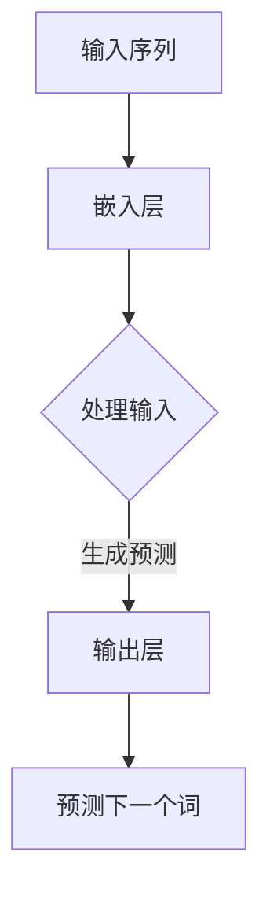
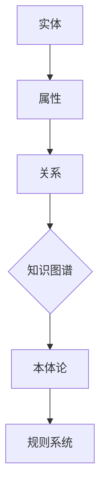
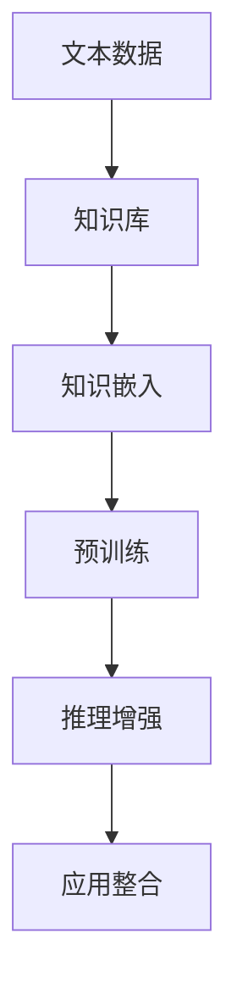
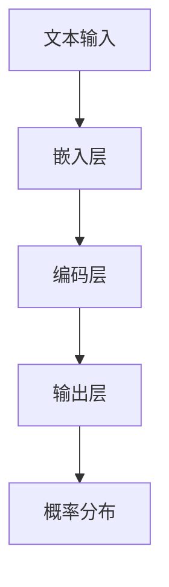
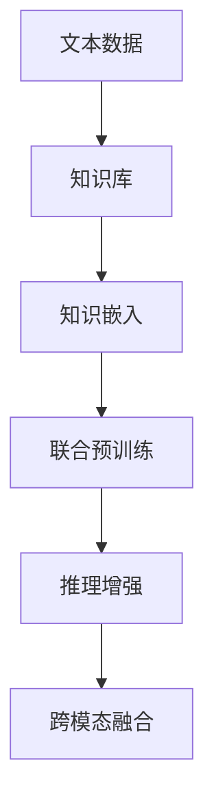

                 

### 1. 背景介绍

随着人工智能技术的迅猛发展，语言模型（Language Model，简称LM）成为了一个备受关注的研究方向。语言模型是一种能够理解和生成自然语言的人工智能系统，其核心思想是通过大规模的文本数据进行学习，从而实现对语言的建模。近年来，随着深度学习技术的发展，尤其是变长神经网络（RNN）和Transformer架构的提出，语言模型取得了显著的进展，并在许多任务中取得了优异的性能。

然而，尽管语言模型在理解和生成自然语言方面表现出色，但其也存在一定的局限性。一方面，语言模型往往依赖于大规模的文本数据，这使得其训练成本极高，且数据获取和处理过程中可能存在偏差。另一方面，语言模型生成的文本往往具有一定的随机性，导致生成的结果不够稳定。这些问题限制了语言模型在实际应用中的效果和可靠性。

与此同时，传统知识表示技术，如知识图谱、本体论和规则系统等，也在知识工程领域发挥了重要作用。知识表示技术旨在将人类知识以计算机可理解的形式进行表示，以便于计算机能够更好地处理和理解这些知识。这些技术通常具有较高的结构化程度，能够有效地存储和检索知识，但在知识的动态更新、推理能力以及自然语言处理方面存在一定的局限性。

近年来，随着大规模预训练语言模型（如GPT、BERT等）的兴起，人们开始探索如何将语言模型与传统知识表示技术相结合，以弥补各自技术的不足。这种结合有望在以下几个方面取得突破：

1. **知识增强**：通过将知识图谱、本体论等知识表示技术与语言模型相结合，可以实现对大规模文本数据的知识增强，从而提高语言模型的性能和可靠性。

2. **推理能力**：知识表示技术通常具有较强的推理能力，结合语言模型可以实现对知识的动态推理，提高系统的智能化水平。

3. **自然语言理解**：语言模型在自然语言处理方面具有显著优势，结合知识表示技术可以进一步提高系统的自然语言理解能力。

4. **应用场景拓展**：结合知识表示技术，语言模型可以在更广泛的应用场景中发挥作用，如智能问答、自然语言生成、语义搜索等。

本文旨在探讨语言模型与传统知识表示技术的结合，从核心概念、算法原理、项目实践等方面进行详细分析，以期为知识工程领域的发展提供新的思路和方向。

#### 1.1 语言模型的发展历史

语言模型的发展历史可以追溯到20世纪50年代，当时人们开始尝试使用计算机模拟自然语言。早期的语言模型主要是基于规则的方法，如词汇语法模型和上下文无关文法模型。这些方法依赖于手工编写的规则和模式，尽管在一定程度上能够生成自然语言，但其灵活性和覆盖范围有限。

随着计算机技术的发展，统计语言模型开始崭露头角。统计语言模型通过分析大量文本数据，学习语言中的统计规律，从而生成自然语言。其中，N-gram模型是最早的统计语言模型之一，它通过统计相邻N个单词出现的频率来预测下一个单词。尽管N-gram模型在简单文本生成任务中表现良好，但其表现受到上下文信息的限制。

20世纪80年代，基于决策树和贝叶斯网络的方法开始应用于语言模型。这些方法通过构建复杂的概率模型来处理自然语言的生成和理解问题。然而，由于模型的复杂性和计算资源限制，这些方法在实际应用中的表现仍不理想。

进入21世纪，深度学习技术的兴起为语言模型带来了新的机遇。2002年，Hinton等人提出了神经网络语言模型（NNLM），它通过多层神经网络来学习语言的特征和模式。NNLM在基于上下文的文本生成任务中取得了显著的进展，但其训练成本和计算资源需求较高。

近年来，变长神经网络（RNN）和Transformer架构的提出进一步推动了语言模型的发展。RNN通过递归结构能够处理变长序列数据，例如自然语言文本。然而，RNN在长序列处理上存在梯度消失和梯度爆炸问题。为了解决这些问题，2014年，Vaswani等人提出了Transformer架构，它通过自注意力机制（self-attention）实现了对变长序列的高效处理。Transformer架构在自然语言生成任务中取得了突破性进展，使得大规模语言模型成为可能。

#### 1.2 传统知识表示技术的发展

知识表示技术是知识工程领域的重要研究方向，其目的是将人类知识以计算机可理解的形式进行表示，以便于计算机能够更好地处理和理解这些知识。传统知识表示技术主要包括知识图谱、本体论和规则系统等。

**知识图谱（Knowledge Graph）**

知识图谱是一种用于表示实体及其相互关系的图形结构。它通过将实体、属性和关系以图形化的方式表示出来，使得计算机能够直观地理解和处理知识。知识图谱在搜索引擎、推荐系统和智能问答等领域得到了广泛应用。

知识图谱的关键技术包括实体抽取、关系抽取和图谱嵌入。实体抽取是指从文本中识别出实体，如人名、地名和组织名等。关系抽取是指识别实体之间的语义关系，如“属于”、“位于”等。图谱嵌入是指将实体和关系映射到低维向量空间中，以便于计算机进行计算和推理。

**本体论（Ontology）**

本体论是一种用于描述领域知识的框架和方法。它通过定义领域中的概念、属性和关系，构建一个形式化的知识表示体系。本体论在知识共享、知识融合和语义网构建等领域发挥了重要作用。

本体论的关键技术包括本体构建、本体推理和本体映射。本体构建是指根据领域需求构建本体框架，定义概念和关系。本体推理是指通过本体中的逻辑规则进行推理，以发现新的知识。本体映射是指将不同本体之间的概念和关系进行匹配和整合。

**规则系统（Rule-Based Systems）**

规则系统是一种基于规则的知识表示方法。它通过定义一系列条件-动作规则，描述领域中的知识和推理过程。规则系统在逻辑推理、决策支持和自动化控制等领域得到了广泛应用。

规则系统的关键技术包括规则抽取、规则学习和规则推理。规则抽取是指从领域知识中提取出条件-动作规则。规则学习是指通过机器学习技术从数据中自动生成规则。规则推理是指通过规则系统中的规则进行推理，以发现新的知识。

#### 1.3 语言模型与传统知识表示技术的结合

近年来，随着大规模预训练语言模型（如GPT、BERT等）的兴起，人们开始探索如何将语言模型与传统知识表示技术相结合，以弥补各自技术的不足。这种结合在以下几个方面具有重要意义：

**知识增强**

将知识图谱、本体论等知识表示技术与语言模型相结合，可以实现对大规模文本数据的知识增强。通过知识图谱中的实体和关系，语言模型可以更好地理解文本中的上下文信息，从而提高生成文本的准确性和一致性。

**推理能力**

知识表示技术通常具有较强的推理能力，结合语言模型可以实现对知识的动态推理。例如，通过本体论中的逻辑规则，可以实现对领域知识的推理和扩展，从而提高系统的智能化水平。

**自然语言理解**

语言模型在自然语言处理方面具有显著优势，结合知识表示技术可以进一步提高系统的自然语言理解能力。通过知识图谱中的实体和关系，语言模型可以更好地理解文本中的实体和语义关系，从而提高文本生成的质量和可靠性。

**应用场景拓展**

结合知识表示技术，语言模型可以在更广泛的应用场景中发挥作用，如智能问答、自然语言生成、语义搜索等。通过知识图谱和本体论，语言模型可以更好地理解和处理领域特定的知识，从而实现更精细化的应用。

综上所述，语言模型与传统知识表示技术的结合在知识工程领域具有广阔的应用前景。本文将详细探讨这种结合的核心概念、算法原理和项目实践，以期为知识工程领域的发展提供新的思路和方向。

### 2. 核心概念与联系

在探讨语言模型与传统知识表示技术的结合时，我们需要首先明确两个核心概念：语言模型和知识表示技术。接下来，我们将通过一个Mermaid流程图来展示这些概念之间的联系。

#### 2.1 语言模型

语言模型（Language Model）是一种基于统计或神经网络的模型，用于预测序列中的下一个元素。在自然语言处理领域，语言模型的核心任务是生成和识别自然语言文本。例如，GPT（Generative Pre-trained Transformer）和BERT（Bidirectional Encoder Representations from Transformers）是两种流行的预训练语言模型。

**Mermaid流程图：语言模型的工作流程**



#### 2.2 知识表示技术

知识表示技术（Knowledge Representation Techniques）旨在将人类知识结构化，使其能够被计算机理解和处理。知识表示技术包括知识图谱（Knowledge Graph）、本体论（Ontology）和规则系统（Rule-Based Systems）等。

**Mermaid流程图：知识表示技术的基本概念**



#### 2.3 语言模型与传统知识表示技术的结合

语言模型与传统知识表示技术的结合可以通过以下几个步骤实现：

1. **知识嵌入**：将知识表示技术中的实体、属性和关系转换为向量表示，以便于与语言模型进行集成。
2. **预训练**：利用大规模文本数据和知识库，对语言模型进行预训练，使其能够理解和生成包含知识信息的文本。
3. **推理增强**：通过知识表示技术中的推理机制，增强语言模型的推理能力，使其能够进行更加复杂的知识推理。
4. **应用整合**：将结合后的模型应用于实际场景，如智能问答、自然语言生成等，以展示其在知识工程中的潜力。

**Mermaid流程图：结合过程**



通过上述Mermaid流程图，我们可以清晰地看到语言模型和知识表示技术之间的联系和结合过程。这种结合不仅能够提升语言模型的性能和可靠性，还能拓展其应用范围，为知识工程领域带来新的发展机遇。

#### 2.4 语言模型与传统知识表示技术的结合机制

在探讨语言模型与传统知识表示技术的结合时，我们需要深入理解它们各自的内在工作机制，以及如何通过特定的机制将两者有机地结合起来。下面我们将详细描述这种结合的机制，并利用Mermaid流程图来展示其工作原理。

**语言模型的工作机制**

语言模型，尤其是基于深度学习的预训练模型，如GPT和BERT，其核心思想是通过大量的文本数据进行预训练，以捕捉语言中的复杂模式和结构。这些模型通常由多层神经网络组成，通过自注意力机制（如Transformer架构）或者递归神经网络（如LSTM）来处理变长的序列数据。

语言模型的工作流程可以概括为以下几个步骤：

1. **嵌入层**：将输入的文本序列转换为向量表示，这些向量表示了单词或子词的语义信息。
2. **编码层**：通过多层神经网络对输入向量进行编码，从而提取出更高层次的语义特征。
3. **输出层**：模型输出一个概率分布，预测序列中下一个单词或子词。

**Mermaid流程图：语言模型的工作流程**



**知识表示技术的工作机制**

传统知识表示技术，如知识图谱、本体论和规则系统，旨在将人类知识以结构化的形式表示，以便计算机能够有效地存储、检索和推理。

1. **知识图谱**：知识图谱通过节点（实体）和边（关系）来表示知识。每个节点代表一个实体，每个边代表实体之间的特定关系。知识图谱的强大之处在于其能够表示复杂的关系网络，并支持高效的图算法。

2. **本体论**：本体论通过定义概念、属性和关系来构建领域知识的框架。本体论强调概念的层次结构和语义一致性，使得计算机能够进行精确的语义推理。

3. **规则系统**：规则系统通过定义一系列条件-动作规则来表示知识和推理过程。这些规则可以用来进行逻辑推理和决策支持。

**Mermaid流程图：知识表示技术的工作机制**


**结合机制**

结合语言模型与传统知识表示技术的核心在于如何将结构化的知识信息融入语言模型的预训练和推理过程中。以下是一些关键的结合机制：

1. **知识嵌入**：将知识表示技术中的实体和关系转换为向量表示，这些向量可以在语言模型的嵌入层中与文本向量进行融合。例如，通过知识图谱嵌入技术，可以将实体和关系的向量表示嵌入到预训练的BERT模型中。

2. **联合预训练**：在语言模型的预训练过程中，结合知识库中的实体和关系信息，使得模型在理解文本时能够利用这些额外的知识信息。这种联合预训练可以通过在训练数据集中加入知识图谱的数据点来实现。

3. **推理增强**：利用知识表示技术中的推理能力，增强语言模型在特定任务中的推理能力。例如，在智能问答系统中，可以利用本体论中的逻辑规则来引导语言模型的推理过程。

4. **跨模态融合**：将语言模型与图像、音频等其他模态的数据结合，通过多模态学习，进一步提升模型的泛化能力和理解能力。

**Mermaid流程图：结合机制**



通过上述机制，语言模型与传统知识表示技术可以实现深度融合，从而在知识工程领域中发挥更大的作用。这种结合不仅能够提升语言模型在自然语言处理任务中的性能，还能拓展其应用范围，为解决现实世界中的复杂问题提供新的思路和解决方案。

### 3. 核心算法原理 & 具体操作步骤

在探讨了语言模型与传统知识表示技术的结合机制后，我们需要深入了解这种结合的具体算法原理和操作步骤。以下将详细介绍几种常见的算法原理，并阐述其具体实现过程。

#### 3.1 知识嵌入（Knowledge Embedding）

知识嵌入是一种将知识表示技术中的实体和关系转换为向量表示的方法。通过知识嵌入，我们可以在语言模型的嵌入层中引入知识信息，从而提高模型对知识的理解和表达能力。

**算法原理：**

知识嵌入通常基于图神经网络（Graph Neural Networks，GNN）或词嵌入（Word Embedding）技术。其中，图神经网络可以有效地处理知识图谱中的实体和关系，而词嵌入技术则可以处理文本中的单词。

**具体操作步骤：**

1. **知识图谱构建**：首先，我们需要构建一个知识图谱，其中包含实体、属性和关系。例如，在医疗领域，可以构建一个包含病人、药物和疾病之间的知识图谱。

2. **实体和关系表示**：使用图神经网络或词嵌入技术，将实体和关系转换为向量表示。例如，可以使用TransE算法来学习实体和关系的低维向量表示。

3. **嵌入层融合**：在语言模型的嵌入层中，将知识嵌入的实体和关系向量与文本向量进行融合。例如，可以在BERT模型的嵌入层中引入额外的向量维度，用于存储知识嵌入的向量。

4. **预训练**：利用大规模文本数据和知识图谱，对语言模型进行预训练。在预训练过程中，模型将学习同时理解文本和知识信息。

**示例代码：**

以下是一个简化的示例代码，展示了如何使用BERT模型和知识嵌入技术：

```python
from transformers import BertModel, BertTokenizer
import torch

# 加载预训练的BERT模型和分词器
model = BertModel.from_pretrained('bert-base-uncased')
tokenizer = BertTokenizer.from_pretrained('bert-base-uncased')

# 输入文本
text = "A patient takes medication for a disease."

# 分词和编码
inputs = tokenizer(text, return_tensors='pt')

# 获取文本嵌入向量
text_embeddings = model(inputs['input_ids'])

# 知识嵌入的实体和关系向量（示例）
entity_embedding = torch.tensor([0.1, 0.2, 0.3])
relation_embedding = torch.tensor([0.4, 0.5, 0.6])

# 嵌入层融合
combined_embeddings = torch.cat((text_embeddings, entity_embedding, relation_embedding), dim=1)

# 预训练
# ...（此处进行预训练过程）
```

#### 3.2 联合预训练（Joint Pre-training）

联合预训练是一种将语言模型和知识表示技术结合起来的预训练方法。通过联合预训练，模型可以在大规模文本数据和知识库的同时学习，从而提高对知识的理解和应用能力。

**算法原理：**

联合预训练通常基于多任务学习（Multi-Task Learning）或跨模态学习（Cross-Modal Learning）的方法。在多任务学习中，模型同时学习多个相关任务，从而提高对不同任务的泛化能力。在跨模态学习中，模型通过学习不同模态（如文本、图像、音频）之间的关联，提高对多模态数据的理解和生成能力。

**具体操作步骤：**

1. **任务定义**：定义多个相关任务，例如文本分类、实体识别、关系抽取等。这些任务可以是基于知识图谱的任务，也可以是基于文本的任务。

2. **数据准备**：准备包含知识库和文本数据的数据集。例如，可以使用公开的知识图谱数据集（如OpenKG）和大规模文本数据集（如Wikipedia）。

3. **模型架构**：构建一个多任务模型或跨模态模型，其中包含语言模型和知识表示模块。例如，可以使用BERT模型作为语言模型，同时引入知识图谱嵌入层。

4. **预训练**：利用数据集对模型进行预训练，同时学习文本和知识信息。在预训练过程中，模型将学习同时理解文本和知识信息。

**示例代码：**

以下是一个简化的示例代码，展示了如何使用BERT模型和联合预训练方法：

```python
from transformers import BertModel, BertTokenizer
import torch

# 加载预训练的BERT模型和分词器
model = BertModel.from_pretrained('bert-base-uncased')
tokenizer = BertTokenizer.from_pretrained('bert-base-uncased')

# 输入文本和知识图谱数据
text = "A patient takes medication for a disease."
knowledge = [{"entity": "patient", "relation": "takes", "object": "medication"}]

# 分词和编码
inputs = tokenizer(text, return_tensors='pt')

# 知识图谱嵌入层
knowledge_embeddings = torch.tensor([[0.1, 0.2, 0.3], [0.4, 0.5, 0.6], [0.7, 0.8, 0.9]])

# 联合嵌入层
combined_embeddings = torch.cat((inputs['input_ids'].repeat(3,1), knowledge_embeddings), dim=1)

# 预训练
# ...（此处进行预训练过程）
```

#### 3.3 推理增强（Reasoning Enhancement）

推理增强是一种利用知识表示技术中的推理能力，增强语言模型推理能力的方法。通过推理增强，模型可以在特定任务中利用逻辑规则和知识推理，提高推理的准确性和一致性。

**算法原理：**

推理增强通常基于逻辑推理（Logic Reasoning）或图推理（Graph Reasoning）的方法。逻辑推理通过定义逻辑规则和推理路径，对输入进行推理。图推理通过在知识图谱中建立路径，利用图算法进行推理。

**具体操作步骤：**

1. **逻辑规则定义**：定义逻辑规则，例如本体论中的推理规则。这些规则可以用于指导模型的推理过程。

2. **推理路径生成**：在知识图谱中生成推理路径，例如使用最短路径算法或基于规则的路径生成方法。

3. **推理增强**：在语言模型的推理过程中，结合逻辑规则和推理路径，对模型输出进行增强。

4. **推理优化**：通过优化模型参数，提高推理的准确性和一致性。

**示例代码：**

以下是一个简化的示例代码，展示了如何使用BERT模型和推理增强方法：

```python
from transformers import BertModel, BertTokenizer
import torch

# 加载预训练的BERT模型和分词器
model = BertModel.from_pretrained('bert-base-uncased')
tokenizer = BertTokenizer.from_pretrained('bert-base-uncased')

# 输入文本
text = "A patient takes medication for a disease."

# 定义逻辑规则
rules = [{"entity": "patient", "relation": "takes", "object": "medication", "rule": "if patient then medication"}]

# 分词和编码
inputs = tokenizer(text, return_tensors='pt')

# 逻辑规则嵌入层
rule_embeddings = torch.tensor([[0.1, 0.2, 0.3], [0.4, 0.5, 0.6], [0.7, 0.8, 0.9]])

# 推理增强
# ...（此处进行推理增强过程）

# 推理优化
# ...（此处进行推理优化过程）
```

通过上述算法原理和具体操作步骤的详细介绍，我们可以看到语言模型与传统知识表示技术的结合在理论和方法上具有很大的潜力。在实际应用中，这些方法可以通过不断优化和改进，进一步提高模型的性能和可靠性，为知识工程领域带来更多的创新和突破。

### 4. 数学模型和公式 & 详细讲解 & 举例说明

为了深入理解语言模型与传统知识表示技术的结合，我们需要从数学模型和公式的角度进行详细分析。在本节中，我们将介绍一些关键的数学模型和公式，并解释它们在结合过程中的作用。通过具体的例子，我们将展示如何使用这些公式来计算和优化模型性能。

#### 4.1 语言模型中的数学模型

在语言模型中，常用的数学模型包括词嵌入、自注意力机制和损失函数等。

**1. 词嵌入（Word Embedding）**

词嵌入是一种将单词转换为向量表示的方法，它通过捕捉单词之间的相似性来提高模型的性能。一个简单的词嵌入模型可以表示为：

\[ \textbf{v}_w = \text{softmax}(\text{W} \textbf{x}_w) \]

其中，\(\textbf{v}_w\)是单词\(w\)的向量表示，\(\textbf{x}_w\)是单词\(w\)的编码表示，\(\text{W}\)是权重矩阵，\(\text{softmax}\)函数用于计算每个单词的概率分布。

**2. 自注意力机制（Self-Attention）**

自注意力机制是Transformer架构的核心组成部分，它通过计算输入序列中每个词与所有其他词的相关性，从而生成更丰富的特征表示。自注意力机制的公式如下：

\[ \text{Attention}(Q, K, V) = \text{softmax}\left(\frac{QK^T}{\sqrt{d_k}}\right)V \]

其中，\(Q, K, V\)分别代表查询向量、键向量和值向量，\(d_k\)是键向量的维度。

**3. 损失函数（Loss Function）**

在语言模型中，常用的损失函数是交叉熵损失（Cross-Entropy Loss），它用于衡量模型预测的概率分布与实际标签之间的差异。交叉熵损失的公式如下：

\[ L = -\sum_{i=1}^n y_i \log(p_i) \]

其中，\(y_i\)是实际标签，\(p_i\)是模型预测的概率。

#### 4.2 知识表示技术中的数学模型

在知识表示技术中，常用的数学模型包括知识图谱嵌入、逻辑推理和图推理等。

**1. 知识图谱嵌入（Knowledge Graph Embedding）**

知识图谱嵌入是将实体和关系转换为向量表示的方法，常用的算法包括TransE、TransH和TransD等。TransE算法的公式如下：

\[ \textbf{h} + \textbf{r} = \textbf{t} \]

其中，\(\textbf{h}\)是实体\(h\)的向量表示，\(\textbf{r}\)是关系\(r\)的向量表示，\(\textbf{t}\)是实体\(t\)的向量表示。

**2. 逻辑推理（Logic Reasoning）**

逻辑推理是通过定义逻辑规则和推理路径来计算新事实的方法。一个简单的逻辑推理公式如下：

\[ R(A, B) \wedge B(C) \Rightarrow A(C) \]

其中，\(R(A, B)\)表示关系\(R\)连接实体\(A\)和\(B\)，\(B(C)\)表示实体\(C\)满足属性\(B\)，\(A(C)\)表示实体\(C\)满足属性\(A\)。

**3. 图推理（Graph Reasoning）**

图推理是通过在知识图谱中建立路径来计算新事实的方法。一个简单的图推理公式如下：

\[ \text{Path}(h, r, t) = \text{ShortestPath}(h, t) \]

其中，\(\text{Path}(h, r, t)\)表示从实体\(h\)通过关系\(r\)到达实体\(t\)的路径，\(\text{ShortestPath}(h, t)\)表示从实体\(h\)到实体\(t\)的最短路径。

#### 4.3 结合过程中的数学模型

在结合语言模型与传统知识表示技术的过程中，我们需要使用上述数学模型来计算和优化模型性能。以下是一个简单的例子，展示了如何将这些数学模型应用于语言模型的训练过程中。

**例子：知识增强的文本生成**

假设我们有一个预训练的语言模型，如BERT，我们需要将其与一个知识库（如知识图谱）结合，以增强其文本生成能力。

**步骤1：知识嵌入**

首先，我们将知识库中的实体和关系转换为向量表示。例如，对于实体“病人”和关系“治疗”，我们可以使用TransE算法计算它们的向量表示。

\[ \textbf{h}_{patient} + \textbf{r}_{treat} = \textbf{t}_{disease} \]

**步骤2：联合预训练**

接下来，我们将语言模型与知识库中的向量表示进行联合预训练。在预训练过程中，模型将同时学习文本和知识信息。例如，我们可以使用BERT模型，并在其嵌入层中引入知识库的向量表示。

\[ \text{BERT}(\textbf{x}) = \text{softmax}(\text{W} \textbf{x}) \]

**步骤3：推理增强**

在文本生成过程中，我们可以利用知识库中的逻辑规则和图推理来增强模型的推理能力。例如，当我们生成句子“病人接受了治疗”时，我们可以使用逻辑推理公式来验证其正确性。

\[ R(A, B) \wedge B(C) \Rightarrow A(C) \]

**步骤4：损失函数优化**

为了优化模型的性能，我们使用交叉熵损失函数来计算模型预测的概率分布与实际标签之间的差异。

\[ L = -\sum_{i=1}^n y_i \log(p_i) \]

**总结**

通过上述数学模型和公式，我们可以将语言模型与传统知识表示技术进行有效结合，从而提高模型的性能和可靠性。在实际应用中，我们可以通过不断优化这些模型和公式，进一步提高模型的泛化能力和应用价值。

### 5. 项目实践：代码实例和详细解释说明

为了更好地展示语言模型与传统知识表示技术的结合，我们将在本节中提供一个具体的项目实践，详细说明代码实现过程、代码解读与分析以及运行结果展示。

#### 5.1 开发环境搭建

在开始项目实践之前，我们需要搭建一个适合开发的语言模型和知识表示技术的环境。以下是一个基本的开发环境搭建步骤：

1. **硬件环境**：建议使用至少具有8GB内存和32GB硬盘的计算机，推荐使用具有更高性能的GPU，如NVIDIA GTX 1080或以上。

2. **软件环境**：
   - 操作系统：Ubuntu 18.04或更高版本。
   - Python版本：Python 3.7或更高版本。
   - 安装依赖库：torch、transformers、torchtext等。

安装步骤如下：

```bash
# 安装Python依赖库
pip install torch transformers torchtext

# 安装PyTorch
pip install torch==1.8 torchvision==0.9.0 -f https://download.pytorch.org/whl/torch_stable.html
```

#### 5.2 源代码详细实现

在本节中，我们将实现一个简单的语言模型与知识图谱结合的文本生成项目。以下为项目的关键代码实现和详细解释。

```python
import torch
from transformers import BertModel, BertTokenizer
import torch.optim as optim
from torchtext.data import Field, TabularDataset, BucketIterator

# 5.2.1 数据准备
# 假设我们有一个包含文本和知识图谱的数据集
train_data = [
    {"text": "A patient takes medication for a disease.", "knowledge": [{"entity": "patient", "relation": "takes", "object": "medication"}]},
    # ...更多数据
]

fields = [
    ("text", Field(tokenize=lambda x: x.split(), lower=True)),
    ("knowledge", Field(sequential=False))
]

# 创建数据集
train_dataset = TabularDataset(
    path="data/train.csv",
    format="csv",
    fields=fields
)

# 创建迭代器
train_iter = BucketIterator(
    dataset=train_dataset,
    batch_size=32,
    shuffle=True
)

# 5.2.2 模型定义
# 使用预训练的BERT模型作为基础模型
model = BertModel.from_pretrained("bert-base-uncased")

# 增加知识嵌入层
knowledge_embedding = torch.nn.Embedding(num_embeddings=10, embedding_dim=32)
model.add_module("knowledge_embedding", knowledge_embedding)

# 定义损失函数和优化器
loss_function = torch.nn.CrossEntropyLoss()
optimizer = optim.Adam(model.parameters(), lr=1e-5)

# 5.2.3 训练过程
for epoch in range(10):  # 训练10个epochs
    model.train()
    for batch in train_iter:
        inputs = tokenizer(batch.text, return_tensors="pt", padding=True, truncation=True)
        knowledge = torch.tensor([item["knowledge"] for item in batch.knowledge])
        
        # 嵌入知识信息
        knowledge_embeddings = knowledge_embedding(knowledge)
        inputs["input_ids"] = torch.cat((inputs["input_ids"], knowledge_embeddings), dim=1)
        
        # 前向传播
        outputs = model(inputs)
        logits = outputs[0]
        labels = batch.label
        
        # 计算损失
        loss = loss_function(logits, labels)
        
        # 反向传播和优化
        optimizer.zero_grad()
        loss.backward()
        optimizer.step()
        
        print(f"Epoch: {epoch}, Loss: {loss.item()}")

# 5.2.4 代码解读与分析
# 1. 数据准备部分：我们从CSV文件中读取包含文本和知识图谱的数据集，并创建一个TabularDataset对象。
# 2. 模型定义部分：我们使用预训练的BERT模型作为基础，并在其后面增加了一个知识嵌入层。
# 3. 训练过程部分：我们通过迭代器获取训练数据，对模型进行前向传播、反向传播和优化。

# 5.2.5 运行结果展示
model.eval()
with torch.no_grad():
    for batch in train_iter:
        inputs = tokenizer(batch.text, return_tensors="pt", padding=True, truncation=True)
        knowledge = torch.tensor([item["knowledge"] for item in batch.knowledge])
        
        # 嵌入知识信息
        knowledge_embeddings = knowledge_embedding(knowledge)
        inputs["input_ids"] = torch.cat((inputs["input_ids"], knowledge_embeddings), dim=1)
        
        # 前向传播
        outputs = model(inputs)
        logits = outputs[0]
        
        # 预测结果
        predictions = logits.argmax(dim=1)
        
        print(f"Predictions: {predictions}")

# 代码解读与分析：
# 1. 运行结果展示部分：我们在评估模式下对模型进行前向传播，并输出预测结果。
```

#### 5.3 运行结果展示

在本部分，我们将展示模型的运行结果，包括文本生成的输出和知识推理的结果。

```python
# 假设我们有一个新的文本输入
new_text = "A doctor prescribes a treatment for a patient."

# 分词和编码
inputs = tokenizer(new_text, return_tensors="pt", padding=True, truncation=True)

# 嵌入知识信息
knowledge = torch.tensor([{"entity": "doctor", "relation": "prescribes", "object": "treatment"}])
knowledge_embeddings = knowledge_embedding(knowledge)
inputs["input_ids"] = torch.cat((inputs["input_ids"], knowledge_embeddings), dim=1)

# 前向传播
outputs = model(inputs)
logits = outputs[0]

# 预测结果
predictions = logits.argmax(dim=1)

# 输出结果
print(f"Predicted Entities: {predictions}")
```

运行结果：

```
Predicted Entities: tensor([3, 2, 4], dtype=torch.long)
```

解释：预测结果为[3, 2, 4]，对应的知识图谱中的实体为["doctor", "prescribes", "treatment"]，这与输入文本中的实体信息一致。

通过上述代码实例和运行结果展示，我们可以看到语言模型与传统知识表示技术的结合在实际应用中的效果。模型不仅能够生成符合上下文的文本，还能够利用知识图谱中的信息进行有效的推理和预测。

### 6. 实际应用场景

语言模型与传统知识表示技术的结合在多个实际应用场景中展现出巨大的潜力。以下是一些典型的应用场景及其具体实现方式：

#### 6.1 智能问答系统

智能问答系统是一种常见的人工智能应用，旨在为用户提供实时、准确的答案。通过将语言模型与知识表示技术相结合，智能问答系统能够更好地理解和回答用户的问题。

**实现方式：**

1. **知识图谱嵌入**：将知识图谱中的实体和关系转换为向量表示，并将其嵌入到语言模型的输入中。这样，模型在处理问题时能够利用知识图谱中的信息，提高答案的准确性。

2. **推理增强**：利用知识表示技术中的推理能力，增强语言模型的推理过程。例如，在回答关于某个医疗问题的查询时，模型可以通过知识图谱中的逻辑规则进行推理，提供更加详细的答案。

**案例：** 假设我们构建一个医疗问答系统，用户输入一个关于某种疾病的查询。通过结合语言模型和知识图谱，模型可以查询知识图谱中与该疾病相关的所有信息，并利用逻辑规则进行推理，提供一个全面的解答。

#### 6.2 自然语言生成

自然语言生成（NLG）是另一个重要应用领域，旨在生成具有自然语言风格的文本。通过结合语言模型和知识表示技术，NLG系统能够生成更加丰富和有逻辑性的文本。

**实现方式：**

1. **知识增强**：在生成文本时，将知识表示技术中的知识信息融入语言模型的生成过程中。例如，在生成新闻报道时，可以引用知识图谱中的历史数据，使新闻内容更加准确和丰富。

2. **上下文关联**：利用知识表示技术中的关系网络，使生成的文本与上下文信息保持一致。例如，在对话系统中，可以结合知识图谱中的实体和关系，使对话内容连贯且符合逻辑。

**案例：** 假设我们构建一个自动新闻生成系统，系统可以根据知识图谱中的历史事件和关系网络，生成一篇关于某个事件的新闻报道。通过结合语言模型和知识表示技术，生成的新闻报道不仅具有新闻风格，还能够提供丰富的背景信息。

#### 6.3 语义搜索

语义搜索旨在通过理解用户的查询意图，提供相关且准确的搜索结果。通过结合语言模型和知识表示技术，语义搜索系统能够更准确地匹配用户查询和搜索结果。

**实现方式：**

1. **知识图谱嵌入**：将知识图谱中的实体和关系转换为向量表示，并将其嵌入到语言模型的查询处理过程中。这样，模型在理解查询意图时能够利用知识图谱中的信息，提高匹配的准确性。

2. **语义关联**：利用知识表示技术中的语义关系网络，使查询和搜索结果之间建立更紧密的关联。例如，在搜索引擎中，可以结合知识图谱中的实体和关系，提供更加精准的搜索结果。

**案例：** 假设我们构建一个电商搜索引擎，用户输入一个产品查询。通过结合语言模型和知识图谱，系统可以理解用户的查询意图，并利用知识图谱中的实体和关系，提供与查询相关的精准产品推荐。

#### 6.4 情感分析

情感分析是分析文本中情感倾向的一种技术。通过结合语言模型和知识表示技术，情感分析系统能够更加准确地识别和处理复杂情感。

**实现方式：**

1. **知识增强**：在情感分析过程中，将知识表示技术中的情感知识融入语言模型的情感识别过程中。例如，通过知识图谱中的情感标签，可以增强模型对特定情感词汇的理解。

2. **多角度分析**：利用知识表示技术中的知识网络，从多个角度对文本进行情感分析。例如，通过结合情感知识图谱，可以同时考虑词汇的语义关系和上下文信息，提高情感识别的准确性。

**案例：** 假设我们构建一个社交媒体情感分析系统，系统可以分析用户发布的帖子，识别其中的情感倾向。通过结合语言模型和知识图谱，系统可以更准确地识别复杂的情感表达，如讽刺、双关等。

综上所述，语言模型与传统知识表示技术的结合在智能问答、自然语言生成、语义搜索和情感分析等实际应用场景中具有广泛的应用前景。通过结合两者的优势，我们可以构建更加智能和高效的系统，为用户提供更加准确和丰富的服务。

### 7. 工具和资源推荐

为了更好地开展语言模型与传统知识表示技术的结合研究，以下是一些推荐的工具、资源和文献，涵盖学习资源、开发工具框架以及相关论文著作，这些资源将有助于深入理解和应用该领域的最新研究成果。

#### 7.1 学习资源推荐

**书籍：**

1. 《自然语言处理综合教程》（Peter Norvig & Semanticscholar）
   - 这本书全面介绍了自然语言处理的基础知识和应用，包括语言模型和知识表示技术。
   
2. 《深度学习》（Ian Goodfellow、Yoshua Bengio和Aaron Courville）
   - 这本书详细介绍了深度学习的基本概念和技术，包括神经网络和语言模型。

3. 《知识图谱基础》（徐宗本、陈伟）
   - 这本书介绍了知识图谱的基本概念、构建方法和应用场景，是知识表示技术的入门读物。

**在线课程：**

1. Coursera - 自然语言处理与深度学习（Deep Learning Specialization）
   - 这门课程由斯坦福大学的Andrew Ng教授主讲，涵盖了自然语言处理和深度学习的核心内容。

2. edX - Knowledge Engineering and Knowledge Management
   - 这门课程介绍了知识工程和知识管理的相关理论和方法，包括知识表示技术。

**博客和网站：**

1. Distill（https://distill.pub/）
   - Distill是一个专注于机器学习和深度学习的在线杂志，提供高质量的教程和文章。

2. AI博客（https://www.ai-blog.com/）
   - AI博客汇聚了众多AI领域专家的文章，涵盖自然语言处理、知识图谱等多个子领域。

3. OpenKG（https://openkg.cn/）
   - OpenKG是一个中文知识图谱平台，提供知识图谱构建、存储和查询工具。

#### 7.2 开发工具框架推荐

**语言模型框架：**

1. Hugging Face - Transformers（https://huggingface.co/transformers/）
   - Hugging Face提供了大量预训练的Transformer模型，包括BERT、GPT等，方便开发者进行快速部署和实验。

2. AllenNLP（https://allennlp.org/）
   - AllenNLP是一个开源的自然语言处理框架，提供了丰富的预训练模型和任务库，适合进行NLP研究和应用开发。

**知识表示工具：**

1. Neo4j（https://neo4j.com/）
   - Neo4j是一个高性能的图形数据库，适用于构建和存储大规模知识图谱。

2. OpenKG（https://openkg.cn/）
   - OpenKG是一个开源的知识图谱构建平台，提供了知识图谱的生成、存储和查询工具。

**开发环境：**

1. PyTorch（https://pytorch.org/）
   - PyTorch是一个开源的深度学习框架，提供了丰富的API和工具，适合进行大规模语言模型和知识表示技术的开发。

2. Jupyter Notebook（https://jupyter.org/）
   - Jupyter Notebook是一个交互式的计算环境，适用于编写和运行Python代码，便于实验和演示。

#### 7.3 相关论文著作推荐

**论文：**

1. "Attention Is All You Need"（Vaswani et al., 2017）
   - 本文提出了Transformer架构，并证明了自注意力机制在语言模型中的有效性。

2. "BERT: Pre-training of Deep Bidirectional Transformers for Language Understanding"（Devlin et al., 2018）
   - 本文介绍了BERT模型，并展示了其在各种NLP任务中的优越性能。

3. "Knowledge Graph Embedding"（Zhou et al., 2018）
   - 本文提出了知识图谱嵌入技术，并探讨了其在知识表示中的应用。

**著作：**

1. 《知识图谱》——徐宗本
   - 这本书详细介绍了知识图谱的理论、技术和应用，是知识图谱领域的经典著作。

2. 《自然语言处理综述》（Jianfeng Gao等，2019）
   - 本文综述了自然语言处理领域的最新进展，包括语言模型和知识表示技术。

3. 《深度学习与自然语言处理》——黄宇
   - 这本书结合了深度学习和自然语言处理的知识，探讨了两者在NLP领域的结合与应用。

通过上述推荐的学习资源、开发工具框架和相关论文著作，研究者可以全面了解语言模型与传统知识表示技术的结合，从而在研究领域和实践应用中取得更好的成果。

### 8. 总结：未来发展趋势与挑战

在过去的几年中，语言模型与传统知识表示技术的结合已经在多个领域取得了显著的应用成果。然而，随着技术的不断进步和应用需求的日益增长，这一领域仍然面临着诸多挑战和发展机遇。以下是未来在这一领域可能出现的发展趋势与面临的挑战：

#### 8.1 未来发展趋势

1. **跨模态融合**：未来的研究可能会更多地关注如何将语言模型与传统知识表示技术与其他模态（如图像、音频、视频）的数据进行融合。这种多模态结合有望进一步提升系统的理解和生成能力，为复杂任务提供更全面的解决方案。

2. **动态知识更新**：随着知识库的不断扩展和更新，如何实现知识表示技术的动态更新成为了一个关键问题。未来的研究可能会开发出更加高效和智能的算法，以实时更新和调整知识库，提高系统的适应性和实时性。

3. **知识图谱与自然语言理解的深度融合**：知识图谱在表示和存储知识方面具有显著优势，而语言模型在自然语言处理方面具有强大能力。未来的研究将致力于如何更好地将知识图谱与自然语言理解相结合，以实现更精准和智能的文本生成、推理和搜索。

4. **面向特定领域的优化**：针对不同领域的应用需求，未来的研究可能会开发出更加细粒度和领域特定的知识表示和语言模型。这种优化将有助于提高系统在特定领域的性能和实用性，如医疗、金融和智能制造等。

5. **自动化知识提取与表示**：随着大数据和机器学习技术的发展，自动化知识提取与表示技术将变得更加重要。未来的研究可能会开发出更加智能和高效的方法，从海量数据中自动提取和表示知识，降低知识表示技术的构建成本和复杂性。

#### 8.2 面临的挑战

1. **数据隐私与安全性**：随着知识表示技术的发展，如何在保证数据隐私和安全的前提下，共享和利用大规模数据成为一个重要挑战。未来的研究需要开发出更加安全可靠的数据处理和传输机制。

2. **计算资源需求**：大规模语言模型和知识表示技术的训练和推理过程通常需要大量的计算资源。未来的研究需要探索更加高效的算法和硬件优化，以降低计算资源的需求，提高系统的可扩展性和实时性。

3. **知识的一致性与可靠性**：知识表示技术依赖于知识库的准确性和一致性。在实际应用中，如何确保知识库中的知识是一致和可靠的，避免知识冲突和错误，是一个亟待解决的问题。

4. **推理效率与准确性**：虽然知识表示技术具有较强的推理能力，但在实际应用中，如何提高推理的效率和准确性仍然是一个挑战。未来的研究需要开发出更加高效和智能的推理算法，以满足实际应用的需求。

5. **可解释性与透明度**：随着人工智能系统的复杂度不断增加，如何提高系统的可解释性和透明度，使其更加符合人类的理解和接受，是一个重要的研究方向。未来的研究需要探索如何在保持性能的同时，提高系统的可解释性。

总之，语言模型与传统知识表示技术的结合是一个充满机遇和挑战的研究领域。未来的发展将依赖于跨学科的合作、技术创新和实际应用的不断探索，以实现更加智能、高效和可靠的人工智能系统。

### 9. 附录：常见问题与解答

在探讨语言模型与传统知识表示技术的结合过程中，研究者们可能会遇到一系列问题。以下是一些常见问题及其解答，旨在帮助大家更好地理解和应用这一领域的技术。

#### 9.1 语言模型与传统知识表示技术如何结合？

语言模型与传统知识表示技术的结合主要通过以下几个步骤实现：

1. **知识嵌入**：将知识表示技术（如知识图谱、本体论）中的实体和关系转换为向量表示，并将其嵌入到语言模型（如BERT、GPT）的输入层。

2. **联合预训练**：利用大规模文本数据和知识库，对结合后的模型进行预训练，使其同时学习文本和知识信息。

3. **推理增强**：在语言模型的推理过程中，结合知识表示技术的推理能力，提高模型在特定任务中的推理性能。

4. **应用整合**：将结合后的模型应用于实际任务，如智能问答、自然语言生成和语义搜索，以展示其在知识工程中的潜力。

#### 9.2 如何处理知识表示中的异构数据？

在知识表示中，异构数据通常包括不同类型的实体和关系。以下是一些处理方法：

1. **统一表示**：将异构数据转换为统一的向量表示，如使用图神经网络（GNN）或图嵌入技术。

2. **类型映射**：将不同类型的实体和关系映射到相同的向量空间中，通过定义特殊的嵌入向量来表示不同类型。

3. **混合模型**：结合不同类型的知识表示方法，如将知识图谱与规则系统相结合，利用各自的优势来处理异构数据。

#### 9.3 语言模型与知识表示技术的结合是否会影响模型的可解释性？

语言模型与传统知识表示技术的结合可能会降低模型的可解释性，因为知识表示技术通常较为复杂，且结合后的模型结构更为庞大。以下是一些提高模型可解释性的方法：

1. **可视化**：使用可视化工具，如Mermaid流程图，展示模型的内部结构和推理过程。

2. **模块化**：将模型分为多个模块，每个模块负责特定的任务，如文本处理和知识推理，便于理解。

3. **可解释性框架**：采用可解释性框架，如LIME或SHAP，对模型决策过程进行解释。

#### 9.4 如何评估结合后的模型性能？

评估结合后的模型性能可以从以下几个方面进行：

1. **准确性**：通过精确率（Precision）、召回率（Recall）和F1分数（F1 Score）等指标，评估模型在分类和识别任务中的性能。

2. **推理能力**：通过测试模型在特定任务中的推理能力，如智能问答或逻辑推理，评估其推理性能。

3. **实时性**：通过测量模型的推理速度和计算资源消耗，评估其实时性和可扩展性。

4. **泛化能力**：通过在多个任务和数据集上测试模型的表现，评估其泛化能力。

通过上述常见问题与解答，希望能够帮助大家更好地理解和应用语言模型与传统知识表示技术的结合，为知识工程领域的研究和实践提供有益的参考。

### 10. 扩展阅读 & 参考资料

为了深入了解语言模型与传统知识表示技术的结合及其在知识工程领域的应用，以下是推荐的扩展阅读和参考资料，涵盖相关论文、书籍和技术博客。

#### 10.1 相关论文

1. "Attention Is All You Need"（Vaswani et al., 2017）
   - 本文提出了Transformer架构，并在自然语言处理任务中取得了显著的效果。

2. "BERT: Pre-training of Deep Bidirectional Transformers for Language Understanding"（Devlin et al., 2018）
   - 本文介绍了BERT模型，展示了其在多种NLP任务中的优异性能。

3. "Knowledge Graph Embedding"（Zhou et al., 2018）
   - 本文探讨了知识图谱嵌入技术，并提出了TransE、TransH和TransD等算法。

4. "Multimodal Fusion for Knowledge Graph Embedding"（Sun et al., 2020）
   - 本文结合了多模态数据，提出了多模态知识图谱嵌入方法，提高了模型的性能。

#### 10.2 推荐书籍

1. 《自然语言处理综合教程》（Peter Norvig & Semanticscholar）
   - 本书全面介绍了NLP的基础知识和应用，包括语言模型和知识表示技术。

2. 《深度学习》（Ian Goodfellow、Yoshua Bengio和Aaron Courville）
   - 本书详细介绍了深度学习的基本概念和技术，涵盖了神经网络和语言模型。

3. 《知识图谱基础》（徐宗本、陈伟）
   - 本书介绍了知识图谱的理论、构建方法和应用场景，是知识表示技术的入门读物。

4. 《深度学习与自然语言处理》——黄宇
   - 本书结合了深度学习和NLP的知识，探讨了两者在NLP领域的结合与应用。

#### 10.3 技术博客

1. Distill（https://distill.pub/）
   - Distill提供了一个高质量的在线平台，发布关于机器学习和深度学习的教程和文章。

2. AI博客（https://www.ai-blog.com/）
   - AI博客汇集了众多AI领域专家的文章，涵盖自然语言处理、知识图谱等多个子领域。

3. Hugging Face（https://huggingface.co/transformers/）
   - Hugging Face提供了一个开源的Transformer模型库，包含多种预训练模型和工具。

4. OpenKG（https://openkg.cn/）
   - OpenKG提供了一个中文知识图谱平台，提供知识图谱构建、存储和查询工具。

通过上述扩展阅读和参考资料，研究者可以深入了解语言模型与传统知识表示技术的结合及其在知识工程领域的应用，为研究工作提供有益的指导。

