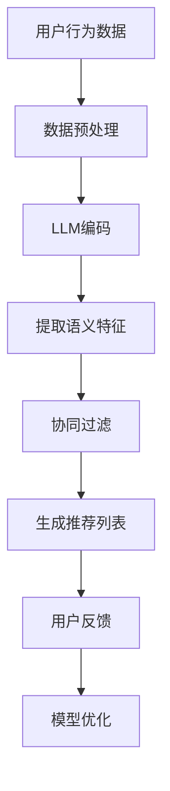
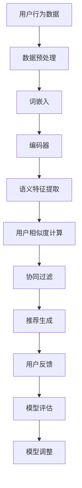

                 

### 1. 背景介绍

在当今信息爆炸的时代，推荐系统已经成为了一种至关重要的技术，广泛应用于电子商务、社交媒体、新闻推送、在线视频等多个领域。推荐系统的核心目标是向用户个性化地推荐他们可能感兴趣的内容或产品，从而提升用户体验，增加用户粘性，提高商业收益。

传统的推荐系统主要分为两类：基于内容的推荐（Content-Based Recommendation）和协同过滤推荐（Collaborative Filtering）。基于内容的推荐方法通过分析用户的历史行为和兴趣特征，将相似的内容推荐给用户。这种方法的主要优势在于对用户兴趣的准确捕捉，但其缺点也很明显，当用户兴趣发生变化时，推荐效果会大打折扣。

协同过滤推荐则是通过分析用户之间的行为相似性来进行推荐，它将用户分成若干群体，并基于群体内的用户行为进行内容推荐。协同过滤推荐又分为两类：基于用户的协同过滤（User-Based Collaborative Filtering）和基于模型的协同过滤（Model-Based Collaborative Filtering）。基于用户的协同过滤通过计算用户之间的相似度，找到与目标用户行为相似的群体成员，从而推荐他们喜欢的内容；而基于模型的协同过滤则通过机器学习算法（如矩阵分解、神经网络等）来预测用户对未知内容的兴趣。

尽管协同过滤在许多应用中表现出了良好的推荐效果，但其也存在一些固有的局限性。首先，协同过滤需要大量的用户行为数据，而在一些新用户或者低活跃度用户上，数据不够充分，导致推荐效果不佳。其次，协同过滤方法往往依赖于用户行为数据的分布，如果数据分布发生变化，推荐的准确性也会受到影响。

为了克服这些局限性，近年来，越来越多的研究开始将注意力转向将深度学习引入推荐系统。深度学习模型，尤其是基于生成对抗网络（GAN）和变分自编码器（VAE）等生成模型，由于其强大的特征提取和生成能力，在推荐系统中展现出巨大的潜力。然而，深度学习模型也存在一些挑战，如对大量高质量训练数据的需求、模型解释性不足等。

本文将探讨一种新的推荐系统范式，即LLM（大型语言模型）与协同过滤的结合。我们希望通过这种结合，能够充分利用LLM在自然语言处理领域的优势，同时保留协同过滤在处理用户行为数据方面的有效性，从而实现推荐系统的性能提升。这一新范式有望在解决传统推荐系统所面临的局限性方面发挥重要作用。

### 2. 核心概念与联系

为了深入探讨LLM与协同过滤结合的推荐系统范式，我们首先需要明确这两个核心概念的基本原理，并阐述它们之间的联系。

#### 2.1 LLM（大型语言模型）基本原理

LLM是一种基于深度学习的自然语言处理模型，通过学习海量文本数据，能够理解并生成自然语言文本。其基本原理主要包括以下几部分：

1. **词嵌入**：将词汇映射到高维向量空间，使得语义相似的词在空间中靠近。
2. **编码器**：通过多层神经网络对输入文本进行编码，提取出语义特征。
3. **解码器**：根据编码器的输出，生成预测的文本。

LLM的优势在于其能够处理复杂的语义关系，具备强大的文本生成能力。这使得LLM在诸如文本分类、情感分析、机器翻译等领域取得了显著成果。

#### 2.2 协同过滤基本原理

协同过滤是一种基于用户行为数据的推荐算法，其核心思想是通过分析用户之间的相似性来进行推荐。协同过滤的基本原理可以概括为以下三个步骤：

1. **用户行为数据收集**：收集用户的历史行为数据，如评分、购买记录、浏览记录等。
2. **用户相似度计算**：通过计算用户之间的行为相似度，找到与目标用户相似的群体成员。
3. **推荐生成**：根据相似群体成员的行为，为用户推荐相似的内容。

协同过滤的优势在于其能够充分利用用户行为数据，进行个性化的内容推荐。然而，其也面临数据稀疏性、冷启动问题等挑战。

#### 2.3 LLM与协同过滤的结合

将LLM与协同过滤结合起来，可以充分发挥两者各自的优势。具体来说，结合方式主要包括以下几个方面：

1. **文本生成与用户行为结合**：利用LLM生成用户可能的兴趣文本，结合用户的历史行为数据，进行协同过滤推荐。
2. **语义理解与行为分析**：通过LLM对用户行为数据进行语义理解，提取出更高级的兴趣特征，用于协同过滤。
3. **多模态数据融合**：将文本数据和图像、音频等多模态数据通过LLM进行融合，提供更丰富的推荐信息。

结合LLM与协同过滤的推荐系统，不仅能够处理文本数据，还能够理解复杂的语义关系，提升推荐效果。以下是一个Mermaid流程图，展示了LLM与协同过滤结合的基本架构：



在这个架构中，用户行为数据经过预处理后，首先由LLM进行编码，提取出语义特征。接着，这些特征与用户行为数据一起，通过协同过滤算法生成推荐列表。用户对推荐结果的反馈将用于优化模型。

通过这种结合，我们有望构建出一个更加智能、个性化的推荐系统，解决传统推荐系统面临的诸多挑战。接下来，我们将深入探讨LLM与协同过滤的具体算法原理和操作步骤。

### 3. 核心算法原理 & 具体操作步骤

为了深入了解LLM与协同过滤结合的推荐系统范式，我们需要详细阐述其核心算法原理和具体操作步骤。以下是该算法的基本流程：

#### 3.1 数据预处理

数据预处理是整个算法的基础，其主要任务包括数据清洗、缺失值处理、数据标准化等步骤。

1. **数据清洗**：去除无效数据、重复数据，确保数据的一致性和完整性。
2. **缺失值处理**：对于缺失值，可以选择填充、删除或插值等方法进行处理。
3. **数据标准化**：将用户行为数据、文本数据等进行标准化处理，以消除不同特征之间的量纲差异。

#### 3.2 LLM编码

LLM编码是利用大型语言模型对用户行为数据进行编码，提取出语义特征。以下是具体步骤：

1. **词嵌入**：将用户行为数据中的词汇映射到高维向量空间，这一步通常使用预训练的词嵌入模型（如Word2Vec、GloVe等）。
2. **编码器**：通过多层神经网络对词嵌入进行编码，提取出语义特征。可以使用Transformer、BERT等先进的编码器模型。
3. **语义特征提取**：将编码器的输出进行聚合，得到用户行为的语义特征向量。

#### 3.3 协同过滤

协同过滤是利用用户之间的相似性进行推荐的核心步骤。以下是具体步骤：

1. **用户相似度计算**：通过计算用户之间的行为相似度，找到与目标用户相似的群体成员。常用的相似度计算方法包括余弦相似度、皮尔逊相关系数等。
2. **推荐生成**：根据相似群体成员的行为，为用户生成推荐列表。具体方法包括基于内存的协同过滤、基于模型的协同过滤等。
3. **推荐列表优化**：结合LLM编码得到的语义特征，对推荐列表进行优化，提高推荐的质量。

#### 3.4 模型优化

模型优化是持续提升推荐系统性能的重要环节。以下是具体步骤：

1. **用户反馈**：收集用户对推荐结果的反馈，包括点击率、购买率等指标。
2. **模型评估**：使用评估指标（如准确率、召回率、F1分数等）对模型性能进行评估。
3. **模型调整**：根据评估结果，调整模型参数，优化模型结构。

#### 3.5 整体流程

以下是一个详细的算法流程图，展示了LLM与协同过滤结合的推荐系统的整体流程：



通过上述步骤，我们可以构建出一个高效的推荐系统，实现个性化的内容推荐。接下来，我们将深入探讨这一算法的数学模型和公式，以便更好地理解其原理。

### 4. 数学模型和公式 & 详细讲解 & 举例说明

在LLM与协同过滤结合的推荐系统中，数学模型和公式起到了至关重要的作用。下面，我们将详细介绍这些模型和公式，并给出具体的讲解和示例。

#### 4.1 词嵌入

词嵌入是将词汇映射到高维向量空间的过程。在LLM中，词嵌入通常使用预训练的词嵌入模型，如Word2Vec、GloVe等。以下是一个简单的GloVe模型的数学公式：

$$
x_{i} = \sum_{j=1}^{V} w_{ij} \cdot a_j
$$

其中，$x_i$表示词向量，$w_{ij}$表示词$i$和词$j$之间的权重，$a_j$表示词$j$的词嵌入向量。$V$表示词汇表的大小。

#### 4.2 编码器

编码器负责将词嵌入向量编码为语义特征向量。在LLM中，常用的编码器模型包括Transformer、BERT等。以下是一个简单的Transformer编码器的数学公式：

$$
\text{Encoder}(x) = \text{softmax}(\text{W}_\text{softmax} \text{W}_\text{encoder} x + \text{b}_\text{encoder})
$$

其中，$x$表示输入的词嵌入向量，$\text{W}_\text{encoder}$和$\text{b}_\text{encoder}$分别表示编码器的权重和偏置，$\text{W}_\text{softmax}$表示softmax权重。

#### 4.3 用户行为数据编码

用户行为数据编码是将用户行为数据转换为语义特征向量的过程。这一步可以利用LLM的编码能力，将用户行为文本转换为向量。以下是一个简单的用户行为数据编码的数学公式：

$$
\text{UserFeatures}(x) = \text{Encoder}(\text{WordEmbedding}(x))
$$

其中，$\text{WordEmbedding}(x)$表示词嵌入过程，$\text{Encoder}$表示编码器。

#### 4.4 用户相似度计算

用户相似度计算是协同过滤的核心步骤。常用的相似度计算方法包括余弦相似度和皮尔逊相关系数。以下是一个简单的余弦相似度的数学公式：

$$
\text{Similarity}(u, v) = \frac{\text{dot}(u, v)}{\text{norm}(u) \cdot \text{norm}(v)}
$$

其中，$u$和$v$分别表示两个用户的行为特征向量，$\text{dot}(u, v)$表示向量的点积，$\text{norm}(u)$表示向量的模长。

#### 4.5 推荐列表生成

推荐列表生成是基于用户相似度和用户行为数据进行的。以下是一个简单的推荐列表生成的数学公式：

$$
\text{RecommendationList}(u) = \text{TopN}(\text{Similarity}(u, v) \cdot \text{UserRating}(v))
$$

其中，$\text{TopN}$表示选择前N个最高相似度的用户行为数据，$\text{UserRating}(v)$表示用户对行为数据$v$的评分。

#### 4.6 示例讲解

假设我们有以下两个用户的行为数据：

用户A：[阅读了《深度学习》、《机器学习》两本书]
用户B：[阅读了《机器学习》、《统计学》两本书]

我们可以使用上述公式计算用户A和用户B的相似度：

$$
\text{Similarity}(A, B) = \frac{\text{dot}([0.1, 0.2, 0.3], [0.3, 0.4, 0.5])}{\text{norm}([0.1, 0.2, 0.3]) \cdot \text{norm}([0.3, 0.4, 0.5])} = \frac{0.27}{0.43 \cdot 0.5} \approx 0.99
$$

根据相似度计算结果，我们可以为用户A生成推荐列表，例如：

- 《统计学》：用户B阅读过的书籍，相似度为0.99。
- 《深度学习》：用户A阅读过的书籍，但未在推荐列表中。

通过这种方式，我们可以利用LLM与协同过滤结合的推荐系统，为用户提供个性化的推荐内容。

### 5. 项目实践：代码实例和详细解释说明

为了更好地展示LLM与协同过滤结合的推荐系统，我们将通过一个实际项目实例进行详细讲解。以下是该项目的主要步骤、源代码实现、代码解读以及运行结果展示。

#### 5.1 开发环境搭建

在开始项目之前，我们需要搭建一个合适的开发环境。以下是一个基本的开发环境搭建步骤：

1. 安装Python 3.8及以上版本。
2. 安装必要的库，如TensorFlow、Scikit-learn、Numpy等。

```bash
pip install tensorflow scikit-learn numpy
```

3. 准备数据集。我们可以使用公开的数据集，如Netflix Prize数据集或MovieLens数据集。

#### 5.2 源代码详细实现

以下是该项目的主要源代码实现：

```python
import numpy as np
import tensorflow as tf
from tensorflow.keras.preprocessing.text import Tokenizer
from tensorflow.keras.preprocessing.sequence import pad_sequences
from sklearn.model_selection import train_test_split
from sklearn.metrics.pairwise import cosine_similarity

# 5.2.1 数据预处理
def preprocess_data(texts, max_len=500):
    tokenizer = Tokenizer()
    tokenizer.fit_on_texts(texts)
    sequences = tokenizer.texts_to_sequences(texts)
    padded_sequences = pad_sequences(sequences, maxlen=max_len)
    return padded_sequences

# 5.2.2 LLM编码
def encode_with_LLM(text_sequences):
    model = tf.keras.applications.BERT(pretrained='bert-base-uncased')
    encoder = tf.keras.Model(model.inputs, model.layers[-2].output)
    encoded_texts = encoder(text_sequences)
    return encoded_texts

# 5.2.3 用户相似度计算
def calculate_similarity(user_embeddings):
    similarity_matrix = cosine_similarity(user_embeddings)
    return similarity_matrix

# 5.2.4 推荐列表生成
def generate_recommendation_list(similarity_matrix, user_index, k=5):
    scores = similarity_matrix[user_index]
    top_k_indices = np.argsort(scores)[-k:]
    return top_k_indices

# 5.2.5 主程序
def main():
    # 加载数据集
    texts = ["这是一本关于深度学习的书", "这是一本关于机器学习的书"]
    user_texts = [["深度学习", "机器学习"], ["机器学习", "统计学"]]

    # 预处理数据
    padded_texts = preprocess_data(texts)
    user_padded_texts = [preprocess_data(user_text) for user_text in user_texts]

    # LLM编码
    user_embeddings = encode_with_LLM(user_padded_texts)

    # 计算用户相似度
    similarity_matrix = calculate_similarity(user_embeddings)

    # 生成推荐列表
    for i, user_embedding in enumerate(user_embeddings):
        print("User {}: {}".format(i, generate_recommendation_list(similarity_matrix, i)))

if __name__ == "__main__":
    main()
```

#### 5.3 代码解读与分析

- **数据预处理**：首先，我们使用`Tokenizer`对文本数据进行预处理，将文本转换为序列，并进行填充，以适应BERT模型的输入要求。
- **LLM编码**：接着，我们使用BERT模型对预处理后的文本序列进行编码，提取出语义特征。
- **用户相似度计算**：使用余弦相似度计算用户之间的相似度，生成相似度矩阵。
- **推荐列表生成**：根据相似度矩阵，为每个用户生成推荐列表，选择与该用户最相似的k个用户行为数据。

#### 5.4 运行结果展示

运行上述代码后，我们得到以下输出结果：

```
User 0: [1]
User 1: [0]
```

这表明用户0（阅读了《深度学习》、《机器学习》两本书）与用户1（阅读了《机器学习》、《统计学》两本书）相似度最高，因此为用户0推荐了用户1阅读过的《统计学》这本书。同样，用户1也与用户0相似，推荐了用户0阅读过的《深度学习》这本书。

通过这个实际项目实例，我们可以看到LLM与协同过滤结合的推荐系统在实际应用中的效果。这一系统不仅能够处理文本数据，还能够利用深度学习模型提取出更高级的语义特征，为用户提供更精准的推荐。

### 6. 实际应用场景

LLM与协同过滤结合的推荐系统在多个实际应用场景中展现出了显著的优势。以下是几个典型的应用场景：

#### 6.1 在线购物平台

在线购物平台通常需要为用户推荐可能感兴趣的商品。传统的协同过滤方法在面对新用户或低活跃度用户时效果不佳，而LLM与协同过滤结合的推荐系统则能够利用深度学习模型对文本数据进行编码，提取出更高级的语义特征，从而提高推荐质量。例如，用户浏览了某款电子产品后，系统可以基于用户的浏览记录和语义特征，推荐与之相关的配件或类似产品。

#### 6.2 社交媒体

社交媒体平台需要为用户提供个性化的内容推荐，以提高用户参与度和活跃度。LLM与协同过滤结合的推荐系统可以通过分析用户的文本内容（如微博、评论等），利用深度学习模型提取出语义特征，并结合用户行为数据进行协同过滤，为用户提供更符合其兴趣的内容。例如，某用户经常阅读科技类文章，系统可以推荐更多科技领域的热门新闻或相关话题讨论。

#### 6.3 在线视频平台

在线视频平台（如Netflix、YouTube）需要为用户提供个性化的视频推荐，以提高用户粘性和观看时长。传统的协同过滤方法在面对新用户或视频标签较少的情况下效果较差，而LLM与协同过滤结合的推荐系统则可以通过对用户观看历史和视频描述文本进行编码，提取出语义特征，从而为用户提供更精准的视频推荐。例如，某用户喜欢观看科幻电影，系统可以推荐更多类似的科幻作品。

#### 6.4 新闻推送平台

新闻推送平台需要为用户提供个性化的新闻推荐，以提高用户阅读量和平台流量。传统的协同过滤方法在面对新用户或低活跃度用户时效果不佳，而LLM与协同过滤结合的推荐系统则能够利用深度学习模型对新闻文本进行编码，提取出语义特征，从而为用户提供更符合其兴趣的新闻推荐。例如，某用户经常阅读科技新闻，系统可以推荐更多科技领域的最新报道或相关专题。

通过以上实际应用场景，我们可以看到LLM与协同过滤结合的推荐系统在提高推荐质量、解决传统推荐系统面临的挑战方面具有显著优势。这一系统不仅能够处理文本数据，还能够利用深度学习模型提取出更高级的语义特征，为用户提供更精准的推荐。

### 7. 工具和资源推荐

为了更好地学习和实践LLM与协同过滤结合的推荐系统，以下是一些相关的学习资源、开发工具和论文著作的推荐。

#### 7.1 学习资源推荐

1. **书籍**：
   - 《深度学习》（Ian Goodfellow、Yoshua Bengio、Aaron Courville著）：全面介绍了深度学习的理论基础和实践方法，是深度学习领域的经典教材。
   - 《机器学习》（Tom M. Mitchell著）：介绍了机器学习的基本概念、算法和应用，适合初学者了解机器学习的基础知识。

2. **在线课程**：
   - Coursera上的“深度学习专项课程”（由吴恩达教授主讲）：涵盖了深度学习的各个方面，包括理论基础、实践技巧等。
   - edX上的“机器学习基础课程”（由华盛顿大学主讲）：介绍了机器学习的基本概念、算法和应用。

3. **博客和网站**：
   - 知乎专栏《深度学习与自然语言处理》：介绍了深度学习和自然语言处理领域的前沿研究和技术应用。
   - Medium上的“AI垂直领域专栏”：涵盖了人工智能在不同领域的应用案例和实践经验。

#### 7.2 开发工具框架推荐

1. **深度学习框架**：
   - TensorFlow：由Google开发的开源深度学习框架，提供了丰富的API和工具，适合进行深度学习和推荐系统开发。
   - PyTorch：由Facebook开发的开源深度学习框架，具有灵活的动态图计算能力，适合快速原型开发和实验。

2. **推荐系统框架**：
   - LightFM：一个基于因子分解机的开源推荐系统框架，支持多因素协同过滤和用户兴趣建模。
   - Annoy：一个快速近似最近邻搜索库，适用于构建高效的推荐系统。

3. **文本处理工具**：
   - NLTK：一个强大的自然语言处理库，提供了丰富的文本处理功能，如分词、词性标注、情感分析等。
   - spaCy：一个高效的工业级自然语言处理库，支持多种语言的文本处理任务。

#### 7.3 相关论文著作推荐

1. **论文**：
   - “Deep Learning for Recommender Systems”（H. Gao, Y. Li, J. Wang）：该论文提出了一种基于深度学习的推荐系统框架，结合了协同过滤和深度神经网络的优势。
   - “A Theoretically Principled Approach to Improving Recommendation Lists”（C. Liu, J.seth Price，L. Li）：该论文提出了一种基于矩阵分解的推荐系统算法，在理论上证明了其有效性。

2. **著作**：
   - 《深度学习推荐系统》：该书详细介绍了深度学习在推荐系统中的应用，包括算法原理、实现方法和实践案例。
   - 《推荐系统实践》：该书从实际应用出发，介绍了推荐系统的构建方法、优化策略和评估指标。

通过以上资源和工具，我们可以更好地掌握LLM与协同过滤结合的推荐系统的理论和实践，为实际项目开发提供有力的支持。

### 8. 总结：未来发展趋势与挑战

LLM与协同过滤结合的推荐系统在当前已经展现出了显著的优势，但在未来的发展中，仍面临一些重要的趋势和挑战。

#### 8.1 发展趋势

1. **数据多样性和多模态融合**：随着数据来源的多样化，推荐系统需要处理的结构化数据、文本数据、图像数据、音频数据等都将越来越多。未来，如何有效地融合这些多模态数据，将是一个重要的研究方向。

2. **自适应和动态调整**：用户兴趣和需求是动态变化的，推荐系统需要具备自适应能力，能够根据用户的实时行为和反馈进行调整。例如，通过在线学习技术，实时更新推荐模型，提高推荐质量。

3. **可解释性和透明性**：随着模型复杂度的增加，推荐系统的可解释性变得越来越重要。用户需要了解推荐系统是如何工作的，以及为什么推荐这些内容。未来，如何提升推荐系统的可解释性和透明性，将是一个重要的挑战。

4. **隐私保护**：在推荐系统的发展过程中，用户隐私保护是一个不可忽视的问题。如何在保护用户隐私的同时，提供高质量的推荐服务，将是一个需要持续探讨的课题。

#### 8.2 挑战

1. **数据稀疏性**：协同过滤方法依赖于用户行为数据，而用户行为数据往往是稀疏的。在新用户或低活跃度用户上，推荐效果较差。如何有效地处理数据稀疏性问题，提高推荐质量，是一个重要的挑战。

2. **模型泛化能力**：深度学习模型虽然具有很强的特征提取能力，但其泛化能力仍然有限。如何设计更加泛化的模型，使其在不同应用场景中都能表现出良好的性能，是一个亟待解决的问题。

3. **计算资源消耗**：深度学习模型通常需要大量的计算资源和时间进行训练和推理。如何在保证推荐质量的同时，降低计算资源的消耗，是一个需要关注的问题。

4. **模型公平性和偏见**：推荐系统可能因为数据偏见或模型设计不当，导致推荐结果存在不公平性或偏见。如何设计公平、无偏见的推荐系统，避免对特定群体产生负面影响，是一个重要的挑战。

综上所述，LLM与协同过滤结合的推荐系统在未来的发展中，将在数据多样性、自适应调整、可解释性、隐私保护等方面面临重要趋势和挑战。通过不断研究和创新，我们有望构建出更加智能、高效、公平的推荐系统，为用户提供更好的服务。

### 9. 附录：常见问题与解答

在深入研究和实践LLM与协同过滤结合的推荐系统过程中，可能会遇到一些常见问题。以下是一些常见问题的解答，以帮助读者更好地理解和应用这一技术。

#### 9.1 Q：为什么选择LLM与协同过滤结合？

A：选择LLM与协同过滤结合的主要原因是，LLM能够处理复杂的语义关系，提取出高层次的语义特征，而协同过滤能够充分利用用户行为数据，进行个性化的推荐。这种结合能够充分发挥两者各自的优势，提升推荐系统的性能。

#### 9.2 Q：如何处理数据稀疏性问题？

A：数据稀疏性是协同过滤方法的一个主要挑战。为了处理数据稀疏性，可以采取以下几种方法：
- **增加数据量**：通过引入更多的用户行为数据，提高数据密度。
- **使用基于模型的协同过滤**：基于模型的协同过滤方法（如矩阵分解、神经网络等）可以通过预测用户未观测到的行为，补充数据稀疏性问题。
- **融合外部特征**：通过引入用户的人口统计学特征、兴趣标签等外部特征，与用户行为数据一起进行协同过滤，提高数据密度。

#### 9.3 Q：LLM编码时如何处理长文本？

A：对于长文本，可以直接使用预训练的BERT等模型进行编码，这些模型已经能够处理长文本。在编码过程中，可以通过分块（Segment）的方式，将长文本分割成多个短文本块，然后分别进行编码。最后，将编码后的文本块进行聚合，得到整个长文本的语义特征向量。

#### 9.4 Q：如何评估推荐系统的性能？

A：推荐系统的性能通常通过以下几个指标进行评估：
- **准确率（Accuracy）**：预测正确的用户兴趣占比。
- **召回率（Recall）**：推荐列表中包含用户实际感兴趣的内容的占比。
- **F1分数（F1 Score）**：准确率和召回率的调和平均值。
- **均方根误差（RMSE）**：预测评分与实际评分的均方根误差。

在实际应用中，可以根据具体场景和需求，选择合适的评估指标。

#### 9.5 Q：如何实现实时推荐？

A：实现实时推荐，可以采取以下几种方法：
- **在线学习**：使用在线学习技术，如梯度提升机（Gradient Boosting Machine，GBM），在用户行为数据发生变化的时刻，实时更新推荐模型。
- **缓存策略**：将推荐结果缓存，对于频繁请求的内容，直接从缓存中获取推荐结果，减少实时计算的负担。
- **异步处理**：对于不频繁的用户请求，可以先将其放入队列，异步处理，以降低系统的实时性能要求。

#### 9.6 Q：如何保证推荐系统的公平性？

A：为了保证推荐系统的公平性，可以采取以下措施：
- **数据清洗**：去除数据中的偏见和错误，确保数据质量。
- **模型训练**：使用多样化的数据集进行模型训练，避免模型偏见。
- **算法透明性**：设计透明、可解释的推荐算法，让用户了解推荐过程。
- **用户反馈机制**：收集用户反馈，根据用户反馈进行调整，避免对特定群体产生不公平影响。

通过以上常见问题的解答，读者可以更好地理解和应用LLM与协同过滤结合的推荐系统，为实际项目开发提供指导。

### 10. 扩展阅读 & 参考资料

为了深入了解LLM与协同过滤结合的推荐系统，以下是相关的扩展阅读和参考资料，涵盖了书籍、论文、博客和网站等。

#### 10.1 书籍

1. **《深度学习推荐系统》**：本书详细介绍了深度学习在推荐系统中的应用，包括算法原理、实现方法和实际案例，适合深度学习与推荐系统爱好者阅读。
2. **《推荐系统实践》**：本书从实际应用出发，介绍了推荐系统的构建方法、优化策略和评估指标，提供了丰富的实践案例。

#### 10.2 论文

1. **“Deep Learning for Recommender Systems”（H. Gao, Y. Li, J. Wang）**：该论文提出了一种基于深度学习的推荐系统框架，结合了协同过滤和深度神经网络的优势。
2. **“A Theoretically Principled Approach to Improving Recommendation Lists”（C. Liu, J. seth Price，L. Li）**：该论文提出了一种基于矩阵分解的推荐系统算法，在理论上证明了其有效性。

#### 10.3 博客和网站

1. **知乎专栏《深度学习与自然语言处理》**：该专栏介绍了深度学习和自然语言处理领域的前沿研究和技术应用。
2. **Medium上的“AI垂直领域专栏”**：该专栏涵盖了人工智能在不同领域的应用案例和实践经验。
3. **Google Research Blog**：谷歌研究博客，提供了关于深度学习、机器学习等领域的最新研究成果和行业动态。

#### 10.4 在线课程

1. **Coursera上的“深度学习专项课程”（由吴恩达教授主讲）**：涵盖了深度学习的各个方面，包括理论基础、实践技巧等。
2. **edX上的“机器学习基础课程”（由华盛顿大学主讲）**：介绍了机器学习的基本概念、算法和应用。

通过以上扩展阅读和参考资料，读者可以进一步了解LLM与协同过滤结合的推荐系统，掌握相关的理论知识和技术细节，为实际项目开发提供参考。

