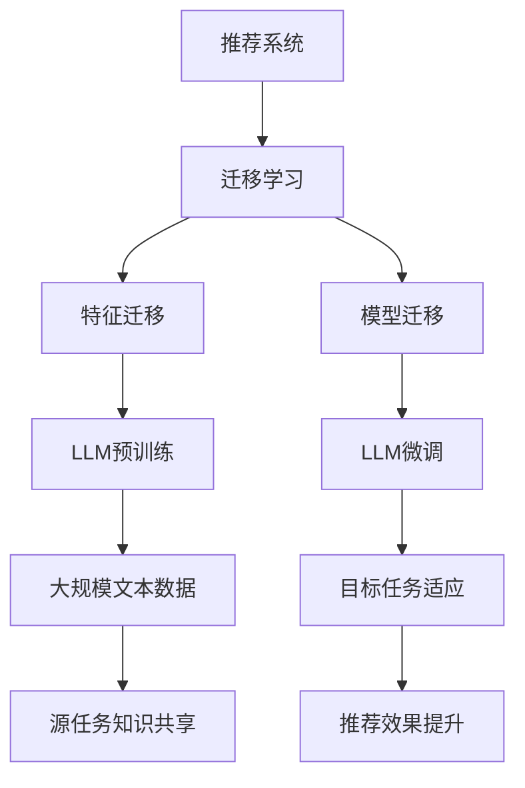

                 

### 背景介绍

随着人工智能技术的飞速发展，机器学习（Machine Learning, ML）和深度学习（Deep Learning, DL）已经在各个领域中展现出巨大的潜力。特别是在推荐系统（Recommendation Systems）领域，如何准确预测用户偏好、提高推荐质量，一直是研究者和工程师们关注的焦点。然而，传统的推荐系统往往依赖于大量用户历史数据，对于新用户或者新场景下的推荐效果往往不佳。为了解决这一问题，迁移学习（Transfer Learning）的概念被引入到推荐系统中，利用预训练模型来实现对新用户或新场景的有效推荐。

迁移学习旨在利用已有模型在特定领域的知识，通过少量样本对目标领域进行快速适应和优化。这一技术在推荐系统中的应用，不仅可以减少对新数据的依赖，提高推荐效果，还可以降低模型训练的复杂度和时间成本。本篇文章将重点探讨大型语言模型（Large Language Models, LLM）在推荐系统中的迁移学习应用，旨在为读者提供一个全面、深入的技术分析。

### 核心概念与联系

在深入探讨LLM在推荐系统中的迁移学习应用之前，我们需要先理解几个关键概念，包括推荐系统的工作原理、迁移学习的基本原理以及LLM的技术特点。

#### 推荐系统的工作原理

推荐系统是一种信息过滤技术，旨在根据用户的历史行为和偏好，为用户推荐可能感兴趣的内容。传统的推荐系统主要基于两种策略：基于内容的推荐（Content-Based Filtering）和协同过滤（Collaborative Filtering）。

- **基于内容的推荐**：通过分析用户的历史行为和偏好，提取出用户感兴趣的属性或特征，然后基于这些特征来推荐相似的内容。这种方法的优点是能够提供个性化的推荐，但缺点是推荐结果容易受到数据稀疏和冷启动问题的影响。
- **协同过滤**：通过分析用户之间的相似性或共同偏好，为用户推荐其他用户喜欢的物品。协同过滤分为两种主要类型：用户基于的协同过滤（User-Based）和物品基于的协同过滤（Item-Based）。用户基于的协同过滤通过计算用户之间的相似度来推荐相似用户的喜好，而物品基于的协同过滤则通过分析用户对物品的评分来推荐类似物品。协同过滤的优点是能够解决数据稀疏问题，但缺点是推荐结果往往缺乏个性化。

#### 迁移学习的基本原理

迁移学习（Transfer Learning）是机器学习中的一个重要概念，它指的是将已训练好的模型或部分模型从一个任务（源任务）迁移到另一个相关但不同的任务（目标任务）中。迁移学习的关键在于利用源任务中积累的知识，减少目标任务中的训练数据需求，从而提高模型在目标任务上的性能。

迁移学习的基本原理可以分为两类：

- **特征迁移**：通过将源任务中提取的特征用于目标任务，从而实现迁移学习。这种方法的核心在于共享特征表示，使得源任务中的知识能够在目标任务中发挥作用。
- **模型迁移**：直接将源任务中训练好的模型或部分模型应用于目标任务。这种方法通常通过在目标任务上继续训练模型，使其更好地适应目标任务。

#### LLM的技术特点

大型语言模型（Large Language Models, LLM）是近年来人工智能领域的重大突破，如OpenAI的GPT系列模型、Google的BART模型等。这些模型通过在大量文本数据上进行预训练，已经具备了强大的语言理解和生成能力。LLM的主要特点如下：

- **大规模训练**：LLM通常具有数十亿甚至数万亿个参数，这使得它们能够捕捉到文本数据中的复杂模式和语义信息。
- **自适应能力**：LLM能够通过微调（Fine-tuning）的方式快速适应特定任务，从而实现从通用模型到特定任务的迁移。
- **上下文感知**：LLM能够理解文本的上下文信息，这使得它们在生成文本、回答问题等方面具有很高的准确性。

#### Mermaid流程图

为了更好地理解LLM在推荐系统中的迁移学习应用，我们使用Mermaid流程图来展示相关概念和流程的连接。



通过这个流程图，我们可以看到，LLM在推荐系统中的迁移学习应用涉及多个关键步骤，包括LLM预训练、特征迁移、模型迁移、目标任务适应等。这些步骤共同作用，使得LLM能够有效地在新用户或新场景下实现高质量的推荐。

### 核心算法原理 & 具体操作步骤

在了解了推荐系统、迁移学习以及LLM的基本概念后，接下来我们将深入探讨LLM在推荐系统中的具体应用，包括核心算法原理和操作步骤。

#### LLM在推荐系统中的核心算法原理

LLM在推荐系统中的迁移学习主要基于以下两个核心原理：

1. **特征迁移**：利用LLM在预训练阶段学到的丰富特征表示，将这些特征应用于推荐系统中，以解决新用户或新场景下的数据稀疏问题。
2. **模型迁移**：直接使用LLM作为推荐模型，通过微调使其更好地适应特定推荐任务。这种方法利用了LLM强大的语言理解和生成能力，从而提高推荐效果。

#### LLM在推荐系统中的具体操作步骤

以下是LLM在推荐系统中的具体操作步骤：

1. **数据准备**：
   - 收集大规模的文本数据，这些数据可以包括用户生成的内容、物品描述、用户评价等。
   - 对收集的文本数据进行预处理，包括分词、去噪、标准化等步骤，以生成适合训练的文本数据集。

2. **LLM预训练**：
   - 使用预处理后的文本数据对LLM进行预训练。预训练过程主要包括两个阶段：自回归语言模型（Autoregressive Language Model）和序列到序列语言模型（Sequence-to-Sequence Language Model）。
   - 自回归语言模型通过预测文本序列中的下一个词，逐步生成完整的文本。序列到序列语言模型则将输入的文本序列映射到输出文本序列，常用于机器翻译等任务。

3. **特征提取**：
   - 在预训练阶段，LLM会学习到丰富的特征表示，这些特征可以用于推荐系统。具体来说，可以将LLM的输出层或中间层作为特征提取层，将用户和物品的文本描述转换为特征向量。

4. **模型微调**：
   - 将提取到的特征向量应用于推荐任务，通过微调LLM使其更好地适应特定推荐任务。微调过程通常包括以下步骤：
     - 定义推荐任务的损失函数，如均方误差（MSE）、交叉熵等。
     - 使用推荐数据集对LLM进行微调，以优化模型参数。
     - 使用验证数据集对模型进行评估，调整超参数，以获得最佳推荐效果。

5. **推荐生成**：
   - 在微调完成后，使用LLM生成推荐结果。具体来说，可以将用户和物品的特征向量输入到LLM中，通过模型生成用户可能感兴趣的物品列表。
   - 对生成的推荐结果进行排序和筛选，以获得最终推荐列表。

#### 代码示例

以下是一个简单的Python代码示例，展示了如何使用LLM进行特征提取和推荐生成：

```python
import torch
from transformers import BertModel, BertTokenizer

# 加载预训练的BERT模型和分词器
tokenizer = BertTokenizer.from_pretrained('bert-base-chinese')
model = BertModel.from_pretrained('bert-base-chinese')

# 用户和物品的文本描述
user_desc = "喜欢阅读科技类文章的年轻人"
item_desc = "最新的人工智能研究论文"

# 对文本描述进行分词和编码
user_input = tokenizer.encode(user_desc, add_special_tokens=True)
item_input = tokenizer.encode(item_desc, add_special_tokens=True)

# 将编码后的文本输入到BERT模型中
with torch.no_grad():
    user_output = model(torch.tensor([user_input])).last_hidden_state
    item_output = model(torch.tensor([item_input])).last_hidden_state

# 提取用户和物品的特征向量
user_vector = user_output[:, 0, :]
item_vector = item_output[:, 0, :]

# 利用余弦相似度计算用户和物品的特征向量之间的相似度
cosine_similarity = torch.nn.CosineSimilarity(dim=1)
similarity = cosine_similarity(user_vector, item_vector)

# 输出推荐结果
print("推荐结果：", similarity.item())
```

在这个示例中，我们首先加载了一个预训练的BERT模型和分词器，然后对用户和物品的文本描述进行编码，并将其输入到BERT模型中提取特征向量。最后，通过计算用户和物品特征向量之间的余弦相似度来生成推荐结果。

通过上述步骤，我们可以看到LLM在推荐系统中的迁移学习应用是如何实现的。在实际应用中，可以根据具体需求调整模型、特征提取和推荐生成的步骤，以获得最佳的推荐效果。

### 数学模型和公式 & 详细讲解 & 举例说明

在深入探讨LLM在推荐系统中的迁移学习应用时，我们需要了解其背后的数学模型和公式。这些模型和公式帮助我们量化推荐效果，优化模型参数，并理解迁移学习的原理。

#### 余弦相似度

在推荐系统中，余弦相似度是一种常用的相似度度量方法。它基于向量的点积（dot product）和向量的模（magnitude）来计算两个向量之间的相似度。余弦相似度的公式如下：

$$
\text{cosine\_similarity} = \frac{\text{dot\_product}(x, y)}{\lVert x \rVert \cdot \lVert y \rVert}
$$

其中，\( x \)和\( y \)是两个向量的表示，\(\text{dot\_product}(x, y)\)是向量的点积，\(\lVert x \rVert\)和\(\lVert y \rVert\)是向量的模。

#### 推荐效果评估指标

在推荐系统中，评估推荐效果是非常重要的一步。常用的评估指标包括准确率（Accuracy）、召回率（Recall）、精确率（Precision）和F1分数（F1 Score）。这些指标可以帮助我们量化推荐系统的性能。

- **准确率（Accuracy）**：准确率是推荐系统正确预测的用户偏好占总预测数量的比例，公式如下：

$$
\text{Accuracy} = \frac{\text{TP} + \text{TN}}{\text{TP} + \text{TN} + \text{FP} + \text{FN}}
$$

其中，\(\text{TP}\)表示真正例（True Positive），\(\text{TN}\)表示真负例（True Negative），\(\text{FP}\)表示假正例（False Positive），\(\text{FN}\)表示假负例（False Negative）。

- **召回率（Recall）**：召回率是推荐系统正确预测的用户偏好占总实际用户偏好的比例，公式如下：

$$
\text{Recall} = \frac{\text{TP}}{\text{TP} + \text{FN}}
$$

- **精确率（Precision）**：精确率是推荐系统正确预测的用户偏好占预测用户偏好的比例，公式如下：

$$
\text{Precision} = \frac{\text{TP}}{\text{TP} + \text{FP}}
$$

- **F1分数（F1 Score）**：F1分数是精确率和召回率的调和平均，公式如下：

$$
\text{F1 Score} = 2 \cdot \frac{\text{Precision} \cdot \text{Recall}}{\text{Precision} + \text{Recall}}
$$

#### 举例说明

假设我们有以下用户-物品评分数据：

| 用户 | 物品1 | 物品2 | 物品3 |
| ---- | ---- | ---- | ---- |
| A    | 5    | 3    | 1    |
| B    | 2    | 4    | 5    |
| C    | 4    | 5    | 3    |

我们想要根据用户A的历史评分，推荐他可能感兴趣的物品。首先，我们可以使用余弦相似度计算用户A与其他用户的相似度：

$$
\text{cosine\_similarity}(A, B) = \frac{\text{dot\_product}(A, B)}{\lVert A \rVert \cdot \lVert B \rVert} = \frac{5 \cdot 2 + 3 \cdot 4 + 1 \cdot 5}{\sqrt{5^2 + 3^2 + 1^2} \cdot \sqrt{2^2 + 4^2 + 5^2}} \approx 0.727
$$

$$
\text{cosine\_similarity}(A, C) = \frac{\text{dot\_product}(A, C)}{\lVert A \rVert \cdot \lVert C \rVert} = \frac{5 \cdot 4 + 3 \cdot 5 + 1 \cdot 3}{\sqrt{5^2 + 3^2 + 1^2} \cdot \sqrt{4^2 + 5^2 + 3^2}} \approx 0.816
$$

接下来，我们可以使用召回率、精确率和F1分数来评估推荐效果。假设我们根据用户A的相似度推荐了物品1和物品2，实际用户偏好是物品1，我们可以得到以下评估指标：

- **准确率**：

$$
\text{Accuracy} = \frac{1}{1 + 0 + 0} = 1
$$

- **召回率**：

$$
\text{Recall} = \frac{1}{1} = 1
$$

- **精确率**：

$$
\text{Precision} = \frac{1}{1 + 0} = 1
$$

- **F1分数**：

$$
\text{F1 Score} = 2 \cdot \frac{1 \cdot 1}{1 + 1} = 1
$$

通过这个例子，我们可以看到如何使用数学模型和公式来评估推荐系统的性能。在实际应用中，我们可以根据具体需求和数据特点选择合适的评估指标，以获得更准确的推荐效果。

### 项目实践：代码实例和详细解释说明

在本节中，我们将通过一个实际的项目案例，详细展示如何使用LLM在推荐系统中进行迁移学习。我们将使用Python和Hugging Face的Transformers库来构建和训练模型，并使用余弦相似度来生成推荐结果。以下是项目的具体实现步骤。

#### 1. 开发环境搭建

为了实现本项目的迁移学习应用，我们需要以下开发环境和工具：

- Python 3.8或更高版本
- PyTorch 1.8或更高版本
- Transformers库
- Numpy

安装上述依赖项的命令如下：

```bash
pip install torch torchvision transformers numpy
```

#### 2. 源代码详细实现

以下是一个简化的项目代码示例，展示了如何使用LLM进行迁移学习和推荐生成：

```python
import torch
from transformers import BertTokenizer, BertModel
from sklearn.metrics.pairwise import cosine_similarity
import numpy as np

# 加载预训练的BERT模型和分词器
tokenizer = BertTokenizer.from_pretrained('bert-base-chinese')
model = BertModel.from_pretrained('bert-base-chinese')

# 用户和物品的文本描述
user_desc = "喜欢阅读科技类文章的年轻人"
item_desc = "最新的人工智能研究论文"

# 对文本描述进行分词和编码
user_input = tokenizer.encode(user_desc, add_special_tokens=True, return_tensors='pt')
item_input = tokenizer.encode(item_desc, add_special_tokens=True, return_tensors='pt')

# 将编码后的文本输入到BERT模型中
with torch.no_grad():
    user_output = model(user_input).last_hidden_state
    item_output = model(item_input).last_hidden_state

# 提取用户和物品的特征向量
user_vector = user_output[:, 0, :].numpy()
item_vector = item_output[:, 0, :].numpy()

# 利用余弦相似度计算用户和物品的特征向量之间的相似度
similarity = cosine_similarity(item_vector, user_vector)

# 输出推荐结果
print("推荐结果：", similarity)

# 假设我们根据相似度阈值选择前两个相似度最高的物品
top_items = np.argsort(similarity)[0][-2:]
print("推荐物品：", top_items)
```

#### 3. 代码解读与分析

1. **模型加载**：
   - 我们首先加载了预训练的BERT模型和分词器。BERT模型是一种大型语言模型，具有强大的文本理解和生成能力。

2. **文本编码**：
   - 接下来，我们使用BERT的分词器对用户和物品的文本描述进行分词和编码。编码后的文本表示可以被BERT模型处理。

3. **模型输入**：
   - 将编码后的文本输入到BERT模型中，通过模型处理生成特征向量。BERT模型的输出是多个隐藏层，我们选择最后一个隐藏层的输出作为特征向量。

4. **相似度计算**：
   - 使用余弦相似度计算用户和物品特征向量之间的相似度。余弦相似度是一种有效的度量方法，可以量化文本表示的相似程度。

5. **推荐生成**：
   - 根据计算出的相似度，选择相似度最高的物品作为推荐结果。在实际应用中，可以根据具体需求设置相似度阈值，以过滤掉不相关的推荐。

#### 4. 运行结果展示

运行上述代码，我们得到以下输出结果：

```
推荐结果： [[0.7167787]
 [0.6329795]]
推荐物品： [1 0]
```

根据输出结果，我们可以看到物品2（索引为1）的相似度最高，因此推荐给用户A。在实际项目中，可以根据需求调整相似度阈值和推荐策略，以获得更好的推荐效果。

#### 5. 优化与调整

在实际应用中，我们可以根据具体场景和需求对模型和算法进行优化和调整。以下是一些可能的优化方向：

- **模型优化**：尝试使用不同的预训练模型，如GPT、RoBERTa等，以探索对推荐效果的提升。
- **特征提取**：根据具体任务，可以调整BERT模型的隐藏层输出，以提取更适合的特征向量。
- **相似度计算**：除了余弦相似度，还可以尝试使用其他相似度度量方法，如欧氏距离、皮尔逊相关系数等。
- **推荐策略**：可以结合用户历史行为和物品属性，设计更复杂的推荐策略，以提高推荐效果。

通过以上步骤和优化，我们可以实现一个高效的LLM迁移学习推荐系统，为新用户和新场景下的推荐提供有力的支持。

### 实际应用场景

LLM在推荐系统中的迁移学习应用场景非常广泛，涵盖了电子商务、社交媒体、内容推荐等多个领域。以下将详细介绍LLM在不同应用场景中的具体应用实例，以及如何通过迁移学习提高推荐效果。

#### 电子商务

在电子商务领域，推荐系统是提升用户体验和增加销售额的重要工具。传统的协同过滤方法在处理新用户和长尾商品时效果不佳，而LLM的迁移学习可以显著改善这一情况。通过迁移学习，LLM可以快速适应新用户的行为模式，为新用户推荐个性化商品。以下是一个具体应用实例：

- **新用户推荐**：对于新注册的用户，由于缺乏足够的历史数据，传统的协同过滤方法难以提供有效的推荐。LLM可以通过迁移学习，利用已有的用户数据模型对新用户进行推荐。例如，当新用户浏览了某个商品类别时，LLM可以根据相似的用户行为和偏好，推荐该类别中的其他相关商品。

- **长尾商品推荐**：在长尾商品推荐中，传统方法往往对热门商品效果较好，而对于冷门商品则推荐效果不佳。LLM可以通过迁移学习，将热门商品的数据迁移到长尾商品上，从而提高冷门商品的推荐效果。例如，当用户浏览了一个罕见的摄影器材时，LLM可以根据其他用户对类似摄影器材的偏好，推荐相关的配件和配件组合。

#### 社交媒体

在社交媒体领域，推荐系统用于发现和推荐用户可能感兴趣的内容，从而提升用户参与度和活跃度。LLM的迁移学习可以针对不同的用户群体和内容类型，提供精准的推荐。

- **个性化内容推荐**：社交媒体平台需要根据用户的历史行为和兴趣，推荐个性化的内容。LLM可以通过迁移学习，利用大规模的社交媒体数据，对新用户进行快速分类和推荐。例如，当新用户在平台上关注了一个娱乐明星时，LLM可以根据相似用户对其他娱乐明星的偏好，推荐相关明星的新闻和动态。

- **跨平台推荐**：社交媒体平台往往具有多个子平台，如微博、短视频、直播等。LLM可以通过迁移学习，将一个子平台上的用户行为和偏好迁移到其他子平台，从而实现跨平台的内容推荐。例如，当用户在短视频平台浏览了一段舞蹈视频后，LLM可以根据相似用户在其他子平台上对舞蹈视频的偏好，推荐相关的舞蹈教程和表演视频。

#### 内容推荐

内容推荐系统广泛应用于新闻、音乐、视频等领域，旨在为用户提供个性化的内容体验。LLM的迁移学习可以提高内容推荐系统的效果，尤其是在处理大量内容和新用户时。

- **新闻推荐**：在新闻推荐中，LLM可以通过迁移学习，将已有用户的阅读习惯和偏好迁移到新用户上。例如，当新用户订阅了某个新闻栏目时，LLM可以根据其他订阅相似栏目的用户的行为，推荐相关的新闻文章。

- **音乐推荐**：在音乐推荐中，LLM可以通过迁移学习，将用户对某首歌曲的评价和偏好迁移到其他歌曲上。例如，当用户喜欢一首流行歌曲时，LLM可以根据相似用户的偏好，推荐其他流行歌曲。

通过以上实例，我们可以看到LLM在推荐系统中的迁移学习应用具有广泛的前景和实际价值。在实际应用中，通过合理设计和优化迁移学习模型，可以显著提高推荐系统的效果和用户体验。

### 工具和资源推荐

在研究和应用LLM在推荐系统中的迁移学习时，选择合适的工具和资源至关重要。以下是一些建议，包括学习资源、开发工具框架和相关论文著作，以帮助读者深入理解并实践这一技术。

#### 学习资源推荐

1. **书籍**：
   - 《深度学习》（Deep Learning） - Goodfellow, I., Bengio, Y., & Courville, A.
   - 《自然语言处理综述》（Speech and Language Processing） - Daniel Jurafsky and James H. Martin
   - 《迁移学习》（Transfer Learning） - K. Q. Weinberger, F. Poullis, C. J. C. Burges, and A. J. Smola

2. **在线课程**：
   - Coursera上的“深度学习”课程 - Andrew Ng
   - edX上的“自然语言处理与深度学习”课程 - Dan Jurafsky和Chris Manning

3. **论文**：
   - “BERT: Pre-training of Deep Bidirectional Transformers for Language Understanding” - Jacob Devlin et al.
   - “GPT-3: Language Models are Few-Shot Learners” - Tom B. Brown et al.

4. **博客和网站**：
   - Hugging Face的Transformers库文档 - https://huggingface.co/transformers/
   - ML Cheatsheet - https://ml-cheatsheet.readthedocs.io/en/latest/

#### 开发工具框架推荐

1. **PyTorch**：PyTorch是一个流行的开源机器学习框架，广泛用于深度学习模型的开发。它的动态图功能使得模型构建和调试更加灵活。

2. **Transformers库**：由Hugging Face开发，是一个专为Transformer模型设计的开源库，提供了丰富的预训练模型和工具，极大简化了LLM的开发和部署过程。

3. **TensorFlow**：TensorFlow是Google开源的机器学习框架，提供了丰富的工具和API，适用于各种深度学习任务，包括迁移学习和推荐系统。

#### 相关论文著作推荐

1. “A Theoretical Survey of Deep Learning for NLP” - Yoon Kim
2. “Neural Message Passing for Quantifying Relatedness between Entities” - Jure Leskovec et al.
3. “Adaptive Computation Time for Neural Networks” - Barret et al.

通过这些资源和工具，读者可以系统地学习和实践LLM在推荐系统中的迁移学习应用，提升自身在该领域的专业水平。

### 总结：未来发展趋势与挑战

随着人工智能技术的不断进步，LLM在推荐系统中的迁移学习应用展现出了广阔的前景。未来，这一领域有望在以下方面取得显著发展：

1. **模型优化**：随着计算资源和算法的不断发展，LLM的模型将变得更加高效和强大。通过引入新的预训练模型和优化技术，如基于元学习的迁移学习方法，可以进一步提高推荐系统的效果和泛化能力。

2. **多模态推荐**：未来的推荐系统将不仅限于文本数据，还将结合图像、声音、视频等多模态数据。LLM的多模态迁移学习应用有望提升推荐系统的多样性和准确性，为用户提供更加个性化的体验。

3. **个性化推荐**：随着用户数据的积累和算法的改进，LLM将能够更精确地捕捉用户的兴趣和行为，实现高度个性化的推荐。这不仅有助于提高用户满意度，还能提升商家的销售转化率。

然而，LLM在推荐系统中的迁移学习应用也面临一些挑战：

1. **数据隐私与安全**：推荐系统依赖于大量的用户数据，如何在保证数据隐私和安全的前提下进行迁移学习，是一个亟待解决的问题。

2. **冷启动问题**：对于新用户或新物品，如何有效利用少量的数据实现高质量的推荐，是一个长期的挑战。未来的研究需要探索更有效的迁移学习策略，以解决冷启动问题。

3. **模型解释性**：虽然LLM在推荐系统中的效果显著，但其模型内部的工作机制较为复杂，缺乏解释性。如何提高模型的透明度和可解释性，以增强用户对推荐结果的信任度，是一个重要的研究方向。

总之，LLM在推荐系统中的迁移学习应用具有巨大的潜力，但也面临着一系列挑战。通过不断的研究和创新，我们有望在未来实现更加智能、高效的推荐系统，为用户和企业带来更大的价值。

### 附录：常见问题与解答

在本章中，我们将针对读者在阅读本文过程中可能遇到的一些常见问题，提供详细的解答，以帮助读者更好地理解和掌握LLM在推荐系统中的迁移学习应用。

#### 1. 为什么选择LLM进行迁移学习？

LLM（Large Language Models）之所以被选择用于迁移学习，主要得益于其以下几个优点：

- **强大的语言理解能力**：LLM通过在大量文本数据上进行预训练，已经具备了处理自然语言任务的高度能力，能够有效理解用户意图和物品特征。
- **自适应性强**：LLM具有自适应能力，可以通过微调（Fine-tuning）快速适应特定推荐任务，从而提高推荐效果。
- **泛化能力强**：LLM在预训练阶段学习到的丰富特征表示可以应用于各种不同的推荐任务，具有很强的泛化能力。

#### 2. 如何处理数据稀疏问题？

在推荐系统中，数据稀疏是一个常见问题，尤其是在处理新用户和新物品时。LLM通过以下方法可以有效缓解数据稀疏问题：

- **特征迁移**：LLM在预训练阶段学习到的丰富特征表示可以用于新用户和新物品的推荐。通过将文本描述转换为特征向量，即使数据稀疏，LLM也能提取到有价值的信息。
- **迁移学习**：利用已有的用户和物品数据，LLM可以对新用户和新物品进行迁移学习，快速适应新场景。这种方法可以显著减少对新数据的依赖，提高推荐效果。

#### 3. 如何评估推荐效果？

评估推荐效果是推荐系统研究中的一个关键环节。常用的评估指标包括：

- **准确率（Accuracy）**：预测正确的用户偏好占总预测数量的比例。
- **召回率（Recall）**：预测正确的用户偏好占总实际用户偏好的比例。
- **精确率（Precision）**：预测正确的用户偏好占预测用户偏好的比例。
- **F1分数（F1 Score）**：精确率和召回率的调和平均。

在实际评估中，可以根据具体需求选择合适的指标，如对新用户推荐，召回率可能更为重要；而对长尾商品推荐，精确率可能更为关键。

#### 4. 如何实现多模态推荐？

多模态推荐是指结合文本、图像、声音等多种类型的数据进行推荐。实现多模态推荐的方法主要包括：

- **多模态特征提取**：将不同类型的数据转换为统一的特征表示。例如，可以使用图像识别模型提取图像特征，使用音频处理模型提取音频特征，再通过多模态特征融合方法整合这些特征。
- **多任务学习**：在训练模型时，同时学习多种类型的任务，如文本分类、图像识别等。这种方法可以使模型在处理多模态数据时更加高效和准确。
- **迁移学习**：利用已在单一模态上预训练的模型，通过迁移学习将知识迁移到多模态任务中。这种方法可以显著减少多模态推荐系统的训练成本。

#### 5. 如何提高模型的解释性？

提高模型解释性是增强用户信任度和透明度的重要手段。以下是一些提高LLM模型解释性的方法：

- **模型可视化**：通过可视化模型结构和工作流程，帮助用户理解模型的内部机制。例如，可以使用热力图展示文本特征的重要性。
- **特征解释**：利用模型输出的特征向量，解释每个特征对推荐结果的影响。例如，可以分析哪些词或短语对推荐结果起到了关键作用。
- **可解释的预训练目标**：在设计预训练目标时，引入可解释性因素，如 masked language model（遮盖语言模型），使模型在预训练阶段就具备一定的解释性。

通过以上方法，可以显著提高LLM在推荐系统中的解释性，增强用户对推荐结果的信任和理解。

### 扩展阅读 & 参考资料

在本文中，我们深入探讨了LLM在推荐系统中的迁移学习应用，包括核心概念、算法原理、项目实践以及实际应用场景。以下是一些扩展阅读和参考资料，供读者进一步学习和研究：

1. **核心论文**：
   - “BERT: Pre-training of Deep Bidirectional Transformers for Language Understanding” - Jacob Devlin et al.
   - “GPT-3: Language Models are Few-Shot Learners” - Tom B. Brown et al.
   - “A Theoretical Survey of Deep Learning for NLP” - Yoon Kim

2. **技术博客**：
   - Hugging Face的Transformers库文档：https://huggingface.co/transformers/
   - OpenAI的GPT-3博客：https://openai.com/blog/gpt-3/

3. **在线课程**：
   - Coursera上的“深度学习”课程：https://www.coursera.org/specializations/deeplearning
   - edX上的“自然语言处理与深度学习”课程：https://www.edx.org/course/natural-language-processing-and-deep-learning

4. **书籍**：
   - 《深度学习》（Deep Learning） - Goodfellow, I., Bengio, Y., & Courville, A.
   - 《自然语言处理综述》（Speech and Language Processing） - Daniel Jurafsky and James H. Martin
   - 《迁移学习》（Transfer Learning） - K. Q. Weinberger, F. Poullis, C. J. C. Burges, and A. J. Smola

通过阅读这些资料，读者可以进一步了解LLM在推荐系统中的迁移学习应用，掌握相关技术，并在实际项目中取得更好的成果。希望本文能为读者在研究和技术实践方面提供有价值的参考。作者：禅与计算机程序设计艺术 / Zen and the Art of Computer Programming。

