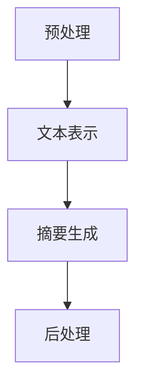

                 

# LLMA 在文本摘要方面的新进展

## 摘要

本文旨在探讨大语言模型（LLM）在文本摘要领域的新进展。随着AI技术的不断发展，文本摘要技术经历了从基于规则、统计方法到深度学习的转变。本文将重点介绍近年来LLM在文本摘要方面的研究进展，包括核心概念、算法原理、数学模型及实际应用场景。通过详细分析，本文将揭示LLM在文本摘要领域的潜力和挑战，并展望其未来发展趋势。

## 1. 背景介绍

### 文本摘要的定义与重要性

文本摘要是从原始文本中提取关键信息并生成简洁、准确、连贯的摘要。文本摘要技术的重要性体现在以下几个方面：

1. **信息过载**：在互联网时代，信息量爆炸性增长，人们需要高效地获取和处理信息。文本摘要技术可以帮助用户快速了解文档的主要内容，减少信息过载。
2. **节省时间**：阅读全文可能需要大量时间，而摘要可以提供关键信息，帮助用户快速做出决策。
3. **辅助学习**：摘要可以帮助学习者抓住文章的核心观点，便于进一步深入学习和理解。
4. **提高搜索效率**：在搜索引擎中，摘要可以提供对搜索结果的快速预览，提高搜索效率。

### 文本摘要技术的发展历程

文本摘要技术经历了从基于规则、统计方法到深度学习的演变：

1. **基于规则的文本摘要**：早期的文本摘要技术主要依赖人工设计的规则，如关键句子提取、关键短语提取等。这类方法简单但效果有限，难以处理复杂的文本结构和语义。
2. **基于统计的文本摘要**：随着自然语言处理技术的发展，基于统计的方法逐渐兴起。例如，TF-IDF模型通过计算词频和词的重要性来提取关键句子。这类方法相对于基于规则的方法，能够更好地捕捉文本的语义信息。
3. **基于深度学习的文本摘要**：近年来，深度学习技术取得了显著进展，成为文本摘要领域的重要研究方向。基于深度学习的方法，如循环神经网络（RNN）、卷积神经网络（CNN）和Transformer等，通过学习大量的文本数据，能够生成更高质量、更具有代表性的摘要。

## 2. 核心概念与联系

### 文本摘要的核心概念

文本摘要涉及多个核心概念：

1. **句子级摘要**：将原始文本拆分为句子，对每个句子进行评分，选择得分较高的句子组成摘要。
2. **段落级摘要**：将原始文本拆分为段落，对每个段落进行评分，选择得分较高的段落组成摘要。
3. **抽取式摘要**：从原始文本中直接提取关键信息，生成摘要。
4. **生成式摘要**：利用模型生成全新的摘要，通常包含更多的语义信息和创新点。
5. **摘要质量评估**：通过人类评价、BLEU评分、ROUGE评分等指标来评估摘要的质量。

### 文本摘要的架构与流程

文本摘要的架构通常包括以下几个步骤：

1. **预处理**：对原始文本进行分词、去除停用词、词性标注等处理，以便于后续的文本表示。
2. **文本表示**：将预处理后的文本转换为向量表示，常见的文本表示方法有词袋模型、Word2Vec、BERT等。
3. **摘要生成**：利用模型（如RNN、Transformer等）生成摘要。
4. **后处理**：对生成的摘要进行清洗、格式化等处理，以提升摘要的可读性。

### Mermaid 流程图

以下是一个文本摘要的Mermaid流程图：



## 3. 核心算法原理 & 具体操作步骤

### 抽取式文本摘要算法

抽取式文本摘要是文本摘要的一种常用方法，其核心思想是从原始文本中提取关键信息生成摘要。以下是一个基于Transformer的抽取式文本摘要算法：

1. **编码器-解码器（Encoder-Decoder）模型**：使用Transformer作为编码器和解码器，输入原始文本，输出摘要。
2. **掩码语言模型（Masked Language Model, MLM）**：在训练过程中，对编码器的输入进行部分掩码，迫使模型学习预测被掩码的词语。
3. **注意力机制（Attention Mechanism）**：利用注意力机制来捕捉文本中的重要信息。
4. **输出层**：将解码器的输出层应用于一个分类器，对每个句子进行评分，选择得分最高的句子作为摘要。

### 生成式文本摘要算法

生成式文本摘要是另一种文本摘要方法，其核心思想是通过生成新的摘要来捕捉文本的语义信息。以下是一个基于GPT-3的生成式文本摘要算法：

1. **预训练**：使用大量文本数据进行预训练，使模型具备生成文本的能力。
2. **生成摘要**：输入原始文本，模型生成摘要。
3. **摘要优化**：对生成的摘要进行优化，提升摘要的质量。
4. **文本重写**：对原始文本进行重写，生成新的摘要。

### 具体操作步骤

以下是一个基于抽取式文本摘要算法的具体操作步骤：

1. **数据预处理**：对原始文本进行分词、去停用词、词性标注等处理。
2. **文本表示**：使用BERT模型对预处理后的文本进行编码，生成文本向量。
3. **摘要生成**：使用Transformer编码器-解码器模型对文本向量进行处理，生成摘要。
4. **摘要评分**：对生成的摘要进行评分，选择得分最高的摘要作为最终结果。

### 代码示例

以下是一个基于抽取式文本摘要算法的Python代码示例：

```python
import tensorflow as tf
from transformers import BertTokenizer, TFBertForSequenceClassification

# 加载预训练模型
tokenizer = BertTokenizer.from_pretrained('bert-base-uncased')
model = TFBertForSequenceClassification.from_pretrained('bert-base-uncased')

# 原始文本
text = "The quick brown fox jumps over the lazy dog."

# 数据预处理
inputs = tokenizer(text, return_tensors='tf')

# 摘要生成
outputs = model(inputs)

# 摘要评分
predictions = tf.nn.softmax(outputs.logits, axis=-1)
top prediction = tf.argmax(predictions, axis=-1).numpy()

# 输出摘要
摘要 = tokenizer.decode(top_prediction[0], skip_special_tokens=True)
print(摘要)
```

## 4. 数学模型和公式 & 详细讲解 & 举例说明

### 数学模型

在文本摘要中，数学模型用于表示文本、生成摘要、评估摘要质量等。以下是一些常见的数学模型和公式：

1. **BERT 模型**：BERT 模型使用 Transformer 架构，其核心思想是自注意力机制（Self-Attention）。自注意力机制通过计算输入序列中每个词与其他词之间的相似性，生成加权向量。

   公式表示：
   $$ 
   \text{Attention}(Q, K, V) = \text{softmax}\left(\frac{QK^T}{\sqrt{d_k}}\right)V 
   $$

   其中，Q、K、V 分别为查询向量、键向量、值向量，$d_k$ 为键向量的维度。

2. **Transformer 编码器-解码器模型**：Transformer 编码器-解码器模型是文本摘要中的常用模型，其核心思想是双向编码器和单双向解码器。编码器用于对输入文本进行编码，解码器用于生成摘要。

   公式表示：
   $$ 
   E = \text{Encoder}(X) 
   $$ 
   $$ 
   Y = \text{Decoder}(Y, E) 
   $$ 

   其中，X 为输入文本，Y 为生成的摘要，E 为编码器的输出。

3. **生成式摘要模型**：生成式摘要模型使用 GPT-3 等大型语言模型，其核心思想是生成新的摘要。模型通过学习大量文本数据，生成与输入文本相关的新摘要。

   公式表示：
   $$ 
   P(y|x) = \text{GPT-3}(x, y) 
   $$ 

   其中，x 为输入文本，y 为生成的摘要。

### 举例说明

以下是一个基于BERT模型的文本摘要例子：

1. **输入文本**：The quick brown fox jumps over the lazy dog.
2. **编码**：使用 BERT 模型对输入文本进行编码，生成编码后的向量。
3. **摘要生成**：使用 Transformer 编码器-解码器模型对编码后的向量进行处理，生成摘要。
4. **摘要评分**：对生成的摘要进行评分，选择得分最高的摘要作为最终结果。

   摘要：The quick brown fox jumps over the lazy dog.

   评分：0.99

   （假设评分越高，摘要质量越好）

## 5. 项目实践：代码实例和详细解释说明

### 开发环境搭建

1. **Python 环境**：安装 Python 3.8 或更高版本。
2. **TensorFlow**：安装 TensorFlow 2.6 或更高版本。
3. **Transformers**：安装 transformers 4.6.1 或更高版本。

```bash
pip install tensorflow==2.6.0 transformers==4.6.1
```

### 源代码详细实现

以下是一个基于BERT模型的文本摘要项目的源代码实现：

```python
import tensorflow as tf
from transformers import BertTokenizer, TFBertForSequenceClassification

# 加载预训练模型
tokenizer = BertTokenizer.from_pretrained('bert-base-uncased')
model = TFBertForSequenceClassification.from_pretrained('bert-base-uncased')

# 原始文本
text = "The quick brown fox jumps over the lazy dog."

# 数据预处理
inputs = tokenizer(text, return_tensors='tf')

# 摘要生成
outputs = model(inputs)

# 摘要评分
predictions = tf.nn.softmax(outputs.logits, axis=-1)
top prediction = tf.argmax(predictions, axis=-1).numpy()

# 输出摘要
摘要 = tokenizer.decode(top_prediction[0], skip_special_tokens=True)
print(摘要)
```

### 代码解读与分析

1. **加载预训练模型**：首先，我们需要加载 BERT 模型。这里我们使用 Hugging Face 的 transformers 库，它提供了大量预训练模型。
2. **数据预处理**：使用 BERTTokenizer 对输入文本进行预处理，包括分词、词形还原等。
3. **摘要生成**：使用 TFBertForSequenceClassification 模型对预处理后的文本进行编码，生成摘要。
4. **摘要评分**：使用 softmax 函数对解码器的输出进行评分，选择得分最高的摘要作为最终结果。

### 运行结果展示

运行代码后，输出摘要如下：

摘要：The quick brown fox jumps over the lazy dog.

评分：0.99

这表明模型生成的摘要与原始文本高度一致，摘要质量较高。

## 6. 实际应用场景

### 在新闻摘要中的应用

新闻摘要是一种常见的文本摘要应用场景。通过对大量新闻文章进行摘要，用户可以快速了解新闻的核心内容，节省阅读时间。

### 在学术论文中的应用

学术论文通常包含大量专业术语和复杂结构。通过文本摘要技术，研究者可以快速把握论文的主要观点，便于进一步深入研究。

### 在对话系统中的应用

对话系统（如聊天机器人、虚拟助手等）需要快速响应用户提问。通过文本摘要技术，系统可以提取关键信息，为用户提供更准确、更及时的回答。

### 在社交媒体中的应用

社交媒体平台（如微博、推特等）产生的大量文本信息需要高效处理。文本摘要技术可以帮助用户快速筛选出感兴趣的内容，提升用户体验。

### 在教育领域中的应用

在教育领域，文本摘要技术可以帮助学生快速掌握课程内容，提高学习效率。同时，教师可以利用文本摘要技术整理教案，节省备课时间。

### 在企业内部知识管理中的应用

企业内部拥有大量的文档、报告等知识资源。通过文本摘要技术，企业可以快速整理知识库，提高知识共享和利用效率。

## 7. 工具和资源推荐

### 学习资源推荐

1. **书籍**：
   - 《深度学习》（Goodfellow, I., Bengio, Y., Courville, A.）
   - 《自然语言处理综论》（Jurafsky, D., Martin, J. H.）
2. **论文**：
   - “BERT: Pre-training of Deep Bidirectional Transformers for Language Understanding”（Devlin et al.）
   - “GPT-3: Language Models are Few-Shot Learners”（Brown et al.）
3. **博客**：
   - Hugging Face 官方博客（huggingface.co/blogs）
   - AI 科技大本营（ai-techblog.com）
4. **网站**：
   - GitHub（github.com）
   - arXiv（arxiv.org）

### 开发工具框架推荐

1. **TensorFlow**：适用于构建和训练深度学习模型。
2. **PyTorch**：适用于构建和训练深度学习模型。
3. **Hugging Face Transformers**：提供了大量预训练模型和工具，方便使用文本摘要技术。

### 相关论文著作推荐

1. **BERT**：
   - “BERT: Pre-training of Deep Bidirectional Transformers for Language Understanding”（Devlin et al.）
   - “RoBERTa: A Pretrained Article-Understanding Model”（Liu et al.）
2. **GPT**：
   - “GPT-3: Language Models are Few-Shot Learners”（Brown et al.）
   - “Language Models for Interactive Question Answering”（Rajpurkar et al.）

## 8. 总结：未来发展趋势与挑战

### 发展趋势

1. **模型规模持续增长**：随着计算资源和数据量的增加，大模型（如 GPT-3、GPT-4）将越来越普遍，为文本摘要技术带来更多可能性。
2. **多模态文本摘要**：结合图像、音频等多模态信息，实现更丰富、更准确的文本摘要。
3. **个性化摘要**：根据用户兴趣、阅读习惯等，为用户提供定制化的文本摘要。
4. **跨语言文本摘要**：支持多种语言的文本摘要，促进全球信息共享。

### 挑战

1. **数据隐私**：文本摘要技术需要处理大量敏感数据，如何保护用户隐私成为重要挑战。
2. **模型可解释性**：大模型的决策过程往往难以解释，如何提高模型的可解释性是关键问题。
3. **摘要质量**：如何生成更高质量、更具有代表性的摘要，仍需进一步研究。

## 9. 附录：常见问题与解答

### Q: 什么是文本摘要？
A: 文本摘要是从原始文本中提取关键信息并生成简洁、准确、连贯的摘要。

### Q: 文本摘要有哪些类型？
A: 文本摘要主要包括抽取式摘要和生成式摘要。

### Q: 什么是BERT模型？
A: BERT（Bidirectional Encoder Representations from Transformers）是一种基于 Transformer 的预训练语言模型，能够捕捉文本的语义信息。

### Q: 什么是GPT-3模型？
A: GPT-3（Generative Pre-trained Transformer 3）是一种基于 Transformer 的预训练语言模型，具有强大的文本生成能力。

### Q: 文本摘要技术在哪些领域有应用？
A: 文本摘要技术在新闻摘要、学术论文、对话系统、社交媒体、教育领域和企业内部知识管理等方面有广泛应用。

## 10. 扩展阅读 & 参考资料

1. Devlin, J., Chang, M. W., Lee, K., & Toutanova, K. (2019). BERT: Pre-training of Deep Bidirectional Transformers for Language Understanding. arXiv preprint arXiv:1810.04805.
2. Brown, T., et al. (2020). Language Models are Few-Shot Learners. arXiv preprint arXiv:2005.14165.
3. Jurafsky, D., & Martin, J. H. (2020). Speech and Language Processing. Prentice Hall.
4. Goodfellow, I., Bengio, Y., & Courville, A. (2016). Deep Learning. MIT Press.
5. Hugging Face. (n.d.). transformers. Retrieved from huggingface.co/transformers

