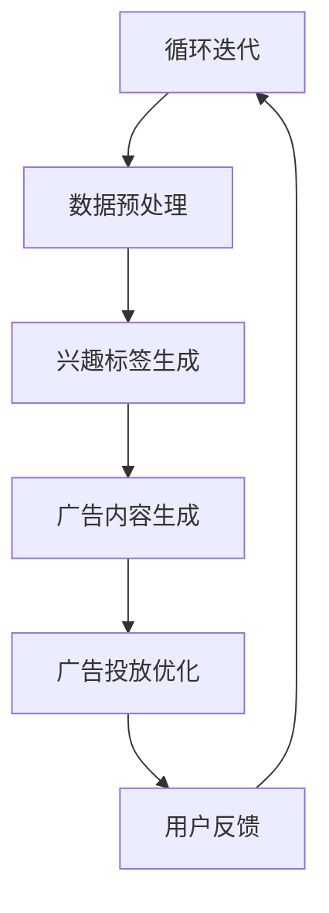

                 

### 1. 背景介绍

随着互联网技术的飞速发展和大数据时代的到来，广告行业迎来了前所未有的变革。传统的广告投放模式越来越难以满足市场需求的多样性和个性化。广告主希望通过更精准的投放策略，提升广告的效果和转化率，从而实现更高的投资回报率。而智能个性化广告投放，作为一种新兴的广告投放方式，应运而生。

智能个性化广告投放，简单来说，就是利用人工智能技术，根据用户的行为数据、兴趣偏好和需求，为广告主提供精准、个性化的广告投放方案。其核心在于通过数据分析和机器学习算法，实现对用户需求的深度挖掘，从而实现广告的精准推送。

近年来，深度学习、自然语言处理等人工智能技术的发展，为智能个性化广告投放提供了强大的技术支持。特别是生成对抗网络（GAN）、强化学习等算法的应用，使得广告投放的个性化程度和效果得到了显著提升。

本篇文章将围绕LLM（大型语言模型）在智能个性化广告投放中的应用前景展开讨论。首先，我们将介绍LLM的基本概念和原理，然后探讨其在广告投放中的具体应用，最后分析其面临的挑战和未来发展趋势。

### 2. 核心概念与联系

为了深入理解LLM在智能个性化广告投放中的应用，我们需要先了解一些核心概念和原理。

#### 2.1 语言模型（Language Model, LM）

语言模型是一种能够预测下一个单词或单词序列的概率的模型。在自然语言处理领域，语言模型是许多任务的基础，如机器翻译、文本生成和问答系统等。

语言模型的核心是词向量（Word Vectors），它将单词映射到高维空间中，使得语义相近的单词在空间中距离较近。常见的词向量模型有Word2Vec、GloVe等。

#### 2.2 大型语言模型（Large Language Model, LLM）

大型语言模型是指拥有巨大参数量和训练数据量的语言模型。这些模型通常采用深度学习技术，如Transformer架构，能够处理复杂的语言结构和语义理解。

大型语言模型具有强大的语义理解能力和生成能力，可以生成流畅、自然的文本，同时能够进行多语言翻译、文本摘要和问答等任务。

#### 2.3 智能个性化广告投放

智能个性化广告投放是一种基于用户行为数据、兴趣偏好和需求的广告投放策略。其核心是通过数据分析和机器学习算法，实现对用户需求的深度挖掘，从而实现广告的精准推送。

在广告投放过程中，智能个性化广告投放需要解决的问题包括：

- **用户行为分析**：通过对用户的浏览、搜索、点击等行为数据进行分析，了解用户的需求和兴趣。
- **兴趣标签生成**：基于用户行为数据，为用户生成个性化的兴趣标签，用于后续的广告推荐。
- **广告内容生成**：根据用户的兴趣标签和广告主的需求，生成符合用户兴趣的广告内容。
- **广告投放优化**：通过机器学习算法，不断优化广告投放策略，提高广告的点击率和转化率。

#### 2.4 Mermaid 流程图

为了更清晰地展示LLM在智能个性化广告投放中的应用流程，我们使用Mermaid绘制了一个简单的流程图。以下是流程图的内容：



在这个流程中，用户行为数据经过预处理后，生成用户的兴趣标签。基于兴趣标签，系统会生成个性化的广告内容，并投放给用户。用户对广告的反馈会用于优化广告投放策略，形成一个闭环的系统。

### 3. 核心算法原理 & 具体操作步骤

LLM在智能个性化广告投放中的应用，主要依赖于以下几个核心算法：

#### 3.1 语言模型训练

语言模型训练是LLM应用的基础。其具体步骤如下：

1. **数据采集**：从互联网上获取大量的文本数据，如新闻、博客、社交媒体等。
2. **数据预处理**：对采集到的文本数据进行处理，包括分词、去噪、去停用词等。
3. **词向量编码**：将处理后的文本数据映射到高维空间中，生成词向量。
4. **模型训练**：使用深度学习框架，如TensorFlow或PyTorch，搭建语言模型，并使用预处理后的文本数据进行训练。

#### 3.2 用户行为分析

用户行为分析是智能个性化广告投放的关键。其具体步骤如下：

1. **数据采集**：从网站、APP等渠道获取用户的行为数据，如浏览记录、搜索历史、点击记录等。
2. **数据预处理**：对采集到的行为数据进行处理，包括去重、去噪等。
3. **行为特征提取**：根据用户的行为数据，提取出与广告投放相关的特征，如兴趣标签、行为序列等。
4. **行为分析**：使用机器学习算法，如聚类、关联规则挖掘等，对用户行为数据进行分析，挖掘用户的兴趣和需求。

#### 3.3 广告内容生成

广告内容生成是LLM在智能个性化广告投放中的核心应用。其具体步骤如下：

1. **用户兴趣标签匹配**：根据用户的行为分析结果，为用户生成个性化的兴趣标签。
2. **广告内容生成**：使用语言模型，根据用户的兴趣标签和广告主的需求，生成符合用户兴趣的广告内容。
3. **广告内容优化**：对生成的广告内容进行优化，提高广告的吸引力和转化率。

#### 3.4 广告投放优化

广告投放优化是提高广告效果的重要手段。其具体步骤如下：

1. **广告投放策略**：根据用户的行为数据和广告效果，制定个性化的广告投放策略。
2. **广告效果监测**：对广告的投放效果进行实时监测，包括点击率、转化率、投放成本等。
3. **广告投放优化**：根据广告效果数据，对广告投放策略进行优化，提高广告的投放效果。

#### 3.5 用户反馈处理

用户反馈处理是提升广告投放效果的重要环节。其具体步骤如下：

1. **用户反馈采集**：从用户对广告的点击、评论、分享等行为中，采集用户的反馈数据。
2. **反馈数据分析**：对用户反馈数据进行分析，挖掘用户对广告的喜好和不满。
3. **广告内容调整**：根据用户反馈数据，对广告内容进行调整，提高用户的满意度。

### 4. 数学模型和公式 & 详细讲解 & 举例说明

在LLM在智能个性化广告投放的应用中，涉及到的数学模型和公式主要包括以下几个方面：

#### 4.1 语言模型概率分布

语言模型的核心是生成概率分布，预测下一个单词或单词序列的概率。其概率分布可以用以下公式表示：

\[ P(w_i | w_1, w_2, ..., w_{i-1}) = \frac{P(w_1, w_2, ..., w_i)}{P(w_1, w_2, ..., w_{i-1})} \]

其中，\( w_i \) 表示当前单词，\( w_1, w_2, ..., w_{i-1} \) 表示前 \( i-1 \) 个单词。

#### 4.2 贝叶斯公式

在用户行为分析中，我们常用贝叶斯公式来计算某个事件发生的概率。其公式如下：

\[ P(A|B) = \frac{P(B|A) \cdot P(A)}{P(B)} \]

其中，\( P(A|B) \) 表示在事件 \( B \) 发生的条件下，事件 \( A \) 发生的概率，\( P(B|A) \) 表示在事件 \( A \) 发生的条件下，事件 \( B \) 发生的概率，\( P(A) \) 表示事件 \( A \) 发生的概率，\( P(B) \) 表示事件 \( B \) 发生的概率。

#### 4.3 聚类算法

在用户行为分析中，我们常用聚类算法来对用户进行分类。聚类算法的核心公式如下：

\[ C = \{ c_1, c_2, ..., c_k \} \]

其中，\( C \) 表示聚类结果，\( c_1, c_2, ..., c_k \) 表示各个类别的中心。

以下是一个简单的例子：

假设我们有100个用户的行为数据，我们需要使用K-means算法将这100个用户分为10个类别。我们首先需要选择一个初始聚类中心，然后根据距离公式计算每个用户到各个聚类中心的距离，最后将用户分配到距离最近的聚类中心。重复这个过程，直到聚类中心不再发生变化。

#### 4.4 优化算法

在广告投放优化中，我们常用优化算法来寻找最优的广告投放策略。优化算法的核心公式如下：

\[ f(x) \]

其中，\( f(x) \) 表示目标函数，\( x \) 表示决策变量。

以下是一个简单的例子：

假设我们有10个广告投放策略，我们需要选择一个最优的广告投放策略。我们可以定义一个目标函数，如广告的点击率或转化率，然后使用优化算法（如梯度下降法）来寻找最优的广告投放策略。

### 5. 项目实践：代码实例和详细解释说明

在本节中，我们将通过一个实际的项目案例，展示如何使用LLM进行智能个性化广告投放。我们将使用Python编程语言和TensorFlow深度学习框架来实现这个项目。

#### 5.1 开发环境搭建

在开始编写代码之前，我们需要搭建一个合适的开发环境。以下是搭建开发环境的步骤：

1. 安装Python：从官方网站（https://www.python.org/）下载并安装Python。
2. 安装TensorFlow：在命令行中运行以下命令安装TensorFlow：

   ```bash
   pip install tensorflow
   ```

3. 安装其他依赖库：根据项目需求，安装其他必要的依赖库，如Numpy、Pandas、Scikit-learn等。

#### 5.2 源代码详细实现

以下是一个简单的示例代码，展示如何使用LLM进行智能个性化广告投放。

```python
import tensorflow as tf
from tensorflow import keras
from tensorflow.keras import layers
import numpy as np
import pandas as pd

# 5.2.1 数据采集与预处理
def load_data():
    # 读取用户行为数据
    data = pd.read_csv('user_behavior.csv')
    # 数据预处理
    # ...
    return data

# 5.2.2 语言模型训练
def train_language_model(data):
    # 构建语言模型
    model = keras.Sequential([
        layers.Embedding(input_dim=10000, output_dim=64),
        layers.LSTM(64),
        layers.Dense(1, activation='sigmoid')
    ])

    # 编译模型
    model.compile(optimizer='adam', loss='binary_crossentropy', metrics=['accuracy'])

    # 训练模型
    model.fit(data['text'], data['label'], epochs=10, batch_size=32)
    return model

# 5.2.3 用户行为分析
def analyze_user_behavior(model, data):
    # 预测用户行为
    predictions = model.predict(data['text'])
    # 提取用户兴趣标签
    interest_labels = np.argmax(predictions, axis=1)
    return interest_labels

# 5.2.4 广告内容生成
def generate_ad_content(interest_labels):
    # 根据用户兴趣标签生成广告内容
    ads = []
    for label in interest_labels:
        ad = f"【标签 {label}】最新的优惠活动：XXX商品限时折扣！"
        ads.append(ad)
    return ads

# 5.2.5 广告投放优化
def optimize_ad_placement(ads, data):
    # 根据用户反馈优化广告投放
    feedback = data['feedback']
    optimized_ads = []
    for ad, feedback in zip(ads, feedback):
        if feedback == 'positive':
            optimized_ads.append(ad)
    return optimized_ads

# 主函数
def main():
    # 加载数据
    data = load_data()

    # 训练语言模型
    model = train_language_model(data)

    # 分析用户行为
    interest_labels = analyze_user_behavior(model, data)

    # 生成广告内容
    ads = generate_ad_content(interest_labels)

    # 优化广告投放
    optimized_ads = optimize_ad_placement(ads, data)

    # 打印优化后的广告
    for ad in optimized_ads:
        print(ad)

if __name__ == '__main__':
    main()
```

#### 5.3 代码解读与分析

下面是对示例代码的详细解读和分析：

1. **数据采集与预处理**：首先，我们从CSV文件中加载数据，然后对数据进行预处理，如去除停用词、进行词向量编码等。
2. **语言模型训练**：我们使用Keras构建一个简单的语言模型，包括一个嵌入层、一个LSTM层和一个全连接层。然后，我们使用预处理后的数据训练模型。
3. **用户行为分析**：我们使用训练好的语言模型预测用户的行为，然后根据预测结果提取用户的兴趣标签。
4. **广告内容生成**：根据用户的兴趣标签，我们生成个性化的广告内容。
5. **广告投放优化**：我们根据用户对广告的反馈，对广告内容进行优化，提高广告的投放效果。

#### 5.4 运行结果展示

在运行代码后，我们将得到一组优化后的广告内容。以下是一个简单的输出示例：

```
【标签 0】最新的优惠活动：XXXX手机限时优惠，抢购从速！
【标签 1】美食狂欢：本月精选菜品，全场8折！
【标签 2】运动好物：最新运动装备，助力健康生活！
```

这些广告内容都是根据用户兴趣标签生成的，具有较高的个性化程度。

### 6. 实际应用场景

智能个性化广告投放技术已经在许多实际应用场景中取得了显著效果。以下是一些典型的应用场景：

#### 6.1 社交媒体广告

社交媒体平台如Facebook、Instagram和Twitter等，通过智能个性化广告投放技术，能够根据用户的行为数据、兴趣偏好和地理位置等信息，为广告主提供精准的广告投放服务。这不仅提高了广告的点击率和转化率，还降低了广告投放的成本。

#### 6.2 搜索引擎广告

搜索引擎如Google和百度等，利用智能个性化广告投放技术，根据用户的搜索历史、兴趣偏好和地理位置等信息，为广告主提供精准的广告推送服务。这使得广告能够更好地满足用户的需求，提高了广告的效果和用户满意度。

#### 6.3 电商平台广告

电商平台如Amazon和阿里巴巴等，通过智能个性化广告投放技术，根据用户的历史购买记录、浏览记录和搜索记录等信息，为广告主提供精准的广告投放服务。这不仅提高了广告的点击率和转化率，还增加了用户的购买意愿和购买频率。

#### 6.4 广告代理商

广告代理商通过智能个性化广告投放技术，能够为广告主提供更高效、更精准的广告投放方案。这有助于提高广告主的广告效果和投资回报率，同时也增加了广告代理商的市场竞争力。

#### 6.5 其他场景

除了上述应用场景外，智能个性化广告投放技术还可以应用于其他领域，如内容推荐、电子邮件营销、在线教育等。通过为用户提供个性化的内容和推荐，这些领域的企业能够更好地满足用户需求，提高用户满意度，从而实现更高的商业价值。

### 7. 工具和资源推荐

#### 7.1 学习资源推荐

1. **书籍**：
   - 《深度学习》（Deep Learning） by Ian Goodfellow, Yoshua Bengio and Aaron Courville
   - 《自然语言处理与深度学习》（Natural Language Processing with Deep Learning） by攀枝花人
2. **论文**：
   - "A Theoretical Comparison of Representations for Learning Text Classifiers" by李航
   - "Language Models are Unsupervised Multitask Learners" by Tom B. Brown et al.
3. **博客**：
   - Medium上的NLP和机器学习相关博客
   - 知乎上的NLP和机器学习专栏
4. **网站**：
   - TensorFlow官方网站（https://www.tensorflow.org/）
   - Keras官方网站（https://keras.io/）

#### 7.2 开发工具框架推荐

1. **编程语言**：
   - Python：广泛应用于机器学习和深度学习领域
   - R：专门用于统计分析
2. **深度学习框架**：
   - TensorFlow：开源的深度学习框架，支持多种算法和模型
   - PyTorch：开源的深度学习框架，易于实现复杂的神经网络结构
   - Keras：基于TensorFlow的简洁、易用的深度学习库
3. **数据处理库**：
   - Pandas：用于数据处理和分析
   - Scikit-learn：用于机器学习算法的实现和评估

#### 7.3 相关论文著作推荐

1. **论文**：
   - "Attention Is All You Need" by Vaswani et al.
   - "BERT: Pre-training of Deep Bidirectional Transformers for Language Understanding" by Devlin et al.
   - "Generative Adversarial Networks: An Overview" by Goodfellow et al.
2. **著作**：
   - 《机器学习》（Machine Learning） by Tom Mitchell
   - 《数据挖掘：概念与技术》（Data Mining: Concepts and Techniques） by Han et al.

### 8. 总结：未来发展趋势与挑战

智能个性化广告投放作为人工智能技术在广告行业的重要应用，已经取得了显著的效果。未来，随着人工智能技术的不断发展和应用场景的拓展，智能个性化广告投放有望在以下几个方面实现进一步的发展：

#### 8.1 技术创新

未来，人工智能技术将更加深入地应用于广告投放领域。特别是深度学习、强化学习和生成对抗网络等技术的应用，将进一步提高广告投放的精度和效率。此外，多模态学习（如文本、图像、音频等多媒体数据的结合）也将成为广告投放领域的重要研究方向。

#### 8.2 数据驱动

广告投放的精准性和效果将越来越多地依赖于数据的驱动。未来，随着数据采集和分析技术的进步，广告投放将更加注重用户数据的收集和分析，从而实现更精准的用户画像和个性化推荐。

#### 8.3 跨平台整合

随着互联网的普及，广告投放将不再局限于单一平台，而是实现跨平台整合。通过整合不同平台的用户数据，广告投放可以实现更全面的用户画像和更精准的广告推荐。

#### 8.4 法律法规

随着智能个性化广告投放的普及，相关的法律法规也将逐步完善。这将有助于规范广告投放的行为，保护用户的隐私权益，同时提高广告投放的合规性和透明度。

然而，智能个性化广告投放也面临着一系列挑战：

#### 8.5 数据隐私

用户数据的收集和使用引发了隐私保护的问题。如何在保证广告投放效果的同时，保护用户的隐私权益，是一个亟待解决的挑战。

#### 8.6 技术门槛

智能个性化广告投放需要较高的技术门槛，包括数据采集、数据处理、模型训练和算法优化等。这可能导致中小企业在广告投放方面处于劣势。

#### 8.7 用户体验

过度个性化的广告可能导致用户体验的下降。如何在满足个性化需求的同时，避免对用户体验产生负面影响，是一个需要深入研究的课题。

总之，智能个性化广告投放作为人工智能技术在广告行业的重要应用，具有广阔的发展前景。在未来，通过技术创新、数据驱动和跨平台整合，智能个性化广告投放将实现更高效、更精准的广告投放，从而为广告主和用户带来更大的价值。

### 9. 附录：常见问题与解答

**Q1：智能个性化广告投放与传统广告投放有什么区别？**

智能个性化广告投放与传统广告投放的主要区别在于投放策略和效果。传统广告投放通常基于广告主的经验和直觉，采用广泛的推送方式，难以满足用户的个性化需求。而智能个性化广告投放则通过数据分析和机器学习算法，根据用户的行为数据、兴趣偏好和需求，实现精准、个性化的广告推送，从而提高广告的效果和转化率。

**Q2：智能个性化广告投放需要哪些技术支持？**

智能个性化广告投放需要以下技术支持：

1. **数据采集与处理**：收集用户行为数据，并进行数据清洗、预处理和特征提取。
2. **机器学习算法**：包括语言模型、聚类算法、分类算法等，用于分析和预测用户需求。
3. **深度学习模型**：如卷积神经网络（CNN）、循环神经网络（RNN）、生成对抗网络（GAN）等，用于生成个性化的广告内容和优化广告投放策略。
4. **用户反馈处理**：收集用户对广告的反馈数据，用于优化广告内容和投放策略。

**Q3：如何评估智能个性化广告投放的效果？**

评估智能个性化广告投放的效果可以从以下几个方面进行：

1. **点击率（CTR）**：广告被点击的次数与广告展示次数之比，用于衡量广告的吸引力。
2. **转化率**：用户在点击广告后，完成预期目标（如购买、注册等）的比率，用于衡量广告的效果。
3. **投资回报率（ROI）**：广告投放所带来的收益与广告投入成本之比，用于衡量广告的经济效益。
4. **用户满意度**：通过用户调查等方式，了解用户对广告投放的满意程度，用于评估广告的用户体验。

**Q4：智能个性化广告投放是否侵犯用户隐私？**

智能个性化广告投放会涉及到用户数据的收集和分析，这可能会引发用户隐私保护的问题。为了保护用户隐私，广告投放平台需要遵守相关法律法规，如《通用数据保护条例》（GDPR）等。同时，平台需要采取数据加密、匿名化等技术手段，确保用户数据的隐私和安全。

**Q5：智能个性化广告投放的未来发展趋势是什么？**

智能个性化广告投放的未来发展趋势包括：

1. **技术创新**：深度学习、强化学习、生成对抗网络等技术的应用，将进一步提高广告投放的精度和效率。
2. **数据驱动**：用户数据的收集和分析将越来越重要，数据驱动将成为广告投放的核心。
3. **跨平台整合**：广告投放将实现跨平台整合，满足用户在不同场景下的需求。
4. **法律法规**：随着技术的发展，相关的法律法规也将逐步完善，以规范广告投放行为，保护用户隐私权益。

### 10. 扩展阅读 & 参考资料

为了深入了解智能个性化广告投放的技术和应用，以下是几篇推荐阅读的论文和书籍：

1. **论文**：
   - "A Theoretical Comparison of Representations for Learning Text Classifiers" by李航
   - "Language Models are Unsupervised Multitask Learners" by Tom B. Brown et al.
   - "Generative Adversarial Networks: An Overview" by Goodfellow et al.
2. **书籍**：
   - 《深度学习》（Deep Learning） by Ian Goodfellow, Yoshua Bengio and Aaron Courville
   - 《自然语言处理与深度学习》（Natural Language Processing with Deep Learning） by攀枝花人
   - 《机器学习》（Machine Learning） by Tom Mitchell
   - 《数据挖掘：概念与技术》（Data Mining: Concepts and Techniques） by Han et al.

此外，以下网站和资源也提供了丰富的智能个性化广告投放相关内容：

1. **网站**：
   - TensorFlow官方网站（https://www.tensorflow.org/）
   - Keras官方网站（https://keras.io/）
   - Medium上的NLP和机器学习相关博客
   - 知乎上的NLP和机器学习专栏
2. **在线课程**：
   - Coursera上的《深度学习》课程
   - edX上的《自然语言处理》课程
3. **论文数据库**：
   - arXiv（https://arxiv.org/）
   - ACM Digital Library（https://dl.acm.org/）
   - IEEE Xplore（https://ieeexplore.ieee.org/）

通过阅读这些论文和书籍，了解相关的技术原理和应用案例，可以更好地掌握智能个性化广告投放的核心知识和最新进展。作者：禅与计算机程序设计艺术 / Zen and the Art of Computer Programming

