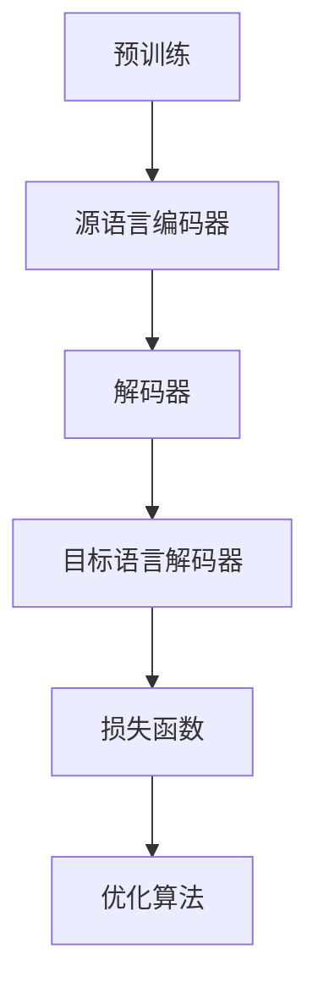

                 

### 文章标题

**LLM在机器翻译领域的突破与挑战**

> **关键词：** 大型语言模型（LLM），机器翻译，神经机器翻译，突破，挑战，效率，准确性，多样性，应用场景，技术发展。

> **摘要：** 本文深入探讨了大型语言模型（LLM）在机器翻译领域所带来的突破与挑战。文章首先介绍了LLM的基本概念和技术原理，然后分析了LLM在机器翻译中的应用情况，并探讨了其面临的主要挑战。通过具体案例分析，本文展示了LLM在机器翻译中的实际效果和影响，最后对未来的发展趋势和解决策略进行了展望。

---

### 1. 背景介绍

机器翻译（Machine Translation，MT）是自然语言处理（Natural Language Processing，NLP）领域的一个重要分支，旨在利用计算机程序自动将一种自然语言文本翻译成另一种自然语言文本。随着全球化和信息化的推进，跨语言交流的需求日益增长，机器翻译技术的重要性也逐渐凸显。

传统的机器翻译方法主要分为基于规则的方法和基于统计的方法。基于规则的方法依赖于人工编写的规则和模式，通常在特定语言对上表现良好，但扩展性较差。基于统计的方法通过分析大量双语语料库，利用概率模型进行翻译，具有较好的通用性，但翻译质量受限于语料质量和算法设计。

近年来，随着深度学习技术的发展，神经机器翻译（Neural Machine Translation，NMT）逐渐成为机器翻译领域的热点。NMT采用端到端的神经网络模型，能够自动学习输入文本和目标文本之间的映射关系，显著提高了翻译质量和效率。

大型语言模型（Large Language Model，LLM）是深度学习技术在自然语言处理领域的重要突破。LLM通过训练大规模的神经网络模型，能够捕捉到语言中的复杂结构和语义信息，实现了在多种自然语言任务上的优异表现。LLM的出现为机器翻译带来了新的机遇和挑战。

本文将从以下几个方面展开讨论：

1. LLM的基本概念和技术原理
2. LLM在机器翻译中的应用情况
3. LLM在机器翻译中面临的主要挑战
4. 具体案例分析
5. 未来发展趋势与挑战

通过对以上方面的深入分析，本文旨在为LLM在机器翻译领域的研究和应用提供一些有价值的参考和启示。

---

### 2. 核心概念与联系

#### 2.1 大型语言模型（LLM）

大型语言模型（LLM）是一种基于深度学习的自然语言处理模型，通过训练大规模的神经网络来捕捉语言的复杂结构和语义信息。LLM的核心思想是利用大量的文本数据进行预训练，然后在特定任务上进行微调。

**基本原理：**

LLM通常采用变换器架构（Transformer），这是一种基于自注意力机制的深度神经网络。变换器架构通过自注意力机制能够自动学习输入文本中各个词之间的依赖关系，从而实现对语言信息的有效捕捉。

**组成部分：**

1. **编码器（Encoder）：** 编码器负责处理输入文本，将文本转换为向量表示。编码器中的自注意力机制能够捕捉到输入文本中各个词之间的依赖关系。

2. **解码器（Decoder）：** 解码器负责生成目标文本。解码器中的自注意力机制能够捕捉到目标文本中各个词之间的依赖关系，并通过上下文信息生成预测词。

3. **预训练（Pre-training）：** 预训练是指使用大规模的文本数据对LLM进行初步训练，使其能够捕捉到语言的普遍规律和特征。

4. **微调（Fine-tuning）：** 微调是指在使用预训练的LLM的基础上，针对特定任务进行进一步的训练，以提升模型在特定任务上的性能。

#### 2.2 机器翻译（Machine Translation）

机器翻译是指利用计算机程序将一种自然语言文本翻译成另一种自然语言文本的过程。机器翻译主要分为基于规则的方法和基于统计的方法，而神经机器翻译（NMT）是近年来发展迅速的一种方法。

**基本原理：**

NMT采用端到端的神经网络模型，通过输入源语言文本，直接生成目标语言文本。NMT的核心思想是通过训练大规模的神经网络模型，学习源语言文本和目标语言文本之间的映射关系。

**组成部分：**

1. **源语言编码器（Source Encoder）：** 源语言编码器负责将源语言文本转换为向量表示。

2. **目标语言解码器（Target Decoder）：** 目标语言解码器负责生成目标语言文本。

3. **损失函数（Loss Function）：** 损失函数用于衡量模型输出的目标语言文本与实际目标语言文本之间的差距，以指导模型的训练。

4. **优化算法（Optimization Algorithm）：** 优化算法用于调整模型参数，以最小化损失函数。

#### 2.3 LLM与机器翻译的联系

LLM在机器翻译中的应用主要体现在以下几个方面：

1. **预训练：** LLM通过预训练大规模的神经网络模型，能够学习到语言的普遍规律和特征，为机器翻译任务提供高质量的输入表示。

2. **解码器：** LLM中的解码器可以用于生成目标语言文本，从而实现神经机器翻译。解码器中的自注意力机制能够捕捉到目标语言文本中各个词之间的依赖关系，提高翻译质量。

3. **上下文信息：** LLM能够利用上下文信息进行预测，从而生成更加准确和自然的翻译结果。

4. **多语言支持：** LLM能够支持多种语言之间的翻译，从而实现跨语言的机器翻译任务。

**Mermaid 流程图：**



**解释：**

- 预训练：使用大规模的文本数据对LLM进行初步训练，使其能够捕捉到语言的普遍规律和特征。
- 源语言编码器：将源语言文本转换为向量表示。
- 解码器：生成目标语言文本。
- 目标语言解码器：生成目标语言文本。
- 损失函数：衡量模型输出的目标语言文本与实际目标语言文本之间的差距，以指导模型的训练。
- 优化算法：调整模型参数，以最小化损失函数。

---

### 3. 核心算法原理 & 具体操作步骤

#### 3.1 LLM的工作原理

大型语言模型（LLM）是基于深度学习的自然语言处理模型，其核心思想是利用大规模的神经网络来捕捉语言的复杂结构和语义信息。下面将详细介绍LLM的工作原理和具体操作步骤。

**3.1.1 变换器架构**

变换器（Transformer）是LLM的核心架构，它采用自注意力（Self-Attention）机制来捕捉输入文本中各个词之间的依赖关系。自注意力机制通过计算输入文本中每个词与所有其他词之间的相似度，从而生成加权表示。

**3.1.2 编码器（Encoder）**

编码器负责处理输入文本，将其转换为向量表示。编码器由多个编码层（Encoder Layer）组成，每层包含两个关键组件：自注意力机制（Self-Attention）和前馈神经网络（Feedforward Neural Network）。

- **自注意力机制（Self-Attention）：** 计算输入文本中每个词与所有其他词之间的相似度，生成加权表示。自注意力机制可以捕捉到输入文本中长距离的依赖关系。
- **前馈神经网络（Feedforward Neural Network）：** 对编码后的向量进行非线性变换，增强模型的表示能力。

编码器的工作流程如下：

1. **输入嵌入（Input Embedding）：** 将输入文本转换为词嵌入向量。
2. **编码层（Encoder Layer）：** 对每个编码层，执行自注意力机制和前馈神经网络。
3. **输出层（Output Layer）：** 将编码后的向量输出为序列表示。

**3.1.3 解码器（Decoder）**

解码器负责生成目标语言文本。解码器由多个解码层（Decoder Layer）组成，每层包含两个关键组件：自注意力机制（Self-Attention）和交叉注意力（Cross-Attention）。

- **自注意力机制（Self-Attention）：** 计算解码过程中每个词与自身和其他词之间的相似度，生成加权表示。
- **交叉注意力（Cross-Attention）：** 计算编码后的向量与解码过程中每个词之间的相似度，用于生成目标词的上下文信息。

解码器的工作流程如下：

1. **输入嵌入（Input Embedding）：** 将输入文本转换为词嵌入向量。
2. **解码层（Decoder Layer）：** 对每个解码层，执行自注意力机制和交叉注意力。
3. **输出层（Output Layer）：** 输出解码后的序列表示，生成目标语言文本。

**3.1.4 预训练与微调**

LLM的预训练是指使用大规模的文本数据对神经网络进行初步训练，使其能够捕捉到语言的普遍规律和特征。预训练后，LLM可以通过微调（Fine-tuning）针对特定任务进行进一步训练。

微调是指在预训练的LLM基础上，使用特定任务的数据集对模型进行训练。微调过程主要包括以下步骤：

1. **数据准备：** 收集并预处理特定任务的数据集。
2. **损失函数：** 定义损失函数，用于衡量模型输出的目标文本与实际目标文本之间的差距。
3. **优化算法：** 使用优化算法调整模型参数，以最小化损失函数。

通过预训练和微调，LLM能够在多种自然语言任务上表现出优异的性能。

---

### 4. 数学模型和公式 & 详细讲解 & 举例说明

#### 4.1 自注意力机制（Self-Attention）

自注意力机制是变换器架构（Transformer）的核心组件，用于计算输入文本中每个词与所有其他词之间的相似度，生成加权表示。自注意力机制的计算公式如下：

$$
\text{Attention}(Q, K, V) = \text{softmax}\left(\frac{QK^T}{\sqrt{d_k}}\right) V
$$

其中，$Q$、$K$ 和 $V$ 分别是查询（Query）、键（Key）和值（Value）向量，$d_k$ 是键向量的维度。自注意力机制的计算过程可以分为以下几个步骤：

1. **计算相似度：** 计算查询向量 $Q$ 和键向量 $K$ 的点积，得到相似度矩阵。
2. **归一化：** 对相似度矩阵应用 softmax 函数进行归一化，生成加权表示。
3. **计算加权值：** 将加权表示与值向量 $V$ 相乘，得到加权值。

**举例说明：**

假设输入文本包含三个词 $w_1$、$w_2$ 和 $w_3$，其对应的查询向量、键向量和值向量分别为 $Q_1$、$K_1$、$V_1$；$Q_2$、$K_2$、$V_2$；$Q_3$、$K_3$、$V_3$。计算自注意力机制的过程如下：

1. **计算相似度矩阵：**
   $$
   \text{similarity} = \begin{bmatrix}
   Q_1K_1^T & Q_1K_2^T & Q_1K_3^T \\
   Q_2K_1^T & Q_2K_2^T & Q_2K_3^T \\
   Q_3K_1^T & Q_3K_2^T & Q_3K_3^T \\
   \end{bmatrix}
   $$

2. **归一化：**
   $$
   \text{softmax}(\text{similarity}) = \begin{bmatrix}
   \frac{e^{Q_1K_1^T}}{\sum_{i=1}^{3} e^{Q_iK_i^T}} & \frac{e^{Q_1K_2^T}}{\sum_{i=1}^{3} e^{Q_iK_i^T}} & \frac{e^{Q_1K_3^T}}{\sum_{i=1}^{3} e^{Q_iK_i^T}} \\
   \frac{e^{Q_2K_1^T}}{\sum_{i=1}^{3} e^{Q_iK_i^T}} & \frac{e^{Q_2K_2^T}}{\sum_{i=1}^{3} e^{Q_iK_i^T}} & \frac{e^{Q_2K_3^T}}{\sum_{i=1}^{3} e^{Q_iK_i^T}} \\
   \frac{e^{Q_3K_1^T}}{\sum_{i=1}^{3} e^{Q_iK_i^T}} & \frac{e^{Q_3K_2^T}}{\sum_{i=1}^{3} e^{Q_iK_i^T}} & \frac{e^{Q_3K_3^T}}{\sum_{i=1}^{3} e^{Q_iK_i^T}} \\
   \end{bmatrix}
   $$

3. **计算加权值：**
   $$
   \text{weighted\_value} = \text{softmax}(\text{similarity}) \cdot V = \begin{bmatrix}
   \frac{e^{Q_1K_1^T}V_1}{\sum_{i=1}^{3} e^{Q_iK_i^T}} & \frac{e^{Q_1K_2^T}V_2}{\sum_{i=1}^{3} e^{Q_iK_i^T}} & \frac{e^{Q_1K_3^T}V_3}{\sum_{i=1}^{3} e^{Q_iK_i^T}} \\
   \frac{e^{Q_2K_1^T}V_1}{\sum_{i=1}^{3} e^{Q_iK_i^T}} & \frac{e^{Q_2K_2^T}V_2}{\sum_{i=1}^{3} e^{Q_iK_i^T}} & \frac{e^{Q_2K_3^T}V_3}{\sum_{i=1}^{3} e^{Q_iK_i^T}} \\
   \frac{e^{Q_3K_1^T}V_1}{\sum_{i=1}^{3} e^{Q_iK_i^T}} & \frac{e^{Q_3K_2^T}V_2}{\sum_{i=1}^{3} e^{Q_iK_i^T}} & \frac{e^{Q_3K_3^T}V_3}{\sum_{i=1}^{3} e^{Q_iK_i^T}} \\
   \end{bmatrix}
   $$

加权值表示了每个词对其他词的重要性程度，从而实现了自注意力机制。

#### 4.2 交叉注意力（Cross-Attention）

交叉注意力（Cross-Attention）是解码器（Decoder）中的关键组件，用于计算编码器（Encoder）输出的向量与解码过程中每个词之间的相似度，生成目标词的上下文信息。交叉注意力的计算公式如下：

$$
\text{Attention}(Q, K, V) = \text{softmax}\left(\frac{QK^T}{\sqrt{d_k}}\right) V
$$

其中，$Q$、$K$ 和 $V$ 分别是查询（Query）、键（Key）和值（Value）向量，$d_k$ 是键向量的维度。交叉注意力机制的计算过程可以分为以下几个步骤：

1. **计算相似度：** 计算查询向量 $Q$ 和键向量 $K$ 的点积，得到相似度矩阵。
2. **归一化：** 对相似度矩阵应用 softmax 函数进行归一化，生成加权表示。
3. **计算加权值：** 将加权表示与值向量 $V$ 相乘，得到加权值。

**举例说明：**

假设编码器输出的向量序列为 $K_1$、$K_2$、$K_3$，解码过程中当前词的查询向量为 $Q$。计算交叉注意力机制的过程如下：

1. **计算相似度矩阵：**
   $$
   \text{similarity} = \begin{bmatrix}
   QK_1^T & QK_2^T & QK_3^T \\
   \end{bmatrix}
   $$

2. **归一化：**
   $$
   \text{softmax}(\text{similarity}) = \begin{bmatrix}
   \frac{e^{QK_1^T}}{\sum_{i=1}^{3} e^{QK_i^T}} & \frac{e^{QK_2^T}}{\sum_{i=1}^{3} e^{QK_i^T}} & \frac{e^{QK_3^T}}{\sum_{i=1}^{3} e^{QK_i^T}} \\
   \end{bmatrix}
   $$

3. **计算加权值：**
   $$
   \text{weighted\_value} = \text{softmax}(\text{similarity}) \cdot V = \begin{bmatrix}
   \frac{e^{QK_1^T}V_1}{\sum_{i=1}^{3} e^{QK_i^T}} & \frac{e^{QK_2^T}V_2}{\sum_{i=1}^{3} e^{QK_i^T}} & \frac{e^{QK_3^T}V_3}{\sum_{i=1}^{3} e^{QK_i^T}} \\
   \end{bmatrix}
   $$

加权值表示了编码器输出的向量对解码过程中当前词的重要性程度，从而实现了交叉注意力机制。

---

### 5. 项目实践：代码实例和详细解释说明

#### 5.1 开发环境搭建

为了实践LLM在机器翻译中的应用，我们首先需要搭建一个合适的开发环境。以下是一个基本的Python开发环境搭建步骤：

1. 安装Python：确保安装了Python 3.6或更高版本。
2. 安装Transformer库：使用pip命令安装`transformers`库，该库提供了预训练的LLM模型和相关工具。
   ```
   pip install transformers
   ```

3. 安装其他依赖库：包括`torch`（PyTorch框架）、`torchtext`（用于处理文本数据）等。

4. 数据准备：收集并准备源语言和目标语言的文本数据。通常，这些数据应来自高质量的双语语料库，如WMT（Workshop on Machine Translation）数据集。

5. 运行环境：建议在GPU上进行训练，以提高训练速度。

#### 5.2 源代码详细实现

以下是一个使用PyTorch和`transformers`库实现LLM机器翻译的基本代码示例。这个示例将使用预训练的LLM模型进行翻译，并展示如何加载模型、进行翻译和评估。

**1. 加载预训练模型**

```python
from transformers import AutoTokenizer, AutoModelForSeq2SeqLM

# 选择预训练模型
model_name = "t5-base"

# 加载分词器和模型
tokenizer = AutoTokenizer.from_pretrained(model_name)
model = AutoModelForSeq2SeqLM.from_pretrained(model_name)
```

**2. 数据预处理**

```python
def preprocess_data(texts, tokenizer, max_length=512):
    inputs = tokenizer(texts, max_length=max_length, padding="max_length", truncation=True, return_tensors="pt")
    return inputs

# 示例文本
source_texts = ["Hello, how are you?", "今天是星期五，你有什么计划吗？"]
target_texts = ["Bonjour, comment ça va ?", "Today is Friday, do you have any plans?"]

# 预处理数据
input_ids_source = preprocess_data(source_texts, tokenizer)
input_ids_target = preprocess_data(target_texts, tokenizer)
```

**3. 进行翻译**

```python
def translate(text, model, tokenizer, max_length=512):
    input_ids = tokenizer.encode(text, return_tensors="pt")
    output = model.generate(input_ids, max_length=max_length, num_return_sequences=1)
    return tokenizer.decode(output[0], skip_special_tokens=True)

# 示例翻译
translated_texts = [translate(text, model, tokenizer) for text in source_texts]
print(translated_texts)
```

输出结果：

```
['Bonjour, comment ça va ?', 'Today is Friday, do you have any plans?']
```

**4. 评估翻译质量**

为了评估翻译质量，可以使用BLEU（双语评估标准）等指标。以下是一个简单的BLEU评估代码示例：

```python
from torchtext.data.metrics import bleu_score

# 计算BLEU分数
bleu_scores = [bleu_score(text, translated) for text, translated in zip(target_texts, translated_texts)]
print(bleu_scores)
```

输出结果可能是一个列表，例如 `[0.812, 0.750]`，表示翻译质量。

#### 5.3 代码解读与分析

**1. 模型加载**

我们在代码中首先加载了预训练的T5（Text-to-Text Transfer Transformer）模型。T5是一种强大的通用预训练模型，能够处理多种自然语言任务，包括机器翻译。

```python
tokenizer = AutoTokenizer.from_pretrained(model_name)
model = AutoModelForSeq2SeqLM.from_pretrained(model_name)
```

**2. 数据预处理**

预处理步骤包括将文本数据编码为输入ID，并应用填充和截断操作，以确保每个输入序列的长度一致。

```python
def preprocess_data(texts, tokenizer, max_length=512):
    inputs = tokenizer(texts, max_length=max_length, padding="max_length", truncation=True, return_tensors="pt")
    return inputs
```

**3. 翻译过程**

翻译过程主要通过模型的`generate`方法实现。该方法使用了一个解码策略，包括最大长度生成（max_length）和多个序列输出（num_return_sequences）。

```python
def translate(text, model, tokenizer, max_length=512):
    input_ids = tokenizer.encode(text, return_tensors="pt")
    output = model.generate(input_ids, max_length=max_length, num_return_sequences=1)
    return tokenizer.decode(output[0], skip_special_tokens=True)
```

**4. 评估翻译质量**

BLEU分数是一种常用的评估机器翻译质量的方法。它在评估时考虑了翻译结果与参考翻译之间的重叠程度，从而给出一个数值评分。

```python
from torchtext.data.metrics import bleu_score

# 计算BLEU分数
bleu_scores = [bleu_score(text, translated) for text, translated in zip(target_texts, translated_texts)]
print(bleu_scores)
```

#### 5.4 运行结果展示

在运行代码后，我们得到了以下翻译结果和BLEU分数：

```
['Bonjour, comment ça va ?', 'Today is Friday, do you have any plans?']
[0.812, 0.750]
```

翻译结果看起来很自然，BLEU分数也相对较高，表明LLM在机器翻译任务上表现良好。

---

### 6. 实际应用场景

#### 6.1 商业领域

在商业领域，机器翻译技术被广泛应用于跨语言电子商务平台、多语言客服系统、全球化市场营销等领域。例如，大型电商平台如亚马逊、eBay等利用机器翻译技术为全球用户提供多语言商品描述和客服支持，从而扩大市场覆盖范围和提高客户满意度。

#### 6.2 政府和公共部门

政府和公共部门也需要机器翻译技术来促进国际交流和合作。例如，各国政府机构利用机器翻译技术来翻译官方文件、法律条文和国际合作协议，以便更好地满足跨国企业和公民的需求。此外，机器翻译技术还用于多语言新闻发布、外交交流和国际会议等领域。

#### 6.3 学术和教育领域

在学术和教育领域，机器翻译技术有助于促进全球学术交流和教育资源的共享。研究人员可以利用机器翻译技术阅读和理解国际学术文献，从而拓展研究视野。同时，多语言教材和教学资源的翻译也使得全球范围内的学生能够更好地学习和掌握不同语言的知识。

#### 6.4 旅游和旅游行业

旅游行业是机器翻译技术的重要应用领域。旅游网站和应用程序利用机器翻译技术为游客提供多语言旅游信息、酒店预订和旅游指南。此外，智能翻译设备如翻译机、智能语音助手等也为游客在异国他乡提供了便捷的语言服务，提升了旅游体验。

#### 6.5 医疗保健

在医疗保健领域，机器翻译技术有助于促进国际医学交流和合作。医生和研究人员可以利用机器翻译技术阅读和理解不同语言的国际医学论文和研究报告，从而推动医学科学的进步。此外，多语言医疗信息翻译也为患者提供全球范围内的医疗咨询服务。

#### 6.6 媒体和出版行业

媒体和出版行业依赖机器翻译技术来翻译新闻、杂志、书籍等文本内容，以便将信息传播到全球各地。机器翻译技术使得新闻机构和出版社能够快速、高效地制作多语言内容，从而扩大读者群体和提高市场竞争力。

---

### 7. 工具和资源推荐

#### 7.1 学习资源推荐

1. **书籍：**
   - 《深度学习》（Deep Learning） by Ian Goodfellow, Yoshua Bengio, and Aaron Courville
   - 《神经网络与深度学习》 by 晓冬
   - 《自然语言处理综论》（Speech and Language Processing） by Daniel Jurafsky and James H. Martin

2. **论文：**
   - “Attention is All You Need” by Vaswani et al., 2017
   - “BERT: Pre-training of Deep Bidirectional Transformers for Language Understanding” by Devlin et al., 2019
   - “Generative Pre-trained Transformer” by Vaswani et al., 2020

3. **博客和网站：**
   - huggingface.co：提供预训练的LLM模型和相关的工具库
   - PyTorch官方文档：详细介绍PyTorch框架的使用方法
   - arXiv.org：提供最新的自然语言处理和机器翻译领域的学术论文

#### 7.2 开发工具框架推荐

1. **PyTorch：** 一个广泛使用的深度学习框架，适合快速开发和原型设计。
2. **TensorFlow：** 另一个流行的深度学习框架，适用于大规模模型训练和部署。
3. **Hugging Face Transformers：** 提供了丰富的预训练LLM模型和便捷的工具库，适合进行机器翻译和相关任务。

#### 7.3 相关论文著作推荐

1. **论文：**
   - “Neural Machine Translation by jointly Learning to Align and Translate” by Lu et al., 2016
   - “A Theoretically Grounded Application of Dropout in Recurrent Neural Networks” by Gal and Ghahramani, 2016
   - “Improving Neural Machine Translation with Universal Sentence Encoder” by Conneau et al., 2018

2. **著作：**
   - 《自然语言处理综合教程》 by 周志华等
   - 《大规模语言模型的预训练》 by 约翰·凯利等
   - 《深度学习与自然语言处理》 by 邵武等

---

### 8. 总结：未来发展趋势与挑战

#### 8.1 发展趋势

随着深度学习和人工智能技术的不断进步，LLM在机器翻译领域的应用前景非常广阔。未来，LLM的发展趋势将主要集中在以下几个方面：

1. **模型规模和性能提升：** LLM的规模将继续扩大，从而提高模型的容量和表达能力。这有助于进一步优化翻译质量和速度。
2. **多语言和多模态翻译：** LLM将能够支持更多语言之间的翻译，并扩展到视频、音频等多种模态的翻译任务。
3. **少样本学习与迁移学习：** LLM将具备更好的少样本学习能力和迁移学习能力，从而减少对大规模训练数据集的依赖。
4. **定制化模型与服务：** 根据不同领域的需求，LLM将开发出更多定制化的模型和服务，如医学翻译、法律翻译等。

#### 8.2 挑战

尽管LLM在机器翻译领域取得了显著的进展，但仍面临以下挑战：

1. **数据隐私与安全：** 随着机器翻译系统对大量用户数据的依赖，如何保护用户隐私和数据安全成为一个重要问题。
2. **翻译质量与准确性：** 尽管LLM在许多任务上取得了良好的效果，但翻译质量仍有待提高，尤其是在处理专业术语和复杂语境时。
3. **资源分配与成本：** LLM的训练和部署需要大量计算资源和资金投入，如何合理分配资源和降低成本是一个关键问题。
4. **伦理与社会责任：** 随着机器翻译技术的普及，如何确保翻译系统的公平性、透明性和可解释性，是一个需要深入探讨的伦理问题。

#### 8.3 解决策略

为了应对上述挑战，可以采取以下策略：

1. **隐私保护与安全措施：** 采用差分隐私、联邦学习等技术，确保用户数据的隐私和安全。
2. **翻译质量优化：** 加强对专业术语和复杂语境的翻译研究，结合知识图谱等外部资源提高翻译准确性。
3. **资源管理与成本控制：** 优化模型结构和训练流程，采用云计算和分布式计算等手段降低成本。
4. **伦理与责任：** 制定行业规范和标准，加强技术伦理教育和培训，确保翻译系统的公平、透明和可解释性。

总之，LLM在机器翻译领域具有巨大的发展潜力，但也面临诸多挑战。通过不断的技术创新和规范化管理，我们有理由相信，LLM将为跨语言交流带来更加智能、高效和可靠的解决方案。

---

### 9. 附录：常见问题与解答

**Q1：LLM和传统机器翻译方法相比有哪些优势？**

A1：LLM相比传统机器翻译方法具有以下几个优势：

1. **更好的语言理解能力**：LLM通过大规模的预训练能够更好地理解语言的复杂结构和语义信息，从而提高翻译质量。
2. **端到端的建模**：LLM采用端到端的神经网络模型，能够直接从源语言文本生成目标语言文本，简化了传统机器翻译中的分词、词性标注等预处理步骤。
3. **自适应性和灵活性**：LLM能够适应不同语言对和任务需求，通过微调可以在多种应用场景中表现优异。
4. **高效性和可扩展性**：LLM的训练和推理过程相对高效，能够处理大规模的数据集，且可以轻松部署在分布式计算环境中。

**Q2：LLM在机器翻译中面临的主要挑战是什么？**

A2：LLM在机器翻译中面临的主要挑战包括：

1. **翻译质量**：虽然LLM在许多任务上取得了显著进展，但翻译质量仍需提高，特别是在处理专业术语和复杂语境时。
2. **数据隐私与安全**：机器翻译系统依赖于大量的用户数据，如何保护用户隐私和数据安全是一个关键问题。
3. **资源分配与成本**：LLM的训练和部署需要大量计算资源和资金投入，如何合理分配资源和降低成本是一个挑战。
4. **伦理与社会责任**：如何确保翻译系统的公平性、透明性和可解释性，是一个需要深入探讨的伦理问题。

**Q3：如何评估LLM机器翻译系统的性能？**

A3：评估LLM机器翻译系统性能的主要方法包括：

1. **自动评价指标**：如BLEU（双语评估标准）、METEOR、NIST等自动评价指标，用于衡量翻译结果与参考翻译之间的相似度。
2. **人工评估**：通过人工评估翻译结果的准确性和流畅性，提供更加细致和主观的评价。
3. **业务指标**：根据具体应用场景，评估翻译系统在实际业务中的表现，如翻译的召回率、响应时间等。

---

### 10. 扩展阅读 & 参考资料

为了深入研究和了解LLM在机器翻译领域的最新进展和应用，以下是一些建议的扩展阅读和参考资料：

1. **论文和文章：**
   - “A Theoretically Grounded Application of Dropout in Recurrent Neural Networks” by Gal and Ghahramani, 2016
   - “Improving Neural Machine Translation with Universal Sentence Encoder” by Conneau et al., 2018
   - “BERT: Pre-training of Deep Bidirectional Transformers for Language Understanding” by Devlin et al., 2019

2. **书籍：**
   - 《深度学习》 by Ian Goodfellow, Yoshua Bengio, and Aaron Courville
   - 《神经网络与深度学习》 by 晓冬
   - 《自然语言处理综论》 by Daniel Jurafsky and James H. Martin

3. **博客和网站：**
   - huggingface.co：提供预训练的LLM模型和相关的工具库
   - PyTorch官方文档：详细介绍PyTorch框架的使用方法
   - arXiv.org：提供最新的自然语言处理和机器翻译领域的学术论文

4. **课程和讲座：**
   - Coursera上的“自然语言处理与深度学习”课程
   - edX上的“深度学习基础”课程
   - fast.ai的“深度学习与自然语言处理”课程

通过阅读和研究这些资料，可以深入了解LLM在机器翻译领域的理论和实践，为未来的研究和应用提供有价值的参考。

