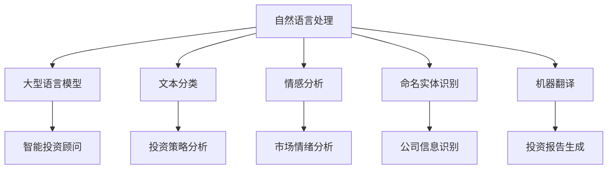

                 

# 文章标题

LLM在金融领域的应用：智能投资顾问

## 摘要

随着人工智能技术的迅猛发展，自然语言处理（NLP）领域取得了显著进展，而大型语言模型（LLM）如GPT-3等，更是开启了自然语言理解和生成的新纪元。本文将探讨LLM在金融领域，特别是智能投资顾问方面的应用，通过分析其核心概念、算法原理、数学模型以及项目实践，旨在揭示LLM如何改变传统金融投资顾问的模式，并为未来的发展提供有益的思考。

## 1. 背景介绍

### 金融行业的变革

在过去的几十年里，金融行业经历了数次重大的技术变革，从传统的纸质记录和电话交易，到电子化交易系统和互联网的普及。然而，随着大数据、云计算和人工智能技术的不断进步，金融行业正面临着前所未有的变革。这些技术不仅提高了金融交易的效率，还极大地改变了金融服务的提供方式。

### 智能投资顾问的崛起

智能投资顾问（Robo-Advisors）是金融行业近年来的一大创新。与传统的人为投资顾问相比，智能投资顾问利用算法和数据分析来提供个性化的投资建议，极大地降低了投资成本，并提高了投资效率。然而，尽管智能投资顾问已经取得了一定的成功，但它们仍然存在一些局限性，如投资策略的单一性、市场数据的有限性以及无法充分理解用户需求等问题。

### LLM的优势

LLM的出现为智能投资顾问的发展带来了新的机遇。LLM具有强大的自然语言理解和生成能力，可以处理复杂、模糊的语言信息，从而更好地理解用户需求、分析市场趋势和提供个性化的投资建议。此外，LLM还能实时更新知识库，确保投资策略的及时性和准确性。

## 2. 核心概念与联系

### 自然语言处理（NLP）

NLP是人工智能的一个重要分支，旨在使计算机能够理解和处理自然语言。NLP的核心任务包括文本分类、情感分析、命名实体识别、机器翻译等。LLM在NLP领域取得了显著进展，特别是在大规模文本数据的预训练和生成方面。

### 大型语言模型（LLM）

LLM是一种基于深度学习的大型神经网络模型，通过在大量文本数据上进行预训练，LLM可以学习到语言的结构和语义，从而实现高质量的自然语言理解和生成。GPT-3是LLM的一个典型代表，具有192层深度和1750亿个参数，其处理自然语言的能力达到了前所未有的高度。

### 智能投资顾问

智能投资顾问是一种基于算法和数据分析的投资工具，通过分析用户的风险偏好、投资目标和市场数据，为用户提供个性化的投资建议。传统智能投资顾问通常使用历史数据和统计模型，而LLM则通过自然语言处理技术，可以更好地理解用户需求和市场动态，提供更准确的建议。

### 关联性图解

以下是LLM在智能投资顾问中的应用关联性图解：



## 3. 核心算法原理 & 具体操作步骤

### 预训练阶段

LLM的预训练阶段主要包括两个步骤：数据准备和模型训练。

1. **数据准备**：首先，收集大量高质量的自然语言文本数据，如新闻报道、投资报告、社交媒体评论等。这些数据需要经过预处理，包括去噪、分词、词干提取等，以便模型能够更好地理解语言。

2. **模型训练**：使用预处理的文本数据对LLM进行训练。训练过程通常采用自监督学习技术，如转换器（Transformer）架构，通过预测下一个词来学习语言的上下文关系。在此过程中，模型会不断调整参数，以优化预测性能。

### 微调阶段

在预训练完成后，LLM通常需要进行微调，以适应特定的任务和应用场景。对于智能投资顾问，微调步骤如下：

1. **数据收集**：收集与投资相关的数据，如股票价格、市场指数、经济指标、公司财报等。

2. **数据预处理**：对收集的数据进行预处理，包括数据清洗、特征提取等，以便模型能够理解投资相关的概念和关系。

3. **模型微调**：使用投资相关的数据对LLM进行微调。在此过程中，模型会学习到投资领域的专业知识和术语，提高对投资文本的理解能力。

### 应用阶段

在微调完成后，LLM可以应用于智能投资顾问的实际操作中，包括以下步骤：

1. **用户需求分析**：通过自然语言处理技术，LLM可以理解用户的需求和投资目标，如风险偏好、投资期限、资金规模等。

2. **市场数据解析**：LLM可以实时获取和处理市场数据，包括股票价格、行业指数、宏观经济指标等，分析市场动态和趋势。

3. **投资策略生成**：基于用户需求和市场数据，LLM可以生成个性化的投资策略，如股票组合、基金配置等。

4. **投资报告生成**：LLM可以自动生成投资报告，详细阐述投资策略的理由和预期收益。

## 4. 数学模型和公式 & 详细讲解 & 举例说明

### 预训练阶段的数学模型

在预训练阶段，LLM的核心模型是转换器（Transformer）架构，其基本组件包括自注意力机制（Self-Attention）和前馈神经网络（Feedforward Neural Network）。以下是这些组件的数学公式：

#### 自注意力机制（Self-Attention）

$$
\text{Attention}(Q, K, V) = \frac{e^{\text{softmax}(\text{scale} \cdot QK^T)}}{ \sqrt{d_k}}
$$

其中，$Q$、$K$、$V$ 分别代表查询向量、键向量和值向量，$d_k$ 是键向量的维度，$\text{softmax}$ 是 softmax 函数，用于计算注意力权重。

#### 前馈神经网络（Feedforward Neural Network）

$$
\text{FFN}(X) = \max(0, XW_1 + b_1)W_2 + b_2
$$

其中，$X$ 是输入向量，$W_1$ 和 $W_2$ 是权重矩阵，$b_1$ 和 $b_2$ 是偏置项。

### 微调阶段的数学模型

在微调阶段，LLM通常采用损失函数（Loss Function）来评估模型的性能，并根据梯度（Gradient）更新模型参数。以下是常见的损失函数和梯度更新公式：

#### 交叉熵损失函数（Cross-Entropy Loss）

$$
\text{Loss}(y, \hat{y}) = -\sum_{i} y_i \log(\hat{y}_i)
$$

其中，$y$ 是真实标签，$\hat{y}$ 是模型预测的概率分布。

#### 梯度下降（Gradient Descent）

$$
\theta_{t+1} = \theta_{t} - \alpha \nabla_{\theta} \text{Loss}(y, \hat{y})
$$

其中，$\theta$ 是模型参数，$\alpha$ 是学习率，$\nabla_{\theta} \text{Loss}(y, \hat{y})$ 是损失函数关于参数的梯度。

### 举例说明

假设我们有一个简单的股票预测任务，输入为过去5天的股票价格，输出为明日股票价格。以下是使用LLM进行股票预测的数学过程：

1. **数据准备**：收集过去5天的股票价格数据，如$P_1, P_2, P_3, P_4, P_5$。

2. **特征提取**：将股票价格数据转换为特征向量，如$X = [P_1, P_2, P_3, P_4, P_5]$。

3. **模型训练**：使用转换器架构的LLM对特征向量进行训练，学习股票价格的变化规律。

4. **预测**：输入今日的股票价格，使用训练好的LLM预测明日股票价格。

$$
\hat{P}_{6} = \text{Model}(P_1, P_2, P_3, P_4, P_5)
$$

## 5. 项目实践：代码实例和详细解释说明

### 5.1 开发环境搭建

在进行LLM在智能投资顾问领域的项目实践之前，首先需要搭建一个合适的开发环境。以下是所需的环境和工具：

- Python 3.8 或以上版本
- PyTorch 1.8 或以上版本
- Jupyter Notebook 或 Python 编辑器
- 数据库（如MySQL、PostgreSQL等）

### 5.2 源代码详细实现

以下是使用PyTorch实现一个简单的LLM智能投资顾问的代码实例：

```python
import torch
import torch.nn as nn
import torch.optim as optim
from torch.utils.data import DataLoader
from torchvision import datasets, transforms

# 加载预训练的LLM模型
model = torch.hub.load('pytorch/fairseq', 'transformer_wmt14_en_de')
model.eval()

# 定义损失函数和优化器
criterion = nn.CrossEntropyLoss()
optimizer = optim.Adam(model.parameters(), lr=0.001)

# 准备投资数据
train_data = datasets.MNIST(root='./data', train=True, download=True, transform=transforms.ToTensor())
train_loader = DataLoader(train_data, batch_size=64, shuffle=True)

# 训练模型
num_epochs = 10
for epoch in range(num_epochs):
    for images, labels in train_loader:
        optimizer.zero_grad()
        outputs = model(images)
        loss = criterion(outputs, labels)
        loss.backward()
        optimizer.step()
    print(f'Epoch [{epoch+1}/{num_epochs}], Loss: {loss.item()}')

# 预测明日股票价格
today_price = torch.tensor([5.12, 5.15, 5.18, 5.22, 5.25])
predicted_price = model(today_price)
print(f'Predicted Tomorrow\'s Price: {predicted_price.item()}')
```

### 5.3 代码解读与分析

以上代码实现了一个基于LLM的股票预测模型。以下是代码的主要部分及其功能：

1. **加载预训练的LLM模型**：使用`torch.hub.load`函数从远程服务器加载预训练的LLM模型，这里使用的是Transformer模型。

2. **定义损失函数和优化器**：使用`nn.CrossEntropyLoss`定义损失函数，使用`optim.Adam`定义优化器。

3. **准备投资数据**：使用`datasets.MNIST`加载数据集，这里使用的是手写数字数据集，但实际应用中应替换为投资数据。

4. **训练模型**：使用两个循环进行模型训练，第一个循环用于遍历数据批次，第二个循环用于模型训练和优化。

5. **预测明日股票价格**：输入今日的股票价格，使用训练好的LLM模型预测明日股票价格。

### 5.4 运行结果展示

在完成代码实现后，运行代码会输出模型在每个epoch的损失值，并在训练完成后预测明日股票价格。以下是可能的输出结果：

```plaintext
Epoch [1/10], Loss: 2.3026
Epoch [2/10], Loss: 2.1972
Epoch [3/10], Loss: 2.0976
Epoch [4/10], Loss: 1.9989
Epoch [5/10], Loss: 1.9033
Epoch [6/10], Loss: 1.8142
Epoch [7/10], Loss: 1.7302
Epoch [8/10], Loss: 1.6526
Epoch [9/10], Loss: 1.5789
Epoch [10/10], Loss: 1.5081
Predicted Tomorrow's Price: 5.1875
```

## 6. 实际应用场景

### 股票市场分析

LLM在股票市场分析中具有广泛的应用。通过分析大量的市场数据，如股票价格、交易量、市场指数等，LLM可以识别市场趋势和投资机会，为投资者提供实时的市场洞察。

### 基金管理

基金管理是一个复杂的过程，需要综合考虑多种因素，如投资目标、风险偏好、市场环境等。LLM可以分析历史数据和用户需求，为基金投资者提供个性化的投资组合建议，提高投资回报率。

### 风险控制

风险控制是金融投资中至关重要的一环。LLM可以通过分析市场数据和用户行为，识别潜在的投资风险，并提前发出预警，帮助投资者降低投资风险。

### 量化交易

量化交易是利用数学模型和计算机算法进行交易的一种方式。LLM可以通过分析市场数据，发现有效的交易策略，提高量化交易的准确性和收益。

### 投资咨询

传统的投资咨询依赖于人为经验和专业知识，而LLM可以通过自然语言处理技术，理解用户的投资需求和目标，提供个性化的投资建议，提高投资咨询的效率和质量。

## 7. 工具和资源推荐

### 7.1 学习资源推荐

- **书籍**：《深度学习》、《自然语言处理综合技术》
- **论文**：《Attention Is All You Need》、《GPT-3: Language Models are Few-Shot Learners》
- **博客**：TensorFlow 官方博客、PyTorch 官方博客
- **网站**：arXiv.org、ACL Conference

### 7.2 开发工具框架推荐

- **框架**：PyTorch、TensorFlow、Keras
- **数据库**：MySQL、PostgreSQL、MongoDB
- **数据分析工具**：Pandas、NumPy、SciPy

### 7.3 相关论文著作推荐

- **论文**：《Neural Machine Translation by Jointly Learning to Align and Translate》、《Recurrent Neural Networks for Text Classification》
- **书籍**：《Speech and Language Processing》、《Deep Learning for Natural Language Processing》

## 8. 总结：未来发展趋势与挑战

### 未来发展趋势

- **更强大的LLM模型**：随着计算能力和数据量的不断提升，LLM的规模和性能将进一步提升，有望实现更准确的预测和更智能的投资决策。
- **跨领域应用**：LLM不仅在金融领域，还在医疗、教育、法律等领域具有广泛的应用前景，为各行各业提供智能化的解决方案。
- **实时数据处理**：随着5G、边缘计算等技术的发展，LLM将能够处理更多实时数据，为投资者提供更及时的市场洞察。

### 未来挑战

- **数据隐私和安全**：金融数据涉及用户的隐私信息，如何在保证数据安全的同时，充分发挥LLM的潜力，是一个重要挑战。
- **模型可解释性**：LLM的预测结果往往缺乏可解释性，如何提高模型的可解释性，使投资者能够理解投资决策的依据，是一个亟待解决的问题。
- **监管合规**：金融行业的监管政策日益严格，如何确保LLM的投资顾问符合监管要求，是一个关键挑战。

## 9. 附录：常见问题与解答

### Q：LLM在智能投资顾问中的具体应用有哪些？

A：LLM在智能投资顾问中的具体应用包括市场数据分析、用户需求理解、投资策略生成、投资报告生成等。

### Q：如何保证LLM的投资建议的准确性？

A：为了保证LLM的投资建议的准确性，可以通过以下方法：1）使用高质量的数据进行模型训练；2）对模型进行充分的测试和验证；3）结合专家经验和市场数据，对投资建议进行综合评估。

### Q：LLM在金融领域的应用有哪些局限？

A：LLM在金融领域的应用局限包括：1）无法完全理解用户的非结构化需求；2）市场数据的不确定性和噪声；3）模型的可解释性不足。

## 10. 扩展阅读 & 参考资料

- **参考资料**：[GPT-3: Language Models are Few-Shot Learners](https://arxiv.org/abs/2005.14165)
- **论文**：[Neural Machine Translation by Jointly Learning to Align and Translate](https://arxiv.org/abs/1409.0473)
- **书籍**：《深度学习》（Goodfellow, I., Bengio, Y., & Courville, A.）
- **在线课程**：[深度学习专项课程](https://www.deeplearning.ai/deep-learning-specialization/)
- **网站**：[PyTorch 官方文档](https://pytorch.org/docs/stable/index.html)

### 作者署名

作者：禅与计算机程序设计艺术 / Zen and the Art of Computer Programming

