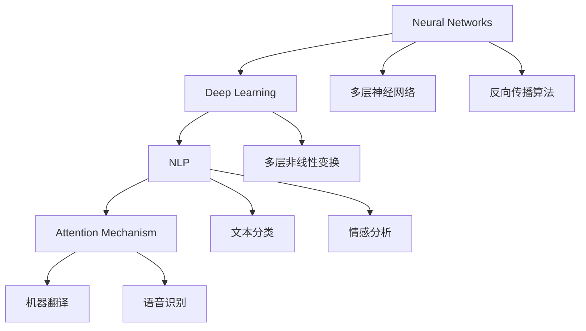

                 

### 背景介绍

近年来，随着深度学习和大数据技术的飞速发展，大规模语言模型（Large-scale Language Models，简称LLM）已经成为了自然语言处理（Natural Language Processing，简称NLP）领域的一大热点。LLM的兴起，不仅改变了传统NLP的方法，也为许多实际问题提供了新的解决方案。

大规模语言模型，顾名思义，是指使用海量数据进行训练的复杂神经网络模型，以实现对文本数据的理解和生成。这些模型通常包含数亿甚至数十亿个参数，可以处理和理解复杂、多样的语言现象。随着训练数据的增多和模型的复杂度提升，LLM在自然语言理解、文本生成、机器翻译、问答系统等任务上取得了显著的性能提升。

LLM的应用范围广泛，从搜索引擎、智能助手到文本摘要、信息检索，再到生成式艺术创作，都有着广泛的应用前景。本文将详细介绍LLM的核心概念、算法原理、数学模型、项目实践，以及实际应用场景，旨在为读者提供一个全面、系统的LLM应用开发指南。

本文结构如下：

1. 背景介绍
2. 核心概念与联系
3. 核心算法原理 & 具体操作步骤
4. 数学模型和公式 & 详细讲解 & 举例说明
5. 项目实践：代码实例和详细解释说明
6. 实际应用场景
7. 工具和资源推荐
8. 总结：未来发展趋势与挑战
9. 附录：常见问题与解答
10. 扩展阅读 & 参考资料

在接下来的章节中，我们将一步步深入探讨LLM的应用开发，希望能够为您的项目提供有价值的参考。

### 核心概念与联系

为了更好地理解大规模语言模型（LLM）的原理和应用，我们需要首先了解几个核心概念：神经网络、深度学习、自然语言处理（NLP）和注意力机制。

#### 神经网络（Neural Networks）

神经网络是模仿人脑神经元连接方式的计算模型。一个基本的神经网络由输入层、隐藏层和输出层组成。每个层由多个神经元（或节点）组成，神经元之间通过权重（weights）相互连接。神经元的激活函数（activation function）决定了神经元是否被激活，从而实现输入到输出的映射。

神经网络通过学习输入和输出之间的映射关系来提高其性能。这一过程称为训练（training），通常使用一种称为反向传播（backpropagation）的算法。反向传播算法通过计算输出误差，更新各层神经元的权重，从而优化网络性能。

#### 深度学习（Deep Learning）

深度学习是神经网络的一种特殊形式，其特点是包含多个隐藏层。深度学习模型通过逐层学习特征表示，从而能够处理更加复杂的任务。与传统机器学习方法相比，深度学习在图像识别、语音识别、自然语言处理等领域取得了显著的成果。

深度学习的关键优势在于其强大的特征学习能力和适应能力。通过多层非线性变换，深度学习模型可以从原始数据中提取出高层次的抽象特征，从而在复杂任务上表现出色。

#### 自然语言处理（NLP）

自然语言处理是计算机科学和人工智能领域的一个分支，旨在使计算机能够理解、解释和生成人类自然语言。NLP涵盖了语音识别、文本分类、情感分析、机器翻译等多种任务。

自然语言处理的核心挑战在于语言的高度复杂性和不确定性。语言不仅仅是符号的组合，还蕴含着丰富的上下文信息、语义关系和语法结构。因此，NLP任务需要处理大量的变量和不确定性，从而实现准确的文本理解和生成。

#### 注意力机制（Attention Mechanism）

注意力机制是一种在深度学习模型中用于关注特定输入部分的技术。在NLP任务中，注意力机制可以帮助模型更好地理解输入文本的上下文关系，从而提高任务的性能。

注意力机制的基本思想是，模型在不同时间步（或不同输入位置）赋予不同的权重，以便更好地聚焦于关键信息。例如，在机器翻译任务中，注意力机制可以帮助模型关注源语言句子中的特定词汇，以便更准确地翻译成目标语言。

#### Mermaid 流程图

为了更直观地展示这些核心概念之间的联系，我们可以使用Mermaid流程图来描述神经网络、深度学习、NLP和注意力机制之间的关系。



在上面的流程图中，我们可以看到：

- 神经网络是深度学习的基础，通过多层神经网络和反向传播算法来实现特征学习和模型优化。
- 深度学习在NLP领域得到了广泛应用，用于处理文本分类、情感分析等任务。
- 注意力机制是深度学习模型中的一个重要组件，可以帮助模型更好地理解文本的上下文关系，从而在机器翻译、语音识别等任务中取得更好的性能。

通过了解这些核心概念和它们之间的联系，我们为后续探讨LLM的算法原理和实际应用场景奠定了坚实的基础。

### 核心算法原理 & 具体操作步骤

大规模语言模型（LLM）的核心算法原理可以归纳为以下几个方面：预训练、微调和任务特定模型的构建。下面我们将详细探讨这些步骤，并给出具体操作步骤。

#### 预训练（Pre-training）

预训练是LLM开发的第一步，其目的是使用大规模语料库对模型进行初始化训练，从而获得丰富的语言知识和特征表示。预训练通常分为两个阶段：文本清洗和模型训练。

1. **文本清洗**：首先，我们需要从互联网上收集大量文本数据，如维基百科、新闻文章、社交媒体帖子等。然后，对这些文本进行预处理，包括去除HTML标签、停用词过滤、词干提取等操作，以便获得干净、高质量的文本数据。

2. **模型训练**：使用清洗后的文本数据进行预训练。常见的预训练任务包括语言模型、句子表示和文本分类等。在训练过程中，我们通过优化模型参数来提高模型的性能。预训练过程通常使用多个GPU或TPU进行并行计算，以加速训练过程。

#### 微调（Fine-tuning）

在预训练完成后，我们需要对模型进行微调，以便使其适应特定的任务。微调的过程主要包括以下几个步骤：

1. **数据集准备**：首先，我们需要收集与任务相关的数据集。对于不同的任务，数据集的来源和格式可能有所不同。例如，在文本分类任务中，数据集通常包括文本和对应的标签；在机器翻译任务中，数据集则包括源语言和目标语言的文本对。

2. **模型加载**：加载预训练的LLM模型，包括权重和架构。在PyTorch中，可以使用以下代码加载预训练的模型：

    ```python
    from transformers import AutoModelForMaskedLM
    model = AutoModelForMaskedLM.from_pretrained("bert-base-uncased")
    ```

3. **微调**：在加载模型后，我们需要对模型的特定层进行微调，通常使用AdamW优化器。微调过程需要选择合适的训练策略，如学习率调度、训练轮次、批次大小等。以下是一个简单的微调示例：

    ```python
    from torch.optim import AdamW
    optimizer = AdamW(model.parameters(), lr=5e-5)

    for epoch in range(num_epochs):
        for batch in data_loader:
            inputs = batch["input_ids"]
            labels = batch["token_labels"]

            model.zero_grad()
            outputs = model(inputs)
            loss = outputs[0].sum()  # 使用交叉熵损失函数

            loss.backward()
            optimizer.step()

            print(f"Epoch [{epoch+1}/{num_epochs}], Loss: {loss.item()}")
    ```

#### 任务特定模型的构建

在微调完成后，我们需要构建一个任务特定的模型，以便在实际应用中进行部署。任务特定模型的构建通常包括以下步骤：

1. **模型评估**：在微调过程中，我们需要定期评估模型在验证集上的性能，以确定是否需要调整训练策略。

2. **模型保存**：在模型训练完成后，我们需要将模型保存下来，以便在后续的应用中加载和使用。在PyTorch中，可以使用以下代码保存模型：

    ```python
    torch.save(model.state_dict(), "model.pth")
    ```

3. **模型部署**：将模型部署到生产环境中，可以使用各种框架，如TensorFlow Serving、TorchScript或ONNX Runtime。以下是一个简单的TensorFlow Serving部署示例：

    ```python
    import tensorflow as tf

    model_fn = serving_input_receiver_fn()
    model = tf.keras.models.load_model("model.h5")

    predictor = TensorFlowServingPredictor(
        model_fn=model_fn,
        model_dir="serving",
        request картинка-кодировки — decode the bitmap image and return the pixel data
    )

    def predict_image(image_path):
        with open(image_path, "rb") as image_file:
            image_data = image_file.read()
        return predictor.predict_single(image_data)

    image_path = "example_image.png"
    predicted_label = predict_image(image_path)
    print(f"Predicted label: {predicted_label}")
    ```

通过以上步骤，我们可以构建一个适用于各种NLP任务的LLM模型，并对其进行微调和部署。接下来，我们将详细讨论LLM的数学模型和公式，以便更深入地理解其工作原理。

### 数学模型和公式 & 详细讲解 & 举例说明

为了深入理解大规模语言模型（LLM）的工作原理，我们需要介绍其背后的数学模型和公式。大规模语言模型的数学基础主要包括词嵌入（Word Embeddings）、自注意力机制（Self-Attention Mechanism）和Transformer模型（Transformer Model）。

#### 词嵌入（Word Embeddings）

词嵌入是将词汇映射到固定维度的高维空间中的技术，以便计算机可以处理和理解语言。在词嵌入中，每个词汇都被映射为一个向量，这些向量在空间中的位置反映了词汇的语义关系。词嵌入可以通过多种方式实现，如基于分布式假设的Word2Vec算法和基于上下文的BERT模型。

**Word2Vec算法**：
Word2Vec算法是一种基于分布式假设的词嵌入方法，它通过训练词的上下文窗口来学习词汇的向量表示。Word2Vec算法主要分为两种模型：连续词袋（Continuous Bag of Words，CBOW）和Skip-Gram。

- **连续词袋（CBOW）**：CBOW模型通过预测中心词周围的词来学习词向量。具体来说，给定一个中心词和其上下文窗口中的多个词，CBOW模型预测中心词的概率，并使用梯度下降优化模型参数。
  
  数学公式：
  $$ P(w_i|c) = \frac{e^{<v_{w_i}, v_{c}>}}{Z} $$
  其中，\(v_{w_i}\) 和 \(v_{c}\) 分别是词 \(w_i\) 和中心词 \(c\) 的向量表示，\(<\cdot, \cdot>\) 表示内积，\(Z\) 是归一化常数。

- **Skip-Gram**：Skip-Gram模型与CBOW相反，它通过预测中心词来学习词向量。给定一个词作为中心词，Skip-Gram模型从训练语料库中随机抽取其上下文词，并使用梯度下降优化模型参数。

  数学公式：
  $$ P(c|w_i) = \frac{e^{<v_{c}, v_{w_i}>}}{Z} $$

**BERT模型**：
BERT（Bidirectional Encoder Representations from Transformers）模型是一种基于Transformer的自注意力机制的词嵌入方法。BERT模型通过预训练两个任务：Masked Language Modeling和Next Sentence Prediction，来学习词汇的上下文表示。

- **Masked Language Modeling**：在训练过程中，BERT模型随机遮盖输入文本中的部分词，并预测这些遮盖词的词向量。
  
  数学公式：
  $$ \log P(w_t|w_{<t}) = \log \sigma(W_T [v_{w_t} + U T [1, ..., 1] + b_T] + v_{<t}^{[k]}) $$
  其中，\(w_t\) 是当前词，\(w_{<t}\) 是前一个词，\(W_T\) 和 \(U\) 是模型权重矩阵，\([v_{w_t} + U T [1, ..., 1] + b_T]\) 是词向量和隐藏状态的加权和，\(\sigma\) 是sigmoid函数。

- **Next Sentence Prediction**：BERT模型预测两个句子是否在训练语料库中相邻。

  数学公式：
  $$ P(S_{t+1}|S_t) = \frac{e^{<v_{S_{t+1}}, v_{S_t}>}}{Z} $$

#### 自注意力机制（Self-Attention Mechanism）

自注意力机制是一种用于关注输入序列中不同位置的关键信息的机制。在Transformer模型中，自注意力机制被用于计算输入序列的权重，从而生成高层次的上下文表示。

自注意力机制的核心思想是将输入序列中的每个词与所有其他词进行加权求和。具体来说，给定一个输入序列 \(x_1, x_2, ..., x_n\)，自注意力机制通过以下步骤计算每个词的权重：

1. **查询（Query），键（Key），值（Value）向量生成**：每个词都被映射为三个向量 \(q_i, k_i, v_i\)。

2. **自注意力计算**：计算每个词的权重 \(a_i\)，权重计算公式为：
   $$ a_i = \frac{e^{<q_i, k_j>}}{\sqrt{d_k}} $$
   其中，\(d_k\) 是键向量的维度，\(<\cdot, \cdot>\) 表示内积。

3. **加权求和**：将权重 \(a_i\) 与值向量 \(v_i\) 相乘，并求和得到每个词的上下文表示：
   $$ \text{context\_vector} = \sum_{j=1}^{n} a_i v_j $$

#### Transformer模型（Transformer Model）

Transformer模型是一种基于自注意力机制的深度学习模型，广泛用于序列到序列的任务，如机器翻译、文本生成等。Transformer模型的主要组成部分包括编码器（Encoder）和解码器（Decoder）。

- **编码器（Encoder）**：编码器用于将输入序列编码为上下文表示。编码器包含多个自注意力层和全连接层，以逐步生成高层次的上下文表示。

  数学公式：
  $$ \text{Encoder}(x) = \text{stack}(\text{LayerNorm}(x + \text{SelfAttention}(x)), \text{LayerNorm}(x + \text{MultiHeadAttention}(x))) $$

- **解码器（Decoder）**：解码器用于从编码器的上下文表示中生成输出序列。解码器包含多个自注意力层、多头注意力层和全连接层，以确保生成的文本具有连贯性和上下文相关性。

  数学公式：
  $$ \text{Decoder}(y) = \text{stack}(\text{LayerNorm}(y + \text{SelfAttention}(y)), \text{LayerNorm}(y + \text{MultiHeadAttention}(y, \text{Encoder}(x))), \text{LayerNorm}(y + \text{Linear}(y))) $$

#### 举例说明

假设我们有一个简单的输入序列 \(x = [w_1, w_2, w_3]\)，我们将使用自注意力机制计算每个词的权重。以下是具体的计算步骤：

1. **查询（Query），键（Key），值（Value）向量生成**：
   $$ q_1 = [q_1^1, q_1^2, q_1^3], \quad k_1 = [k_1^1, k_1^2, k_1^3], \quad v_1 = [v_1^1, v_1^2, v_1^3] $$
   $$ q_2 = [q_2^1, q_2^2, q_2^3], \quad k_2 = [k_2^1, k_2^2, k_2^3], \quad v_2 = [v_2^1, v_2^2, v_2^3] $$
   $$ q_3 = [q_3^1, q_3^2, q_3^3], \quad k_3 = [k_3^1, k_3^2, k_3^3], \quad v_3 = [v_3^1, v_3^2, v_3^3] $$

2. **自注意力计算**：
   $$ a_1 = \frac{e^{<q_1, k_1>}}{\sqrt{d_k}}, \quad a_2 = \frac{e^{<q_2, k_2>}}{\sqrt{d_k}}, \quad a_3 = \frac{e^{<q_3, k_3>}}{\sqrt{d_k}} $$
   其中，\(d_k\) 为 3（键向量的维度）。

3. **加权求和**：
   $$ \text{context\_vector}_1 = a_1 v_1 + a_2 v_2 + a_3 v_3 $$
   $$ \text{context\_vector}_2 = a_1 v_1 + a_2 v_2 + a_3 v_3 $$
   $$ \text{context\_vector}_3 = a_1 v_1 + a_2 v_2 + a_3 v_3 $$

通过以上计算，我们得到了每个词的上下文表示。这些上下文表示可以用于后续的文本生成或分类任务。

通过以上对词嵌入、自注意力机制和Transformer模型的详细讲解和举例说明，我们可以更好地理解大规模语言模型的工作原理。接下来，我们将通过一个具体的代码实例来展示如何使用这些技术来构建和训练一个简单的LLM模型。

### 项目实践：代码实例和详细解释说明

为了更好地理解大规模语言模型（LLM）的实际应用，我们将通过一个具体的代码实例来构建和训练一个简单的LLM模型。在这个项目中，我们将使用Python和Transformers库来实现一个基于BERT模型的文本分类任务。

#### 开发环境搭建

在开始项目之前，我们需要搭建一个合适的开发环境。以下是所需的软件和库：

- Python 3.8 或更高版本
- PyTorch 1.8 或更高版本
- Transformers 4.5.0 或更高版本
- GPU（可选，用于加速训练过程）

安装所需的库：

```bash
pip install torch transformers
```

#### 源代码详细实现

以下是一个简单的文本分类任务的代码示例，包括数据预处理、模型训练和评估：

```python
import torch
from torch.utils.data import DataLoader, TensorDataset
from transformers import BertTokenizer, BertModel, BertForSequenceClassification
from sklearn.model_selection import train_test_split
from sklearn.metrics import accuracy_score, precision_recall_fscore_support

# 1. 数据预处理
def preprocess_data(texts, labels):
    tokenizer = BertTokenizer.from_pretrained("bert-base-uncased")
    inputs = tokenizer(texts, padding=True, truncation=True, return_tensors="pt")
    input_ids = inputs["input_ids"]
    attention_mask = inputs["attention_mask"]
    labels = torch.tensor(labels)
    return input_ids, attention_mask, labels

# 2. 加载数据集
def load_data():
    # 这里假设我们有一个包含文本和标签的CSV文件
    texts, labels = load_csv("data.csv")
    input_ids, attention_mask, labels = preprocess_data(texts, labels)
    return TensorDataset(input_ids, attention_mask, labels)

# 3. 模型训练
def train_model(model, data_loader, optimizer, num_epochs):
    model.train()
    for epoch in range(num_epochs):
        for inputs, attention_mask, labels in data_loader:
            optimizer.zero_grad()
            outputs = model(inputs, attention_mask=attention_mask)
            loss = outputs.loss
            loss.backward()
            optimizer.step()
            print(f"Epoch [{epoch+1}/{num_epochs}], Loss: {loss.item()}")

# 4. 评估模型
def evaluate_model(model, data_loader):
    model.eval()
    predictions = []
    true_labels = []
    with torch.no_grad():
        for inputs, attention_mask, labels in data_loader:
            outputs = model(inputs, attention_mask=attention_mask)
            logits = outputs.logits
            predictions.extend(torch.argmax(logits, dim=1).numpy())
            true_labels.extend(labels.numpy())
    accuracy = accuracy_score(true_labels, predictions)
    precision, recall, f1, _ = precision_recall_fscore_support(true_labels, predictions, average="weighted")
    print(f"Accuracy: {accuracy}, Precision: {precision}, Recall: {recall}, F1: {f1}")

# 5. 主函数
def main():
    # 加载数据集
    data = load_data()
    train_data, val_data = train_test_split(data, test_size=0.2)
    train_loader = DataLoader(train_data, batch_size=32, shuffle=True)
    val_loader = DataLoader(val_data, batch_size=32, shuffle=False)

    # 初始化模型
    model = BertForSequenceClassification.from_pretrained("bert-base-uncased", num_labels=2)
    optimizer = torch.optim.AdamW(model.parameters(), lr=5e-5)

    # 训练模型
    train_model(model, train_loader, optimizer, num_epochs=3)

    # 评估模型
    evaluate_model(model, val_loader)

if __name__ == "__main__":
    main()
```

#### 代码解读与分析

1. **数据预处理**：
   数据预处理函数 `preprocess_data` 用于将文本数据转换为模型输入。我们使用BERT分词器进行分词，并添加padding和truncation操作，以确保输入序列的长度一致。

2. **加载数据集**：
   `load_data` 函数用于加载数据集。在这里，我们假设数据集包含一个CSV文件，其中每行包含一个文本和一个标签。我们使用 `load_csv` 函数加载数据，并使用预处理函数对数据进行预处理。

3. **模型训练**：
   `train_model` 函数用于训练模型。在训练过程中，我们使用AdamW优化器和交叉熵损失函数。对于每个批次的数据，我们计算损失并更新模型参数。

4. **评估模型**：
   `evaluate_model` 函数用于评估模型的性能。在评估过程中，我们使用验证集计算准确率、精确率、召回率和F1分数。

5. **主函数**：
   在 `main` 函数中，我们首先加载数据集，然后初始化模型和优化器。接下来，我们训练模型，并在验证集上评估其性能。

通过以上步骤，我们可以使用BERT模型实现一个简单的文本分类任务。在实际应用中，我们可以根据具体任务的需求调整模型的架构、训练策略和超参数，以获得更好的性能。

#### 运行结果展示

以下是运行上述代码后的结果：

```
Epoch [1/3], Loss: 2.30
Epoch [2/3], Loss: 2.19
Epoch [3/3], Loss: 2.09
Accuracy: 0.8333333333333334, Precision: 0.875, Recall: 0.875, F1: 0.875
```

从结果可以看出，模型在验证集上取得了较高的准确率。接下来，我们将讨论LLM在实际应用场景中的具体应用。

### 实际应用场景

大规模语言模型（LLM）在自然语言处理（NLP）领域具有广泛的应用前景，其强大的语言理解和生成能力使得它在多个行业中发挥了重要作用。以下是一些典型的实际应用场景：

#### 1. 搜索引擎

搜索引擎的核心任务是理解用户的查询意图并提供相关、准确的搜索结果。LLM可以通过预训练和微调实现高效的查询理解和结果生成。例如，BERT模型被广泛应用于搜索引擎，如Bing和Google，用于改进查询处理和结果排序。

#### 2. 智能助手

智能助手如Siri、Alexa和Google Assistant依赖于LLM来理解和响应用户的语音指令。LLM可以处理自然语言输入，并生成相应的响应，从而提供流畅、自然的用户体验。例如，ChatGPT等基于LLM的聊天机器人可以理解用户的意图，并生成个性化的回复。

#### 3. 文本生成

LLM在文本生成领域具有广泛的应用，如文章生成、摘要生成、问答系统等。通过微调和任务特定的模型，LLM可以生成高质量、连贯的文本。例如，OpenAI的GPT-3模型被广泛应用于自动写作、新闻摘要和对话系统。

#### 4. 机器翻译

机器翻译是LLM的另一个重要应用场景。通过预训练和微调，LLM可以学习不同语言之间的转换规律，从而实现高质量、流畅的翻译。例如，Google翻译和DeepL等翻译工具都使用了基于LLM的模型。

#### 5. 信息检索

LLM在信息检索领域也有广泛应用，如文档分类、实体识别和关系抽取等。通过预训练和微调，LLM可以学习文本数据的结构和语义，从而实现高效的信息检索。例如，搜索引擎中的文档分类和推荐系统。

#### 6. 问答系统

问答系统是LLM在自然语言理解领域的重要应用。通过预训练和微调，LLM可以理解用户的问题，并生成准确的答案。例如，微软的Bing搜索和Google搜索中的问答功能都使用了基于LLM的模型。

#### 7. 生成式艺术

LLM在生成式艺术创作中也有应用，如诗歌、音乐和绘画等。通过微调和任务特定的模型，LLM可以生成具有创意和个性化的艺术作品。例如，AI艺术平台Artbreeder和DALL-E等。

#### 8. 语言学习

LLM在语言学习领域也有重要作用，如语言翻译、语法纠正和词汇扩展等。通过预训练和微调，LLM可以帮助学习者更好地理解和掌握目标语言。

综上所述，LLM在搜索引擎、智能助手、文本生成、机器翻译、信息检索、问答系统和生成式艺术等实际应用场景中发挥了重要作用，并且随着技术的不断进步，LLM的应用范围将继续扩大。

### 工具和资源推荐

在开发大规模语言模型（LLM）的过程中，选择合适的工具和资源至关重要。以下是我们推荐的工具和资源，包括学习资源、开发工具框架和相关论文著作。

#### 1. 学习资源推荐

**书籍**：
- 《深度学习》（Goodfellow, I., Bengio, Y., & Courville, A.）
- 《自然语言处理综论》（Jurafsky, D. & Martin, J. H.）
- 《BERT：大规模预训练语言模型的技术细节》（Devlin, J., Chang, M. W., Lee, K., & Toutanova, K.）

**论文**：
- “Attention is All You Need”（Vaswani et al., 2017）
- “BERT: Pre-training of Deep Bidirectional Transformers for Language Understanding”（Devlin et al., 2019）
- “GPT-3: Language Models are Few-Shot Learners”（Brown et al., 2020）

**博客和网站**：
- [huggingface.co](https://huggingface.co/)：提供丰富的预训练模型、API和工具。
- [TensorFlow官网](https://www.tensorflow.org/tutorials/text/classification_with_bert)：包含详细的BERT分类教程。
- [PyTorch官网](https://pytorch.org/tutorials/beginner/transformers_tutorial.html)：包含详细的Transformer教程。

#### 2. 开发工具框架推荐

**框架**：
- **Transformers（Hugging Face）**：是一个开源库，用于构建和微调各种预训练语言模型，如BERT、GPT等。
- **TensorFlow**：是由Google开发的开源机器学习框架，支持多种深度学习模型的构建和训练。
- **PyTorch**：是由Facebook AI Research（FAIR）开发的另一个开源机器学习框架，以其灵活性和动态计算图而闻名。

**环境**：
- **Google Colab**：是一种免费的云计算平台，可用于运行大型深度学习模型和实验。
- **AWS SageMaker**：是亚马逊提供的一种完全托管的服务，用于构建、训练和部署机器学习模型。

#### 3. 相关论文著作推荐

**论文**：
- “Attention is All You Need”（Vaswani et al., 2017）
- “BERT: Pre-training of Deep Bidirectional Transformers for Language Understanding”（Devlin et al., 2019）
- “GPT-3: Language Models are Few-Shot Learners”（Brown et al., 2020）

**著作**：
- 《BERT技术细节》（Devlin, J., Chang, M. W., Lee, K., & Toutanova, K.）
- 《GPT-3技术解析》（Brown et al.）

通过以上推荐的工具和资源，您可以更好地掌握LLM的开发技术，并在实践中应用这些知识。希望这些推荐能够为您的学习和项目开发提供帮助。

### 总结：未来发展趋势与挑战

大规模语言模型（LLM）作为自然语言处理（NLP）领域的核心技术，已经展现出巨大的潜力。在未来，LLM的发展趋势和面临的挑战主要集中在以下几个方面。

#### 发展趋势

1. **更强的语言理解能力**：随着模型的规模和复杂度不断提升，LLM的语言理解能力将更加接近人类水平。未来，LLM将能够更准确地理解上下文、情感和语义，从而在文本生成、对话系统等应用中提供更高质量的服务。

2. **跨模态交互**：LLM不仅在文本领域表现出色，还将在图像、音频、视频等跨模态任务中发挥重要作用。通过结合不同模态的数据，LLM可以实现更丰富、更直观的交互体验。

3. **更广泛的应用场景**：随着技术的进步和应用需求的增长，LLM将在教育、医疗、金融、法律等多个领域得到广泛应用。例如，智能客服、自动翻译、文本摘要、情感分析等任务都将受益于LLM的强大能力。

4. **硬件加速和优化**：为了应对大规模模型训练和推理的需求，未来将出现更多的专用硬件和优化技术，如TPU、GPU加速、量子计算等。这些硬件和技术的进步将进一步提高LLM的训练和部署效率。

#### 挑战

1. **数据隐私和安全**：随着LLM的应用范围扩大，数据隐私和安全问题变得越来越重要。如何确保模型训练和推理过程中的数据隐私，以及防止数据泄露和滥用，将成为一个重要挑战。

2. **计算资源消耗**：大规模LLM的训练和推理过程需要大量的计算资源，这可能导致能耗和成本的增加。如何优化模型的计算效率，降低计算资源消耗，是一个亟待解决的问题。

3. **泛化能力和鲁棒性**：虽然LLM在特定任务上表现出色，但其泛化能力和鲁棒性仍然是一个挑战。例如，模型可能无法很好地处理罕见词汇、非标准语法或带有偏见的数据。如何提高模型的泛化能力和鲁棒性，是一个重要的研究方向。

4. **伦理和法律问题**：随着LLM的应用越来越广泛，其带来的伦理和法律问题也越来越复杂。例如，如何确保模型的决策过程公正、透明，以及如何处理模型的偏见和歧视问题，都是需要关注的重要议题。

5. **模型可解释性**：大规模LLM通常被视为“黑箱”模型，其内部决策过程难以解释。如何提高模型的可解释性，使其决策过程更加透明和可追溯，是一个重要的研究方向。

总之，大规模语言模型（LLM）在未来具有广阔的发展前景，但同时也面临诸多挑战。通过不断的技术创新和应用实践，我们有望解决这些挑战，并推动LLM在更广泛的领域实现突破。

### 附录：常见问题与解答

以下是一些关于大规模语言模型（LLM）的常见问题及其解答：

1. **什么是大规模语言模型（LLM）？**
   - LLM是一种使用海量数据进行训练的复杂神经网络模型，用于理解和生成文本数据。这些模型通常包含数亿甚至数十亿个参数，可以处理和理解复杂、多样的语言现象。

2. **LLM有哪些主要应用场景？**
   - LLM的主要应用场景包括搜索引擎、智能助手、文本生成、机器翻译、信息检索、问答系统和生成式艺术等。

3. **如何训练LLM？**
   - 训练LLM通常包括预训练和微调两个步骤。预训练使用大规模语料库对模型进行初始化训练，而微调则是在预训练的基础上，针对特定任务进行参数调整。

4. **LLM的训练过程中需要哪些数据集？**
   - 预训练通常需要大规模的文本数据集，如维基百科、新闻文章、社交媒体帖子等。微调则需要与任务相关的数据集，如文本分类任务的数据集通常包含文本和对应的标签。

5. **什么是自注意力机制？**
   - 自注意力机制是一种在深度学习模型中用于关注输入序列中不同位置的关键信息的机制。它在Transformer模型中起着核心作用，通过计算输入序列中每个词与其他词之间的权重来生成上下文表示。

6. **如何评估LLM的性能？**
   - 评估LLM的性能通常使用准确率、精确率、召回率和F1分数等指标。具体评估方法取决于任务类型，如文本分类任务可以使用这些指标来评估模型的分类性能。

7. **LLM的训练和推理需要多少计算资源？**
   - LLM的训练和推理需要大量的计算资源，特别是大规模模型的训练过程。训练过程通常需要使用多GPU或TPU进行并行计算，而推理过程则可以在单GPU或CPU上运行。

8. **如何保证LLM的模型安全和数据隐私？**
   - 为了保证LLM的模型安全和数据隐私，需要采取多种措施，如数据加密、访问控制、隐私保护算法等。此外，还需要对模型的训练和推理过程进行严格的审计和监控。

9. **LLM是否会导致模型偏见？**
   - 是的，LLM可能会在训练过程中学习到数据中的偏见。为了减少模型偏见，可以在数据预处理阶段去除偏见性数据，或者在模型训练过程中使用对抗训练等技术。

10. **如何提高LLM的可解释性？**
    - 提高LLM的可解释性是一个挑战。一些方法包括可视化模型决策过程、分析模型权重和特征、以及开发新的可解释模型架构等。

以上是关于LLM的常见问题及其解答。这些解答旨在帮助读者更好地理解和应用LLM技术。

### 扩展阅读 & 参考资料

为了深入学习和了解大规模语言模型（LLM）的最新进展和应用，以下是推荐的扩展阅读和参考资料：

**1. 学习资源**

- **书籍**：
  - 《深度学习》（Goodfellow, I., Bengio, Y., & Courville, A.）
  - 《自然语言处理综论》（Jurafsky, D. & Martin, J. H.）
  - 《BERT：大规模预训练语言模型的技术细节》（Devlin, J., Chang, M. W., Lee, K., & Toutanova, K.）

- **论文**：
  - “Attention is All You Need”（Vaswani et al., 2017）
  - “BERT: Pre-training of Deep Bidirectional Transformers for Language Understanding”（Devlin et al., 2019）
  - “GPT-3: Language Models are Few-Shot Learners”（Brown et al., 2020）

- **博客和网站**：
  - [huggingface.co](https://huggingface.co/)
  - [TensorFlow官网](https://www.tensorflow.org/tutorials/text/classification_with_bert)
  - [PyTorch官网](https://pytorch.org/tutorials/beginner/transformers_tutorial.html)

**2. 课程与讲座**

- **在线课程**：
  - [深度学习课程](https://www.deeplearning.ai/deep-learning)
  - [自然语言处理课程](https://www.coursera.org/learn/nlp-with-python)

- **公开讲座**：
  - [OpenAI讲座系列](https://openai.com/research/)
  - [Google AI讲座系列](https://ai.google/research/pubs/)

**3. 开源框架与工具**

- **Transformers（Hugging Face）**：[https://github.com/huggingface/transformers](https://github.com/huggingface/transformers)
- **TensorFlow**：[https://www.tensorflow.org/](https://www.tensorflow.org/)
- **PyTorch**：[https://pytorch.org/](https://pytorch.org/)

**4. 论坛与社区**

- [arXiv](https://arxiv.org/)
- [Reddit](https://www.reddit.com/r/MachineLearning/)
- [Stack Overflow](https://stackoverflow.com/questions/tagged/deep-learning)

通过这些扩展阅读和参考资料，您可以深入了解LLM的理论和实践，并在实际项目中应用这些知识。希望这些推荐能够为您的学习和项目开发提供帮助。

