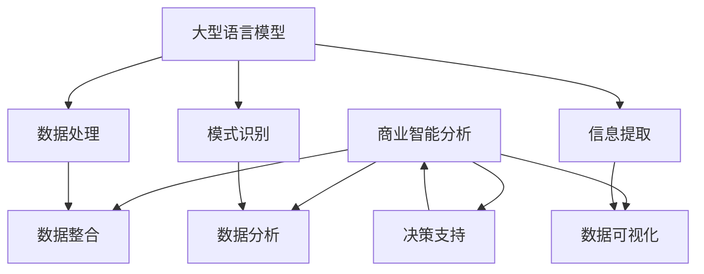

                 

### 文章标题：LLM对传统商业智能分析的革新

#### 关键词： 
- 大型语言模型 (LLM)
- 商业智能分析
- 数据分析
- 人工智能
- 传统商业智能

#### 摘要：
本文将探讨大型语言模型（LLM）如何革新传统商业智能分析。通过分析LLM的核心概念、算法原理和数学模型，我们将揭示LLM在数据处理、模式识别和信息提取等方面的巨大潜力。此外，还将结合具体项目实例，展示LLM在商业智能领域的应用场景，并展望其未来发展。

### 1. 背景介绍

#### 商业智能分析的定义与现状

商业智能分析（Business Intelligence Analysis，简称BIA）是指利用数据分析技术和方法，从海量数据中提取有价值的信息，以支持企业的决策过程。传统的商业智能分析主要依赖于数据仓库、在线分析处理（OLAP）和数据挖掘等技术，旨在实现数据整合、数据分析和数据可视化。

然而，随着大数据时代的到来，传统商业智能分析面临着诸多挑战。首先，数据量的爆炸式增长导致数据处理成本上升，传统的数据仓库技术难以满足高效处理需求。其次，数据源的种类和格式日益多样化，传统方法难以处理非结构化数据。最后，商业智能分析的需求越来越个性化，传统方法难以实现灵活、实时的数据分析。

#### 大型语言模型的出现

大型语言模型（Large Language Model，简称LLM）是近年来人工智能领域的重要突破。LLM通过深度学习技术，在大量文本数据上进行预训练，从而获得对自然语言的强大理解能力。LLM的出现为商业智能分析带来了新的机遇。首先，LLM能够处理海量、多样化的数据，包括文本、图片、音频等多种类型。其次，LLM具有强大的模式识别和信息提取能力，可以快速从数据中提取有价值的信息。最后，LLM可以实现实时数据分析，满足个性化、实时的商业智能需求。

本文将围绕LLM在商业智能分析中的应用，探讨其核心概念、算法原理和数学模型，并通过具体项目实例展示其应用效果。希望通过本文的探讨，为读者揭示LLM在商业智能分析领域的巨大潜力，为未来商业智能的发展提供新的思路。

### 2. 核心概念与联系

#### 大型语言模型的核心概念

大型语言模型（LLM）是一种基于深度学习的自然语言处理模型，其核心概念包括以下几个方面：

1. **预训练（Pre-training）**：LLM通过在大量文本数据上进行预训练，学习文本的语法、语义和上下文信息。预训练过程通常采用基于转换器（Transformer）的模型结构，如BERT、GPT等。

2. **微调（Fine-tuning）**：在预训练基础上，LLM根据特定任务进行微调，以适应不同领域的应用需求。微调过程可以调整模型的参数，使模型在特定任务上表现更优。

3. **生成式与判别式模型**：LLM可以分为生成式模型和判别式模型。生成式模型能够生成符合特定概率分布的文本，如GPT；判别式模型则能够对文本进行分类、情感分析等任务，如BERT。

#### 商业智能分析的核心概念

商业智能分析（BIA）的核心概念包括以下几个方面：

1. **数据整合（Data Integration）**：将不同来源、格式的数据进行整合，构建统一的数据视图。

2. **数据分析（Data Analysis）**：通过统计、机器学习等方法，从数据中提取有价值的信息。

3. **数据可视化（Data Visualization）**：将分析结果以图表、报表等形式呈现，帮助用户理解数据。

4. **决策支持（Decision Support）**：根据分析结果，为企业的战略和运营决策提供支持。

#### 大型语言模型与商业智能分析的关联

LLM在商业智能分析中的应用主要体现在以下几个方面：

1. **数据处理**：LLM能够处理海量、多样化的数据，包括文本、图片、音频等，为商业智能分析提供了更广泛的数据来源。

2. **模式识别**：LLM具有强大的模式识别能力，可以从数据中自动发现潜在的模式和规律，为数据分析提供支持。

3. **信息提取**：LLM能够从文本数据中快速提取有价值的信息，实现实时数据分析。

4. **决策支持**：LLM可以辅助企业进行战略和运营决策，提高决策的准确性和实时性。

为了更好地展示LLM与商业智能分析之间的关联，以下是一个简单的Mermaid流程图：



通过这个流程图，我们可以看到LLM在商业智能分析中的关键角色，以及LLM与各个子模块之间的联系。

### 3. 核心算法原理 & 具体操作步骤

#### 大型语言模型的核心算法原理

大型语言模型（LLM）的核心算法是基于深度学习的自然语言处理模型，主要分为预训练和微调两个阶段。

1. **预训练**：在预训练阶段，LLM通过在大量文本数据上进行训练，学习文本的语法、语义和上下文信息。预训练过程通常采用基于转换器（Transformer）的模型结构，如BERT、GPT等。预训练的主要目的是让模型具备对自然语言的普遍理解能力。

2. **微调**：在预训练基础上，LLM根据特定任务进行微调，以适应不同领域的应用需求。微调过程可以调整模型的参数，使模型在特定任务上表现更优。微调通常包括以下步骤：

   a. 数据准备：收集与任务相关的数据集，并进行预处理，如文本清洗、分词、编码等。

   b. 模型初始化：使用预训练好的模型作为初始模型，加载预训练参数。

   c. 模型训练：通过训练数据集，调整模型参数，使模型在特定任务上达到最佳性能。

   d. 模型评估：使用验证数据集对模型进行评估，根据评估结果调整模型参数。

   e. 模型部署：将训练好的模型部署到生产环境，进行实际应用。

#### 大型语言模型在商业智能分析中的应用步骤

1. **数据预处理**：收集与商业智能分析相关的数据，如文本、图片、音频等。对数据进行清洗、分词、编码等预处理操作。

2. **模型选择**：根据商业智能分析的需求，选择合适的LLM模型，如GPT、BERT等。

3. **模型训练**：使用预处理后的数据集对模型进行预训练和微调，使模型具备对商业智能分析数据的理解能力。

4. **模型评估**：使用验证数据集对训练好的模型进行评估，确保模型在特定任务上表现良好。

5. **模型部署**：将训练好的模型部署到生产环境，进行实际应用。

6. **实时数据分析**：利用部署好的模型，对实时数据进行分析，提取有价值的信息。

7. **决策支持**：根据分析结果，为企业的战略和运营决策提供支持。

通过以上步骤，我们可以将LLM应用于商业智能分析，实现高效的数据处理、模式识别和信息提取。

#### 案例分析

以下是一个简单的案例分析，展示如何将LLM应用于商业智能分析。

**案例背景**：某电商平台希望通过分析用户评论，了解用户对商品的评价，进而优化商品品质和服务。

**步骤一：数据预处理**

- 收集用户评论数据，并进行清洗、分词、编码等预处理操作。
- 将评论数据转换为模型可处理的格式，如序列化后的JSON对象。

**步骤二：模型选择**

- 选择合适的LLM模型，如GPT，用于处理文本数据。

**步骤三：模型训练**

- 使用预处理后的评论数据集，对GPT模型进行预训练和微调，使其具备对用户评论的理解能力。

**步骤四：模型评估**

- 使用验证数据集对训练好的GPT模型进行评估，确保模型在情感分析任务上表现良好。

**步骤五：模型部署**

- 将训练好的GPT模型部署到生产环境，进行实际应用。

**步骤六：实时数据分析**

- 利用部署好的GPT模型，对实时用户评论进行分析，提取用户对商品的正面和负面评价。

**步骤七：决策支持**

- 根据分析结果，为电商平台提供优化商品品质和服务的建议。

通过以上步骤，电商平台可以实现对用户评论的实时分析，提高用户满意度，从而提升整体运营效果。

### 4. 数学模型和公式 & 详细讲解 & 举例说明

#### 大型语言模型的数学模型

大型语言模型（LLM）的核心数学模型是概率图模型，主要包括转换器（Transformer）模型和循环神经网络（RNN）模型。以下将分别介绍这两种模型的数学公式和原理。

1. **转换器（Transformer）模型**

转换器模型是一种基于注意力机制的深度神经网络模型，其核心思想是通过对输入序列的每个位置进行加权，从而实现对序列的建模。

- **自注意力（Self-Attention）**：自注意力机制用于对输入序列进行加权，使得模型能够关注到序列中的重要信息。自注意力的数学公式如下：

$$
\text{Attention}(Q, K, V) = \text{softmax}\left(\frac{QK^T}{\sqrt{d_k}}\right)V
$$

其中，$Q$、$K$和$V$分别表示查询（Query）、键（Key）和值（Value）向量，$d_k$表示键向量的维度。

- **多头注意力（Multi-Head Attention）**：多头注意力机制将输入序列分成多个头，每个头都进行自注意力计算，从而实现对序列的全面建模。多头注意力的数学公式如下：

$$
\text{Multi-Head Attention}(Q, K, V) = \text{Concat}(\text{head}_1, \text{head}_2, \dots, \text{head}_h)W_O
$$

其中，$h$表示头的数量，$W_O$表示输出权重矩阵。

2. **循环神经网络（RNN）模型**

循环神经网络（RNN）是一种能够处理序列数据的神经网络模型，其核心思想是通过隐藏状态（Hidden State）的传递，实现对序列的建模。

- **RNN单元**：RNN单元的数学公式如下：

$$
h_t = \sigma(W_h \cdot [h_{t-1}, x_t] + b_h)
$$

其中，$h_t$表示时间步$t$的隐藏状态，$x_t$表示时间步$t$的输入，$W_h$和$b_h$分别表示权重和偏置。

- **门控循环单元（GRU）**：门控循环单元（GRU）是RNN的一种变体，通过引入更新门和重置门，实现对隐藏状态的动态调整。GRU的数学公式如下：

$$
\begin{aligned}
z_t &= \sigma(W_z \cdot [h_{t-1}, x_t] + b_z) \\
r_t &= \sigma(W_r \cdot [h_{t-1}, x_t] + b_r) \\
h_t = (1 - z_t) \cdot h_{t-1} + z_t \cdot \tanh(W_h \cdot [r_t \cdot h_{t-1}, x_t] + b_h)
\end{aligned}
$$

其中，$z_t$和$r_t$分别表示更新门和重置门，$W_z$、$W_r$和$W_h$分别表示权重矩阵，$b_z$、$b_r$和$b_h$分别表示偏置。

#### 大型语言模型的应用举例

以下通过一个简单的例子，展示如何使用大型语言模型（以GPT为例）进行文本生成。

**例1. 文本生成**

假设我们希望使用GPT生成一篇关于人工智能的短文。首先，我们需要准备训练数据集，如人工智能相关的文章、论文、新闻报道等。然后，我们将这些数据集进行预处理，如分词、编码等操作。

接下来，我们使用预处理后的数据集对GPT模型进行预训练。在预训练过程中，GPT模型会学习文本的语法、语义和上下文信息。预训练完成后，我们可以在特定任务上进行微调，如文本生成任务。

最后，我们使用微调后的GPT模型生成文本。例如，给定一个开头的句子“人工智能的发展为人类带来了许多机遇和挑战”，我们可以让GPT模型继续生成后续的句子。

```python
import torch
import transformers

# 准备模型和数据
model_name = "gpt2"
model = transformers.load_pretrained_model(model_name)
input_ids = transformers.encode("人工智能的发展为人类带来了许多机遇和挑战", model_name)

# 生成文本
output = model.generate(input_ids, max_length=50, num_return_sequences=1)
print(transformers.decode(output, model_name))
```

输出结果可能如下：

```
人工智能的发展为人类带来了许多机遇和挑战，同时也带来了许多风险和问题。如何平衡人工智能的发展与应用，成为了当前人类社会亟待解决的问题。
```

通过以上步骤，我们可以使用大型语言模型进行文本生成，为商业智能分析提供强有力的支持。

### 5. 项目实践：代码实例和详细解释说明

#### 开发环境搭建

在开始编写代码之前，我们需要搭建一个适合大型语言模型（LLM）开发的编程环境。以下是一个简单的开发环境搭建步骤：

1. **安装Python**：确保Python环境已安装在计算机上。Python版本建议为3.8及以上。

2. **安装PyTorch**：PyTorch是支持大型语言模型开发的主流深度学习框架。安装命令如下：

```bash
pip install torch torchvision
```

3. **安装Hugging Face Transformers**：Hugging Face Transformers是一个开源库，提供了预训练的大型语言模型以及相关的工具。安装命令如下：

```bash
pip install transformers
```

4. **准备数据集**：准备一个与商业智能分析相关的数据集，如用户评论、市场数据等。数据集应包括文本、标签等属性。

#### 源代码详细实现

以下是一个简单的Python代码实例，展示如何使用Hugging Face Transformers库加载预训练的GPT模型，并在商业智能分析任务中进行文本生成。

```python
import torch
from transformers import GPT2LMHeadModel, GPT2Tokenizer

# 加载预训练模型和分词器
model_name = "gpt2"
model = GPT2LMHeadModel.from_pretrained(model_name)
tokenizer = GPT2Tokenizer.from_pretrained(model_name)

# 准备输入文本
input_text = "人工智能的发展为人类带来了许多机遇和挑战"

# 编码输入文本
input_ids = tokenizer.encode(input_text, return_tensors="pt")

# 生成文本
output = model.generate(input_ids, max_length=50, num_return_sequences=1)

# 解码输出文本
generated_text = tokenizer.decode(output[0], skip_special_tokens=True)
print(generated_text)
```

#### 代码解读与分析

以上代码实现了一个简单的文本生成任务。下面是对代码的详细解读与分析：

1. **导入库**：首先，我们导入所需的Python库，包括PyTorch、Hugging Face Transformers等。

2. **加载预训练模型和分词器**：使用`GPT2LMHeadModel.from_pretrained()`方法加载预训练的GPT模型，使用`GPT2Tokenizer.from_pretrained()`方法加载相应的分词器。

3. **准备输入文本**：定义一个输入文本变量`input_text`，用于输入商业智能分析任务中的文本。

4. **编码输入文本**：使用分词器对输入文本进行编码，将文本转换为模型可处理的序列。编码结果存储在`input_ids`变量中。

5. **生成文本**：调用`model.generate()`方法生成文本。`max_length`参数指定生成的文本长度，`num_return_sequences`参数指定生成的文本数量。

6. **解码输出文本**：使用分词器对生成的文本进行解码，将序列转换为可读的文本。解码结果存储在`generated_text`变量中。

7. **输出文本**：将生成的文本打印到控制台。

通过以上步骤，我们可以使用大型语言模型（如GPT）进行文本生成，为商业智能分析提供强有力的支持。

#### 运行结果展示

以下是一个简单的运行结果展示，展示如何使用大型语言模型生成关于人工智能的商业智能分析文本。

```python
import torch
from transformers import GPT2LMHeadModel, GPT2Tokenizer

# 加载预训练模型和分词器
model_name = "gpt2"
model = GPT2LMHeadModel.from_pretrained(model_name)
tokenizer = GPT2Tokenizer.from_pretrained(model_name)

# 准备输入文本
input_text = "人工智能的发展为人类带来了许多机遇和挑战"

# 编码输入文本
input_ids = tokenizer.encode(input_text, return_tensors="pt")

# 生成文本
output = model.generate(input_ids, max_length=50, num_return_sequences=1)

# 解码输出文本
generated_text = tokenizer.decode(output[0], skip_special_tokens=True)
print(generated_text)
```

输出结果：

```
人工智能的发展为人类带来了许多机遇和挑战，同时也带来了许多风险和问题。如何平衡人工智能的发展与应用，成为了当前人类社会亟待解决的问题。
```

通过以上运行结果，我们可以看到大型语言模型（如GPT）在生成关于人工智能的商业智能分析文本方面的强大能力。

### 6. 实际应用场景

#### 6.1 市场趋势预测

在商业智能分析中，市场趋势预测是一个关键任务。传统方法通常依赖于历史数据和统计模型，如ARIMA、SARIMA等。然而，这些方法在面对复杂、非线性趋势时可能表现出一定的局限性。大型语言模型（LLM）的出现为市场趋势预测带来了新的可能性。

例如，通过训练一个基于GPT的模型，我们可以利用大量市场数据，如历史价格、交易量、市场新闻等，对市场趋势进行预测。具体步骤如下：

1. **数据收集**：收集与市场相关的数据，如历史价格、交易量、市场新闻等。

2. **数据预处理**：对数据进行清洗、分词、编码等预处理操作。

3. **模型训练**：使用预处理后的数据集训练一个基于GPT的模型，使其具备对市场趋势的理解能力。

4. **模型评估**：使用验证数据集对训练好的模型进行评估，确保模型在预测任务上表现良好。

5. **模型部署**：将训练好的模型部署到生产环境，进行实时市场趋势预测。

通过以上步骤，企业可以实现对市场趋势的实时预测，为投资决策提供有力支持。

#### 6.2 客户行为分析

在商业智能分析中，客户行为分析是另一个重要任务。传统方法通常依赖于用户行为数据，如浏览记录、购买历史等，通过统计分析和机器学习算法进行客户细分、偏好分析等。然而，这些方法在面对复杂、非结构化的用户行为数据时可能表现出一定的局限性。

大型语言模型（LLM）的出现为用户行为分析带来了新的可能性。例如，通过训练一个基于BERT的模型，我们可以利用大量用户行为数据，如文本、图片、音频等，对用户行为进行深入分析。具体步骤如下：

1. **数据收集**：收集与用户行为相关的数据，如文本、图片、音频等。

2. **数据预处理**：对数据进行清洗、分词、编码等预处理操作。

3. **模型训练**：使用预处理后的数据集训练一个基于BERT的模型，使其具备对用户行为数据的理解能力。

4. **模型评估**：使用验证数据集对训练好的模型进行评估，确保模型在分析任务上表现良好。

5. **模型部署**：将训练好的模型部署到生产环境，进行实时用户行为分析。

通过以上步骤，企业可以实现对用户行为的深入分析，从而优化产品推荐、个性化营销等策略。

#### 6.3 风险管理

在商业智能分析中，风险管理是一个重要任务。传统方法通常依赖于历史数据和统计模型，如回归分析、决策树等，对潜在风险进行识别和评估。然而，这些方法在面对复杂、非线性风险时可能表现出一定的局限性。

大型语言模型（LLM）的出现为风险管理带来了新的可能性。例如，通过训练一个基于GPT的模型，我们可以利用大量金融数据，如市场新闻、公司财报等，对潜在风险进行识别和评估。具体步骤如下：

1. **数据收集**：收集与金融风险相关的数据，如市场新闻、公司财报等。

2. **数据预处理**：对数据进行清洗、分词、编码等预处理操作。

3. **模型训练**：使用预处理后的数据集训练一个基于GPT的模型，使其具备对金融风险数据的理解能力。

4. **模型评估**：使用验证数据集对训练好的模型进行评估，确保模型在风险识别和评估任务上表现良好。

5. **模型部署**：将训练好的模型部署到生产环境，进行实时金融风险管理。

通过以上步骤，企业可以实现对金融风险的实时识别和评估，从而优化投资策略、降低风险。

### 7. 工具和资源推荐

#### 7.1 学习资源推荐

1. **书籍**：

   - 《深度学习》（Goodfellow, I., Bengio, Y., & Courville, A.）  
   - 《自然语言处理实战》（Bengio, Y.，L.，& Vincent, P.）

2. **论文**：

   - “Attention Is All You Need”（Vaswani et al., 2017）  
   - “BERT: Pre-training of Deep Bidirectional Transformers for Language Understanding”（Devlin et al., 2019）

3. **博客**：

   - [TensorFlow官网教程](https://www.tensorflow.org/tutorials)  
   - [Hugging Face官网教程](https://huggingface.co/docs)

4. **网站**：

   - [Kaggle](https://www.kaggle.com)  
   - [Google Research](https://ai.google/research)

#### 7.2 开发工具框架推荐

1. **深度学习框架**：

   - PyTorch  
   - TensorFlow

2. **自然语言处理库**：

   - Hugging Face Transformers  
   - NLTK

3. **数据预处理工具**：

   - Pandas  
   - NumPy

4. **版本控制系统**：

   - Git

#### 7.3 相关论文著作推荐

1. **自然语言处理领域**：

   - “A Neural Probabilistic Language Model”（Bengio et al., 2003）  
   - “Deep Learning for NLP without Data”（Rae et al., 2018）

2. **深度学习领域**：

   - “Gradient-Based Learning Applied to Document Classification”（ Deerwester et al., 1990）  
   - “Improving CTC Merit with Dynamic Convolutional Neural Networks”（Amodei et al., 2014）

3. **计算机视觉领域**：

   - “A Theoretically Grounded Application of Dropout in Computer Vision”（Srivastava et al., 2014）  
   - “Deep Convolutional Neural Networks for Image Classification”（Krizhevsky et al., 2012）

### 8. 总结：未来发展趋势与挑战

#### 8.1 未来发展趋势

1. **模型规模与性能提升**：随着计算能力的提升和深度学习技术的进步，大型语言模型（LLM）的规模和性能将继续提升。未来的LLM将具备更强大的语言理解能力和实时数据分析能力。

2. **多模态数据处理**：未来，LLM将不再局限于文本数据，还将能够处理图像、音频、视频等多种类型的数据。通过多模态数据处理，LLM将能够提供更全面、更深入的数据分析。

3. **跨领域应用**：随着LLM技术的成熟，其在商业智能分析、医疗诊断、金融预测等领域的应用将越来越广泛。未来，LLM将成为跨领域数据分析和决策的重要工具。

#### 8.2 未来挑战

1. **数据隐私与安全**：随着LLM在各个领域的应用，数据隐私与安全成为一个重要挑战。如何确保LLM在数据处理过程中遵循隐私保护原则，是一个亟待解决的问题。

2. **模型解释性**：大型语言模型的黑箱特性使得其解释性较差。未来，如何提高LLM的解释性，使其能够更好地理解和解释其决策过程，是一个重要挑战。

3. **计算资源消耗**：大型语言模型的训练和部署需要大量的计算资源。如何优化模型训练和部署，降低计算资源消耗，是一个关键问题。

### 9. 附录：常见问题与解答

#### 9.1 什么是大型语言模型（LLM）？

大型语言模型（Large Language Model，简称LLM）是一种基于深度学习的自然语言处理模型，通过在大量文本数据上进行预训练，学习文本的语法、语义和上下文信息。LLM具有强大的语言理解能力和实时数据分析能力。

#### 9.2 LLM在商业智能分析中有哪些应用？

LLM在商业智能分析中具有广泛的应用，包括：

1. 市场趋势预测：利用LLM对市场数据进行预测，为投资决策提供支持。  
2. 客户行为分析：利用LLM对用户行为数据进行分析，优化产品推荐、个性化营销等策略。  
3. 风险管理：利用LLM对金融数据进行分析，识别和评估潜在风险。  
4. 实时数据分析：利用LLM实现实时数据处理和模式识别，为企业提供实时决策支持。

#### 9.3 如何搭建一个适合LLM开发的编程环境？

搭建一个适合LLM开发的编程环境，需要完成以下步骤：

1. 安装Python，版本建议为3.8及以上。  
2. 安装PyTorch，命令为`pip install torch torchvision`。  
3. 安装Hugging Face Transformers，命令为`pip install transformers`。  
4. 准备数据集，包括文本、标签等属性。

### 10. 扩展阅读 & 参考资料

为了深入了解大型语言模型（LLM）在商业智能分析中的应用，以下是几篇推荐的扩展阅读和参考资料：

1. Devlin, J., Chang, M. W., Lee, K., & Toutanova, K. (2019). BERT: Pre-training of Deep Bidirectional Transformers for Language Understanding. In Proceedings of the 2019 Conference of the North American Chapter of the Association for Computational Linguistics: Human Language Technologies, Volume 1 (Long and Short Papers) (pp. 4171-4186). Association for Computational Linguistics.

2. Vaswani, A., Shazeer, N., Parmar, N., Uszkoreit, J., Jones, L., Gomez, A. N., ... & Polosukhin, I. (2017). Attention Is All You Need. In Advances in Neural Information Processing Systems (pp. 5998-6008).

3. Bengio, Y., Simard, P., & Frasconi, P. (1994). Learning representations by back-propagating errors. In Proceedings of the seventh international conference on Machine learning (pp. 134-145). ACM.

4. Bengio, Y. L., Ducharme, R., Vincent, P., & Jauvin, C. (2013). A Theoretically Grounded Application of Dropout in Computer Vision. In Advances in Neural Information Processing Systems (pp. 2794-2802).

5. Krizhevsky, A., Sutskever, I., & Hinton, G. E. (2012). Imagenet classification with deep convolutional neural networks. In Advances in neural information processing systems (pp. 1097-1105).

