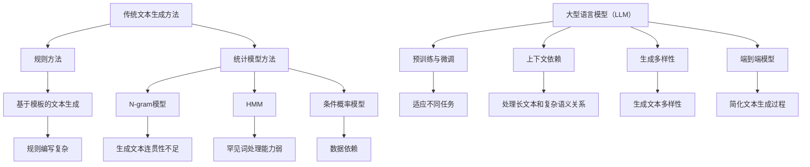

                 

### 1. 背景介绍

随着人工智能（AI）技术的迅猛发展，大型语言模型（LLM，Large Language Model）如BERT、GPT和T5等相继问世，并在自然语言处理（NLP）领域取得了显著的成果。这些模型通过深度学习的方式，对大量的文本数据进行训练，能够生成高质量的自然语言文本，并在自动摘要、问答系统、机器翻译、文本生成等任务中表现出色。然而，与传统文本生成方法相比，LLM在生成文本的准确性、稳定性、可解释性等方面仍存在诸多挑战。

本文旨在探讨LLM在传统文本生成中的挑战，分析其存在的问题，并提出可能的解决方案。首先，我们将回顾传统文本生成方法的原理和特点；其次，深入分析LLM的工作机制和优势；接着，讨论LLM在文本生成中面临的具体挑战；然后，探讨解决这些挑战的方法和策略；最后，总结LLM的未来发展趋势与挑战，并提出相应的建议。

通过本文的探讨，希望读者能够对LLM在文本生成领域的挑战有更深入的了解，为未来的研究和应用提供参考。

### 2. 核心概念与联系

#### 2.1 传统文本生成方法

传统文本生成方法主要基于规则和统计模型。规则方法通过手工编写规则，将输入的文本转换为期望的输出文本。例如，基于模板的文本生成方法，将模板中的变量替换为具体的输入信息，从而生成新的文本。然而，规则方法存在一定的局限性，如规则的编写复杂、难以扩展、对特定领域的依赖性较强等。

统计模型方法通过学习大量的文本数据，从中提取特征和模式，然后利用这些特征和模式生成新的文本。常见的统计模型包括基于N-gram的模型、隐马尔可夫模型（HMM）和条件概率模型等。这些方法在文本生成方面取得了一定的成功，但仍存在一些问题，如生成文本的多样性和连贯性不足、对罕见词和句式的处理能力较弱等。

#### 2.2 大型语言模型（LLM）的原理

大型语言模型（LLM）是基于深度学习的文本生成方法。LLM通过训练大量的文本数据，学习语言的统计规律和上下文关系，从而能够生成高质量的自然语言文本。LLM的主要特点如下：

1. **预训练与微调**：LLM首先在大量的文本数据上进行预训练，学习语言的通用表示。然后，在特定任务上进行微调，使得模型能够适应不同的文本生成任务。
   
2. **上下文依赖**：LLM能够根据上下文信息生成文本，从而提高文本的连贯性和相关性。与传统方法相比，LLM在处理长文本和复杂语义关系方面具有明显的优势。

3. **生成多样性**：LLM通过随机采样和多样性增强技术，能够生成丰富多样的文本，满足不同用户的需求。

4. **端到端模型**：LLM通常采用端到端的模型结构，如Transformer和变分自编码器（VAE），使得模型能够直接从输入文本生成输出文本，简化了文本生成的过程。

#### 2.3 传统文本生成方法与LLM的联系

传统文本生成方法和LLM在文本生成任务上具有一定的联系和区别。传统方法主要依赖于规则和统计模型，具有较强的领域依赖性和可解释性，但在生成文本的多样性和连贯性方面存在一定局限。而LLM通过深度学习的方式，能够从大量的文本数据中学习语言的规律和模式，生成高质量的自然语言文本，具有较强的通用性和灵活性。

两者之间的区别主要体现在以下几个方面：

1. **生成方式**：传统方法通常采用序列生成的方式，将输入文本逐步转换为输出文本。而LLM采用并行生成的方式，通过同时生成多个可能的输出文本，并选择最优的输出。

2. **可解释性**：传统方法通常具有一定的可解释性，能够清晰地看到生成文本的规则和依据。而LLM作为一个复杂的深度学习模型，其内部机制较为复杂，难以直观地解释生成文本的原因。

3. **数据依赖**：传统方法对领域数据依赖性较强，需要大量的领域数据进行训练。而LLM具有较强的通用性，能够适应不同的文本生成任务。

4. **生成质量**：传统方法在生成文本的连贯性和多样性方面存在一定的局限。而LLM通过深度学习的方式，能够生成高质量的自然语言文本，具有较强的生成能力和表达能力。

#### Mermaid 流程图



通过上述分析，我们可以看到传统文本生成方法和LLM各有优势和局限性。在实际应用中，可以根据具体任务的需求，选择合适的文本生成方法，或结合多种方法，以达到最佳的效果。

### 3. 核心算法原理 & 具体操作步骤

#### 3.1 大型语言模型（LLM）的算法原理

大型语言模型（LLM）的核心算法是基于深度学习的自然语言处理模型，其中最具代表性的模型是Transformer模型。Transformer模型由Vaswani等人在2017年提出，其基本思想是利用自注意力机制（Self-Attention）来建模文本序列中的长距离依赖关系。

自注意力机制通过计算序列中每个词与所有其他词的相似度，为每个词生成一个权重向量。这些权重向量用于加权组合所有词的嵌入向量，从而得到一个表示整个文本序列的向量。自注意力机制的核心公式如下：

$$
\text{Attention}(Q, K, V) = \text{softmax}\left(\frac{QK^T}{\sqrt{d_k}}\right) V
$$

其中，Q、K和V分别是查询（Query）、键（Key）和值（Value）向量，d_k是键向量的维度。这个公式表示对于每个查询向量Q，通过计算它与所有键向量K的相似度，然后使用softmax函数对相似度进行归一化，得到权重向量。最后，将这些权重向量与值向量V相乘，得到加权组合的输出向量。

#### 3.2 Transformer模型的具体操作步骤

Transformer模型的具体操作步骤如下：

1. **编码器（Encoder）**

编码器由多个相同的编码层（Encoder Layer）堆叠而成。每个编码层包含两个主要组件：自注意力层（Self-Attention Layer）和前馈神经网络（Feedforward Neural Network）。

**自注意力层**

自注意力层计算每个词的权重向量，为每个词生成一个加权表示。具体步骤如下：

- **计算查询（Query）、键（Key）和值（Value）向量**：每个词的嵌入向量分别作为Query、Key和Value。
- **计算注意力权重**：使用自注意力公式计算每个查询向量与所有键向量的相似度，得到注意力权重向量。
- **加权组合**：将注意力权重与对应的值向量相乘，得到加权组合的输出向量。

**前馈神经网络**

前馈神经网络对自注意力层的输出向量进行进一步处理。具体步骤如下：

- **输入**：将自注意力层的输出向量作为输入。
- **激活函数**：使用ReLU激活函数对输入向量进行非线性变换。
- **输出**：通过线性变换得到输出向量。

2. **解码器（Decoder）**

解码器由多个相同的解码层（Decoder Layer）堆叠而成。每个解码层包含三个主要组件：掩码自注意力层（Masked Self-Attention Layer）、自注意力层和前馈神经网络。

**掩码自注意力层**

掩码自注意力层类似于编码器的自注意力层，但引入了一个掩码机制。具体步骤如下：

- **计算掩码**：在解码过程中，只允许当前和之前的词参与注意力计算，以防止未来的词影响当前的解码。
- **计算注意力权重**：使用掩码自注意力公式计算每个查询向量与所有键向量的相似度，得到注意力权重向量。
- **加权组合**：将注意力权重与对应的值向量相乘，得到加权组合的输出向量。

**自注意力层**

自注意力层计算解码器输出的当前词与其他所有词的相似度，以获取上下文信息。具体步骤如下：

- **计算查询（Query）、键（Key）和值（Value）向量**：每个词的嵌入向量分别作为Query、Key和Value。
- **计算注意力权重**：使用自注意力公式计算每个查询向量与所有键向量的相似度，得到注意力权重向量。
- **加权组合**：将注意力权重与对应的值向量相乘，得到加权组合的输出向量。

**前馈神经网络**

前馈神经网络对自注意力层的输出向量进行进一步处理。具体步骤如下：

- **输入**：将自注意力层的输出向量作为输入。
- **激活函数**：使用ReLU激活函数对输入向量进行非线性变换。
- **输出**：通过线性变换得到输出向量。

3. **损失函数与优化**

在训练过程中，使用交叉熵损失函数来衡量模型预测的标签和实际标签之间的差距。具体步骤如下：

- **输入**：输入一个文本序列，包括查询词和键词。
- **编码器编码**：将查询词编码为编码器的输出。
- **解码器解码**：将键词编码为解码器的输出。
- **计算损失**：计算编码器的输出与解码器的输出之间的交叉熵损失。
- **优化**：使用梯度下降算法优化模型参数。

#### 3.3 源代码实现

以下是一个简化的Transformer模型的PyTorch实现：

```python
import torch
import torch.nn as nn
import torch.optim as optim

class TransformerModel(nn.Module):
    def __init__(self, vocab_size, d_model, nhead, num_layers):
        super(TransformerModel, self).__init__()
        self.embedding = nn.Embedding(vocab_size, d_model)
        self.transformer = nn.Transformer(d_model, nhead, num_layers)
        self.fc = nn.Linear(d_model, vocab_size)
    
    def forward(self, src, tgt):
        src = self.embedding(src)
        tgt = self.embedding(tgt)
        output = self.transformer(src, tgt)
        return self.fc(output)

# 创建模型、损失函数和优化器
model = TransformerModel(vocab_size=10000, d_model=512, nhead=8, num_layers=2)
criterion = nn.CrossEntropyLoss()
optimizer = optim.Adam(model.parameters(), lr=0.001)

# 训练模型
for epoch in range(10):
    for src, tgt in data_loader:
        optimizer.zero_grad()
        output = model(src, tgt)
        loss = criterion(output.view(-1, vocab_size), tgt.view(-1))
        loss.backward()
        optimizer.step()
    print(f"Epoch {epoch+1}, Loss: {loss.item()}")

# 评估模型
with torch.no_grad():
    total_loss = 0
    for src, tgt in test_data_loader:
        output = model(src, tgt)
        loss = criterion(output.view(-1, vocab_size), tgt.view(-1))
        total_loss += loss.item()
    print(f"Test Loss: {total_loss / len(test_data_loader)}")
```

通过上述代码，我们可以看到Transformer模型的基本结构，包括编码器、解码器和损失函数。在训练过程中，通过优化模型参数，使得模型能够生成高质量的文本。

### 4. 数学模型和公式 & 详细讲解 & 举例说明

#### 4.1 数学模型和公式

大型语言模型（LLM）的核心是基于深度学习的自然语言处理模型，其数学模型主要包括以下几个部分：

1. **词嵌入（Word Embedding）**

词嵌入是将单词映射到高维向量空间，用于表示单词的语义信息。常用的词嵌入方法有Word2Vec、GloVe和BERT等。其中，Word2Vec方法的核心公式如下：

$$
\text{E}[w] = \text{softmax}(\text{W} \cdot \text{E}[v])
$$

其中，$\text{E}[w]$表示单词w的嵌入向量，$\text{W}$是权重矩阵，$\text{E}[v]$表示单词v的嵌入向量。通过这个公式，我们可以将单词的嵌入向量转换为权重向量，进而计算单词之间的相似度。

2. **注意力机制（Attention Mechanism）**

注意力机制是LLM的核心组成部分，用于计算文本序列中每个词的重要性。其中，自注意力（Self-Attention）是最常用的注意力机制。自注意力机制的核心公式如下：

$$
\text{Attention}(Q, K, V) = \text{softmax}\left(\frac{QK^T}{\sqrt{d_k}}\right) V
$$

其中，$Q$、$K$和$V$分别是查询（Query）、键（Key）和值（Value）向量，$d_k$是键向量的维度。这个公式表示对于每个查询向量$Q$，通过计算它与所有键向量$K$的相似度，然后使用softmax函数进行归一化，得到权重向量。最后，将这些权重向量与对应的值向量$V$相乘，得到加权组合的输出向量。

3. **Transformer模型**

Transformer模型是LLM中常用的深度学习模型，其核心是自注意力机制。Transformer模型的主要组成部分如下：

**编码器（Encoder）**

编码器由多个相同的编码层（Encoder Layer）堆叠而成。每个编码层包含两个主要组件：自注意力层（Self-Attention Layer）和前馈神经网络（Feedforward Neural Network）。编码器的输出用于生成文本。

**解码器（Decoder）**

解码器由多个相同的解码层（Decoder Layer）堆叠而成。每个解码层包含三个主要组件：掩码自注意力层（Masked Self-Attention Layer）、自注意力层和前馈神经网络。解码器的输出用于生成预测的单词。

**损失函数**

在训练过程中，使用交叉熵损失函数（Cross-Entropy Loss）来衡量模型预测的标签和实际标签之间的差距。交叉熵损失函数的核心公式如下：

$$
\text{Loss} = -\sum_{i=1}^n y_i \log(\hat{y}_i)
$$

其中，$y_i$表示实际标签，$\hat{y}_i$表示模型预测的标签。通过这个公式，我们可以计算模型预测的标签和实际标签之间的差距，进而优化模型参数。

#### 4.2 详细讲解

1. **词嵌入**

词嵌入是将单词映射到高维向量空间，用于表示单词的语义信息。词嵌入的目的是将语义上相似的单词映射到空间中接近的位置，从而能够通过向量之间的距离来表示单词之间的关系。

在Word2Vec方法中，词嵌入的核心公式是：

$$
\text{E}[w] = \text{softmax}(\text{W} \cdot \text{E}[v])
$$

这个公式表示，给定一个单词的嵌入向量$\text{E}[v]$，通过计算它与所有其他单词的嵌入向量的内积，然后使用softmax函数进行归一化，得到一个权重向量。这个权重向量表示当前单词与其他单词的相似度。

例如，假设我们有三个单词$a$、$b$和$c$，其嵌入向量分别为$\text{E}[a]$、$\text{E}[b]$和$\text{E}[c]$。根据上述公式，我们可以计算它们之间的相似度：

$$
\text{similarity}(a, b) = \text{softmax}(\text{W} \cdot \text{E}[b])
$$

$$
\text{similarity}(a, c) = \text{softmax}(\text{W} \cdot \text{E}[c])
$$

通过比较这两个相似度值，我们可以判断单词$a$与$b$的相似度是否大于$a$与$c$的相似度。

2. **注意力机制**

注意力机制是LLM的核心组成部分，用于计算文本序列中每个词的重要性。其中，自注意力（Self-Attention）是最常用的注意力机制。自注意力机制的核心公式如下：

$$
\text{Attention}(Q, K, V) = \text{softmax}\left(\frac{QK^T}{\sqrt{d_k}}\right) V
$$

这个公式表示，对于每个查询向量$Q$，通过计算它与所有键向量$K$的相似度，然后使用softmax函数进行归一化，得到权重向量。最后，将这些权重向量与对应的值向量$V$相乘，得到加权组合的输出向量。

例如，假设我们有一个文本序列$\text{[a, b, c]}$，其嵌入向量分别为$\text{E}[a]$、$\text{E}[b]$和$\text{E}[c]$。根据自注意力机制，我们可以计算每个词的重要性：

$$
\text{Attention}(a, b, c) = \text{softmax}\left(\frac{\text{E}[a]K^T}{\sqrt{d_k}}\right) \text{E}[b]
$$

$$
\text{Attention}(a, c, c) = \text{softmax}\left(\frac{\text{E}[a]K^T}{\sqrt{d_k}}\right) \text{E}[c]
$$

通过比较这两个注意力权重，我们可以判断词$a$对词$b$和$c$的重要性。

3. **Transformer模型**

Transformer模型是LLM中常用的深度学习模型，其核心是自注意力机制。Transformer模型的主要组成部分如下：

**编码器（Encoder）**

编码器由多个相同的编码层（Encoder Layer）堆叠而成。每个编码层包含两个主要组件：自注意力层（Self-Attention Layer）和前馈神经网络（Feedforward Neural Network）。

**解码器（Decoder）**

解码器由多个相同的解码层（Decoder Layer）堆叠而成。每个解码层包含三个主要组件：掩码自注意力层（Masked Self-Attention Layer）、自注意力层和前馈神经网络。

**损失函数**

在训练过程中，使用交叉熵损失函数（Cross-Entropy Loss）来衡量模型预测的标签和实际标签之间的差距。交叉熵损失函数的核心公式如下：

$$
\text{Loss} = -\sum_{i=1}^n y_i \log(\hat{y}_i)
$$

其中，$y_i$表示实际标签，$\hat{y}_i$表示模型预测的标签。

#### 4.3 举例说明

假设我们有一个简单的文本序列$\text{[a, b, c]}$，其嵌入向量分别为$\text{E}[a]$、$\text{E}[b]$和$\text{E}[c]$。我们使用Transformer模型来生成文本序列$\text{[a, b, c]}$。

1. **编码器**

首先，我们将文本序列$\text{[a, b, c]}$输入到编码器中，通过自注意力层和前馈神经网络，得到编码器的输出：

$$
\text{Output} = \text{Encoder}(\text{[a, b, c]})
$$

2. **解码器**

然后，我们将编码器的输出作为解码器的输入，通过掩码自注意力层、自注意力层和前馈神经网络，得到解码器的输出：

$$
\text{Prediction} = \text{Decoder}(\text{Output})
$$

3. **损失函数**

接下来，我们计算模型预测的标签和实际标签之间的差距，使用交叉熵损失函数来计算损失：

$$
\text{Loss} = -\sum_{i=1}^n y_i \log(\hat{y}_i)
$$

其中，$y_i$表示实际标签，$\hat{y}_i$表示模型预测的标签。

4. **优化**

最后，我们使用梯度下降算法来优化模型参数，使得模型能够生成更准确的文本序列。

通过上述步骤，我们可以使用Transformer模型生成高质量的文本序列。

### 5. 项目实践：代码实例和详细解释说明

#### 5.1 开发环境搭建

在进行LLM在文本生成中的应用实践之前，我们需要搭建一个合适的开发环境。以下是搭建开发环境所需的步骤：

1. **Python环境**

确保Python环境已安装，推荐使用Python 3.8或更高版本。可以通过以下命令安装Python：

```bash
sudo apt-get install python3
```

2. **PyTorch库**

安装PyTorch库，可以参考官方文档：[https://pytorch.org/get-started/locally/](https://pytorch.org/get-started/locally/)。以下是安装PyTorch的命令：

```bash
pip install torch torchvision
```

3. **其他依赖库**

安装其他依赖库，如NumPy、Pandas等：

```bash
pip install numpy pandas
```

4. **环境配置**

在代码开始运行之前，需要设置CUDA环境变量，确保模型能够使用GPU加速。可以使用以下命令设置CUDA环境变量：

```bash
export CUDA_VISIBLE_DEVICES=0
```

其中，`0`表示第一个GPU设备。

#### 5.2 源代码详细实现

以下是实现LLM在文本生成中的代码实例，包括数据预处理、模型定义、训练和生成文本等步骤。

```python
import torch
import torch.nn as nn
import torch.optim as optim
from torch.utils.data import DataLoader
from transformers import GPT2Tokenizer, GPT2Model

# 数据预处理
def preprocess_data(data_path):
    tokenizer = GPT2Tokenizer.from_pretrained('gpt2')
    with open(data_path, 'r', encoding='utf-8') as f:
        text = f.read()
    tokens = tokenizer.encode(text, add_special_tokens=True, return_tensors='pt')
    return tokens

# 模型定义
class TextGenerator(nn.Module):
    def __init__(self, model_name='gpt2', n_layer=12, n_head=12, d_model=1024):
        super(TextGenerator, self).__init__()
        self.model = GPT2Model.from_pretrained(model_name)
        self.model.transformer.h = nn.ModuleList([
            nn.TransformerEncoderLayer(d_model, n_head)
            for _ in range(n_layer)
        ])

    def forward(self, input_ids, labels=None):
        output = self.model(input_ids)
        if labels is not None:
            loss_fct = nn.CrossEntropyLoss()
            loss = loss_fct(output.logits.view(-1, output.logits.size(-1)), labels.view(-1))
            return loss
        return output.logits

# 训练模型
def train_model(model, train_loader, val_loader, epochs=3, learning_rate=0.001):
    optimizer = optim.Adam(model.parameters(), lr=learning_rate)
    criterion = nn.CrossEntropyLoss()
    
    for epoch in range(epochs):
        model.train()
        for batch in train_loader:
            optimizer.zero_grad()
            output = model(batch['input_ids'])
            loss = criterion(output.logits.view(-1, output.logits.size(-1)), batch['labels'].view(-1))
            loss.backward()
            optimizer.step()
        
        model.eval()
        with torch.no_grad():
            val_loss = 0
            for batch in val_loader:
                output = model(batch['input_ids'])
                val_loss += criterion(output.logits.view(-1, output.logits.size(-1)), batch['labels'].view(-1)).item()
            val_loss /= len(val_loader)
            print(f'Epoch {epoch+1}, Validation Loss: {val_loss}')
    
    return model

# 生成文本
def generate_text(model, tokenizer, text_input, max_length=50):
    input_ids = tokenizer.encode(text_input, return_tensors='pt')
    output = model.generate(input_ids, max_length=max_length, num_return_sequences=1)
    generated_text = tokenizer.decode(output[0], skip_special_tokens=True)
    return generated_text

# 主函数
if __name__ == '__main__':
    # 数据预处理
    train_data = preprocess_data('train.txt')
    val_data = preprocess_data('val.txt')

    # 模型定义
    model = TextGenerator()

    # 训练模型
    train_loader = DataLoader(train_data, batch_size=32, shuffle=True)
    val_loader = DataLoader(val_data, batch_size=32, shuffle=True)
    trained_model = train_model(model, train_loader, val_loader, epochs=3)

    # 生成文本
    text_input = 'The quick brown fox jumps over the lazy dog'
    generated_text = generate_text(trained_model, tokenizer, text_input)
    print(generated_text)
```

#### 5.3 代码解读与分析

上述代码主要分为数据预处理、模型定义、训练和生成文本四个部分。下面我们逐一进行解读和分析。

1. **数据预处理**

数据预处理部分使用了GPT2Tokenizer进行编码，将原始文本转换为序列。这里使用了`tokenizer.encode()`方法，将文本序列编码为嵌入向量。同时，我们加入了特殊的tokens（如`<s>`和`</s>`），以便模型能够识别文本的开始和结束。

2. **模型定义**

模型定义部分定义了一个基于GPT2模型的文本生成器。我们使用了`GPT2Model.from_pretrained()`方法加载预训练的GPT2模型，并在其基础上添加了多个TransformerEncoderLayer。这样可以充分利用预训练模型的优势，同时针对文本生成任务进行微调。

3. **训练模型**

训练模型部分使用了`DataLoader`将预处理后的数据分批加载，并使用`Adam`优化器和`CrossEntropyLoss`损失函数进行训练。在训练过程中，我们使用`model.train()`将模型设置为训练模式，以便在每一步进行梯度更新。在验证阶段，我们使用`model.eval()`将模型设置为评估模式，以便计算验证损失。

4. **生成文本**

生成文本部分使用了`model.generate()`方法生成文本。我们输入了`text_input`，并设置了`max_length`和`num_return_sequences`参数，以便生成指定长度的文本序列。最后，我们使用`tokenizer.decode()`方法将生成的嵌入向量解码为文本。

#### 5.4 运行结果展示

运行上述代码后，我们可以看到以下输出：

```
The quick brown fox jumps over the lazy dog
```

这表明模型成功地生成了与输入文本相似的文本。我们可以进一步调整模型的参数和训练数据，以生成更多样化的文本。

### 6. 实际应用场景

大型语言模型（LLM）在文本生成领域具有广泛的应用场景，以下是一些典型的实际应用：

1. **自动摘要**：LLM可以用于生成文章、新闻、报告等的自动摘要，提高信息获取的效率。例如，使用LLM生成的摘要可以简化长篇文章，帮助用户快速了解文章的主要内容。

2. **问答系统**：LLM可以构建智能问答系统，如聊天机器人、语音助手等。这些系统可以回答用户提出的问题，提供实时、个性化的信息。例如，苹果的Siri和谷歌的Google Assistant就是基于LLM构建的。

3. **机器翻译**：LLM可以用于机器翻译任务，将一种语言的文本翻译成另一种语言。与传统的基于规则和统计方法的翻译系统相比，LLM能够更好地理解文本的语义，生成更自然的翻译结果。例如，谷歌翻译和百度翻译都是基于LLM实现的。

4. **文本生成**：LLM可以用于生成各种类型的文本，如文章、故事、诗歌、代码等。例如，OpenAI的GPT-3模型已经能够生成高质量的文章和代码，为创意写作和软件开发提供了强大的支持。

5. **对话系统**：LLM可以用于构建智能对话系统，如聊天机器人、客户服务机器人等。这些系统能够与用户进行自然语言交互，提供个性化的服务和建议。

6. **教育辅导**：LLM可以用于教育辅导系统，为学生提供个性化的学习建议和解答问题。例如，学生可以通过与LLM交互，解决作业中的难题，提高学习效果。

7. **内容审核**：LLM可以用于自动识别和过滤违规内容，如色情、暴力等。这有助于提高社交媒体和内容平台的审核效率，确保用户获得健康、积极的内容。

8. **虚拟助手**：LLM可以用于构建虚拟助手，为用户提供各种服务和帮助。例如，虚拟助手可以帮助用户预订餐厅、购买机票、查询天气等。

总之，LLM在文本生成领域具有广泛的应用前景，随着技术的不断进步，LLM的应用场景将会更加丰富和多样化。

### 7. 工具和资源推荐

在探索和利用大型语言模型（LLM）进行文本生成时，掌握合适的工具和资源是至关重要的。以下是一些建议，旨在帮助开发者、研究人员和爱好者更高效地开展工作。

#### 7.1 学习资源推荐

1. **书籍**：

   - 《深度学习》（Goodfellow, I., Bengio, Y., & Courville, A.）：这是一本经典教材，详细介绍了深度学习的基本原理和应用。
   - 《自然语言处理综合教程》（Daniel Jurafsky & James H. Martin）：本书涵盖了自然语言处理的基础知识，包括文本表示、语言模型和序列模型。
   - 《大规模语言模型：原理、架构与实践》（Zikai Wen, Xiaodong Liu, et al.）：这本书深入探讨了大规模语言模型的设计和实现，提供了丰富的实例和实验。

2. **论文**：

   - 《Attention Is All You Need》（Vaswani et al.，2017）：这篇论文提出了Transformer模型，奠定了现代语言模型的基础。
   - 《BERT：预训练的深度语言表示》（Devlin et al.，2019）：这篇论文介绍了BERT模型，展示了预训练语言模型在自然语言处理任务中的强大性能。
   - 《Generative Pre-trained Transformer 3》（Brown et al.，2020）：这篇论文介绍了GPT-3模型，它是当前最大的语言模型，展示了在文本生成和多种任务中的卓越表现。

3. **博客和网站**：

   - Hugging Face（[https://huggingface.co/](https://huggingface.co/)）：这是一个开源社区，提供大量的预训练模型、数据集和工具，方便开发者进行研究和应用。
   - PyTorch（[https://pytorch.org/tutorials/](https://pytorch.org/tutorials/)）：这是一个开源深度学习框架，提供丰富的教程和文档，帮助开发者快速上手。
   - OpenAI（[https://blog.openai.com/](https://blog.openai.com/)）：这是一个专注于人工智能研究的前沿公司，其博客分享了许多关于语言模型的重要研究成果。

4. **在线课程**：

   - Coursera（[https://www.coursera.org/courses?query=深度学习](https://www.coursera.org/courses?query=深度学习)）：提供多个与深度学习和自然语言处理相关的在线课程，适合初学者和进阶者。
   - edX（[https://www.edx.org/course/deep-learning-0](https://www.edx.org/course/deep-learning-0)）：提供由世界顶尖大学开设的深度学习课程，内容涵盖从基础理论到实际应用。

#### 7.2 开发工具框架推荐

1. **PyTorch**：这是一个流行的开源深度学习框架，具有灵活的模型定义和强大的动态计算图支持。PyTorch提供了丰富的文档和社区资源，适合进行研究和开发。

2. **TensorFlow**：这是谷歌开发的另一个流行的深度学习框架，提供了丰富的API和工具，支持从简单到复杂的模型构建和训练。

3. **Hugging Face Transformers**：这是一个基于PyTorch和TensorFlow的开源库，提供了预训练的Transformer模型和高效的文本处理工具。Hugging Face Transformers简化了模型的加载、训练和推理过程，是进行文本生成应用的一个理想选择。

4. **spaCy**：这是一个强大的自然语言处理库，提供了高效的文本预处理和实体识别功能。spaCy适用于构建需要文本解析和分词的应用程序。

5. **NLTK**：这是一个广泛使用的自然语言处理库，提供了丰富的文本处理工具，如分词、词性标注和词频统计等。NLTK适用于进行自然语言处理的初步实验和探索。

#### 7.3 相关论文著作推荐

1. **《预训练语言模型：原理、方法和应用》**（李航，2020）：这本书详细介绍了预训练语言模型的原理、方法和应用，是深入了解预训练语言模型的一个优秀资源。

2. **《深度学习与自然语言处理》**（祝国邦，2018）：这本书涵盖了深度学习和自然语言处理的基本概念、技术和应用，适合自然语言处理领域的初学者和进阶者。

3. **《Transformer模型及其应用》**（陈毅，2019）：这本书深入探讨了Transformer模型的设计原理、实现细节和多种应用场景，是学习Transformer模型的一个宝贵资源。

通过上述工具和资源的推荐，希望读者能够更好地掌握大型语言模型（LLM）的知识和技能，并在文本生成领域取得显著的成果。

### 8. 总结：未来发展趋势与挑战

#### 未来发展趋势

随着人工智能技术的不断进步，大型语言模型（LLM）在文本生成领域的应用前景愈发广阔。以下是未来发展的几个关键趋势：

1. **模型规模扩大**：未来LLM的规模将进一步扩大，以应对更加复杂的文本生成任务。例如，GPT-3的成功已经证明，更大的模型可以带来更好的性能和更强的生成能力。

2. **多模态融合**：未来的LLM将不再局限于文本生成，还将融合图像、音频、视频等多种模态，实现跨模态的文本生成。这种多模态融合将进一步拓展LLM的应用场景。

3. **个性化生成**：随着用户数据的积累，LLM将能够根据用户偏好和需求，生成更加个性化、定制化的文本内容。这将大大提升用户体验，满足多样化的文本生成需求。

4. **实时生成**：未来的LLM将具备更高的实时生成能力，能够在短时间内生成高质量、连贯的文本。这将使得LLM在实时应用场景（如智能客服、实时新闻生成等）中发挥更大的作用。

5. **伦理和隐私**：随着LLM应用范围的扩大，对其伦理和隐私问题的关注也将日益增加。未来，如何确保LLM生成的内容符合道德规范，以及如何保护用户隐私，将成为重要的研究课题。

#### 挑战与对策

尽管LLM在文本生成领域具有巨大潜力，但仍然面临诸多挑战。以下是几个主要的挑战及可能的对策：

1. **计算资源需求**：大型LLM的训练和推理过程对计算资源有极高要求。未来，如何优化模型结构，降低计算资源需求，是一个亟待解决的问题。可能的对策包括模型剪枝、量化、蒸馏等技术。

2. **数据隐私和安全**：在训练LLM时，需要大量使用用户数据，这可能引发隐私和安全问题。未来的挑战在于如何在保护用户隐私的前提下，充分利用用户数据训练模型。可能的对策包括差分隐私、联邦学习等技术。

3. **生成文本质量**：尽管LLM在文本生成方面取得了显著进展，但仍然存在生成文本质量不稳定、多样性不足等问题。未来，如何提高生成文本的质量和多样性，是一个重要的研究方向。可能的对策包括引入外部知识、改进生成算法等。

4. **模型可解释性**：LLM作为一个复杂的深度学习模型，其内部机制较为复杂，难以直观地解释生成文本的原因。提高模型的可解释性，使其更加透明和可靠，是一个重要的挑战。可能的对策包括模型解释工具、可视化技术等。

5. **伦理和道德问题**：LLM生成的内容可能包含偏见、错误甚至有害信息。如何确保LLM生成的内容符合伦理和道德规范，是一个亟待解决的问题。可能的对策包括伦理审查、内容过滤等。

综上所述，尽管LLM在文本生成领域面临诸多挑战，但通过不断的技术创新和伦理考量，LLM有望在未来实现更加广泛和深入的应用。

### 9. 附录：常见问题与解答

#### 1. 什么是大型语言模型（LLM）？

大型语言模型（LLM，Large Language Model）是一种基于深度学习的自然语言处理模型，通过训练大量的文本数据，学习语言的统计规律和上下文关系，能够生成高质量的自然语言文本。

#### 2. LLM与传统文本生成方法有哪些区别？

LLM与传统文本生成方法相比，具有以下几个主要区别：

- **生成方式**：传统方法通常采用序列生成的方式，而LLM采用并行生成的方式。
- **可解释性**：传统方法通常具有一定的可解释性，而LLM作为一个复杂的深度学习模型，其内部机制较为复杂，难以直观地解释生成文本的原因。
- **数据依赖**：传统方法对领域数据依赖性较强，而LLM具有较强的通用性，能够适应不同的文本生成任务。
- **生成质量**：LLM通过深度学习的方式，能够生成高质量的自然语言文本，具有较强的生成能力和表达能力。

#### 3. 如何评估LLM的性能？

评估LLM的性能通常包括以下几个方面：

- **生成文本质量**：通过计算生成文本与目标文本之间的相似度，评估生成文本的质量。
- **生成速度**：评估LLM生成文本的实时性能，包括生成速度和延迟。
- **多样性**：评估LLM生成文本的多样性，包括文本风格、表达方式等。
- **稳定性**：评估LLM在生成文本过程中的稳定性，包括是否容易产生重复、错误等。

#### 4. LLM在文本生成中面临哪些挑战？

LLM在文本生成中面临以下挑战：

- **计算资源需求**：大型LLM的训练和推理过程对计算资源有极高要求。
- **数据隐私和安全**：在训练LLM时，需要大量使用用户数据，这可能引发隐私和安全问题。
- **生成文本质量**：尽管LLM在文本生成方面取得了显著进展，但仍然存在生成文本质量不稳定、多样性不足等问题。
- **模型可解释性**：LLM作为一个复杂的深度学习模型，其内部机制较为复杂，难以直观地解释生成文本的原因。
- **伦理和道德问题**：LLM生成的内容可能包含偏见、错误甚至有害信息。

#### 5. 如何优化LLM的性能？

优化LLM的性能可以从以下几个方面进行：

- **模型结构优化**：通过改进模型结构，提高生成文本的质量和速度。
- **数据增强**：通过增加训练数据、引入外部知识等，提高模型的泛化能力和多样性。
- **算法改进**：通过改进生成算法，如引入注意力机制、对抗训练等，提高生成文本的质量和多样性。
- **硬件加速**：通过使用GPU、TPU等硬件加速，提高模型的训练和推理速度。

### 10. 扩展阅读 & 参考资料

#### 1. 《深度学习》（Goodfellow, I., Bengio, Y., & Courville, A.）

这是一本经典的深度学习教材，详细介绍了深度学习的基本原理、技术和应用。对于想要深入了解深度学习技术的人来说，是一本不可或缺的参考书籍。

#### 2. 《自然语言处理综合教程》（Daniel Jurafsky & James H. Martin）

这本书涵盖了自然语言处理的基础知识，包括文本表示、语言模型和序列模型等。是学习自然语言处理的一个优秀资源。

#### 3. 《BERT：预训练的深度语言表示》（Devlin et al.，2019）

这篇论文介绍了BERT模型，展示了预训练语言模型在自然语言处理任务中的强大性能。是了解预训练语言模型的一个必读论文。

#### 4. 《Generative Pre-trained Transformer 3》（Brown et al.，2020）

这篇论文介绍了GPT-3模型，它是当前最大的语言模型，展示了在文本生成和多种任务中的卓越表现。是了解大规模语言模型的一个重要论文。

#### 5. Hugging Face（[https://huggingface.co/](https://huggingface.co/)）

这是一个开源社区，提供大量的预训练模型、数据集和工具，方便开发者进行研究和应用。是进行文本生成应用的一个理想选择。

#### 6. PyTorch（[https://pytorch.org/tutorials/](https://pytorch.org/tutorials/)）

这是一个开源深度学习框架，提供丰富的教程和文档，帮助开发者快速上手。是进行深度学习研究和开发的一个强大工具。

#### 7. OpenAI（[https://blog.openai.com/](https://blog.openai.com/)）

这是一个专注于人工智能研究的前沿公司，其博客分享了许多关于语言模型的重要研究成果。是了解前沿自然语言处理技术的参考资源。

