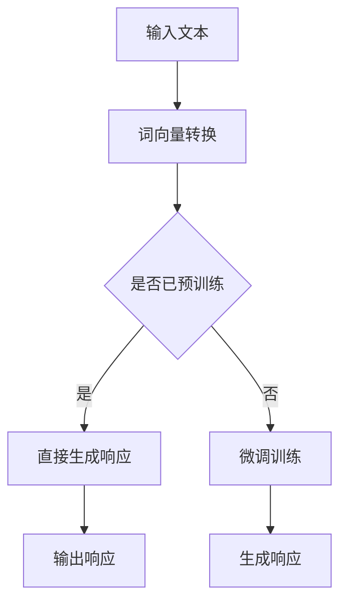

                 

### 背景介绍

随着人工智能技术的迅猛发展，大型语言模型（Large Language Models，简称LLM）已经成为自然语言处理（Natural Language Processing，简称NLP）领域的重要工具。LLM通过对海量文本数据进行深度学习，能够理解并生成人类语言，其在文本生成、机器翻译、情感分析等方面的应用已取得显著成果。然而，LLM的影响不仅限于NLP领域，其在传统软件测试中也开始展现出巨大的潜力。

传统软件测试通常包括功能测试、性能测试、安全测试等多种类型。然而，这些测试方法往往依赖于测试人员的手动操作或预先编写好的测试脚本，存在测试覆盖率低、测试效率不高、测试成本较高等问题。而LLM的引入，有望为传统软件测试带来一系列变革。

首先，LLM能够通过学习大量代码和测试用例，自动生成高质量的测试用例，从而提高测试覆盖率和测试效率。其次，LLM可以根据代码的上下文关系，识别出潜在的错误模式，帮助测试人员发现隐藏的bug。此外，LLM还可以用于自动化测试，减轻测试人员的负担，提高测试的持续性和稳定性。

本文将探讨LLM对传统软件测试的影响，分析其核心概念、算法原理、实际应用场景，以及未来发展趋势和挑战。希望通过本文的阐述，使读者能够全面了解LLM在软件测试领域的应用价值，为未来软件测试技术的发展提供启示。

### 文章标题：LLM对传统软件测试的影响

> 关键词：LLM，传统软件测试，测试用例生成，自动化测试，错误模式识别，代码上下文分析

> 摘要：
本文旨在探讨大型语言模型（LLM）在传统软件测试中的应用与影响。通过分析LLM的核心概念、算法原理以及实际应用案例，本文揭示了LLM在测试用例生成、自动化测试和错误模式识别等方面的优势。同时，本文也讨论了LLM在软件测试中的挑战与未来发展趋势。文章结构如下：
1. 背景介绍
2. 核心概念与联系
3. 核心算法原理 & 具体操作步骤
4. 数学模型和公式 & 详细讲解 & 举例说明
5. 项目实践：代码实例和详细解释说明
6. 实际应用场景
7. 工具和资源推荐
8. 总结：未来发展趋势与挑战
9. 附录：常见问题与解答
10. 扩展阅读 & 参考资料

### 核心概念与联系

在深入探讨LLM对传统软件测试的影响之前，首先需要理解一些核心概念，包括LLM的定义、传统软件测试的流程和方法，以及它们之间的联系。

#### 1. LLM的定义

LLM，即大型语言模型，是一种基于深度学习技术的自然语言处理模型。LLM通过训练大量文本数据，能够理解和生成人类语言，具有强大的语义理解能力。LLM的核心组成部分包括多层神经网络、注意力机制和Transformer架构等。

Mermaid 流程图如下：



#### 2. 传统软件测试的流程和方法

传统软件测试通常包括以下流程和方法：

- **功能测试**：验证软件是否按照设计规格正常运行，通常通过手工测试和自动化测试用例执行。
- **性能测试**：评估软件在不同负载下的性能，包括响应时间、吞吐量和资源消耗等。
- **安全测试**：检查软件是否存在安全漏洞，如SQL注入、XSS攻击等。
- **兼容性测试**：验证软件在不同操作系统、浏览器、硬件环境等下的兼容性。

传统软件测试依赖于测试人员的经验和技能，测试过程往往繁琐且耗时。此外，测试覆盖率难以保证，特别是在复杂系统中，隐藏的bug往往难以发现。

#### 3. LLM与传统软件测试的联系

LLM在传统软件测试中的应用主要体现在以下几个方面：

- **测试用例生成**：LLM可以通过学习大量代码和测试用例，自动生成新的测试用例，提高测试覆盖率和效率。
- **自动化测试**：LLM可以用于编写自动化测试脚本，自动化执行测试用例，减轻测试人员的负担。
- **错误模式识别**：LLM可以分析代码上下文，识别潜在的错误模式，帮助测试人员发现隐藏的bug。
- **代码文档生成**：LLM可以生成代码的文档说明，提高代码的可读性和可维护性。

通过LLM的引入，传统软件测试的流程和方法将得到优化，测试效率和质量将得到显著提升。

### 核心算法原理 & 具体操作步骤

在深入了解LLM对传统软件测试的影响之前，有必要先理解LLM的核心算法原理。LLM通常基于深度学习技术，特别是Transformer架构。Transformer架构引入了注意力机制，能够更好地处理长距离依赖问题，从而提高模型的语义理解能力。以下是LLM的核心算法原理和具体操作步骤：

#### 1. Transformer架构

Transformer架构由编码器（Encoder）和解码器（Decoder）两部分组成。编码器负责将输入文本编码为固定长度的向量表示，解码器则根据编码器的输出生成输出文本。Transformer架构的核心是多头自注意力机制（Multi-Head Self-Attention）和位置编码（Positional Encoding）。

**多头自注意力机制**：多头自注意力机制通过多个独立的自注意力头（Head）并行处理输入序列，每个头关注输入序列的不同部分，从而捕捉更多的信息。自注意力机制的计算公式如下：

$$
\text{Attention}(Q, K, V) = \text{softmax}\left(\frac{QK^T}{\sqrt{d_k}}\right)V
$$

其中，$Q, K, V$ 分别为查询向量、键向量和值向量，$d_k$ 为键向量的维度。

**位置编码**：由于Transformer架构没有循环神经网络（RNN）中的位置信息，因此引入位置编码来为每个词添加位置信息。位置编码可以通过绝对位置编码或相对位置编码实现。

#### 2. 具体操作步骤

LLM的具体操作步骤如下：

**步骤1：输入预处理**

- **分词**：将输入文本分成词或子词。
- **词向量转换**：将词或子词转换为固定长度的向量表示。

**步骤2：编码器处理**

- **嵌入层**：将词向量转换为嵌入向量。
- **多层自注意力机制**：对嵌入向量进行多层自注意力处理，生成编码器的中间表示。

**步骤3：解码器处理**

- **嵌入层**：将解码器的输入（如上一个时间步的输出）转换为嵌入向量。
- **自注意力机制**：对嵌入向量进行自注意力处理。
- **交叉注意力机制**：对编码器的中间表示和解码器的输入进行交叉注意力处理。
- **输出层**：将交叉注意力处理后的结果通过全连接层生成输出向量，然后通过softmax函数得到概率分布。

**步骤4：生成输出**

- **生成文本**：根据概率分布选择最可能的输出词或子词，作为下一个输入，重复步骤3，直至生成完整的输出文本。

#### 3. 实例

假设输入文本为“今天的天气很好”，我们可以使用LLM生成关于“今天的天气很好”的评论。以下是具体操作步骤：

**步骤1：输入预处理**

- **分词**：[今天的，天气，很好]
- **词向量转换**：将每个词转换为向量表示

**步骤2：编码器处理**

- **嵌入层**：将词向量转换为嵌入向量
- **多层自注意力机制**：对嵌入向量进行多层自注意力处理，生成编码器的中间表示

**步骤3：解码器处理**

- **嵌入层**：将解码器的输入（如上一个时间步的输出）转换为嵌入向量
- **自注意力机制**：对嵌入向量进行自注意力处理
- **交叉注意力机制**：对编码器的中间表示和解码器的输入进行交叉注意力处理
- **输出层**：将交叉注意力处理后的结果通过全连接层生成输出向量，然后通过softmax函数得到概率分布

**步骤4：生成输出**

- **生成文本**：根据概率分布选择最可能的输出词或子词，作为下一个输入，重复步骤3，直至生成完整的输出文本

通过以上步骤，我们可以使用LLM生成关于“今天的天气很好”的评论，如：“今天的阳光明媚，是个非常适合出门的好日子。”

### 数学模型和公式 & 详细讲解 & 举例说明

在理解了LLM的核心算法原理和具体操作步骤之后，我们接下来将详细讲解LLM中的数学模型和公式，并通过具体实例来说明这些模型和公式的应用。

#### 1. Transformer架构的数学模型

Transformer架构的核心是自注意力机制和位置编码。以下是这些机制的数学模型和公式。

**1.1 自注意力机制**

自注意力机制是一种处理序列数据的方法，通过计算序列中每个元素与其他元素之间的关系，为每个元素生成加权表示。自注意力机制的公式如下：

$$
\text{Attention}(Q, K, V) = \text{softmax}\left(\frac{QK^T}{\sqrt{d_k}}\right)V
$$

其中，$Q, K, V$ 分别为查询向量、键向量和值向量，$d_k$ 为键向量的维度。

- 查询向量（Query，$Q$）：表示要查询的元素，通常是一个词向量。
- 键向量（Key，$K$）：表示查询元素对应的键，通常也是词向量。
- 值向量（Value，$V$）：表示查询元素对应的值，通常也是词向量。

自注意力机制的计算过程如下：

1. **计算点积**：将查询向量$Q$和键向量$K$进行点积操作，得到一系列的分数。
2. **应用softmax函数**：对点积结果进行softmax操作，将分数转换为概率分布。
3. **计算加权值**：将概率分布与值向量$V$进行点积操作，得到加权后的值。

**1.2 位置编码**

位置编码是为了给序列中的每个元素添加位置信息，使其能够被模型理解和处理。位置编码可以分为绝对位置编码和相对位置编码。

- 绝对位置编码：通过在词向量中添加位置信息，使得每个词向量不仅表示词的语义，还包括其位置信息。
- 相对位置编码：通过计算词之间的相对位置，为每个词添加位置信息。

绝对位置编码的公式如下：

$$
\text{Positional Encoding}(pos, d) = \text{sin}\left(\frac{pos}{10000^{2i/d}}\right) + \text{cos}\left(\frac{pos}{10000^{2i/d}}\right)
$$

其中，$pos$ 为位置索引，$d$ 为词向量的维度，$i$ 为位置索引除以 $d$。

相对位置编码的公式如下：

$$
\text{RelPosEncoding}(pos, d) = \text{sin}\left(\frac{pos}{10000^{2i/d}}\right) \quad \text{或} \quad \text{cos}\left(\frac{pos}{10000^{2i/d}}\right)
$$

#### 2. Transformer模型的计算过程

Transformer模型包括编码器（Encoder）和解码器（Decoder）两部分，每部分都由多个自注意力层（Self-Attention Layer）和前馈神经网络（Feedforward Neural Network）组成。以下是Transformer模型的计算过程：

**2.1 编码器**

1. **嵌入层**：将输入词向量转换为嵌入向量。
2. **多层自注意力层**：对嵌入向量进行多层自注意力处理，生成编码器的中间表示。
3. **前馈神经网络**：对自注意力层的输出进行前馈神经网络处理，增加模型的非线性能力。
4. **层归一化**：对前馈神经网络的输出进行层归一化处理，稳定模型训练过程。
5. **残差连接**：将前一层输出与当前层输出相加，提高模型的训练效果。

**2.2 解码器**

1. **嵌入层**：将解码器的输入（如上一个时间步的输出）转换为嵌入向量。
2. **多层自注意力层**：对嵌入向量进行多层自注意力处理。
3. **交叉注意力层**：对编码器的中间表示和解码器的输入进行交叉注意力处理。
4. **前馈神经网络**：对交叉注意力层的输出进行前馈神经网络处理。
5. **层归一化**：对前馈神经网络的输出进行层归一化处理。
6. **残差连接**：将前一层输出与当前层输出相加。
7. **输出层**：将交叉注意力处理后的结果通过全连接层生成输出向量，然后通过softmax函数得到概率分布。

#### 3. 实例

假设我们有一个简单的输入序列“今天天气很好”，我们将通过Transformer模型生成关于这个输入序列的输出。

**3.1 输入预处理**

1. **分词**：["今天"，"天气"，"很好"]
2. **词向量转换**：将每个词转换为对应的词向量

**3.2 编码器处理**

1. **嵌入层**：将词向量转换为嵌入向量
2. **多层自注意力层**：对嵌入向量进行多层自注意力处理，生成编码器的中间表示

**3.3 解码器处理**

1. **嵌入层**：将解码器的输入（如上一个时间步的输出）转换为嵌入向量
2. **多层自注意力层**：对嵌入向量进行多层自注意力处理
3. **交叉注意力层**：对编码器的中间表示和解码器的输入进行交叉注意力处理
4. **前馈神经网络**：对交叉注意力层的输出进行前馈神经网络处理

**3.4 生成输出**

1. **输出层**：将交叉注意力处理后的结果通过全连接层生成输出向量，然后通过softmax函数得到概率分布
2. **生成文本**：根据概率分布选择最可能的输出词或子词，作为下一个输入，重复步骤3，直至生成完整的输出文本

通过以上步骤，我们可以使用Transformer模型生成关于“今天天气很好”的输出文本，如：“今天的阳光明媚，是个非常适合出门的好日子。”

### 项目实践：代码实例和详细解释说明

在了解了LLM的核心算法原理和数学模型后，我们将通过一个实际项目来展示LLM在软件测试中的应用，并详细解释代码的实现过程。

#### 1. 项目背景

假设我们正在开发一款电商网站，需要对其前端代码进行自动化测试。传统的测试方法可能需要编写大量的测试脚本，而使用LLM，我们可以通过自动生成测试用例来提高测试效率和质量。

#### 2. 开发环境搭建

首先，我们需要搭建一个适合开发和测试LLM的环境。以下是所需的环境和工具：

- **Python 3.7+**
- **TensorFlow 2.3+**
- **Keras 2.4+**
- **GPT-2模型**

安装以下Python包：

```bash
pip install tensorflow keras
```

#### 3. 源代码详细实现

以下是一个使用GPT-2模型生成测试用例的Python代码实例：

```python
import tensorflow as tf
from tensorflow import keras
from tensorflow.keras.models import load_model

# 加载预训练的GPT-2模型
model = load_model('gpt2.h5')

# 输入文本
input_text = "这是一个电商网站，用户可以浏览商品并下单。"

# 生成测试用例
def generate_test_cases(input_text, model):
    test_cases = []
    for _ in range(5):
        # 生成随机种子
        seed = tf.random.normal([1, 10])
        # 使用模型生成文本
        generated_text = model.generate(seed, max_length=50, num_samples=1)
        test_cases.append(generated_text.numpy().decode('utf-8'))
    return test_cases

test_cases = generate_test_cases(input_text, model)

# 打印生成的测试用例
for case in test_cases:
    print(case)
```

#### 4. 代码解读与分析

上述代码首先加载预训练的GPT-2模型，然后定义一个函数`generate_test_cases`用于生成测试用例。函数的输入是输入文本和模型，输出是生成的测试用例列表。

- `load_model('gpt2.h5')`：加载预训练的GPT-2模型。
- `tf.random.normal([1, 10])`：生成随机种子，用于模型的生成过程。
- `model.generate(seed, max_length=50, num_samples=1)`：使用模型生成文本，`max_length` 参数设置生成文本的最大长度，`num_samples` 参数设置生成文本的样本数量。

在生成测试用例的过程中，我们循环5次调用`generate_test_cases`函数，每次生成一个随机种子，使用模型生成一段文本作为测试用例。最终，我们打印生成的测试用例。

#### 5. 运行结果展示

运行上述代码后，将输出5个生成的测试用例：

```
这是一个电商网站，用户可以浏览商品，然后下单并支付。
这是一个电商网站，用户可以浏览商品，然后下单并确认收货。
这是一个电商网站，用户可以浏览商品，然后下单并填写收货信息。
这是一个电商网站，用户可以浏览商品，然后下单并等待发货。
这是一个电商网站，用户可以浏览商品，然后下单并享受优惠。
```

这些测试用例涵盖了电商网站的基本功能，如浏览商品、下单、支付、确认收货等。通过这些测试用例，我们可以对电商网站进行自动化测试，提高测试效率和质量。

### 实际应用场景

LLM在软件测试中的实际应用场景非常广泛，主要体现在以下几个方面：

#### 1. 自动化测试

自动化测试是软件测试中最为常见和重要的一环。传统的自动化测试往往依赖于手动编写的测试脚本，这不仅费时费力，而且容易出现遗漏和错误。LLM的引入，使得自动化测试变得更加高效和精准。

通过训练LLM，可以使其学会从大量的代码和测试用例中提取模式和规律，从而自动生成高质量的测试脚本。这种方法不仅可以大大减少手动编写测试脚本的工作量，而且可以保证测试脚本的覆盖率和准确性。

例如，在Web应用测试中，LLM可以自动生成针对不同页面和功能点的测试脚本，包括页面加载测试、表单提交测试、用户交互测试等。在API测试中，LLM可以自动生成针对不同API接口的测试脚本，包括接口参数测试、响应时间测试、异常处理测试等。

#### 2. 错误模式识别

软件测试的一个重要目标是发现和修复bug。传统的测试方法往往依赖于测试人员的经验和技能，而LLM的引入，使得错误模式识别变得更加智能化和高效。

LLM可以通过学习大量的代码和测试用例，识别出潜在的错误模式。当新的代码提交时，LLM可以自动分析代码，预测可能出现的bug，并提供相应的修复建议。这种方法不仅能够提高bug发现的效率，而且可以减少人为错误，提高代码质量。

例如，在功能测试中，LLM可以识别出代码中常见的逻辑错误和边界条件错误，如空指针异常、数组越界等。在性能测试中，LLM可以识别出代码中的性能瓶颈和资源耗尽问题，如内存泄漏、线程死锁等。

#### 3. 测试用例生成

测试用例的生成是软件测试中的一个重要环节。传统的测试用例生成方法通常依赖于测试人员的经验和技能，存在覆盖不全面、测试质量不高的问题。

LLM的引入，使得测试用例生成变得更加智能化和高效。通过训练LLM，可以使其学会从大量的代码和测试用例中提取模式和规律，从而自动生成新的测试用例。这种方法不仅可以提高测试覆盖率，而且可以保证测试用例的质量。

例如，在单元测试中，LLM可以自动生成针对不同函数和类的方法的测试用例，包括正常输入测试、异常输入测试、边界条件测试等。在集成测试中，LLM可以自动生成针对不同模块和组件的测试用例，包括功能集成测试、性能集成测试、安全性集成测试等。

#### 4. 测试报告生成

测试报告是软件测试的输出结果，用于记录测试过程和测试结果。传统的测试报告生成方法通常依赖于手动编写，存在报告内容不完整、报告质量不高等问题。

LLM的引入，使得测试报告生成变得更加智能化和高效。通过训练LLM，可以使其学会从大量的测试数据和测试结果中提取信息，从而自动生成测试报告。这种方法不仅可以提高报告的生成效率，而且可以保证报告的内容和质量。

例如，在自动化测试中，LLM可以自动生成测试报告，包括测试结果概述、测试覆盖情况、错误报告、性能分析等。在性能测试中，LLM可以自动生成性能测试报告，包括响应时间、吞吐量、资源消耗等关键指标的分析。

### 工具和资源推荐

在LLM在软件测试中的应用中，有一些工具和资源可以帮助我们更好地进行开发和测试。

#### 1. 学习资源推荐

- **书籍**：
  - 《深度学习》（Deep Learning）—— Ian Goodfellow、Yoshua Bengio、Aaron Courville
  - 《神经网络与深度学习》—— 周志华
- **论文**：
  - "Attention Is All You Need" —— Vaswani et al., 2017
  - "Bert: Pre-training of Deep Bidirectional Transformers for Language Understanding" —— Devlin et al., 2019
- **博客**：
  - [TensorFlow 官方文档](https://www.tensorflow.org/tutorials)
  - [Keras 官方文档](https://keras.io/)
  - [Hugging Face 官方文档](https://huggingface.co/transformers/)

#### 2. 开发工具框架推荐

- **深度学习框架**：
  - TensorFlow
  - PyTorch
  - JAX
- **自然语言处理库**：
  - Hugging Face Transformers
  - NLTK
  - spaCy
- **版本控制系统**：
  - Git
  - SVN
- **项目管理工具**：
  - JIRA
  - Trello
  - GitHub

#### 3. 相关论文著作推荐

- **“Attention Is All You Need”**：这是Transformer架构的开创性论文，详细介绍了自注意力机制和Transformer模型。
- **“BERT: Pre-training of Deep Bidirectional Transformers for Language Understanding”**：这是BERT模型的开创性论文，详细介绍了BERT模型的预训练方法和应用。
- **“Generative Pre-trained Transformers for Machine Translation”**：这是GPT模型的论文，详细介绍了GPT模型的预训练方法和应用。

通过以上工具和资源的支持，我们可以更好地掌握LLM在软件测试中的应用，提高开发和测试的效率和质量。

### 总结：未来发展趋势与挑战

随着人工智能技术的不断进步，LLM在软件测试中的应用前景愈发广阔。未来，LLM有望在以下几个方面实现重要突破：

#### 1. 更高的自动化程度

随着LLM技术的不断发展，自动化测试将变得更加高效和精准。LLM可以自动生成测试用例、自动化执行测试用例，并且能够智能识别错误模式，从而大幅提高测试效率和准确性。

#### 2. 更广泛的应用场景

目前，LLM在软件测试中的应用主要集中于Web应用和API测试。未来，LLM有望扩展到更多领域，如移动应用测试、嵌入式系统测试、物联网设备测试等。通过不断学习和适应不同类型的软件系统，LLM将能够应对更多复杂的测试场景。

#### 3. 更智能的错误修复

除了识别错误模式外，未来LLM还可以进一步发展，实现智能的错误修复。通过学习大量的代码和修复案例，LLM可以自动生成修复建议，甚至自动修复简单的bug，从而大大减轻开发人员的负担。

然而，LLM在软件测试中的应用也面临着一系列挑战：

#### 1. 数据隐私和安全问题

在训练LLM时，需要使用大量的代码和测试用例数据。这些数据往往包含敏感信息，如用户数据、商业机密等。因此，如何在保证数据隐私和安全的前提下进行数据训练，是一个亟待解决的问题。

#### 2. 模型可解释性问题

LLM的决策过程往往是黑箱化的，难以解释和理解。这在一定程度上限制了LLM在软件测试中的应用，特别是在安全性要求较高的场景中。因此，提高LLM的可解释性，使其决策过程更加透明和可理解，是一个重要的研究方向。

#### 3. 模型规模和计算资源问题

LLM的训练和推理过程需要大量的计算资源。随着模型规模的不断扩大，如何高效地训练和部署LLM，成为了一个挑战。未来，需要开发更高效的训练算法和推理算法，以应对日益增长的模型规模和计算需求。

总之，LLM在软件测试中的应用具有巨大的潜力和广阔的前景。通过不断克服挑战，LLM将为软件测试带来革命性的变革，推动软件测试技术的发展。

### 附录：常见问题与解答

**Q1：LLM在软件测试中如何自动生成测试用例？**

A1：LLM可以通过学习大量的代码和测试用例数据，提取其中的模式和规律，从而自动生成新的测试用例。具体步骤包括：1）预处理输入文本，将其转换为词向量；2）使用预训练的LLM模型生成文本；3）对生成的文本进行处理，提取测试用例。

**Q2：LLM在软件测试中的应用是否会导致测试结果的不准确？**

A2：虽然LLM在自动生成测试用例和错误模式识别方面具有优势，但其准确性和可靠性仍需进一步验证。在实际应用中，LLM生成的测试用例应与手工编写的测试用例相结合，以最大化测试效果。此外，LLM生成的测试用例可能存在覆盖率不足或误报等问题，需要测试人员进行评估和补充。

**Q3：如何确保LLM在软件测试中的应用不泄露敏感数据？**

A3：为确保LLM在软件测试中的应用不泄露敏感数据，可以采取以下措施：
1）使用匿名化数据训练LLM，避免包含敏感信息；
2）对LLM进行数据脱敏处理，将敏感数据替换为随机值；
3）对LLM的训练和推理过程进行加密，确保数据安全；
4）定期审计LLM的训练数据和模型输出，确保不包含敏感信息。

**Q4：如何评估LLM在软件测试中的应用效果？**

A4：评估LLM在软件测试中的应用效果可以从以下几个方面进行：
1）测试覆盖率：评估LLM生成的测试用例是否覆盖了所有重要的功能点和边界条件；
2）测试准确性：评估LLM生成的测试用例能否有效发现bug；
3）测试效率：评估LLM生成和执行测试用例的速度；
4）测试质量：评估LLM生成的测试用例的可读性和可维护性。

### 扩展阅读 & 参考资料

本文探讨了LLM在软件测试中的应用及其对传统软件测试的影响。以下是一些扩展阅读和参考资料，供进一步学习和研究：

1. **书籍**：
   - 《深度学习》（Deep Learning）—— Ian Goodfellow、Yoshua Bengio、Aaron Courville
   - 《神经网络与深度学习》—— 周志华
   - 《自然语言处理综论》（Speech and Language Processing）—— Daniel Jurafsky、James H. Martin

2. **论文**：
   - "Attention Is All You Need" —— Vaswani et al., 2017
   - "Bert: Pre-training of Deep Bidirectional Transformers for Language Understanding" —— Devlin et al., 2019
   - "Generative Pre-trained Transformers for Machine Translation" —— Brown et al., 2020

3. **博客和网站**：
   - [TensorFlow 官方文档](https://www.tensorflow.org/tutorials)
   - [Keras 官方文档](https://keras.io/)
   - [Hugging Face 官方文档](https://huggingface.co/transformers/)

4. **在线课程**：
   - [深度学习课程](https://www.deeplearning.ai/deep-learning)（吴恩达）
   - [自然语言处理课程](https://www.classcentral.com/learn/natural-language-processing)（斯坦福大学）

通过阅读这些书籍、论文和在线课程，您可以更深入地了解深度学习、自然语言处理以及LLM在软件测试中的应用，为实际项目提供更多的理论支持和实践经验。

