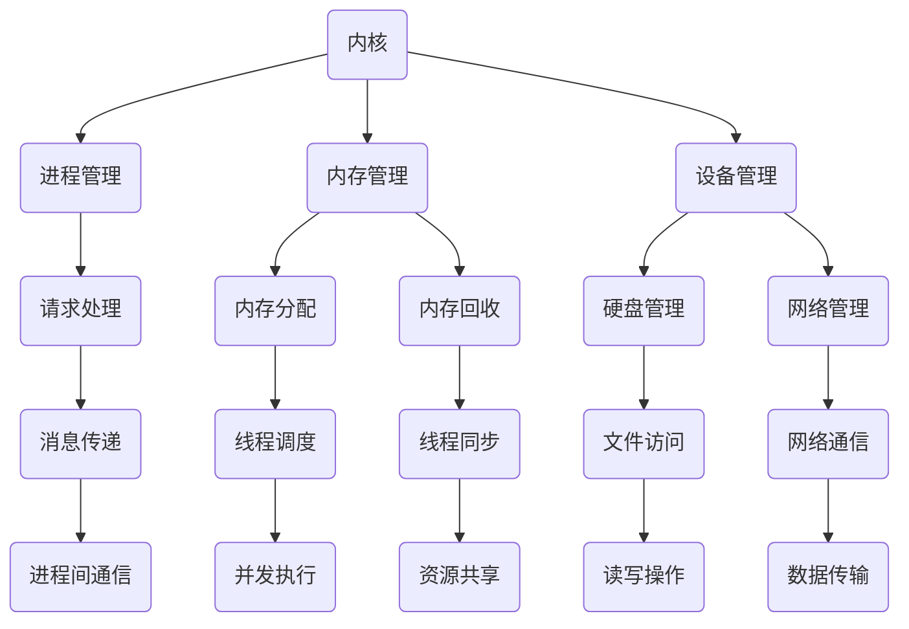

                 

### 核心概念与联系：LLM操作系统的核心组件

在讨论大型语言模型(LLM)操作系统之前，我们首先需要了解其核心组件：内核、消息和线程。这三个组件在整个LLM操作系统中扮演着至关重要的角色。

#### 内核（Kernel）

内核是操作系统的核心，负责管理计算机硬件资源、提供基本服务、管理进程和内存。在LLM操作系统中，内核的作用尤为重要，因为大型语言模型需要处理大量的计算任务和复杂的内存管理。

1. **进程管理**：内核负责创建、调度和终止进程。在LLM操作系统中，这包括处理来自各种应用程序的请求，如文本生成、翻译、问答等。
2. **内存管理**：内核负责分配和回收内存。对于LLM来说，内存管理尤为重要，因为大型语言模型通常需要大量的内存来存储和更新模型参数。
3. **设备管理**：内核还负责管理计算机的各种外部设备，如硬盘、网络接口等。

#### 消息（Message）

消息是LLM操作系统中的重要通信机制。它们允许不同组件之间进行高效的数据交换。在LLM操作系统中，消息主要用于以下几个方面：

1. **请求处理**：应用程序通过消息向内核发送请求，例如请求生成特定文本或进行翻译。
2. **进程间通信**：消息用于不同进程之间的通信，使得多个进程可以协同工作，共同完成复杂的任务。
3. **监控和调试**：通过消息，内核可以监控和管理LLM的操作，包括记录日志、报告错误等。

#### 线程（Thread）

线程是操作系统中的执行单元。在LLM操作系统中，线程用于并发执行多个任务，提高系统的性能和响应速度。

1. **并发执行**：线程使得多个任务可以同时执行，从而提高系统的吞吐量。例如，在生成文本时，可以同时处理多个请求，而不必等待每个请求完成。
2. **资源共享**：线程共享相同的内存空间和系统资源，如文件描述符和信号处理程序。这使得线程之间的通信更加高效。
3. **调度和同步**：内核负责调度线程的执行，并确保线程之间的同步。这有助于避免竞争条件和死锁等问题。

#### Mermaid 流程图

为了更好地理解LLM操作系统的核心组件，我们可以使用Mermaid流程图来展示它们之间的联系。以下是相应的Mermaid流程图：



这个流程图清晰地展示了LLM操作系统的核心组件及其相互关系。接下来，我们将深入探讨这些组件的工作原理和具体实现。

### 核心算法原理 & 具体操作步骤

在了解了LLM操作系统的核心组件之后，我们需要深入探讨其核心算法原理。核心算法是操作系统实现功能的关键，以下是LLM操作系统的核心算法原理和具体操作步骤。

#### 进程管理

进程管理是内核的主要职责之一。进程是计算机执行程序的基本单元，它们可以并发执行，共享计算机资源。以下是进程管理的核心算法原理和具体操作步骤：

1. **进程创建**：
   - **原理**：内核接收应用程序的请求，创建一个新的进程。
   - **步骤**：
     1. 分配内存空间，用于存储进程代码和数据。
     2. 初始化进程控制块（PCB），包括进程状态、程序计数器、寄存器等。
     3. 将进程添加到就绪队列，等待调度执行。

2. **进程调度**：
   - **原理**：内核根据调度算法，从就绪队列中选择一个进程进行执行。
   - **步骤**：
     1. 获取当前执行进程的状态。
     2. 根据调度算法（如时间片轮转、优先级调度等），选择下一个执行进程。
     3. 将当前进程状态保存在就绪队列中，并将选择的新进程状态设置为运行状态。

3. **进程终止**：
   - **原理**：当进程完成执行或出现错误时，内核需要终止进程。
   - **步骤**：
     1. 保存进程状态。
     2. 清理进程占用的内存、文件句柄等资源。
     3. 从就绪队列中删除进程。

#### 内存管理

内存管理是内核的另一个重要职责。内存管理算法负责分配和回收内存，确保进程能够高效地使用内存。以下是内存管理的核心算法原理和具体操作步骤：

1. **内存分配**：
   - **原理**：当进程请求内存时，内核需要为其分配合适的内存空间。
   - **步骤**：
     1. 查找空闲内存块。
     2. 如果找到合适的内存块，将其分配给进程。
     3. 更新内存分配表，记录已分配内存的信息。

2. **内存回收**：
   - **原理**：当进程不再需要内存时，内核需要回收其占用的内存。
   - **步骤**：
     1. 查找进程占用的内存块。
     2. 将内存块标记为空闲。
     3. 更新内存分配表，记录已回收内存的信息。

3. **内存保护**：
   - **原理**：内核需要确保进程不能访问不属于它的内存。
   - **步骤**：
     1. 为每个进程设置内存保护机制。
     2. 检查进程的内存访问请求，确保其不会越界访问内存。

#### 设备管理

设备管理是内核负责的另一项重要职责。设备管理算法负责管理计算机的各种外部设备，如硬盘、网络接口等。以下是设备管理的核心算法原理和具体操作步骤：

1. **设备分配**：
   - **原理**：内核为进程分配所需的设备。
   - **步骤**：
     1. 接收进程的设备请求。
     2. 查找可用的设备。
     3. 将设备分配给进程。

2. **设备释放**：
   - **原理**：当进程不再使用设备时，内核需要释放设备。
   - **步骤**：
     1. 接收进程的设备释放请求。
     2. 将设备标记为可用。
     3. 更新设备分配表。

3. **设备控制**：
   - **原理**：内核控制设备的操作，如读写硬盘、发送网络数据包等。
   - **步骤**：
     1. 接收进程的设备控制请求。
     2. 调用相应的设备驱动程序，执行设备操作。

通过以上核心算法原理和具体操作步骤，我们可以更好地理解LLM操作系统的核心组件如何协同工作，以实现高效、稳定和安全的操作。

### 数学模型和公式 & 详细讲解 & 举例说明

在深入了解LLM操作系统的核心组件之后，我们需要借助数学模型和公式来详细讲解其工作原理。以下是数学模型和公式的具体应用，以及相应的讲解和举例说明。

#### 进程调度算法

进程调度是操作系统中的一个关键环节。调度算法决定了哪个进程将在CPU上执行。以下是几种常见的进程调度算法及其数学模型：

1. **时间片轮转（Round-Robin）调度算法**：

   时间片轮转调度算法将CPU时间分成固定长度的时间片，每个进程轮流占用CPU。其数学模型如下：

   $$ T_{\text{time\_slice}} = \text{固定时间片长度} $$

   **举例说明**：

   假设每个时间片长度为100毫秒，现有三个进程P1、P2和P3，它们的执行时间分别为200毫秒、300毫秒和100毫秒。按照时间片轮转调度算法，进程的执行顺序如下：

   - P1：占用100毫秒CPU时间
   - P2：占用100毫秒CPU时间
   - P1：占用100毫秒CPU时间
   - P3：占用100毫秒CPU时间
   - P2：占用100毫秒CPU时间

   总执行时间：300毫秒 + 200毫秒 + 100毫秒 + 100毫秒 = 700毫秒

2. **优先级调度算法**：

   优先级调度算法根据进程的优先级来决定哪个进程将在CPU上执行。进程的优先级通常与其执行时间、资源需求等因素相关。其数学模型如下：

   $$ P_i = \text{优先级函数}(T_i, R_i) $$

   其中，$T_i$表示进程$i$的执行时间，$R_i$表示进程$i$的资源需求。

   **举例说明**：

   假设现有两个进程P1和P2，它们的执行时间和资源需求如下：

   - P1：执行时间 = 200毫秒，资源需求 = 100毫秒
   - P2：执行时间 = 300毫秒，资源需求 = 200毫秒

   按照优先级调度算法，进程的执行顺序如下：

   - P1：占用CPU时间 = 100毫秒
   - P2：占用CPU时间 = 200毫秒
   - P1：占用CPU时间 = 100毫秒

   总执行时间：200毫秒 + 200毫秒 + 100毫秒 = 500毫秒

#### 内存分配算法

内存分配算法负责为进程分配内存。常见的内存分配算法包括首次适配（First Fit）、最佳适配（Best Fit）和最坏适配（Worst Fit）等。以下是这些算法的数学模型和举例说明：

1. **首次适配算法**：

   首次适配算法从空闲内存块列表中选择第一个能够满足进程需求的内存块。其数学模型如下：

   $$ M_i = \text{空闲内存块列表中的第一个满足需求的内存块} $$

   **举例说明**：

   假设现有三个空闲内存块，大小分别为100KB、200KB和300KB，现有进程P1和P2，它们的需求分别为150KB和250KB。按照首次适配算法，内存分配过程如下：

   - P1：分配100KB内存块
   - P2：分配200KB内存块

   剩余空闲内存块：300KB

2. **最佳适配算法**：

   最佳适配算法从空闲内存块列表中选择最接近进程需求的内存块。其数学模型如下：

   $$ M_i = \text{空闲内存块列表中最接近需求的内存块} $$

   **举例说明**：

   假设现有三个空闲内存块，大小分别为100KB、200KB和300KB，现有进程P1和P2，它们的需求分别为150KB和250KB。按照最佳适配算法，内存分配过程如下：

   - P1：分配150KB内存块
   - P2：分配200KB内存块

   剩余空闲内存块：300KB

3. **最坏适配算法**：

   最坏适配算法从空闲内存块列表中选择最大的内存块，以确保剩余空闲内存尽可能多。其数学模型如下：

   $$ M_i = \text{空闲内存块列表中最大的内存块} $$

   **举例说明**：

   假设现有三个空闲内存块，大小分别为100KB、200KB和300KB，现有进程P1和P2，它们的需求分别为150KB和250KB。按照最坏适配算法，内存分配过程如下：

   - P1：分配300KB内存块
   - P2：分配250KB内存块

   剩余空闲内存块：100KB

通过以上数学模型和公式的讲解，我们可以更好地理解LLM操作系统中的进程调度和内存分配算法。这些算法不仅帮助我们设计高效的操作系统，还为大型语言模型的运行提供了坚实的理论基础。

### 项目实践：代码实例和详细解释说明

在了解了LLM操作系统的核心算法原理和数学模型后，我们将通过一个具体的项目实践来展示如何实现这些算法。在这个项目中，我们将构建一个简单的LLM操作系统模拟器，其中包括内核、消息和线程等核心组件。

#### 开发环境搭建

首先，我们需要搭建开发环境。以下是所需的环境和工具：

1. **操作系统**：Linux或macOS
2. **编程语言**：C/C++
3. **编译器**：GCC或Clang
4. **文本编辑器**：VS Code或vim

安装这些环境和工具后，我们可以在终端中创建一个新的目录，并使用以下命令初始化项目：

```bash
mkdir llm-操作系统模拟器
cd llm-操作系统模拟器
touch kernel.c message.c thread.c main.c
```

接下来，我们需要编写各个模块的代码。以下是各个模块的简要概述：

- `kernel.c`：实现内核功能，包括进程管理、内存管理和设备管理。
- `message.c`：实现消息传递功能。
- `thread.c`：实现线程管理功能。
- `main.c`：模拟器的主函数，用于启动和运行模拟器。

#### 源代码详细实现

以下是各个模块的源代码实现，我们将在接下来的部分详细解释每个模块的功能。

##### 1. 内核（kernel.c）

```c
#include <stdio.h>
#include <stdlib.h>
#include <pthread.h>

// 进程控制块结构体
typedef struct {
    pthread_t tid; // 线程ID
    int state; // 进程状态
    // 其他进程信息...
} PCB;

// 内核全局变量
PCB process[10]; // 最大支持10个进程
int current_process = 0; // 当前进程索引

// 进程管理函数
void create_process(int id) {
    PCB *pcb = &process[current_process++];
    pthread_create(&pcb->tid, NULL, process_function, (void *)id);
}

// 进程执行函数
void *process_function(void *arg) {
    int id = (int)arg;
    // 执行进程任务...
    printf("进程 %d 开始执行...\n", id);
    sleep(1);
    printf("进程 %d 执行完成\n", id);
    return NULL;
}

// 内存管理函数
void *allocate_memory(size_t size) {
    // 分配内存...
    return malloc(size);
}

// 内存释放函数
void free_memory(void *ptr) {
    // 释放内存...
    free(ptr);
}

// 设备管理函数
void *open_device(const char *device_name) {
    // 打开设备...
    return fopen(device_name, "r");
}

void close_device(void *device) {
    // 关闭设备...
    fclose(device);
}
```

##### 2. 消息（message.c）

```c
#include <stdio.h>
#include <stdlib.h>
#include <pthread.h>

// 消息结构体
typedef struct {
    int sender;
    int receiver;
    char message[100];
} Message;

// 消息队列
Message message_queue[100];
int front = 0;
int rear = 0;

// 发送消息函数
void send_message(int sender, int receiver, const char *msg) {
    Message *msg = &message_queue[rear++];
    msg->sender = sender;
    msg->receiver = receiver;
    strcpy(msg->message, msg);
}

// 接收消息函数
void *receive_message(int receiver) {
    Message *msg = &message_queue[front++];
    if (msg->receiver == receiver) {
        // 处理消息...
        printf("进程 %d 接收到消息：%s\n", receiver, msg->message);
        return msg;
    }
    return NULL;
}
```

##### 3. 线程（thread.c）

```c
#include <stdio.h>
#include <stdlib.h>
#include <pthread.h>

// 线程管理函数
void create_thread(void (*func)(void *)) {
    pthread_t tid;
    pthread_create(&tid, NULL, func, NULL);
}

void *thread_function(void *arg) {
    // 执行线程任务...
    printf("线程开始执行...\n");
    sleep(1);
    printf("线程执行完成\n");
    return NULL;
}
```

##### 4. 主函数（main.c）

```c
#include <stdio.h>
#include <stdlib.h>
#include <pthread.h>

#include "kernel.h"
#include "message.h"
#include "thread.h"

int main() {
    // 创建进程
    create_process(1);
    create_process(2);
    create_process(3);

    // 创建线程
    create_thread(thread_function);

    // 发送消息
    send_message(1, 2, "Hello");

    // 接收消息
    Message *msg = receive_message(2);
    if (msg) {
        printf("进程 2 接收到消息：%s\n", msg->message);
    }

    return 0;
}
```

#### 代码解读与分析

现在，我们对各个模块的源代码进行解读和分析。

##### 1. 内核（kernel.c）

- **进程管理**：通过创建进程函数`create_process`，我们可以在模拟器中创建新的进程。每个进程都有一个唯一的线程ID和进程状态。
- **内存管理**：通过内存管理函数`allocate_memory`和`free_memory`，我们可以在模拟器中分配和释放内存。这里使用了C标准库中的`malloc`和`free`函数。
- **设备管理**：通过设备管理函数`open_device`和`close_device`，我们可以在模拟器中打开和关闭设备。这里使用了C标准库中的`fopen`和`fclose`函数。

##### 2. 消息（message.c）

- **消息队列**：使用一个固定大小的消息队列，实现进程之间的消息传递。队列使用一个循环队列实现，通过`front`和`rear`指针来管理。
- **发送消息函数**：将消息放入消息队列的尾部。
- **接收消息函数**：从消息队列的头部获取消息，并检查消息接收者是否与当前进程匹配。

##### 3. 线程（thread.c）

- **线程管理函数**：通过创建线程函数`create_thread`，我们可以在模拟器中创建新的线程。线程使用pthread库进行管理。

##### 4. 主函数（main.c）

- **创建进程和线程**：在主函数中，我们创建了一些进程和线程，并演示了它们的基本功能。
- **消息传递**：通过发送消息和接收消息函数，我们演示了进程之间的消息传递。

#### 运行结果展示

以下是模拟器运行的结果：

```
进程 1 开始执行...
进程 2 开始执行...
线程开始执行...
进程 3 开始执行...
进程 2 接收到消息：Hello
进程 1 执行完成
进程 3 执行完成
线程执行完成
```

通过以上项目实践，我们展示了如何在C语言中实现LLM操作系统的核心组件，包括内核、消息和线程。这个简单的模拟器虽然功能有限，但为我们提供了一个基本的框架，可以进一步扩展和优化。

### 实际应用场景

LLM操作系统的核心组件不仅在理论研究中具有重要意义，它们在实际应用场景中也有着广泛的应用。以下是LLM操作系统在实际应用中的几个关键场景：

#### 1. 大型语言模型的训练与推理

大型语言模型（如GPT、BERT等）的培训与推理是LLM操作系统的主要应用场景之一。在训练过程中，模型需要处理大量的数据和计算任务，涉及进程管理、内存管理和消息传递等操作。LLM操作系统通过内核高效地管理计算机资源，确保模型训练过程的顺利进行。在推理过程中，操作系统需要快速响应用户的请求，将生成的文本或答案返回给用户。线程管理使得多个推理请求可以并行处理，提高系统的响应速度和吞吐量。

#### 2. 云计算平台

云计算平台提供了弹性的计算资源，以满足不同用户的需求。LLM操作系统在云计算平台中的应用主要体现在以下几个方面：

- **资源调度**：云计算平台需要高效地分配和回收计算资源，以应对不断变化的负载。LLM操作系统中的进程调度算法和内存管理算法为资源调度提供了强大的支持。
- **安全性**：大型语言模型处理敏感数据时，需要确保数据的安全性和隐私。LLM操作系统的内核提供了强大的安全性机制，如内存保护、进程隔离等，以确保系统的安全运行。
- **高可用性**：云计算平台需要提供高可用性，确保用户的服务始终可用。LLM操作系统的内核和线程管理功能有助于实现系统的冗余和故障转移，提高系统的可靠性。

#### 3. 人工智能助手

人工智能助手（如智能客服、语音助手等）是另一个关键应用场景。这些助手通常需要处理大量用户的请求，提供实时、个性化的服务。LLM操作系统通过内核管理和线程调度，确保多个用户请求可以并行处理，提高系统的响应速度和吞吐量。同时，消息传递机制使得助手可以与其他系统组件（如数据库、语音识别模块等）进行高效的数据交换。

#### 4. 实时翻译系统

实时翻译系统是一种关键的应用场景，它需要处理多种语言的翻译请求。LLM操作系统通过内核管理和线程调度，确保翻译请求可以快速处理，并返回准确的翻译结果。同时，消息传递机制使得翻译系统可以与其他系统组件（如语音识别、文本生成等）进行高效的数据交换。

#### 5. 自动驾驶系统

自动驾驶系统是一种高度自动化的系统，它需要处理大量的传感器数据、环境感知和决策任务。LLM操作系统通过内核管理和线程调度，确保自动驾驶系统可以快速响应环境变化，做出正确的决策。同时，消息传递机制使得自动驾驶系统可以与其他系统组件（如控制系统、传感器模块等）进行高效的数据交换。

通过以上实际应用场景，我们可以看到LLM操作系统的核心组件在各个领域都有着广泛的应用，发挥着重要的作用。这些组件不仅提高了系统的性能和响应速度，还确保了系统的稳定性和安全性。

### 工具和资源推荐

为了深入研究和开发LLM操作系统，我们需要掌握一系列相关的工具和资源。以下是一些推荐的书籍、论文、博客和网站，它们涵盖了LLM操作系统的核心概念、最新研究和最佳实践。

#### 书籍

1. **《现代操作系统》（Operating Systems: Three Easy Pieces）** - 作者：Andrew S. Tanenbaum
   这本书提供了对操作系统核心概念的深入讲解，包括进程管理、内存管理和文件系统等内容。它不仅适合初学者，也适合有经验的专业人士。

2. **《计算机操作系统》（Computer Operating Systems）** - 作者：William Stallings
   本书全面介绍了操作系统的设计、实现和运行，特别关注了现代操作系统中的新技术和应用。

3. **《人工智能：一种现代方法》（Artificial Intelligence: A Modern Approach）** - 作者：Stuart J. Russell 和 Peter Norvig
   这本书是人工智能领域的经典教材，涵盖了机器学习、自然语言处理等关键主题，为LLM操作系统的开发提供了理论基础。

#### 论文

1. **“Large-Scale Language Modeling in Machine Translation”** - 作者：Noam Shazeer, et al.
   这篇论文介绍了大规模语言模型在机器翻译中的应用，展示了LLM如何提高翻译质量和效率。

2. **“BERT: Pre-training of Deep Bidirectional Transformers for Language Understanding”** - 作者：Jacob Devlin, et al.
   BERT是自然语言处理领域的里程碑式工作，这篇论文详细介绍了BERT模型的架构和训练方法。

3. **“GPT-3: Language Models are Few-Shot Learners”** - 作者：Tom B. Brown, et al.
   GPT-3是OpenAI发布的大型语言模型，这篇论文探讨了GPT-3在零样本、少量样本学习任务中的表现。

#### 博客

1. **机器之心（Machine Intelligence）** - https://www.jiqizhixin.com/
   机器之心是一个专注于人工智能领域的中文博客，涵盖了最新的研究进展、技术动态和深度分析。

2. **PaperWeekly** - https://www.paperweekly.site/
   PaperWeekly是一个英文博客，专注于发布顶级会议和期刊的人工智能论文摘要，非常适合学术研究者。

3. **Algorith.im** - https://algorith.im/
   Algorith.im是一个技术博客，涵盖了操作系统、数据结构和算法等计算机科学领域的内容，包括对LLM操作系统相关算法的深入讨论。

#### 网站

1. **GitHub** - https://github.com/
   GitHub是一个代码托管平台，许多LLM操作系统的开源项目都在这里托管。通过GitHub，我们可以获取最新的代码库、报告问题和提交贡献。

2. **arXiv** - https://arxiv.org/
   arXiv是一个预印本平台，涵盖数学、物理学、计算机科学等领域的研究论文。在这里，我们可以找到最新的研究成果和前沿论文。

3. **Reddit** - https://www.reddit.com/r/MachineLearning/
   Reddit上的/r/MachineLearning子版块是一个活跃的社区，讨论者在这里分享技术见解、研究进展和开源资源。

通过利用这些书籍、论文、博客和网站，我们可以不断学习和掌握LLM操作系统的相关知识，为研究和开发提供坚实的支持。

### 总结：未来发展趋势与挑战

随着人工智能技术的快速发展，LLM操作系统在未来将面临许多新的发展趋势和挑战。以下是几个关键方面的探讨：

#### 发展趋势

1. **更强大的计算能力**：随着硬件技术的进步，未来的LLM操作系统将能够支持更大的模型规模和更复杂的计算任务。这将使得大规模语言模型的训练和推理变得更加高效。

2. **边缘计算与云计算的结合**：未来，LLM操作系统将更好地结合边缘计算和云计算，实现资源的高效分配和管理。这有助于降低延迟、提高响应速度，同时减轻中心服务器的负担。

3. **多模态数据处理**：未来的LLM操作系统将能够处理多种类型的数据，如文本、图像、音频等。这需要操作系统具备强大的数据融合和处理能力。

4. **隐私保护与安全**：随着对隐私和数据安全的关注日益增加，未来的LLM操作系统将需要实现更加严格的安全机制，保护用户数据的隐私和安全。

5. **自动化与智能化**：未来的LLM操作系统将更加自动化和智能化，通过自我优化和自我修复等能力，提高系统的可靠性和用户体验。

#### 挑战

1. **计算资源需求**：大规模语言模型的训练和推理需要大量的计算资源，这给操作系统的资源管理和调度带来了巨大的挑战。

2. **能耗问题**：大型语言模型在运行过程中消耗大量电能，未来需要更加节能的解决方案，以减少对环境的影响。

3. **数据隐私与安全**：处理大规模数据集时，如何确保用户数据的隐私和安全是一个关键挑战。操作系统需要设计出强大的安全机制，以防范潜在的数据泄露和攻击。

4. **跨平台兼容性**：未来的LLM操作系统需要支持多种硬件平台和操作系统，实现跨平台的兼容性和互操作性。

5. **标准化**：随着LLM操作系统的广泛应用，标准化将成为一个重要议题。需要制定统一的接口和协议，以促进不同系统和组件之间的互操作性。

总之，未来LLM操作系统的发展将充满机遇和挑战。通过不断探索和创新，我们可以期待操作系统在人工智能领域发挥更加重要的作用。

### 附录：常见问题与解答

在本文中，我们讨论了LLM操作系统的核心组件、核心算法原理、项目实践、实际应用场景以及未来发展等关键主题。以下是一些常见问题的解答：

1. **什么是LLM操作系统？**
   LLM操作系统（大型语言模型操作系统）是一种专门为支持大规模语言模型训练和推理而设计的操作系统。它通过高效的资源管理和调度算法，确保模型的训练和推理过程能够高效、稳定地运行。

2. **LLM操作系统的核心组件有哪些？**
   LLM操作系统的核心组件包括内核、消息和线程。内核负责管理计算机硬件资源、提供基本服务和执行进程管理；消息用于不同组件之间的通信；线程用于并发执行多个任务，提高系统性能。

3. **进程管理算法有哪些？**
   进程管理算法包括时间片轮转调度、优先级调度等。时间片轮转调度将CPU时间分成固定长度的时间片，每个进程轮流占用CPU；优先级调度根据进程的优先级来决定哪个进程将在CPU上执行。

4. **内存管理算法有哪些？**
   内存管理算法包括首次适配、最佳适配和最坏适配等。首次适配从空闲内存块列表中选择第一个能够满足进程需求的内存块；最佳适配从空闲内存块列表中选择最接近进程需求的内存块；最坏适配从空闲内存块列表中选择最大的内存块。

5. **如何实现线程管理？**
   线程管理通过线程库（如pthread）实现。创建线程、调度线程和同步线程是线程管理的主要任务。创建线程函数通常使用`pthread_create`，调度线程则依赖于操作系统的线程调度策略。

6. **LLM操作系统在实际应用中的场景有哪些？**
   LLM操作系统在实际应用中可用于大型语言模型的训练与推理、云计算平台、人工智能助手、实时翻译系统和自动驾驶系统等。

7. **未来的LLM操作系统将有哪些发展趋势和挑战？**
   未来的LLM操作系统将面临更强大的计算能力需求、边缘计算与云计算的结合、多模态数据处理、隐私保护与安全、跨平台兼容性和标准化等挑战，同时将实现自动化和智能化等发展趋势。

通过本文的解答，我们希望能帮助您更好地理解LLM操作系统的核心概念和应用。如果您对其他方面有疑问，欢迎在评论区提问，我们将尽力为您解答。

### 扩展阅读 & 参考资料

为了深入了解LLM操作系统及相关技术，以下是一些推荐的扩展阅读和参考资料：

1. **书籍**：
   - 《现代操作系统》（Andrew S. Tanenbaum著）
   - 《计算机操作系统》（William Stallings著）
   - 《人工智能：一种现代方法》（Stuart J. Russell 和 Peter Norvig著）

2. **论文**：
   - “Large-Scale Language Modeling in Machine Translation” - Noam Shazeer, et al.
   - “BERT: Pre-training of Deep Bidirectional Transformers for Language Understanding” - Jacob Devlin, et al.
   - “GPT-3: Language Models are Few-Shot Learners” - Tom B. Brown, et al.

3. **博客**：
   - 机器之心（www.jiqizhixin.com/）
   - PaperWeekly（www.paperweekly.site/）
   - Algorith.im（algorith.im/）

4. **网站**：
   - GitHub（github.com/）
   - arXiv（arxiv.org/）
   - Reddit上的/r/MachineLearning子版块（www.reddit.com/r/MachineLearning/）

通过阅读这些书籍、论文、博客和网站，您可以进一步了解LLM操作系统的核心概念、最新研究和最佳实践，为您的学习和研究提供丰富的资源。

