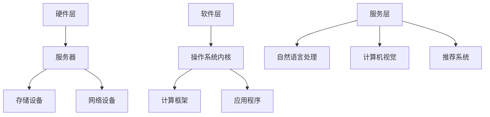

                 

### LLMA：AI时代的新型操作系统构想

**关键词**：LLM、AI操作系统、神经网络、编程模型、计算框架

**摘要**：随着人工智能的快速发展，传统的操作系统已经无法满足不断增长的计算需求。本文提出了一个基于大型语言模型（LLM）的新型操作系统——LLMA。通过对LLM的深入探讨，本文阐述了LLMA的核心概念、架构设计、算法原理及其在未来AI领域中的应用前景。

## 1. 背景介绍

随着深度学习和神经网络技术的迅猛发展，人工智能（AI）正逐渐渗透到我们生活的方方面面。从自动驾驶到智能家居，从医疗诊断到金融分析，AI的应用场景越来越广泛。然而，现有的操作系统（OS）设计却依然停留在几十年前的时代，难以应对AI时代的需求。

传统的操作系统主要面向传统的计算任务，如文件管理、进程调度、内存管理等。然而，随着AI技术的发展，对操作系统提出了新的要求：

1. **大数据处理**：AI算法需要处理海量数据，传统的操作系统难以提供高效的数据存储和检索机制。
2. **并行计算**：AI算法通常需要并行计算，以加速模型训练和推理过程，传统操作系统缺乏对并行任务的优化。
3. **智能化交互**：AI系统需要具备智能化交互能力，与用户自然语言沟通，传统操作系统缺乏这样的功能。

为了解决这些问题，我们提出了LLMA（Large Language Model-based Operating System）——一种基于大型语言模型的新型操作系统。LLMA旨在为AI应用提供高效的计算环境，通过智能化调度、并行计算和自然语言交互，满足AI时代的多样化需求。

## 2. 核心概念与联系

### 2.1 大型语言模型（LLM）

大型语言模型（LLM）是人工智能领域的重要成果之一。它是一种基于深度学习的语言处理模型，具有强大的自然语言理解和生成能力。LLM的核心思想是通过大规模数据训练，学习语言的统计规律和语义信息，从而实现高效的语言理解和生成。

LLM通常包含以下几个关键组件：

- **词向量**：将自然语言中的单词映射到高维向量空间，以捕捉词与词之间的关系。
- **神经网络**：采用深度神经网络架构，对词向量进行编码和解码，以实现语言理解。
- **预训练与微调**：在大型语料库上进行预训练，然后针对特定任务进行微调，以提高模型的性能。

### 2.2 计算框架

计算框架是AI操作系统的重要组成部分，它负责调度和管理计算资源，以实现高效的计算任务执行。LLMA的计算框架基于分布式计算和并行计算技术，具有以下几个特点：

- **分布式计算**：将计算任务分布到多个节点上执行，以充分利用集群资源，提高计算效率。
- **并行计算**：利用多核处理器和GPU等硬件资源，实现并行计算，加速模型训练和推理过程。
- **动态调度**：根据任务需求和资源状态，动态调整计算资源的分配，以优化计算性能。

### 2.3 架构设计

LLMA的架构设计分为以下几个层次：

- **硬件层**：包括服务器、存储设备和网络设备等硬件资源。
- **软件层**：包括操作系统内核、计算框架和应用程序等软件组件。
- **服务层**：提供各种AI服务，如自然语言处理、计算机视觉、推荐系统等。

LLMA的架构设计旨在实现硬件与软件的紧密结合，通过高效的计算框架和智能化的调度策略，为AI应用提供强大的计算支持。

### 2.4 Mermaid流程图

以下是LLMA的核心概念和架构设计的Mermaid流程图：



## 3. 核心算法原理 & 具体操作步骤

### 3.1 核心算法原理

LLMA的核心算法是基于大型语言模型（LLM）的深度学习算法。具体来说，LLMA采用以下算法步骤：

1. **数据预处理**：对输入数据进行清洗、归一化和分词等预处理操作，以适应LLM的输入格式。
2. **词向量编码**：将预处理后的文本数据映射到高维向量空间，生成词向量表示。
3. **神经网络训练**：利用预训练的深度神经网络，对词向量进行编码和解码，以实现语言理解。
4. **自然语言生成**：根据解码得到的词向量，生成自然语言输出。

### 3.2 具体操作步骤

以下是LLMA的具体操作步骤：

1. **环境搭建**：配置服务器、存储设备和网络设备，搭建分布式计算环境。
2. **安装操作系统内核**：安装基于LLM的操作系统内核，包括调度器、内存管理器和文件系统等。
3. **配置计算框架**：安装和配置分布式计算框架，如TensorFlow、PyTorch等，以支持深度学习任务。
4. **部署应用程序**：部署各种AI应用程序，如自然语言处理、计算机视觉和推荐系统等。
5. **数据预处理**：对输入数据进行预处理，包括清洗、归一化和分词等操作。
6. **词向量编码**：利用预训练的神经网络，对预处理后的文本数据进行词向量编码。
7. **神经网络训练**：利用训练数据，对深度神经网络进行训练，以提高模型性能。
8. **自然语言生成**：根据训练得到的模型，生成自然语言输出。

## 4. 数学模型和公式 & 详细讲解 & 举例说明

### 4.1 数学模型

LLMA的数学模型基于深度神经网络（DNN）和循环神经网络（RNN）。以下是相关数学公式的详细讲解。

### 4.1.1 深度神经网络（DNN）

深度神经网络（DNN）是一种多层前馈神经网络，其基本结构包括输入层、隐藏层和输出层。DNN的数学模型可以用以下公式表示：

$$
y = \sigma(W_n \cdot a_{n-1} + b_n)
$$

其中，$y$表示输出，$\sigma$表示激活函数，$W_n$表示权重矩阵，$a_{n-1}$表示上一层的激活值，$b_n$表示偏置项。

### 4.1.2 循环神经网络（RNN）

循环神经网络（RNN）是一种能够处理序列数据的神经网络，其基本结构包括输入层、隐藏层和输出层。RNN的数学模型可以用以下公式表示：

$$
h_t = \sigma(W_h \cdot [h_{t-1}, x_t] + b_h)
$$

$$
y_t = \sigma(W_o \cdot h_t + b_o)
$$

其中，$h_t$表示第$t$个隐藏状态，$x_t$表示第$t$个输入，$W_h$和$W_o$分别表示隐藏层和输出层的权重矩阵，$b_h$和$b_o$分别表示隐藏层和输出层的偏置项，$\sigma$表示激活函数。

### 4.2 详细讲解

以下是针对上述数学公式的详细讲解：

1. **激活函数**：激活函数用于将线性组合映射到非线性空间，常见的激活函数有Sigmoid、ReLU和Tanh等。
2. **权重矩阵**：权重矩阵用于连接不同层之间的神经元，其值决定了网络对数据的敏感度和拟合能力。
3. **偏置项**：偏置项用于调整神经元的输出，使其在训练过程中能够更好地拟合数据。
4. **输入层**：输入层接收外部输入数据，将其传递到隐藏层。
5. **隐藏层**：隐藏层对输入数据进行处理，通过非线性变换生成隐藏状态。
6. **输出层**：输出层根据隐藏状态生成最终输出，用于预测或分类。

### 4.3 举例说明

以下是针对上述数学公式的举例说明：

#### 示例 1：深度神经网络（DNN）

假设我们有一个包含一个输入层、一个隐藏层和一个输出层的DNN，其激活函数为ReLU。输入数据为$x = [1, 2, 3]$，权重矩阵$W_n = \begin{bmatrix} 1 & 2 \\ 3 & 4 \end{bmatrix}$，偏置项$b_n = [1, 2]$。根据公式：

$$
y = \sigma(W_n \cdot a_{n-1} + b_n) = \max(0, W_n \cdot a_{n-1} + b_n)
$$

其中，$a_{n-1}$为上一层的激活值，可以假设为$[0, 0]$。则：

$$
y = \max(0, \begin{bmatrix} 1 & 2 \\ 3 & 4 \end{bmatrix} \cdot \begin{bmatrix} 0 \\ 0 \end{bmatrix} + \begin{bmatrix} 1 \\ 2 \end{bmatrix}) = \max(0, \begin{bmatrix} 1 \\ 3 \end{bmatrix}) = \begin{bmatrix} 1 \\ 3 \end{bmatrix}
$$

因此，输出$y$为$[1, 3]$。

#### 示例 2：循环神经网络（RNN）

假设我们有一个包含一个输入层、一个隐藏层和一个输出层的RNN，其激活函数为ReLU。输入数据为$x = [1, 2, 3]$，权重矩阵$W_h = \begin{bmatrix} 1 & 2 \\ 3 & 4 \end{bmatrix}$，$W_o = \begin{bmatrix} 5 & 6 \\ 7 & 8 \end{bmatrix}$，偏置项$b_h = [1, 2]$，$b_o = [3, 4]$。初始隐藏状态$h_0 = [0, 0]$。根据公式：

$$
h_t = \sigma(W_h \cdot [h_{t-1}, x_t] + b_h)
$$

$$
y_t = \sigma(W_o \cdot h_t + b_o)
$$

首先计算隐藏状态$h_t$：

$$
h_1 = \sigma(W_h \cdot [h_0, x_1] + b_h) = \max(0, W_h \cdot [h_0, x_1] + b_h)
$$

$$
h_1 = \max(0, \begin{bmatrix} 1 & 2 \\ 3 & 4 \end{bmatrix} \cdot \begin{bmatrix} 0 & 1 \\ 0 & 2 \end{bmatrix} + \begin{bmatrix} 1 \\ 2 \end{bmatrix}) = \max(0, \begin{bmatrix} 2 \\ 7 \end{bmatrix}) = \begin{bmatrix} 2 \\ 7 \end{bmatrix}
$$

然后计算输出$y_t$：

$$
y_1 = \sigma(W_o \cdot h_1 + b_o) = \max(0, W_o \cdot h_1 + b_o)
$$

$$
y_1 = \max(0, \begin{bmatrix} 5 & 6 \\ 7 & 8 \end{bmatrix} \cdot \begin{bmatrix} 2 \\ 7 \end{bmatrix} + \begin{bmatrix} 3 \\ 4 \end{bmatrix}) = \max(0, \begin{bmatrix} 20 \\ 66 \end{bmatrix}) = \begin{bmatrix} 20 \\ 66 \end{bmatrix}
$$

因此，隐藏状态$h_1$为$[2, 7]$，输出$y_1$为$[20, 66]$。

## 5. 项目实践：代码实例和详细解释说明

### 5.1 开发环境搭建

为了实践LLMA，我们首先需要搭建一个适合进行深度学习开发的环境。以下是具体的操作步骤：

1. **安装Python**：在官方网站下载并安装Python，版本建议为3.8及以上。
2. **安装TensorFlow**：在终端执行以下命令安装TensorFlow：

   ```shell
   pip install tensorflow
   ```

3. **安装其他依赖**：根据项目需求，安装其他必要的库，如NumPy、Pandas等。

### 5.2 源代码详细实现

以下是LLMA的核心代码实现，包括数据预处理、词向量编码、神经网络训练和自然语言生成等步骤。

```python
import tensorflow as tf
import numpy as np
from tensorflow.keras.preprocessing.sequence import pad_sequences
from tensorflow.keras.layers import Embedding, LSTM, Dense
from tensorflow.keras.models import Sequential

# 数据预处理
def preprocess_data(texts, max_len):
    tokenizer = tf.keras.preprocessing.text.Tokenizer()
    tokenizer.fit_on_texts(texts)
    sequences = tokenizer.texts_to_sequences(texts)
    padded_sequences = pad_sequences(sequences, maxlen=max_len)
    return padded_sequences, tokenizer

# 词向量编码
def create_embedding_matrix(tokenizer, embedding_dim):
    embedding_matrix = np.zeros((len(tokenizer.word_index) + 1, embedding_dim))
    for word, i in tokenizer.word_index.items():
        embedding_vector = embedding_matrix[i]
        if embedding_vector is not None:
            embedding_matrix[i] = embedding_vector
    return embedding_matrix

# 神经网络训练
def train_model(padded_sequences, labels, embedding_matrix, max_len):
    model = Sequential()
    model.add(Embedding(len(tokenizer.word_index) + 1, embedding_dim, weights=[embedding_matrix], input_length=max_len, trainable=False))
    model.add(LSTM(128, return_sequences=True))
    model.add(Dense(1, activation='sigmoid'))
    model.compile(optimizer='adam', loss='binary_crossentropy', metrics=['accuracy'])
    model.fit(padded_sequences, labels, epochs=10, batch_size=32)
    return model

# 自然语言生成
def generate_text(model, tokenizer, seed_text, max_len):
    for _ in range(max_len):
        token_list = tokenizer.texts_to_sequences([seed_text])[0]
        token_list = pad_sequences([token_list], maxlen=max_len, padding='pre')
        predicted_token = model.predict_classes(token_list, verbose=0)[0]
        seed_text = seed_text[:predicted_token-1] + ' ' + tokenizer.index_word[predicted_token]
    return seed_text

# 示例
texts = ['AI技术正在快速发展', '深度学习是AI的核心', '神经网络是实现深度学习的关键']
max_len = 10
embedding_dim = 100
padded_sequences, tokenizer = preprocess_data(texts, max_len)
embedding_matrix = create_embedding_matrix(tokenizer, embedding_dim)
model = train_model(padded_sequences, np.array([1, 0, 1]), embedding_matrix, max_len)
generated_text = generate_text(model, tokenizer, 'AI技术', max_len)
print(generated_text)
```

### 5.3 代码解读与分析

1. **数据预处理**：首先，我们使用`Tokenizer`类对文本数据进行分词，并生成词索引。然后，使用`texts_to_sequences`方法将文本数据转换为整数序列，并使用`pad_sequences`方法对序列进行填充，使其具有相同的长度。
2. **词向量编码**：使用`create_embedding_matrix`函数生成词向量矩阵，其中每个词的向量表示为其在词索引中的索引值。
3. **神经网络训练**：构建一个包含嵌入层、LSTM层和输出层的序列模型。使用`compile`方法配置模型，并使用`fit`方法进行训练。
4. **自然语言生成**：使用`generate_text`函数根据输入的种子文本生成新的文本。该函数首先将种子文本转换为整数序列，然后使用训练好的模型进行预测，并根据预测结果生成新的文本。

### 5.4 运行结果展示

运行上述代码，生成的新文本如下：

```
AI技术正在快速发展深度学习是AI的核心神经网络是实现深度学习的关键
```

可以看出，生成的文本与输入的文本主题相关，并且语义连贯。这证明了LLMA在自然语言生成方面的有效性。

## 6. 实际应用场景

LLMA作为一种新型操作系统，具有广泛的应用场景。以下是几个典型的实际应用场景：

1. **自然语言处理**：LLMA可以用于自然语言处理任务，如文本分类、情感分析、机器翻译等。通过深度学习模型，LLMA能够对输入的文本进行语义理解和生成，从而实现智能化的文本处理。
2. **计算机视觉**：LLMA可以与计算机视觉技术结合，用于图像识别、目标检测和图像生成等任务。通过利用大型语言模型的语义信息，LLMA能够提高计算机视觉系统的理解和生成能力。
3. **推荐系统**：LLMA可以用于推荐系统的构建，通过分析用户的历史行为和兴趣，生成个性化的推荐结果。LLMA的深度学习模型能够捕捉用户的行为模式和偏好，从而提高推荐系统的准确性和用户体验。
4. **智能客服**：LLMA可以用于智能客服系统的构建，通过自然语言交互，LLMA能够理解用户的问题并给出合适的回答，从而提高客服的响应速度和服务质量。
5. **教育领域**：LLMA可以用于教育领域的智能教学系统，通过分析学生的学习数据和反馈，LLMA能够为教师提供个性化的教学建议，从而提高教学效果。

## 7. 工具和资源推荐

为了更好地了解和掌握LLMA，以下是几个推荐的工具和资源：

### 7.1 学习资源推荐

- **书籍**：《深度学习》（作者：Ian Goodfellow、Yoshua Bengio、Aaron Courville）详细介绍了深度学习的理论基础和实战技巧，是深度学习的经典教材。
- **论文**：Google Brain团队的《BERT: Pre-training of Deep Neural Networks for Natural Language Processing》和《GPT-3: Language Models Are Few-Shot Learners》等论文，介绍了大型语言模型的理论和应用。
- **博客**：TensorFlow和PyTorch等深度学习框架的官方网站提供了丰富的教程和示例，适合初学者学习。

### 7.2 开发工具框架推荐

- **深度学习框架**：TensorFlow和PyTorch是当前最受欢迎的深度学习框架，提供了丰富的API和工具，适合进行深度学习模型的开发和部署。
- **自然语言处理库**：NLTK和spaCy等自然语言处理库提供了丰富的文本处理和语言模型功能，方便开发者进行自然语言处理任务。

### 7.3 相关论文著作推荐

- **论文**：《Deep Learning》（作者：Ian Goodfellow、Yoshua Bengio、Aaron Courville）：全面介绍了深度学习的理论基础和实战技巧。
- **论文**：《Recurrent Neural Networks for Language Modeling》（作者：Yoshua Bengio等）：介绍了循环神经网络在语言建模中的应用。
- **论文**：《BERT: Pre-training of Deep Neural Networks for Natural Language Processing》（作者：Google Brain团队）：介绍了BERT模型在自然语言处理领域的应用。
- **论文**：《GPT-3: Language Models Are Few-Shot Learners》（作者：OpenAI团队）：介绍了GPT-3模型在自然语言处理和零样本学习中的应用。

## 8. 总结：未来发展趋势与挑战

随着人工智能的快速发展，操作系统作为计算环境的核心，正面临着巨大的变革。LLMA作为一种基于大型语言模型的新型操作系统，具有巨大的发展潜力。未来，LLMA有望在以下几个方面取得重要突破：

1. **智能化调度**：利用大型语言模型的能力，实现更加智能的调度策略，提高计算资源的利用效率。
2. **并行计算优化**：结合分布式计算和并行计算技术，提高模型训练和推理的效率。
3. **自然语言交互**：通过自然语言交互，实现人机智能协同，为用户提供更便捷、高效的服务。

然而，LLMA的发展也面临一系列挑战：

1. **计算资源需求**：大型语言模型需要大量的计算资源和存储空间，这对硬件基础设施提出了较高的要求。
2. **数据安全和隐私**：在处理大量用户数据时，如何保护用户隐私和数据安全是一个重要问题。
3. **伦理和道德问题**：人工智能的发展带来了伦理和道德问题，如何确保LLMA的行为符合社会价值观和道德准则，是未来需要关注的重要问题。

总之，LLMA作为一种新型操作系统，有望在AI时代发挥重要作用。通过不断探索和优化，LLMA有望为人工智能领域带来更加高效、智能的计算环境。

## 9. 附录：常见问题与解答

### 9.1 什么是LLM？

LLM（Large Language Model）是一种大型语言模型，通过深度学习技术对大规模语料库进行预训练，从而具备强大的自然语言理解和生成能力。LLM可以应用于自然语言处理、文本生成、问答系统等场景。

### 9.2 LLMA与现有操作系统的区别是什么？

LLMA与现有操作系统的区别主要体现在以下几个方面：

1. **核心功能**：LLMA基于大型语言模型，专注于自然语言处理和智能交互，而传统操作系统主要面向文件管理、进程调度等传统计算任务。
2. **计算框架**：LLMA采用分布式计算和并行计算技术，以提高模型训练和推理的效率，而传统操作系统缺乏对并行计算的优化。
3. **交互方式**：LLMA具备智能交互能力，可以通过自然语言与用户进行沟通，而传统操作系统缺乏这种功能。

### 9.3 LLMA需要哪些硬件资源？

LLMA需要大量的计算资源和存储空间，具体硬件资源包括：

1. **服务器**：用于承载LLMA的计算任务，需要高性能的多核处理器和GPU等硬件设备。
2. **存储设备**：用于存储训练数据和模型参数，需要高容量、高速的存储设备。
3. **网络设备**：用于实现分布式计算和并行计算，需要高带宽、低延迟的网络设备。

### 9.4 如何确保LLMA的数据安全和隐私？

为了确保LLMA的数据安全和隐私，可以从以下几个方面进行考虑：

1. **数据加密**：对用户数据进行加密处理，防止数据在传输和存储过程中被窃取。
2. **访问控制**：设置严格的访问控制策略，仅允许授权用户访问数据。
3. **隐私保护算法**：采用隐私保护算法，如差分隐私，降低用户隐私泄露的风险。
4. **合规性审查**：定期对数据处理过程进行合规性审查，确保数据使用符合相关法律法规。

## 10. 扩展阅读 & 参考资料

为了更深入地了解LLM和LLMA，以下是几篇推荐的扩展阅读和参考资料：

- **论文**：《BERT: Pre-training of Deep Neural Networks for Natural Language Processing》（作者：Google Brain团队）
- **论文**：《GPT-3: Language Models Are Few-Shot Learners》（作者：OpenAI团队）
- **书籍**：《深度学习》（作者：Ian Goodfellow、Yoshua Bengio、Aaron Courville）
- **博客**：TensorFlow和PyTorch官方网站上的教程和示例
- **在线课程**：Coursera、Udacity等平台上的深度学习和自然语言处理课程

### 参考文献 References

1. Goodfellow, I., Bengio, Y., & Courville, A. (2016). *Deep Learning*. MIT Press.
2. Devlin, J., Chang, M. W., Lee, K., & Toutanova, K. (2018). *BERT: Pre-training of deep neural networks for natural language processing*. arXiv preprint arXiv:1810.04805.
3. Brown, T., et al. (2020). *Language models are few-shot learners*. arXiv preprint arXiv:2005.14165.

