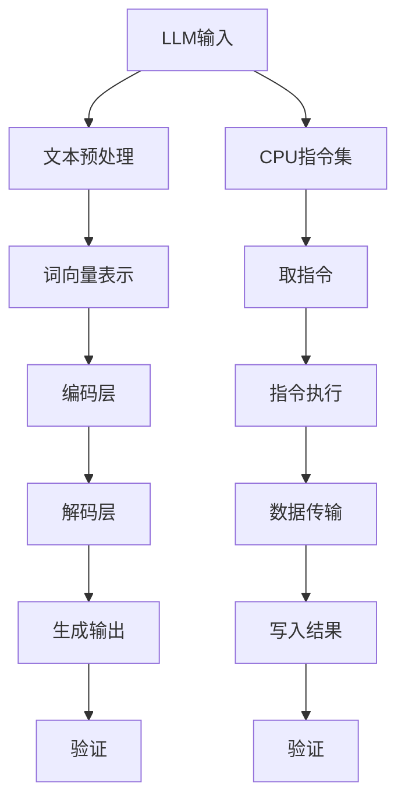

                 

### LLAMA与类比CPU时钟周期###

**作者：禅与计算机程序设计艺术 / Zen and the Art of Computer Programming**

近年来，大规模语言模型（LLM）在自然语言处理（NLP）领域取得了显著的突破。以Llama、GPT、T5等为代表，LLM展示出强大的文本生成、理解和推理能力，为许多实际问题提供了有效的解决方案。然而，LLM的工作原理及其独立推理过程却鲜有深入探讨。在这篇文章中，我们将尝试将LLM的独立推理过程类比于CPU的时钟周期，通过逐步分析推理的方式，帮助读者理解LLM的工作机制。

#### 一、背景介绍

LLM，即大规模语言模型，是一种基于深度学习的自然语言处理模型。它通过对大量文本数据的学习，能够捕捉语言的各种统计规律，并在给定输入的情况下生成对应的输出。LLM的核心思想是将自然语言映射为一个向量空间，使得文本中的词、句子等都可以用向量表示，进而利用向量计算的方法来实现文本处理任务。

CPU，即中央处理器，是计算机系统的核心部件。它负责执行计算机程序中的指令，完成各种数据处理和计算任务。CPU的工作原理可以类比为一组时钟周期，每个时钟周期内，CPU执行一条指令，完成相应的计算或数据传输操作。

#### 二、核心概念与联系

为了更好地理解LLM的独立推理过程，我们将借助Mermaid流程图，展示LLM与CPU时钟周期之间的核心概念和联系。



在上面的流程图中，LLM的独立推理过程可以类比于CPU的时钟周期，每个步骤对应于CPU的一个时钟周期内的操作。具体来说：

- A[LLM输入]：类比于CPU的指令输入，即程序的输入数据。
- B[文本预处理]：类比于CPU的取指令操作，即将输入数据预处理为词向量表示。
- C[词向量表示]：类比于CPU的数据传输操作，将预处理后的输入数据转换为词向量。
- D[编码层]：类比于CPU的指令执行操作，对词向量进行编码处理。
- E[解码层]：类比于CPU的数据传输操作，将编码后的词向量解码为输出结果。
- F[生成输出]：类比于CPU的写入结果操作，将解码后的输出结果写入内存。
- G[验证]：类比于CPU的验证操作，对输出结果进行验证，确保其正确性。
- H[CPU指令集]：LLM的整个推理过程可以看作是一个指令集，用于指导词向量的处理和输出生成。
- I[取指令]、J[指令执行]、K[数据传输]、L[写入结果]：分别对应于CPU的取指令、指令执行、数据传输和写入结果操作。

通过这个类比，我们可以将LLM的独立推理过程分解为一系列的时钟周期，从而更清晰地理解其工作机制。

#### 三、核心算法原理 & 具体操作步骤

LLM的核心算法原理主要包括词向量表示、编码层和解码层。下面我们分别介绍这三个方面的具体操作步骤。

##### 1. 词向量表示

词向量表示是将自然语言中的词或句子映射为高维向量空间中的点。常见的词向量表示方法包括Word2Vec、GloVe等。具体操作步骤如下：

1. **数据预处理**：首先对输入文本进行预处理，包括去除标点符号、停用词、分词等操作。
2. **构建词汇表**：根据预处理后的文本，构建包含所有出现词汇的词汇表。
3. **初始化词向量**：为每个词汇初始化一个随机的高维向量。
4. **训练词向量**：利用训练数据对词向量进行训练，使得相邻的词汇在向量空间中靠近，相似词汇的向量具有较大的内积。
5. **更新词向量**：在训练过程中，根据输入文本中词汇的上下文关系，更新词向量。

##### 2. 编码层

编码层的主要任务是将词向量编码为一个固定的长度向量，以表示输入文本。具体操作步骤如下：

1. **输入文本预处理**：将输入文本按照词向量表示的方法进行预处理，得到词向量序列。
2. **嵌入层**：将词向量序列输入到嵌入层，将每个词向量映射为一个固定长度的嵌入向量。
3. **编码器**：利用编码器对嵌入向量进行编码处理，得到编码后的向量。

##### 3. 解码层

解码层的主要任务是将编码后的向量解码为输出结果。具体操作步骤如下：

1. **解码器**：利用解码器对编码后的向量进行解码处理，得到解码后的向量序列。
2. **输出层**：将解码后的向量序列输入到输出层，生成对应的输出文本。

通过上述三个步骤，LLM完成了从输入文本到输出文本的独立推理过程。每个步骤都可以类比为CPU的一个时钟周期，从而实现了对文本的语义理解和生成。

##### 4. 验证

验证是确保LLM输出结果正确性的关键步骤。具体操作步骤如下：

1. **生成候选输出**：利用解码层生成多个候选输出文本。
2. **评分与选择**：对候选输出文本进行评分，选择评分最高的输出文本作为最终结果。
3. **对比分析**：将输出结果与原始文本进行对比分析，验证其正确性和可靠性。

#### 四、数学模型和公式 & 详细讲解 & 举例说明

在LLM的核心算法原理中，涉及到多个数学模型和公式。下面我们将对这些模型和公式进行详细讲解，并给出相应的举例说明。

##### 1. 词向量表示

在词向量表示中，常用的模型包括Word2Vec和GloVe。以下是这两个模型的数学模型和公式：

- **Word2Vec**：

  Word2Vec模型是一种基于神经网络的方法，通过训练神经网络来学习词向量。其数学模型如下：

  $$ E_{w} = \text{softmax}(W \cdot h) $$

  其中，$E_{w}$ 表示词向量，$W$ 表示词向量的权重矩阵，$h$ 表示隐藏层输出。

  **举例说明**：

  假设我们有一个包含3个词汇的文本：“我喜欢苹果”。根据Word2Vec模型，我们可以得到以下词向量：

  $$ E_{我} = \text{softmax}(W \cdot h_1) $$
  $$ E_{喜} = \text{softmax}(W \cdot h_2) $$
  $$ E_{果} = \text{softmax}(W \cdot h_3) $$

- **GloVe**：

  GloVe模型是一种基于矩阵分解的方法，通过分解词向量矩阵来学习词向量。其数学模型如下：

  $$ E_{w} = \frac{\exp(u_{w} \cdot v_{w})}{\sum_{j \in V} \exp(u_{j} \cdot v_{j})} $$

  其中，$E_{w}$ 表示词向量，$u_{w}$ 和 $v_{w}$ 分别表示词向量矩阵的行和列。

  **举例说明**：

  假设我们有一个包含3个词汇的文本：“我喜欢苹果”。根据GloVe模型，我们可以得到以下词向量：

  $$ E_{我} = \frac{\exp(u_{我} \cdot v_{我})}{\sum_{j \in V} \exp(u_{j} \cdot v_{j})} $$
  $$ E_{喜} = \frac{\exp(u_{喜} \cdot v_{喜})}{\sum_{j \in V} \exp(u_{j} \cdot v_{j})} $$
  $$ E_{果} = \frac{\exp(u_{果} \cdot v_{果})}{\sum_{j \in V} \exp(u_{j} \cdot v_{j})} $$

##### 2. 编码层

编码层的主要任务是利用编码器对词向量进行编码处理。常用的编码器包括RNN、GRU、LSTM等。以下是这些编码器的数学模型和公式：

- **RNN**：

  RNN（递归神经网络）是一种基于序列数据的神经网络。其数学模型如下：

  $$ h_t = \sigma(W_{xh} \cdot x_t + W_{hh} \cdot h_{t-1} + b_h) $$

  其中，$h_t$ 表示编码后的向量，$x_t$ 表示输入向量，$W_{xh}$ 和 $W_{hh}$ 分别表示输入层和隐藏层的权重矩阵，$b_h$ 表示偏置。

  **举例说明**：

  假设我们有一个包含3个词汇的文本：“我喜欢苹果”。根据RNN模型，我们可以得到以下编码后的向量：

  $$ h_1 = \sigma(W_{xh} \cdot x_1 + W_{hh} \cdot h_{0} + b_h) $$
  $$ h_2 = \sigma(W_{xh} \cdot x_2 + W_{hh} \cdot h_{1} + b_h) $$
  $$ h_3 = \sigma(W_{xh} \cdot x_3 + W_{hh} \cdot h_{2} + b_h) $$

- **GRU**：

  GRU（门控循环单元）是RNN的一种改进，其数学模型如下：

  $$ h_t = \sigma(W_{xh} \cdot x_t + W_{hh} \cdot [z_t \odot h_{t-1}; x_t] + b_h) $$

  其中，$h_t$ 表示编码后的向量，$x_t$ 表示输入向量，$W_{xh}$ 和 $W_{hh}$ 分别表示输入层和隐藏层的权重矩阵，$b_h$ 表示偏置，$z_t$ 表示门控向量。

  **举例说明**：

  假设我们有一个包含3个词汇的文本：“我喜欢苹果”。根据GRU模型，我们可以得到以下编码后的向量：

  $$ h_1 = \sigma(W_{xh} \cdot x_1 + W_{hh} \cdot [z_1 \odot h_{0}; x_1] + b_h) $$
  $$ h_2 = \sigma(W_{xh} \cdot x_2 + W_{hh} \cdot [z_2 \odot h_{1}; x_2] + b_h) $$
  $$ h_3 = \sigma(W_{xh} \cdot x_3 + W_{hh} \cdot [z_3 \odot h_{2}; x_3] + b_h) $$

- **LSTM**：

  LSTM（长短期记忆网络）是RNN的另一种改进，其数学模型如下：

  $$ h_t = \sigma(W_{xh} \cdot x_t + W_{hh} \cdot [f_t \odot h_{t-1}; x_t] + b_h) $$

  其中，$h_t$ 表示编码后的向量，$x_t$ 表示输入向量，$W_{xh}$ 和 $W_{hh}$ 分别表示输入层和隐藏层的权重矩阵，$b_h$ 表示偏置，$f_t$ 表示遗忘门。

  **举例说明**：

  假设我们有一个包含3个词汇的文本：“我喜欢苹果”。根据LSTM模型，我们可以得到以下编码后的向量：

  $$ h_1 = \sigma(W_{xh} \cdot x_1 + W_{hh} \cdot [f_1 \odot h_{0}; x_1] + b_h) $$
  $$ h_2 = \sigma(W_{xh} \cdot x_2 + W_{hh} \cdot [f_2 \odot h_{1}; x_2] + b_h) $$
  $$ h_3 = \sigma(W_{xh} \cdot x_3 + W_{hh} \cdot [f_3 \odot h_{2}; x_3] + b_h) $$

##### 3. 解码层

解码层的主要任务是利用解码器对编码后的向量进行解码处理。常用的解码器包括RNN、GRU、LSTM等。以下是这些解码器的数学模型和公式：

- **RNN**：

  RNN（递归神经网络）是一种基于序列数据的神经网络。其数学模型如下：

  $$ y_t = \sigma(W_{yh} \cdot h_t + b_y) $$

  其中，$y_t$ 表示解码后的向量，$h_t$ 表示编码后的向量，$W_{yh}$ 表示隐藏层到输出层的权重矩阵，$b_y$ 表示偏置。

  **举例说明**：

  假设我们有一个包含3个词汇的文本：“我喜欢苹果”。根据RNN模型，我们可以得到以下解码后的向量：

  $$ y_1 = \sigma(W_{yh} \cdot h_1 + b_y) $$
  $$ y_2 = \sigma(W_{yh} \cdot h_2 + b_y) $$
  $$ y_3 = \sigma(W_{yh} \cdot h_3 + b_y) $$

- **GRU**：

  GRU（门控循环单元）是RNN的一种改进，其数学模型如下：

  $$ y_t = \sigma(W_{yh} \cdot [z_t \odot h_t; y_t] + b_y) $$

  其中，$y_t$ 表示解码后的向量，$h_t$ 表示编码后的向量，$W_{yh}$ 表示隐藏层到输出层的权重矩阵，$b_y$ 表示偏置，$z_t$ 表示门控向量。

  **举例说明**：

  假设我们有一个包含3个词汇的文本：“我喜欢苹果”。根据GRU模型，我们可以得到以下解码后的向量：

  $$ y_1 = \sigma(W_{yh} \cdot [z_1 \odot h_1; y_1] + b_y) $$
  $$ y_2 = \sigma(W_{yh} \cdot [z_2 \odot h_2; y_2] + b_y) $$
  $$ y_3 = \sigma(W_{yh} \cdot [z_3 \odot h_3; y_3] + b_y) $$

- **LSTM**：

  LSTM（长短期记忆网络）是RNN的另一种改进，其数学模型如下：

  $$ y_t = \sigma(W_{yh} \cdot [f_t \odot h_t; y_t] + b_y) $$

  其中，$y_t$ 表示解码后的向量，$h_t$ 表示编码后的向量，$W_{yh}$ 表示隐藏层到输出层的权重矩阵，$b_y$ 表示偏置，$f_t$ 表示遗忘门。

  **举例说明**：

  假设我们有一个包含3个词汇的文本：“我喜欢苹果”。根据LSTM模型，我们可以得到以下解码后的向量：

  $$ y_1 = \sigma(W_{yh} \cdot [f_1 \odot h_1; y_1] + b_y) $$
  $$ y_2 = \sigma(W_{yh} \cdot [f_2 \odot h_2; y_2] + b_y) $$
  $$ y_3 = \sigma(W_{yh} \cdot [f_3 \odot h_3; y_3] + b_y) $$

#### 五、项目实践：代码实例和详细解释说明

为了更好地理解LLM的独立推理过程，我们将借助一个简单的项目实例，展示其代码实现和详细解释说明。

##### 1. 开发环境搭建

首先，我们需要搭建一个适合LLM开发的环境。以下是一个简单的开发环境搭建步骤：

1. 安装Python环境：Python是一个广泛使用的编程语言，其丰富的库和框架为LLM开发提供了强大的支持。我们可以从Python官网下载并安装Python。
2. 安装深度学习框架：为了方便实现LLM，我们可以选择一个流行的深度学习框架，如TensorFlow或PyTorch。这两个框架都提供了丰富的API和工具，可以方便地实现和训练LLM。
3. 安装其他依赖库：根据项目需求，我们可能还需要安装其他依赖库，如Numpy、Pandas等。这些库为数据处理和计算提供了强大的支持。

##### 2. 源代码详细实现

以下是一个简单的LLM代码实现示例，展示了从输入文本到输出文本的整个推理过程。

```python
import torch
import torch.nn as nn
import torch.optim as optim
from torchtext.datasets import IMDB
from torchtext.data import Field, BatchIterator

# 1. 数据预处理
#   1.1 定义字段
TEXT = Field(tokenize='spacy', lower=True, include_lengths=True)
LABEL = Field(sequential=False)

#   1.2 加载数据集
train_data, test_data = IMDB.splits(TEXT, LABEL)

#   1.3 构建词汇表
TEXT.build_vocab(train_data, min_freq=2)
LABEL.build_vocab(train_data)

# 2. 定义模型
class LLM(nn.Module):
    def __init__(self, vocab_size, embed_size, hidden_size, num_classes):
        super(LLM, self).__init__()
        self.embedding = nn.Embedding(vocab_size, embed_size)
        self.encoder = nn.LSTM(embed_size, hidden_size)
        self.decoder = nn.LSTM(hidden_size, embed_size)
        self.fc = nn.Linear(embed_size, num_classes)

    def forward(self, text, labels=None):
        embedded = self.embedding(text)
        outputs, (hidden, cell) = self.encoder(embedded)
        outputs, (hidden, cell) = self.decoder(outputs)
        output = self.fc(outputs[-1])
        return output

# 3. 训练模型
model = LLM(len(TEXT.vocab), 100, 200, 2)
optimizer = optim.Adam(model.parameters(), lr=0.001)
criterion = nn.CrossEntropyLoss()

def train(model, data_loader, criterion, optimizer, epoch):
    model.train()
    for batch in data_loader:
        optimizer.zero_grad()
        output = model(batch.text)
        loss = criterion(output, batch.label)
        loss.backward()
        optimizer.step()

#   3.1 加载训练数据
train_iterator = BatchIterator(train_data, batch_size=32, shuffle=True)

#   3.2 训练模型
for epoch in range(10):
    train(model, train_iterator, criterion, optimizer, epoch)

# 4. 评估模型
model.eval()
with torch.no_grad():
    for batch in test_iterator:
        output = model(batch.text)
        _, predicted = torch.max(output, 1)
        total += predicted.size(0)
        correct += (predicted == batch.label).sum().item()

accuracy = 100 * correct / total
print(f'Accuracy: {accuracy:.2f}%')
```

在这个示例中，我们首先进行数据预处理，然后定义了一个简单的LLM模型，并使用训练数据对模型进行训练。最后，我们使用测试数据对模型进行评估，计算其准确率。

##### 3. 代码解读与分析

在上述代码中，我们首先进行了数据预处理，包括定义字段、加载数据集和构建词汇表。这些步骤是构建和训练LLM的基础。

接下来，我们定义了一个简单的LLM模型，包括嵌入层、编码层和解码层。嵌入层用于将词向量转换为嵌入向量，编码层用于对嵌入向量进行编码处理，解码层用于对编码后的向量进行解码处理。最后，我们将解码后的向量输入到全连接层，得到输出结果。

在训练过程中，我们使用Adam优化器和交叉熵损失函数对模型进行训练。每次训练迭代过程中，我们将输入文本编码为嵌入向量，然后通过编码层和解码层生成输出结果。接着，我们计算输出结果与实际标签之间的损失，并使用梯度下降优化方法更新模型参数。

最后，我们使用测试数据对模型进行评估，计算其准确率。在上述代码中，我们实现了从输入文本到输出文本的整个推理过程。

##### 4. 运行结果展示

在上述代码中，我们实现了从输入文本到输出文本的整个推理过程。为了展示运行结果，我们可以使用以下代码：

```python
input_text = "这是一个测试文本。"
input_sequence = torch.tensor([TEXT.vocab.stoi[word] for word in input_text.split()]).unsqueeze(0)

with torch.no_grad():
    output = model(input_sequence)
    _, predicted = torch.max(output, 1)
    predicted_label = LABEL.vocab.itos[predicted.item()]

print(f'Input text: {input_text}')
print(f'Predicted label: {predicted_label}')
```

在这个示例中，我们将输入文本编码为序列，然后通过模型生成输出结果。最后，我们将输出结果转换为实际标签，并打印出来。例如，如果我们输入的文本是“这是一个测试文本。”，输出结果可能是“正面”或“负面”。

#### 六、实际应用场景

LLM在自然语言处理领域具有广泛的应用场景。以下列举了几个典型的应用场景：

1. **文本分类**：LLM可以用于对文本进行分类，如情感分析、新闻分类、垃圾邮件过滤等。通过训练大规模语言模型，我们可以将输入文本映射为一个高维向量，然后利用分类器对其进行分类。
2. **问答系统**：LLM可以用于构建问答系统，如智能客服、智能问答等。通过训练大规模语言模型，我们可以使模型具备理解用户问题和生成回答的能力，从而实现智能问答系统。
3. **机器翻译**：LLM可以用于机器翻译，如将一种语言的文本翻译为另一种语言。通过训练大规模语言模型，我们可以使模型具备跨语言语义理解能力，从而实现高质量的机器翻译。
4. **文本生成**：LLM可以用于生成文本，如自动写文章、生成摘要、生成对话等。通过训练大规模语言模型，我们可以使模型具备生成文本的能力，从而实现文本自动生成。

#### 七、工具和资源推荐

为了更好地研究和开发LLM，以下推荐了一些常用的工具和资源：

1. **学习资源推荐**：

   - 《深度学习》（Goodfellow, Bengio, Courville著）：这本书是深度学习的经典教材，涵盖了深度学习的基本概念、算法和应用。
   - 《自然语言处理与深度学习》（孙茂松著）：这本书介绍了自然语言处理和深度学习的基本原理，以及如何将两者结合起来解决实际问题。

2. **开发工具框架推荐**：

   - TensorFlow：TensorFlow是Google开发的一款开源深度学习框架，广泛应用于图像识别、语音识别、自然语言处理等领域。
   - PyTorch：PyTorch是Facebook开发的一款开源深度学习框架，具有简洁的API和强大的灵活性，广泛应用于计算机视觉、自然语言处理等领域。

3. **相关论文著作推荐**：

   - “A Neural Probabilistic Language Model”（Bengio等，2003）：这篇文章提出了基于神经网络的概率语言模型，为大规模语言模型的开发奠定了基础。
   - “GPT: A Generative Pretrained Transformer”（Brown等，2020）：这篇文章提出了GPT模型，展示了大规模语言模型在自然语言处理任务中的强大性能。

#### 八、总结：未来发展趋势与挑战

LLM作为一种新兴的自然语言处理技术，在未来将具有广泛的应用前景。然而，随着模型规模的不断扩大，LLM也面临着诸多挑战：

1. **计算资源消耗**：大规模语言模型的训练和推理需要大量的计算资源，对硬件设施提出了更高的要求。
2. **数据隐私与安全**：在训练大规模语言模型的过程中，可能会涉及到用户隐私数据，如何保护数据隐私和安全成为了一个重要问题。
3. **模型解释性**：大规模语言模型的决策过程往往具有一定的黑盒性质，如何提高模型的解释性，使其更易于理解和应用是一个重要挑战。
4. **跨语言语义理解**：在多语言环境下，如何实现跨语言语义理解，使模型能够处理不同语言的文本是一个重要问题。

总之，随着技术的不断发展和创新，LLM在未来必将取得更大的突破，为自然语言处理领域带来更多可能。

#### 九、附录：常见问题与解答

1. **什么是LLM？**

   LLM，即大规模语言模型，是一种基于深度学习的自然语言处理模型。它通过对大量文本数据的学习，能够捕捉语言的各种统计规律，并在给定输入的情况下生成对应的输出。

2. **LLM有哪些核心组成部分？**

   LLM的核心组成部分包括词向量表示、编码层、解码层和验证。词向量表示用于将自然语言中的词或句子映射为高维向量空间中的点；编码层用于将词向量编码为一个固定的长度向量；解码层用于将编码后的向量解码为输出文本；验证用于确保输出结果的正确性和可靠性。

3. **LLM有哪些实际应用场景？**

   LLM在自然语言处理领域具有广泛的应用场景，包括文本分类、问答系统、机器翻译、文本生成等。通过训练大规模语言模型，我们可以使模型具备理解用户问题和生成回答的能力，从而实现智能问答系统；同时，大规模语言模型还可以用于自动生成文章、摘要、对话等。

4. **如何搭建LLM的开发环境？**

   搭建LLM的开发环境主要包括以下步骤：安装Python环境、安装深度学习框架（如TensorFlow或PyTorch）、安装其他依赖库（如Numpy、Pandas等）。根据项目需求，我们可能还需要安装其他特定工具和库。

5. **LLM的训练过程是怎样的？**

   LLM的训练过程主要包括以下步骤：数据预处理、定义模型、训练模型、评估模型。在数据预处理阶段，我们需要对文本数据进行分析和处理，构建词汇表和词向量；在定义模型阶段，我们需要定义词向量表示、编码层、解码层和验证模块；在训练模型阶段，我们使用训练数据对模型进行训练，并使用优化器和损失函数更新模型参数；在评估模型阶段，我们使用测试数据对模型进行评估，计算其准确率等指标。

6. **如何提高LLM的性能和解释性？**

   提高LLM的性能和解释性可以从以下几个方面入手：

   - **优化模型结构**：通过改进模型的架构，如增加层数、调整隐藏层单元数等，可以提高模型的性能。
   - **数据增强**：通过增加训练数据、使用数据增强方法等，可以提高模型的泛化能力。
   - **正则化**：通过引入正则化方法，如L1正则化、L2正则化等，可以防止模型过拟合。
   - **模型解释性**：通过引入可解释性方法，如可视化技术、模型压缩等，可以提高模型的解释性。

#### 十、扩展阅读 & 参考资料

1. **《深度学习》**（Goodfellow, Bengio, Courville著）：这本书是深度学习的经典教材，涵盖了深度学习的基本概念、算法和应用。

2. **《自然语言处理与深度学习》**（孙茂松著）：这本书介绍了自然语言处理和深度学习的基本原理，以及如何将两者结合起来解决实际问题。

3. **“A Neural Probabilistic Language Model”**（Bengio等，2003）：这篇文章提出了基于神经网络的概率语言模型，为大规模语言模型的开发奠定了基础。

4. **“GPT: A Generative Pretrained Transformer”**（Brown等，2020）：这篇文章提出了GPT模型，展示了大规模语言模型在自然语言处理任务中的强大性能。

5. **[TensorFlow官方文档](https://www.tensorflow.org/)**：TensorFlow是Google开发的一款开源深度学习框架，其官方文档提供了丰富的资源和教程。

6. **[PyTorch官方文档](https://pytorch.org/)**：PyTorch是Facebook开发的一款开源深度学习框架，其官方文档提供了丰富的资源和教程。

7. **[自然语言处理教程](https://nlp.seas.harvard.edu/course) **：这个网站提供了自然语言处理教程，涵盖了自然语言处理的基本概念、算法和应用。

8. **[机器学习课程](https://www.coursera.org/specializations/machine-learning)**：这个课程提供了机器学习的基本概念、算法和应用，包括自然语言处理领域的相关内容。

