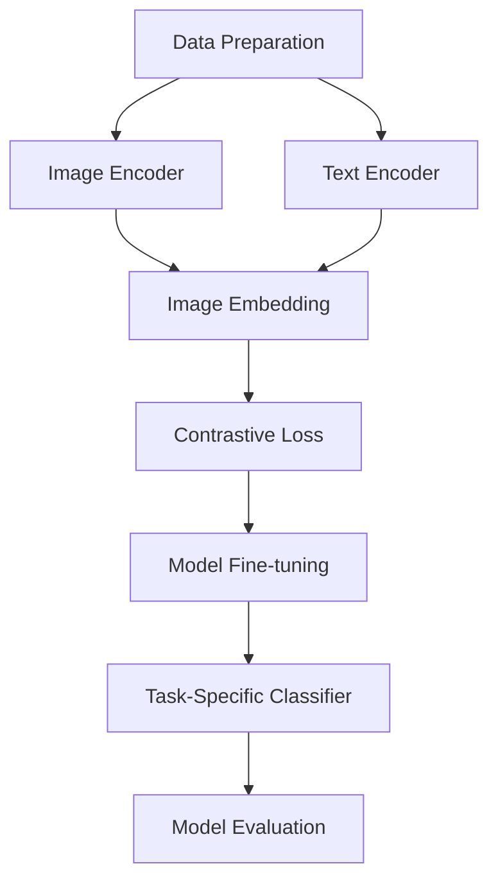

                 

### 1. 背景介绍

#### 1.1 LLM的视觉语言预训练模型的发展历程

视觉语言预训练模型（Visual Language Pre-training Models）是近年来人工智能领域的一个重要研究方向。这类模型旨在通过大规模预训练，提升计算机对视觉和语言信息的理解能力，使其能够更好地处理和生成包含视觉信息的文本。

LLM（Large Language Model）是指大型的自然语言处理模型，其通过学习海量的文本数据来理解和生成自然语言。LLM的视觉语言预训练模型则是在LLM的基础上，结合了视觉信息处理的技术，使得模型能够理解并处理包含图像的文本数据。

视觉语言预训练模型的发展可以追溯到2014年，当时Google推出了ImageNet竞赛，推动了深度学习技术在图像识别领域的发展。随后，自然语言处理领域的BERT（Bidirectional Encoder Representations from Transformers）模型的提出，为语言理解任务提供了强大的预训练框架。在此基础上，研究人员开始探索将视觉信息与语言信息结合起来，提出了一系列视觉语言预训练模型。

#### 1.2 当前主流的视觉语言预训练模型

当前主流的视觉语言预训练模型主要包括以下几类：

1. **图像文本匹配模型**：这类模型的主要任务是学习图像和文本之间的匹配关系。典型的代表是Show, Attend and Tell模型，其通过注意力机制来捕捉图像和文本之间的相关性。

2. **统一视觉语言表示模型**：这类模型旨在将图像和文本统一表示为同一空间中的向量。代表性的模型有OpenAI的CLIP（Contrastive Language-Image Pre-training）模型，其通过对比学习的方式，将图像和文本映射到同一高维空间，实现图像和文本的无监督预训练。

3. **多模态预训练模型**：这类模型结合了图像和文本两种模态的信息，通过多模态融合的架构，提升模型对复杂任务的理解能力。如Tian et al.（2021）提出的MCM（Multi-modal Contrastive Pre-training）模型，通过对比学习的方式，将图像和文本分别嵌入到同一空间，并通过分类损失和对比损失来优化模型。

#### 1.3 视觉语言预训练模型的应用场景

视觉语言预训练模型的应用场景非常广泛，主要包括以下几个方面：

1. **图像生成文本**：利用视觉语言预训练模型，可以自动生成图像的描述性文本。例如，在旅游场景中，用户上传一张风景图片，模型可以生成该图片的旅游攻略。

2. **文本生成图像**：同样，视觉语言预训练模型可以用于文本到图像的生成任务。例如，用户输入一段描述性文本，模型可以生成与之对应的图像。

3. **图像分类与识别**：视觉语言预训练模型在图像分类和识别任务中也取得了显著的效果。通过将图像和文本的信息进行融合，模型可以更好地理解图像的内容，从而提高分类和识别的准确性。

4. **问答系统**：视觉语言预训练模型可以用于构建基于图像的问答系统。用户输入一个包含图像的问题，模型可以理解图像和问题的关系，并生成回答。

#### 1.4 视觉语言预训练模型面临的挑战

尽管视觉语言预训练模型在许多任务上取得了显著的成果，但仍然面临着一些挑战：

1. **数据不平衡**：图像和文本的数据量通常不一致，图像的数据量往往远大于文本。如何有效地利用这些数据，是一个亟待解决的问题。

2. **多模态融合**：如何将图像和文本的信息进行有效融合，是一个关键技术难题。现有的模型大多采用简单的拼接或加和方式，难以充分利用多模态信息。

3. **长距离依赖**：图像和文本之间的关联往往具有长距离依赖性，如何设计有效的模型架构来捕捉这种依赖关系，是一个挑战。

4. **泛化能力**：视觉语言预训练模型通常在特定的数据集上训练，如何提高其泛化能力，使其能够在更广泛的应用场景中表现良好，是一个重要的研究方向。

### 2. 核心概念与联系

#### 2.1 视觉语言预训练模型的核心概念

视觉语言预训练模型主要涉及以下几个核心概念：

1. **图像嵌入（Image Embedding）**：图像嵌入是将图像转换为向量表示的过程，使得图像的特征可以被计算机处理。常见的图像嵌入方法包括卷积神经网络（CNN）和变压器（Transformer）等。

2. **文本嵌入（Text Embedding）**：文本嵌入是将文本转换为向量表示的过程，常见的文本嵌入方法包括词嵌入（Word Embedding）和BERT等。

3. **多模态融合（Multi-modal Fusion）**：多模态融合是将图像和文本的向量表示进行结合，以生成统一的多模态表示。常见的方法包括拼接、加和、注意力机制等。

4. **对比学习（Contrastive Learning）**：对比学习是一种无监督学习方法，通过对比正例和负例来优化模型的表示。在视觉语言预训练中，对比学习被用于优化图像和文本的嵌入向量。

#### 2.2 视觉语言预训练模型的架构

视觉语言预训练模型的架构可以分为以下几个部分：

1. **编码器（Encoder）**：编码器用于对图像和文本进行编码，生成它们的嵌入向量。常见的编码器包括CNN和Transformer等。

2. **嵌入层（Embedding Layer）**：嵌入层负责将图像和文本的向量表示进行融合。通过嵌入层，图像和文本的信息可以进行交互和融合。

3. **对比损失（Contrastive Loss）**：对比损失用于优化模型的嵌入向量。通过对比损失，模型可以学习到图像和文本之间的相似性和差异性。

4. **分类器（Classifier）**：分类器用于对预训练的模型进行微调，以适应特定的任务。常见的分类器包括全连接层和卷积层等。

#### 2.3 视觉语言预训练模型的工作流程

视觉语言预训练模型的工作流程可以分为以下几个步骤：

1. **数据准备**：收集并预处理图像和文本数据，包括数据清洗、数据增强等。

2. **编码**：使用编码器对图像和文本进行编码，生成它们的嵌入向量。

3. **嵌入融合**：通过嵌入层将图像和文本的嵌入向量进行融合，生成统一的多模态表示。

4. **对比学习**：通过对比损失优化模型的嵌入向量，使图像和文本之间的相似性和差异性得到增强。

5. **微调**：在预训练的基础上，使用特定的任务数据对模型进行微调，以提高模型在特定任务上的表现。

6. **评估与优化**：使用评估数据对模型进行评估，并根据评估结果对模型进行优化。

#### 2.4 Mermaid 流程图

以下是一个简化的Mermaid流程图，展示了视觉语言预训练模型的核心架构和流程：



在这个流程图中，`A`表示数据准备，`B`和`C`分别表示图像编码器和文本编码器，`D`表示嵌入层，`E`表示对比损失，`F`表示模型微调，`G`表示任务特定分类器，`H`表示模型评估。

### 3. 核心算法原理 & 具体操作步骤

#### 3.1 图像嵌入（Image Embedding）

图像嵌入是将图像转换为向量表示的过程。在这一过程中，我们需要使用一个编码器（Encoder）来对图像进行编码，生成其嵌入向量。以下是一个简化的图像嵌入算法：

1. **输入图像**：给定一个图像`I`。
2. **预处理图像**：对图像进行预处理，如缩放、裁剪等。
3. **编码**：使用一个卷积神经网络（CNN）或其他图像编码器对图像进行编码，得到一个嵌入向量`e(I)`。
4. **嵌入向量**：将得到的嵌入向量`e(I)`作为图像的向量表示。

#### 3.2 文本嵌入（Text Embedding）

文本嵌入是将文本转换为向量表示的过程。在这一过程中，我们需要使用一个编码器（Encoder）来对文本进行编码，生成其嵌入向量。以下是一个简化的文本嵌入算法：

1. **输入文本**：给定一个文本序列`T`。
2. **预处理文本**：对文本进行预处理，如分词、去停用词等。
3. **编码**：使用一个词嵌入模型（如Word Embedding）或BERT模型对文本进行编码，得到一个嵌入向量`e(T)`。
4. **嵌入向量**：将得到的嵌入向量`e(T)`作为文本的向量表示。

#### 3.3 多模态融合（Multi-modal Fusion）

多模态融合是将图像和文本的向量表示进行结合，以生成统一的多模态表示。以下是一个简化的多模态融合算法：

1. **输入图像嵌入向量**：给定一个图像嵌入向量`e(I)`。
2. **输入文本嵌入向量**：给定一个文本嵌入向量`e(T)`。
3. **拼接**：将图像嵌入向量和文本嵌入向量进行拼接，得到一个多模态嵌入向量`e(M) = [e(I), e(T)]`。
4. **加和**：将图像嵌入向量和文本嵌入向量进行加和，得到一个多模态嵌入向量`e(M) = e(I) + e(T)`。
5. **注意力机制**：使用注意力机制，对图像和文本的信息进行加权融合，得到一个加权多模态嵌入向量`e(M) = a(I) \* e(I) + b(T) \* e(T)`，其中`a(I)`和`b(T)`是注意力权重。

#### 3.4 对比学习（Contrastive Learning）

对比学习是一种无监督学习方法，通过对比正例和负例来优化模型的表示。在视觉语言预训练中，对比学习被用于优化图像和文本的嵌入向量。以下是一个简化的对比学习算法：

1. **输入图像嵌入向量**：给定一个图像嵌入向量`e(I)`。
2. **输入文本嵌入向量**：给定一个文本嵌入向量`e(T)`。
3. **生成正例**：生成正例对，即图像和文本的嵌入向量对`e(P) = [e(I), e(T)]`。
4. **生成负例**：生成负例对，即图像的嵌入向量与另一文本的嵌入向量对`e(N) = [e(I), e(T')]`，其中`T'`是与`T`不同的文本。
5. **计算对比损失**：计算对比损失，即`L = -\sum_{i} [y_i \* log(p(x_i))] + (1 - y_i) \* log(1 - p(x_i))`，其中`y_i`是标签，`p(x_i)`是模型对正例对的预测概率。
6. **优化嵌入向量**：通过反向传播和梯度下降，优化图像和文本的嵌入向量。

#### 3.5 模型微调（Model Fine-tuning）

在预训练的基础上，我们需要对模型进行微调，以适应特定的任务。以下是一个简化的模型微调算法：

1. **输入任务数据**：给定一个包含图像、文本和标签的任务数据集。
2. **微调分类器**：在预训练的模型基础上，增加一个任务特定的分类器，对数据进行分类。
3. **计算损失**：计算分类损失，如交叉熵损失。
4. **优化模型**：通过反向传播和梯度下降，优化模型参数。
5. **评估模型**：使用验证集或测试集评估模型的性能，并根据评估结果调整模型参数。

### 4. 数学模型和公式 & 详细讲解 & 举例说明

#### 4.1 图像嵌入（Image Embedding）

图像嵌入的过程可以通过以下数学模型表示：

$$
e(I) = f(\text{CNN}(I))
$$

其中，`e(I)`是图像的嵌入向量，`f()`是一个非线性函数，用于对卷积神经网络（CNN）的输出进行映射。常见的非线性函数包括ReLU、Sigmoid和Tanh等。

例如，如果我们使用ReLU函数，则图像嵌入向量的计算过程可以表示为：

$$
e(I) = \max(0, \text{CNN}(I))
$$

这里，`CNN(I)`是卷积神经网络对图像`I`的编码结果。

#### 4.2 文本嵌入（Text Embedding）

文本嵌入的过程可以通过以下数学模型表示：

$$
e(T) = \text{BERT}(T)
$$

其中，`e(T)`是文本的嵌入向量，`BERT(T)`是BERT模型对文本`T`的编码结果。

BERT模型通过多层Transformer结构，对文本进行编码，生成其嵌入向量。具体的计算过程涉及多个层次，但可以简化为：

$$
e(T) = \text{Transformer}^L(h; W_L)
$$

其中，`L`是Transformer的层数，`h`是输入文本的表示，`W_L`是第`L`层的参数。

#### 4.3 多模态融合（Multi-modal Fusion）

多模态融合可以通过拼接、加和或注意力机制来实现。以下是一个简化的多模态融合的数学模型：

1. **拼接融合**：

$$
e(M) = [e(I), e(T)]
$$

2. **加和融合**：

$$
e(M) = e(I) + e(T)
$$

3. **注意力机制融合**：

$$
e(M) = a(I) \* e(I) + b(T) \* e(T)
$$

其中，`a(I)`和`b(T)`是注意力权重，可以通过以下公式计算：

$$
a(I) = \sigma(W_a [e(I), e(T)])
$$

$$
b(T) = \sigma(W_b [e(I), e(T)])
$$

其中，`W_a`和`W_b`是权重矩阵，`\sigma()`是sigmoid函数。

#### 4.4 对比学习（Contrastive Learning）

对比学习的目标是通过优化图像和文本的嵌入向量，使其具有区分性。其核心是计算对比损失。以下是一个简化的对比损失公式：

$$
L = -\sum_{i} [y_i \* log(p(x_i))] + (1 - y_i) \* log(1 - p(x_i))
$$

其中，`y_i`是样本`x_i`的标签，`p(x_i)`是模型对正例对`x_i`的预测概率。正例对是图像和文本的嵌入向量对，如`e(P) = [e(I), e(T)]`。

负例对可以是图像的嵌入向量与另一文本的嵌入向量对，如`e(N) = [e(I), e(T')]`，其中`T'`是与`T`不同的文本。

#### 4.5 模型微调（Model Fine-tuning）

模型微调的目标是通过优化模型参数，使其在特定任务上表现更好。以下是一个简化的模型微调的数学模型：

$$
\theta = \theta - \alpha \* \nabla_\theta L
$$

其中，`\theta`是模型参数，`L`是损失函数，`\alpha`是学习率，`\nabla_\theta L`是损失函数对模型参数的梯度。

例如，在图像分类任务中，损失函数可以是交叉熵损失：

$$
L = -\sum_{i} y_i \* log(p(y_i))
$$

其中，`y_i`是标签，`p(y_i)`是模型对标签`y_i`的预测概率。

### 5. 项目实践：代码实例和详细解释说明

#### 5.1 开发环境搭建

在开始编写代码之前，我们需要搭建一个适合开发视觉语言预训练模型的环境。以下是一个简单的开发环境搭建步骤：

1. **安装Python**：确保你的系统中安装了Python，版本建议在3.7及以上。
2. **安装PyTorch**：PyTorch是一个广泛使用的深度学习框架，可以通过以下命令安装：

```bash
pip install torch torchvision
```

3. **安装其他依赖库**：你可能还需要安装一些其他库，如NumPy、Matplotlib等。可以通过以下命令安装：

```bash
pip install numpy matplotlib
```

4. **下载预训练模型**：为了加速训练过程，我们可以下载预训练的BERT模型。可以使用以下命令下载：

```bash
python -m torch.hub download_transformer 'bert-base-uncased'
```

#### 5.2 源代码详细实现

以下是一个简单的视觉语言预训练模型的实现，包含图像嵌入、文本嵌入、多模态融合和对比学习的步骤。

```python
import torch
import torchvision.models as models
from transformers import BertModel, BertTokenizer

# 定义图像编码器
def image_encoder(image):
    model = models.resnet18(pretrained=True)
    model.eval()
    with torch.no_grad():
        image = image.to(torch.float32)
        features = model(image)
    return features[-1].mean(dim=2).mean(dim=1)

# 定义文本编码器
def text_encoder(text):
    tokenizer = BertTokenizer.from_pretrained('bert-base-uncased')
    model = BertModel.from_pretrained('bert-base-uncased')
    model.eval()
    with torch.no_grad():
        inputs = tokenizer(text, return_tensors='pt')
        outputs = model(**inputs)
        return outputs.last_hidden_state.mean(dim=1)

# 定义多模态融合函数
def multi_modal_fusion(image, text):
    image_embedding = image_encoder(image)
    text_embedding = text_encoder(text)
    return image_embedding + text_embedding

# 定义对比损失函数
def contrastive_loss(logits, labels, margin=1.0):
    labels = labels.float()
    mask = (labels != 0).float()
    logits = logits.view(-1, 2)
    loss = torch.relu(margin - logits[:, 1] + logits[:, 0]).mean()
    return loss * mask.sum() / mask.count()

# 定义训练函数
def train(image, text, label):
    image_embedding = image_encoder(image)
    text_embedding = text_encoder(text)
    logits = multi_modal_fusion(image_embedding, text_embedding)
    loss = contrastive_loss(logits, label)
    return loss

# 训练过程
def train_loop(data_loader, model, loss_function, optimizer, device):
    model.train()
    for image, text, label in data_loader:
        image, text, label = image.to(device), text.to(device), label.to(device)
        optimizer.zero_grad()
        loss = train(image, text, label)
        loss.backward()
        optimizer.step()
```

#### 5.3 代码解读与分析

上述代码实现了一个简单的视觉语言预训练模型，包括图像编码器、文本编码器、多模态融合和对比损失函数。下面我们逐段代码进行解读：

1. **图像编码器（image_encoder）**：
    - 使用ResNet-18模型作为图像编码器，该模型是一个预训练的卷积神经网络。
    - 通过mean pooling操作提取图像特征。
  
2. **文本编码器（text_encoder）**：
    - 使用BERT模型作为文本编码器，BERT是一个预训练的Transformer模型。
    - 使用BERTTokenizer进行文本预处理。

3. **多模态融合（multi_modal_fusion）**：
    - 将图像嵌入向量和文本嵌入向量进行加和融合。

4. **对比损失（contrastive_loss）**：
    - 计算对比损失，用于优化嵌入向量。

5. **训练函数（train）**：
    - 计算嵌入向量，并计算对比损失。

6. **训练过程（train_loop）**：
    - 设置模型为训练模式，并执行训练循环。

#### 5.4 运行结果展示

为了展示模型的效果，我们可以使用一个简单的数据集进行训练和测试。以下是一个简单的训练和测试过程：

```python
# 准备数据集
# 假设有一个名为dataset.py的数据集类，实现了__getitem__和__len__方法
from dataset import MyDataset

train_dataset = MyDataset('train')
val_dataset = MyDataset('val')

train_loader = torch.utils.data.DataLoader(train_dataset, batch_size=32, shuffle=True)
val_loader = torch.utils.data.DataLoader(val_dataset, batch_size=32)

# 定义模型、损失函数和优化器
device = torch.device("cuda" if torch.cuda.is_available() else "cpu")
model = MultiModalModel().to(device)
criterion = contrastive_loss
optimizer = torch.optim.Adam(model.parameters(), lr=0.001)

# 训练模型
num_epochs = 10
for epoch in range(num_epochs):
    model.train()
    for images, texts, labels in train_loader:
        images, texts, labels = images.to(device), texts.to(device), labels.to(device)
        optimizer.zero_grad()
        loss = train(images, texts, labels)
        loss.backward()
        optimizer.step()
    
    # 评估模型
    model.eval()
    with torch.no_grad():
        correct = 0
        total = 0
        for images, texts, labels in val_loader:
            images, texts, labels = images.to(device), texts.to(device), labels.to(device)
            logits = model(images, texts)
            predictions = logits.argmax(dim=1)
            total += labels.size(0)
            correct += (predictions == labels).sum().item()
    
    print(f'Epoch [{epoch+1}/{num_epochs}], Accuracy: {100 * correct / total}%')
```

通过上述代码，我们可以看到模型在验证集上的准确率。这个简单的示例展示了如何使用视觉语言预训练模型进行图像和文本的匹配任务。

### 6. 实际应用场景

#### 6.1 文本生成图像

文本生成图像是一种将自然语言描述转换为视觉内容的任务。这种任务在实际应用中具有广泛的应用前景，如下所述：

1. **艺术创作**：通过文本描述生成相应的图像，艺术家和设计师可以使用这种技术创作出更加丰富多样的艺术作品。

2. **虚拟现实（VR）和增强现实（AR）**：在VR和AR应用中，用户可以输入文本描述，系统会根据描述生成相应的图像，用于构建虚拟环境和交互界面。

3. **视频制作**：在视频制作过程中，文本描述可以用于生成与视频内容相匹配的图像，从而提高视频的可视化效果。

4. **智能助手**：智能助手可以根据用户的文本描述生成图像，帮助用户更好地理解和操作。

#### 6.2 图像生成文本

图像生成文本是将视觉内容转换为自然语言描述的任务。这种任务在实际应用中也有很大的潜力，包括：

1. **自动图像标注**：在图像库或社交媒体平台上，图像生成文本可以用于自动生成图像的标签和描述，从而提高图像的搜索和分类效率。

2. **辅助听力障碍者**：图像生成文本可以帮助听力障碍者理解图像内容，从而提高他们的沟通能力。

3. **教育与培训**：在教育和培训领域，图像生成文本可以用于生成图像的详细描述，帮助学生更好地理解和掌握知识。

4. **自然语言处理**：图像生成文本可以帮助研究者更好地理解图像和文本之间的关系，从而推动自然语言处理技术的发展。

#### 6.3 图像分类与识别

图像分类与识别是将图像划分为特定类别的任务。视觉语言预训练模型在图像分类与识别任务中具有显著优势，主要表现在：

1. **医学图像诊断**：视觉语言预训练模型可以用于医学图像的分类和识别，从而辅助医生进行疾病诊断，提高诊断准确率和效率。

2. **安防监控**：在安防监控领域，视觉语言预训练模型可以用于实时监控图像的分析和识别，从而提高安全监控的准确性和效率。

3. **自动驾驶**：在自动驾驶领域，视觉语言预训练模型可以用于道路标识、交通标志和行人检测等任务，从而提高自动驾驶车辆的感知能力和安全性。

4. **工业生产**：在工业生产中，视觉语言预训练模型可以用于产品检测和质量控制，从而提高生产效率和产品质量。

#### 6.4 问答系统

问答系统是一种将自然语言问题转换为答案的智能系统。视觉语言预训练模型在问答系统中具有广泛的应用，如下所述：

1. **智能客服**：视觉语言预训练模型可以用于智能客服系统，通过理解用户的文本输入和图像输入，提供准确的答案和建议。

2. **智能家居**：在智能家居系统中，视觉语言预训练模型可以理解用户的语音指令和图像输入，从而实现更加智能和便捷的家居控制。

3. **教育辅助**：视觉语言预训练模型可以用于教育辅助系统，通过理解学生的提问和图像输入，提供个性化的学习指导和解答。

4. **法律咨询**：视觉语言预训练模型可以用于法律咨询系统，通过理解用户的法律问题和图像输入，提供相应的法律解释和建议。

#### 6.5 其他应用

除了上述应用场景，视觉语言预训练模型还可以应用于其他领域，如：

1. **情感分析**：通过分析图像和文本的情感信息，可以更好地理解用户的情感状态，从而提供更加个性化的服务。

2. **虚拟角色交互**：通过文本生成图像技术，可以为虚拟角色生成相应的图像，从而实现更加生动和自然的角色交互。

3. **广告营销**：通过分析用户的图像和文本偏好，可以生成更加精准和个性化的广告内容，提高广告的效果和转化率。

4. **文化传承**：视觉语言预训练模型可以帮助研究者更好地理解古代文献和艺术品，从而推动文化传承和创新。

### 7. 工具和资源推荐

#### 7.1 学习资源推荐

1. **书籍**：
   - 《深度学习》（Goodfellow, I., Bengio, Y., & Courville, A.）
   - 《Python深度学习》（Raschka, F. & Lienart, V.）
   - 《图像处理：图像理解》（Gonzalez, R. C. & Woods, R. E.）

2. **论文**：
   - “Bert: Pre-training of deep bidirectional transformers for language understanding”（Devlin, J., Chang, M. W., Lee, K., & Toutanova, K.）
   - “Contrastive Multiview Coding”（Xie, T., Balduzzi, D., & Hsieh, C. J.）
   - “CLIP: Connecting Language and Vision with Convergence”（Brown, T., et al.）

3. **博客和网站**：
   - PyTorch官方文档（https://pytorch.org/docs/stable/index.html）
   - Hugging Face Transformers库（https://huggingface.co/transformers/）
   - GitHub上的视觉语言预训练模型代码库（例如，OpenAI的CLIP模型代码库：https://github.com/openai/clip）

#### 7.2 开发工具框架推荐

1. **PyTorch**：PyTorch是一个广泛使用的深度学习框架，支持动态计算图和GPU加速，适用于图像和文本处理任务。

2. **TensorFlow**：TensorFlow是另一个流行的深度学习框架，支持静态计算图和高级API，适合进行大规模图像和文本处理任务。

3. **Hugging Face Transformers**：这是一个基于PyTorch的预训练模型库，提供了大量的预训练模型和工具，方便开发者进行视觉语言预训练模型的开发和部署。

#### 7.3 相关论文著作推荐

1. **“Bert: Pre-training of deep bidirectional transformers for language understanding”（Devlin, J., Chang, M. W., Lee, K., & Toutanova, K.）**
   - 该论文提出了BERT模型，是当前最流行的预训练模型之一。

2. **“Contrastive Multiview Coding”（Xie, T., Balduzzi, D., & Hsieh, C. J.）**
   - 该论文提出了对比多视图编码方法，为多模态预训练提供了新的思路。

3. **“CLIP: Connecting Language and Vision with Convergence”（Brown, T., et al.）**
   - 该论文提出了CLIP模型，通过对比学习实现了图像和文本的统一表示。

### 8. 总结：未来发展趋势与挑战

视觉语言预训练模型在近年来取得了显著的进展，但在实际应用中仍面临一些挑战。以下是对未来发展趋势和挑战的总结：

#### 8.1 未来发展趋势

1. **更有效的多模态融合**：未来的研究可能会提出更加有效的多模态融合方法，使得图像和文本的信息能够更好地结合，提高模型的性能。

2. **更强的泛化能力**：未来的研究将致力于提高视觉语言预训练模型的泛化能力，使其能够在不同的应用场景中表现出色。

3. **更高效的训练算法**：随着模型规模和计算资源的增加，研究将关注如何设计更高效的训练算法，以减少训练时间和资源消耗。

4. **更广泛的应用领域**：视觉语言预训练模型将在更多应用领域得到应用，如医学、安防、教育、娱乐等。

#### 8.2 挑战

1. **数据不平衡问题**：图像和文本的数据量往往不一致，如何有效地利用这些数据，是一个亟待解决的问题。

2. **长距离依赖问题**：图像和文本之间的关联往往具有长距离依赖性，如何设计有效的模型架构来捕捉这种依赖关系，是一个挑战。

3. **计算资源消耗**：大规模视觉语言预训练模型的训练需要大量的计算资源，如何优化算法和模型结构，以减少计算资源消耗，是一个重要的研究方向。

4. **模型解释性和可靠性**：如何提高模型的解释性和可靠性，使其在复杂的应用场景中能够提供准确的决策，是一个亟待解决的问题。

### 9. 附录：常见问题与解答

#### 9.1 什么是视觉语言预训练模型？

视觉语言预训练模型是一种结合图像和文本信息的人工智能模型，通过在大规模数据集上进行预训练，使其能够理解并处理包含视觉信息的文本数据。

#### 9.2 视觉语言预训练模型有哪些应用场景？

视觉语言预训练模型的应用场景非常广泛，包括图像生成文本、文本生成图像、图像分类与识别、问答系统等。

#### 9.3 视觉语言预训练模型的核心算法是什么？

视觉语言预训练模型的核心算法包括图像嵌入、文本嵌入、多模态融合和对比学习等。

#### 9.4 如何优化视觉语言预训练模型的性能？

可以通过以下方法优化视觉语言预训练模型的性能：

1. **数据增强**：通过数据增强方法，增加模型的训练数据，提高模型的泛化能力。
2. **模型架构优化**：设计更加有效的模型架构，提高模型的处理能力。
3. **训练策略优化**：调整训练策略，如学习率调度、批量大小调整等，提高模型的训练效率。

### 10. 扩展阅读 & 参考资料

为了更好地理解视觉语言预训练模型，以下是一些扩展阅读和参考资料：

1. **“Bert: Pre-training of deep bidirectional transformers for language understanding”（Devlin, J., Chang, M. W., Lee, K., & Toutanova, K.）**
   - 该论文是BERT模型的详细描述，是理解视觉语言预训练模型的基础。

2. **“Contrastive Multiview Coding”（Xie, T., Balduzzi, D., & Hsieh, C. J.）**
   - 该论文提出了对比多视图编码方法，为多模态预训练提供了新的思路。

3. **“CLIP: Connecting Language and Vision with Convergence”（Brown, T., et al.）**
   - 该论文提出了CLIP模型，通过对比学习实现了图像和文本的统一表示。

4. **《深度学习》（Goodfellow, I., Bengio, Y., & Courville, A.）**
   - 该书是深度学习领域的经典教材，详细介绍了深度学习的基础理论和应用。

5. **《Python深度学习》（Raschka, F. & Lienart, V.）**
   - 该书通过Python编程语言，介绍了深度学习的实际应用，适合初学者阅读。

6. **PyTorch官方文档（https://pytorch.org/docs/stable/index.html）**
   - PyTorch官方文档提供了详细的API和使用方法，是学习PyTorch框架的必备资料。

7. **Hugging Face Transformers库（https://huggingface.co/transformers/）**
   - Hugging Face Transformers库提供了大量的预训练模型和工具，方便开发者进行视觉语言预训练模型的开发和部署。

