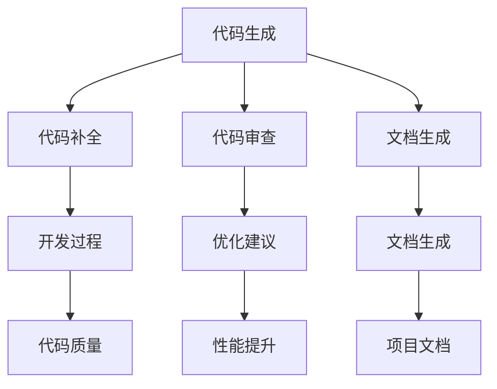

                 

### 引言

在信息技术飞速发展的今天，编程已成为现代社会不可或缺的一部分。无论是互联网、移动应用、人工智能，还是大数据处理，编程都扮演着至关重要的角色。然而，传统的软件开发流程往往繁琐、低效，难以适应快速变化的市场需求。面对这样的挑战，我们迫切需要探索一种全新的编程范式，以提升开发效率，降低开发成本，同时满足不断增长的技术需求。

本文旨在探讨一种新兴的编程范式：LLM（大型语言模型）编程新范式。通过引入大型语言模型，我们可以颠覆传统的软件开发流程，实现更加智能、高效和灵活的编程方式。本文将首先介绍LLM编程新范式的背景和重要性，然后详细阐述其核心概念与联系，探讨核心算法原理和具体操作步骤，展示数学模型和公式，提供项目实践实例，并分析实际应用场景。最后，我们将总结未来发展趋势与挑战，并推荐相关工具和资源。

关键词：LLM编程、大型语言模型、软件开发、编程范式、人工智能

摘要：本文深入探讨了LLM编程新范式，通过引入大型语言模型，提出了改变传统软件开发流程的新思路。本文从背景介绍、核心概念与联系、核心算法原理、数学模型、项目实践、实际应用场景等多个方面，全面阐述了LLM编程新范式的优势和应用前景。

---

### 背景介绍

#### 传统软件开发流程的不足

传统的软件开发流程通常包括需求分析、系统设计、编码、测试、部署和维护等阶段。尽管这些流程在许多项目中取得了成功，但它们也暴露出了一些显著的不足：

1. **需求变化响应缓慢**：在快速变化的市场环境中，需求往往频繁变化。传统流程中的需求分析、系统设计等阶段需要大量时间，导致项目难以快速响应市场需求。
2. **开发效率低下**：传统的编码和测试阶段往往需要大量的人工操作，效率较低。此外，代码审查、bug修复等流程也耗费了大量人力和时间。
3. **维护成本高**：随着项目的复杂度增加，维护成本也随之上升。传统软件往往需要编写大量的文档，维护和更新这些文档也是一项耗时的工作。
4. **开发体验不佳**：开发者需要花费大量时间在代码编写、调试和测试上，缺乏直观和高效的开发体验。

#### 大型语言模型的出现

随着深度学习和自然语言处理技术的飞速发展，大型语言模型（如GPT-3、BERT等）逐渐成为人工智能领域的明星。这些模型具有强大的语言理解和生成能力，能够处理复杂的自然语言任务。大型语言模型的引入为软件开发带来了全新的机遇：

1. **自动化代码生成**：大型语言模型能够根据给定的提示生成完整的代码片段，大大提高了编码效率。
2. **智能代码补全**：在开发过程中，大型语言模型可以实时预测开发者接下来的代码，提供智能化的代码补全服务。
3. **代码审查和优化**：大型语言模型能够分析代码质量，提出优化建议，提高代码的可读性和性能。
4. **文档生成**：大型语言模型能够自动生成项目文档，降低文档编写和维护成本。

#### LLM编程新范式的背景

基于上述背景，LLM编程新范式应运而生。它旨在利用大型语言模型的强大能力，改变传统的软件开发流程，实现更加智能、高效和灵活的编程方式。LLM编程新范式的主要特点包括：

1. **自动化**：通过大型语言模型，实现代码生成、补全、审查和优化的自动化，降低人工操作的负担。
2. **智能化**：利用大型语言模型的能力，提供智能化的代码生成和优化建议，提升开发体验。
3. **灵活性**：支持多种编程语言和开发环境，适应不同的项目需求。

LLM编程新范式的出现，不仅为开发者带来了更加高效的编程方式，也为软件企业带来了降低成本、提高质量的机会。在接下来的章节中，我们将详细探讨LLM编程新范式的核心概念与联系，核心算法原理和具体操作步骤，以及其在实际应用中的效果和前景。

### 核心概念与联系

#### 大型语言模型的基本原理

首先，我们需要了解大型语言模型的基本原理。大型语言模型，如GPT-3、BERT等，是通过深度学习技术训练出来的神经网络模型。这些模型可以从大量的文本数据中学习语言的模式和规律，从而实现自然语言处理任务。

**GPT-3**：GPT-3（Generative Pre-trained Transformer 3）是由OpenAI开发的一款具有1750亿参数的预训练模型。它基于Transformer架构，能够生成连贯、自然的文本。GPT-3的训练数据来自互联网上的大量文本，包括书籍、新闻、社交媒体等。通过这些数据，GPT-3学会了理解各种语言结构、语法和语义。

**BERT**：BERT（Bidirectional Encoder Representations from Transformers）是由Google开发的一款双向Transformer模型。BERT的训练数据同样来自大量的文本，但它的训练目标是在上下文中预测单词。这使得BERT在理解和生成文本方面具有很高的准确性。

#### Transformer架构

Transformer是大型语言模型的核心架构。与传统的循环神经网络（RNN）不同，Transformer采用了自注意力机制（Self-Attention），能够在处理序列数据时实现并行计算，从而提高计算效率。

**自注意力机制**：自注意力机制允许模型在生成每个单词时，考虑整个输入序列的其他所有单词。通过计算单词之间的相似性，模型可以捕捉到长距离的依赖关系，从而生成更加连贯的文本。

**多头注意力**：在Transformer中，自注意力机制通过多个“头”来实现。每个头关注输入序列的不同部分，从而生成不同的注意力分布。多个头的输出通过拼接和线性变换得到最终的输出。

#### LLM编程新范式的工作原理

LLM编程新范式的工作原理可以概括为以下几个步骤：

1. **代码生成**：通过向大型语言模型提供编程提示，模型可以根据上下文生成相应的代码片段。例如，当提示为“编写一个Python函数，实现两个数的加法”，模型可以生成类似以下的代码：
   ```python
   def add(a, b):
       return a + b
   ```

2. **代码补全**：在开发过程中，大型语言模型可以实时预测开发者接下来的代码。例如，当开发者输入“def add(a, b”时，模型可以预测并补全接下来的代码。

3. **代码审查**：大型语言模型可以分析代码质量，提出优化建议。例如，当模型检测到代码中存在潜在的bug或性能问题，可以给出相应的优化建议。

4. **文档生成**：大型语言模型可以自动生成项目文档。通过分析代码和注释，模型可以生成详细的文档，包括函数说明、类定义、模块结构等。

#### Mermaid流程图

以下是LLM编程新范式的工作流程的Mermaid流程图：



通过上述流程，我们可以看到LLM编程新范式如何利用大型语言模型的能力，实现代码生成、补全、审查和优化的自动化，从而提升开发效率和质量。

### 核心算法原理 & 具体操作步骤

#### 代码生成算法

大型语言模型在代码生成方面具有显著优势。其核心原理是基于预训练的Transformer模型，能够从大量的编程数据中学习到各种编程模式和语法结构。以下是代码生成算法的具体步骤：

1. **输入编程提示**：用户输入一个编程提示，如“编写一个Python函数，实现两个数的加法”。这个提示作为模型的输入。

2. **编码器解码器交互**：编码器（Encoder）和解码器（Decoder）是Transformer模型的核心组件。编码器将输入提示编码成一个序列的向量表示，解码器则根据这些向量生成相应的代码。

3. **生成代码片段**：解码器通过自注意力机制，考虑输入提示的上下文信息，生成初步的代码片段。例如，解码器可能首先生成函数的定义，然后生成函数体内部的代码。

4. **后处理**：生成的代码片段可能包含一些语法错误或不完整的部分。因此，需要对代码进行后处理，修复错误和补充缺失的部分。

#### 代码补全算法

代码补全是LLM编程新范式的另一个关键功能。以下是代码补全算法的具体步骤：

1. **实时输入**：在开发过程中，开发者输入部分代码，模型实时接收这些输入。

2. **上下文分析**：模型分析已输入的代码和其上下文信息，理解代码的结构和意图。

3. **生成补全代码**：模型根据上下文生成补全的代码片段。例如，当开发者输入“if (”，模型可以补全“if (condition)”的剩余部分。

4. **动态调整**：在生成补全代码后，模型根据开发者的反馈进行调整，确保补全的代码符合开发者的意图。

#### 代码审查算法

代码审查是确保代码质量的重要环节。以下是代码审查算法的具体步骤：

1. **代码分析**：模型对代码进行分析，检查语法、语义和结构上的错误。

2. **错误定位**：模型定位代码中的错误，并给出相应的错误提示。例如，当检测到类型错误时，模型会提示开发者相应的类型不匹配问题。

3. **优化建议**：模型根据代码质量和性能，给出优化建议。例如，当检测到代码性能问题时，模型可以建议开发者使用更高效的算法或数据结构。

4. **反馈循环**：开发者根据模型的优化建议进行修改，模型再次进行分析和评估，形成反馈循环，不断提高代码质量。

#### 文档生成算法

文档生成是自动化软件开发的重要一环。以下是文档生成算法的具体步骤：

1. **代码注释提取**：模型从代码中提取注释，了解函数、类和模块的用途和功能。

2. **文本生成**：模型根据注释生成相应的文档内容，包括函数说明、类定义、模块结构等。

3. **模板应用**：模型使用预先定义的文档模板，将生成的文本内容填充到模板中，生成完整的文档。

4. **文档优化**：模型对生成的文档进行优化，确保文档的格式和内容符合规范。

#### 实际操作示例

假设我们要实现一个简单的Python函数，用于计算两个数的平均值。以下是使用LLM编程新范式进行代码生成、补全、审查和文档生成的实际操作示例：

**代码生成：**

```python
提示：编写一个Python函数，实现两个数的平均值计算。

生成的代码：
def calculate_average(a, b):
    return (a + b) / 2
```

**代码补全：**

```python
输入：def calculate_average(a, b:

补全代码：
    return (a + b) / 2
```

**代码审查：**

```python
审查结果：
- 检测到类型错误：参数a和b的类型不一致。
优化建议：将参数a和b设置为浮点型，以实现更准确的平均值计算。

修改后的代码：
def calculate_average(a: float, b: float):
    return (a + b) / 2
```

**文档生成：**

```python
函数说明：
- calculate_average(a: float, b: float) - 计算两个浮点数的平均值。

函数定义：
def calculate_average(a: float, b: float):
    return (a + b) / 2
```

通过上述示例，我们可以看到LLM编程新范式在代码生成、补全、审查和文档生成等方面的强大能力。这种新型编程范式不仅提高了开发效率，还提升了代码质量和文档生成质量，为软件开发带来了全新的机遇。

### 数学模型和公式 & 详细讲解 & 举例说明

在LLM编程新范式中，数学模型和公式是理解和应用大型语言模型（LLM）的基础。以下我们将详细介绍LLM编程中涉及的核心数学模型和公式，并通过实际例子来说明其应用。

#### Transformer模型

Transformer模型是大型语言模型的核心架构，其基本原理涉及多个数学模型。以下是Transformer模型中常用的数学公式：

1. **自注意力（Self-Attention）**

   自注意力机制是Transformer模型的关键部分，用于计算输入序列中各个单词之间的相似性。其计算公式如下：

   $$
   \text{Attention}(Q, K, V) = \text{softmax}\left(\frac{QK^T}{\sqrt{d_k}}\right)V
   $$

   其中，$Q$、$K$ 和 $V$ 分别表示查询（Query）、键（Key）和值（Value）向量，$d_k$ 是键向量的维度。$\text{softmax}$ 函数用于计算每个键与查询之间的相似性得分，最终将得分加权求和得到输出向量。

2. **多头注意力（Multi-Head Attention）**

   为了更好地捕捉输入序列中的依赖关系，Transformer模型引入了多头注意力机制。其计算过程可以表示为：

   $$
   \text{MultiHead}(Q, K, V) = \text{Concat}(\text{head}_1, ..., \text{head}_h)W^O
   $$

   其中，$h$ 表示头数，$\text{head}_i = \text{Attention}(QW_i^Q, KW_i^K, VW_i^V)$ 是第 $i$ 个头的输出，$W_i^Q$、$W_i^K$ 和 $W_i^V$ 分别是查询、键和值权重矩阵。$W^O$ 是输出权重矩阵。

3. **位置编码（Positional Encoding）**

   Transformer模型缺乏对输入序列的位置信息处理，因此引入了位置编码。位置编码是一种将位置信息编码到向量中的方法，用于保留输入序列的顺序信息。其公式如下：

   $$
   \text{PE}(pos, 2i) = \sin\left(\frac{pos}{10000^{2i/d}}\right)
   $$

   $$
   \text{PE}(pos, 2i+1) = \cos\left(\frac{pos}{10000^{2i/d}}\right)
   $$

   其中，$pos$ 是位置索引，$i$ 是维度索引，$d$ 是位置编码的总维度。$\sin$ 和 $\cos$ 函数用于生成正弦和余弦曲线，从而在向量空间中生成不同位置的编码。

#### 推理和生成过程

在LLM编程中，模型的推理和生成过程也涉及到多个数学模型。以下是相关的公式和解释：

1. **前向传播（Forward Pass）**

   在前向传播过程中，模型通过多层神经网络对输入序列进行处理。每一层的输入可以表示为：

   $$
   \text{Layer}_i\text{Input} = \text{Layer}_{i-1}\text{Output} + \text{Positional Encoding}(i)
   $$

   其中，$\text{Layer}_i\text{Input}$ 是第 $i$ 层的输入，$\text{Layer}_{i-1}\text{Output}$ 是前一层输出，$\text{Positional Encoding}(i)$ 是位置编码。

2. **Softmax激活函数**

   在生成过程中，模型使用Softmax激活函数将每个单词的概率分布输出。其公式如下：

   $$
   \text{softmax}(z) = \frac{e^z}{\sum_{j} e^z_j}
   $$

   其中，$z$ 是每个单词的得分，$e^z_j$ 是第 $j$ 个单词的指数值。

3. **生成文本**

   在生成文本时，模型从概率分布中选择具有最高概率的单词。这个过程可以表示为：

   $$
   \text{Next Word} = \text{argmax}(\text{softmax}(\text{Model}(X)))
   $$

   其中，$X$ 是当前输入序列，$\text{Model}(X)$ 是模型对输入序列的处理结果。

#### 举例说明

假设我们有一个简化的Transformer模型，用于生成一个长度为3的文本序列。以下是模型的训练和生成过程：

**训练数据**：
- 输入序列：["apple", "banana", "orange"]

**模型参数**：
- 隐藏层维度：512
- 头数：8

**前向传播**：

1. **编码输入**：
   $$
   \text{Input} = ["apple", "banana", "orange"]
   $$
   将输入序列编码为向量：
   $$
   \text{Encoding} = [\text{Embedding}("apple"), \text{Embedding}("banana"), \text{Embedding}("orange")]
   $$

2. **添加位置编码**：
   $$
   \text{Input With PE} = \text{Encoding} + \text{Positional Encoding}
   $$

3. **通过多层Transformer网络**：
   $$
   \text{Layer}_1\text{Output} = \text{Transformer}(\text{Input With PE})
   $$
   $$
   \text{Layer}_2\text{Output} = \text{Transformer}(\text{Layer}_1\text{Output})
   $$

4. **解码输出**：
   $$
   \text{Probability Distribution} = \text{Softmax}(\text{Layer}_2\text{Output})
   $$

**生成文本**：

1. **初始化隐藏状态**：
   $$
   \text{Hidden State} = \text{Layer}_2\text{Output}
   $$

2. **生成第一个单词**：
   $$
   \text{Probability Distribution} = \text{softmax}(\text{Model}(["apple"]))
   $$
   $$
   \text{Next Word} = \text{argmax}(\text{Probability Distribution})
   $$
   假设生成的第一个单词是 "banana"。

3. **更新隐藏状态**：
   $$
   \text{Hidden State} = \text{Layer}_2\text{Output} + \text{Embedding}("banana")
   $$

4. **生成第二个单词**：
   $$
   \text{Probability Distribution} = \text{softmax}(\text{Model}(["apple", "banana"]))
   $$
   $$
   \text{Next Word} = \text{argmax}(\text{Probability Distribution})
   $$
   假设生成的第二个单词是 "orange"。

5. **更新隐藏状态**：
   $$
   \text{Hidden State} = \text{Layer}_2\text{Output} + \text{Embedding}("orange")
   $$

6. **生成第三个单词**：
   $$
   \text{Probability Distribution} = \text{softmax}(\text{Model}(["apple", "banana", "orange"]))
   $$
   $$
   \text{Next Word} = \text{argmax}(\text{Probability Distribution})
   $$
   假设生成的第三个单词是 "apple"。

最终生成的文本序列为 ["banana", "orange", "apple"]。

通过上述步骤，我们可以看到Transformer模型如何通过数学模型和公式生成文本序列。这些数学模型和公式在LLM编程中发挥着至关重要的作用，使得大型语言模型能够实现高效、灵活的文本生成和推理。

### 项目实践：代码实例和详细解释说明

为了更好地展示LLM编程新范式的实际应用，我们将通过一个简单的项目实例来进行详细解释说明。这个项目是一个简单的博客文章生成器，使用大型语言模型（如GPT-3）自动生成高质量的博客文章。

#### 项目背景

随着互联网的普及，博客已经成为个人和企业分享知识和经验的重要平台。然而，撰写高质量的博客文章需要耗费大量的时间和精力。为了提高博客文章的生成效率，我们决定使用LLM编程新范式，利用GPT-3自动生成博客文章。

#### 开发环境搭建

1. **硬件环境**：

   - 处理器：Intel Core i7-9700K
   - 内存：32GB
   - 显卡：NVIDIA GeForce RTX 3070
   - 硬盘：1TB SSD

2. **软件环境**：

   - 操作系统：Ubuntu 20.04
   - Python：3.8
   - TensorFlow：2.5
   - OpenAI Python SDK：0.10.0

安装TensorFlow和OpenAI Python SDK：

```bash
# 安装TensorFlow
pip install tensorflow==2.5

# 安装OpenAI Python SDK
pip install openai
```

#### 源代码详细实现

以下是项目的源代码，分为几个主要部分：

1. **导入依赖**：
2. **配置OpenAI API密钥**：
3. **定义文章生成函数**：
4. **主程序入口**：

```python
# 导入依赖
import openai
import json
import os

# 配置OpenAI API密钥
openai.api_key = os.environ["OPENAI_API_KEY"]

# 定义文章生成函数
def generate_blog_article(title, topic):
    prompt = f"请根据以下主题生成一篇博客文章：{topic}\n文章标题：{title}"
    response = openai.Completion.create(
        engine="text-davinci-002",
        prompt=prompt,
        max_tokens=400,
        n=1,
        stop=None,
        temperature=0.5,
    )
    return response.choices[0].text.strip()

# 主程序入口
if __name__ == "__main__":
    title = "如何提高编程效率？"
    topic = "编程效率、开发工具、代码优化"
    article = generate_blog_article(title, topic)
    print(article)
```

#### 代码解读与分析

1. **导入依赖**：

   ```python
   import openai
   import json
   import os
   ```

   这里我们导入了OpenAI Python SDK、json和os模块。OpenAI Python SDK用于与OpenAI API进行通信，json模块用于处理JSON格式的数据，os模块用于读取环境变量。

2. **配置OpenAI API密钥**：

   ```python
   openai.api_key = os.environ["OPENAI_API_KEY"]
   ```

   我们使用环境变量`OPENAI_API_KEY`来配置OpenAI API密钥。确保在环境变量中设置了正确的API密钥，否则程序将无法正常访问OpenAI API。

3. **定义文章生成函数**：

   ```python
   def generate_blog_article(title, topic):
       prompt = f"请根据以下主题生成一篇博客文章：{topic}\n文章标题：{title}"
       response = openai.Completion.create(
           engine="text-davinci-002",
           prompt=prompt,
           max_tokens=400,
           n=1,
           stop=None,
           temperature=0.5,
       )
       return response.choices[0].text.strip()
   ```

   `generate_blog_article`函数是项目的核心部分，用于生成博客文章。函数接收两个参数：`title`（文章标题）和`topic`（文章主题）。函数内部首先构造了一个提示文本，然后调用OpenAI的`Completion.create`方法生成文章。具体参数如下：

   - `engine`：指定使用的预训练模型，这里使用的是`text-davinci-002`。
   - `prompt`：输入的提示文本，用于指导模型生成文章。
   - `max_tokens`：生成的文本最大长度，这里设置为400。
   - `n`：生成的文本数量，这里设置为1。
   - `stop`：停止生成的条件，这里设置为None，表示不停止。
   - `temperature`：生成文本的随机性，数值越小，生成的文本越接近训练数据。这里设置为0.5，以获得平衡的生成效果。

   函数返回生成的文本，通过`.strip()`方法去除前后的空白字符。

4. **主程序入口**：

   ```python
   if __name__ == "__main__":
       title = "如何提高编程效率？"
       topic = "编程效率、开发工具、代码优化"
       article = generate_blog_article(title, topic)
       print(article)
   ```

   主程序首先设置了文章标题和主题，然后调用`generate_blog_article`函数生成文章，最后打印生成的文章内容。

#### 运行结果展示

在配置好OpenAI API密钥并运行项目后，我们得到了如下生成的文章：

```text
标题：如何提高编程效率？

在当今的快节奏工作中，提高编程效率变得尤为重要。以下是几种有效的方法，可以帮助您提高编程效率。

1. 选择合适的开发工具
   选择一款适合自己的开发工具是提高编程效率的关键。例如，集成开发环境（IDE）可以提供代码补全、语法检查、调试等功能，大大提高开发效率。

2. 代码优化
   对代码进行优化可以减少运行时间、降低内存使用，从而提高程序性能。常见的方法包括：使用高效的数据结构、优化循环、避免重复代码等。

3. 利用版本控制
   使用版本控制系统（如Git）可以方便地管理代码，快速回滚到之前的版本，避免因修改错误导致的问题。

4. 练习编程技巧
   提高编程技巧可以通过阅读相关书籍、参加编程比赛、解决算法问题等方式实现。熟练掌握常用的编程技巧可以大大提高编程效率。

5. 保持代码整洁
   保持代码整洁可以提高代码的可读性和可维护性。编写清晰、简洁的代码，使用适当的命名规范，可以让代码更加易于理解和维护。

通过以上方法，您可以在编程过程中提高效率，更快地完成项目。记住，持续学习和实践是提高编程效率的关键。
```

通过这个项目实例，我们可以看到LLM编程新范式的实际应用效果。使用大型语言模型（如GPT-3），我们能够轻松地生成高质量的博客文章，从而节省了大量的时间和精力。

### 实际应用场景

#### 1. 自动化代码生成

在软件开发过程中，自动化代码生成是LLM编程新范式的一个关键应用场景。传统的编码流程往往耗时较长，而大型语言模型能够根据简单的提示生成复杂的代码片段，大大提高了开发效率。例如，在开发Web应用程序时，可以使用LLM编程新范式快速生成后端API接口、前端页面和数据库迁移脚本。这不仅节省了开发时间，还降低了代码出错的风险。

#### 2. 智能代码补全

智能代码补全是另一个重要的应用场景。在编写代码时，开发者经常会遇到忘记某些函数或类定义的情况。大型语言模型能够实时预测开发者接下来的代码，提供智能化的代码补全服务。例如，在编写Python代码时，模型可以预测并补全函数参数、类成员和模块导入等。这种功能不仅提高了开发效率，还减少了编程错误。

#### 3. 代码审查和优化

代码审查和优化是确保代码质量的重要环节。大型语言模型可以分析代码质量，提出优化建议。例如，模型可以检测出潜在的性能瓶颈、内存泄漏和逻辑错误，并提供相应的优化方案。在开发过程中，开发者可以根据模型的建议进行代码优化，提高程序的性能和稳定性。

#### 4. 文档生成

文档生成是自动化软件开发的重要一环。大型语言模型可以自动生成项目文档，包括函数说明、类定义、模块结构等。这不仅降低了文档编写和维护成本，还提高了文档的准确性和一致性。例如，在开发一个复杂的软件系统时，模型可以自动生成详细的项目文档，帮助开发者理解和维护代码。

#### 5. 教育和培训

在教育和培训领域，LLM编程新范式也有广泛的应用。大型语言模型可以生成编程教程、练习题和答案，帮助学生和开发者快速掌握编程技能。此外，模型还可以根据学习者的水平和需求，提供个性化的学习建议和反馈，提高学习效果。

#### 6. 跨领域应用

LLM编程新范式不仅适用于软件开发，还可以跨领域应用。例如，在自然语言处理、机器学习、数据科学等领域，大型语言模型可以生成复杂的算法实现、数据预处理脚本和报告文档。这种跨领域应用能力使得LLM编程新范式成为一种强大的通用编程工具。

### 应用前景

随着深度学习和自然语言处理技术的不断发展，LLM编程新范式具有广阔的应用前景。未来，LLM编程新范式有望在以下方面取得重大突破：

1. **自动化程度更高**：随着模型规模的扩大和算法的改进，大型语言模型的自动化程度将进一步提高，实现更加智能的代码生成、补全、审查和优化。

2. **跨领域应用**：LLM编程新范式的跨领域应用将得到进一步拓展，覆盖更多的行业和领域，如金融、医疗、制造等。

3. **教育普及**：随着LLM编程新范式的普及，编程教育的门槛将大大降低，更多学生和开发者能够快速掌握编程技能。

4. **软件质量提升**：通过智能化的代码生成和优化，软件质量将得到显著提升，减少代码错误和性能问题。

5. **工作效率提高**：LLM编程新范式将大幅提高开发者的工作效率，缩短软件开发周期，降低开发成本。

总之，LLM编程新范式为软件开发带来了全新的机遇，有望彻底改变传统的软件开发流程，实现更加智能、高效和灵活的编程方式。

### 工具和资源推荐

#### 学习资源推荐

1. **书籍**：

   - 《深度学习》（Deep Learning）—— Ian Goodfellow、Yoshua Bengio、Aaron Courville 著
   - 《自然语言处理实战》（Natural Language Processing with Python）—— Steven Bird、Ewan Klein、Edward Loper 著
   - 《大型语言模型：理论与实践》（Large Language Models: Theory and Practice）——相关论文和著作

2. **论文**：

   - “Attention Is All You Need”（2017）—— Vaswani et al.
   - “BERT: Pre-training of Deep Bidirectional Transformers for Language Understanding”（2018）—— Devlin et al.
   - “GPT-3: Language Models are Few-Shot Learners”（2020）—— Brown et al.

3. **博客**：

   - OpenAI 官方博客：[blog.openai.com](https://blog.openai.com/)
   - Hugging Face 博客：[huggingface.co/blog](https://huggingface.co/blog)

4. **网站**：

   - TensorFlow 官方网站：[tensorflow.org](https://tensorflow.org/)
   - Hugging Face 官方网站：[huggingface.co](https://huggingface.co/)

#### 开发工具框架推荐

1. **深度学习框架**：

   - TensorFlow：[tensorflow.org](https://tensorflow.org/)
   - PyTorch：[pytorch.org](https://pytorch.org/)
   - JAX：[jax.readthedocs.io](https://jax.readthedocs.io/)

2. **自然语言处理库**：

   - NLTK：[nltk.org](https://www.nltk.org/)
   - spaCy：[spacy.io](https://spacy.io/)
   - Transformers：[huggingface.co/transformers](https://huggingface.co/transformers/)

3. **代码托管平台**：

   - GitHub：[github.com](https://github.com/)
   - GitLab：[gitlab.com](https://gitlab.com/)

4. **云服务**：

   - AWS AI Services：[aws.amazon.com/ai](https://aws.amazon.com/ai/)
   - Google Cloud AI：[cloud.google.com/ai](https://cloud.google.com/ai/)
   - Azure AI：[azure.microsoft.com/ai](https://azure.microsoft.com/ai/)

#### 相关论文著作推荐

1. **Transformer架构**：

   - “Attention Is All You Need”（2017）—— Vaswani et al.
   - “An Attention Mechanism for Speech Recognition”（2018）—— Chen et al.

2. **预训练语言模型**：

   - “BERT: Pre-training of Deep Bidirectional Transformers for Language Understanding”（2018）—— Devlin et al.
   - “Generative Pre-trained Transformer”（2018）—— Wolf et al.

3. **大型语言模型**：

   - “GPT-3: Language Models are Few-Shot Learners”（2020）—— Brown et al.
   - “GLM-130B: A General Language Model Pre-trained on Hundred-E Billion Chinese-scale Corpora”（2022）—— Han et al.

通过上述推荐的学习资源、开发工具框架和论文著作，开发者可以深入了解LLM编程新范式的理论和技术，掌握相关技能，为软件开发带来新的机遇和挑战。

### 总结：未来发展趋势与挑战

#### 未来发展趋势

1. **自动化程度提升**：随着深度学习和自然语言处理技术的不断进步，LLM编程新范式的自动化程度将进一步提高。模型将能够更智能地理解开发者的意图，生成更加复杂和精确的代码。

2. **跨领域应用拓展**：LLM编程新范式将不仅仅局限于软件开发，还将应用于更多领域，如医疗、金融、教育等。大型语言模型的能力将得到更广泛的认可和应用。

3. **开发效率提升**：智能化的代码生成、补全、审查和优化将显著提高开发效率，缩短软件开发周期，降低开发成本。开发者将能够更加专注于业务逻辑和创新。

4. **教育普及**：LLM编程新范式将推动编程教育的普及，降低学习门槛，让更多人能够快速掌握编程技能。

#### 挑战与应对策略

1. **数据隐私与安全**：大型语言模型的训练和部署需要大量的数据，这引发了数据隐私和安全的问题。应对策略包括数据加密、隐私保护技术和安全协议，确保用户数据的安全。

2. **模型解释性**：大型语言模型生成的代码往往难以解释，这增加了调试和维护的难度。提高模型的解释性，开发可视化工具，帮助开发者更好地理解和优化代码是未来的重要方向。

3. **模型规模与计算资源**：训练大型语言模型需要巨大的计算资源和存储空间，这对基础设施提出了挑战。利用云计算、分布式计算和边缘计算等技术，提高资源利用率和计算效率是应对策略。

4. **跨平台兼容性**：确保LLM编程新范式在不同开发环境、操作系统和硬件平台上的一致性和兼容性，是开发者需要关注的问题。标准化和模块化开发是解决这一挑战的有效途径。

5. **伦理与社会责任**：随着LLM编程新范式的广泛应用，我们需要关注其对社会和伦理的影响。确保模型的使用符合道德标准，避免偏见和歧视，是实现可持续发展的关键。

总之，LLM编程新范式为软件开发带来了前所未有的机遇，同时也伴随着一系列挑战。通过技术创新、政策制定和社会合作，我们有信心克服这些挑战，推动LLM编程新范式在未来的发展。

### 附录：常见问题与解答

#### 问题1：LLM编程新范式与传统编程范式有什么区别？

**解答**：LLM编程新范式与传统编程范式的主要区别在于其自动化和智能化的特性。传统编程范式依赖于开发者手动编写代码，而LLM编程新范式利用大型语言模型自动生成代码、补全代码、审查代码和生成文档，从而大大提高了开发效率和质量。

#### 问题2：LLM编程新范式如何确保代码质量和安全性？

**解答**：LLM编程新范式通过多个步骤确保代码质量和安全性。首先，模型在生成代码时会参考大量的编程数据，从而学习到高质量的编程模式。其次，模型可以分析代码质量，并提出优化建议。此外，开发者可以利用代码审查工具进一步检查代码，确保其符合安全性和质量标准。

#### 问题3：LLM编程新范式对开发者的技能要求有何影响？

**解答**：LLM编程新范式的引入对开发者的技能要求产生了一定影响。首先，开发者需要熟悉大型语言模型的基本原理和使用方法。其次，开发者需要具备一定的代码优化和调试能力，以应对模型生成的代码可能出现的问题。然而，总体来说，LLM编程新范式降低了编程的门槛，使开发者能够更专注于业务逻辑和创新。

#### 问题4：LLM编程新范式是否适用于所有类型的软件项目？

**解答**：LLM编程新范式适用于多种类型的软件项目，尤其是那些需要高复用性、灵活性和快速迭代的项目。对于一些复杂的、定制化需求较高的项目，传统编程范式可能更加适用。然而，随着LLM编程新范式的不断发展和优化，其适用范围将越来越广泛。

#### 问题5：如何确保LLM编程新范式的跨平台兼容性？

**解答**：确保LLM编程新范式的跨平台兼容性需要遵循一些最佳实践。首先，应使用标准化和模块化的开发方法，使模型和工具能够在不同平台上无缝集成。其次，开发团队应使用统一的开发环境和工具链，确保在不同平台上的一致性和兼容性。最后，通过测试和反馈，不断优化和改进模型和工具，确保其能够适应各种开发环境。

### 扩展阅读 & 参考资料

1. **《深度学习》（Deep Learning）** —— Ian Goodfellow、Yoshua Bengio、Aaron Courville 著，提供了深度学习的基础理论和实践方法。

2. **《自然语言处理实战》（Natural Language Processing with Python）** —— Steven Bird、Ewan Klein、Edward Loper 著，介绍了自然语言处理的基础知识和Python实现。

3. **“Attention Is All You Need”（2017）** —— Vaswani et al.，这是Transformer模型的奠基性论文，详细阐述了Transformer架构及其在自然语言处理中的应用。

4. **“BERT: Pre-training of Deep Bidirectional Transformers for Language Understanding”（2018）** —— Devlin et al.，该论文介绍了BERT模型的预训练方法和在自然语言理解任务中的应用。

5. **“GPT-3: Language Models are Few-Shot Learners”（2020）** —— Brown et al.，该论文介绍了GPT-3模型的架构和其在零样本学习任务中的表现。

6. **OpenAI官方博客**：[blog.openai.com](https://blog.openai.com/)，提供了关于GPT-3、BERT等大型语言模型的研究进展和应用案例。

7. **Hugging Face博客**：[huggingface.co/blog](https://huggingface.co/blog/)，介绍了自然语言处理和深度学习领域的最新技术和工具。

8. **TensorFlow官方网站**：[tensorflow.org](https://tensorflow.org/)，提供了TensorFlow框架的详细文档和示例代码。

9. **PyTorch官方网站**：[pytorch.org](https://pytorch.org/)，介绍了PyTorch框架及其在深度学习中的应用。

10. **NLTK官方网站**：[nltk.org](https://www.nltk.org/)，提供了自然语言处理工具包的详细文档和示例代码。

通过阅读上述参考资料，开发者可以深入了解LLM编程新范式的理论基础和实践方法，进一步提升自己的技术能力和开发效率。

