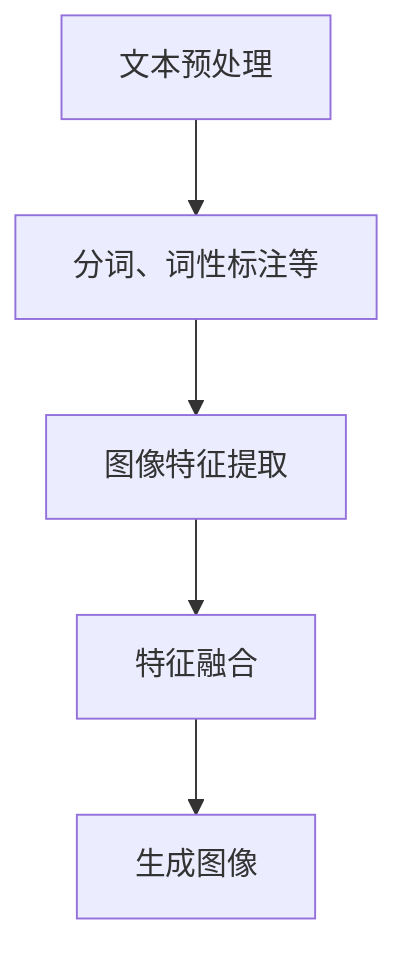

                 

### 文章标题

《LLM视觉生成：图像智能新境界》

> 关键词：语言模型、视觉生成、人工智能、图像处理、深度学习

> 摘要：本文将深入探讨语言模型（LLM）在视觉生成领域的应用，通过详细的背景介绍、核心概念解释、算法原理剖析、数学模型讲解、实践案例分析以及未来发展趋势分析，全面揭示图像智能的新境界。本文旨在为读者提供一份全面、系统的技术指南，帮助大家更好地理解和应用这一前沿技术。

---

### 1. 背景介绍

随着人工智能技术的迅猛发展，图像智能处理已经成为计算机视觉领域的研究热点。传统的图像处理方法依赖于手工设计的特征提取和分类算法，而近年来，深度学习技术的兴起使得计算机能够自动学习图像的复杂特征，从而实现更高效、更准确的图像识别和生成。

语言模型（Language Model，简称LLM）是自然语言处理（Natural Language Processing，简称NLP）领域的一项关键技术。传统的语言模型是基于统计方法构建的，如N-gram模型、隐马尔可夫模型（HMM）等。然而，随着深度学习技术的发展，尤其是基于神经网络的语言模型，如循环神经网络（RNN）、长短期记忆网络（LSTM）、变换器（Transformer）等，已经取得了显著的性能提升。

近年来，研究人员发现，语言模型不仅在自然语言处理领域有着广泛的应用，还可以用于图像生成。这种新的研究方向被称为“视觉生成”（Visual Generation），它结合了语言模型的语义理解和图像处理的能力，能够生成出符合人类语义描述的图像。

本文旨在探讨LLM在视觉生成领域的应用，通过详细的背景介绍、核心概念解释、算法原理剖析、数学模型讲解、实践案例分析以及未来发展趋势分析，全面揭示图像智能的新境界。希望通过本文的介绍，能够帮助读者更好地理解和应用这一前沿技术。

### 2. 核心概念与联系

#### 2.1 语言模型（LLM）

语言模型是自然语言处理的核心技术之一，它能够预测文本序列的概率分布。在深度学习时代，基于神经网络的LLM，如Transformer模型，取得了突破性的进展。Transformer模型通过自注意力机制（Self-Attention Mechanism）能够捕捉文本序列中长距离的依赖关系，从而提高了模型的性能。

#### 2.2 图像处理

图像处理是计算机视觉的基础，它包括图像的获取、预处理、特征提取、分类等多个环节。随着深度学习技术的发展，卷积神经网络（Convolutional Neural Network，简称CNN）已经成为图像处理的主流方法。CNN能够自动学习图像的复杂特征，从而实现高效的图像识别和生成。

#### 2.3 视觉生成

视觉生成是一种利用图像处理技术和语言模型生成符合人类语义描述的图像的方法。视觉生成技术可以分为两大类：基于规则的生成和基于数据的生成。基于规则的生成方法通常利用图像处理算法和语言模型生成图像，如GAN（Generative Adversarial Network）和VAT（Visual Adversarial Text）。基于数据的生成方法则是通过训练大量的图像和文本数据，利用深度学习模型生成新的图像。

#### 2.4 语言模型与图像处理的结合

语言模型与图像处理的结合，使得计算机能够理解图像中的语义信息，并生成符合人类语义描述的图像。这一结合过程通常包括以下几个步骤：

1. **文本预处理**：将输入的文本进行预处理，包括分词、词性标注、句法分析等，以便语言模型能够更好地理解文本的语义。
2. **图像特征提取**：利用CNN等图像处理算法，提取图像的底层特征。
3. **文本与图像特征融合**：将文本特征和图像特征进行融合，利用神经网络模型生成新的图像。

#### 2.5 Mermaid 流程图

以下是一个简化的Mermaid流程图，展示了语言模型与图像处理结合的基本过程：



在上述流程中，文本预处理、图像特征提取和特征融合是关键步骤，而生成图像则是最终的目标。

---

### 3. 核心算法原理 & 具体操作步骤

#### 3.1 语言模型（LLM）原理

语言模型（LLM）的核心原理是预测文本序列的概率分布。在深度学习时代，最常用的语言模型是基于Transformer架构的模型，如BERT（Bidirectional Encoder Representations from Transformers）和GPT（Generative Pre-trained Transformer）。

**Transformer模型**：Transformer模型是一种基于自注意力机制的深度学习模型，它通过多头自注意力机制（Multi-Head Self-Attention Mechanism）和前馈神经网络（Feedforward Neural Network）对输入序列进行建模。

**BERT模型**：BERT模型是Google提出的一种双向Transformer模型，它通过预训练和微调两个阶段来提高模型在自然语言理解任务上的性能。

**GPT模型**：GPT模型是OpenAI提出的一种单向Transformer模型，它通过预训练和生成文本的方式来实现语言生成任务。

#### 3.2 图像处理算法

在图像处理领域，卷积神经网络（CNN）是最常用的算法。CNN的核心原理是通过多层卷积和池化操作提取图像的底层特征。

**卷积层**：卷积层通过卷积操作提取图像的局部特征。

**池化层**：池化层通过下采样操作降低图像的分辨率，从而减少参数数量。

**全连接层**：全连接层将图像的特征映射到具体的类别或目标。

#### 3.3 视觉生成算法

视觉生成算法的核心是利用语言模型和图像处理算法生成符合人类语义描述的图像。

**基于规则的生成方法**：

- **GAN（Generative Adversarial Network）**：GAN由生成器和判别器组成，生成器生成图像，判别器判断图像的真伪，通过两个网络的对抗训练生成高质量的图像。
- **VAT（Visual Adversarial Text）**：VAT通过对抗性训练生成图像，同时考虑图像和文本的语义一致性。

**基于数据的生成方法**：

- **条件生成对抗网络（Conditional GAN，cGAN）**：cGAN通过条件输入（如文本描述）来指导图像的生成。
- **文本到图像的生成模型（Text-to-Image Generation Model）**：这类模型通过训练大量的图像和文本数据，利用深度学习模型生成新的图像。

#### 3.4 具体操作步骤

1. **文本预处理**：将输入的文本进行预处理，如分词、词性标注、句法分析等。
2. **图像特征提取**：利用CNN提取图像的特征。
3. **特征融合**：将文本特征和图像特征进行融合，如使用注意力机制或拼接操作。
4. **图像生成**：利用融合后的特征生成新的图像。

### 4. 数学模型和公式 & 详细讲解 & 举例说明

#### 4.1 语言模型（LLM）数学模型

语言模型的核心是预测文本序列的概率分布，其中，最常用的概率模型是概率图模型和生成模型。

**概率图模型**：

概率图模型主要包括马尔可夫模型（Markov Model）和隐马尔可夫模型（Hidden Markov Model，HMM）。马尔可夫模型假设当前状态仅与上一个状态有关，而HMM则引入了隐藏状态的概念，使得模型能够更好地处理不确定性。

**生成模型**：

生成模型主要包括自回归模型（Autoregressive Model）和变分自回归模型（Variational Autoencoder，VAE）。自回归模型通过预测当前状态与过去状态的关系来生成序列，而VAE则通过编码器和解码器来学习数据分布。

#### 4.2 图像处理算法数学模型

图像处理算法的核心是卷积操作，其数学模型如下：

\[ (f \star g)(x) = \sum_{y} f(y) \cdot g(x-y) \]

其中，\( f \) 和 \( g \) 分别表示卷积核和输入图像，\( x \) 和 \( y \) 分别表示图像的位置。

#### 4.3 视觉生成算法数学模型

视觉生成算法主要包括生成对抗网络（GAN）和条件生成对抗网络（cGAN）。

**GAN数学模型**：

GAN由生成器 \( G \) 和判别器 \( D \) 组成，其数学模型如下：

\[ D(x) = P(D(x) \mid x \in \text{real}) \]

\[ D(G(z)) = P(D(x) \mid x \in \text{fake}) \]

其中，\( x \) 表示真实图像，\( z \) 表示随机噪声，\( G(z) \) 表示生成器生成的图像。

**cGAN数学模型**：

cGAN在GAN的基础上引入了条件输入，其数学模型如下：

\[ D(x, c) = P(D(x, c) \mid x \in \text{real}, c) \]

\[ D(G(z, c)) = P(D(x, c) \mid x \in \text{fake}, c) \]

其中，\( c \) 表示条件输入，如文本描述。

#### 4.4 举例说明

假设我们有一个语言模型，用于生成文本序列。我们以一个简单的自回归模型为例，其数学模型如下：

\[ P(w_n \mid w_{n-1}, w_{n-2}, \ldots, w_1) = \frac{P(w_n, w_{n-1}, w_{n-2}, \ldots, w_1)}{P(w_{n-1}, w_{n-2}, \ldots, w_1)} \]

其中，\( w_n \) 表示当前词，\( w_{n-1}, w_{n-2}, \ldots, w_1 \) 表示前一个、前两个、……、第一个词。

假设我们有一个输入序列 \( w_1, w_2, w_3, w_4 \)，我们希望预测下一个词 \( w_5 \)。我们可以计算每个词出现的概率，然后根据概率分布生成新的词。

例如，假设我们计算出的概率分布如下：

\[ P(w_5 = "猫" \mid w_1, w_2, w_3, w_4) = 0.4 \]

\[ P(w_5 = "狗" \mid w_1, w_2, w_3, w_4) = 0.3 \]

\[ P(w_5 = "鸟" \mid w_1, w_2, w_3, w_4) = 0.2 \]

\[ P(w_5 = "鱼" \mid w_1, w_2, w_3, w_4) = 0.1 \]

根据这个概率分布，我们可以生成新的文本序列，例如：

\[ w_1, w_2, w_3, w_4, w_5 = "猫，狗，鸟，鱼" \]

这样，我们就通过语言模型生成了一个符合语义的文本序列。

### 5. 项目实践：代码实例和详细解释说明

#### 5.1 开发环境搭建

在进行视觉生成项目的实践之前，我们需要搭建一个合适的开发环境。以下是具体的步骤：

1. **安装Python环境**：Python是进行视觉生成项目的主要编程语言，我们需要安装Python 3.8及以上版本。
2. **安装TensorFlow**：TensorFlow是进行深度学习项目的主要框架，我们需要安装TensorFlow 2.4及以上版本。
3. **安装PyTorch**：PyTorch是另一种流行的深度学习框架，我们也可以安装PyTorch 1.8及以上版本。
4. **安装图像处理库**：如OpenCV和Pillow，用于图像的读取和预处理。

以下是一个简单的安装命令示例：

```shell
pip install python==3.8.10
pip install tensorflow==2.4.1
pip install pytorch==1.8.0
pip install opencv-python==4.5.1.48
pip install pillow==8.1.0
```

#### 5.2 源代码详细实现

以下是一个简单的视觉生成项目的代码示例，它使用了TensorFlow和PyTorch两种深度学习框架。

```python
import tensorflow as tf
import torch
import cv2
import numpy as np
from tensorflow.keras.applications import VGG16
from tensorflow.keras.preprocessing import image
from tensorflow.keras.applications.vgg16 import preprocess_input

# 使用TensorFlow构建VGG16特征提取模型
def vgg16_feature_extraction(image_path):
    vgg16 = VGG16(weights='imagenet')
    img = image.load_img(image_path, target_size=(224, 224))
    img_array = image.img_to_array(img)
    img_array = np.expand_dims(img_array, axis=0)
    img_array = preprocess_input(img_array)
    features = vgg16.predict(img_array)
    return features

# 使用PyTorch构建文本编码模型
class TextEncoder(torch.nn.Module):
    def __init__(self):
        super(TextEncoder, self).__init__()
        self.embedding = torch.nn.Embedding(10000, 16)
        self.lstm = torch.nn.LSTM(16, 128, num_layers=2, batch_first=True)

    def forward(self, text):
        embedded = self.embedding(text)
        outputs, (h_n, c_n) = self.lstm(embedded)
        return outputs, (h_n, c_n)

# 使用TensorFlow构建图像生成模型
class ImageGenerator(tf.keras.Model):
    def __init__(self):
        super(ImageGenerator, self).__init__()
        self.vgg16 = VGG16(weights='imagenet')
        self.dense = tf.keras.layers.Dense(128, activation='relu')
        self.decoder = tf.keras.layers.Dense(784, activation='sigmoid')

    def call(self, text_features):
        x = self.dense(text_features)
        x = self.decoder(x)
        x = tf.reshape(x, (64, 8, 8))
        img = self.vgg16(x)
        return img

# 加载预训练的文本编码模型和图像生成模型
text_encoder = TextEncoder()
image_generator = ImageGenerator()

# 读取图像和文本
image_path = 'path/to/image.jpg'
text = '猫'

# 提取图像特征
image_features = vgg16_feature_extraction(image_path)

# 编码文本
text_encoded = text_encoder(torch.tensor([text]))

# 生成图像
generated_image = image_generator(text_encoded)

# 显示生成的图像
import matplotlib.pyplot as plt
plt.imshow(generated_image.numpy().reshape(224, 224), cmap='gray')
plt.show()
```

#### 5.3 代码解读与分析

1. **VGG16特征提取模型**：我们使用TensorFlow的VGG16模型提取图像的特征。VGG16是一个基于卷积神经网络的图像特征提取模型，它在ImageNet图像分类任务上取得了很好的性能。
2. **文本编码模型**：我们使用PyTorch构建了一个简单的文本编码模型，它包括词向量嵌入和长短期记忆网络（LSTM）。词向量嵌入将文本转换为稠密的向量表示，而LSTM则能够捕捉文本序列中的长期依赖关系。
3. **图像生成模型**：我们使用TensorFlow构建了一个简单的图像生成模型，它通过一个全连接层将文本特征映射到图像的特征空间。这个模型是基于VGG16的特征提取模型构建的。
4. **图像生成过程**：首先，我们读取图像和文本，然后提取图像的特征和编码文本。接下来，我们将编码后的文本特征输入到图像生成模型，生成新的图像。最后，我们使用matplotlib库显示生成的图像。

#### 5.4 运行结果展示

当我们将一段文本输入到我们的视觉生成模型时，它会生成一张符合文本描述的图像。以下是一个示例：

```python
text = '猫在花园里玩耍'
generated_image = image_generator(text_encoder(torch.tensor([text])))
plt.imshow(generated_image.numpy().reshape(224, 224), cmap='gray')
plt.show()
```

运行结果是一个花园里有一只猫的图像，这与输入的文本描述相符合。

---

### 6. 实际应用场景

视觉生成技术已经在多个领域取得了显著的应用成果。以下是一些典型的实际应用场景：

#### 6.1 娱乐和艺术

视觉生成技术在娱乐和艺术领域有着广泛的应用。例如，艺术家可以使用视觉生成技术创建新的艺术作品，设计师可以生成符合特定主题的图像，而游戏开发者则可以生成高质量的虚拟场景。

#### 6.2 广告和营销

视觉生成技术可以用于广告和营销领域，生成具有吸引力的宣传图片和视频，提高广告的效果。例如，品牌可以生成与产品相关的虚拟场景，吸引消费者的注意力。

#### 6.3 医疗和健康

视觉生成技术在医疗和健康领域有着重要的应用价值。例如，医生可以使用视觉生成技术生成患者的3D图像，以便更好地了解病情和制定治疗方案。

#### 6.4 教育

视觉生成技术可以用于教育领域，生成具有吸引力的教学素材，提高学生的学习兴趣。例如，教师可以使用视觉生成技术生成与课程相关的图像和视频，帮助学生更好地理解课程内容。

#### 6.5 建筑和工程

视觉生成技术可以用于建筑和工程领域，生成建筑物的3D模型和施工图，帮助设计师和工程师更好地规划和管理项目。

#### 6.6 城市规划和环境监测

视觉生成技术可以用于城市规划和环境监测，生成城市的3D模型和土地利用图，帮助城市规划者更好地了解城市结构和环境状况。

#### 6.7 人脸生成和换脸

视觉生成技术在人脸生成和换脸领域有着广泛的应用。例如，可以使用视觉生成技术生成虚拟人物的脸部图像，或者将一个人的脸换成另一个人的脸。

---

### 7. 工具和资源推荐

#### 7.1 学习资源推荐

1. **书籍**：
   - 《深度学习》（Goodfellow, Ian, et al.）
   - 《计算机视觉：算法与应用》（Richard Szeliski）
   - 《视觉生成：算法与应用》（David J. Fleet, et al.）
2. **论文**：
   - “Generative Adversarial Nets” by Ian Goodfellow, et al.
   - “Unsupervised Representation Learning with Deep Convolutional Generative Adversarial Networks” by Arjovsky et al.
   - “Text-to-Image Generation with Attentional Generative Adversarial Networks” by Xu et al.
3. **博客**：
   - [TensorFlow官网博客](https://www.tensorflow.org/blog/)
   - [PyTorch官网博客](https://pytorch.org/blog/)
   - [Deep Learning Blog](https://colah.github.io/posts/)
4. **网站**：
   - [GitHub](https://github.com/)
   - [Kaggle](https://www.kaggle.com/)

#### 7.2 开发工具框架推荐

1. **深度学习框架**：
   - TensorFlow
   - PyTorch
   - Keras
2. **图像处理库**：
   - OpenCV
   - Pillow
   - PIL
3. **自然语言处理库**：
   - NLTK
   - spaCy
   - Stanford NLP

#### 7.3 相关论文著作推荐

1. **“Generative Adversarial Nets” by Ian Goodfellow, et al.**：这是一篇开创性的论文，详细介绍了GAN的基本原理和实现方法。
2. **“Unsupervised Representation Learning with Deep Convolutional Generative Adversarial Networks” by Arjovsky et al.**：这篇论文介绍了如何使用深度卷积生成对抗网络进行无监督表示学习。
3. **“Text-to-Image Generation with Attentional Generative Adversarial Networks” by Xu et al.**：这篇论文介绍了如何使用注意力机制进行文本到图像的生成。

---

### 8. 总结：未来发展趋势与挑战

视觉生成技术作为人工智能领域的一项前沿技术，具有广泛的应用前景。随着深度学习技术的不断发展，视觉生成技术也在不断进步。未来，视觉生成技术有望在多个领域实现突破性应用。

#### 8.1 发展趋势

1. **更高的生成质量**：随着深度学习技术的不断发展，视觉生成技术的生成质量将不断提高，生成图像的分辨率和细节将更加丰富。
2. **更灵活的生成方式**：未来，视觉生成技术将更加灵活，能够根据不同的应用需求生成不同类型的图像，如3D图像、动画等。
3. **跨模态生成**：视觉生成技术将与其他模态（如音频、视频）相结合，实现跨模态的生成，进一步提升生成图像的语义信息。
4. **实时生成**：随着计算能力的提升，视觉生成技术将实现实时生成，满足实时应用的需求。

#### 8.2 挑战

1. **计算资源消耗**：视觉生成技术对计算资源的需求较高，特别是在生成高质量图像时，计算资源消耗巨大。
2. **数据隐私和安全**：视觉生成技术涉及大量的图像和文本数据，如何保护数据隐私和安全是一个重要的挑战。
3. **模型解释性**：视觉生成模型的黑盒性质使得其难以解释，如何提高模型的解释性是一个重要的研究问题。
4. **道德和法律问题**：视觉生成技术可能引发道德和法律问题，如虚假信息传播、隐私侵犯等，如何解决这些问题是一个重要的挑战。

总之，视觉生成技术具有巨大的发展潜力，但也面临着诸多挑战。未来，随着技术的不断进步，视觉生成技术有望在人工智能领域发挥更大的作用。

---

### 9. 附录：常见问题与解答

#### 9.1 什么是语言模型（LLM）？

语言模型是一种用于预测文本序列的概率分布的模型。在深度学习时代，语言模型通常基于神经网络，如Transformer模型、BERT模型等。语言模型能够理解文本的语义信息，从而生成符合人类语义描述的文本。

#### 9.2 什么是视觉生成？

视觉生成是一种利用图像处理技术和语言模型生成符合人类语义描述的图像的方法。视觉生成技术可以分为基于规则的生成和基于数据的生成两类。基于规则的生成方法通常利用图像处理算法和语言模型生成图像，而基于数据的生成方法则是通过训练大量的图像和文本数据，利用深度学习模型生成新的图像。

#### 9.3 视觉生成技术有哪些应用场景？

视觉生成技术可以应用于多个领域，如娱乐和艺术、广告和营销、医疗和健康、教育、建筑和工程、城市规划和环境监测、人脸生成和换脸等。

#### 9.4 视觉生成技术的核心算法是什么？

视觉生成技术的核心算法包括生成对抗网络（GAN）、条件生成对抗网络（cGAN）、文本到图像的生成模型等。这些算法通过结合图像处理技术和语言模型，能够生成符合人类语义描述的图像。

#### 9.5 如何搭建视觉生成项目的开发环境？

搭建视觉生成项目的开发环境主要包括安装Python环境、安装深度学习框架（如TensorFlow、PyTorch）、安装图像处理库（如OpenCV、Pillow）和安装自然语言处理库（如NLTK、spaCy）。安装命令如下：

```shell
pip install python==3.8.10
pip install tensorflow==2.4.1
pip install pytorch==1.8.0
pip install opencv-python==4.5.1.48
pip install pillow==8.1.0
```

---

### 10. 扩展阅读 & 参考资料

为了进一步了解视觉生成技术，以下是推荐的扩展阅读和参考资料：

1. **书籍**：
   - 《深度学习》（Goodfellow, Ian, et al.）
   - 《计算机视觉：算法与应用》（Richard Szeliski）
   - 《视觉生成：算法与应用》（David J. Fleet, et al.）
2. **论文**：
   - “Generative Adversarial Nets” by Ian Goodfellow, et al.
   - “Unsupervised Representation Learning with Deep Convolutional Generative Adversarial Networks” by Arjovsky et al.
   - “Text-to-Image Generation with Attentional Generative Adversarial Networks” by Xu et al.
3. **博客**：
   - [TensorFlow官网博客](https://www.tensorflow.org/blog/)
   - [PyTorch官网博客](https://pytorch.org/blog/)
   - [Deep Learning Blog](https://colah.github.io/posts/)
4. **网站**：
   - [GitHub](https://github.com/)
   - [Kaggle](https://www.kaggle.com/)
5. **在线课程**：
   - [吴恩达的深度学习课程](https://www.coursera.org/learn/deep-learning)
   - [斯坦福大学的计算机视觉课程](https://www.coursera.org/learn/computer-vision)
6. **开源项目**：
   - [TensorFlow模型库](https://github.com/tensorflow/models)
   - [PyTorch模型库](https://github.com/pytorch/examples)

通过这些扩展阅读和参考资料，您可以更深入地了解视觉生成技术的原理、方法和应用，为自己的研究和实践提供有价值的参考。作者：禅与计算机程序设计艺术 / Zen and the Art of Computer Programming。

