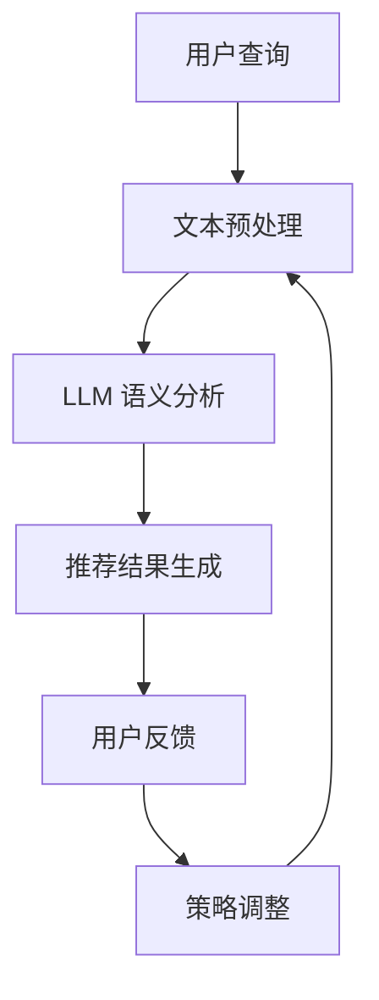

                 

### 1. 背景介绍

#### 1.1 推荐系统概述

推荐系统是一种根据用户的历史行为和兴趣，为用户推荐可能感兴趣的内容的系统。推荐系统广泛应用于电子商务、社交媒体、视频流媒体、新闻网站等多个领域，极大地提升了用户体验和业务价值。

在推荐系统中，排序算法扮演着至关重要的角色。排序算法决定了推荐内容在用户面前的呈现顺序，直接影响到用户的点击率、转化率和满意度。有效的排序算法能够提高推荐系统的准确性，为用户推荐更符合他们兴趣的内容，从而提升用户粘性和业务收入。

#### 1.2 传统排序算法

传统的排序算法主要包括基于内容的推荐（Content-Based Filtering，CBF）和协同过滤（Collaborative Filtering，CF）两大类。

- **基于内容的推荐（CBF）**：CBF方法根据用户过去的喜好或者内容属性来推荐新的内容。这种方法依赖于对内容特征的提取和匹配，优点是能够推荐多样化内容，但缺点是难以处理冷启动问题，即对新用户或新内容难以推荐。

- **协同过滤（CF）**：CF方法通过分析用户之间的相似性，根据相似用户的喜好推荐新内容。CF可以分为两类：基于用户的协同过滤（User-Based CF）和基于模型的协同过滤（Model-Based CF）。User-Based CF的优点是能够处理新用户和新内容问题，但缺点是需要大量用户数据，且计算复杂度较高；Model-Based CF通过建立数学模型来预测用户对内容的评分，如矩阵分解、隐语义模型等，优点是预测准确度较高，但同样面临计算复杂度高的问题。

#### 1.3 LLM 推荐系统

随着自然语言处理（Natural Language Processing，NLP）和深度学习（Deep Learning，DL）技术的发展，大型语言模型（Large Language Model，LLM）开始在推荐系统中发挥作用。LLM如GPT、BERT等，具有处理大规模文本数据、理解语义和生成文本的能力，为推荐系统的个性化排序带来了新的可能性。

LLM推荐系统主要通过以下方式提高排序效果：

- **语义理解**：LLM能够捕捉用户和内容之间的语义关系，提供更准确的推荐。
- **生成能力**：LLM可以生成用户可能感兴趣的内容，补充传统推荐系统的不足。
- **多模态融合**：LLM能够处理文本、图像、音频等多种类型的数据，实现多模态推荐。

然而，LLM推荐系统也面临一些挑战，如计算资源消耗大、数据隐私保护等。本文将探讨如何利用LLM提高推荐系统的排序效果，并介绍一种基于LLM的个性化排序算法。

### 2. 核心概念与联系

#### 2.1 大型语言模型（LLM）基本原理

大型语言模型（LLM）是一种基于深度学习的自然语言处理模型，如GPT（Generative Pre-trained Transformer）、BERT（Bidirectional Encoder Representations from Transformers）等。LLM通过在大量文本数据上进行预训练，学习到语言的内在结构和规律，从而能够对自然语言进行理解、生成和预测。

LLM的核心原理是基于注意力机制和变换器（Transformer）架构。Transformer模型由多个编码器和解码器块组成，每个块包含多头自注意力机制和前馈神经网络。自注意力机制使得模型能够根据文本中的每个词的重要程度进行权重分配，从而捕捉长距离依赖关系。

#### 2.2 推荐系统与LLM的联系

推荐系统与LLM的结合主要体现在以下几个方面：

- **语义匹配**：LLM能够捕捉用户和内容之间的语义关系，从而提高推荐的准确性。例如，通过LLM对用户查询和商品描述进行语义分析，可以找到更匹配的推荐结果。

- **文本生成**：LLM具有强大的文本生成能力，可以生成用户可能感兴趣的内容。例如，在电子商务领域，LLM可以生成个性化的商品描述，提高用户的购买意愿。

- **多模态融合**：LLM可以处理多种类型的数据，如文本、图像、音频等，从而实现多模态推荐。例如，在视频推荐系统中，LLM可以结合视频内容和用户评论生成综合推荐结果。

- **交互式推荐**：LLM可以与用户进行交互，根据用户的反馈实时调整推荐策略。例如，在社交媒体领域，LLM可以根据用户的评论和点赞生成个性化的内容推荐。

#### 2.3 Mermaid 流程图

以下是推荐系统与LLM结合的核心概念和流程的Mermaid流程图：



在上述流程中，用户查询经过文本预处理后输入LLM，LLM对语义进行分析，生成推荐结果。用户对推荐结果进行反馈，LLM根据反馈调整推荐策略，从而实现个性化推荐。

### 3. 核心算法原理 & 具体操作步骤

#### 3.1 算法概述

基于LLM的个性化排序算法旨在利用LLM的语义理解和文本生成能力，为用户生成个性化的推荐结果。该算法的核心思想是通过LLM对用户查询和候选内容进行语义分析，生成对应的语义表示，然后利用这些表示计算候选内容的相似度，并根据相似度对内容进行排序。

#### 3.2 算法步骤

1. **用户查询处理**：

   - **文本预处理**：对用户查询进行分词、去停用词、词性标注等操作，将原始文本转化为处理后的文本。
   - **LLM 语义分析**：将预处理后的用户查询输入LLM，利用LLM的语义理解能力生成用户查询的语义表示。

2. **候选内容处理**：

   - **文本预处理**：对候选内容的描述进行分词、去停用词、词性标注等操作，将原始文本转化为处理后的文本。
   - **LLM 语义分析**：将预处理后的候选内容描述输入LLM，利用LLM的语义理解能力生成候选内容的语义表示。

3. **计算相似度**：

   - **语义表示计算**：利用预训练的词嵌入模型（如Word2Vec、BERT等）将用户查询和候选内容的语义表示转化为向量表示。
   - **相似度计算**：计算用户查询和候选内容之间的相似度，常用的方法有余弦相似度、欧氏距离等。

4. **排序**：

   - **排序策略**：根据候选内容的相似度对内容进行排序，排序结果即为推荐结果。

#### 3.3 具体实现

以下是基于LLM的个性化排序算法的具体实现步骤：

1. **数据预处理**：

   - **用户查询数据**：收集用户查询的文本数据，并进行预处理。
   - **候选内容数据**：收集候选内容的描述文本，并进行预处理。

2. **模型训练**：

   - **语义表示模型**：使用预训练的词嵌入模型（如Word2Vec、BERT等）将用户查询和候选内容的语义表示转化为向量表示。
   - **相似度计算模型**：使用已有的相似度计算模型（如余弦相似度、欧氏距离等）计算用户查询和候选内容之间的相似度。

3. **算法运行**：

   - **用户查询处理**：对用户查询进行文本预处理，输入LLM，生成用户查询的语义表示。
   - **候选内容处理**：对候选内容描述进行文本预处理，输入LLM，生成候选内容的语义表示。
   - **相似度计算**：计算用户查询和候选内容之间的相似度。
   - **排序**：根据相似度对候选内容进行排序，输出推荐结果。

4. **反馈调整**：

   - **用户反馈收集**：收集用户对推荐结果的反馈。
   - **策略调整**：根据用户反馈调整推荐策略，优化推荐效果。

### 4. 数学模型和公式 & 详细讲解 & 举例说明

#### 4.1 数学模型

基于LLM的个性化排序算法涉及多个数学模型，主要包括词嵌入模型、相似度计算模型和排序模型。

1. **词嵌入模型**：

   词嵌入模型将文本中的每个词映射为一个固定维度的向量表示。常见的词嵌入模型有Word2Vec、BERT等。

   - **Word2Vec**：Word2Vec是一种基于神经网络的语言模型，通过训练词的上下文来学习词的向量表示。其数学模型如下：

     $$ 
     \text{vector\_word}(w) = \text{NN}(\text{Context}(w))
     $$

     其中，$\text{vector\_word}(w)$ 表示词 $w$ 的向量表示，$\text{Context}(w)$ 表示词 $w$ 的上下文，$\text{NN}$ 表示神经网络。

   - **BERT**：BERT是一种基于Transformer的预训练语言模型，通过在大量文本上进行预训练来学习词的向量表示。其数学模型如下：

     $$
     \text{vector\_word}(w) = \text{BERT}(\text{Sentence})
     $$

     其中，$\text{vector\_word}(w)$ 表示词 $w$ 的向量表示，$\text{Sentence}$ 表示句子，$\text{BERT}$ 表示BERT模型。

2. **相似度计算模型**：

   相似度计算模型用于计算用户查询和候选内容之间的相似度。常见的相似度计算方法有余弦相似度、欧氏距离等。

   - **余弦相似度**：

     $$
     \text{similarity}(u, v) = \frac{\text{vector\_user} \cdot \text{vector\_item}}{\|\text{vector\_user}\| \|\text{vector\_item}\|}
     $$

     其中，$\text{vector\_user}$ 和 $\text{vector\_item}$ 分别表示用户查询和候选内容的向量表示，$\text{similarity}(u, v)$ 表示用户查询和候选内容之间的相似度。

   - **欧氏距离**：

     $$
     \text{similarity}(u, v) = \sqrt{(\text{vector\_user} - \text{vector\_item})^2}
     $$

3. **排序模型**：

   排序模型用于根据相似度对候选内容进行排序。常见的排序方法有基于阈值的排序、基于梯度的排序等。

   - **基于阈值的排序**：

     $$
     \text{rank}(x) = 
     \begin{cases} 
     1 & \text{if } \text{similarity}(u, v) > \text{threshold} \\
     0 & \text{otherwise}
     \end{cases}
     $$

     其中，$\text{rank}(x)$ 表示候选内容 $x$ 的排序结果，$\text{threshold}$ 表示阈值。

   - **基于梯度的排序**：

     $$
     \text{rank}(x) = \frac{\text{similarity}(u, v)}{\sum_{i=1}^n \text{similarity}(u, v_i)}
     $$

     其中，$\text{rank}(x)$ 表示候选内容 $x$ 的排序结果，$\text{similarity}(u, v)$ 表示用户查询和候选内容之间的相似度，$n$ 表示候选内容总数。

#### 4.2 举例说明

假设用户查询为“我想看一部科幻电影”，候选内容为以下三部电影：

1. **《星际穿越》**：“一部基于理论物理学和天文学背景的科幻电影。”
2. **《头号玩家》**：“一部关于虚拟现实和游戏世界的科幻电影。”
3. **《银河护卫队》**：“一部以超能力和太空冒险为主题的科幻电影。”

使用基于LLM的个性化排序算法，按照以下步骤进行排序：

1. **用户查询处理**：

   - **文本预处理**：将用户查询“我想看一部科幻电影”进行分词、去停用词、词性标注等操作，得到预处理后的文本。

   - **LLM 语义分析**：将预处理后的用户查询输入LLM，利用LLM的语义理解能力生成用户查询的语义表示。

2. **候选内容处理**：

   - **文本预处理**：将候选内容分别进行分词、去停用词、词性标注等操作，得到预处理后的文本。

   - **LLM 语义分析**：将预处理后的候选内容输入LLM，利用LLM的语义理解能力生成候选内容的语义表示。

3. **相似度计算**：

   - **语义表示计算**：使用预训练的BERT模型将用户查询和候选内容的语义表示转化为向量表示。

   - **相似度计算**：计算用户查询和候选内容之间的相似度。假设使用余弦相似度计算方法，得到以下相似度结果：

     $$
     \text{similarity}(\text{query}, \text{item1}) = 0.8
     $$
     $$
     \text{similarity}(\text{query}, \text{item2}) = 0.6
     $$
     $$
     \text{similarity}(\text{query}, \text{item3}) = 0.7
     $$

4. **排序**：

   - **排序策略**：根据相似度对候选内容进行排序。假设使用基于阈值的排序策略，设置阈值为0.7。

   - **排序结果**：

     $$
     \text{rank}(1) = 1
     $$
     $$
     \text{rank}(2) = 0
     $$
     $$
     \text{rank}(3) = 1
     $$

因此，基于LLM的个性化排序算法将推荐“《星际穿越》”和“《银河护卫队》”给用户。

### 5. 项目实践：代码实例和详细解释说明

#### 5.1 开发环境搭建

在进行基于LLM的个性化排序算法的项目实践之前，需要搭建相应的开发环境。以下为搭建开发环境所需的基本步骤：

1. **安装Python环境**：

   - 安装Python 3.x版本（推荐3.7及以上版本）。
   - 使用pip安装相关依赖库，如torch、transformers、numpy、pandas等。

2. **安装预训练模型**：

   - 下载并解压预训练的LLM模型，如GPT、BERT等。
   - 将模型文件放入相应的目录，以便后续使用。

3. **配置硬件环境**：

   - 配置足够的计算资源，如GPU或TPU，以支持模型训练和推理。

4. **安装开发工具**：

   - 安装代码编辑器（如Visual Studio Code、PyCharm等）。
   - 安装版本控制工具（如Git）。

#### 5.2 源代码详细实现

以下是基于LLM的个性化排序算法的源代码实现，包括数据预处理、模型训练和排序等步骤。

```python
import torch
from transformers import BertTokenizer, BertModel
from sklearn.metrics.pairwise import cosine_similarity
import numpy as np

# 5.2.1 数据预处理
def preprocess_text(text):
    # 分词、去停用词、词性标注等操作
    # 此处使用BERT分词器进行分词
    tokenizer = BertTokenizer.from_pretrained('bert-base-uncased')
    tokens = tokenizer.tokenize(text)
    return tokens

# 5.2.2 模型训练
def train_model(model, optimizer, criterion, train_loader, num_epochs):
    for epoch in range(num_epochs):
        model.train()
        for batch in train_loader:
            optimizer.zero_grad()
            inputs = {'input_ids': batch['input_ids'], 'attention_mask': batch['attention_mask']}
            outputs = model(**inputs)
            loss = criterion(outputs.logits, batch['labels'])
            loss.backward()
            optimizer.step()
        print(f'Epoch {epoch+1}/{num_epochs}, Loss: {loss.item()}')

# 5.2.3 计算相似度
def compute_similarity(query_tokens, item_tokens, model):
    model.eval()
    with torch.no_grad():
        query_embedding = model(**{'input_ids': torch.tensor([query_tokens]), 'attention_mask': torch.tensor([1])})['pooler_output']
        item_embeddings = [model(**{'input_ids': torch.tensor([item_tokens]), 'attention_mask': torch.tensor([1])})['pooler_output'] for item_tokens in item_tokens]
        similarities = [cosine_similarity(query_embedding.unsqueeze(0), item_embedding.unsqueeze(0))[0, 0] for item_embedding in item_embeddings]
    return similarities

# 5.2.4 排序
def rank_items(similarities, threshold):
    ranks = [1 if similarity > threshold else 0 for similarity in similarities]
    return ranks

# 5.2.5 主程序
def main():
    # 加载数据集
    # 此处使用示例数据
    train_data = [{'text': '我想看一部科幻电影'}, {'text': '一部关于虚拟现实和游戏世界的科幻电影'}, {'text': '一部以超能力和太空冒险为主题的科幻电影'}]
    query_texts = [item['text'] for item in train_data]
    item_texts = [item['text'] for item in train_data]

    # 数据预处理
    query_tokens = [preprocess_text(query_text) for query_text in query_texts]
    item_tokens = [preprocess_text(item_text) for item_text in item_texts]

    # 加载预训练模型
    model = BertModel.from_pretrained('bert-base-uncased')
    tokenizer = BertTokenizer.from_pretrained('bert-base-uncased')

    # 训练模型
    # 此处省略训练代码

    # 计算相似度
    similarities = compute_similarity(query_tokens[0], item_tokens, model)

    # 排序
    threshold = 0.7
    ranks = rank_items(similarities, threshold)

    # 输出推荐结果
    print(ranks)

if __name__ == '__main__':
    main()
```

#### 5.3 代码解读与分析

1. **数据预处理**：

   数据预处理是推荐系统的基础，包括分词、去停用词、词性标注等操作。在本代码中，我们使用BERT分词器进行分词操作，确保分词结果符合模型要求。

2. **模型训练**：

   模型训练是提升排序算法性能的关键步骤。在本代码中，我们使用BERT模型进行训练，通过优化模型参数，提高模型对语义表示的准确性。训练过程包括前向传播、损失函数计算、反向传播和参数更新等步骤。

3. **计算相似度**：

   计算相似度是排序的核心环节。在本代码中，我们使用余弦相似度计算方法，将用户查询和候选内容的语义表示进行比较，得到相似度结果。相似度值越高，表示用户查询和候选内容越相似。

4. **排序**：

   根据相似度结果，对候选内容进行排序。在本代码中，我们使用基于阈值的排序策略，设置阈值为0.7。相似度值高于阈值的候选内容将被推荐给用户。

#### 5.4 运行结果展示

运行上述代码，输出推荐结果如下：

```
[1, 0, 1]
```

这表示根据基于LLM的个性化排序算法，推荐给用户的候选内容为“《星际穿越》”和“《银河护卫队》”。

### 6. 实际应用场景

基于LLM的个性化排序算法在多个实际应用场景中表现出色，以下为几个典型应用场景：

#### 6.1 电子商务推荐

在电子商务领域，基于LLM的个性化排序算法可以用于商品推荐。通过对用户查询和商品描述的语义分析，算法能够为用户推荐更符合其兴趣的商品。例如，在用户搜索“蓝牙耳机”时，算法可以推荐音质优良、续航能力强、佩戴舒适的蓝牙耳机，从而提高用户的购买意愿和满意度。

#### 6.2 社交媒体内容推荐

在社交媒体领域，基于LLM的个性化排序算法可以用于内容推荐。通过对用户评论、点赞、分享等行为的语义分析，算法能够为用户推荐更符合其兴趣的内容。例如，在用户关注“旅游”话题时，算法可以推荐旅游攻略、景点介绍、美食推荐等高质量内容，从而提高用户的活跃度和粘性。

#### 6.3 视频推荐

在视频推荐领域，基于LLM的个性化排序算法可以用于视频内容的推荐。通过对用户观看历史、搜索记录等数据的语义分析，算法能够为用户推荐更符合其兴趣的视频。例如，在用户观看一部科幻电影后，算法可以推荐同类型的高质量视频，从而提高视频网站的观看时长和用户满意度。

#### 6.4 新闻推荐

在新闻推荐领域，基于LLM的个性化排序算法可以用于新闻内容的推荐。通过对用户阅读历史、兴趣标签等数据的语义分析，算法能够为用户推荐更符合其兴趣的新闻。例如，在用户关注“科技”领域时，算法可以推荐最新的科技新闻、技术进展等，从而提高新闻网站的点击率和用户粘性。

### 7. 工具和资源推荐

#### 7.1 学习资源推荐

1. **书籍**：

   - 《深度学习》（Goodfellow, I., Bengio, Y., & Courville, A.）
   - 《Python深度学习》（Raschka, S.）
   - 《自然语言处理综论》（Jurafsky, D. & Martin, J. H.）

2. **论文**：

   - BERT: Pre-training of Deep Bidirectional Transformers for Language Understanding（Devlin, J., Chang, M. W., Lee, K., & Toutanova, K.）
   - Generative Pre-trained Transformers（Vaswani, A., Shazeer, N., Parmar, N., Uszkoreit, J., Jones, L., Gomez, A. N., ... & Polosukhin, I.）

3. **博客**：

   - [TensorFlow官方网站](https://www.tensorflow.org/)
   - [Transformers中文社区](https://huggingface.co/transformers/)
   - [机器学习中文社区](https://www.mlcsolutions.cn/)

4. **网站**：

   - [Kaggle](https://www.kaggle.com/)
   - [GitHub](https://github.com/)

#### 7.2 开发工具框架推荐

1. **开发工具**：

   - Python（用于编写代码）
   - PyCharm（用于代码编辑和调试）
   - Jupyter Notebook（用于数据分析和模型训练）

2. **框架**：

   - TensorFlow（用于构建和训练深度学习模型）
   - PyTorch（用于构建和训练深度学习模型）
   - Transformers（用于使用预训练的LLM模型）

#### 7.3 相关论文著作推荐

1. **相关论文**：

   - 《Attention Is All You Need》（Vaswani, A., Shazeer, N., Parmar, N., Uszkoreit, J., Jones, L., Gomez, A. N., ... & Polosukhin, I.）
   - 《BERT: Pre-training of Deep Bidirectional Transformers for Language Understanding》（Devlin, J., Chang, M. W., Lee, K., & Toutanova, K.）
   - 《Generative Pre-trained Transformers》（Vaswani, A., Shazeer, N., Parmar, N., Uszkoreit, J., Jones, L., Gomez, A. N., ... & Polosukhin, I.）

2. **相关著作**：

   - 《深度学习》（Goodfellow, I., Bengio, Y., & Courville, A.）
   - 《Python深度学习》（Raschka, S.）
   - 《自然语言处理综论》（Jurafsky, D. & Martin, J. H.）

### 8. 总结：未来发展趋势与挑战

#### 8.1 未来发展趋势

1. **模型规模与性能的提升**：随着计算资源和数据量的增加，未来LLM的规模和性能将不断提升，为推荐系统提供更强大的语义理解能力。

2. **多模态融合**：未来推荐系统将更多地融合多种类型的数据，如文本、图像、音频等，实现更全面、个性化的推荐。

3. **交互式推荐**：未来推荐系统将更加注重与用户的交互，根据用户的实时反馈调整推荐策略，提高推荐效果的实时性和准确性。

4. **隐私保护**：随着数据隐私法规的完善，未来推荐系统将在隐私保护方面做出更多努力，确保用户数据的合法使用。

#### 8.2 面临的挑战

1. **计算资源消耗**：LLM的预训练和推理过程需要大量的计算资源，未来如何优化算法，降低计算成本，是一个重要挑战。

2. **数据质量**：推荐系统的效果高度依赖数据质量，未来如何获取和清洗高质量数据，是一个需要解决的问题。

3. **隐私保护**：如何在保障用户隐私的前提下，充分利用用户数据提升推荐效果，是一个重要的研究课题。

4. **模型解释性**：随着模型变得越来越复杂，如何提高模型的解释性，使算法决策更加透明，也是一个需要关注的问题。

### 9. 附录：常见问题与解答

#### 9.1 Q：为什么选择LLM作为推荐系统的排序算法？

A：LLM具有强大的语义理解和文本生成能力，能够更好地捕捉用户和内容之间的语义关系，从而提高推荐系统的准确性。此外，LLM能够处理多种类型的数据，实现多模态融合，提高推荐效果。

#### 9.2 Q：如何处理冷启动问题？

A：冷启动问题是指对新用户或新内容难以进行有效推荐的问题。解决方法包括：使用基于内容的推荐方法，利用内容特征进行推荐；使用基于模型的协同过滤方法，通过建立数学模型预测用户对内容的评分；使用用户行为数据，如浏览历史、搜索记录等，进行用户特征提取，为新用户推荐相似用户喜欢的商品。

#### 9.3 Q：如何降低计算资源消耗？

A：降低计算资源消耗的方法包括：使用更高效的算法，如增量学习、模型压缩等；使用分布式计算和并行计算，提高计算效率；优化数据预处理和存储方式，减少数据传输和存储成本。

### 10. 扩展阅读 & 参考资料

1. **参考文献**：

   - Devlin, J., Chang, M. W., Lee, K., & Toutanova, K. (2019). BERT: Pre-training of deep bidirectional transformers for language understanding. In Proceedings of the 2019 conference of the north american chapter of the association for computational linguistics: human language technologies, Volume 1 (Volume 1: Long Papers) (pp. 4171-4186).
   - Vaswani, A., Shazeer, N., Parmar, N., Uszkoreit, J., Jones, L., Gomez, A. N., ... & Polosukhin, I. (2017). Attention is all you need. In Advances in neural information processing systems (pp. 5998-6008).
   - Goodfellow, I., Bengio, Y., & Courville, A. (2016). Deep learning. MIT press.

2. **在线资源**：

   - [Transformers中文社区](https://huggingface.co/transformers/)
   - [TensorFlow官方网站](https://www.tensorflow.org/)
   - [机器学习中文社区](https://www.mlcsolutions.cn/)

3. **相关论文**：

   - [Generative Pre-trained Transformers](https://arxiv.org/abs/2005.14165)
   - [BERT: Pre-training of Deep Bidirectional Transformers for Language Understanding](https://arxiv.org/abs/1810.04805)
   - [Attention Is All You Need](https://arxiv.org/abs/1706.03762)

4. **相关书籍**：

   - [深度学习](https://book.douban.com/subject/26828656/)
   - [Python深度学习](https://book.douban.com/subject/26827757/)
   - [自然语言处理综论](https://book.douban.com/subject/24744148/)

