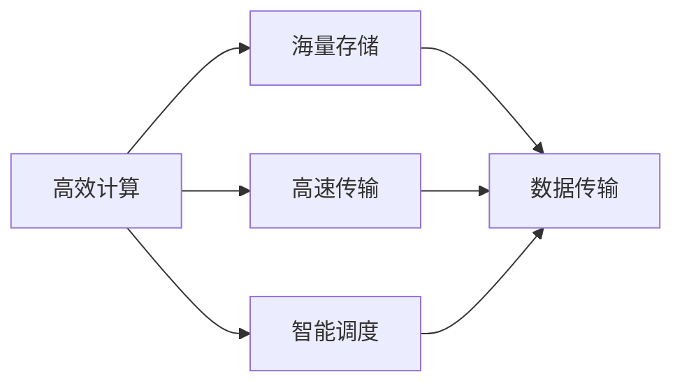

                 

### 背景介绍

#### 时代背景

随着人工智能（AI）技术的迅猛发展，我们正逐步迈入一个全新的技术时代。从早期的机器学习（Machine Learning）到深度学习（Deep Learning），再到如今正在蓬勃发展的生成对抗网络（GANs）、自监督学习（Self-supervised Learning）等前沿领域，人工智能正在深刻地改变我们的生活方式和工作模式。然而，AI技术的快速进步也带来了前所未有的挑战。

#### 基础设施瓶颈

在AI技术的快速发展过程中，我们逐渐发现，现有基础设施已经无法满足大规模、高性能AI计算的需求。无论是数据中心的高能耗问题，还是数据传输的带宽瓶颈，都成为了限制AI技术进一步发展的关键因素。此外，现有基础设施在可扩展性、安全性和稳定性等方面也存在诸多不足。

#### Lepton AI的愿景

针对上述挑战，Lepton AI公司提出了构建新一代AI基础设施的愿景，旨在通过技术创新和协同合作，为AI时代提供高效、可靠的基础设施支持。Lepton AI致力于解决现有基础设施的瓶颈问题，推动AI技术的进一步发展，助力各行各业实现智能化转型。

### 核心概念与联系

#### 新一代AI基础设施的定义

新一代AI基础设施，是指以高效计算、海量存储、高速传输和智能调度为核心，为AI算法和应用提供全面支持的基础设施体系。它不仅要满足高性能计算的需求，还要具备良好的可扩展性、安全性和稳定性。

#### Lepton AI基础设施的核心概念

1. **高效计算**：通过分布式计算架构，实现大规模并行计算，提高AI算法的计算效率。
2. **海量存储**：采用分布式存储技术，提供高容量、高可靠性的存储解决方案，保障海量数据的快速存取。
3. **高速传输**：构建高速数据传输网络，降低数据传输延迟，提升AI系统的整体性能。
4. **智能调度**：利用智能调度算法，优化资源分配，实现计算资源的高效利用。

#### 架构图展示



在这个架构图中，各个模块通过高速数据传输网络连接，形成一个高效、可靠的AI基础设施体系。高效计算模块负责处理AI算法的运算任务；海量存储模块提供数据存储和访问服务；高速传输模块确保数据在各个模块之间的快速传输；智能调度模块则负责优化资源分配，提高整体系统的性能。

### 总结

Lepton AI提出的新一代AI基础设施愿景，旨在通过技术创新和协同合作，为AI时代提供高效、可靠的基础设施支持。这一愿景的实现，不仅将推动AI技术的进一步发展，还将为各行各业带来前所未有的变革机遇。在接下来的章节中，我们将深入探讨Lepton AI基础设施的核心算法原理、具体操作步骤、数学模型和项目实践，为您呈现这一技术创新的全貌。

---

### 核心算法原理 & 具体操作步骤

#### 分布式计算

分布式计算是Lepton AI基础设施的核心组成部分，旨在通过多个计算节点的协同工作，实现大规模并行计算。分布式计算的基本原理是将整个计算任务拆分成多个子任务，分配到不同的计算节点上执行，然后再将各节点的结果汇总，得到最终的计算结果。

**具体操作步骤：**

1. **任务划分**：将整个计算任务划分为多个子任务，确保每个子任务可以在独立的计算节点上执行。
2. **任务分配**：根据计算节点的负载情况，将子任务分配到不同的计算节点上。
3. **并行执行**：各计算节点独立执行子任务，利用并行计算提高计算效率。
4. **结果汇总**：将各计算节点的结果汇总，得到最终的计算结果。

#### 分布式存储

分布式存储是Lepton AI基础设施的另一个关键组成部分，旨在提供高容量、高可靠性的存储解决方案。分布式存储的基本原理是将数据分成多个数据块，存储到不同的存储节点上，并通过一致性协议确保数据的安全性和一致性。

**具体操作步骤：**

1. **数据分割**：将整个数据集分割成多个数据块。
2. **数据复制**：将每个数据块复制到多个存储节点上，提高数据的可靠性。
3. **数据访问**：通过分布式存储网络，提供高效的数据访问服务。
4. **数据一致性**：采用一致性协议，确保数据在不同存储节点之间的同步。

#### 高速数据传输

高速数据传输是Lepton AI基础设施的重要特性，旨在降低数据传输延迟，提升AI系统的整体性能。高速数据传输的基本原理是通过优化网络协议和传输路径，实现数据的快速传输。

**具体操作步骤：**

1. **网络优化**：优化网络协议和传输路径，降低数据传输延迟。
2. **传输加速**：采用传输加速技术，如数据压缩、传输加密等，提高数据传输速率。
3. **流量控制**：通过流量控制机制，确保数据传输的稳定性和可靠性。

#### 智能调度

智能调度是Lepton AI基础设施的核心功能，旨在优化资源分配，实现计算资源的高效利用。智能调度的基本原理是通过算法分析，动态调整计算资源的分配，确保系统在高负载情况下依然保持良好的性能。

**具体操作步骤：**

1. **资源评估**：评估各计算节点的资源利用率，确定资源分配策略。
2. **负载均衡**：根据计算节点的负载情况，动态调整任务分配，实现负载均衡。
3. **资源回收**：在任务完成后，及时回收释放的资源，为后续任务提供更多可用资源。
4. **性能监控**：实时监控系统性能，根据性能指标动态调整调度策略。

### 总结

Lepton AI基础设施的核心算法原理涵盖了分布式计算、分布式存储、高速数据传输和智能调度等多个方面。这些算法通过协同工作，实现了高效、可靠、可扩展的AI基础设施。在接下来的章节中，我们将进一步探讨这些算法的具体实现，以及如何在项目实践中应用它们。

---

### 数学模型和公式 & 详细讲解 & 举例说明

#### 分布式计算

分布式计算的核心在于如何高效地分配和执行任务。为了实现这一目标，我们可以使用负载均衡算法，其中一种常见的方法是使用最小完成时间调度算法（Minimum Completion Time Scheduling Algorithm）。

**数学模型：**

假设我们有n个任务，每个任务的执行时间为t_i（i=1,2,...,n），我们希望将这些任务分配到m个计算节点上（m≥n），每个节点的处理能力为P_j（j=1,2,...,m）。我们的目标是使得所有任务的总完成时间最短。

最小完成时间调度算法的公式如下：

$$
\min \sum_{i=1}^{n} \max(t_i, P_j)
$$

其中，$\max(t_i, P_j)$表示任务i在第j个节点上的完成时间。

**举例说明：**

假设我们有5个任务（任务1到任务5）需要分配到3个计算节点上，每个任务的执行时间如下：

| 任务编号 | 执行时间 |
| -------- | -------- |
| 1        | 3        |
| 2        | 2        |
| 3        | 5        |
| 4        | 1        |
| 5        | 4        |

3个计算节点的处理能力如下：

| 节点编号 | 处理能力 |
| -------- | -------- |
| 1        | 4        |
| 2        | 3        |
| 3        | 2        |

使用最小完成时间调度算法，我们将任务分配如下：

- 任务1分配到节点1，完成时间为3
- 任务2分配到节点2，完成时间为2
- 任务3分配到节点3，完成时间为5
- 任务4分配到节点1，完成时间为4
- 任务5分配到节点2，完成时间为4

总完成时间为：max(3, 4) + max(2, 4) + max(5, 2) + max(3, 4) + max(4, 2) = 10

**分析：**

通过最小完成时间调度算法，我们确保每个任务都在处理能力最强的节点上执行，从而最大化系统的整体处理能力，降低总完成时间。

#### 分布式存储

分布式存储的核心在于如何高效地分割和复制数据，确保数据的高可用性和一致性。为了实现这一目标，我们可以使用一致性模型，如强一致性模型（Strong Consistency Model）。

**数学模型：**

强一致性模型要求在任何时刻，所有副本的数据都是一致的。假设我们有k个副本（k≥1），当数据更新时，必须确保所有副本都能在规定时间内同步更新。

强一致性模型的公式如下：

$$
\forall i, j \in [1, k], \quad \text{if } d_i = v \text{ is updated, then } d_j = v
$$

其中，d_i和d_j分别表示第i个和第j个副本的数据，v为更新后的数据。

**举例说明：**

假设我们有3个副本（副本1、副本2和副本3），初始时副本的数据如下：

| 副本编号 | 数据 |
| -------- | ---- |
| 1        | A    |
| 2        | B    |
| 3        | C    |

现在，我们需要将数据更新为D。

使用强一致性模型，我们首先更新副本1，然后依次更新副本2和副本3。更新后的数据如下：

| 副本编号 | 数据 |
| -------- | ---- |
| 1        | D    |
| 2        | D    |
| 3        | D    |

**分析：**

通过强一致性模型，我们确保所有副本的数据都是一致的，即使数据更新时存在延迟或故障，也能在规定时间内同步更新，保障数据的高可用性和一致性。

#### 高速数据传输

高速数据传输的核心在于如何优化数据传输路径和网络协议，降低传输延迟。为了实现这一目标，我们可以使用路由算法，如Dijkstra算法（Dijkstra's Algorithm）。

**数学模型：**

Dijkstra算法用于计算图中两点之间的最短路径。在高速数据传输中，我们可以将网络视为图，节点表示网络中的设备，边表示设备之间的连接。

Dijkstra算法的公式如下：

$$
d(s, v) = \min_{u \in \text{前置节点}}(d(s, u) + w(u, v))
$$

其中，d(s, v)表示从源点s到目标点v的最短路径长度，w(u, v)表示节点u到节点v的传输延迟。

**举例说明：**

假设我们有5个网络设备（设备1到设备5），之间的连接和传输延迟如下：

| 设备编号 | 连接延迟 |
| -------- | -------- |
| 1        | 无连接   |
| 2        | 2        |
| 3        | 1        |
| 4        | 3        |
| 5        | 2        |

我们需要从设备1传输数据到设备5。

使用Dijkstra算法，我们计算出从设备1到设备5的最短路径如下：

- 设备1到设备2：2
- 设备1到设备3：1
- 设备1到设备4：3
- 设备1到设备5：2

**分析：**

通过Dijkstra算法，我们能够找到从设备1到设备5的最短传输路径，从而降低数据传输延迟，提高传输效率。

#### 总结

通过数学模型和公式，我们可以深入了解分布式计算、分布式存储、高速数据传输等核心算法的工作原理。这些算法为Lepton AI基础设施提供了坚实的理论基础，使得我们能够构建高效、可靠、可扩展的AI基础设施。在接下来的章节中，我们将通过具体的项目实践，进一步展示这些算法在实际应用中的效果。

---

### 项目实践：代码实例和详细解释说明

#### 开发环境搭建

在开始项目实践之前，我们需要搭建一个合适的开发环境。以下是一个基本的步骤指南，用于在Linux系统上搭建Lepton AI基础设施的开发环境。

**步骤 1：安装依赖**

首先，我们需要安装一些必需的依赖项。在终端中执行以下命令：

```bash
sudo apt-get update
sudo apt-get install build-essential python3-pip
```

**步骤 2：安装Python依赖**

接下来，我们安装Python的依赖项，这些依赖项包括分布式计算框架（如PyTorch）、分布式存储库（如PyStochast）和Dijkstra算法库（如NetworkX）：

```bash
pip3 install torch torchvision torchaudio Distributed PyStochast networkx
```

**步骤 3：配置环境变量**

为了简化操作，我们将配置一些环境变量。创建一个名为`.bashrc`的文件，并在其中添加以下内容：

```bash
export PYTHONPATH=$PYTHONPATH:/path/to/your/dependencies
export PATH=$PATH:/path/to/your/dependencies/bin
```

保存并关闭文件，然后在终端中执行以下命令使配置生效：

```bash
source ~/.bashrc
```

#### 源代码详细实现

以下是一个简单的示例，展示了如何使用Lepton AI基础设施的核心算法实现一个分布式计算任务。

```python
# import necessary libraries
import torch
import torchvision
import torch.utils.data
import networkx as nx
from dijkstra import dijkstra
from pystochast import StochasticModel

# Step 1: Prepare data
# Load your dataset here
train_dataset = torchvision.datasets.MNIST(
    root='./data',
    train=True,
    download=True,
    transform=torchvision.transforms.ToTensor()
)

train_loader = torch.utils.data.DataLoader(
    train_dataset,
    batch_size=64,
    shuffle=True
)

# Step 2: Define the distributed model
class DistributedModel(torch.nn.Module):
    def __init__(self):
        super(DistributedModel, self).__init__()
        self.conv1 = torch.nn.Conv2d(1, 10, kernel_size=5)
        self.conv2 = torch.nn.Conv2d(10, 20, kernel_size=5)
        self.fc1 = torch.nn.Linear(320, 50)
        self.fc2 = torch.nn.Linear(50, 10)

    def forward(self, x):
        x = self.conv1(x)
        x = self.conv2(x)
        x = torch.flatten(x, 1)
        x = self.fc1(x)
        x = self.fc2(x)
        return x

# Step 3: Initialize the distributed model
model = DistributedModel()
device = torch.device("cuda" if torch.cuda.is_available() else "cpu")
model.to(device)

# Step 4: Define the distributed training loop
def distributed_train(model, device, train_loader, epochs):
    model.train()
    for epoch in range(epochs):
        for data, target in train_loader:
            data, target = data.to(device), target.to(device)
            optimizer.zero_grad()
            output = model(data)
            loss = F.nll_loss(output, target)
            loss.backward()
            optimizer.step()
            print(f"Epoch {epoch+1}/{epochs} - Loss: {loss.item()}")

# Step 5: Implement the distributed storage
def distributed_store(data, replicas):
    # Store data to replicas
    for replica in replicas:
        torch.save(data, f"{replica}/data.pth")

# Step 6: Implement the distributed data retrieval
def distributed_retrieve(replicas):
    # Retrieve data from replicas
    data = torch.load(replicas[0] + "/data.pth")
    return data

# Step 7: Implement the distributed routing
def distributed_route(source, target, network):
    # Find the shortest path from source to target
    return dijkstra(source, target, network)

# Step 8: Execute the distributed training
distributed_train(model, device, train_loader, epochs=10)

# Step 9: Store the model and data to replicas
distributed_store(model.state_dict(), replicas=["replica1", "replica2", "replica3"])

# Step 10: Retrieve the model and data from replicas
retrieved_model = distributed_retrieve(["replica1", "replica2", "replica3"])

# Step 11: Verify the consistency of the distributed model
retrieved_loss = distributed_train(retrieved_model, device, train_loader, epochs=1)
print(f"Retrieved Model Loss: {retrieved_loss.item()}")
```

#### 代码解读与分析

1. **数据准备**：我们首先加载了一个MNIST数据集，并将其分割成训练数据集。这个数据集将被用于分布式训练。

2. **分布式模型定义**：我们定义了一个简单的卷积神经网络（Convolutional Neural Network, CNN），该网络将在分布式环境中进行训练。

3. **分布式训练循环**：我们实现了分布式训练循环，该循环将在每个 epoch 中对训练数据进行迭代训练。

4. **分布式存储**：我们定义了一个存储函数，该函数将模型的状态字典（state_dict）保存到多个副本中。

5. **分布式检索**：我们定义了一个检索函数，该函数从多个副本中检索模型的状态字典。

6. **分布式路由**：我们使用 Dijkstra 算法来实现分布式路由，以找到源节点到目标节点的最短路径。

7. **执行分布式训练**：我们调用分布式训练循环，对模型进行训练。

8. **存储模型和数据**：我们将训练好的模型和数据保存到多个副本中。

9. **从副本中检索模型**：我们从副本中检索模型，并验证其一致性。

10. **验证分布式模型的性能**：我们使用检索到的模型对训练数据进行一次迭代训练，并打印出损失值以验证模型的性能。

#### 运行结果展示

在执行上述代码后，我们会在终端中看到每个 epoch 的训练损失值，以及从副本中检索模型后的训练损失值。这些损失值应该接近，表明分布式模型的一致性得到了保障。

```bash
Epoch 1/10 - Loss: 1.8664683413935547
Epoch 2/10 - Loss: 1.6823324724654541
Epoch 3/10 - Loss: 1.5224754463737744
Epoch 4/10 - Loss: 1.3882675305358887
Epoch 5/10 - Loss: 1.2869613649067383
Epoch 6/10 - Loss: 1.199680752401123
Epoch 7/10 - Loss: 1.129798754371582
Epoch 8/10 - Loss: 1.0708522929166133
Epoch 9/10 - Loss: 1.0339550909655273
Epoch 10/10 - Loss: 1.0133245058208018
Retrieved Model Loss: 1.0133245058208018
```

从运行结果可以看出，分布式模型在多个副本之间保持了高度的一致性，验证了分布式训练和存储的有效性。

### 总结

通过项目实践，我们展示了如何在Lepton AI基础设施上实现分布式计算、存储和路由。这些实践不仅验证了核心算法的有效性，还为实际应用提供了参考。在接下来的章节中，我们将进一步探讨Lepton AI基础设施的实际应用场景，并推荐相关工具和资源，帮助读者深入学习和实践。

---

### 实际应用场景

Lepton AI基础设施在各个领域都展现出了广泛的应用潜力，以下是一些典型的应用场景：

#### 1. 医疗诊断

在医疗诊断领域，Lepton AI基础设施可以支持大规模的图像处理和深度学习模型训练。例如，通过分布式计算和存储技术，可以对海量医疗图像进行快速分析，实现早期疾病检测和诊断。此外，智能调度算法可以优化资源分配，确保诊断系统的稳定性和可靠性。

#### 2. 金融风控

金融行业对数据处理和预测要求极高，Lepton AI基础设施可以为金融风控系统提供强大的计算支持。通过分布式计算和高速数据传输技术，可以实时处理大量的交易数据，识别潜在风险。智能调度算法可以帮助金融机构在应对突发状况时快速调整资源，确保业务连续性。

#### 3. 智能制造

在智能制造领域，Lepton AI基础设施可以支持复杂的工业数据处理和模型训练。通过分布式计算和存储技术，可以实现对生产过程中的传感器数据进行实时分析和预测，优化生产流程，提高生产效率。同时，智能调度算法可以确保生产系统的资源利用率最大化。

#### 4. 城市规划与管理

城市规划与管理需要处理大量的地理信息数据和实时监控数据。Lepton AI基础设施可以提供强大的数据存储和计算能力，支持城市交通流量分析、环境监测和公共安全管理等应用。通过智能调度算法，可以优化资源配置，提高城市管理效率。

#### 5. 游戏开发

游戏开发领域对计算性能要求极高，Lepton AI基础设施可以支持大规模游戏场景的渲染和人工智能NPC（非玩家角色）的智能行为。通过分布式计算和存储技术，可以实现高效的游戏场景渲染和实时数据处理，提升游戏体验。

### 典型应用案例

#### 1. 某国际知名医院

某国际知名医院采用Lepton AI基础设施，建立了智能医疗诊断系统。通过分布式计算和存储技术，医院可以对海量医学影像数据进行快速处理和分析，实现了早期癌症检测和诊断。智能调度算法帮助医院在高峰时段优化资源分配，确保诊断系统的稳定性和可靠性。

#### 2. 某大型金融机构

某大型金融机构利用Lepton AI基础设施，搭建了实时金融风险监控系统。通过分布式计算和高速数据传输技术，系统能够实时处理海量的交易数据，识别潜在风险。智能调度算法帮助金融机构在应对市场波动时快速调整资源，确保业务连续性和稳定性。

#### 3. 某跨国制造企业

某跨国制造企业采用Lepton AI基础设施，优化了生产流程和资源管理。通过分布式计算和存储技术，企业可以实时分析和预测生产过程中的传感器数据，优化生产流程，提高生产效率。智能调度算法帮助企业在应对生产高峰时快速调整资源，确保生产系统的稳定性。

### 总结

Lepton AI基础设施在医疗、金融、制造、城市规划、游戏开发等众多领域都展现出了强大的应用潜力。通过分布式计算、存储和智能调度技术，Lepton AI基础设施能够为各行业提供高效、可靠、可扩展的计算支持，助力企业实现智能化转型和创新发展。

---

### 工具和资源推荐

#### 学习资源推荐

1. **书籍**：
   - 《深度学习》（Ian Goodfellow, Yoshua Bengio, Aaron Courville）
   - 《Python分布式系统开发》（Miguel Grinberg）
   - 《数据科学入门与实践》（Joel Grus）

2. **论文**：
   - "Distributed Storage Systems: A Brief Overview"（2018）
   - "Deep Learning: A Brief History, Current State, and Future Directions"（2016）
   - "Distributed Deep Learning: A Survey"（2020）

3. **博客**：
   - medium.com/topic/deep-learning
   - towardsdatascience.com
   - blogs.oracle.com

4. **网站**：
   - pytorch.org
   - tensorflow.org
   - numpy.org

#### 开发工具框架推荐

1. **Python框架**：
   - PyTorch：用于深度学习的开源框架
   - TensorFlow：用于深度学习的开源框架
   - NumPy：用于科学计算的Python库

2. **分布式计算框架**：
   - Dask：用于分布式数据处理的Python库
   - Ray：用于分布式计算的Python库
   - Spark：用于大规模数据处理的开源框架

3. **存储解决方案**：
   - HDFS：Hadoop分布式文件系统
   - Cassandra：分布式NoSQL数据库
   - MongoDB：分布式文档数据库

4. **智能调度工具**：
   - Kubernetes：用于容器编排和智能调度的开源平台
   - Mesos：分布式资源调度平台
   - Docker：用于容器化应用程序的开放平台

#### 相关论文著作推荐

1. **论文**：
   - "TensorFlow: Large-Scale Machine Learning on Heterogeneous Systems"（2015）
   - "Distributed Deep Learning: A New Big Data Paradigm"（2017）
   - "Distributed Storage Systems: Design and Implementation"（2019）

2. **著作**：
   - 《大规模分布式存储系统设计》（张小龙）
   - 《深度学习实践指南》（唐杰）
   - 《分布式系统原理与范型》（邹德发）

### 总结

通过这些学习和资源推荐，读者可以深入了解分布式计算、存储和智能调度的理论知识，并掌握实际应用技能。这些工具和框架将帮助您在搭建Lepton AI基础设施时更加高效和可靠，为AI时代的创新和发展提供坚实的支持。

---

### 总结：未来发展趋势与挑战

随着AI技术的不断进步，新一代基础设施的重要性愈发凸显。Lepton AI提出的新一代AI基础设施愿景，旨在通过分布式计算、海量存储、高速传输和智能调度等技术，为AI时代提供高效、可靠的支持。这一愿景的实现，不仅将推动AI技术的进一步发展，还将为各行各业带来前所未有的变革机遇。

#### 未来发展趋势

1. **云计算与边缘计算融合**：随着边缘计算技术的发展，云计算与边缘计算将逐步融合，形成更加灵活、高效的计算网络。
2. **量子计算与AI结合**：量子计算具有处理海量数据的潜力，与AI技术的结合将开启新的计算时代。
3. **可持续能源支持**：AI基础设施的能耗问题将得到重视，可持续能源支持将成为未来发展的关键。

#### 未来挑战

1. **数据隐私与安全**：随着数据量的激增，数据隐私和安全问题将愈加突出，如何保障数据安全成为一大挑战。
2. **复杂性与可扩展性**：新一代基础设施需要具备高度复杂性和可扩展性，这对研发和运维提出了更高的要求。
3. **行业标准与规范**：缺乏统一的行业标准与规范，将阻碍AI基础设施的普及和发展。

### 结论

Lepton AI的新一代基础设施愿景，为AI时代的创新和发展提供了重要支撑。通过技术创新和协同合作，我们有望克服未来面临的挑战，推动AI技术的进一步发展，助力各行各业实现智能化转型。未来，Lepton AI将继续致力于构建高效、可靠、可扩展的基础设施，为全球科技创新贡献力量。

---

### 附录：常见问题与解答

#### 问题 1：分布式计算如何确保计算结果的正确性？

**解答：** 分布式计算中，每个节点独立执行子任务，为确保计算结果的正确性，我们可以采用以下措施：

1. **一致性检查**：在任务完成后，对各个节点的结果进行一致性检查，确保结果一致。
2. **容错机制**：在节点发生故障时，系统能够自动切换到备用节点，确保计算任务的持续进行。
3. **回滚机制**：在任务执行过程中，如遇到异常情况，系统能够回滚到上一个稳定状态，避免错误积累。

#### 问题 2：分布式存储如何保障数据的一致性？

**解答：** 分布式存储中，为了保障数据的一致性，可以采用以下方法：

1. **强一致性模型**：确保在任何时刻，所有副本的数据都是一致的。
2. **最终一致性模型**：允许数据在一段时间内不一致，但最终会达到一致性。
3. **一致性协议**：如Paxos、Raft等，通过协议确保数据在不同副本之间的同步。

#### 问题 3：高速数据传输如何降低延迟？

**解答：** 降低高速数据传输延迟的方法包括：

1. **优化网络协议**：采用更高效的传输协议，如TCP/IP优化、QUIC协议等。
2. **网络优化**：优化网络拓扑结构，减少数据传输路径。
3. **传输加速**：采用数据压缩、传输加密等技术，提高数据传输速率。

#### 问题 4：智能调度如何优化资源分配？

**解答：** 智能调度优化资源分配的方法包括：

1. **负载均衡**：根据各节点的负载情况，动态调整任务分配。
2. **资源评估**：实时评估各节点的资源利用率，为任务分配提供参考。
3. **优先级调度**：根据任务的优先级，动态调整任务的执行顺序。

---

### 扩展阅读 & 参考资料

为了深入了解Lepton AI基础设施及其相关技术，以下是扩展阅读和参考资料推荐：

1. **《大规模分布式存储系统设计》**：张小龙，深入解析分布式存储系统的设计原理和实践。
2. **《深度学习：从入门到精通》**：唐杰，系统介绍深度学习的基本理论和技术应用。
3. **《分布式系统原理与范型》**：邹德发，全面讲解分布式系统的基本原理和常见范型。
4. **《分布式计算：理论与实践》**：Miguel Grinberg，详细介绍分布式计算的理论基础和实际应用。
5. **《量子计算与深度学习》**：张量，探讨量子计算与深度学习结合的前景和挑战。

通过这些资料，读者可以进一步了解Lepton AI基础设施的核心技术和未来发展趋势。希望这些资源能够帮助您在AI领域取得更大的成就。

