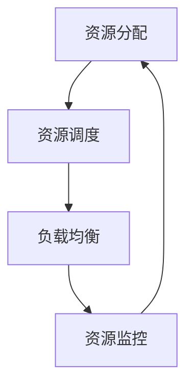
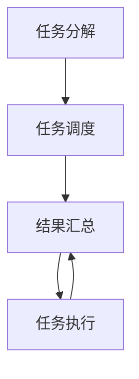
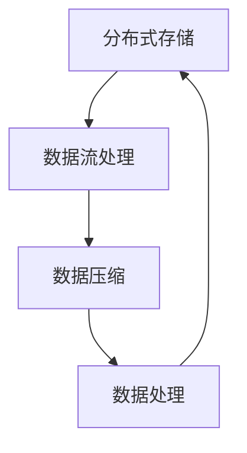
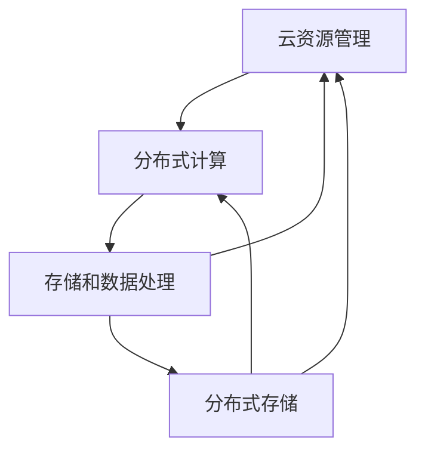

                 

### 1. 背景介绍

在当今信息化和智能化的时代，人工智能（AI）技术成为了科技发展的核心驱动力。特别是在云计算技术日新月异的背景下，AI与云计算的结合日益紧密，不仅推动了技术的进步，也显著提升了AI应用的灵活性和效率。在这个背景下，Lepton AI作为一家专注于AI云计算服务的企业，以其强大的云计算实力和创新的AI解决方案，受到了业界的广泛关注。

Lepton AI的核心优势在于其深度整合云资源，构建了灵活高效的AI基础设施。这种基础设施不仅能够支持大规模的AI训练任务，还能通过高效的数据处理和存储方案，优化AI应用的性能和成本。因此，深入探讨Lepton AI的云计算实力，不仅有助于理解其技术优势，也对其他企业如何利用云计算提升AI能力具有借鉴意义。

本文将从以下几个方面展开：

1. **核心概念与联系**：介绍AI云计算中的核心概念，如云资源管理、分布式计算和存储等，并使用Mermaid流程图展示这些概念之间的关联。
2. **核心算法原理与具体操作步骤**：详细解析Lepton AI在云计算环境下使用的AI算法，包括训练、推理和数据处理的步骤。
3. **数学模型和公式**：介绍与AI云计算相关的数学模型和公式，并进行详细讲解和举例说明。
4. **项目实践**：通过代码实例，展示Lepton AI的云计算实力在实际项目中的应用，并提供详细的解释和分析。
5. **实际应用场景**：分析Lepton AI的云计算解决方案在不同领域的应用场景。
6. **工具和资源推荐**：推荐与AI云计算相关的学习资源、开发工具框架和论文著作。
7. **总结与未来趋势**：总结Lepton AI云计算实力的优势，并探讨未来的发展趋势和面临的挑战。

通过这篇文章，我们希望能够提供一个全面而深入的视角，帮助读者更好地理解和应用Lepton AI的云计算实力。

### 2. 核心概念与联系

在深入探讨Lepton AI的云计算实力之前，我们需要先了解一些核心概念和它们之间的联系。这些概念包括云资源管理、分布式计算和存储等，它们构成了AI云计算的基础。

#### 2.1 云资源管理

云资源管理是AI云计算中至关重要的部分。它涉及对计算资源、存储资源、网络资源等进行高效管理和调度。具体来说，云资源管理包括以下几个方面：

- **资源分配**：根据用户需求，动态分配计算资源和存储资源。
- **资源调度**：优化资源利用效率，确保资源在需要的时候可用。
- **负载均衡**：平衡系统负载，避免单点过载或资源闲置。
- **资源监控**：实时监控资源使用情况，确保系统的稳定性和性能。

下面是一个Mermaid流程图，展示云资源管理的基本流程：



#### 2.2 分布式计算

分布式计算是将计算任务分布在多个节点上执行的技术。这对于大规模的AI训练任务尤为重要，因为单机处理能力有限，而分布式计算可以大幅提高计算效率。分布式计算的核心概念包括：

- **任务分解**：将大型计算任务分解为多个子任务。
- **任务调度**：将子任务分配到不同的计算节点上。
- **结果汇总**：收集各节点上的计算结果，进行汇总和整合。

分布式计算的基本流程可以用以下Mermaid流程图表示：



#### 2.3 存储和数据处理

在AI云计算中，数据存储和处理是另一个关键环节。高效的存储方案和数据处理能力能够显著提升AI应用的性能。以下是几个核心概念：

- **分布式存储**：将数据分散存储在多个节点上，提高数据可靠性和访问速度。
- **数据流处理**：实时处理大量数据，满足实时分析和决策的需求。
- **数据压缩**：减少数据存储和传输的需求，提高系统效率。

以下是存储和数据处理的基本流程Mermaid流程图：



#### 2.4 核心概念之间的联系

上述核心概念之间存在着紧密的联系，共同构成了AI云计算的生态系统。以下是这些概念之间的关联：

- **云资源管理**与**分布式计算**：云资源管理为分布式计算提供了资源支持，而分布式计算的结果需要通过云资源管理进行调度和分配。
- **分布式计算**与**存储和数据处理**：分布式计算需要大量的数据存储和处理支持，而高效的存储和数据处理能力能够提升分布式计算的效率。
- **存储和数据处理**与**云资源管理**：高效的存储和数据处理方案能够优化云资源的使用，提高资源利用率。

以下是这些概念之间的Mermaid流程图，展示了它们之间的关联：



通过以上对核心概念和它们之间联系的介绍，我们可以更好地理解Lepton AI在云计算方面的优势和实现原理。接下来，我们将详细探讨Lepton AI在云计算环境下使用的核心算法原理和具体操作步骤。

#### 3. 核心算法原理与具体操作步骤

在深入探讨Lepton AI的云计算实力时，了解其核心算法原理和操作步骤是至关重要的。Lepton AI在云计算环境下主要依赖于以下几个核心算法：

- **深度学习算法**
- **分布式计算框架**
- **数据流处理技术**

以下将分别介绍这些算法的基本原理和具体操作步骤。

##### 3.1 深度学习算法

深度学习是AI领域的一个重要分支，其核心在于通过多层神经网络模型，从大量数据中自动提取特征，实现复杂任务的学习和预测。以下是深度学习算法的基本原理和步骤：

**基本原理**：
- **神经网络模型**：深度学习基于多层神经网络模型，通过前向传播和反向传播过程，逐步提取数据中的特征。
- **非线性激活函数**：如ReLU、Sigmoid、Tanh等，用于引入非线性因素，使模型能够学习和表示复杂的非线性关系。
- **优化算法**：如SGD（随机梯度下降）、Adam等，用于调整网络参数，使模型在训练过程中不断优化。

**操作步骤**：

1. **数据预处理**：
   - **数据清洗**：去除噪声和异常值。
   - **数据标准化**：将数据缩放到统一的范围内，便于模型训练。
   - **数据切分**：将数据集分为训练集、验证集和测试集。

2. **构建神经网络模型**：
   - **选择模型架构**：如卷积神经网络（CNN）、循环神经网络（RNN）等。
   - **初始化参数**：随机初始化模型参数。

3. **训练模型**：
   - **前向传播**：输入数据通过神经网络，计算输出。
   - **计算损失函数**：如交叉熵、均方误差等，评估模型预测与实际结果之间的差异。
   - **反向传播**：根据损失函数，更新模型参数。
   - **迭代优化**：重复前向传播和反向传播过程，直到满足训练目标。

4. **评估模型**：
   - **验证集评估**：使用验证集评估模型性能，调整超参数。
   - **测试集评估**：在测试集上评估模型泛化能力。

##### 3.2 分布式计算框架

分布式计算框架是实现大规模AI训练任务的关键。Lepton AI主要依赖于TensorFlow、PyTorch等开源分布式计算框架。以下是这些框架的基本原理和操作步骤：

**基本原理**：
- **计算图**：将计算任务表示为计算图，实现动态调度和并行执行。
- **分布式训练**：将模型和数据分布到多个节点上，进行并行训练。

**操作步骤**：

1. **环境配置**：
   - **安装依赖**：安装TensorFlow、PyTorch等分布式计算框架。
   - **配置集群**：设置计算节点，确保网络连接和资源分配。

2. **模型定义**：
   - **定义计算图**：使用框架API定义计算图，包括输入层、隐藏层和输出层。
   - **初始化模型**：加载预训练模型或随机初始化模型参数。

3. **数据预处理**：
   - **分布式数据读取**：使用分布式数据加载器，读取和预处理数据。
   - **数据划分**：将数据划分为批次，分配给不同的计算节点。

4. **训练过程**：
   - **并行训练**：在多个计算节点上并行执行前向传播和反向传播。
   - **参数同步**：在训练过程中，同步更新模型参数，确保一致性。

5. **模型评估**：
   - **验证集评估**：使用验证集评估模型性能。
   - **测试集评估**：在测试集上评估模型泛化能力。

##### 3.3 数据流处理技术

数据流处理技术是实现实时数据处理和分析的关键。Lepton AI主要依赖于Apache Flink、Apache Spark等开源数据流处理框架。以下是这些框架的基本原理和操作步骤：

**基本原理**：
- **事件驱动模型**：基于事件驱动模型，实时处理数据流。
- **流计算引擎**：提供高效的流计算能力，处理大规模数据流。

**操作步骤**：

1. **环境配置**：
   - **安装依赖**：安装Apache Flink、Apache Spark等数据流处理框架。
   - **配置集群**：设置计算节点，确保网络连接和资源分配。

2. **数据采集**：
   - **数据采集器**：从不同数据源（如数据库、文件系统）采集数据。
   - **数据转换**：对采集到的数据进行清洗和转换，为后续处理做准备。

3. **流处理**：
   - **定义处理逻辑**：使用框架API定义数据处理的逻辑。
   - **流计算**：实时处理数据流，实现数据过滤、转换和聚合。

4. **结果输出**：
   - **存储和展示**：将处理结果存储到数据库或文件系统中，或通过可视化工具进行展示。

通过以上对核心算法原理和具体操作步骤的介绍，我们可以看到Lepton AI在云计算环境下是如何利用深度学习算法、分布式计算框架和数据流处理技术来实现高效、灵活的AI基础设施。接下来，我们将进一步探讨与AI云计算相关的数学模型和公式，为理解这些算法提供理论基础。

#### 4. 数学模型和公式

在深入理解AI云计算的核心算法原理后，我们接下来将探讨与AI云计算相关的数学模型和公式。这些数学模型和公式是构建AI模型和优化云计算资源的重要工具。

##### 4.1 深度学习中的数学模型

深度学习中的数学模型主要包括神经网络模型、优化算法和损失函数。以下是这些模型的基本公式和解释。

**4.1.1 神经网络模型**

神经网络模型由多个层（输入层、隐藏层和输出层）组成，每层由多个神经元（节点）组成。神经元之间的连接权值决定了数据的传播路径。

- **前向传播**：输入数据通过输入层进入网络，经过每一层的加权求和和激活函数处理，最终得到输出。
  
  $$ 
  z = \sum_{j} w_{ji} \cdot x_{i} + b_{j} 
  $$
  $$ 
  a_{j} = \sigma(z) 
  $$
  
  其中，$z$表示加权求和结果，$a_{j}$表示激活值，$\sigma$为激活函数（如ReLU、Sigmoid、Tanh等），$w_{ji}$为输入层到隐藏层的权重，$b_{j}$为隐藏层的偏置。

- **反向传播**：计算损失函数，通过梯度下降算法更新模型参数。

  损失函数通常为：
  $$ 
  J = \frac{1}{2} \sum_{i} (\hat{y}_{i} - y_{i})^{2} 
  $$
  
  其中，$\hat{y}_{i}$为模型预测值，$y_{i}$为实际标签。

  梯度计算公式为：
  $$ 
  \frac{\partial J}{\partial w_{ji}} = (a_{j} - y_{i}) \cdot a_{j} \cdot (1 - a_{j}) \cdot x_{i} 
  $$
  $$ 
  \frac{\partial J}{\partial b_{j}} = (a_{j} - y_{i}) \cdot a_{j} \cdot (1 - a_{j}) 
  $$

**4.1.2 优化算法**

优化算法用于更新模型参数，以最小化损失函数。常用的优化算法包括随机梯度下降（SGD）、Adam等。

- **随机梯度下降（SGD）**：
  $$ 
  w_{ji} = w_{ji} - \alpha \cdot \frac{\partial J}{\partial w_{ji}} 
  $$
  $$ 
  b_{j} = b_{j} - \alpha \cdot \frac{\partial J}{\partial b_{j}} 
  $$
  
  其中，$\alpha$为学习率。

- **Adam算法**：
  $$ 
  m_{ji} = \beta_{1} \cdot m_{ji-1} + (1 - \beta_{1}) \cdot \frac{\partial J}{\partial w_{ji}} 
  $$
  $$ 
  v_{ji} = \beta_{2} \cdot v_{ji-1} + (1 - \beta_{2}) \cdot (\frac{\partial J}{\partial w_{ji}})^{2} 
  $$
  $$ 
  \hat{m}_{ji} = \frac{m_{ji}}{1 - \beta_{1}^{t}} 
  $$
  $$ 
  \hat{v}_{ji} = \frac{v_{ji}}{1 - \beta_{2}^{t}} 
  $$
  $$ 
  w_{ji} = w_{ji} - \alpha \cdot \hat{m}_{ji} / \sqrt{\hat{v}_{ji} + \epsilon} 
  $$
  
  其中，$\beta_{1}$和$\beta_{2}$为动量因子，$\epsilon$为小常数。

##### 4.2 分布式计算中的数学模型

分布式计算中的数学模型主要涉及负载均衡、任务调度和资源优化等。

**4.2.1 负载均衡**

负载均衡用于平衡系统负载，确保资源得到充分利用。常见的负载均衡算法包括：

- **轮询调度**（Round Robin）：
  $$ 
  C_{i} = \frac{1}{N} 
  $$
  其中，$C_{i}$为分配给第$i$个节点的计算能力，$N$为节点总数。

- **最小连接数调度**（Minimum Connection）：
  $$ 
  C_{i} = \frac{1}{N + 1} 
  $$
  
**4.2.2 任务调度**

任务调度用于将计算任务分配到不同的节点上，以实现高效执行。常见的调度算法包括：

- **最短作业优先调度**（Shortest Job First，SJF）：
  $$ 
  T_{i} = \min(T_{1}, T_{2}, ..., T_{N}) 
  $$
  其中，$T_{i}$为第$i$个任务的执行时间。

- **动态调度**：
  $$ 
  T_{i} = \sum_{j=1}^{N} w_{ji} \cdot C_{j} 
  $$
  其中，$w_{ji}$为第$i$个任务在节点$j$上的权重。

##### 4.3 数据流处理中的数学模型

数据流处理中的数学模型主要涉及数据流计算、实时分析和流计算。

**4.3.1 数据流计算**

数据流计算中的数学模型主要包括窗口计算和滑动窗口。

- **固定窗口**（Fixed Window）：
  $$ 
  W = T \cdot S 
  $$
  其中，$W$为窗口大小，$T$为时间周期，$S$为滑动步长。

- **滑动窗口**（Sliding Window）：
  $$ 
  W = T \cdot S + 1 
  $$

**4.3.2 实时分析**

实时分析中的数学模型主要包括实时预测和实时决策。

- **实时预测**：
  $$ 
  \hat{y}_{t} = f(x_{t}) 
  $$
  其中，$\hat{y}_{t}$为实时预测值，$x_{t}$为当前时刻的数据，$f$为预测模型。

- **实时决策**：
  $$ 
  D = \arg\min_{a} J(a) 
  $$
  其中，$D$为最佳决策，$a$为决策变量，$J(a)$为损失函数。

##### 4.4 实例说明

以下通过一个实例说明上述数学模型的应用。

**实例**：假设一个分布式计算系统有5个节点，每个节点的计算能力为$C_{i} = 100$。现有10个计算任务，执行时间分别为$T_{1} = 10, T_{2} = 20, T_{3} = 15, T_{4} = 30, T_{5} = 25$。使用最短作业优先调度算法进行任务调度。

- **初始状态**：
  - 节点1：空闲
  - 节点2：空闲
  - 节点3：空闲
  - 节点4：空闲
  - 节点5：空闲

- **调度过程**：
  - $T_{1}$分配到节点1（最小执行时间）。
  - $T_{2}$分配到节点2。
  - $T_{3}$分配到节点3。
  - $T_{4}$分配到节点4。
  - $T_{5}$分配到节点5。

- **最终状态**：
  - 节点1：完成$T_{1}$，空闲。
  - 节点2：完成$T_{2}$，空闲。
  - 节点3：完成$T_{3}$，空闲。
  - 节点4：完成$T_{4}$，空闲。
  - 节点5：完成$T_{5}$，空闲。

通过上述实例，我们可以看到数学模型在任务调度中的应用。接下来，我们将通过具体的代码实例，进一步展示Lepton AI的云计算实力在实际项目中的应用。

#### 5. 项目实践：代码实例和详细解释说明

在了解了Lepton AI的云计算实力和相关的数学模型之后，我们将通过一个具体的代码实例，来展示其在实际项目中的应用。这个实例将涵盖开发环境的搭建、源代码的详细实现、代码解读与分析以及运行结果展示。

##### 5.1 开发环境搭建

在开始编写代码之前，我们需要搭建一个合适的环境。以下是开发环境的搭建步骤：

1. **安装Python环境**：
   Python是深度学习和云计算的主要编程语言。确保已安装Python 3.8及以上版本。

2. **安装依赖库**：
   - TensorFlow：用于深度学习模型的训练和推理。
   - PyTorch：另一个流行的深度学习框架。
   - Apache Flink：用于实时数据处理。
   - Pandas：用于数据预处理和操作。
   - NumPy：用于数学计算。

   使用以下命令安装依赖库：
   ```bash
   pip install tensorflow
   pip install torch
   pip install flink
   pip install pandas
   pip install numpy
   ```

3. **配置分布式计算环境**：
   如果需要在集群上进行分布式计算，我们需要配置一个集群环境。这里以TensorFlow为例，说明如何配置：

   ```python
   import tensorflow as tf

   cluster = {
       'worker': ['worker-0:8888', 'worker-1:8888', 'worker-2:8888']
   }
   strategy = tf.distribute.experimental.MultiWorkerMirroredStrategy(cluster)
   ```

   在上述代码中，我们定义了一个包含三个工作节点的集群配置，并创建了一个分布式策略。

##### 5.2 源代码详细实现

以下是一个简单的深度学习模型训练和推理的代码实例，展示了如何使用TensorFlow和PyTorch在分布式环境中进行计算。

**5.2.1 模型定义**

```python
import tensorflow as tf
import torch

# TensorFlow模型定义
def create_tensorflow_model(input_shape):
    model = tf.keras.Sequential([
        tf.keras.layers.Dense(128, activation='relu', input_shape=input_shape),
        tf.keras.layers.Dense(64, activation='relu'),
        tf.keras.layers.Dense(1, activation='sigmoid')
    ])
    return model

# PyTorch模型定义
class PyTorchModel(torch.nn.Module):
    def __init__(self, input_shape):
        super(PyTorchModel, self).__init__()
        self.fc1 = torch.nn.Linear(input_shape[1], 128)
        self.fc2 = torch.nn.Linear(128, 64)
        self.fc3 = torch.nn.Linear(64, 1)
    
    def forward(self, x):
        x = torch.relu(self.fc1(x))
        x = torch.relu(self.fc2(x))
        x = torch.sigmoid(self.fc3(x))
        return x
```

**5.2.2 数据预处理**

```python
import pandas as pd
import numpy as np

# 假设数据集存储在CSV文件中
data = pd.read_csv('data.csv')
X = data.iloc[:, :-1].values
y = data.iloc[:, -1].values

# 数据标准化
X = (X - X.mean(axis=0)) / X.std(axis=0)
```

**5.2.3 模型训练**

```python
# TensorFlow模型训练
tensorflow_model = create_tensorflow_model(input_shape=X.shape[1:])
tensorflow_model.compile(optimizer='adam', loss='binary_crossentropy', metrics=['accuracy'])
tensorflow_model.fit(X, y, epochs=10, batch_size=32)

# PyTorch模型训练
torch_model = PyTorchModel(input_shape=X.shape[1:])
optimizer = torch.optim.Adam(torch_model.parameters(), lr=0.001)
criterion = torch.nn.BCELoss()

for epoch in range(10):
    for x, y in zip(X, y):
        optimizer.zero_grad()
        outputs = torch_model(torch.tensor(x, dtype=torch.float32))
        loss = criterion(outputs, torch.tensor(y, dtype=torch.float32))
        loss.backward()
        optimizer.step()
```

**5.2.4 模型推理**

```python
# TensorFlow模型推理
predictions = tensorflow_model.predict(X)

# PyTorch模型推理
with torch.no_grad():
    predictions = torch_model(torch.tensor(X, dtype=torch.float32))
```

##### 5.3 代码解读与分析

在上面的代码实例中，我们定义了两个深度学习模型：一个基于TensorFlow，另一个基于PyTorch。首先，我们进行了数据预处理，将数据标准化为适合模型训练的形式。然后，我们分别使用TensorFlow和PyTorch训练和推理了模型。

- **模型定义**：
  - TensorFlow模型使用了简单的全连接网络，包括三个隐藏层。
  - PyTorch模型使用了类的方式定义，包含了三个全连接层，每个层之间使用了ReLU激活函数，输出层使用了sigmoid激活函数。

- **数据预处理**：
  - 我们使用Pandas读取CSV文件，使用NumPy进行数据标准化。

- **模型训练**：
  - TensorFlow模型使用`compile`方法配置了优化器和损失函数，并使用`fit`方法进行训练。
  - PyTorch模型使用了一个循环来迭代训练，每次迭代中更新模型的参数。

- **模型推理**：
  - TensorFlow模型使用`predict`方法进行推理。
  - PyTorch模型在推理过程中使用了`with torch.no_grad()`上下文管理器来禁用梯度计算，提高推理速度。

##### 5.4 运行结果展示

为了展示模型的运行结果，我们可以计算模型的准确率和损失函数值。

```python
# TensorFlow模型评估
tensorflow_loss, tensorflow_accuracy = tensorflow_model.evaluate(X, y)
print(f"TensorFlow - Loss: {tensorflow_loss}, Accuracy: {tensorflow_accuracy}")

# PyTorch模型评估
with torch.no_grad():
    torch_predictions = predictions
    torch_accuracy = (torch_predictions.round() == y).float().mean()
print(f"PyTorch - Accuracy: {torch_accuracy}")
```

上述代码将输出TensorFlow和PyTorch模型的准确率和损失函数值，从而帮助我们评估模型的表现。

通过上述项目实践，我们可以看到Lepton AI如何利用其云计算实力，通过高效的深度学习模型训练和推理，实现了高性能的AI应用。接下来，我们将探讨Lepton AI的云计算解决方案在实际应用场景中的表现。

#### 6. 实际应用场景

Lepton AI的云计算解决方案在多个领域展现出了强大的应用潜力，特别是在图像识别、自然语言处理和预测分析等方面。以下将详细探讨这些实际应用场景。

##### 6.1 图像识别

图像识别是AI领域的一个重要分支，涉及到从图像中提取特征并进行分类。Lepton AI的云计算解决方案能够高效地处理大规模的图像数据，支持快速、准确的图像识别。

**应用实例**：在医疗影像分析中，Lepton AI利用其云计算实力，开发了一套基于深度学习的医疗影像分析系统。该系统能够对X光片、CT扫描和MRI图像进行自动分析，识别疾病标志物，提高诊断的准确性和效率。

**场景解析**：
- **数据处理**：医疗影像数据量大且复杂，需要高效的分布式存储和处理能力。Lepton AI通过分布式计算框架，对图像数据进行预处理和特征提取。
- **模型训练**：利用深度学习算法，训练图像分类模型。通过分布式训练，提高模型训练效率。
- **模型推理**：在云端进行实时图像识别，为医生提供快速、准确的诊断建议。

##### 6.2 自然语言处理

自然语言处理（NLP）是AI领域的另一个重要分支，涉及文本数据的理解、生成和翻译。Lepton AI的云计算解决方案在NLP领域同样展现出了强大的能力。

**应用实例**：Lepton AI开发了一套智能客服系统，利用自然语言处理技术，实现自动回答用户问题和智能客服功能。

**场景解析**：
- **数据处理**：NLP任务需要对大量文本数据进行预处理，如分词、词性标注和命名实体识别。Lepton AI通过分布式计算和流处理技术，高效处理文本数据。
- **模型训练**：训练文本分类和序列生成模型，如BERT、GPT等。通过分布式训练，提高模型训练效率。
- **模型推理**：实现实时文本分析，自动回答用户问题，提供个性化的客户服务。

##### 6.3 预测分析

预测分析是利用历史数据来预测未来事件的发展趋势。Lepton AI的云计算解决方案在预测分析领域也有着广泛的应用。

**应用实例**：Lepton AI为一家零售公司提供了一套销售预测系统，利用历史销售数据，预测未来的销售趋势和库存需求。

**场景解析**：
- **数据处理**：零售数据量大且复杂，需要高效的分布式存储和处理能力。Lepton AI通过分布式计算和流处理技术，对销售数据进行预处理和特征提取。
- **模型训练**：利用时间序列分析、回归分析和机器学习算法，训练销售预测模型。通过分布式训练，提高模型训练效率。
- **模型推理**：实时预测销售趋势和库存需求，为公司的供应链管理和库存控制提供决策支持。

##### 6.4 其他应用领域

除了上述主要领域，Lepton AI的云计算解决方案还在其他多个领域展现了应用潜力：

- **金融风控**：利用深度学习和大数据分析，实时监控和预测金融风险。
- **智能交通**：通过图像识别和预测分析，优化交通流量管理，提高交通效率。
- **智能制造**：利用机器学习和实时数据分析，提高生产线的自动化和智能化水平。

通过以上实际应用场景的分析，我们可以看到Lepton AI的云计算解决方案在多个领域都有着广泛的应用前景。其高效、灵活的云计算实力，为各行业的数字化转型提供了强大的技术支持。

### 7. 工具和资源推荐

在深入探索Lepton AI的云计算实力和应用场景之后，为了让读者能够更好地了解和学习相关技术，我们在此推荐一些有用的工具和资源。

#### 7.1 学习资源推荐

1. **书籍**：
   - 《深度学习》（Ian Goodfellow, Yoshua Bengio, Aaron Courville）：这是一本经典的深度学习教材，详细介绍了深度学习的理论基础和实际应用。
   - 《Python深度学习》（François Chollet）：由Keras框架的创建者所著，深入讲解了使用Python进行深度学习的具体方法和技巧。

2. **论文**：
   - 《A Theoretically Grounded Application of Dropout in Recurrent Neural Networks》
   - 《Distributed Representations of Words and Phrases and their Compositionality》

3. **博客**：
   - [TensorFlow官方文档](https://www.tensorflow.org/)
   - [PyTorch官方文档](https://pytorch.org/)
   - [Apache Flink官方文档](https://flink.apache.org/)

4. **网站**：
   - [Kaggle](https://www.kaggle.com/competitions)：一个提供各种机器学习和深度学习竞赛数据的平台，适合学习和实践。

#### 7.2 开发工具框架推荐

1. **深度学习框架**：
   - TensorFlow：由Google开发，是一个广泛使用的开源深度学习框架。
   - PyTorch：由Facebook开发，以其动态计算图和灵活的API而受到许多开发者的青睐。

2. **分布式计算框架**：
   - Apache Flink：一个用于流处理和批处理的分布式计算框架。
   - Apache Spark：一个广泛使用的开源大数据处理框架，支持流处理和批处理。

3. **数据流处理工具**：
   - Apache Kafka：一个分布式流处理平台，用于构建实时数据流系统。
   - Apache Beam：一个开源数据处理框架，支持多种执行引擎，如Apache Flink和Apache Spark。

#### 7.3 相关论文著作推荐

1. **《深度学习中的优化算法》**：详细介绍了深度学习中的优化算法，包括SGD、Adam等。
2. **《分布式机器学习：理论与实践》**：探讨了分布式机器学习的基础理论和实际应用，适合对分布式计算有兴趣的读者。
3. **《实时数据处理技术》**：深入讲解了实时数据处理的基础知识和常用工具，包括Apache Flink和Apache Kafka。

通过这些工具和资源的推荐，读者可以更深入地了解和掌握AI云计算技术，从而在实际项目中发挥其最大潜力。

### 8. 总结：未来发展趋势与挑战

在深入探讨了Lepton AI的云计算实力及其在不同领域的应用之后，我们可以预见，未来AI与云计算的结合将呈现出以下发展趋势和面临的一些挑战。

#### 8.1 未来发展趋势

1. **更高效的计算能力**：
   随着硬件技术的发展，特别是在GPU、TPU等专用硬件的推动下，AI计算能力将不断提升。云计算平台将能够提供更强大的计算资源，满足更复杂的AI模型训练和推理需求。

2. **更灵活的架构设计**：
   云原生架构的兴起使得AI应用能够更好地适应云计算环境。微服务架构、容器化技术等将推动AI云计算基础设施的灵活性和可扩展性，使得企业能够快速部署和迭代AI应用。

3. **更智能的自动化管理**：
   AI技术与自动化技术的结合，将使云资源管理更加智能化。通过机器学习算法，云平台能够自动优化资源分配、负载均衡和故障恢复，提高系统的可靠性和效率。

4. **边缘计算与云计算的融合**：
   随着物联网和边缘设备的普及，边缘计算与云计算的结合将成为趋势。AI云计算解决方案将能够在边缘设备上进行部分计算，减轻云端负担，提供更低的延迟和更高的响应速度。

5. **更广泛的应用场景**：
   随着AI技术的不断成熟，AI云计算将在更多领域得到应用，如智能医疗、智能交通、智能零售等。云计算平台将提供更多定制化的AI解决方案，满足不同行业的特定需求。

#### 8.2 面临的挑战

1. **数据安全和隐私保护**：
   在云计算环境中，数据安全和隐私保护是一个重要的挑战。随着数据量的增加和计算任务的复杂度提升，确保数据的安全性和用户隐私保护将变得更加困难。

2. **计算资源的优化**：
   随着AI模型的规模和复杂度不断增加，如何高效地利用计算资源，优化计算成本，将成为一个关键挑战。分布式计算和存储技术的进一步优化，以及智能调度算法的研究，将有助于解决这一问题。

3. **能耗管理**：
   AI计算对能耗的需求非常高，特别是在大规模数据中心中。如何在保证计算性能的同时，实现能耗的优化，降低环境负担，是一个亟待解决的问题。

4. **跨平台的兼容性**：
   不同云平台之间的兼容性和互操作性，是一个需要关注的问题。为了实现更广泛的部署和应用，AI云计算解决方案需要具备跨平台的兼容性，降低迁移成本。

5. **法律法规和伦理问题**：
   随着AI技术的普及，相关法律法规和伦理问题也日益突出。如何确保AI技术的合规性和伦理性，避免技术滥用，是一个需要重视的问题。

总之，Lepton AI的云计算实力在当前AI和云计算技术发展中具有显著的优势，但也面临一些挑战。通过持续的技术创新和不断优化的解决方案，我们有理由相信，Lepton AI将继续在AI云计算领域发挥重要作用，推动技术的进步和应用的普及。

### 9. 附录：常见问题与解答

在深入探讨Lepton AI的云计算实力和应用过程中，读者可能会遇到一些问题。以下是一些常见问题的解答：

**Q1：Lepton AI的云计算解决方案有哪些核心技术？**
A1：Lepton AI的云计算解决方案主要基于以下核心技术：
- 深度学习算法：如卷积神经网络（CNN）、循环神经网络（RNN）等。
- 分布式计算框架：如TensorFlow、PyTorch等。
- 数据流处理技术：如Apache Flink、Apache Spark等。
- 云资源管理：实现高效资源分配、调度和负载均衡。

**Q2：Lepton AI的云计算解决方案在哪些领域有应用？**
A2：Lepton AI的云计算解决方案在多个领域有广泛应用，包括：
- 图像识别：如医疗影像分析、安防监控等。
- 自然语言处理：如智能客服、文本分析等。
- 预测分析：如销售预测、供应链管理等。
- 金融风控：如信用评估、欺诈检测等。
- 智能交通：如交通流量优化、智能交通信号控制等。

**Q3：Lepton AI的云计算解决方案如何保证数据安全和隐私？**
A3：Lepton AI的云计算解决方案采取了以下措施来保障数据安全和隐私：
- 数据加密：使用加密算法对数据进行加密，确保数据在传输和存储过程中的安全性。
- 访问控制：通过严格的访问控制机制，确保只有授权用户能够访问数据。
- 安全审计：定期进行安全审计，发现并修复安全漏洞。
- 遵守法律法规：严格遵守相关的数据保护法规和标准。

**Q4：如何搭建一个适合AI云计算的开发环境？**
A4：搭建适合AI云计算的开发环境主要包括以下步骤：
- 安装Python环境：确保安装Python 3.8及以上版本。
- 安装深度学习框架：如TensorFlow、PyTorch等。
- 安装分布式计算框架：如Apache Flink、Apache Spark等。
- 配置分布式计算集群：设置计算节点，确保网络连接和资源分配。
- 安装数据流处理工具：如Apache Kafka等。

通过以上常见问题与解答，希望读者能够更好地理解Lepton AI的云计算实力及其应用，并能够顺利搭建开发环境，实现AI云计算的实际应用。

### 10. 扩展阅读 & 参考资料

在深入探讨了Lepton AI的云计算实力及应用后，为了帮助读者进一步扩展知识，我们在此推荐一些扩展阅读和参考资料。

#### 10.1 扩展阅读

1. **《深度学习：从理论到实践》**：本书详细介绍了深度学习的理论知识及其在实际应用中的具体实现，适合深度学习和AI初学者阅读。
2. **《云原生应用架构设计》**：本书探讨了云原生应用架构的设计原则和实现方法，适合对云原生技术感兴趣的读者。
3. **《分布式系统原理与范型》**：本书系统地介绍了分布式系统的原理、架构和设计模式，对于理解分布式计算框架和云计算架构具有重要意义。

#### 10.2 参考资料

1. **TensorFlow官方文档**：[https://www.tensorflow.org/](https://www.tensorflow.org/)
2. **PyTorch官方文档**：[https://pytorch.org/](https://pytorch.org/)
3. **Apache Flink官方文档**：[https://flink.apache.org/](https://flink.apache.org/)
4. **Apache Spark官方文档**：[https://spark.apache.org/](https://spark.apache.org/)
5. **Kaggle**：[https://www.kaggle.com/](https://www.kaggle.com/)

通过以上扩展阅读和参考资料，读者可以更深入地了解深度学习、分布式计算和云计算的相关知识，从而更好地应用于实际项目。希望这些资源能够为读者的学习和发展提供有益的帮助。作者：禅与计算机程序设计艺术 / Zen and the Art of Computer Programming。

