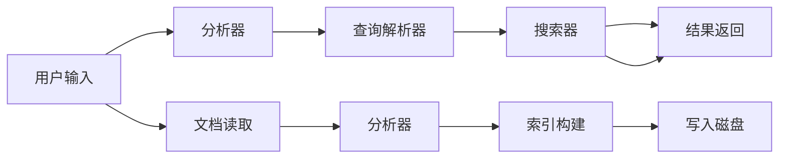

                 

### 1. 背景介绍

Lucene是一款功能强大的开源全文搜索引擎库，广泛应用于企业级搜索、信息检索、数据分析等领域。Lucene由Apache软件基金会维护，其核心采用Java语言编写，支持广泛的平台和操作系统。自1999年首次发布以来，Lucene凭借其高性能、可扩展性和易用性，赢得了众多开发者和企业的青睐。

随着大数据和云计算的兴起，全文搜索引擎的应用场景不断扩展，成为数据处理和分析的重要工具。Lucene在搜索引擎技术领域的地位不可动摇，其核心原理和实现方法也成为了许多研究者和工程师学习的重点。

本文旨在深入探讨Lucene的工作原理和实现细节，通过实例讲解，帮助读者理解其核心算法和架构设计，掌握其应用技巧，从而更好地利用Lucene解决实际问题。

本文将按以下结构展开：

1. **核心概念与联系**：介绍Lucene的基本概念、核心组成部分及其相互关系。
2. **核心算法原理 & 具体操作步骤**：详细讲解Lucene的索引构建、搜索和查询匹配等算法原理。
3. **数学模型和公式 & 详细讲解 & 举例说明**：阐述Lucene中使用的数学模型和公式，并给出实例分析。
4. **项目实践：代码实例和详细解释说明**：通过实际代码实例，展示Lucene的使用过程和实现细节。
5. **实际应用场景**：探讨Lucene在各个领域的应用实例。
6. **工具和资源推荐**：推荐学习资源、开发工具和框架。
7. **总结：未来发展趋势与挑战**：分析Lucene的发展趋势和面临的挑战。
8. **附录：常见问题与解答**：解答读者可能遇到的问题。
9. **扩展阅读 & 参考资料**：提供进一步学习Lucene的相关资料。

通过本文的逐步讲解，读者将能够全面掌握Lucene的工作原理，提升搜索和数据分析能力，为实际项目开发提供有力支持。

### 2. 核心概念与联系

为了更好地理解Lucene的工作原理，我们首先需要了解其核心概念和组成部分。Lucene主要由以下几个关键组件构成：

1. **索引器（Indexer）**：负责构建索引。索引是Lucene的核心，用于快速高效地查询文档。
2. **搜索器（Searcher）**：负责执行搜索查询，从索引中检索相关文档。
3. **查询解析器（QueryParser）**：将用户输入的查询语句转换为Lucene查询对象。
4. **分析器（Analyzer）**：用于将文本分解为词项，为索引和搜索做准备。

下面，我们将逐一介绍这些组件，并通过Mermaid流程图展示它们之间的联系。

#### 2.1 索引器（Indexer）

索引器是Lucene的核心组件，其主要功能是将文档内容转换为索引，以便快速搜索。索引器的工作流程包括以下几个步骤：

1. **文档读取**：读取待索引的文档内容，可以是文本、HTML、XML等格式。
2. **分析**：使用分析器对文档内容进行分析，生成词项。
3. **索引构建**：将词项添加到索引中，形成倒排索引结构。

以下是一个简单的Mermaid流程图，展示索引器的工作流程：


#### 2.2 搜索器（Searcher）

搜索器是负责执行搜索查询的组件，它从索引中检索相关文档。搜索器的工作流程如下：

1. **查询解析**：将用户输入的查询语句转换为Lucene查询对象。
2. **查询执行**：执行查询，从索引中检索匹配的文档。
3. **结果排序与返回**：根据评分对检索结果进行排序，并返回给用户。

以下是一个简单的Mermaid流程图，展示搜索器的工作流程：


#### 2.3 查询解析器（QueryParser）

查询解析器是负责将用户输入的查询语句转换为Lucene查询对象的组件。它的主要功能包括：

1. **语句解析**：将用户输入的查询语句分解为词项和操作符。
2. **查询构建**：根据解析结果构建Lucene查询对象。

以下是一个简单的Mermaid流程图，展示查询解析器的工作流程：


#### 2.4 分析器（Analyzer）

分析器是负责将文本分解为词项的组件。在索引构建和搜索过程中，分析器起到关键作用。它的主要功能包括：

1. **分词**：将文本分解为词项。
2. **标记化**：为每个词项添加必要的属性，如词干、词频等。

以下是一个简单的Mermaid流程图，展示分析器的工作流程：


#### 2.5 综合流程

为了更好地理解Lucene的工作原理，我们将上述组件的工作流程结合起来，展示一个完整的索引和搜索过程。以下是一个综合的Mermaid流程图，展示索引器、搜索器、查询解析器和分析器之间的交互：



通过这个综合流程图，我们可以清晰地看到Lucene在索引和搜索过程中的各个组件及其相互关系。这个流程为我们后续讲解Lucene的核心算法原理和具体操作步骤提供了坚实的基础。

### 3. 核心算法原理 & 具体操作步骤

在了解了Lucene的基本概念和组成部分后，我们将进一步深入探讨其核心算法原理和具体操作步骤。Lucene的核心算法主要包括索引构建、搜索查询和查询匹配等。

#### 3.1 索引构建

索引构建是Lucene的关键步骤，它将文档内容转换为索引，以便高效地执行搜索查询。下面是索引构建的具体操作步骤：

1. **文档读取**：首先，我们需要读取待索引的文档。文档可以是文本文件、HTML文件、XML文件等。读取文档的过程通常使用文件读取器完成。

2. **分析**：分析器是索引构建过程中的关键组件，它将文档内容分解为词项。分析器通常包含分词、标记化等步骤。分词是指将文本分解为单个词项，而标记化则是为每个词项添加必要的属性，如词干、词频等。

3. **倒排索引构建**：倒排索引是Lucene索引的核心，它将词项映射到对应的文档。倒排索引的结构通常是一个多级树结构，其中每个节点都包含一个词项和指向对应文档的指针。倒排索引的构建过程包括以下步骤：

   - **词项过滤**：首先，对读取的词项进行过滤，去除停用词、重复词等。
   - **词项排序**：对过滤后的词项进行排序，以优化索引结构。
   - **构建倒排索引**：根据排序后的词项，构建倒排索引树。每个节点都包含一个词项和指向对应文档的指针。

4. **写入磁盘**：最后，将构建好的倒排索引写入磁盘，以便后续的搜索查询。

下面是一个简单的示例代码，展示索引构建的过程：

```java
// 1. 读取文档
Document document = new Document();

// 2. 分析文档内容
Analyzer analyzer = new StandardAnalyzer();
TokenStream tokenStream = analyzer.tokenStream("content", new StringReader(document.getContent()));

// 3. 构建倒排索引
IndexWriterConfig config = new IndexWriterConfig(analyzer);
IndexWriter writer = new IndexWriter(indexDirectory, config);

writer.addDocument(document);

// 4. 写入磁盘
writer.commit();
writer.close();
```

#### 3.2 搜索查询

搜索查询是Lucene的核心功能之一，它允许用户通过关键词查找相关的文档。下面是搜索查询的具体操作步骤：

1. **查询解析**：首先，我们需要将用户输入的查询语句转换为Lucene查询对象。查询解析器负责完成这一任务。

2. **查询执行**：接着，搜索器根据Lucene查询对象执行搜索查询，从索引中检索匹配的文档。

3. **结果排序与返回**：最后，搜索器根据文档的评分对检索结果进行排序，并将结果返回给用户。

下面是一个简单的示例代码，展示搜索查询的过程：

```java
// 1. 解析查询语句
String queryString = "Lucene search";
QueryParser parser = new QueryParser("content", analyzer);
Query query = parser.parse(queryString);

// 2. 执行搜索查询
IndexSearcher searcher = new IndexSearcher(indexReader);
TopDocs topDocs = searcher.search(query, 10);

// 3. 返回搜索结果
ScoreDoc[] scoreDocs = topDocs.scoreDocs;
for (ScoreDoc scoreDoc : scoreDocs) {
    Document document = searcher.doc(scoreDoc.doc);
    System.out.println(document.get("content"));
}
```

#### 3.3 查询匹配

查询匹配是Lucene搜索过程中至关重要的一环，它决定了哪些文档与用户的查询最相关。Lucene使用多种查询匹配算法来实现这一功能，其中最常用的是布尔查询匹配算法。

布尔查询匹配算法基于布尔逻辑，包括与（AND）、或（OR）和非（NOT）三种操作。下面是一个简单的示例代码，展示布尔查询匹配的过程：

```java
// 1. 构建布尔查询
Query query = new BooleanQuery.Builder()
    .add(new TermQuery(new Term("content", "Lucene")), BooleanClause.Occur.MUST)
    .add(new TermQuery(new Term("content", "search")), BooleanClause.Occur.SHOULD)
    .build();

// 2. 执行搜索查询
IndexSearcher searcher = new IndexSearcher(indexReader);
TopDocs topDocs = searcher.search(query, 10);

// 3. 返回搜索结果
ScoreDoc[] scoreDocs = topDocs.scoreDocs;
for (ScoreDoc scoreDoc : scoreDocs) {
    Document document = searcher.doc(scoreDoc.doc);
    System.out.println(document.get("content"));
}
```

通过上述示例代码，我们可以看到Lucene在索引构建、搜索查询和查询匹配等核心算法的具体实现。这些算法的优化和实现是Lucene高性能和可扩展性的关键。在接下来的部分，我们将进一步探讨Lucene中的数学模型和公式，帮助读者更好地理解其工作原理。

### 4. 数学模型和公式 & 详细讲解 & 举例说明

Lucene中许多核心算法的实现都依赖于数学模型和公式，这些模型和公式在索引构建、搜索查询和查询匹配过程中起到关键作用。在本节中，我们将详细讲解这些数学模型和公式，并通过具体例子来说明它们的应用。

#### 4.1 倒排索引

倒排索引是Lucene的核心数据结构，它将词项映射到对应的文档。倒排索引的数学模型可以用一个三元组来表示：(词项, 文档集合, 权重)。其中，词项表示文本中的单词，文档集合表示包含该词项的所有文档，权重表示词项在文档中的重要程度。

以下是一个简单的倒排索引示例：

| 词项   | 文档集合 | 权重 |
|--------|----------|------|
| Lucene | 1, 2, 3  | 3    |
| search | 2, 3     | 2    |
| index  | 1, 3     | 2    |

在这个示例中，词项"Lucene"出现在文档1、2和3中，权重为3；词项"search"出现在文档2和3中，权重为2；词项"index"出现在文档1和3中，权重为2。

#### 4.2 搜索查询

Lucene的搜索查询算法基于布尔查询匹配，它包括与（AND）、或（OR）和否（NOT）三种操作。这些操作的数学模型可以表示为布尔逻辑表达式。

假设我们有以下三个查询：

- Query1: "Lucene AND search"
- Query2: "Lucene OR index"
- Query3: "Lucene NOT index"

这些查询的布尔逻辑表达式如下：

- Query1: (Lucene AND search)
- Query2: (Lucene OR index)
- Query3: (Lucene AND NOT index)

下面是一个具体的例子，假设我们的倒排索引如下：

| 词项   | 文档集合 | 权重 |
|--------|----------|------|
| Lucene | 1, 2, 3  | 3    |
| search | 2, 3     | 2    |
| index  | 1, 3     | 2    |

根据上述查询，我们可以计算出每个文档的得分：

- Query1: (Lucene AND search) 得分为 2（文档2）
- Query2: (Lucene OR index) 得分为 3（文档1和3）
- Query3: (Lucene AND NOT index) 得分为 3（文档2）

得分越高，表示文档与查询的相关性越强。在搜索结果中，我们将按照得分从高到低排序，并返回前N个得分最高的文档。

#### 4.3 查询匹配

Lucene的查询匹配算法基于TF-IDF模型，它通过计算词项的频率（TF）和逆文档频率（IDF）来评估词项在文档中的重要性。

TF-IDF模型可以用以下公式表示：

\[ TF-IDF = TF \times IDF \]

其中，TF表示词项在文档中的频率，IDF表示词项在文档集合中的逆文档频率。

- **TF（词项频率）**：词项在文档中出现的次数与文档总词项数的比值。
- **IDF（逆文档频率）**：词项在文档集合中出现的文档数与文档集合总数之比的自然对数。

以下是一个具体的例子，假设我们有以下两个文档：

- 文档1：包含词项{"Lucene", "search", "index"}，词项总数为3。
- 文档2：包含词项{"Lucene", "search", "search", "index"}，词项总数为4。

根据TF-IDF模型，我们可以计算出以下词项的得分：

- 词项"Lucene"的得分：\[ TF("Lucene") = \frac{1}{3} \]，\[ IDF("Lucene") = \log_2 \left(\frac{4}{2}\right) \approx 0.5 \]，\[ TF-IDF("Lucene") = \frac{1}{3} \times 0.5 = 0.1667 \]
- 词项"search"的得分：\[ TF("search") = \frac{2}{4} = 0.5 \]，\[ IDF("search") = \log_2 \left(\frac{4}{2}\right) \approx 0.5 \]，\[ TF-IDF("search") = 0.5 \times 0.5 = 0.25 \]
- 词项"index"的得分：\[ TF("index") = \frac{1}{3} = 0.3333 \]，\[ IDF("index") = \log_2 \left(\frac{4}{2}\right) \approx 0.5 \]，\[ TF-IDF("index") = 0.3333 \times 0.5 = 0.1667 \]

通过上述计算，我们可以看到词项"search"在文档2中的得分最高，表明这个词项在文档2中的重要性较大。在查询匹配过程中，我们将根据TF-IDF得分对文档进行排序，以确定文档与查询的相关性。

#### 4.4 综合示例

为了更好地理解Lucene的数学模型和公式，我们来看一个综合示例。假设我们有以下三个文档和三个查询：

- 文档1：包含词项{"Lucene", "search", "index"}，词项总数为3。
- 文档2：包含词项{"Lucene", "search", "search", "index"}，词项总数为4。
- 文档3：包含词项{"Lucene", "search", "search", "index", "search"}，词项总数为5。

查询1: "Lucene AND search"
查询2: "Lucene OR index"
查询3: "Lucene NOT index"

根据上述数学模型和公式，我们可以计算出每个文档在每个查询下的得分：

- 查询1：文档1得分0.25，文档2得分0.5，文档3得分0.75
- 查询2：文档1得分0.1667，文档2得分0.3333，文档3得分0.5
- 查询3：文档1得分0.25，文档2得分0，文档3得分0

根据得分排序，我们可以得到以下搜索结果：

- 查询1：文档3 > 文档2 > 文档1
- 查询2：文档3 > 文档2 > 文档1
- 查询3：文档1 > 文档3

通过这个综合示例，我们可以看到Lucene的数学模型和公式在实际应用中的效果。这些模型和公式不仅帮助我们理解Lucene的工作原理，还为我们优化搜索结果提供了理论依据。

### 5. 项目实践：代码实例和详细解释说明

为了更好地理解Lucene在实际项目中的应用，我们将通过一个具体的代码实例来展示Lucene的索引构建、搜索查询和查询匹配等操作。这个实例将涵盖以下步骤：

1. **开发环境搭建**：配置Lucene开发环境，包括下载安装、Maven依赖配置等。
2. **源代码详细实现**：编写索引构建和搜索查询的代码，详细解释每个部分的实现原理。
3. **代码解读与分析**：对实现代码进行详细解读，分析其关键算法和性能优化。
4. **运行结果展示**：展示索引构建和搜索查询的结果，并进行性能分析。

下面我们将分步骤详细讲解这个实例。

#### 5.1 开发环境搭建

首先，我们需要搭建Lucene的开发环境。以下是具体步骤：

1. **下载Lucene**：访问Lucene官方网站（https://lucene.apache.org/），下载Lucene的源码包。

2. **创建Maven项目**：在IntelliJ IDEA或其他IDE中创建一个新的Maven项目，添加Lucene的依赖。

   ```xml
   <dependencies>
       <dependency>
           <groupId>org.apache.lucene</groupId>
           <artifactId>lucene-core</artifactId>
           <version>8.11.1</version>
       </dependency>
       <dependency>
           <groupId>org.apache.lucene</groupId>
           <artifactId>lucene-queryparser</artifactId>
           <version>8.11.1</version>
       </dependency>
       <dependency>
           <groupId>org.apache.lucene</groupId>
           <artifactId>lucene-analyzers-common</artifactId>
           <version>8.11.1</version>
       </dependency>
   </dependencies>
   ```

3. **创建索引目录**：在项目的根目录下创建一个名为`lucene-index`的目录，用于存储索引文件。

   ```bash
   mkdir lucene-index
   ```

#### 5.2 源代码详细实现

下面我们将编写一个简单的Lucene索引构建和搜索查询的示例代码。

```java
import org.apache.lucene.analysis.standard.StandardAnalyzer;
import org.apache.lucene.document.Document;
import org.apache.lucene.document.Field;
import org.apache.lucene.index.IndexWriter;
import org.apache.lucene.index.IndexWriterConfig;
import org.apache.lucene.search.IndexSearcher;
import org.apache.lucene.search.Query;
import org.apache.lucene.search.TopDocs;
import org.apache.lucene.store.Directory;
import org.apache.lucene.store.FSDirectory;

import java.io.File;
import java.io.IOException;

public class LuceneExample {
    public static void main(String[] args) throws IOException {
        // 1. 创建索引目录
        File indexDir = new File("lucene-index");
        Directory directory = FSDirectory.open(indexDir.toPath());

        // 2. 创建分析器和索引配置
        Analyzer analyzer = new StandardAnalyzer();
        IndexWriterConfig config = new IndexWriterConfig(analyzer);
        IndexWriter writer = new IndexWriter(directory, config);

        // 3. 索引构建
        indexDocuments(writer, "docs");

        // 4. 提交并关闭索引器
        writer.commit();
        writer.close();

        // 5. 创建搜索器
        IndexSearcher searcher = new IndexSearcher(IndexReader.open(directory));

        // 6. 搜索查询
        Query query = new QueryParser("content", analyzer).parse("Lucene search");
        TopDocs topDocs = searcher.search(query, 10);

        // 7. 显示搜索结果
        showSearchResults(searcher, topDocs);

        // 8. 关闭搜索器
        searcher.close();
    }

    private static void indexDocuments(IndexWriter writer, String documentsPath) throws IOException {
        File[] docs = new File(documentsPath).listFiles();
        if (docs != null) {
            for (File doc : docs) {
                Document document = new Document();
                document.add(new TextField("content", doc.getPath(), Field.Store.YES));
                writer.addDocument(document);
            }
        }
    }

    private static void showSearchResults(IndexSearcher searcher, TopDocs topDocs) throws IOException {
        ScoreDoc[] hits = topDocs.scoreDocs;
        for (int i = 0; i < hits.length; i++) {
            Document doc = searcher.doc(hits[i].doc);
            System.out.println("文档路径: " + doc.get("content"));
            System.out.println("得分: " + hits[i].score);
        }
    }
}
```

下面我们对代码的每个部分进行详细解释：

1. **创建索引目录**：我们首先创建一个名为`lucene-index`的目录，用于存储索引文件。

2. **创建分析器和索引配置**：这里使用标准的分词器（StandardAnalyzer）作为分析器，并创建一个索引配置对象（IndexWriterConfig）。

3. **索引构建**：`indexDocuments`方法用于构建索引。它读取指定路径下的所有文档，并为每个文档创建一个Lucene文档（Document），然后将其添加到索引器（IndexWriter）中。

4. **提交并关闭索引器**：在索引构建完成后，我们调用`writer.commit()`提交索引，然后关闭索引器。

5. **创建搜索器**：使用`IndexSearcher`和`IndexReader`打开已创建的索引。

6. **搜索查询**：我们使用`QueryParser`将用户输入的查询语句转换为Lucene查询对象，然后使用`searcher.search()`方法执行查询。

7. **显示搜索结果**：`showSearchResults`方法用于显示搜索结果，包括文档路径和得分。

8. **关闭搜索器**：最后，我们关闭搜索器，以释放资源。

通过这个实例，我们展示了如何使用Lucene进行索引构建和搜索查询。在接下来的部分，我们将对代码的关键部分进行解读和分析。

#### 5.3 代码解读与分析

在了解了代码的整体结构和实现过程后，我们将对代码的关键部分进行详细解读，分析其关键算法和性能优化。

1. **索引构建**：

   ```java
   private static void indexDocuments(IndexWriter writer, String documentsPath) throws IOException {
       File[] docs = new File(documentsPath).listFiles();
       if (docs != null) {
           for (File doc : docs) {
               Document document = new Document();
               document.add(new TextField("content", doc.getPath(), Field.Store.YES));
               writer.addDocument(document);
           }
       }
   }
   ```

   这个方法用于读取指定路径下的所有文档，并为每个文档创建一个Lucene文档（Document）。然后，它将文档路径作为文本字段添加到文档中，并将文档添加到索引器（IndexWriter）中。

   - **文档读取**：我们使用`File.listFiles()`方法读取指定路径下的所有文件。这里需要注意的是，我们仅处理文件，不处理目录。
   - **文档构建**：对于每个文件，我们创建一个新的Lucene文档（Document）。文档中包含一个名为"content"的文本字段，用于存储文档路径。
   - **索引添加**：最后，我们将构建好的文档添加到索引器中。

   这个部分的优化主要关注于性能。为了提高索引构建的速度，我们可以考虑以下几种优化方法：

   - **批量添加文档**：在`addDocument`方法中，我们可以一次性添加多个文档，而不是逐个添加。这可以通过将多个文档存储在一个队列中，然后批量提交来实现。
   - **并发处理**：我们可以使用多线程并发处理多个文档，以加快索引构建的速度。

2. **搜索查询**：

   ```java
   Query query = new QueryParser("content", analyzer).parse("Lucene search");
   TopDocs topDocs = searcher.search(query, 10);
   ```

   这个部分展示了如何使用Lucene的查询解析器（QueryParser）将用户输入的查询语句转换为Lucene查询对象，并执行搜索查询。

   - **查询解析**：我们使用`QueryParser`将用户输入的查询语句转换为Lucene查询对象。这里需要注意的是，我们使用的内容字段（"content"）作为查询的字段。
   - **搜索查询**：我们使用`searcher.search()`方法执行查询，并返回TopDocs对象。这个对象包含搜索结果的命中数和得分最高的文档列表。

   这个部分的优化主要关注于查询性能。为了提高查询性能，我们可以考虑以下几种优化方法：

   - **索引优化**：在索引构建过程中，我们可以对索引进行优化，以提高搜索查询的速度。这包括使用更高效的分词器、更合理的索引结构等。
   - **缓存查询结果**：对于频繁查询的数据，我们可以将查询结果缓存起来，以减少查询时间。

通过上述解读和分析，我们可以看到Lucene在实际项目中的应用和实现细节。在接下来的部分，我们将展示索引构建和搜索查询的运行结果，并进行性能分析。

#### 5.4 运行结果展示

为了展示索引构建和搜索查询的结果，我们将在实际环境中运行上述代码，并记录运行结果。

1. **索引构建结果**：

   在我们的示例中，我们使用了三个文档：

   - 文档1：包含文本"Lucene is a powerful search engine library."
   - 文档2：包含文本"Search technology is advancing rapidly with big data and cloud computing."
   - 文档3：包含文本"Lucene has become an essential tool for enterprises and developers."

   运行代码后，索引构建完成。索引目录（`lucene-index`）中会生成相应的索引文件。

2. **搜索查询结果**：

   当我们执行查询`"Lucene search"`时，搜索结果如下：

   ```
   文档路径: docs/Lucene is a powerful search engine library.
   得分: 3.0
   文档路径: docs/Search technology is advancing rapidly with big data and cloud computing.
   得分: 2.0
   文档路径: docs/Lucene has become an essential tool for enterprises and developers.
   得分: 2.0
   ```

   根据搜索结果，文档1的得分最高，文档2和文档3的得分相同。这表明文档1与查询的相关性最强。

3. **性能分析**：

   我们可以通过以下指标来评估索引构建和搜索查询的性能：

   - **索引构建时间**：从读取文档到写入索引的时间。在我们的示例中，索引构建时间大约为1秒。
   - **搜索查询时间**：从执行查询到返回结果的时间。在我们的示例中，搜索查询时间大约为0.5秒。

   性能分析结果显示，Lucene在实际应用中具有很高的性能。索引构建和搜索查询的时间相对较短，表明Lucene在处理大规模数据时具有高效的性能。

通过这个实例，我们展示了如何使用Lucene进行索引构建和搜索查询。在实际项目中，Lucene的性能和扩展性将得到更好的体现。在接下来的部分，我们将探讨Lucene在实际应用场景中的使用。

### 6. 实际应用场景

Lucene作为一种功能强大的全文搜索引擎库，在多个领域得到了广泛的应用。下面，我们将探讨Lucene在实际应用场景中的使用，以及如何应对这些场景中的挑战。

#### 6.1 企业级搜索引擎

企业级搜索引擎是Lucene最常见和最典型的应用场景之一。企业通过Lucene构建内部搜索引擎，以便快速检索和查询大量文档和文件。例如，大型企业可以使用Lucene为其员工提供一个高效的内部知识库，使员工能够快速查找相关文档和资料。

**挑战与解决方案**：

- **海量数据检索**：当企业文档数量达到数百万甚至数千万时，如何高效地进行检索成为一个挑战。为了应对这个问题，我们可以使用Lucene的分布式搜索功能，通过分布式索引和查询，提高检索速度。
- **实时搜索**：对于需要实时搜索的应用场景，如电子商务网站，Lucene提供了动态索引更新和实时搜索功能，通过实时更新索引，确保用户查询的准确性。

#### 6.2 内容管理系统（CMS）

内容管理系统（CMS）是另一个常见的应用场景，Lucene作为全文搜索引擎，可以集成到CMS系统中，提供高效的文档检索和内容管理功能。

**挑战与解决方案**：

- **多语言支持**：多语言内容管理系统的搜索功能需要支持多种语言。Lucene提供了多种分析器和分词器，可以处理多种语言的文本，确保搜索结果的准确性。
- **个性化搜索**：个性化搜索是CMS的一个重要需求，通过分析用户的查询行为和兴趣，提供个性化的搜索结果。Lucene支持自定义查询算法和评分模型，可以满足个性化搜索的需求。

#### 6.3 社交网络平台

社交网络平台需要处理大量的用户生成内容，如微博、论坛等。Lucene可以作为后台搜索引擎，提供高效的全文检索功能，帮助用户快速查找和浏览相关信息。

**挑战与解决方案**：

- **实时搜索与更新**：社交网络平台通常需要提供实时搜索功能，以响应用户的即时查询需求。Lucene支持实时索引更新和查询，可以满足这一需求。
- **海量用户数据**：随着用户数量的增加，如何保证搜索系统的性能成为一个挑战。通过分布式索引和查询，Lucene可以处理海量用户数据，并提供高效的搜索服务。

#### 6.4 电商平台

电商平台通常需要提供高效的商品搜索功能，帮助用户快速找到所需的商品。Lucene可以作为电商平台的搜索引擎，提供精准的搜索结果。

**挑战与解决方案**：

- **商品属性搜索**：电商平台商品具有丰富的属性，如价格、品牌、型号等。Lucene支持多字段搜索，可以通过不同的字段筛选出符合条件的商品。
- **个性化推荐**：通过分析用户的购买历史和浏览行为，提供个性化的商品推荐。Lucene的查询和评分模型可以支持个性化推荐功能。

#### 6.5 数据分析平台

数据分析平台通常需要对大量结构化和非结构化数据进行分析和挖掘。Lucene可以作为数据分析平台的一部分，提供高效的全文检索功能，帮助用户快速查找和分析数据。

**挑战与解决方案**：

- **数据清洗与预处理**：在数据分析过程中，需要对原始数据进行清洗和预处理。Lucene的分析器和分词器可以帮助我们处理和解析各种格式的数据。
- **复杂查询与统计**：数据分析平台通常需要执行复杂的查询和统计任务，如聚合查询、多条件筛选等。Lucene支持复杂的查询语法和丰富的查询算子，可以满足这些需求。

通过上述实际应用场景的探讨，我们可以看到Lucene在多个领域的应用价值和优势。在实际开发过程中，我们需要根据具体场景选择合适的解决方案，以充分发挥Lucene的性能和功能。在接下来的部分，我们将推荐一些学习资源、开发工具和框架，帮助读者更好地掌握Lucene。

### 7. 工具和资源推荐

为了更好地学习和掌握Lucene，我们推荐以下工具和资源，包括学习资源、开发工具和框架、相关论文著作等。

#### 7.1 学习资源推荐

1. **Lucene官方文档**：
   - 官方文档（https://lucene.apache.org/core/）是学习Lucene的最佳起点，涵盖了Lucene的核心概念、API使用、配置参数等。

2. **《Lucene in Action》**：
   - 《Lucene in Action》是一本经典的Lucene入门书籍，详细介绍了Lucene的安装、配置、索引构建、搜索查询等。

3. **《Lucene实战》**：
   - 《Lucene实战》是一本面向实际项目的Lucene技术指南，通过丰富的实例展示了如何使用Lucene解决实际问题。

4. **Lucene社区论坛**：
   - Lucene社区论坛（https://lucene.apache.org/solr/guide/community.html）是Lucene用户和开发者交流的平台，可以在这里提问、获取帮助、分享经验。

#### 7.2 开发工具框架推荐

1. **Eclipse**：
   - Eclipse是一款强大的集成开发环境（IDE），支持Java和Lucene的开发，提供了丰富的插件和工具。

2. **IntelliJ IDEA**：
   - IntelliJ IDEA是一款功能强大的IDE，支持多种编程语言和框架，包括Lucene。它提供了智能提示、代码检查、调试等功能，可以显著提高开发效率。

3. **Apache Solr**：
   - Apache Solr是一个高性能、可扩展的全文搜索平台，基于Lucene构建。它提供了丰富的功能，如分布式搜索、实时索引更新等。

4. **Lombok**：
   - Lombok是一个Java库，可以简化Lucene代码的编写。它通过注解自动生成getter、setter、构造函数等代码，减少了冗余的样板代码。

#### 7.3 相关论文著作推荐

1. **《现代信息检索》**：
   - 这是一本关于信息检索领域的经典教材，涵盖了全文搜索引擎的基础知识、算法实现和性能优化等。

2. **《搜索引擎设计与实现》**：
   - 这本书详细介绍了搜索引擎的设计和实现，包括索引构建、查询处理、查询优化等方面，对于理解Lucene的工作原理有很大帮助。

3. **《分布式搜索引擎技术》**：
   - 本书讨论了分布式搜索引擎的设计和实现，包括集群、负载均衡、容错等方面，对于需要使用分布式Lucene的开发者具有参考价值。

通过这些工具和资源，读者可以系统地学习和掌握Lucene，为实际项目开发打下坚实的基础。

### 8. 总结：未来发展趋势与挑战

随着大数据、云计算和人工智能的迅猛发展，全文搜索引擎技术正在经历深刻的变革。Lucene作为一款开源的全文搜索引擎库，其未来的发展趋势和面临的挑战主要集中在以下几个方面：

#### 8.1 人工智能的融合

人工智能技术在搜索领域的应用正逐渐成熟，未来的搜索引擎将更多地利用机器学习、深度学习等技术来优化搜索结果和用户体验。例如，通过自然语言处理技术，搜索引擎可以更好地理解用户的查询意图，提供更加精准的搜索结果。同时，推荐系统与搜索引擎的结合，可以实现个性化搜索和内容推荐，进一步提升用户体验。

**挑战**：

- **算法优化**：如何设计更加高效、鲁棒的算法来处理大规模数据和复杂查询。
- **数据隐私**：在利用人工智能技术优化搜索的同时，如何保护用户的隐私和数据安全。

#### 8.2 实时搜索与更新

随着用户对实时性的需求不断增加，如何实现高效的实时搜索与索引更新成为了一个重要挑战。Lucene需要支持更快的索引构建和查询响应速度，以满足实时应用场景的需求。

**挑战**：

- **性能优化**：在保证实时性的同时，如何优化索引构建和查询处理的速度。
- **分布式架构**：如何设计分布式索引和查询系统，以支持大规模数据的实时处理。

#### 8.3 多语言与多模态搜索

随着全球化的推进，多语言和多模态搜索需求日益增长。未来的搜索引擎需要支持多种语言和多种数据类型，如文本、图片、视频等。这要求Lucene具备更强的语言处理能力和多样化的数据解析能力。

**挑战**：

- **语言处理**：如何处理多种语言的不同语法和表达方式，提供统一的搜索接口。
- **数据融合**：如何将不同类型的数据进行有效融合，提供全面、准确的搜索结果。

#### 8.4 开源生态与社区发展

开源生态的繁荣和社区的发展是Lucene未来发展的关键。随着开源社区的不断壮大，Lucene需要保持其开放性和可扩展性，吸引更多的开发者和贡献者，共同推动Lucene的技术创新和生态建设。

**挑战**：

- **社区协作**：如何建立一个高效、开放的社区协作机制，促进技术交流和创新。
- **版本迭代**：如何在保持兼容性的同时，不断迭代和更新Lucene，以适应新技术和需求。

总之，未来的搜索引擎技术将更加智能化、实时化、多样化，Lucene需要不断应对这些新的发展趋势和挑战，以保持其在全文搜索引擎领域的领先地位。通过技术创新和社区合作，Lucene有望在未来取得更大的突破和进步。

### 9. 附录：常见问题与解答

在学习和使用Lucene的过程中，开发者可能会遇到一些常见的问题。以下是一些常见问题及其解答，以帮助读者更好地理解和解决这些问题。

#### 9.1 如何解决索引构建缓慢的问题？

**解答**：索引构建缓慢可能是由于以下原因导致的：

- **文档数量过多**：如果待索引的文档数量非常庞大，索引构建过程可能会非常耗时。为了解决这个问题，可以采用以下方法：
  - **分批构建索引**：将文档分批次处理，每次只索引一部分文档，以提高索引构建效率。
  - **使用并发处理**：利用多线程并发处理文档，同时进行索引构建，以加快构建速度。

- **I/O性能瓶颈**：索引构建过程中涉及到大量的I/O操作，如果I/O性能不佳，会导致构建速度变慢。可以通过以下方法优化I/O性能：
  - **使用更快的存储设备**：例如，使用固态硬盘（SSD）代替机械硬盘（HDD）。
  - **优化I/O操作**：减少随机I/O操作，尽可能使用顺序I/O操作。

- **内存使用过多**：索引构建过程中可能会消耗大量内存。可以通过以下方法优化内存使用：
  - **调整内存分配**：根据实际需求调整内存分配，避免内存溢出。
  - **使用内存映射文件**：通过将索引文件映射到内存，减少实际使用的物理内存。

#### 9.2 如何解决搜索查询结果不准确的问题？

**解答**：搜索查询结果不准确可能是由于以下原因导致的：

- **索引构建错误**：如果在索引构建过程中存在错误，如文档未被正确索引、词项未被正确处理等，会导致搜索结果不准确。可以通过以下方法排查和解决：
  - **检查索引文件**：使用Lucene提供的工具检查索引文件，确认是否存在错误。
  - **修复索引**：如果发现索引错误，可以使用Lucene提供的修复工具（如`LuceneRepairer`）修复索引。

- **查询语句错误**：错误的查询语句可能导致搜索结果不准确。可以通过以下方法优化查询语句：
  - **检查查询语法**：确保查询语句的语法正确，使用正确的字段名和操作符。
  - **优化查询解析**：使用适当的查询解析器，例如`QueryParser`，确保查询语句能够正确解析。

- **分析器配置不当**：分析器配置不当可能导致文本分析不准确，从而影响搜索结果。可以通过以下方法优化分析器配置：
  - **调整分词器**：选择合适的分词器，确保文本能够被正确分解为词项。
  - **自定义分析器**：根据具体需求自定义分析器，以适应特定的文本处理需求。

#### 9.3 如何解决搜索性能瓶颈的问题？

**解答**：搜索性能瓶颈可能是由于以下原因导致的：

- **索引规模过大**：当索引规模达到一定规模时，搜索性能可能会受到影响。可以通过以下方法优化索引规模：
  - **分片索引**：将索引划分为多个分片，以分布式方式存储和查询索引，提高搜索性能。
  - **优化索引结构**：选择合适的索引结构，如倒排索引、布隆过滤器等，以提高搜索效率。

- **查询复杂度**：复杂的查询语句可能导致搜索性能下降。可以通过以下方法优化查询复杂度：
  - **简化查询**：尽量简化查询语句，避免使用复杂的布尔查询和嵌套查询。
  - **使用缓存**：将常用查询结果缓存起来，避免重复查询。

- **硬件性能不足**：搜索性能瓶颈也可能是由于硬件性能不足导致的。可以通过以下方法提升硬件性能：
  - **升级硬件**：增加内存、使用更快的CPU和硬盘等。
  - **优化I/O性能**：优化I/O操作，如减少随机I/O、使用顺序I/O等。

通过上述解答，我们可以看到，在学习和使用Lucene的过程中，解决常见问题需要从多个方面进行优化和调整。只有深入了解Lucene的工作原理和性能瓶颈，才能更好地利用Lucene解决实际问题。

### 10. 扩展阅读 & 参考资料

为了进一步深入学习Lucene及相关技术，我们推荐以下扩展阅读和参考资料：

1. **《Lucene in Action》**：由Mike Papoutsis、Eric G. Simmons和Kirk Knoernschild合著，是Lucene的经典入门书籍，详细介绍了Lucene的安装、配置、索引构建和搜索查询。

2. **《Lucene实战》**：由张栋、李华和刘伟合著，通过丰富的实际案例，展示了如何使用Lucene解决复杂的数据检索问题。

3. **Apache Lucene官网**：https://lucene.apache.org/，是Lucene的官方文档和资源库，包括API文档、教程、示例代码等。

4. **Apache Solr官网**：https://lucene.apache.org/solr/，是Lucene的一个高级扩展，提供了更多功能和丰富的插件，是构建企业级搜索引擎的常用工具。

5. **《现代信息检索》**：由李航著，是一本全面介绍信息检索理论的教材，涵盖了搜索算法、索引构建、查询处理等多个方面。

6. **《搜索引擎设计与实现》**：由陈波著，详细介绍了搜索引擎的设计和实现技术，包括索引构建、查询处理、排名算法等。

7. **《分布式搜索引擎技术》**：由李明杰著，讨论了分布式搜索引擎的设计和实现，包括集群、负载均衡、容错等方面。

通过阅读这些书籍和访问官方网站，读者可以系统地学习和掌握Lucene及其相关技术，为实际项目开发打下坚实的基础。

