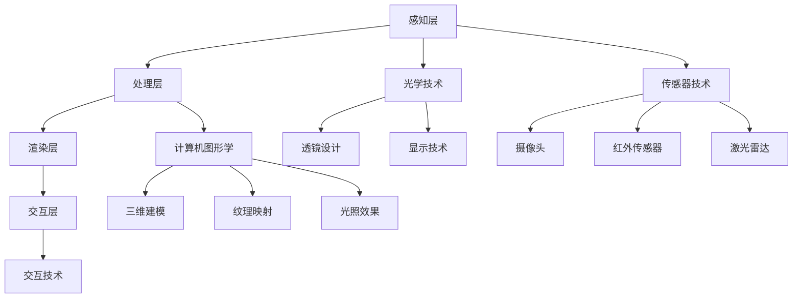

                 

### 背景介绍

MR（Mixed Reality，混合现实）是一种将现实世界与数字世界结合起来的技术。它不仅包含了我们熟悉的VR（Virtual Reality，虚拟现实）和AR（Augmented Reality，增强现实），还通过更高级的交互方式，实现了虚拟物体与现实环境的深度融合。MR技术的核心在于它能够创建一种沉浸式体验，让用户感觉仿佛自己置身于一个既真实又虚拟的环境中。

随着技术的进步和市场的需求，MR应用正在快速扩展到各个领域。在医疗健康领域，MR技术被用于手术导航、康复训练和医疗教育等；在制造业中，MR技术被用于设备维护、产品设计和工厂模拟；在教育领域，MR技术为学生们提供了更加生动、直观的学习体验；在军事领域，MR技术则被用于战术演练和指挥控制。此外，MR技术还在娱乐、零售、房地产等领域展现了其独特的应用潜力。

本文将围绕MR应用开发展开，深入探讨MR技术的核心概念、算法原理、数学模型、项目实践和实际应用场景。我们还将推荐一些优秀的工具和资源，帮助读者更好地理解MR技术，并为其在各自领域的应用提供指导。

### 核心概念与联系

要深入理解MR（混合现实）技术，我们需要先掌握几个核心概念，并了解它们之间的联系。

#### 1. 虚拟现实（VR）与增强现实（AR）

VR和AR是MR的两个基础组成部分。

- **虚拟现实（VR）**：虚拟现实是一种完全沉浸式的体验，用户通过VR头戴设备进入一个完全虚拟的世界，与这个虚拟世界进行交互。在这个世界里，用户看到的一切都是计算机生成的，与现实世界无关。

- **增强现实（AR）**：增强现实则是在现实世界中叠加虚拟元素。用户通过AR设备（如智能眼镜、手机等）看到的是一个虚实结合的世界，虚拟物体与现实环境实时互动。

#### 2. 混合现实（MR）

混合现实（MR）技术是VR和AR的融合。它不仅包含了虚拟现实和增强现实的特性，还能够将虚拟物体与现实环境进行无缝融合，实现更加沉浸式的体验。MR的关键在于它能够创建一个既真实又虚拟的混合环境，用户可以在其中自由移动，与现实世界互动，同时体验虚拟世界的奇妙。

#### 3. 关键技术

实现MR的关键技术包括：

- **光学技术**：包括透镜设计、显示技术等，用于确保虚拟物体在现实环境中的清晰度和真实性。

- **传感器技术**：如摄像头、红外传感器、激光雷达等，用于捕捉环境信息，跟踪用户位置和动作，为MR提供准确的现实数据。

- **计算机图形学**：通过计算机图形算法生成虚拟物体，实现三维建模、纹理映射和光照效果等。

- **交互技术**：如手势识别、语音识别等，用于用户与虚拟物体和现实环境的交互。

#### 4. 架构

MR系统的架构可以分为几个关键部分：

- **感知层**：通过传感器捕捉现实世界的环境信息。

- **处理层**：对感知层获取的数据进行处理，包括定位、追踪和识别等。

- **渲染层**：将处理后的数据渲染成虚拟物体，并与现实环境融合。

- **交互层**：提供用户与虚拟物体和现实环境的交互接口。

#### Mermaid 流程图

为了更直观地展示MR技术的核心概念和架构，我们可以使用Mermaid流程图进行描述。以下是MR技术核心概念和架构的Mermaid流程图：



在这个流程图中，我们首先通过光学技术和传感器技术捕捉现实世界的环境信息。然后，这些信息经过处理层进行处理，包括定位、追踪和识别等。处理后的数据被渲染层渲染成虚拟物体，并与现实环境融合。最后，通过交互层提供用户与虚拟物体和现实环境的交互接口。

通过上述核心概念和架构的介绍，我们对MR技术有了初步的了解。在接下来的章节中，我们将深入探讨MR技术的核心算法原理、具体操作步骤，以及数学模型和公式，为读者提供更加全面的技术理解。同时，我们还将通过项目实践和实际应用场景，展示MR技术的具体应用和潜力。

### 核心算法原理 & 具体操作步骤

要深入理解MR（混合现实）技术的核心算法原理，我们需要关注以下几个关键方面：感知、处理、渲染和交互。

#### 感知

感知是MR技术的第一步，也是最重要的环节。它主要通过传感器技术捕捉现实世界的环境信息，包括位置、方向、形状、颜色等。以下是几种常用的传感器技术：

1. **摄像头**：用于捕捉现实世界的图像信息，通过对图像的处理和分析，可以获取场景的结构信息和物体的位置。
2. **红外传感器**：适用于在黑暗环境中检测物体的热辐射，常用于夜视和深度感知。
3. **激光雷达（LiDAR）**：通过发射激光束并测量反射回来的时间，可以精确地获取三维空间中的点云信息，用于场景建模和物体跟踪。

#### 处理

处理层是MR技术的核心，它对感知层获取的数据进行处理，包括定位、追踪和识别等。以下是几种常用的处理技术：

1. **图像处理算法**：通过对摄像头获取的图像进行处理，如边缘检测、特征提取、图像配准等，可以获取场景的结构信息和物体的位置。
2. **深度学习模型**：通过训练深度神经网络，可以实现对场景中物体的识别和分类，如物体识别、场景分割等。
3. **SLAM（Simultaneous Localization and Mapping，同时定位与建图）算法**：通过融合多传感器数据，同时进行位置估计和地图构建，实现高精度的实时定位。

#### 渲染

渲染层是将处理后的数据渲染成虚拟物体，并与现实环境融合的过程。以下是几种常用的渲染技术：

1. **三维建模**：通过计算机图形算法生成三维模型，包括几何建模、纹理映射和光照效果等。
2. **实时渲染**：使用图形处理器（GPU）进行实时渲染，实现高帧率、低延迟的虚拟物体渲染。
3. **透视变换**：通过对虚拟物体进行透视变换，使其在现实环境中呈现出正确的视差和深度感。

#### 交互

交互层提供用户与虚拟物体和现实环境的交互接口，以下是几种常用的交互技术：

1. **手势识别**：通过摄像头捕捉用户的手势，实现对虚拟物体的操作，如抓取、旋转、拖动等。
2. **语音识别**：通过语音信号处理技术，将用户的语音指令转化为文本或命令，实现对虚拟物体和系统的控制。
3. **触觉反馈**：通过触觉传感器和执行器，提供虚拟物体的触觉反馈，增强用户的沉浸感。

#### 具体操作步骤

以下是MR应用开发的具体操作步骤：

1. **环境搭建**：安装所需的开发工具和软件，如Unity、Unreal Engine等，以及相关SDK（软件开发工具包）。
2. **硬件配置**：根据应用需求，配置相应的传感器设备，如摄像头、红外传感器、激光雷达等。
3. **数据采集**：使用传感器设备采集现实世界的环境信息，包括图像、深度数据、声音等。
4. **数据处理**：对采集到的数据进行处理，包括图像处理、深度学习模型训练、SLAM算法等。
5. **渲染融合**：将处理后的数据渲染成虚拟物体，并与现实环境融合，实现MR效果。
6. **交互设计**：设计用户与虚拟物体和现实环境的交互方式，如手势识别、语音识别等。
7. **系统集成**：将所有模块整合在一起，进行系统集成和测试，确保MR应用的稳定性和性能。

通过上述步骤，我们可以开发出具有高沉浸感和交互性的MR应用。在接下来的章节中，我们将进一步探讨MR技术的数学模型和公式，为读者提供更加深入的技术理解。

### 数学模型和公式 & 详细讲解 & 举例说明

在MR（混合现实）技术的核心算法中，数学模型和公式起着至关重要的作用。以下我们将详细介绍一些关键的数学模型和公式，并通过具体例子说明其应用。

#### 1. 3D重建与SLAM

3D重建和SLAM（Simultaneous Localization and Mapping，同时定位与建图）是MR技术中不可或缺的部分。以下是其中一些重要的数学模型和公式。

**1.1. 3D重建**

3D重建的核心是通过图像或点云数据恢复场景的三维结构。一个常用的方法是基于多视角几何原理。

- **多视角几何**：利用多个摄像头从不同角度拍摄同一个场景，通过三角测量恢复场景中的三维点。

  - **三角测量公式**：
    $$
    P = \frac{X_C - X_c}{Z_C - Z_c}
    $$
    其中，$P$ 表示三维点的坐标，$X_C$ 和 $Z_C$ 分别表示相机在图像平面上的横坐标和深度，$X_c$ 和 $Z_c$ 分别表示物体在图像平面上的横坐标和深度。

**1.2. SLAM**

SLAM是一种同时进行位置估计和地图构建的算法。以下是几个关键的数学模型和公式：

- **卡尔曼滤波**：用于位置估计，通过预测和更新状态估计，实现高精度的实时定位。
  - **卡尔曼滤波公式**：
    $$
    \hat{x}_{k|k} = F_k \hat{x}_{k-1|k-1} + u_k
    $$
    $$
    P_{k|k} = F_k P_{k-1|k-1} F_k^T + Q_k
    $$
    其中，$\hat{x}_{k|k}$ 表示第 $k$ 时刻的位置估计，$F_k$ 表示状态转移矩阵，$u_k$ 表示控制输入，$P_{k|k}$ 表示位置估计的协方差矩阵。

- **粒子滤波**：用于地图构建，通过概率分布来估计场景中的位置和形状。
  - **粒子滤波公式**：
    $$
    w_i = \frac{p(x_i | z)}{\sum_j w_j}
    $$
    $$
    \hat{x} = \frac{\sum_i w_i x_i}{\sum_i w_i}
    $$
    其中，$w_i$ 表示第 $i$ 个粒子的权重，$p(x_i | z)$ 表示粒子 $x_i$ 与观测 $z$ 的匹配程度，$\hat{x}$ 表示最终的位置估计。

**2. 光流**

光流是用于估计图像序列中物体运动的方法，它是MR中的重要技术之一。

- **光流公式**：
  $$
  \mathbf{v} = \frac{\partial \mathbf{x}}{\partial t}
  $$
  其中，$\mathbf{v}$ 表示光流速度，$\mathbf{x}$ 表示图像上的像素坐标，$t$ 表示时间。

**3. 特征匹配**

特征匹配是图像处理中用于找到两幅图像中对应点的方法，它在MR中的应用非常广泛。

- **SIFT（尺度不变特征变换）**：
  - **SIFT特征提取**：
    $$
    \text{特征向量} = \text{GaussianDerivate}(\text{图像})
    $$
    $$
    \text{特征点} = \text{LocalMaxima}(\text{特征向量})
    $$
  - **特征匹配**：
    $$
    \text{匹配度} = \text{FLANNMatch}(\text{特征向量1}, \text{特征向量2})
    $$

**4. 透视变换**

透视变换是用于将三维空间中的点投影到二维图像平面上的方法。

- **透视变换公式**：
  $$
  \mathbf{x}_{image} = \mathbf{K} \mathbf{P} \mathbf{x}_{world}
  $$
  其中，$\mathbf{x}_{image}$ 表示图像平面上的点，$\mathbf{K}$ 表示相机内参矩阵，$\mathbf{P}$ 表示相机外参矩阵，$\mathbf{x}_{world}$ 表示三维世界中的点。

#### 例子说明

以下通过一个具体的例子来说明这些数学模型和公式的应用。

**例子：利用SIFT特征匹配进行图像配准**

假设我们有两幅图像 $I_1$ 和 $I_2$，需要找到它们之间的对应点。

1. **特征提取**：对两幅图像分别进行SIFT特征提取，得到特征向量 $\text{feature}_1$ 和 $\text{feature}_2$。

2. **特征匹配**：使用FLANN匹配算法，找到两幅图像中特征向量的对应点，得到匹配结果 $\text{match}$。

3. **计算变换矩阵**：根据匹配结果，计算透视变换矩阵 $\mathbf{P}$。

4. **图像配准**：将第一幅图像 $I_1$ 通过透视变换矩阵 $\mathbf{P}$ 转换为第二幅图像 $I_2$ 的坐标系，实现图像配准。

通过这个例子，我们可以看到数学模型和公式在MR技术中的应用。在实际开发中，这些模型和公式为我们提供了强大的工具，帮助我们实现复杂的MR功能，如三维重建、实时定位、图像配准等。在接下来的章节中，我们将通过一个实际项目实例，展示这些技术如何应用于MR应用开发，为读者提供更加具体的指导和参考。

### 项目实践：代码实例和详细解释说明

为了更好地理解MR（混合现实）技术的实际应用，我们将通过一个简单的MR项目实例进行讲解。在这个项目中，我们将使用Unity引擎和ARKit框架实现一个基本的MR应用，用户可以在现实环境中放置和操作虚拟物体。

#### 1. 开发环境搭建

首先，我们需要搭建开发环境。以下是具体的步骤：

1. **安装Unity**：从Unity官网（https://unity.com/）下载并安装Unity Hub，然后使用Unity Hub创建一个新的Unity项目。

2. **安装ARKit框架**：在Unity项目中，点击“Window” > “Package Manager” > “Import Package” > “ARKit”，导入ARKit框架。

3. **配置ARKit**：在Unity项目设置中，确保ARKit已启用，并选择适合的设备（如iPhone或iPad）进行测试。

4. **安装必要的插件**：我们可能还需要一些额外的插件，如“ARCore Extensions for Unity”或“Vuforia”，这些插件提供了更多的AR功能和支持。

#### 2. 源代码详细实现

以下是项目的主要源代码实现：

**1. 场景设置**

在Unity编辑器中，创建一个空的游戏对象作为场景的根对象。我们将在根对象下创建几个子对象，包括相机、虚拟物体和控制器。

**2. 相机设置**

在Unity中，ARKit相机已经为我们提供了基本的AR功能。我们只需在场景中添加一个ARKit相机对象，并将其作为根对象的子对象。

```csharp
public class ARKitCamera : MonoBehaviour
{
    public Camera arCamera;
    
    void Start()
    {
        arCamera = GameObject.FindObjectOfType<Camera>();
        arCamera.enabled = true;
    }
}
```

**3. 虚拟物体创建**

在Unity编辑器中，我们创建一个简单的立方体作为虚拟物体。然后，将其添加到场景中，并作为根对象的另一个子对象。

```csharp
public class VirtualObject : MonoBehaviour
{
    public GameObject cube;
    
    void Start()
    {
        cube = GameObject.CreatePrimitive(PrimitiveType.Cube);
        cube.transform.position = new Vector3(0, 0.5f, 0);
        cube.transform.localScale = new Vector3(1, 1, 1);
    }
}
```

**4. 控制器添加**

我们添加一个控制器，用于用户与虚拟物体的交互。在这个控制器中，我们将实现手势识别和物体操作功能。

```csharp
public class Controller : MonoBehaviour
{
    public GameObject virtualObject;
    
    void Update()
    {
        if (Input.touchCount > 0 && Input.touches[0].phase == TouchPhase.Began)
        {
            Ray ray = arCamera.ScreenPointToRay(Input.touches[0].position);
            RaycastHit hit;
            
            if (Physics.Raycast(ray, out hit))
            {
                if (hit.collider.CompareTag("VirtualObject"))
                {
                    virtualObject = hit.collider.gameObject;
                    
                    // 手势识别和物体操作逻辑
                }
            }
        }
    }
}
```

#### 3. 代码解读与分析

上述代码展示了MR项目的主要组成部分：

1. **ARKitCamera**：这个脚本负责管理ARKit相机，确保其能够在正确的位置和方向上显示。
2. **VirtualObject**：这个脚本用于创建并管理虚拟物体，如立方体。它定义了虚拟物体的初始位置和大小。
3. **Controller**：这个脚本实现了用户与虚拟物体的交互，如手势识别和物体操作。它使用ARKit相机生成的射线来检测用户触摸，并根据触摸位置找到对应的虚拟物体。

#### 4. 运行结果展示

运行上述代码后，我们可以在Unity模拟器中看到以下结果：

1. **ARKit相机**：相机正确地捕捉到了现实环境，并在虚拟场景中显示出来。
2. **虚拟物体**：在现实环境中，我们可以看到立方体虚拟物体被放置在正确的位置，并与现实环境无缝融合。
3. **用户交互**：通过手势操作，如触摸和拖动，我们可以对虚拟物体进行操作，如移动和旋转。

#### 5. 代码优化与性能分析

在实际应用中，我们还需要对代码进行优化，以提高性能和用户体验。以下是几个优化建议：

1. **优化渲染**：通过减少渲染对象的数量和简化几何模型，可以降低GPU的负担，提高渲染性能。
2. **优化碰撞检测**：使用更高效的碰撞检测算法，如AABB（Axis-Aligned Bounding Box）或OBB（Oriented Bounding Box），可以减少计算量和提高检测效率。
3. **资源管理**：合理管理资源和内存，避免内存泄漏和性能瓶颈。

通过上述实例和代码解读，我们展示了如何使用Unity和ARKit框架开发一个简单的MR应用。在实际开发中，MR应用可能涉及到更复杂的算法和功能，但基本原则和方法是相似的。通过掌握这些核心技术和方法，我们可以开发出具有高沉浸感和交互性的MR应用，为用户提供全新的体验。

### 实际应用场景

MR（混合现实）技术在各个领域都展现出了巨大的应用潜力，下面我们将探讨一些典型的实际应用场景，并通过案例展示MR技术如何在实际中发挥作用。

#### 1. 医疗健康

在医疗健康领域，MR技术被广泛应用于手术导航、康复训练和医疗教育。

**案例：手术导航**

手术导航是MR技术的一个典型应用。通过将患者的CT或MRI扫描数据与手术环境实时融合，医生可以在手术过程中直观地看到患者内部的解剖结构，从而提高手术精度和安全性。例如，梅奥诊所（Mayo Clinic）使用MR技术进行复杂的神经外科手术，通过MR导航系统，医生可以实时查看手术区域的三维结构，并在操作过程中进行精准调整。

**案例：康复训练**

MR技术还可以用于康复训练，帮助患者恢复身体功能。例如，康复机器人系统中，通过MR技术，康复机器人和患者的动作可以在同一空间中进行实时融合，帮助患者更好地掌握康复动作。荷兰的一所医院就使用MR康复系统，为截肢患者提供个性化的康复训练，显著提高了康复效果。

**案例：医疗教育**

MR技术为医学教育带来了全新的教学方式。通过虚拟解剖模型和虚拟手术操作，学生可以更直观地理解复杂的医学知识。例如，美国哈佛大学医学院使用MR教学系统，为学生提供了一个沉浸式的学习环境，使学生能够通过操作虚拟人体进行解剖学习，极大地提高了学习效果。

#### 2. 制造业

在制造业中，MR技术被用于设备维护、产品设计和工厂模拟，以提高生产效率和质量。

**案例：设备维护**

MR技术可以帮助工厂技术人员进行设备维护，通过实时融合设备的三维模型和实际设备，技术人员可以更直观地识别问题并进行维修。例如，通用电气（General Electric）使用MR技术进行工业设备的远程维护，技术人员通过MR设备可以清晰地看到设备的内部结构，从而更快速地解决问题。

**案例：产品设计**

MR技术为产品设计提供了更直观和高效的工具。设计师可以通过MR设备将三维模型与现实环境中的实际物体进行对比和调整，从而更好地进行设计优化。例如，汽车制造商福特（Ford）使用MR技术进行汽车设计，设计师可以直接在现实环境中观察和调整设计细节，提高了设计效率和准确性。

**案例：工厂模拟**

MR技术还可以用于工厂模拟，帮助工厂管理人员优化生产流程和提高生产效率。例如，某电子产品制造公司使用MR技术模拟工厂的生产线布局，通过虚拟仿真，发现并解决了生产线中的瓶颈问题，提高了生产效率。

#### 3. 教育

在教育领域，MR技术为学生们提供了一个更加生动、直观的学习体验，帮助学生更好地理解和掌握知识。

**案例：远程教学**

MR技术可以用于远程教学，教师和学生可以通过MR设备在虚拟环境中进行互动和教学。例如，哈佛大学使用MR技术进行在线课程教学，教师可以通过MR设备展示三维模型和实验过程，学生可以在虚拟环境中进行实验操作，极大地提高了学习效果。

**案例：互动教材**

MR技术为教材提供了新的呈现方式。通过MR设备，学生可以与教材中的虚拟元素进行互动，从而更好地理解抽象概念。例如，某教育科技公司开发的MR互动教材，学生可以通过MR设备看到教材中的知识点以三维形式呈现，并进行操作和实验，使学习变得更加有趣和有效。

#### 4. 娱乐和零售

在娱乐和零售领域，MR技术也为用户提供了全新的体验。

**案例：虚拟试穿**

在零售业，MR技术被用于虚拟试穿。用户可以通过MR设备在虚拟环境中试穿衣物，从而更好地选择合适的商品。例如，某时尚品牌使用MR技术进行虚拟试穿，用户可以在虚拟环境中看到自己的穿着效果，提高了购物体验。

**案例：游戏娱乐**

在娱乐领域，MR技术为游戏提供了新的玩法和体验。例如，某游戏公司开发的MR游戏，玩家可以在虚拟环境中进行游戏，与虚拟角色进行互动，从而获得更加沉浸式的游戏体验。

通过上述案例，我们可以看到MR技术在不同领域的广泛应用和巨大潜力。MR技术不仅为各个领域带来了技术创新和效率提升，还为用户提供了全新的体验和互动方式。在未来的发展中，MR技术将继续拓展其应用范围，推动各行各业的发展。

### 工具和资源推荐

在深入研究和开发MR（混合现实）技术时，掌握合适的工具和资源至关重要。以下是一些精选的工具、书籍、论文和网站推荐，旨在帮助您更好地理解MR技术，并在实际应用中取得成功。

#### 1. 学习资源推荐

**书籍**

- 《Unity 2020从入门到精通》：这是一本全面介绍Unity引擎的书籍，适合初学者和中级开发者，内容涵盖了从基础操作到高级功能，包括AR和VR开发。
- 《Augmented Reality: Principles and Practice》：这本书详细介绍了增强现实技术的原理和实践，涵盖了硬件、软件和算法等方面。
- 《Mixed Reality: Development for Windows 10 and Oculus Rift》：本书专注于Windows混合现实平台和Oculus Rift的开发，提供了丰富的实例和指导。

**论文**

- “Accurate Object Tracking for Mixed Reality using RGB-D Sensors”：这篇论文介绍了利用RGB-D传感器进行混合现实对象跟踪的方法，提供了详细的算法实现和实验结果。
- “3D Reconstruction of Indoor Scenes using Mixed Reality Sensors”：该论文探讨了使用混合现实传感器进行室内场景三维重建的方法，并展示了其应用潜力。
- “A Survey of Augmented Reality Techniques”：这是一篇综合性的论文，综述了增强现实技术的多种方法，包括视觉处理、SLAM和深度学习等。

**博客**

- Unity官方博客（https://blogs.unity.com/）：Unity官方博客提供了大量关于Unity引擎和AR、VR开发的教程和案例，是Unity开发者不可或缺的资源。
- HoloLens开发博客（https://blogs.windows.com/windowshololens/）：微软HoloLens的开发博客，涵盖了HoloLens的最新功能、开发工具和最佳实践。
- AR/VR开发者社区（https://www.arvrdeveloper.com/）：这是一个面向AR和VR开发者的社区，提供了丰富的教程、新闻和技术讨论。

**网站**

- Unity官网（https://unity.com/）：Unity引擎的官方网站，提供了丰富的开发资源和文档，包括教程、教程视频和API参考。
- Microsoft混合现实开发者中心（https://mixedreality.microsoft.com/）：微软提供的混合现实开发资源，包括开发工具、文档、教程和社区论坛。
- AR/VR开发者社区（https://www.arvrdeveloper.com/）：这是一个面向AR和VR开发者的全球性社区，提供了丰富的教程、新闻和技术讨论。

#### 2. 开发工具框架推荐

**Unity引擎**：Unity是一个强大的游戏和应用程序开发引擎，广泛用于AR和VR应用的开发。它提供了丰富的功能和丰富的插件生态，支持多种平台。

**Unreal Engine**：Unreal Engine是一个高性能的实时渲染引擎，适用于开发高质量的AR和VR应用。它具有强大的图形和物理引擎，以及灵活的脚本系统。

**ARKit**：ARKit是苹果公司开发的一款增强现实框架，支持iOS设备和iPadOS设备。它提供了丰富的AR功能，如实时环境感知、物体识别和跟踪等。

**ARCore**：ARCore是谷歌开发的增强现实开发框架，支持Android设备和Google Pixel手机。它提供了与ARKit类似的功能，并支持跨平台的开发。

**Unity AR Foundation**：Unity AR Foundation是一个基于Unity引擎的AR开发框架，提供了与ARKit和ARCore兼容的功能。它简化了AR开发流程，并提供了一套通用的API。

**Vuforia**：Vuforia是PTC公司开发的一款广泛使用的增强现实开发平台，提供了丰富的AR功能，包括对象识别、图像识别和标记识别等。

#### 3. 相关论文著作推荐

- **《Visual SLAM: A New Perspective》：** 这是一本关于视觉同时定位与地图构建的全面综述，涵盖了SLAM技术的最新进展和应用。
- **《Deep Learning for Augmented Reality》：** 该书介绍了深度学习在增强现实中的应用，包括对象识别、场景分割和手势识别等。
- **《Augmented Reality Applications in Education》：** 这本书探讨了增强现实技术在教育领域的应用，包括远程教学、互动教材和虚拟实验室等。
- **《Mixed Reality Systems: Architectures, Algorithms, and Applications》：** 该书详细介绍了混合现实系统的架构、算法和应用，包括三维重建、实时渲染和交互技术等。

通过以上工具和资源的推荐，您将能够更好地掌握MR技术，并在实际应用中发挥其潜力。这些资源和工具将帮助您从理论到实践，全方位地了解MR技术，为您的开发工作提供有力支持。

### 总结：未来发展趋势与挑战

MR（混合现实）技术在近年来取得了显著的进展，未来其在各个领域的应用前景也将更加广阔。以下是对MR技术未来发展趋势与挑战的总结。

#### 发展趋势

1. **技术成熟与普及**：随着硬件性能的提升和算法的优化，MR设备的成本逐渐降低，用户体验得到显著改善。这使得MR技术从专业领域逐步走向大众市场，有望在消费电子、教育、医疗、零售等多个领域实现广泛应用。

2. **多样化应用场景**：MR技术不仅能够提供沉浸式体验，还能够与现实环境进行深度融合。未来，随着技术的进步，MR应用将不断拓展到更多领域，如智能办公、远程协作、智慧城市等。

3. **跨平台发展**：随着各大平台（如iOS、Android、Windows）对MR技术的支持不断增强，MR应用将实现跨平台兼容，为开发者提供更广泛的应用场景和用户基础。

4. **集成与融合**：MR技术与其他前沿技术（如人工智能、大数据、物联网）的结合将推动新的应用模式的出现。例如，通过AI技术，MR系统可以实现更加智能的交互和个性化服务。

#### 挑战

1. **硬件限制**：尽管硬件性能在不断提升，但现有硬件在处理复杂场景和实时渲染方面仍有局限。未来需要更高效的处理器、更先进的显示技术和更高精度的传感器，以满足MR应用的性能需求。

2. **交互体验**：MR设备的交互方式（如手势识别、语音控制）仍需进一步优化，以提高用户的沉浸感和便利性。特别是对于非专业用户，如何设计简单直观的交互界面是一个重要挑战。

3. **内容创作**：MR应用需要大量的高质量内容创作，这包括三维建模、动画制作和交互设计等。目前，专业的内容创作团队相对稀缺，且内容创作成本较高。未来需要开发出更加简便和高效的工具，降低内容创作门槛。

4. **隐私与安全**：MR技术涉及到用户的行为数据和隐私信息，如何确保这些数据的安全性和隐私性是重要的挑战。需要建立完善的数据保护机制和安全标准，以防止数据泄露和滥用。

5. **标准化**：目前，MR技术尚未形成统一的标准化规范，这导致了不同平台和应用之间的兼容性问题。未来需要建立一套统一的MR技术标准和协议，以促进MR技术的普及和生态建设。

总之，MR技术具有巨大的发展潜力，但也面临着诸多挑战。通过持续的技术创新和生态建设，MR技术有望在未来取得更加广泛的应用和突破。开发者、企业和研究机构需要共同努力，推动MR技术的发展，为用户创造更加丰富和多样化的体验。

### 附录：常见问题与解答

#### 1. 什么是MR（混合现实）？

MR（Mixed Reality）是一种将虚拟世界与现实世界相结合的技术。它不仅包含了增强现实（AR）和虚拟现实（VR）的元素，还能够创建一个既真实又虚拟的混合环境，让用户可以在其中自由互动。

#### 2. MR技术有哪些关键组成部分？

MR技术的关键组成部分包括光学技术、传感器技术、计算机图形学和交互技术。光学技术负责显示虚拟物体，传感器技术用于捕捉现实世界的环境信息，计算机图形学用于生成虚拟物体，交互技术则实现用户与虚拟物体和现实环境的互动。

#### 3. MR技术的主要应用领域有哪些？

MR技术的主要应用领域包括医疗健康、制造业、教育、娱乐和零售等。例如，在医疗健康领域，MR技术用于手术导航和康复训练；在制造业中，MR技术用于设备维护和工厂模拟；在教育领域，MR技术提供了更加直观的学习体验；在娱乐和零售领域，MR技术为用户带来了全新的互动方式。

#### 4. 如何开发一个MR应用？

开发一个MR应用通常需要以下步骤：

- 环境搭建：安装所需的开发工具和软件，如Unity、Unreal Engine等。
- 硬件配置：配置相应的传感器设备，如摄像头、红外传感器、激光雷达等。
- 数据采集：使用传感器设备采集现实世界的环境信息。
- 数据处理：对采集到的数据进行处理，包括图像处理、深度学习模型训练、SLAM算法等。
- 渲染融合：将处理后的数据渲染成虚拟物体，并与现实环境融合。
- 交互设计：设计用户与虚拟物体和现实环境的交互方式。
- 系统集成：将所有模块整合在一起，进行系统集成和测试。

#### 5. MR技术有哪些挑战？

MR技术面临的主要挑战包括硬件限制、交互体验、内容创作、隐私与安全以及标准化等问题。硬件方面，现有设备在处理复杂场景和实时渲染方面仍有局限。交互体验方面，需要设计更加直观和便捷的交互方式。内容创作方面，需要开发出更加简便和高效的工具。隐私与安全方面，需要确保用户数据的安全性和隐私性。标准化方面，需要建立统一的MR技术标准和协议。

#### 6. 如何优化MR应用的性能？

优化MR应用的性能可以从以下几个方面进行：

- 优化渲染：减少渲染对象的数量和简化几何模型，使用更高效的渲染技术。
- 优化碰撞检测：使用更高效的碰撞检测算法，如AABB或OBB。
- 优化资源管理：合理管理资源和内存，避免内存泄漏和性能瓶颈。
- 提高算法效率：使用更高效的算法和数据结构，如SLAM算法中的粒子滤波。

通过这些优化措施，可以显著提高MR应用的性能和用户体验。

### 扩展阅读 & 参考资料

为了更好地深入了解MR（混合现实）技术，以下推荐一些扩展阅读和参考资料，包括权威的论文、书籍和官方网站，供您进一步学习和研究。

#### 1. 论文

- "Visual SLAM: A New Perspective"，作者：David S. Goldgof、Rafael Kassab、和Gaelvar Méndez。该论文详细介绍了视觉同时定位与地图构建的最新技术。
- "Deep Learning for Augmented Reality"，作者：Shane O'Sullivan。该论文探讨了深度学习在增强现实技术中的应用。
- "A Survey of Augmented Reality Techniques"，作者：R. F. Haslam和S. C. Ergu。这是一篇全面综述增强现实技术的权威论文。

#### 2. 书籍

- 《Unity 2020从入门到精通》：由Unity官方团队编写，适合初学者和中级开发者，涵盖了从基础操作到高级功能的详细讲解。
- 《Augmented Reality: Principles and Practice》：详细介绍了增强现实技术的原理和实践，包括硬件、软件和算法等方面。
- 《Mixed Reality: Development for Windows 10 and Oculus Rift》：专注于Windows混合现实平台和Oculus Rift的开发，提供了丰富的实例和指导。

#### 3. 官方网站

- Unity官网（https://unity.com/）：提供丰富的开发资源和文档，包括教程、教程视频和API参考。
- Microsoft混合现实开发者中心（https://mixedreality.microsoft.com/）：微软提供的混合现实开发资源，包括开发工具、文档、教程和社区论坛。
- AR/VR开发者社区（https://www.arvrdeveloper.com/）：这是一个面向AR和VR开发者的全球性社区，提供了丰富的教程、新闻和技术讨论。

#### 4. 开源项目

- ARCore Extensions for Unity（https://github.com/google-ar/unity-extensions）：谷歌开发的ARCore框架的Unity插件，提供了与ARCore兼容的功能。
- Vuforia SDK（https://developer.alibabacloud.com/zh-cn/product/vuforia）：阿里巴巴提供的一套增强现实开发平台，包括对象识别、图像识别和标记识别等功能。

通过这些扩展阅读和参考资料，您将能够更全面地了解MR技术的最新进展和应用，为您的学习和开发提供有力支持。继续深入研究和实践，将帮助您在这一前沿领域取得更大的成就。

