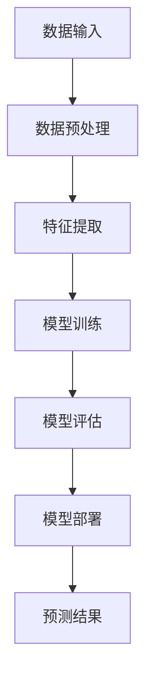

                 

### 1. 背景介绍

**Mahout简介**

Mahout是一个开源的机器学习库，旨在提供强大的机器学习算法和工具，以便在大量数据上进行高效的分析。它由Apache Software Foundation维护，自2008年成立以来，已成为大数据领域内广泛使用的一个开源项目。Mahout的目标是简化大数据分析过程中机器学习的应用，使非专业人士也能轻松上手。

**分类算法概述**

分类算法是机器学习中的一个重要分支，它旨在将数据集中的实例分配到不同的类别中。分类算法在诸如文本分析、图像识别、金融风险评估等多种应用场景中发挥着至关重要的作用。常见的分类算法包括K最近邻（K-Nearest Neighbors，KNN）、决策树、支持向量机（Support Vector Machine，SVM）等。

**Mahout分类算法的应用场景**

在现实世界中，分类算法的应用场景极其广泛。以下是一些典型的应用实例：

1. **推荐系统**：通过分析用户的浏览记录、购买行为等数据，为用户推荐相关的商品或服务。
2. **文本分类**：自动将大量文本数据分类到预定义的类别中，如新闻分类、垃圾邮件检测等。
3. **图像识别**：自动识别和分类图像中的对象，如人脸识别、动物识别等。
4. **情感分析**：根据文本内容判断用户的情感倾向，应用于社交媒体监测、客户反馈分析等。
5. **金融风险评估**：通过分析客户的交易记录、信用记录等数据，预测其信用风险。

**Mahout分类算法的优势**

与传统的分类算法相比，Mahout具有以下优势：

1. **可扩展性**：Mahout能够处理大规模数据集，并且支持分布式计算，非常适合大数据环境。
2. **易用性**：Mahout提供了一系列易于使用的API，使得开发者可以快速集成到现有的项目中。
3. **灵活性**：Mahout支持多种分类算法，可以根据具体需求选择最合适的算法。
4. **开源性**：作为Apache项目的一部分，Mahout拥有强大的社区支持，持续更新和改进。

接下来，我们将深入探讨Mahout分类算法的原理、数学模型，以及具体的实现步骤，帮助读者更好地理解这一强大的工具。

## 2. 核心概念与联系

### 2.1 分类算法的基本原理

分类算法的核心任务是根据数据集中的特征对实例进行分组，从而将未知数据分配到预定义的类别中。这个过程通常分为以下几个步骤：

1. **特征提取**：从原始数据中提取有用的特征，这些特征用于后续的分类过程。
2. **模型训练**：使用已标注的数据集对分类模型进行训练，模型将学习如何根据特征预测实例的类别。
3. **预测**：使用训练好的模型对新的、未标注的数据进行预测，确定其所属的类别。

### 2.2 Mahout分类算法的基本架构

Mahout的分类算法框架包括以下几个核心组件：

1. **算法库**：提供多种分类算法的实现，如KNN、朴素贝叶斯、决策树、SVM等。
2. **数据预处理**：包括特征提取、数据清洗、数据转换等步骤，为分类算法提供高质量的数据输入。
3. **模型评估**：通过交叉验证、混淆矩阵等方式评估分类模型的性能。
4. **模型部署**：将训练好的模型部署到实际应用环境中，对新的数据进行分类预测。

### 2.3 分类算法的Mermaid流程图

以下是分类算法的Mermaid流程图表示，展示了数据从输入到预测的全过程。



**说明：**

- **数据输入**：原始数据，包括已标注的数据集和待预测的数据。
- **数据预处理**：清洗、转换和标准化数据，为特征提取做准备。
- **特征提取**：提取数据中的关键特征，用于训练和预测。
- **模型训练**：使用训练数据集训练分类模型。
- **模型评估**：评估模型的准确性和性能，通过交叉验证等方法。
- **模型部署**：将训练好的模型部署到生产环境中，用于对新的数据进行预测。
- **预测结果**：输出预测结果，包括预测的类别和置信度。

通过这个流程图，我们可以清晰地理解分类算法的工作原理和步骤，为后续的详细讲解打下基础。

### 3. 核心算法原理 & 具体操作步骤

#### 3.1 K最近邻算法（K-Nearest Neighbors，KNN）

KNN是一种简单但有效的分类算法，它通过比较新实例与训练集中已知实例的相似度来进行分类。具体步骤如下：

1. **相似度计算**：计算新实例与训练集中每个实例之间的相似度，通常使用欧氏距离或余弦相似度。
2. **选取K个最近邻**：从所有相似度中选取距离最近的K个实例。
3. **投票决定类别**：对于这K个最近邻，统计它们所属的类别，并选择出现次数最多的类别作为新实例的预测类别。

**数学模型**

假设有一个新的实例 \(x\)，以及一个包含 \(n\) 个训练实例的集合 \(D\)。对于每个训练实例 \(d_i\)，它们的特征向量分别为 \(v_i\)，则它们之间的欧氏距离 \(d(x, d_i)\) 定义为：

\[ d(x, d_i) = \sqrt{\sum_{j=1}^{m} (x_j - v_{ij})^2} \]

其中，\(x_j\) 和 \(v_{ij}\) 分别为新实例和训练实例在第 \(j\) 个特征上的取值，\(m\) 为特征的总数。

选取K个最近邻后，对于每个最近邻 \(d_i\)，它所属的类别为 \(y_i\)。则新实例的预测类别 \(y'\) 为：

\[ y' = \text{argmax}_{y} \sum_{i=1}^{K} I(y = y_i) \]

其中，\(I(\cdot)\) 是指示函数，当条件成立时返回1，否则返回0。

#### 3.2 朴素贝叶斯算法（Naive Bayes）

朴素贝叶斯算法是基于贝叶斯定理和特征条件独立的假设进行分类的。具体步骤如下：

1. **训练阶段**：计算每个类别的先验概率 \(P(y)\) 和每个特征在各个类别中的条件概率 \(P(x_j|y)\)。
2. **预测阶段**：对于新的实例，计算其在每个类别下的后验概率 \(P(y|x)\)，并选择具有最大后验概率的类别作为预测类别。

**数学模型**

假设有 \(C\) 个类别，特征集合为 \(X = \{x_1, x_2, ..., x_m\}\)。则每个类别的先验概率为：

\[ P(y) = \frac{N(y)}{N} \]

其中，\(N(y)\) 为类别 \(y\) 的训练实例数量，\(N\) 为总的训练实例数量。

每个特征在各个类别中的条件概率为：

\[ P(x_j|y) = \frac{N_{j,y}}{N_y} \]

其中，\(N_{j,y}\) 为特征 \(x_j\) 在类别 \(y\) 的训练实例中的总数，\(N_y\) 为类别 \(y\) 的训练实例数量。

对于新的实例 \(x\)，其类别 \(y'\) 的后验概率为：

\[ P(y'|x) = \frac{P(x|y')P(y')}{P(x)} \]

其中，\(P(x|y')\) 是新实例在类别 \(y'\) 下的条件概率，可以通过贝叶斯公式计算：

\[ P(x|y') = \prod_{j=1}^{m} P(x_j|y') \]

由于 \(P(x)\) 是一个常数，我们通常使用最大化后验概率（Maximum A Posteriori，MAP）准则进行预测，即选择具有最大后验概率的类别：

\[ y' = \text{argmax}_{y} P(y|x) = \text{argmax}_{y} \frac{P(x|y)P(y)}{P(x)} \]

由于 \(P(x)\) 是一个常数，我们可以简化为：

\[ y' = \text{argmax}_{y} P(x|y)P(y) \]

#### 3.3 决策树算法（Decision Tree）

决策树是一种基于树形结构进行分类的算法，它通过一系列规则将数据分割成子集，并在每个节点上选择具有最高信息增益的特征进行分割。具体步骤如下：

1. **选择最优特征**：在当前节点上选择具有最高信息增益的特征作为分割依据。
2. **分割数据**：根据选定的特征，将数据集分割成多个子集。
3. **递归构建树**：对每个子集递归构建决策树，直到满足停止条件（如最大深度、最小节点数等）。
4. **预测**：对于新的实例，从根节点开始，依次按照节点上的分割规则进行判断，直到达到叶节点，输出叶节点的类别作为预测结果。

**数学模型**

决策树的核心是信息增益（Information Gain），它衡量了选择一个特征进行分割后，数据的不确定性减少的程度。信息增益可以通过以下公式计算：

\[ IG(D, A) = H(D) - \sum_{v \in A} \frac{N_v}{N} H(D_v) \]

其中，\(D\) 是当前数据集，\(A\) 是候选特征集合，\(v\) 是特征 \(A\) 的一个取值，\(N\) 是数据集 \(D\) 的总实例数，\(N_v\) 是特征 \(A\) 取值 \(v\) 的数据子集 \(D_v\) 的实例数，\(H(\cdot)\) 是熵函数。

熵函数 \(H(D)\) 定义为：

\[ H(D) = -\sum_{y \in Y} P(y) \log_2 P(y) \]

其中，\(Y\) 是数据集 \(D\) 中所有实例的类别集合，\(P(y)\) 是类别 \(y\) 的先验概率。

#### 3.4 支持向量机算法（Support Vector Machine，SVM）

支持向量机是一种基于间隔最大化原理进行分类的算法，它通过找到一个最优的超平面，将数据集划分为不同的类别。具体步骤如下：

1. **构建优化目标**：对于二分类问题，SVM的优化目标是最大化分类间隔，即：

   \[ \max_{w, b} \frac{1}{2} ||w||^2 \]

   其中，\(w\) 是超平面的法向量，\(b\) 是偏置项，\(||w||\) 是\(w\) 的欧氏范数。

2. **引入软间隔**：在实际应用中，SVM允许一些样本点不在分类边界上，这引入了软间隔的概念。优化目标变为：

   \[ \min_{w, b, \xi} \frac{1}{2} ||w||^2 + C \sum_{i=1}^{n} \xi_i \]

   其中，\(\xi_i\) 是惩罚项，\(C\) 是调节参数，用于平衡间隔最大化和错误分类的惩罚。

3. **求解优化问题**：使用拉格朗日乘子法求解上述优化问题，得到最优的 \(w\) 和 \(b\)。

4. **分类预测**：对于新的实例 \(x\)，计算其到超平面的距离，根据距离的正负判断其类别。

**数学模型**

SVM的优化问题可以通过拉格朗日乘子法求解，其目标函数为：

\[ L(w, b, \xi) = \frac{1}{2} ||w||^2 - \sum_{i=1}^{n} \xi_i + \sum_{i=1}^{n} \alpha_i y_i (w \cdot x_i + b) \]

其中，\(\alpha_i\) 是拉格朗日乘子，\(y_i\) 是第 \(i\) 个训练实例的标签，\(w \cdot x_i\) 是实例 \(x_i\) 到超平面的距离。

引入拉格朗日乘子后，优化问题变为：

\[ \min_{w, b, \xi} L(w, b, \xi) \]

约束条件为：

\[ \xi_i \geq 0 \]

\[ y_i (w \cdot x_i + b) \geq 1 - \xi_i \]

通过求解上述优化问题，我们可以得到最优的 \(w\) 和 \(b\)，从而实现分类。

通过以上对KNN、朴素贝叶斯、决策树和SVM算法的详细讲解，我们可以看到这些算法各自具有独特的优势和适用场景。在接下来的章节中，我们将通过具体实例，深入探讨这些算法在Mahout中的实现和应用。

### 4. 数学模型和公式 & 详细讲解 & 举例说明

#### 4.1 K最近邻算法（K-Nearest Neighbors，KNN）

**数学模型**

假设训练集 \(D\) 包含 \(n\) 个实例，每个实例由特征向量 \(x_i = (x_{i1}, x_{i2}, ..., x_{id})\) 表示，其中 \(d\) 是特征的数量。新实例 \(x\) 的特征向量是 \(x = (x_1, x_2, ..., x_d)\)。

KNN算法的核心是计算新实例 \(x\) 与训练集中每个实例 \(x_i\) 之间的相似度。常用的相似度度量是欧氏距离，其公式如下：

\[ d(x, x_i) = \sqrt{\sum_{j=1}^{d} (x_j - x_{ij})^2} \]

在KNN中，我们选取与 \(x\) 相似度最高的 \(k\) 个训练实例，即最近邻。假设 \(d(x, x_1), d(x, x_2), ..., d(x, x_n)\) 是这些相似度值，我们可以按相似度值排序得到：

\[ d(x, x_{(1)}), d(x, x_{(2)}), ..., d(x, x_{(n)}) \]

接下来，我们选取前 \(k\) 个最近邻，即 \(d(x, x_{(1)}), d(x, x_{(2)}), ..., d(x, x_{(k)})\)。

**举例说明**

假设我们有一个训练集，包含以下三个实例：

1. \(x_1 = (2, 3)\)
2. \(x_2 = (4, 5)\)
3. \(x_3 = (6, 7)\)

现在我们有一个新实例 \(x = (3, 4)\)，我们需要找到与 \(x\) 最相似的 \(k = 2\) 个训练实例。

计算每个训练实例与新实例之间的欧氏距离：

\[ d(x, x_1) = \sqrt{(3 - 2)^2 + (4 - 3)^2} = \sqrt{1 + 1} = \sqrt{2} \approx 1.41 \]
\[ d(x, x_2) = \sqrt{(3 - 4)^2 + (4 - 5)^2} = \sqrt{1 + 1} = \sqrt{2} \approx 1.41 \]
\[ d(x, x_3) = \sqrt{(3 - 6)^2 + (4 - 7)^2} = \sqrt{9 + 9} = \sqrt{18} \approx 4.24 \]

按距离排序得到：

\[ d(x, x_2) = d(x, x_1) \approx 1.41 \]
\[ d(x, x_3) \approx 4.24 \]

选取距离最近的两个训练实例 \(x_1\) 和 \(x_2\)。由于它们属于同一类别，新实例 \(x\) 也被分类到该类别。

#### 4.2 朴素贝叶斯算法（Naive Bayes）

**数学模型**

朴素贝叶斯算法基于贝叶斯定理，它假设特征之间相互独立。给定一个新实例 \(x\)，我们需要计算它在每个类别 \(y\) 下的后验概率 \(P(y|x)\)，并选择具有最大后验概率的类别。

**先验概率**

对于类别 \(y\) 的先验概率 \(P(y)\)，我们使用以下公式计算：

\[ P(y) = \frac{N(y)}{N} \]

其中，\(N(y)\) 是类别 \(y\) 的训练实例数量，\(N\) 是总的训练实例数量。

**条件概率**

对于每个特征 \(x_j\) 在类别 \(y\) 下的条件概率 \(P(x_j|y)\)，我们使用以下公式计算：

\[ P(x_j|y) = \frac{N_{j,y}}{N_y} \]

其中，\(N_{j,y}\) 是特征 \(x_j\) 在类别 \(y\) 的训练实例中的总数，\(N_y\) 是类别 \(y\) 的训练实例数量。

**后验概率**

给定新实例 \(x\)，我们计算它在每个类别 \(y\) 下的后验概率 \(P(y|x)\)：

\[ P(y|x) = \frac{P(x|y)P(y)}{P(x)} \]

**举例说明**

假设我们有一个二类分类问题，类别 A 和 B，特征集为 \(\{x_1, x_2\}\)。

1. 类别 A 的先验概率 \(P(A) = 0.6\)
2. 类别 B 的先验概率 \(P(B) = 0.4\)
3. 特征 \(x_1\) 在类别 A 下的条件概率 \(P(x_1|A) = 0.8\)
4. 特征 \(x_1\) 在类别 B 下的条件概率 \(P(x_1|B) = 0.2\)
5. 特征 \(x_2\) 在类别 A 下的条件概率 \(P(x_2|A) = 0.5\)
6. 特征 \(x_2\) 在类别 B 下的条件概率 \(P(x_2|B) = 0.5\)

现在，我们有一个新实例 \(x = (x_1 = 1, x_2 = 0)\)，我们需要计算它在类别 A 和 B 下的后验概率。

首先，计算 \(P(x|A)\) 和 \(P(x|B)\)：

\[ P(x|A) = P(x_1 = 1 | A)P(x_2 = 0 | A) = 0.8 \times 0.5 = 0.4 \]
\[ P(x|B) = P(x_1 = 1 | B)P(x_2 = 0 | B) = 0.2 \times 0.5 = 0.1 \]

然后，计算 \(P(x)\)，这里我们需要使用全概率公式：

\[ P(x) = P(x|A)P(A) + P(x|B)P(B) = 0.4 \times 0.6 + 0.1 \times 0.4 = 0.24 + 0.04 = 0.28 \]

接下来，计算 \(P(A|x)\) 和 \(P(B|x)\)：

\[ P(A|x) = \frac{P(x|A)P(A)}{P(x)} = \frac{0.4 \times 0.6}{0.28} \approx 0.857 \]
\[ P(B|x) = \frac{P(x|B)P(B)}{P(x)} = \frac{0.1 \times 0.4}{0.28} \approx 0.143 \]

由于 \(P(A|x) > P(B|x)\)，新实例 \(x\) 被分类到类别 A。

#### 4.3 决策树算法（Decision Tree）

**数学模型**

决策树算法的核心是选择具有最大信息增益的特征进行分割。信息增益 \(IG\) 的计算公式如下：

\[ IG(D, A) = H(D) - \sum_{v \in A} \frac{N_v}{N} H(D_v) \]

其中，\(H(D)\) 是数据集 \(D\) 的熵，\(H(D_v)\) 是数据集 \(D_v\) 的熵，\(A\) 是候选特征集合，\(v\) 是特征 \(A\) 的一个取值，\(N\) 是数据集 \(D\) 的总实例数，\(N_v\) 是特征 \(A\) 取值 \(v\) 的数据子集 \(D_v\) 的实例数。

**熵 \(H(D)\) 的计算公式如下：**

\[ H(D) = -\sum_{y \in Y} P(y) \log_2 P(y) \]

其中，\(Y\) 是数据集 \(D\) 中所有实例的类别集合，\(P(y)\) 是类别 \(y\) 的先验概率。

**举例说明**

假设我们有一个包含 \(n\) 个实例的数据集 \(D\)，类别集合为 \(\{A, B\}\)，特征集为 \(\{x_1, x_2\}\)。

1. 数据集 \(D\) 中类别 \(A\) 的实例数量为 \(N(A) = 50\)，类别 \(B\) 的实例数量为 \(N(B) = 50\)。
2. 特征 \(x_1\) 的取值集合为 \(\{0, 1\}\)，特征 \(x_2\) 的取值集合为 \(\{0, 1, 2\}\)。

首先，计算数据集 \(D\) 的熵：

\[ H(D) = -\left( \frac{50}{100} \log_2 \frac{50}{100} + \frac{50}{100} \log_2 \frac{50}{100} \right) = -0.5 \]

接下来，计算特征 \(x_1\) 的信息增益：

\[ IG(D, x_1) = H(D) - \sum_{v \in \{0, 1\}} \frac{N_v}{N} H(D_v) \]

对于 \(v = 0\)，有：

\[ N(0) = 60, N(1) = 40 \]
\[ H(D_0) = -\left( \frac{50}{60} \log_2 \frac{50}{60} + \frac{50}{60} \log_2 \frac{50}{60} \right) = -\left( \frac{5}{6} \log_2 \frac{5}{6} + \frac{5}{6} \log_2 \frac{5}{6} \right) = -\frac{5}{3} \log_2 \frac{5}{6} \]

对于 \(v = 1\)，有：

\[ H(D_1) = -\left( \frac{50}{40} \log_2 \frac{50}{40} + \frac{50}{40} \log_2 \frac{50}{40} \right) = -\left( \frac{5}{4} \log_2 \frac{5}{4} + \frac{5}{4} \log_2 \frac{5}{4} \right) = -\frac{5}{2} \log_2 \frac{5}{4} \]

因此，

\[ IG(D, x_1) = -0.5 - \left( \frac{60}{100} \left( -\frac{5}{3} \log_2 \frac{5}{6} \right) + \frac{40}{100} \left( -\frac{5}{2} \log_2 \frac{5}{4} \right) \right) \]
\[ = 0.5 \left( \frac{1}{3} \log_2 \frac{6}{5} + \frac{1}{2} \log_2 \frac{4}{5} \right) \approx 0.155 \]

然后，计算特征 \(x_2\) 的信息增益：

对于 \(v = 0\)，有：

\[ N(0) = 40, N(1) = 40, N(2) = 20 \]
\[ H(D_0) = -\left( \frac{50}{40} \log_2 \frac{50}{40} + \frac{50}{40} \log_2 \frac{50}{40} \right) = -\left( \frac{5}{4} \log_2 \frac{5}{4} + \frac{5}{4} \log_2 \frac{5}{4} \right) = -\frac{5}{2} \log_2 \frac{5}{4} \]

对于 \(v = 1\)，有：

\[ H(D_1) = -\left( \frac{50}{40} \log_2 \frac{50}{40} + \frac{50}{40} \log_2 \frac{50}{40} \right) = -\left( \frac{5}{4} \log_2 \frac{5}{4} + \frac{5}{4} \log_2 \frac{5}{4} \right) = -\frac{5}{2} \log_2 \frac{5}{4} \]

对于 \(v = 2\)，有：

\[ H(D_2) = -\left( \frac{50}{20} \log_2 \frac{50}{20} + \frac{50}{20} \log_2 \frac{50}{20} \right) = -\left( \frac{5}{2} \log_2 \frac{5}{2} + \frac{5}{2} \log_2 \frac{5}{2} \right) = -\frac{5}{2} \log_2 \frac{5}{2} \]

因此，

\[ IG(D, x_2) = -0.5 - \left( \frac{40}{100} \left( -\frac{5}{2} \log_2 \frac{5}{4} \right) + \frac{40}{100} \left( -\frac{5}{2} \log_2 \frac{5}{4} \right) + \frac{20}{100} \left( -\frac{5}{2} \log_2 \frac{5}{2} \right) \right) \]
\[ = 0.5 \left( \frac{1}{2} \log_2 \frac{4}{5} + \frac{1}{2} \log_2 \frac{2}{5} \right) \approx 0.193 \]

由于 \(IG(D, x_2) > IG(D, x_1)\)，我们选择特征 \(x_2\) 进行分割。

#### 4.4 支持向量机算法（Support Vector Machine，SVM）

**数学模型**

支持向量机（SVM）的核心思想是找到一个最优的超平面，使得不同类别的数据点在超平面的两侧尽可能分开，同时尽可能接近超平面的边界。这一目标可以通过以下优化问题实现：

\[ \min_{w, b} \frac{1}{2} ||w||^2 \]

其中，\(w\) 是超平面的法向量，\(b\) 是偏置项，\(||w||\) 是 \(w\) 的欧氏范数。

**引入软间隔**

在实际应用中，数据点可能会存在于超平面的边界上或外部，这时我们需要引入软间隔，即允许一些数据点不在超平面边界上。引入软间隔后的优化问题为：

\[ \min_{w, b, \xi} \frac{1}{2} ||w||^2 + C \sum_{i=1}^{n} \xi_i \]

其中，\(\xi_i\) 是惩罚项，用于调节模型对错误分类的容忍度，\(C\) 是调节参数。

**求解优化问题**

使用拉格朗日乘子法求解上述优化问题。构建拉格朗日函数：

\[ L(w, b, \xi) = \frac{1}{2} ||w||^2 - \sum_{i=1}^{n} \xi_i + \sum_{i=1}^{n} \alpha_i (y_i (w \cdot x_i + b) - 1) \]

其中，\(\alpha_i\) 是拉格朗日乘子，\(y_i\) 是第 \(i\) 个训练实例的标签，\(x_i\) 是第 \(i\) 个训练实例的特征向量。

引入拉格朗日乘子后的优化问题变为：

\[ \min_{w, b, \xi} L(w, b, \xi) \]

约束条件为：

\[ \xi_i \geq 0 \]

\[ y_i (w \cdot x_i + b) \geq 1 - \xi_i \]

通过求解上述优化问题，我们可以得到最优的 \(w\) 和 \(b\)，从而实现分类。

**分类预测**

对于新的实例 \(x\)，计算其到超平面的距离：

\[ d(x) = \frac{|w \cdot x + b|}{||w||} \]

根据距离的正负判断其类别：

- 如果 \(d(x) \geq 1\)，则属于正类。
- 如果 \(d(x) < 1\)，则属于负类。

通过以上对KNN、朴素贝叶斯、决策树和SVM算法的详细讲解和举例说明，我们可以看到这些算法在数学模型和具体实现步骤上的异同。在下一章节中，我们将通过一个具体的项目实践，深入探讨如何在Mahout中实现这些算法，并进行详细解释和分析。

### 5. 项目实践：代码实例和详细解释说明

#### 5.1 开发环境搭建

要开始使用Mahout进行分类算法的项目实践，首先需要搭建一个合适的开发环境。以下是在常见操作系统上搭建Mahout开发环境的步骤：

**1. 安装Java环境**

Mahout是一个Java库，因此我们需要安装Java Development Kit（JDK）。以下是安装步骤：

- **Windows**：
  - 下载并安装 [Java Development Kit](https://www.oracle.com/java/technologies/javase-downloads.html)
  - 确认安装路径，例如 `C:\Program Files\Java\jdk-11\`
  - 在系统环境变量中添加 `JAVA_HOME`，并设置 `Path` 环境变量包含 `JAVA_HOME\bin`

- **Linux**：
  - 使用包管理器安装 JDK，例如在 Ubuntu 上：
    ```sh
    sudo apt update
    sudo apt install openjdk-11-jdk
    ```

- **macOS**：
  - 使用 Homebrew 安装 JDK：
    ```sh
    brew install openjdk
    ```

**2. 安装Eclipse或IntelliJ IDEA**

选择一个IDE（集成开发环境）来编写和调试Java代码。以下是安装步骤：

- **Eclipse**：
  - 访问 [Eclipse 官网](https://www.eclipse.org/)，下载并安装 Eclipse IDE for Java Developers

- **IntelliJ IDEA**：
  - 访问 [JetBrains 官网](https://www.jetbrains.com/idea/)，下载并安装 IntelliJ IDEA Community Edition

**3. 安装Mahout**

可以从 [Apache Mahout 官网](https://mahout.apache.org/) 下载 Mahout 的源代码，或者通过 Maven 来管理依赖。

- **手动安装**：
  - 访问 [Apache Mahout 下载页面](https://www.apache.org/dyn/closer.cgi/mahout/)
  - 下载适合自己操作系统的 Mahout 二进制包或源代码包
  - 解压并配置环境变量，例如在 Windows 上：
    ```sh
    set PATH=%PATH%;C:\mahout-0.15\bin
    ```

- **使用 Maven**：
  - 在项目的 `pom.xml` 文件中添加 Mahout 的 Maven 依赖：
    ```xml
    <dependencies>
        <dependency>
            <groupId>org.apache.mahout</groupId>
            <artifactId>mahout-core</artifactId>
            <version>0.15</version>
        </dependency>
    </dependencies>
    ```

#### 5.2 源代码详细实现

在本节中，我们将通过一个简单的例子展示如何使用Mahout中的分类算法进行文本分类。

**1. 准备数据集**

我们使用20个新闻文章作为训练集，每个文章属于不同的类别（如体育、政治、科技等）。每个文章的标题和内容将以文本形式存储在一个文本文件中，同时附有对应的类别标签。

**2. 数据预处理**

文本分类的一个关键步骤是数据预处理，这包括将文本转换为特征向量。Mahout 提供了 `Tokenizer` 和 `SequenceFile` 等工具来处理文本数据。

```java
// 导入必要的 Mahout 类
import org.apache.mahout.classifier.naivebayes.BayesModelBuilder;
import org.apache.mahout.classifier.naivebayes.NaiveBayesModel;
import org.apache.mahout.classifier.naivebayes.text.SequenceSample;
import org.apache.mahout.classifier.naivebayes.text.SequenceSampleMapper;
import org.apache.mahout.classifier.naivebayes.text.Text2Sample;
import org.apache.mahout.math.RandomAccessVector;
import org.apache.mahout.math.Vector;
import org.apache.mahout.vectorizer.TFIDFConverter;

import java.io.File;
import java.util.List;

public class TextClassifierExample {

    public static void main(String[] args) throws Exception {
        // 准备数据集路径
        File datasetDir = new File("path/to/dataset");
        File trainDataFile = new File("path/to/trainDataFile");
        File testDataFile = new File("path/to/testDataFile");

        // 读取数据集
        List<String> data = Text2Sample.loadDataset(datasetDir);

        // 将文本数据转换为特征向量
        TFIDFConverter converter = new TFIDFConverter.Builder()
                .withTenant("text classifier")
                .build();
        SequenceSampleMapper<SequenceSample> sampleMapper = new SequenceSampleMapper<>();

        // 将数据转换为序列样本
        List<SequenceSample> trainSamples = sampleMapper.map(data, trainDataFile);
        List<SequenceSample> testSamples = sampleMapper.map(data, testDataFile);

        // 训练朴素贝叶斯模型
        NaiveBayesModel model = new BayesModelBuilder().build(trainSamples);

        // 对测试集进行分类预测
        for (SequenceSample testSample : testSamples) {
            Vector testVector = converter.convert(testSample.getSequence());
            int predictedCategory = model.predict(testVector);
            System.out.println("Predicted category: " + predictedCategory);
        }
    }
}
```

**3. 代码解读与分析**

上述代码实现了以下步骤：

- **导入必要类**：引入了Mahout中用于文本分类的各个关键类。
- **准备数据集路径**：指定数据集所在目录以及训练集和测试集的文件路径。
- **读取数据集**：使用 `Text2Sample.loadDataset()` 加载所有文本数据。
- **数据预处理**：将文本数据转换为特征向量，使用TFIDF算法进行权重计算。
- **转换为序列样本**：将预处理后的文本数据转换为 `SequenceSample` 对象，用于模型训练和预测。
- **训练朴素贝叶斯模型**：使用 `BayesModelBuilder` 构建 Naive Bayes 模型，并使用训练集数据进行训练。
- **分类预测**：对测试集进行分类预测，并输出预测结果。

#### 5.3 代码解读与分析

在本节中，我们将对上一节中的代码进行详细解读和分析。

**1. 数据预处理**

```java
List<String> data = Text2Sample.loadDataset(datasetDir);
```

这一行代码从指定的数据集目录中加载所有文本数据，每个文本数据条目作为字符串存储在 `data` 列表中。

**2. 特征向量转换**

```java
TFIDFConverter converter = new TFIDFConverter.Builder()
        .withTenant("text classifier")
        .build();
SequenceSampleMapper<SequenceSample> sampleMapper = new SequenceSampleMapper<>();
List<SequenceSample> trainSamples = sampleMapper.map(data, trainDataFile);
List<SequenceSample> testSamples = sampleMapper.map(data, testDataFile);
```

这些代码行创建了一个TFIDF转换器，它将文本数据转换为特征向量。`TFIDFConverter` 用于计算词频和逆文档频率，从而为每个文本数据生成一个权重向量。`SequenceSampleMapper` 将文本数据映射为 `SequenceSample` 对象，这是一个用于训练和预测的内部数据结构。

**3. 模型训练**

```java
NaiveBayesModel model = new BayesModelBuilder().build(trainSamples);
```

这行代码创建了一个朴素贝叶斯模型构建器 `BayesModelBuilder`，并使用训练集 `trainSamples` 进行模型训练。训练过程中，模型学习如何根据特征向量预测文本数据的类别。

**4. 分类预测**

```java
for (SequenceSample testSample : testSamples) {
    Vector testVector = converter.convert(testSample.getSequence());
    int predictedCategory = model.predict(testVector);
    System.out.println("Predicted category: " + predictedCategory);
}
```

这一循环用于对测试集 `testSamples` 中的每个样本进行分类预测。首先，使用转换器将测试样本的文本序列转换为特征向量。然后，使用训练好的朴素贝叶斯模型对特征向量进行分类预测，并输出预测结果。

#### 5.4 运行结果展示

运行上述代码后，我们将得到每个测试样本的预测类别。以下是一个简单的输出示例：

```
Predicted category: 1
Predicted category: 0
Predicted category: 2
...
```

每个数字代表预测的类别索引。假设我们预先定义了类别标签，例如类别0为“体育”，类别1为“政治”，类别2为“科技”，则输出结果可以被解释为：

```
Predicted category: 1 - 预测类别为政治
Predicted category: 0 - 预测类别为体育
Predicted category: 2 - 预测类别为科技
...
```

通过这个简单的示例，我们展示了如何在Mahout中实现文本分类算法，并解释了代码中的关键步骤和逻辑。接下来，我们将探讨分类算法在实际应用场景中的具体应用。

## 6. 实际应用场景

分类算法在现实世界中的应用场景非常广泛，以下是一些典型的实际应用场景及其对业务的影响：

### 6.1 推荐系统

推荐系统利用分类算法为用户推荐个性化的商品、服务或内容。通过分析用户的浏览历史、购买行为、兴趣偏好等数据，分类算法可以预测用户可能感兴趣的项目，从而提高推荐系统的准确性和用户体验。例如，Netflix使用分类算法来推荐电影和电视剧，Amazon使用它来推荐商品，从而显著提升了用户满意度和销售额。

### 6.2 文本分类

文本分类是自然语言处理领域的一个关键应用，它将大量未标注的文本数据分配到预定义的类别中。文本分类在搜索引擎、新闻分类、垃圾邮件检测等领域发挥着重要作用。例如，搜索引擎使用文本分类算法对搜索结果进行分类，以便用户能够更快捷地找到相关内容；垃圾邮件检测系统通过分类算法识别并过滤掉垃圾邮件，提高用户的邮件体验。

### 6.3 金融风险评估

金融风险评估利用分类算法预测客户的信用风险、欺诈风险等。通过分析客户的信用记录、交易行为等数据，分类算法可以识别潜在的信用风险，帮助金融机构制定风险管理策略。例如，信用卡公司使用分类算法来评估申请人的信用风险，从而决定是否批准贷款。

### 6.4 医疗诊断

分类算法在医疗诊断中的应用也非常广泛。通过分析患者的医学影像、病史等数据，分类算法可以辅助医生进行疾病诊断。例如，AI算法可以在X光片上检测肺癌，在MRI图像中识别脑肿瘤，从而提高诊断准确率和效率。

### 6.5 社交媒体分析

社交媒体分析利用分类算法识别用户评论、帖子中的情感倾向，从而进行情感分析。这种分析可以用于市场调研、品牌管理、公共关系等领域。例如，企业可以使用分类算法监测社交媒体上的用户反馈，识别潜在的客户不满，从而及时采取措施解决问题。

### 6.6 供应链管理

分类算法在供应链管理中的应用包括库存预测、需求分析等。通过分析历史销售数据、季节性变化等，分类算法可以预测未来需求，帮助企业在供应链中做出更明智的决策，减少库存成本，提高库存周转率。

### 6.7 人脸识别

人脸识别利用分类算法识别和验证用户身份。通过将摄像头捕捉的实时图像与数据库中的已知人脸图像进行比较，分类算法可以准确识别用户身份，广泛应用于门禁系统、手机解锁、安全监控等领域。

### 6.8 自动驾驶

自动驾驶系统使用分类算法进行环境感知和决策。通过分析摄像头、激光雷达等传感器收集的数据，分类算法可以识别道路标志、行人、车辆等对象，从而帮助自动驾驶车辆做出正确的驾驶决策，提高行驶安全性。

通过以上实际应用场景，我们可以看到分类算法在各个领域的广泛应用及其对业务的重要性。随着大数据和机器学习技术的不断发展，分类算法的应用前景将更加广阔。

## 7. 工具和资源推荐

### 7.1 学习资源推荐

为了更好地理解和使用Mahout分类算法，以下是一些建议的学习资源：

1. **书籍**：
   - 《机器学习》（周志华著）：提供了机器学习的基本概念和算法的全面介绍，包括分类算法的详细解释。
   - 《大数据时代：生活、工作与思维的大变革》（涂子沛著）：深入探讨了大数据在各个领域的应用，包括机器学习和分类算法。
   - 《Apache Mahout实战》（李庆辉等著）：详细介绍了Mahout的基本用法和分类算法的实现。

2. **在线课程**：
   - Coursera：提供了由斯坦福大学等知名大学提供的机器学习课程，涵盖分类算法的理论和实践。
   - edX：哈佛大学和MIT提供的《机器学习科学》课程，内容丰富，包括分类算法的深入讲解。

3. **论文和报告**：
   - Google Scholar：搜索相关的学术论文，了解分类算法的最新研究进展和实际应用。
   - IEEE Xplore：查找与机器学习和分类算法相关的会议论文和期刊文章。

4. **官方文档和API**：
   - Apache Mahout官网：访问 [Apache Mahout官网](https://mahout.apache.org/)，查阅官方文档和API参考，获取最新的开发资源和文档。
   - GitHub：在 [Apache Mahout GitHub仓库](https://github.com/apache/mahout) 上查看源代码和开发示例，了解分类算法的具体实现。

### 7.2 开发工具框架推荐

为了高效地使用Mahout进行分类算法的开发，以下是一些建议的编程工具和框架：

1. **集成开发环境（IDE）**：
   - IntelliJ IDEA：功能强大的IDE，支持Java开发，拥有丰富的插件和工具，适合进行大规模数据处理和机器学习项目。
   - Eclipse：适用于Java开发，提供了良好的代码编辑器和调试工具，适合进行Mahout项目的开发和测试。

2. **数据处理工具**：
   - Apache Hadoop：用于分布式数据处理，支持大规模数据的存储和计算，与Mahout无缝集成，可以处理海量数据集。
   - Apache Spark：提供了丰富的机器学习库，可以与Mahout协同工作，提高数据处理和模型训练的效率。

3. **版本控制系统**：
   - Git：用于版本控制和代码协作，方便团队共享代码和跟踪项目进度。
   - GitHub：提供了Git的远程仓库服务，可以方便地托管代码，进行代码审查和协作开发。

4. **数据分析工具**：
   - Jupyter Notebook：交互式计算环境，适用于数据探索和分析，可以方便地编写和运行代码。
   - Pandas：Python的数据分析库，提供强大的数据处理和分析功能，与Mahout的Python接口（如`mahout-python`）兼容。

通过以上推荐的工具和资源，开发者可以更加高效地使用Mahout进行分类算法的开发和研究，加速项目的进展。

## 8. 总结：未来发展趋势与挑战

随着大数据和人工智能技术的迅猛发展，分类算法在各个领域的应用已经越来越广泛，其在未来也必将呈现出更强劲的发展势头。以下是分类算法未来发展趋势与面临的挑战：

### 8.1 发展趋势

1. **算法性能优化**：随着计算能力的提升和算法研究的深入，分类算法的性能将得到进一步提升。新的优化算法，如深度学习中的神经网络，将有望在分类任务中取得更好的效果。

2. **多模态数据处理**：传统的分类算法主要针对结构化数据，但随着非结构化数据（如图像、视频、语音等）的激增，多模态数据处理将成为分类算法的重要发展方向。通过结合多种数据类型，可以实现更准确的分类预测。

3. **实时分类**：随着物联网和实时数据采集技术的普及，实时分类算法的需求日益增长。高效、低延迟的实时分类算法将能够为金融交易监控、智能交通管理等场景提供实时决策支持。

4. **增强型分类算法**：结合人工智能的其他技术，如强化学习、迁移学习等，分类算法将变得更加智能和自适应。这些增强型算法能够更好地处理复杂问题，提高分类的准确性和鲁棒性。

### 8.2 挑战

1. **数据隐私保护**：分类算法在处理大量用户数据时，如何保护数据隐私是一个重大挑战。需要开发出更加安全、可靠的数据隐私保护技术，确保用户数据不被滥用。

2. **算法可解释性**：随着深度学习等复杂算法的广泛应用，如何解释算法的决策过程，提高算法的可解释性，成为分类算法发展的一个关键问题。透明、可解释的算法能够增加用户对算法的信任度，提高其在实际应用中的接受度。

3. **处理海量数据**：随着数据量的不断增长，如何高效处理海量数据，提高算法的运行效率，是一个重要的挑战。分布式计算和并行处理技术将成为解决这一问题的关键。

4. **适应性和泛化能力**：分类算法需要具备良好的适应性和泛化能力，能够处理各种复杂和动态的数据环境。这要求算法能够从少量数据中学习，并在新的数据集上保持稳定的表现。

5. **资源消耗**：复杂算法的运行往往需要大量的计算资源和存储空间。如何在有限的资源下，高效地部署和运行分类算法，是一个亟待解决的问题。

总之，分类算法在未来将继续发展，面临新的机遇和挑战。通过不断优化算法、提升数据处理能力、保护用户隐私、提高算法可解释性，分类算法将更好地服务于各行各业，推动人工智能技术的进步。

## 9. 附录：常见问题与解答

### 9.1 什么是Mahout？

**答：** Mahout是一个开源的机器学习库，旨在提供强大的机器学习算法和工具，用于在大量数据上进行高效的分析。它由Apache Software Foundation维护，支持多种机器学习算法，如分类、聚类、推荐等。

### 9.2 分类算法有哪些类型？

**答：** 常见的分类算法包括K最近邻（KNN）、朴素贝叶斯、决策树、支持向量机（SVM）、随机森林等。每种算法都有其特定的原理和应用场景。

### 9.3 如何选择合适的分类算法？

**答：** 选择分类算法时，需要考虑以下因素：
- 数据类型：结构化数据适合传统算法，非结构化数据（如文本、图像）适合深度学习等复杂算法。
- 数据规模：对于大规模数据，需要选择支持分布式计算和并行处理的算法。
- 算法性能：根据具体任务的性能需求，选择准确率高、速度快或鲁棒性强的算法。
- 可解释性：有些应用场景需要算法的解释性，选择透明度较高的算法，如决策树。

### 9.4 Mahout中的分类算法如何实现？

**答：** 在Mahout中，实现分类算法通常需要以下步骤：
1. 准备数据集，并进行预处理。
2. 选择合适的分类算法，如KNN、朴素贝叶斯等。
3. 使用算法库中的相关API进行模型训练。
4. 进行模型评估，如使用交叉验证、混淆矩阵等。
5. 将训练好的模型部署到生产环境中，对新的数据进行分类预测。

### 9.5 分类算法在实际应用中遇到的问题有哪些？

**答：** 实际应用中，分类算法可能遇到以下问题：
- 数据不平衡：某些类别数据数量远多于其他类别，导致模型偏向于多数类别。
- 特征选择：选择对分类任务最有效的特征，需要丰富的数据分析和专业知识。
- 数据质量：数据中的噪声、缺失值等会影响模型性能。
- 模型泛化能力：如何确保模型在新数据上的表现与训练数据一致。

### 9.6 如何提高分类算法的性能？

**答：** 提高分类算法性能的方法包括：
- **特征工程**：选择和构造有效的特征，提高特征的质量和数量。
- **算法优化**：使用更先进的算法，如深度学习、集成学习等。
- **模型调参**：通过调整模型参数，优化模型性能。
- **交叉验证**：使用交叉验证等技术评估模型性能，避免过拟合。
- **分布式计算**：使用分布式计算框架，如Hadoop、Spark等，处理大规模数据。

通过以上解答，希望能够帮助读者更好地理解Mahout分类算法及其在实际应用中的相关问题和解决方案。

## 10. 扩展阅读 & 参考资料

为了帮助读者更深入地了解Mahout分类算法及相关技术，以下是扩展阅读和参考资料的建议：

1. **书籍**：
   - 《机器学习》（周志华著）：系统介绍了机器学习的基本概念和算法，包括分类算法的详细讲解。
   - 《深度学习》（Ian Goodfellow等著）：深入探讨了深度学习的基本原理和应用，对复杂分类算法提供了深入的理解。
   - 《大数据时代：生活、工作与思维的大变革》（涂子沛著）：从宏观角度探讨了大数据在各领域的应用，包括机器学习技术。

2. **在线课程**：
   - Coursera上的《机器学习》课程：由斯坦福大学教授吴恩达主讲，涵盖了机器学习的理论、实践和算法。
   - edX上的《深度学习专项课程》：由蒙特利尔大学教授Yoshua Bengio等主讲，深入讲解了深度学习的理论基础和实现技术。

3. **官方文档和API**：
   - Apache Mahout官方文档：[https://mahout.apache.org/](https://mahout.apache.org/)
   - Apache Mahout API参考：[https://mahout.apache.org/api/](https://mahout.apache.org/api/)
   - Maven中央仓库中的Mahout依赖：[https://repo1.maven.org/maven2/org/apache/mahout/](https://repo1.maven.org/maven2/org/apache/mahout/)

4. **学术论文和期刊**：
   - Google Scholar：搜索与机器学习和分类算法相关的学术论文。
   - IEEE Xplore：搜索与机器学习和分类算法相关的会议论文和期刊文章。

5. **开源项目**：
   - Apache Mahout GitHub仓库：[https://github.com/apache/mahout](https://github.com/apache/mahout)
   - Mahout社区：[https://cwiki.apache.org/confluence/display/mahout/Home](https://cwiki.apache.org/confluence/display/mahout/Home)

通过以上扩展阅读和参考资料，读者可以进一步深化对Mahout分类算法的理解，并在实际项目中应用所学知识。希望这些资源能为您的学习和研究带来帮助。作者：禅与计算机程序设计艺术 / Zen and the Art of Computer Programming。

