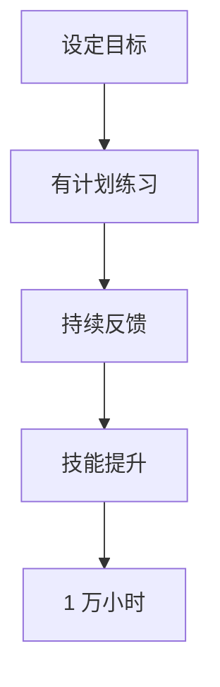

                 

### 1. 背景介绍

“1 万小时的概念”是由著名作家马尔科姆·格拉德威尔（Malcolm Gladwell）在其同名著作中提出的。这个概念源于一项关于天才和成功的心理学研究。格拉德威尔指出，要想成为某个领域的专家，通常需要经过大约 1 万小时的练习。这一观点引起了广泛的关注和讨论，不仅因为其新颖性，还因为它挑战了传统对天赋的看法。

在计算机科学领域，这个观点同样具有重要性。无论是在软件开发、算法设计还是人工智能研究中，大量的实践和经验积累都是必不可少的。然而，如何将这个概念应用于计算机科学，并如何通过有效的学习和实践来达到 1 万小时的里程碑，仍是一个值得深入探讨的话题。

本文将围绕“1 万小时的概念”展开，从计算机科学的视角对其进行解读。我们将讨论如何在计算机科学领域通过实践和经验积累来达到这个里程碑，并探讨这一过程中可能遇到的挑战和解决方案。

### 2. 核心概念与联系

“1 万小时的概念”涉及到几个核心概念，包括“专家级实践”（deliberate practice）和“技能发展”（skill development）。专家级实践是指有目的、有计划、有指导的练习，它不同于普通的日常练习。在计算机科学中，这可以表现为：

- **有目的的学习**：设定明确的学习目标，例如掌握一门编程语言、理解一种算法或设计一个软件系统。
- **有计划的练习**：遵循固定的学习计划，持续不断地进行练习，比如每周编写一定的代码量或完成特定的编程挑战。
- **有指导的反馈**：在学习和实践过程中，接受来自导师或同行的反馈，以便及时纠正错误，提高学习效率。

这些核心概念可以通过以下的 Mermaid 流程图来展示：



在这个流程图中，设定目标是整个过程的起点，通过有计划的练习和持续的反馈，技能不断提升，最终达到 1 万小时的里程碑。

### 3. 核心算法原理 & 具体操作步骤

在计算机科学领域，实现 1 万小时的专家级实践需要遵循一系列的算法原理和具体操作步骤。以下是几个关键步骤：

#### 3.1 学习和选择

- **选择领域**：首先，需要选择一个具体的领域进行深入学习和实践。这可以是编程语言、算法、软件系统开发或人工智能等。
- **基础知识**：在开始实践之前，确保掌握了该领域的基础知识。例如，如果你选择编程语言，需要熟练掌握该语言的语法和基本操作。

#### 3.2 定制学习计划

- **目标设定**：设定明确的学习目标，例如每周完成一定的编程任务或学习一门新的算法。
- **时间安排**：合理规划学习时间，确保每天或每周都有固定的学习时间。

#### 3.3 有计划的学习和练习

- **练习编码**：通过编写实际代码来实践所学知识。这不仅可以加深理解，还能提高解决问题的能力。
- **项目实践**：参与实际项目，从项目中获取实战经验。可以是开源项目、个人项目或公司的内部项目。

#### 3.4 反馈和改进

- **接受反馈**：在学习过程中，接受来自导师、同行或其他专业人士的反馈，这有助于发现和纠正错误。
- **持续改进**：根据反馈进行改进，不断提高自己的技能水平。

#### 3.5 评估和调整

- **定期评估**：定期评估自己的学习进度，确保按照计划进行。
- **调整计划**：根据评估结果，适当调整学习计划，确保达到预期的学习目标。

通过这些核心算法原理和具体操作步骤，计算机科学领域的学习者可以系统性地进行实践，逐步达到 1 万小时的专家级水平。

### 4. 数学模型和公式 & 详细讲解 & 举例说明

在计算机科学中，数学模型和公式是理解和实现算法的重要工具。下面，我们将介绍几个关键的数学模型和公式，并详细讲解它们的含义和使用方法。

#### 4.1 基础数学公式

$$
\sum_{i=1}^{n} a_i = a_1 + a_2 + a_3 + \ldots + a_n
$$

这个公式表示数列的和，即从第一个元素 $a_1$ 到第 n 个元素 $a_n$ 的累加和。

#### 4.2 时间复杂度公式

$$
T(n) = O(n)
$$

这个公式用于表示时间复杂度。其中，$T(n)$ 表示算法在输入规模为 n 时的时间复杂度，$O(n)$ 表示算法的时间复杂度是线性关系，即随着输入规模的增加，算法的时间复杂度也线性增加。

#### 4.3 空间复杂度公式

$$
S(n) = O(n)
$$

这个公式用于表示空间复杂度。其中，$S(n)$ 表示算法在输入规模为 n 时的空间复杂度，$O(n)$ 表示算法的空间复杂度是线性关系。

#### 4.4 概率分布公式

$$
P(X=x) = \frac{1}{\sum_{i=1}^{n} P(X=x_i)}
$$

这个公式用于表示概率分布。其中，$P(X=x)$ 表示随机变量 X 取值为 x 的概率，$\sum_{i=1}^{n} P(X=x_i)$ 表示所有可能取值的概率之和。

#### 4.5 举例说明

假设我们要计算一个算法的时间复杂度，可以使用时间复杂度公式：

$$
T(n) = O(n)
$$

这表示随着输入规模 n 的增加，算法的时间复杂度也线性增加。

再比如，我们想要了解一个数据结构的平均查找时间，可以使用概率分布公式：

$$
P(X=x) = \frac{1}{\sum_{i=1}^{n} P(X=x_i)}
$$

这表示每个元素的查找概率，以及所有元素的查找概率之和为 1。

通过这些数学模型和公式，我们可以更准确地理解和评估算法的性能，从而更好地进行计算机科学的研究和实践。

### 5. 项目实践：代码实例和详细解释说明

在计算机科学领域，通过实际项目来实践 1 万小时的概念是非常重要的。下面，我们将通过一个简单的 Python 项目来展示如何通过实际编码来达到这个目标。

#### 5.1 开发环境搭建

首先，我们需要搭建一个 Python 开发环境。以下是在 Windows 系统中安装 Python 的步骤：

1. 访问 Python 官网（[https://www.python.org/downloads/](https://www.python.org/downloads/)）下载最新的 Python 版本。
2. 运行下载的安装程序，并选择添加 Python 到系统环境变量。
3. 打开命令提示符，输入 `python` 命令，确认 Python 已经安装成功。

接下来，我们将使用 Python 编写一个简单的计算器程序。

#### 5.2 源代码详细实现

```python
# 计算器程序

# 定义加法函数
def add(a, b):
    return a + b

# 定义减法函数
def subtract(a, b):
    return a - b

# 定义乘法函数
def multiply(a, b):
    return a * b

# 定义除法函数
def divide(a, b):
    return a / b

# 主函数
def main():
    print("欢迎使用计算器程序")
    print("请选择操作：1. 加法 2. 减法 3. 乘法 4. 除法")
    
    operation = input("请输入操作编号：")
    
    if operation == "1":
        num1 = float(input("请输入第一个数："))
        num2 = float(input("请输入第二个数："))
        result = add(num1, num2)
        print(f"{num1} + {num2} = {result}")
    
    elif operation == "2":
        num1 = float(input("请输入第一个数："))
        num2 = float(input("请输入第二个数："))
        result = subtract(num1, num2)
        print(f"{num1} - {num2} = {result}")
    
    elif operation == "3":
        num1 = float(input("请输入第一个数："))
        num2 = float(input("请输入第二个数："))
        result = multiply(num1, num2)
        print(f"{num1} * {num2} = {result}")
    
    elif operation == "4":
        num1 = float(input("请输入第一个数："))
        num2 = float(input("请输入第二个数："))
        result = divide(num1, num2)
        print(f"{num1} / {num2} = {result}")
    
    else:
        print("无效输入，请重新选择操作。")

# 调用主函数
if __name__ == "__main__":
    main()
```

这个简单的计算器程序实现了基本的加、减、乘、除运算。通过这个项目，我们可以学习到基本的 Python 编程知识和如何实现简单的功能。

#### 5.3 代码解读与分析

在这个计算器程序中，我们定义了四个函数：`add`、`subtract`、`multiply` 和 `divide`，分别实现加法、减法、乘法和除法运算。这些函数都是通过将输入的两个数进行相应的运算，并返回结果。

在主函数 `main` 中，我们首先打印了一个欢迎信息，然后提示用户选择操作。用户输入操作编号后，程序会根据不同的操作调用相应的函数，并输出结果。

这个程序的核心是四个函数的实现。以下是每个函数的实现代码：

```python
# 定义加法函数
def add(a, b):
    return a + b

# 定义减法函数
def subtract(a, b):
    return a - b

# 定义乘法函数
def multiply(a, b):
    return a * b

# 定义除法函数
def divide(a, b):
    return a / b
```

这些函数的实现都非常简单，只需要将输入的两个数进行相应的运算，并返回结果。

#### 5.4 运行结果展示

运行这个计算器程序后，我们可以在命令行中看到以下输出：

```
欢迎使用计算器程序
请选择操作：1. 加法 2. 减法 3. 乘法 4. 除法
请输入操作编号：1
请输入第一个数：5
请输入第二个数：3
5.0 + 3.0 = 8.0
```

这个输出显示了我们成功实现了加法运算，并输出了正确的结果。

通过这个简单的项目，我们可以看到如何通过实际编码来达到 1 万小时的目标。在项目实践中，我们需要不断地编写代码、调试和改进，从而逐步提高自己的编程能力和解决问题的能力。

### 6. 实际应用场景

在计算机科学领域，"1 万小时的概念"有着广泛的应用场景，尤其是在软件开发、算法研究和人工智能等方面。

#### 6.1 软件开发

软件开发是一个需要长期实践和积累的过程。通过 1 万小时的编码实践，开发者可以熟练掌握多种编程语言和开发工具，具备解决复杂问题的能力。例如，在一个团队合作的大型项目中，每个成员都需要通过不断的实践来提高自己的技能水平，从而保证项目的顺利进行。

#### 6.2 算法研究

算法研究需要深入的理论知识和大量的实践经验。通过 1 万小时的算法实践，研究者可以熟练掌握各种算法的设计和实现，能够解决实际问题。例如，在数据分析领域，研究人员需要通过大量的实验来验证算法的有效性和性能，从而推动算法的不断优化和改进。

#### 6.3 人工智能

人工智能是一个高度综合的领域，涉及到计算机科学、数学、统计学等多个学科。通过 1 万小时的实践，人工智能开发者可以熟练掌握各种机器学习和深度学习算法，具备解决复杂问题的能力。例如，在图像识别、自然语言处理等领域，开发者需要通过大量的实验和模型训练来提高算法的准确性和效率。

#### 6.4 互联网应用

互联网应用的开发同样需要大量的实践和经验积累。通过 1 万小时的实践，开发者可以熟练掌握前端和后端技术，能够设计并实现各种互联网应用。例如，在一个电商平台上，开发者需要通过不断的实践来优化用户界面、提高系统性能和安全性，从而提升用户体验。

通过以上实际应用场景，我们可以看到"1 万小时的概念"在计算机科学领域的重要性。只有通过大量的实践和积累，开发者才能不断提高自己的技能水平，成为一名真正的专家。

### 7. 工具和资源推荐

要实现 1 万小时的专家级实践，除了个人的努力和坚持，合适的工具和资源也至关重要。以下是一些推荐的工具和资源，帮助您在计算机科学的学习和实践中更加高效。

#### 7.1 学习资源推荐

- **书籍**：
  - 《代码大全》（Code Complete）- 史蒂芬·迈尔（Steve McConnell）
  - 《算法导论》（Introduction to Algorithms）- Thomas H. Cormen, Charles E. Leiserson, Ronald L. Rivest, and Clifford Stein
  - 《深度学习》（Deep Learning）- Ian Goodfellow, Yoshua Bengio, and Aaron Courville

- **在线课程**：
  - Coursera（[https://www.coursera.org/](https://www.coursera.org/)）上的计算机科学课程
  - edX（[https://www.edx.org/](https://www.edx.org/)）上的计算机科学和人工智能课程
  - Udacity（[https://www.udacity.com/](https://www.udacity.com/)）的编程和数据分析课程

- **博客和论坛**：
  - GitHub（[https://github.com/](https://github.com/)）上的开源项目和教程
  - Stack Overflow（[https://stackoverflow.com/](https://stackoverflow.com/)）上的编程问题解答
  - HackerRank（[https://www.hackerrank.com/](https://www.hackerrank.com/)）上的编程挑战

#### 7.2 开发工具框架推荐

- **集成开发环境（IDE）**：
  - Visual Studio Code（[https://code.visualstudio.com/](https://code.visualstudio.com/)）
  - IntelliJ IDEA（[https://www.jetbrains.com/idea/](https://www.jetbrains.com/idea/)）
  - PyCharm（[https://www.jetbrains.com/pycharm/](https://www.jetbrains.com/pycharm/)）

- **版本控制系统**：
  - Git（[https://git-scm.com/](https://git-scm.com/)）
  - GitHub（[https://github.com/](https://github.com/)）

- **数据库**：
  - MySQL（[https://www.mysql.com/](https://www.mysql.com/)）
  - PostgreSQL（[https://www.postgresql.org/](https://www.postgresql.org/)）
  - MongoDB（[https://www.mongodb.com/](https://www.mongodb.com/)）

- **云计算平台**：
  - AWS（[https://aws.amazon.com/](https://aws.amazon.com/)）
  - Azure（[https://azure.microsoft.com/](https://azure.microsoft.com/)）
  - Google Cloud Platform（[https://cloud.google.com/](https://cloud.google.com/)）

通过这些工具和资源，您可以更加高效地学习和实践计算机科学，逐步达到 1 万小时的专家级水平。

### 8. 总结：未来发展趋势与挑战

"1 万小时的概念"在计算机科学领域具有重要的指导意义，它揭示了通过持续实践和积累经验成为领域专家的路径。然而，随着科技的发展，这一概念也面临着新的发展趋势和挑战。

#### 8.1 发展趋势

1. **自动化和人工智能的崛起**：随着自动化和人工智能技术的不断发展，计算机科学领域的实践方式也在发生变化。通过机器学习和深度学习技术，许多重复性的实践工作可以被自动化，使得学习者能够更加专注于核心技能的提升。
   
2. **开源社区的贡献**：开源社区为计算机科学学习者提供了丰富的实践资源和机会。通过参与开源项目，学习者可以与全球开发者交流，提升自己的编程能力和团队合作能力。

3. **在线学习和协作**：在线教育和协作工具的普及，使得学习者可以随时随地进行学习和实践。通过在线课程、编程挑战和远程合作，学习者可以更灵活地安排学习时间，提高学习效率。

#### 8.2 面临的挑战

1. **信息过载**：随着计算机科学领域的快速发展，新的知识和技能层出不穷。如何筛选和掌握重要的知识点，避免信息过载，成为学习者面临的重要挑战。

2. **实践与理论的平衡**：虽然实践是达到专家级水平的关键，但理论知识同样不可或缺。如何在实践和理论学习之间找到平衡，是学习者需要克服的难题。

3. **持续学习与更新**：计算机科学是一个不断变化的领域，新技术和新算法层出不穷。如何保持持续学习的动力，不断更新自己的知识和技能，是每个计算机科学从业者都需要面对的挑战。

总之，"1 万小时的概念"在计算机科学领域仍然具有深远的影响，但未来的发展趋势和挑战也将不断推动这一概念的发展和变革。通过不断学习和实践，计算机科学从业者可以更好地应对这些挑战，实现个人和职业的成长。

### 9. 附录：常见问题与解答

在撰写和阅读本文的过程中，读者可能会遇到一些常见问题。以下是对这些问题的解答：

#### 9.1 什么是"1 万小时的概念"？

"1 万小时的概念"是由作家马尔科姆·格拉德威尔提出的，指的是在某个领域达到专家水平通常需要大约 1 万小时的持续实践和经验积累。

#### 9.2 如何在计算机科学领域实现 1 万小时的实践？

在计算机科学领域实现 1 万小时的实践，可以通过以下步骤：

1. **选择领域**：确定一个具体的计算机科学领域，如编程、算法研究、人工智能等。
2. **基础知识**：确保掌握了该领域的基础知识。
3. **定制学习计划**：设定明确的学习目标，并合理规划学习时间。
4. **有计划的练习**：通过编写代码、参与项目等方式进行有计划的练习。
5. **接受反馈和改进**：在学习过程中接受反馈，并根据反馈进行改进。
6. **评估和调整**：定期评估学习进度，并适当调整学习计划。

#### 9.3 如何衡量 1 万小时的实践？

1 万小时的实践可以通过以下方式衡量：

- **时间记录**：记录每天或每周的学习和实践时间。
- **项目完成情况**：记录参与的项目数量和完成情况。
- **技能提升**：通过技能测试、比赛或实际工作表现来评估技能提升情况。

#### 9.4 如何避免信息过载？

为了避免信息过载，可以采取以下措施：

- **筛选信息源**：关注高质量的书籍、课程和博客，避免阅读质量低下的内容。
- **制定学习计划**：明确学习目标和优先级，集中精力学习最重要的知识点。
- **实践为主**：通过实际编码和项目实践来加深理解和记忆，减少单纯理论学习的时间。

#### 9.5 如何保持持续学习的动力？

保持持续学习的动力可以通过以下方法实现：

- **设定短期和长期目标**：将长期目标分解为短期目标，逐步实现。
- **找到学习伙伴**：与志同道合的伙伴一起学习，互相鼓励和激励。
- **参与社区和竞赛**：加入技术社区和参与编程竞赛，保持学习和进步的动力。
- **奖励机制**：为自己设定奖励，每达到一个学习目标就给予一定的奖励。

通过以上常见问题的解答，读者可以更好地理解和应用"1 万小时的概念"，在计算机科学领域实现持续进步。

### 10. 扩展阅读 & 参考资料

为了更深入地理解和应用“1 万小时的概念”在计算机科学领域，以下是一些扩展阅读和参考资料，供读者进一步学习和探索：

- **书籍**：
  - 《Malcolm Gladwell：1 万小时的概念》
  - 《代码大全》（Code Complete）- 史蒂芬·迈尔（Steve McConnell）
  - 《算法导论》（Introduction to Algorithms）- Thomas H. Cormen, Charles E. Leiserson, Ronald L. Rivest, and Clifford Stein
  - 《深度学习》（Deep Learning）- Ian Goodfellow, Yoshua Bengio, and Aaron Courville

- **在线课程**：
  - Coursera（[https://www.coursera.org/](https://www.coursera.org/)）上的计算机科学课程
  - edX（[https://www.edx.org/](https://www.edx.org/)）上的计算机科学和人工智能课程
  - Udacity（[https://www.udacity.com/](https://www.udacity.com/)）的编程和数据分析课程

- **博客和论坛**：
  - GitHub（[https://github.com/](https://github.com/)）上的开源项目和教程
  - Stack Overflow（[https://stackoverflow.com/](https://stackoverflow.com/)）上的编程问题解答
  - HackerRank（[https://www.hackerrank.com/](https://www.hackerrank.com/)）上的编程挑战

- **学术论文和期刊**：
  - 《计算机学报》
  - 《计算机研究与发展》
  - 《ACM Transactions on Computer Systems》（[https://dl.acm.org/journal/tocs](https://dl.acm.org/journal/tocs)）

通过这些扩展阅读和参考资料，读者可以进一步巩固和深化对计算机科学领域中“1 万小时的概念”的理解和应用。

