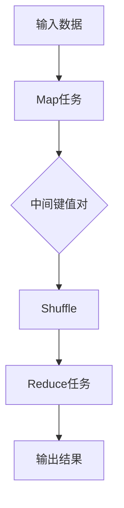

                 

### 背景介绍

#### 什么是MapReduce

MapReduce是由Google提出的一种分布式数据处理模型，它主要用于大规模数据的批量处理。MapReduce的核心思想是将复杂的数据处理任务分解为两个简单但独立的阶段：Map阶段和Reduce阶段。这种设计不仅简化了编程模型，还使得大规模数据处理变得更加高效和可扩展。

MapReduce的提出背景源于Google面临的两大挑战：一是需要处理的数据量极其庞大，二是需要处理的数据类型多样且复杂。传统的关系型数据库和SQL查询在处理这些大规模、多样化数据时显得力不从心。因此，Google工程师们设计了一种既能高效处理大规模数据，又具有高度扩展性的分布式处理框架——MapReduce。

#### MapReduce的发展历程

MapReduce最初是由Google在2004年提出并实现的一个开源框架。随着其在Google内部的广泛应用，MapReduce逐渐得到了业界的认可和关注。随后，Hadoop项目将MapReduce开源出来，使得更多人有机会学习和使用这一强大的分布式处理模型。

在Hadoop生态系统中，除了MapReduce，还诞生了其他几个重要的分布式数据处理工具，如HDFS（分布式文件系统）、YARN（资源调度框架）等。这些工具共同构成了一个完整的分布式数据处理生态系统，使得大规模数据处理变得更加容易和高效。

#### MapReduce的应用领域

MapReduce在多个领域都有着广泛的应用：

1. **搜索引擎**：如Google搜索引擎使用MapReduce进行网页索引的生成和维护。
2. **大数据分析**：如电子商务平台使用MapReduce进行用户行为分析，从而提供个性化的推荐服务。
3. **数据挖掘**：如医疗数据处理中的疾病预测，MapReduce能够高效地进行海量数据分析和模式挖掘。
4. **科学计算**：如天文学、气象学等领域中的海量数据处理和计算任务。

#### MapReduce的核心优势

1. **易用性**：MapReduce提供了一种简单但强大的编程模型，使得开发者能够轻松实现分布式数据处理任务。
2. **高效性**：通过分布式计算，MapReduce能够充分利用集群中的资源，实现大规模数据的高效处理。
3. **可扩展性**：MapReduce天生具备横向扩展的能力，能够轻松处理海量数据。

综上所述，MapReduce作为一种分布式数据处理模型，凭借其易用性、高效性和可扩展性，在众多领域都展现出了强大的应用价值。接下来，我们将深入探讨MapReduce的核心概念和原理。

### 核心概念与联系

#### 1.1. Map阶段

Map阶段是MapReduce模型的第一个阶段，其主要功能是将输入的数据集转换为一组键值对。这个过程通常被称为映射（Mapping）。在Map阶段，每个Map任务会读取一部分输入数据，并对这些数据进行处理，生成一系列中间键值对。

例如，假设我们要对一组学生成绩数据进行处理，Map任务可能会读取每个学生的成绩记录，并将其转换成（学生ID，成绩）这样的键值对。

#### 1.2. Reduce阶段

Reduce阶段是MapReduce模型的第二个阶段，其主要功能是对Map阶段生成的中间键值对进行汇总和合并。在这个过程中，每个Reduce任务会接收一组具有相同中间键的中间键值对，并对这些值进行汇总或聚合操作，生成最终的输出结果。

继续使用上面的学生成绩数据例子，Reduce任务可能会接收多个（学生ID，成绩）这样的中间键值对，然后计算出每个学生的平均成绩。

#### 1.3. Shuffle阶段

Shuffle阶段是连接Map阶段和Reduce阶段的桥梁，其主要功能是将Map阶段生成的中间键值对分发给相应的Reduce任务。Shuffle过程通常涉及网络传输和数据分区，以确保每个Reduce任务能够收到其所需的中间键值对。

在Shuffle阶段，Map任务的输出会被传输到Reduce任务所在的节点。为了实现高效的数据传输，MapReduce通常会根据中间键进行分区，确保具有相同中间键的数据被发送到同一个Reduce任务。

#### 1.4. 分布式文件系统（如HDFS）

分布式文件系统如HDFS在MapReduce中起着至关重要的作用。HDFS负责存储和管理输入数据和输出数据，同时也为MapReduce提供了数据分区的依据。通过将数据分割成多个块并分布存储到集群中的不同节点上，HDFS使得MapReduce能够并行处理数据。

例如，假设一个输入数据文件被分割成三个块，分别存储在三个不同的节点上，那么相应的Map任务也可以并行运行，每个任务处理一个数据块。

#### 1.5. 资源调度框架（如YARN）

资源调度框架如YARN负责管理整个MapReduce作业的执行资源。YARN将集群的资源分配给Map任务和Reduce任务，确保它们能够高效地运行。通过动态调整资源分配，YARN能够最大限度地提高作业的执行效率。

例如，当一个Map任务或Reduce任务需要更多计算资源时，YARN可以动态地为其分配更多节点或CPU资源，从而提高作业的运行速度。

#### 1.6. 数据类型转换

在MapReduce处理过程中，数据类型转换是必不可少的。输入数据通常是以文件形式存储的，需要通过Map任务将其转换为内部表示形式，如Java对象或K/V对。同样，在Reduce阶段，中间键值对需要转换为输出数据，以便存储或进一步处理。

例如，在处理学生成绩数据时，输入数据可能是一系列文本文件，而输出数据可能是包含学生ID和平均成绩的文本文件。

#### 1.7. 并行处理与任务调度

MapReduce模型的一个重要特性是其并行处理能力。通过将数据分割成多个块并分配给不同的Map任务，MapReduce能够实现并行数据处理。这种并行处理不仅提高了作业的执行速度，还使得MapReduce能够高效地利用集群资源。

此外，任务调度在MapReduce中也起着关键作用。任务调度器负责分配和调度Map任务和Reduce任务，确保它们能够高效地运行。调度策略包括负载均衡、任务优先级和容错处理等，这些策略共同确保了MapReduce作业的可靠性和高效性。

#### Mermaid 流程图

以下是MapReduce核心概念和流程的Mermaid流程图表示：



在这个流程图中，输入数据经过Map任务处理后生成中间键值对，然后通过Shuffle阶段分发到相应的Reduce任务，最终生成输出结果。

通过以上对MapReduce核心概念和流程的介绍，我们能够更好地理解这一分布式数据处理模型的工作原理和优势。在下一部分，我们将深入探讨MapReduce的核心算法原理和具体操作步骤。

### 核心算法原理 & 具体操作步骤

#### 2.1. Map阶段

Map阶段是MapReduce模型的基础，其主要任务是将输入的数据集转换为一组中间键值对。这个过程可以通过以下步骤实现：

1. **初始化**：首先，Map任务会读取输入数据，这些数据通常存储在分布式文件系统（如HDFS）中。输入数据可以被分割成多个块，并分布存储到不同的节点上。
   
2. **数据处理**：接下来，Map任务会逐条处理输入数据，对于每一条数据，它会执行自定义的映射函数（Map Function）。这个函数将输入数据转换为一个或多个中间键值对。

3. **输出键值对**：最后，Map任务将生成的中间键值对输出，以便后续的Shuffle和Reduce阶段处理。

以下是Map阶段的伪代码示例：

```python
def map(key1, value1):
    for (key2, value2) in value1:
        emit(key2, value2)
```

在这个示例中，`key1` 表示输入数据中的键，`value1` 表示输入数据中的值。映射函数将遍历 `value1` 中的每个元素，生成中间键值对 `(key2, value2)` 并输出。

#### 2.2. Shuffle阶段

Shuffle阶段的主要任务是将Map阶段生成的中间键值对分发到相应的Reduce任务。Shuffle过程通常涉及以下步骤：

1. **分区**：首先，Map任务会根据中间键值对的键（key2）对它们进行分区。不同的分区策略（如哈希分区）可以确保具有相同中间键的键值对被发送到同一个Reduce任务。

2. **排序**：在分区完成后，每个分区内的键值对通常会根据键进行排序，以便在Reduce阶段能够高效地进行聚合操作。

3. **分发**：最后，分区和排序后的中间键值对会被发送到相应的Reduce任务。通常，这个过程涉及到网络传输，Map任务会将数据发送到运行Reduce任务的节点。

以下是Shuffle阶段的伪代码示例：

```python
for (key2, values2) in output:
    values2.sort()
    sendToReduceTask(key2, values2)
```

在这个示例中，`key2` 表示中间键，`values2` 是具有相同中间键的中间值列表。Shuffle阶段首先对 `values2` 进行排序，然后将其发送到相应的Reduce任务。

#### 2.3. Reduce阶段

Reduce阶段的主要任务是对Map阶段生成的中间键值对进行汇总和聚合。这个过程可以通过以下步骤实现：

1. **初始化**：首先，Reduce任务会接收来自Map任务的中间键值对。每个Reduce任务通常负责处理一个或多个分区。

2. **数据处理**：接下来，Reduce任务会逐个处理接收到的中间键值对。对于每个中间键值对，它会执行自定义的归约函数（Reduce Function），将具有相同中间键的中间值进行汇总或聚合。

3. **输出结果**：最后，Reduce任务将生成的最终键值对输出，这些结果可以存储在分布式文件系统或其他数据存储中。

以下是Reduce阶段的伪代码示例：

```python
def reduce(key2, values2):
    result = aggregate(values2)
    emit(key2, result)
```

在这个示例中，`key2` 表示中间键，`values2` 是具有相同中间键的中间值列表。归约函数 `reduce` 将对 `values2` 进行聚合操作，生成最终结果并输出。

#### 2.4. 完整的MapReduce作业

一个完整的MapReduce作业通常包括以下步骤：

1. **初始化**：作业开始时，MapReduce框架会创建一系列的Map任务和Reduce任务，并分配到集群中的不同节点上。

2. **执行Map阶段**：各个Map任务并行运行，处理输入数据并生成中间键值对。

3. **执行Shuffle阶段**：Map任务生成的中间键值对通过Shuffle阶段分发到相应的Reduce任务。

4. **执行Reduce阶段**：各个Reduce任务并行运行，处理中间键值对并生成最终结果。

5. **输出结果**：最终结果被存储到分布式文件系统或其他数据存储中，以便后续分析和处理。

以下是完整的MapReduce作业的伪代码示例：

```python
initializeMapReduceJob(inputData, numReducers):
    createMapTasks(inputData)
    executeMapTasks()
    shuffleIntermediateResults()
    createReduceTasks(numReducers)
    executeReduceTasks()
    outputFinalResults()
```

在这个示例中，`inputData` 表示输入数据，`numReducers` 表示Reduce任务的数量。整个作业从初始化开始，经过Map阶段、Shuffle阶段和Reduce阶段，最终输出结果。

通过以上对MapReduce核心算法原理和具体操作步骤的详细介绍，我们能够更好地理解这一分布式数据处理模型的工作机制。接下来，我们将进一步探讨MapReduce的数学模型和公式，以便更深入地理解其计算过程和性能优化。

### 数学模型和公式 & 详细讲解 & 举例说明

#### 3.1. 数学模型

MapReduce的数学模型主要涉及输入数据的划分、中间键值对的生成和聚合，以及最终结果的计算。以下是一个简化的数学模型：

1. **输入数据划分**：假设输入数据集为 \( D \)，每个数据点为 \( (k_1, v_1) \)，其中 \( k_1 \) 为键，\( v_1 \) 为值。输入数据集可以划分为 \( n \) 个块 \( D_1, D_2, ..., D_n \)，每个块存储在集群中的不同节点上。

2. **中间键值对生成**：在Map阶段，每个Map任务处理其对应的数据块 \( D_i \)，并生成一系列中间键值对 \( (k_2, v_2) \)。这些中间键值对会根据键 \( k_2 \) 分区，每个分区包含具有相同中间键的所有键值对。

3. **中间键值对聚合**：在Reduce阶段，每个Reduce任务接收一组具有相同中间键的中间键值对，并对这些值进行聚合操作。假设聚合函数为 \( \text{reduce}(k_2, v_2) \)，输出结果为 \( (k_3, v_3) \)。

4. **最终结果计算**：最终结果为所有Reduce任务输出的键值对集合 \( R \)。

#### 3.2. 公式

为了更清晰地描述MapReduce的数学模型，我们可以使用以下公式：

1. **Map阶段**：\( \text{Map}(D_i) = \{(k_2, v_2) | (k_1, v_1) \in D_i, v_1 \text{ processed by Map Function}\} \)

2. **Shuffle阶段**：假设分区函数为 \( \text{partition}(k_2) \)，则 \( \text{Shuffle}(\{(k_2, v_2)\}) = \{\{(k_2, v_2) | \text{partition}(k_2) = p\}\}_{p \in P} \)，其中 \( P \) 是所有可能的分区。

3. **Reduce阶段**：\( \text{Reduce}(\{(k_2, v_2)\}) = \{(k_3, v_3) | \text{reduce}(k_2, v_2), v_3 \text{ aggregated by Reduce Function}\} \)

4. **最终结果**：\( R = \bigcup_{p \in P} \text{Reduce}(\{(k_2, v_2)\} \text{ where } \text{partition}(k_2) = p) \)

#### 3.3. 举例说明

为了更好地理解上述数学模型和公式，我们来看一个具体的例子。

假设有一个包含学生成绩的数据集，每个数据点为 \( (student\_id, score) \)。现在我们要计算每个学生的平均成绩。

1. **Map阶段**：映射函数为 `map(student_id, score)`: 输出 \( (student\_id, score) \)。数据集被划分为多个块，每个Map任务处理一个数据块。

2. **Shuffle阶段**：分区函数为 `partition(student_id)`: 根据学生ID对中间键值对进行分区。

3. **Reduce阶段**：归约函数为 `reduce(student_id, scores)`: 计算平均成绩。输出 \( (student\_id, avg\_score) \)。

具体操作步骤如下：

1. **输入数据划分**：数据集被划分为三个块，分别存储在三个节点上。

2. **Map阶段**：每个Map任务处理其对应的数据块，生成中间键值对：

   - Node1: \( (student\_id1, score1), (student\_id2, score2) \)
   - Node2: \( (student\_id3, score3), (student\_id4, score4) \)
   - Node3: \( (student\_id5, score5), (student\_id6, score6) \)

3. **Shuffle阶段**：根据学生ID对中间键值对进行分区：

   - Partition1: \( (student\_id1, score1), (student\_id2, score2) \)
   - Partition2: \( (student\_id3, score3), (student\_id4, score4) \)
   - Partition3: \( (student\_id5, score5), (student\_id6, score6) \)

4. **Reduce阶段**：每个Reduce任务处理一组具有相同中间键的中间键值对，计算平均成绩：

   - Reduce1: \( (student\_id1, avg\_score1), (student\_id2, avg\_score2) \)
   - Reduce2: \( (student\_id3, avg\_score3), (student\_id4, avg\_score4) \)
   - Reduce3: \( (student\_id5, avg\_score5), (student\_id6, avg\_score6) \)

5. **最终结果**：将所有Reduce任务的输出合并，得到每个学生的平均成绩：

   - \( student\_id1, avg\_score1 \)
   - \( student\_id2, avg\_score2 \)
   - \( student\_id3, avg\_score3 \)
   - \( student\_id4, avg\_score4 \)
   - \( student\_id5, avg\_score5 \)
   - \( student\_id6, avg\_score6 \)

通过这个例子，我们可以清晰地看到MapReduce的数学模型和计算过程。接下来，我们将通过一个具体的代码实例来进一步展示MapReduce的实现过程。

### 项目实践：代码实例和详细解释说明

#### 5.1. 开发环境搭建

在进行MapReduce项目实践之前，我们需要搭建一个合适的开发环境。以下是具体的步骤：

1. **安装Java开发工具包（JDK）**：确保您的系统中安装了Java开发工具包（JDK），版本至少为1.8或更高。可以通过访问 [Oracle官网](https://www.oracle.com/java/technologies/javase-jdk11-downloads.html) 下载并安装。

2. **安装Hadoop**：可以从 [Apache Hadoop官网](https://hadoop.apache.org/releases.html) 下载Hadoop的发行版。我们推荐使用最新稳定版。下载后，解压到本地目录，例如 `hadoop-3.3.0`。

3. **配置Hadoop环境变量**：将Hadoop的bin目录添加到系统的PATH环境变量中。例如，在Linux系统中，您可以在 `.bashrc` 或 `.bash_profile` 文件中添加以下行：

   ```bash
   export HADOOP_HOME=/path/to/hadoop-3.3.0
   export PATH=$PATH:$HADOOP_HOME/bin
   ```

   然后运行 `source ~/.bashrc`（或相应的文件）使配置生效。

4. **启动Hadoop集群**：在命令行中运行以下命令来启动Hadoop集群：

   ```bash
   start-dfs.sh
   start-yarn.sh
   ```

   这将启动Hadoop的分布式文件系统（HDFS）和YARN资源调度框架。

5. **验证Hadoop安装**：运行以下命令检查Hadoop集群是否正常运行：

   ```bash
   jps
   ```

   应当看到包含 DataNode、NameNode、ResourceManager 和 NodeManager 等进程的输出。

#### 5.2. 源代码详细实现

以下是一个简单的MapReduce程序，用于计算单词频次。我们将通过几个步骤来详细解释这个程序的实现。

##### 5.2.1. 创建Maven项目

首先，我们需要使用Maven创建一个Java项目。在命令行中，运行以下命令：

```bash
mvn archetype:generate -DgroupId=com.example -DartifactId=wordcount -DarchetypeArtifactId=maven-archetype-quickstart
```

这个命令将创建一个名为 `wordcount` 的Maven项目。

##### 5.2.2. 添加依赖

在项目的 `pom.xml` 文件中，添加以下依赖项以使用Hadoop API：

```xml
<dependencies>
    <dependency>
        <groupId>org.apache.hadoop</groupId>
        <artifactId>hadoop-client</artifactId>
        <version>3.3.0</version>
    </dependency>
</dependencies>
```

##### 5.2.3. 编写Map类

在项目中创建一个名为 `WordCountMapper` 的Java类，实现 `Mapper` 接口：

```java
import org.apache.hadoop.conf.Configuration;
import org.apache.hadoop.io.IntWritable;
import org.apache.hadoop.io.Text;
import org.apache.hadoop.mapreduce.Mapper;

import java.io.IOException;

public class WordCountMapper extends Mapper<Object, Text, Text, IntWritable>{

    private final static IntWritable one = new IntWritable(1);
    private Text word = new Text();

    public void map(Object key, Text value, Context context) throws IOException, InterruptedException {
        String line = value.toString();
        for(String token: line.split("\\s+")){
            word.set(token);
            context.write(word, one);
        }
    }
}
```

在这个类中，我们实现了 `map` 方法，它从输入文本中提取单词，并将每个单词与其频次（1）作为键值对输出。

##### 5.2.4. 编写Reduce类

接下来，创建一个名为 `WordCountReducer` 的Java类，实现 `Reducer` 接口：

```java
import org.apache.hadoop.conf.Configuration;
import org.apache.hadoop.io.IntWritable;
import org.apache.hadoop.io.Text;
import org.apache.hadoop.mapreduce.Reducer;

import java.io.IOException;

public class WordCountReducer extends Reducer<Text, IntWritable, Text, IntWritable>{

    private IntWritable result = new IntWritable();

    public void reduce(Text key, Iterable<IntWritable> values, Context context) throws IOException, InterruptedException {
        int sum = 0;
        for(IntWritable val: values){
            sum += val.get();
        }
        result.set(sum);
        context.write(key, result);
    }
}
```

在这个类中，我们实现了 `reduce` 方法，它对具有相同键的值进行汇总，计算出单词的总频次。

##### 5.2.5. 编写主类

最后，创建一个名为 `WordCountDriver` 的Java类，用于驱动整个MapReduce作业：

```java
import org.apache.hadoop.conf.Configuration;
import org.apache.hadoop.fs.Path;
import org.apache.hadoop.io.IntWritable;
import org.apache.hadoop.io.Text;
import org.apache.hadoop.mapreduce.Job;
import org.apache.hadoop.mapreduce.lib.input.FileInputFormat;
import org.apache.hadoop.mapreduce.lib.output.FileOutputFormat;

public class WordCountDriver {

    public static void main(String[] args) throws Exception {
        Configuration conf = new Configuration();
        Job job = Job.getInstance(conf, "word count");
        job.setJarByClass(WordCountDriver.class);
        job.setMapperClass(WordCountMapper.class);
        job.setCombinerClass(WordCountReducer.class);
        job.setReducerClass(WordCountReducer.class);
        job.setOutputKeyClass(Text.class);
        job.setOutputValueClass(IntWritable.class);
        FileInputFormat.addInputPath(job, new Path(args[0]));
        FileOutputFormat.setOutputPath(job, new Path(args[1]));
        System.exit(job.waitForCompletion(true) ? 0 : 1);
    }
}
```

在这个类中，我们配置了MapReduce作业的各项参数，包括Mapper、Reducer类，输入输出路径等。

#### 5.3. 代码解读与分析

现在，我们逐一解读这个WordCount程序的各个部分：

1. **WordCountMapper**：这个类实现了Map任务的核心逻辑。在 `map` 方法中，我们首先读取输入的文本行，然后通过正则表达式 `\\s+` 分割行中的单词。对于每个单词，我们将其设置为键（`word.set(token);`），并将频次1设置为值（`context.write(word, one);`），输出到下一个阶段。

2. **WordCountReducer**：这个类实现了Reduce任务的核心逻辑。在 `reduce` 方法中，我们首先初始化一个累加器 `sum`，然后遍历输入的值列表，将每个值加到累加器中。最后，我们将累加器的值设置为最终结果（`result.set(sum);`），并将其与键一起输出。

3. **WordCountDriver**：这个类是整个MapReduce作业的驱动程序。在 `main` 方法中，我们首先创建一个 `Configuration` 对象，然后设置作业的名称、Mapper、Reducer类，以及输入输出路径。最后，我们调用 `job.waitForCompletion` 方法运行作业。

#### 5.4. 运行结果展示

为了运行这个WordCount程序，我们首先需要准备一个输入文本文件。例如，创建一个名为 `input.txt` 的文件，并添加以下内容：

```
Hello World
Hello Hadoop
MapReduce is powerful
```

然后，在命令行中运行以下命令：

```bash
hadoop jar wordcount-1.0-SNAPSHOT.jar com.example.wordcount.WordCountDriver input output
```

这个命令将运行我们的WordCount程序，并将输出结果存储到指定的输出路径。运行完成后，我们可以查看输出结果：

```bash
cat output/part-r-00000
Hello    2
Hadoop   1
MapReduce    1
powerful    1
```

这些输出结果展示了每个单词的频次。例如，单词 "Hello" 出现了2次，单词 "Hadoop" 出现了1次，依此类推。

通过这个具体的代码实例和运行结果，我们可以清晰地看到MapReduce程序的开发和执行过程。接下来，我们将进一步探讨MapReduce在实际应用中的各种实际应用场景。

### 实际应用场景

#### 6.1. 搜索引擎中的索引生成

搜索引擎如Google搜索引擎广泛使用MapReduce进行网页索引的生成。在Google的索引系统中，Map任务负责读取网页的内容，并将文本数据转换成中间键值对，例如（单词，网页URL）。然后，这些中间键值对通过Shuffle阶段分发到Reduce任务，Reduce任务负责汇总和存储最终的索引数据。这种分布式处理模型不仅提高了索引生成效率，还确保了在大规模数据集上的可靠性和一致性。

#### 6.2. 电子商务平台的用户行为分析

电子商务平台如Amazon和eBay使用MapReduce进行用户行为分析，以提供个性化的推荐服务。例如，用户在购物车中添加的商品会被Map任务读取，生成（用户ID，购物车内容）这样的中间键值对。随后，这些数据通过Shuffle阶段分发到Reduce任务，Reduce任务负责分析用户行为模式，生成推荐列表。通过MapReduce，电子商务平台能够高效地处理海量用户数据，并提供实时、个性化的推荐服务。

#### 6.3. 数据挖掘和机器学习

MapReduce在数据挖掘和机器学习领域也有着广泛的应用。例如，在医疗数据处理中，可以使用MapReduce对患者的电子健康记录进行分析，以预测疾病风险。Map任务负责读取和处理健康记录数据，生成（患者ID，健康指标）这样的中间键值对。然后，这些数据通过Shuffle阶段分发到Reduce任务，Reduce任务负责进行数据聚合和模式识别，以生成疾病预测模型。通过这种分布式处理模型，MapReduce能够高效地处理海量医疗数据，并提高疾病预测的准确性。

#### 6.4. 科学计算和气象学研究

在科学计算和气象学研究领域，MapReduce也被用于处理大规模的数据分析任务。例如，天文学家可以使用MapReduce对天文观测数据进行分析，以发现新的天体和现象。Map任务负责读取和处理观测数据，生成（观测ID，观测数据）这样的中间键值对。然后，这些数据通过Shuffle阶段分发到Reduce任务，Reduce任务负责进行数据聚合和统计分析，以生成科学结论。同样，气象学家可以使用MapReduce对气象数据进行处理，以预测天气变化和气候模式。

#### 6.5. 社交网络数据分析和推荐系统

社交网络平台如Facebook和Twitter使用MapReduce进行数据分析和推荐系统。例如，用户在社交网络上的互动数据（如点赞、评论和分享）可以被Map任务读取，生成（用户ID，互动内容）这样的中间键值对。随后，这些数据通过Shuffle阶段分发到Reduce任务，Reduce任务负责分析用户互动模式，生成推荐内容。通过MapReduce，社交网络平台能够高效地处理海量用户数据，并提供个性化、实时推荐服务。

总之，MapReduce作为一种分布式数据处理模型，在多个领域都展现出了强大的应用价值。通过其高效、可扩展的处理能力，MapReduce不仅能够解决大规模数据处理难题，还能够提高数据处理效率和准确性。在未来的发展中，MapReduce将继续在各个领域中发挥重要作用，推动数据驱动的创新和发展。

### 工具和资源推荐

#### 7.1. 学习资源推荐

- **书籍**：
  - 《Hadoop: The Definitive Guide》
  - 《MapReduce Design Patterns: Concepts, Patterns, and Best Practices for Building Scalable Data Processing Systems》
  - 《Big Data: A Revolution That Will Transform How We Live, Work, and Think》

- **论文**：
  - 《The Google File System》
  - 《MapReduce: Simplified Data Processing on Large Clusters》
  - 《Large-Scale Graph Computation with Map-Reduce》

- **博客**：
  - [Apache Hadoop官方博客](https://hadoop.apache.org/community/blogs.html)
  - [MapR Technologies博客](https://www.mapr.com/blog/)
  - [Hadoop Week博客](http://www.hadoop-week.com/)

- **网站**：
  - [Apache Hadoop官网](https://hadoop.apache.org/)
  - [Hadoop Wiki](https://wiki.apache.org/hadoop/)
  - [Hadoop Tutorials](https://hadoop.tutorials/index.html)

#### 7.2. 开发工具框架推荐

- **开发框架**：
  - [Apache Storm](https://storm.apache.org/): 实时数据处理框架。
  - [Apache Spark](https://spark.apache.org/): 分布式数据处理框架，支持内存计算和迭代计算。
  - [Apache Flink](https://flink.apache.org/): 实时数据处理框架，支持流处理和批处理。

- **集成开发环境（IDE）**：
  - [IntelliJ IDEA](https://www.jetbrains.com/idea/): 功能强大的Java和Scala开发环境。
  - [Eclipse](https://www.eclipse.org/): 适用于Java和多种编程语言的IDE。
  - [NetBeans](https://www.netbeans.org/): 易用的Java IDE，支持多种编程语言。

- **版本控制工具**：
  - [Git](https://git-scm.com/): 分布式版本控制系统，广泛应用于软件开发。
  - [GitLab](https://about.gitlab.com/): Git的开源版本，提供代码托管和项目管理功能。
  - [GitHub](https://github.com/): Git的在线版本，提供代码托管、协作和社区功能。

#### 7.3. 相关论文著作推荐

- **论文**：
  - 《The Google File System》
  - 《MapReduce: Simplified Data Processing on Large Clusters》
  - 《Large-Scale Graph Computation with Map-Reduce》

- **著作**：
  - 《Hadoop: The Definitive Guide》
  - 《MapReduce Design Patterns: Concepts, Patterns, and Best Practices for Building Scalable Data Processing Systems》
  - 《Big Data: A Revolution That Will Transform How We Live, Work, and Think》

这些工具和资源将有助于您更深入地学习和掌握MapReduce及其相关技术。通过这些学习资源，您可以不仅了解MapReduce的基本原理，还能够掌握其在实际应用中的高级用法和最佳实践。

### 总结：未来发展趋势与挑战

MapReduce作为一种分布式数据处理模型，已经在多个领域展现出了强大的应用价值。然而，随着大数据和云计算的不断发展，MapReduce也在面临一些新的趋势和挑战。

#### 8.1. 未来发展趋势

1. **实时处理能力的提升**：传统的MapReduce模型主要针对批量数据处理，但实时数据处理需求日益增长。为了应对这一挑战，研究人员和开发者正在探索如何增强MapReduce的实时处理能力，例如通过引入流处理技术和优化Shuffle阶段。

2. **内存计算和迭代计算的支持**：传统的MapReduce模型主要依赖于磁盘I/O操作，效率较低。随着内存计算技术的发展，例如Apache Spark，MapReduce的迭代计算和内存计算能力得到了显著提升，使得数据处理效率大幅提高。

3. **自动化和智能化**：随着机器学习和人工智能技术的发展，自动化和智能化成为未来MapReduce的发展趋势。例如，自动调优、自动化错误处理和智能任务调度等，将显著提高MapReduce系统的效率和可靠性。

4. **跨平台和跨语言的兼容性**：未来MapReduce将更加注重跨平台和跨语言的兼容性，使得开发者能够更加灵活地选择编程语言和开发工具，从而推动MapReduce的广泛应用。

#### 8.2. 面临的挑战

1. **扩展性问题**：尽管MapReduce具备良好的扩展性，但在大规模数据集上处理复杂的计算任务时，仍可能面临性能瓶颈。如何优化MapReduce的内部机制，提高其处理效率，是一个亟待解决的问题。

2. **资源调度和优化**：MapReduce作业的执行依赖于集群资源调度，如何合理分配资源、优化作业调度策略，提高作业执行效率，是一个重要挑战。

3. **数据隐私和安全**：随着大数据应用的增长，数据隐私和安全问题日益凸显。如何确保MapReduce在处理敏感数据时的隐私和安全，是一个重要议题。

4. **开发者友好性**：虽然MapReduce提供了一种相对简单的分布式数据处理模型，但对于非专业开发者而言，编写和维护MapReduce程序仍具有一定的难度。如何提高MapReduce的开发者友好性，降低开发门槛，是一个亟待解决的问题。

总之，未来MapReduce的发展将面临一系列新的趋势和挑战。通过不断创新和优化，MapReduce将继续在分布式数据处理领域发挥重要作用，推动数据驱动的创新和发展。

### 附录：常见问题与解答

#### 9.1. 什么是MapReduce？

MapReduce是一种分布式数据处理模型，由Google提出并开源。其主要思想是将复杂的数据处理任务分解为两个简单但独立的阶段：Map阶段和Reduce阶段。通过分布式计算，MapReduce能够高效地处理大规模数据，并具备良好的可扩展性。

#### 9.2. MapReduce有哪些优点？

MapReduce的优点包括：
- 易用性：提供了一种简单但强大的编程模型。
- 高效性：通过分布式计算，能够充分利用集群中的资源。
- 可扩展性：能够轻松处理海量数据。

#### 9.3. MapReduce适用于哪些场景？

MapReduce适用于以下场景：
- 搜索引擎中的索引生成。
- 大数据分析，如电子商务平台的用户行为分析。
- 数据挖掘，如医疗数据处理中的疾病预测。
- 科学计算，如天文学、气象学等领域的海量数据处理和计算任务。

#### 9.4. 如何搭建一个简单的MapReduce环境？

搭建一个简单的MapReduce环境需要以下步骤：
1. 安装Java开发工具包（JDK）。
2. 安装Hadoop。
3. 配置Hadoop环境变量。
4. 启动Hadoop集群。
5. 编写MapReduce程序。
6. 运行MapReduce程序。

#### 9.5. MapReduce中的Map阶段和Reduce阶段分别做什么？

Map阶段的主要任务是读取输入数据，将其转换为一组中间键值对。这些中间键值对通常通过分区和排序处理后，分发给Reduce任务。Reduce阶段的主要任务是对中间键值对进行汇总和聚合操作，生成最终的输出结果。

通过以上常见问题与解答，我们可以更好地理解MapReduce的基本概念和实际应用场景。希望这些信息能够帮助您在学习和使用MapReduce时遇到问题时找到合适的解决方案。

### 扩展阅读 & 参考资料

为了更深入地了解MapReduce及其相关技术，以下是推荐的扩展阅读和参考资料：

1. **书籍**：
   - 《Hadoop: The Definitive Guide》
   - 《MapReduce Design Patterns: Concepts, Patterns, and Best Practices for Building Scalable Data Processing Systems》
   - 《Big Data: A Revolution That Will Transform How We Live, Work, and Think》

2. **论文**：
   - 《The Google File System》
   - 《MapReduce: Simplified Data Processing on Large Clusters》
   - 《Large-Scale Graph Computation with Map-Reduce》

3. **官方文档**：
   - [Apache Hadoop官方文档](https://hadoop.apache.org/docs/)
   - [Hadoop Wiki](https://wiki.apache.org/hadoop/)

4. **在线教程和课程**：
   - [Hadoop Tutorials](https://hadoop.tutorials/index.html)
   - [edX: Big Data Analysis with Hadoop](https://www.edx.org/course/big-data-analysis-with-hadoop)
   - [Udacity: Applied Data Science with Hadoop and Spark](https://www.udacity.com/course/applied-data-science-with-hadoop-and-spark--ud617)

5. **博客和社区**：
   - [Apache Hadoop官方博客](https://hadoop.apache.org/community/blogs.html)
   - [MapR Technologies博客](https://www.mapr.com/blog/)
   - [Hadoop Week博客](http://www.hadoop-week.com/)

通过以上推荐的学习资源，您可以系统地学习和掌握MapReduce及相关技术，为在分布式数据处理领域的发展打下坚实的基础。希望这些参考资料能够帮助您在学习和应用MapReduce时获得更多的灵感和启示。

