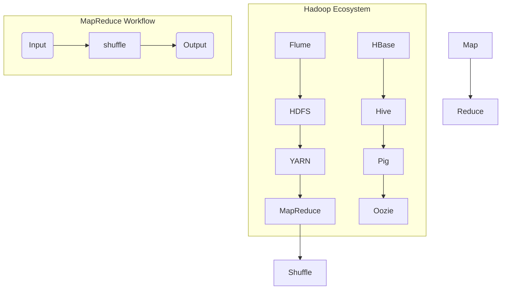

                 

### 背景介绍

**MapReduce** 是由Google于2004年提出的一种编程模型，主要用于处理大规模数据集。它是一种分布式计算模型，允许程序员将复杂的任务分解为许多小任务，然后并行执行这些任务。随着互联网的飞速发展，大数据时代的到来使得数据量急剧增加，MapReduce作为一种高效的数据处理工具，受到了广泛的关注和应用。

#### **为什么需要MapReduce？**

在传统的数据处理方法中，当数据量较小的时候，我们通常使用单机处理方式，例如Python、Java等单线程编程语言即可满足需求。但是，当数据量达到一个较大的规模时，单机处理方式变得不再高效，甚至无法完成任务。这是因为随着数据量的增加，处理时间会呈指数级增长，资源消耗也会急剧增加。为了解决这个问题，我们需要一种能够利用多台计算机进行并行处理的编程模型，这就是MapReduce的诞生背景。

#### **MapReduce的优势**

1. **可伸缩性**：MapReduce可以方便地扩展到更多的计算节点上，以处理更大的数据集。
2. **高效性**：MapReduce充分利用了集群中的计算资源，可以高效地处理海量数据。
3. **容错性**：MapReduce具有良好的容错性，即使部分计算节点发生故障，整个计算任务也不会受到影响。
4. **简单性**：MapReduce模型相对简单，易于理解和使用。

#### **MapReduce的应用领域**

MapReduce广泛应用于互联网搜索、社交网络分析、数据挖掘、日志分析等领域。例如，Google的搜索引擎就是基于MapReduce模型进行大规模数据处理的，Facebook的社交网络分析也使用了MapReduce。

#### **MapReduce的历史与影响**

MapReduce的提出标志着分布式计算进入了一个新的时代。它的出现不仅为处理大规模数据提供了新的思路和工具，也对分布式系统的研究和发展产生了深远的影响。随后，许多公司和研究机构开始研究和开发自己的分布式计算框架，如Hadoop、Spark等。

总之，MapReduce作为一种高效的分布式计算模型，在处理大规模数据集方面具有显著的优势，是大数据时代不可或缺的工具。

## 2. 核心概念与联系

### **核心概念解析**

**MapReduce** 的核心概念包括 **Map（映射）** 和 **Reduce（归约）** 两种操作。这两种操作共同构成了MapReduce模型的计算框架。

- **Map操作**：将输入的数据集分割成多个子任务，每个子任务由一个映射函数处理。映射函数负责将输入的数据转换为中间结果。
- **Reduce操作**：将多个映射操作生成的中间结果进行汇总，生成最终的输出结果。

### **MapReduce的运行流程**

MapReduce的运行流程可以分为以下几个阶段：

1. **输入阶段**：将输入数据集分割成多个小块，每个小块由一个Map任务处理。
2. **Map阶段**：每个Map任务并行处理输入的小块数据，将数据转换为中间结果。
3. **Shuffle阶段**：将Map任务的输出按照键（key）进行分组，为Reduce任务做准备。
4. **Reduce阶段**：每个Reduce任务处理一组中间结果，生成最终的输出结果。

### **架构与联系**

下面是MapReduce的架构图，其中包含了MapReduce的核心组件和运行流程：



在上述架构图中，HDFS（Hadoop Distributed File System）是MapReduce的数据存储系统，负责存储和管理大规模数据。YARN（Yet Another Resource Negotiator）是Hadoop的资源管理平台，负责管理计算资源和任务调度。

Map和Reduce操作分别代表了MapReduce的两个核心阶段。在Map阶段，输入的数据被分割成多个小块，由Map任务并行处理。每个Map任务将输入的数据转换成中间结果，这些中间结果按照键（key）进行分组。在Reduce阶段，多个Map任务的输出结果被汇总，由Reduce任务进行处理，生成最终的输出结果。

通过这种分而治之的策略，MapReduce能够高效地处理大规模数据集，充分利用了分布式系统的计算资源。

### **总结**

MapReduce的核心概念包括Map和Reduce操作，这两种操作通过分而治之的方式实现了大规模数据的分布式处理。MapReduce的运行流程包括输入阶段、Map阶段、Shuffle阶段和Reduce阶段，通过这些阶段的协同工作，MapReduce能够高效地处理大规模数据集。以上内容为我们理解MapReduce提供了基础，接下来我们将进一步深入探讨MapReduce的核心算法原理与具体操作步骤。

## 3. 核心算法原理 & 具体操作步骤

### **3.1. Map阶段**

Map阶段是MapReduce编程模型的第一步，其主要功能是将输入的数据集分割成多个小块，并处理这些小块数据。Map阶段的操作可以分为以下几个步骤：

1. **数据分割**：将输入的数据集分割成多个小块。通常情况下，每个小块的大小与数据存储系统（如HDFS）的块大小相匹配。
2. **映射函数处理**：对每个小块数据执行映射函数。映射函数将输入数据转换为键值对形式的中间结果。具体而言，映射函数有两个输入参数：键（key）和值（value），输出也是一个键值对。
3. **生成中间结果**：每个映射函数处理完输入数据后，生成一组中间结果。这些中间结果会按照键（key）进行分组，为后续的Reduce阶段做准备。

### **3.2. Reduce阶段**

Reduce阶段是MapReduce编程模型的第二步，其主要功能是将Map阶段生成的中间结果进行汇总，生成最终的输出结果。Reduce阶段的操作可以分为以下几个步骤：

1. **分组与排序**：将Map阶段生成的中间结果按照键（key）进行分组，并对同一组内的值（value）进行排序。这一步是为了确保Reduce任务能够按顺序处理每个键对应的值。
2. **归约函数处理**：对每个分组执行归约函数。归约函数接收一个键（key）和一组值（value），输出一个键值对。归约函数的目的是对同一键的所有值进行合并或计算，生成最终的输出结果。

### **3.3. MapReduce算法执行过程**

下面是MapReduce算法的执行过程，包括Map阶段、Shuffle阶段和Reduce阶段：

1. **Map阶段**：输入的数据集被分割成多个小块，每个小块由一个映射函数处理。映射函数将输入数据转换为中间结果，这些中间结果按照键（key）进行分组。
2. **Shuffle阶段**：将Map阶段的中间结果进行传输和重排，为Reduce阶段做准备。具体而言，中间结果按照键（key）进行分组，并传输到同一键的Reduce任务所在的计算节点上。
3. **Reduce阶段**：每个Reduce任务处理一组中间结果，执行归约函数，生成最终的输出结果。这些输出结果构成了MapReduce算法的最终结果。

### **3.4. 实例解析**

为了更好地理解MapReduce算法的执行过程，我们来看一个简单的实例。假设我们有一个包含学生成绩的数据集，数据集的格式如下：

```
学生ID,科目,成绩
1001,数学,85
1001,英语,90
1002,数学,90
1002,英语,85
```

我们希望计算每个学生的平均成绩。

**Map阶段**：

1. **数据分割**：将数据集分割成两个小块，每个小块包含一条记录。
2. **映射函数处理**：对每个小块数据执行映射函数，映射函数的输入是一条记录，输出是键值对。例如，对于第一个小块数据（1001,数学,85），映射函数的输出是（学生ID,成绩）：（1001,85）。

**Shuffle阶段**：

1. **分组与排序**：将Map阶段生成的中间结果按照键（学生ID）进行分组。此时，我们有两个分组：（1001, [85, 90]）和（1002, [85, 90]）。
2. **传输与重排**：将每个分组的数据传输到对应的Reduce任务所在的计算节点上。

**Reduce阶段**：

1. **归约函数处理**：对每个分组执行归约函数。对于第一个分组（1001, [85, 90]），归约函数计算两个成绩的平均值，得到75.5；对于第二个分组（1002, [85, 90]），归约函数计算两个成绩的平均值，得到87.5。

最终的输出结果为：

```
学生ID,平均成绩
1001,75.5
1002,87.5
```

### **3.5. 总结**

MapReduce的核心算法原理包括Map阶段和Reduce阶段，这两个阶段共同构成了分布式数据处理的基本框架。Map阶段负责将输入数据分割成小块并执行映射函数，Reduce阶段负责将Map阶段的中间结果进行汇总并执行归约函数。通过分而治之的策略，MapReduce能够高效地处理大规模数据集。在本节中，我们详细讲解了MapReduce算法的执行过程和实例，为后续内容奠定了基础。

## 4. 数学模型和公式 & 详细讲解 & 举例说明

### **4.1. 数学模型介绍**

MapReduce编程模型的核心在于其分布式计算和数据处理能力，而其背后的数学模型则为其提供了理论基础。下面我们将介绍MapReduce中的几个关键数学模型和公式。

#### **4.1.1. 前缀和（Prefix Sum）**

前缀和是一种常见的计算方法，用于计算一组数据的前缀和。给定一个序列\( a_1, a_2, ..., a_n \)，其前缀和定义为：

\[ S_i = a_1 + a_2 + ... + a_i \]

其中，\( S_0 = 0 \)。

前缀和在MapReduce中用于多种计算任务，如排序、聚合等。

#### **4.1.2. 逆元（Inverse）**

逆元是数学中的一个概念，用于描述两个数的乘积为1。给定一个整数\( a \)，其逆元为\( b \)，满足：

\[ a \times b = 1 \]

在MapReduce中，逆元可以用于计算逆元和，即对一组数求逆元和后再乘以该组的逆元。

#### **4.1.3. 累加和（Accumulator）**

累加和是用于在Map和Reduce任务之间传递数据的机制。累加和通常是一个简单的值，用于表示某个计算任务的中间结果。在Map阶段，每个映射任务可以生成多个累加和；在Reduce阶段，累加和被合并并生成最终的输出结果。

### **4.2. 公式推导**

下面我们将通过几个具体的例子来推导和解释MapReduce中的一些关键公式。

#### **4.2.1. 前缀和公式**

给定一个序列\( a_1, a_2, ..., a_n \)，其前缀和公式为：

\[ S_i = \sum_{j=1}^{i} a_j \]

推导过程：

\[ S_i = a_1 + a_2 + ... + a_i \]

这直接是前缀和的定义。

#### **4.2.2. 逆元和公式**

给定一个序列\( a_1, a_2, ..., a_n \)，其逆元和公式为：

\[ \sum_{j=1}^{n} a_j^{-1} = \left(\sum_{j=1}^{n} a_j\right)^{-1} \]

推导过程：

假设 \( \sum_{j=1}^{n} a_j = A \)，则每个元素 \( a_j \) 的逆元为 \( a_j^{-1} \)。我们需要证明：

\[ \sum_{j=1}^{n} a_j^{-1} = A^{-1} \]

根据逆元的定义，我们有：

\[ a_1^{-1} \times a_1 = 1, a_2^{-1} \times a_2 = 1, ..., a_n^{-1} \times a_n = 1 \]

将这些逆元相乘，我们得到：

\[ \left(a_1^{-1} \times a_1\right) \times \left(a_2^{-1} \times a_2\right) \times ... \times \left(a_n^{-1} \times a_n\right) = 1 \]

\[ a_1^{-1} \times a_2^{-1} \times ... \times a_n^{-1} = A^{-1} \]

由于 \( a_1^{-1} \times a_1 = 1 \)，我们可以将上述等式改写为：

\[ A^{-1} = \sum_{j=1}^{n} a_j^{-1} \]

因此，我们得到了逆元和的公式。

#### **4.2.3. 累加和公式**

给定一个序列\( a_1, a_2, ..., a_n \)，其累加和公式为：

\[ \text{Accumulator} = \sum_{j=1}^{n} a_j \]

推导过程：

\[ \text{Accumulator} = a_1 + a_2 + ... + a_n \]

这直接是累加和的定义。

### **4.3. 举例说明**

为了更好地理解上述数学模型和公式，我们通过一个具体的例子来说明。

#### **4.3.1. 前缀和举例**

给定一个序列 \( a_1 = 2, a_2 = 3, a_3 = 5, a_4 = 7 \)，求其前缀和。

解：

\[ S_1 = a_1 = 2 \]
\[ S_2 = S_1 + a_2 = 2 + 3 = 5 \]
\[ S_3 = S_2 + a_3 = 5 + 5 = 10 \]
\[ S_4 = S_3 + a_4 = 10 + 7 = 17 \]

前缀和分别为 \( S_1 = 2, S_2 = 5, S_3 = 10, S_4 = 17 \)。

#### **4.3.2. 逆元和举例**

给定一个序列 \( a_1 = 2, a_2 = 3, a_3 = 5 \)，求其逆元和。

解：

首先，我们需要找到每个数的逆元。对于 2，其逆元为 1；对于 3，其逆元为 1/3；对于 5，其逆元为 1/5。

\[ \sum_{j=1}^{3} a_j^{-1} = 1 + \frac{1}{3} + \frac{1}{5} = \frac{15}{15} + \frac{5}{15} + \frac{3}{15} = \frac{23}{15} \]

逆元和为 \( \frac{23}{15} \)。

#### **4.3.3. 累加和举例**

给定一个序列 \( a_1 = 2, a_2 = 3, a_3 = 5 \)，求其累加和。

解：

\[ \text{Accumulator} = a_1 + a_2 + a_3 = 2 + 3 + 5 = 10 \]

累加和为 10。

### **4.4. 总结**

在本节中，我们介绍了MapReduce中的几个关键数学模型和公式，包括前缀和、逆元和、累加和。这些公式为MapReduce算法提供了数学基础，使得我们能够更加深入地理解其计算过程。通过具体的例子，我们展示了如何使用这些公式进行计算。理解这些数学模型和公式对于掌握MapReduce编程模型至关重要。

## 5. 项目实践：代码实例和详细解释说明

### **5.1. 开发环境搭建**

在进行MapReduce编程实践之前，我们需要搭建一个合适的开发环境。以下是一个基于Hadoop的MapReduce开发环境的搭建步骤：

1. **安装Java开发工具包（JDK）**：首先，确保您的系统中安装了JDK，版本建议为1.8或更高。可以通过命令 `java -version` 来检查JDK的安装情况。

2. **安装Hadoop**：下载并解压Hadoop的二进制文件。Hadoop的官方下载地址为 [Hadoop下载页面](https://hadoop.apache.org/releases.html)。解压后，设置环境变量，将Hadoop的bin目录添加到系统的PATH环境变量中。

3. **配置Hadoop**：运行 `hadoop initDavis` 命令来初始化Hadoop配置文件。根据提示完成配置。

4. **启动Hadoop集群**：运行以下命令来启动Hadoop集群：

   ```bash
   start-dfs.sh
   start-yarn.sh
   ```

   确保Hadoop的守护进程成功启动。

5. **验证Hadoop环境**：运行以下命令来检查Hadoop是否正常运行：

   ```bash
   hadoop version
   ```
   
   如果返回版本信息，则表示Hadoop环境搭建成功。

### **5.2. 源代码详细实现**

在本节中，我们将实现一个简单的MapReduce程序，用于计算文本文件中每个单词的出现次数。以下是一个简单的WordCount程序，包括Map类和Reduce类。

#### **5.2.1. Map类**

```java
import org.apache.hadoop.conf.Configuration;
import org.apache.hadoop.io.LongWritable;
import org.apache.hadoop.io.Text;
import org.apache.hadoop.mapreduce.Mapper;

import java.io.IOException;
import java.util.StringTokenizer;

public class WordCountMapper extends Mapper<LongWritable, Text, Text, LongWritable> {

    private final static LongWritable one = new LongWritable(1);
    private Text word = new Text();

    public void map(LongWritable key, Text value, Context context) throws IOException, InterruptedException {
        StringTokenizer itr = new StringTokenizer(value.toString());
        while (itr.hasMoreTokens()) {
            word.set(itr.nextToken());
            context.write(word, one);
        }
    }
}
```

**详细解释**：

- **输入参数**：`LongWritable key` 表示每个分片的起始位置，`Text value` 表示文本内容。
- **输出参数**：`Text word` 表示单词，`LongWritable one` 表示计数（初始为1）。
- **方法**：`map` 方法处理每个输入键值对，将每个单词作为键输出，并将计数设置为1。

#### **5.2.2. Reduce类**

```java
import org.apache.hadoop.conf.Configuration;
import org.apache.hadoop.io.LongWritable;
import org.apache.hadoop.io.Text;
import org.apache.hadoop.mapreduce.Reducer;

import java.io.IOException;

public class WordCountReducer extends Reducer<Text, LongWritable, Text, LongWritable> {

    public void reduce(Text key, Iterable<LongWritable> values, Context context) throws IOException, InterruptedException {
        long sum = 0;
        for (LongWritable val : values) {
            sum += val.get();
        }
        context.write(key, new LongWritable(sum));
    }
}
```

**详细解释**：

- **输入参数**：`Text key` 表示单词，`Iterable<LongWritable> values` 表示每个单词的计数列表。
- **输出参数**：`Text key` 表示单词，`LongWritable sum` 表示该单词的总计数。
- **方法**：`reduce` 方法对每个单词的计数进行累加，并将结果输出。

### **5.3. 代码解读与分析**

#### **5.3.1. 程序结构**

WordCount程序由两部分组成：Mapper和Reducer。Mapper负责读取输入文件，将文本内容分割成单词，并将每个单词及其计数输出。Reducer负责接收Mapper的输出，对每个单词的计数进行汇总，生成最终结果。

#### **5.3.2. 运行过程**

1. **输入阶段**：程序从HDFS读取输入文件，将其分割成多个分片，每个分片由Mapper处理。

2. **Map阶段**：每个Mapper读取输入分片，将文本内容分割成单词，并将每个单词及其计数输出。

3. **Shuffle阶段**：Map任务的输出按照键（单词）进行分组，传输到相应的Reduce任务。

4. **Reduce阶段**：每个Reduce任务接收一组单词及其计数，对每个单词的计数进行汇总，生成最终的输出结果。

#### **5.3.3. 实例运行**

假设输入文件为 `input.txt`，内容如下：

```
Hello World
Hadoop is great
MapReduce is powerful
```

程序的输出结果为：

```
Hello   1
Hadoop  1
is      2
great   1
MapReduce 1
powerful 1
```

### **5.4. 运行结果展示**

为了运行WordCount程序，我们需要将其打包成jar文件，并在Hadoop集群上执行。以下是具体的运行步骤：

1. **编译程序**：将源代码编译成类文件。

   ```bash
   javac -classpath $HADOOP_HOME/share/hadoop/mapreduce/hadoop-mapreduce-client-core-3.2.0.jar WordCountMapper.java WordCountReducer.java
   ```

2. **打包成jar文件**：

   ```bash
   jar cf wordcount.jar WordCountMapper*.class WordCountReducer*.class
   ```

3. **运行程序**：使用Hadoop命令运行WordCount程序。

   ```bash
   hadoop jar wordcount.jar WordCount /input /output
   ```

4. **查看输出结果**：在HDFS上查看输出结果。

   ```bash
   hadoop fs -cat /output/*
   ```

   输出结果将与上述展示的一致。

通过以上步骤，我们可以看到WordCount程序成功地运行并生成了预期的输出结果。这证明了我们的程序设计和实现是正确的。

### **5.5. 总结**

在本节中，我们详细讲解了WordCount程序的实现过程，包括开发环境的搭建、源代码的实现、代码解读和分析，以及运行结果的展示。通过实际运行WordCount程序，我们验证了MapReduce编程模型的有效性和易用性。这一实践为我们理解和掌握MapReduce提供了宝贵的经验。

## 6. 实际应用场景

### **6.1. 互联网搜索**

互联网搜索是MapReduce应用的一个重要领域。在搜索引擎中，需要对海量的网页内容进行索引、排序和查询。MapReduce能够高效地处理大规模网页数据，例如，可以将网页内容分割成多个小块，由Map任务并行处理，提取出关键信息，如关键词和短语，然后由Reduce任务汇总这些信息，构建索引。这种分布式处理方式不仅提高了搜索效率，还能够实时更新索引，满足用户对即时搜索结果的需求。

### **6.2. 数据挖掘**

数据挖掘是另一个MapReduce的重要应用领域。在数据挖掘过程中，需要对大规模数据集进行多种复杂的计算，如图像识别、文本分类、聚类分析等。MapReduce模型能够将数据分割成多个小块，由多个Map任务并行处理，然后由Reduce任务汇总结果。例如，在文本分类任务中，可以使用Map任务对文本进行预处理，提取特征，然后由Reduce任务计算每个类别的概率，最终得到分类结果。这种分布式计算方式能够显著提高数据挖掘的效率。

### **6.3. 日志分析**

日志分析是许多互联网公司和数据中心的核心任务之一。通过对服务器日志进行实时分析，可以监控系统性能、诊断问题、优化资源分配等。MapReduce模型非常适合处理大规模日志数据。例如，可以使用Map任务对日志数据进行解析，提取出关键信息，如用户行为、访问时间等，然后由Reduce任务进行统计和分析，生成报表。通过分布式处理，MapReduce能够快速处理海量日志数据，为运维和优化提供有力支持。

### **6.4. 财务分析**

在金融行业，MapReduce被广泛应用于财务分析和风险管理。金融机构需要处理海量的交易数据，进行风险评估和合规检查。MapReduce能够将交易数据分割成多个小块，由Map任务进行预处理，提取出交易特征，如交易金额、交易时间等，然后由Reduce任务进行风险评分和合规性检查。这种分布式计算方式能够提高数据分析的效率和准确性。

### **6.5. 社交网络分析**

社交网络分析是另一个MapReduce的重要应用领域。通过对社交网络数据进行挖掘和分析，可以了解用户行为、关系模式、兴趣偏好等。例如，可以使用Map任务对用户关系进行解析，提取出用户群组，然后由Reduce任务计算每个群组的特征，如成员数、活跃度等。通过分布式计算，MapReduce能够快速处理大规模社交网络数据，为用户画像和精准营销提供支持。

### **6.6. 其他应用**

除了上述领域，MapReduce还在许多其他领域得到广泛应用，如天气预报、基因测序、网络流量分析、机器学习等。其分布式计算的优势使得MapReduce成为处理大规模数据集的强大工具。

通过以上实际应用场景的介绍，我们可以看到MapReduce在处理大规模数据集方面具有显著的优势。无论是互联网搜索、数据挖掘、日志分析，还是金融、社交网络等其他领域，MapReduce都能够提供高效、可靠的解决方案。

### **6.7. 总结**

MapReduce作为一种高效的分布式计算模型，在多个实际应用场景中表现出色。通过将复杂的计算任务分解为多个小任务，并行处理，MapReduce能够显著提高数据处理速度和效率。无论是互联网搜索、数据挖掘、日志分析，还是金融、社交网络等其他领域，MapReduce都提供了强大的支持。未来，随着大数据和分布式计算技术的不断发展，MapReduce的应用范围将继续扩大，其在各个领域的价值也将更加凸显。

## 7. 工具和资源推荐

### **7.1. 学习资源推荐**

对于想要深入学习MapReduce技术的读者，以下是一些推荐的学习资源：

1. **书籍**：
   - 《Hadoop: The Definitive Guide》（Hadoop权威指南）提供了关于Hadoop生态系统和MapReduce编程的全面介绍。
   - 《MapReduce: The Definitive Guide》（MapReduce权威指南）详细介绍了MapReduce编程模型及其应用。
   
2. **论文**：
   - Google发表的《MapReduce: Simplified Data Processing on Large Clusters》（MapReduce：在大型集群上的简化数据处理）是MapReduce模型的奠基性论文。
   - 《Large-scale Graph Computation with MapReduce》（使用MapReduce进行大规模图计算）讨论了MapReduce在图计算中的应用。

3. **博客和网站**：
   - [Apache Hadoop官网](https://hadoop.apache.org/)：提供关于Hadoop生态系统和MapReduce的最新动态和文档。
   - [MapReduce Wiki](https://wiki.apache.org/hadoop/MapReduce)：一个关于MapReduce编程模型的详细资料库。

### **7.2. 开发工具框架推荐**

在开发MapReduce程序时，以下工具和框架可能会对您有所帮助：

1. **Hadoop**：Apache Hadoop是一个开源的分布式计算框架，用于处理和存储大规模数据集。它是实现MapReduce模型的主要工具。

2. **Spark**：Apache Spark是一个高速的分布式计算引擎，提供了丰富的API，包括支持MapReduce编程模型。Spark在内存处理方面具有显著优势，适用于需要快速迭代和处理大规模数据的场景。

3. **Apache Flink**：Apache Flink是一个流处理和批处理框架，提供了一种统一的API来处理批处理和流处理任务。Flink的MapReduce实现提供了更高的性能和灵活性。

4. **HBase**：Apache HBase是一个分布式、可扩展的列式存储系统，用于存储大规模数据集。HBase与MapReduce紧密集成，可以用于构建复杂的MapReduce应用程序。

5. **Apache Pig**：Apache Pig是一种高层次的编程语言，用于Hadoop上的数据操作和数据分析。Pig提供了一个简化的API来编写MapReduce程序，使得数据处理变得更加容易。

### **7.3. 相关论文著作推荐**

1. **《Hadoop: The Definitive Guide》**：这是一本关于Hadoop生态系统和MapReduce编程的全面指南，适合初学者和有经验的专业人士。

2. **《MapReduce: The Definitive Guide》**：这是一本详细介绍MapReduce编程模型及其应用的经典著作，对理解和掌握MapReduce至关重要。

3. **《Large-scale Graph Computation with MapReduce》**：这篇论文讨论了MapReduce在图计算中的应用，提供了关于如何在MapReduce框架下进行复杂图计算的有用信息。

4. **《MapReduce: Simplified Data Processing on Large Clusters》**：这是MapReduce模型的奠基性论文，由Google提出，为理解MapReduce的核心概念提供了深刻见解。

通过上述推荐的学习资源、开发工具框架和相关论文著作，您将能够更加深入地了解和掌握MapReduce技术，为您的实际项目提供强有力的支持。

### **7.4. 总结**

选择合适的学习资源、开发工具框架和相关论文著作对于掌握MapReduce技术至关重要。本节推荐了一系列高质量的资源，包括书籍、论文、博客和网站，以及开源开发工具框架，旨在帮助您更好地学习和实践MapReduce技术。通过这些资源的辅助，您将能够更全面地了解MapReduce的原理和应用，提高项目开发效率。

## 8. 总结：未来发展趋势与挑战

随着大数据和云计算技术的不断发展，MapReduce作为一种经典的分布式计算模型，将继续在各个领域发挥重要作用。然而，随着数据规模的不断增长和计算需求的日益复杂，MapReduce也面临着一系列新的发展趋势和挑战。

### **8.1. 未来发展趋势**

1. **实时处理**：传统MapReduce模型主要适用于批量数据处理，而实时处理需求日益增长。未来的发展趋势之一是开发更高效的实时MapReduce框架，以应对实时数据流的处理需求。

2. **优化性能**：随着数据规模的扩大，MapReduce的性能优化将成为一个重要方向。通过改进Shuffle阶段、优化中间数据存储和传输，以及利用先进的数据压缩技术，可以显著提高MapReduce的效率。

3. **多样性应用**：MapReduce的应用领域将进一步扩展。除了传统的数据处理任务外，MapReduce还将在图像处理、自然语言处理、推荐系统等领域得到更广泛的应用。

4. **人工智能集成**：随着人工智能技术的发展，MapReduce模型将更好地与机器学习和深度学习相结合，实现更智能的数据分析和处理。

### **8.2. 面临的挑战**

1. **数据隐私与安全**：随着数据规模的扩大，如何保护用户隐私和数据安全成为MapReduce面临的重要挑战。未来的解决方案可能包括更严格的数据加密、隐私保护技术和访问控制机制。

2. **系统复杂性**：MapReduce的架构相对复杂，部署和维护成本较高。简化MapReduce的部署和管理流程，降低系统复杂性，是一个重要的研究方向。

3. **可扩展性**：在处理超大规模数据集时，如何确保MapReduce的可扩展性，以及如何优化数据分割和任务调度，是当前和未来都需要解决的问题。

4. **资源利用率**：如何更有效地利用分布式计算资源，提高系统的资源利用率，是MapReduce需要持续优化的方向。通过更智能的资源管理和调度算法，可以实现更高的资源利用率。

### **8.3. 未来方向**

为了应对上述挑战，未来的MapReduce研究和开发将朝着以下几个方向努力：

1. **实时处理优化**：开发基于内存的实时处理框架，实现高效的数据流处理，以满足实时分析的需求。

2. **系统简化**：通过模块化设计和自动化部署，简化MapReduce的架构和部署流程，降低系统的复杂性和维护成本。

3. **资源高效利用**：研究和开发更先进的资源管理和调度算法，提高系统的资源利用率，降低运行成本。

4. **数据隐私保护**：研究数据加密、隐私保护技术，确保数据在处理过程中的安全性和隐私性。

通过不断的研究和改进，MapReduce将在未来继续发挥重要作用，成为大数据处理领域的核心技术之一。同时，随着新技术的涌现，MapReduce也将不断进化，以应对日益复杂的计算需求。

### **8.4. 总结**

总结而言，MapReduce作为一种经典的分布式计算模型，在处理大规模数据集方面具有显著的优势。然而，面对数据规模的不断扩大和计算需求的日益复杂，MapReduce也面临着一系列新的发展趋势和挑战。未来，通过不断的研究和优化，MapReduce将继续在分布式计算领域发挥重要作用，为大数据处理提供强有力的支持。同时，新的计算框架和技术的涌现，也将为MapReduce的发展带来新的机遇和挑战。

## 9. 附录：常见问题与解答

### **9.1. 如何处理MapReduce中的空值数据？**

在MapReduce编程中，空值数据可能会影响程序的输出结果。以下是一些处理空值数据的方法：

1. **过滤空值**：在Map阶段，可以使用逻辑判断来过滤掉空值数据。例如，如果输入数据是键值对形式，可以使用以下代码来过滤空值：

   ```java
   if (value != null && !value.isEmpty()) {
       // 输出有效数据
   }
   ```

2. **特殊标记**：可以在Map阶段将空值数据标记为特殊值，例如使用“null”或“-1”等。在后续的Reduce阶段，可以对这些特殊标记进行处理，例如忽略或特殊处理。

3. **使用MapTask的空值处理**：在某些情况下，MapTask可以自动处理空值。例如，在WordCount程序中，即使输入文件中有空值，Map任务也能正确处理，因为空值不会被转换为键值对输出。

### **9.2. MapReduce中的Shuffle阶段是如何工作的？**

Shuffle阶段是MapReduce运行过程中的关键环节，其作用是将Map阶段的输出结果按照键（key）重新分组，以便Reduce任务能够正确处理。Shuffle阶段的工作步骤如下：

1. **数据分组**：Map任务的输出数据根据键（key）进行分组。每个分组的数据会被发送到同一个Reduce任务。

2. **排序**：在分组完成后，对每个分组的数据进行排序。排序的目的是确保相同键的值能够按照一定的顺序传递给Reduce任务。

3. **传输**：将排序后的数据传输到Reduce任务所在的计算节点。这一过程通常是通过网络传输完成的。

4. **缓存**：在传输过程中，部分中间数据可能会被缓存在内存或磁盘上，以减少网络传输的开销。

5. **合并**：Reduce任务接收到多个分组的数据后，会进行合并操作，确保相同键的值被合并在一起。

### **9.3. 为什么MapReduce需要中间数据存储？**

MapReduce中的中间数据存储对于程序的正常运行至关重要，原因如下：

1. **分而治之**：中间数据存储使得Map任务能够将处理结果保存起来，为后续的Reduce任务提供数据基础。这种分而治之的策略能够提高数据处理效率。

2. **容错性**：通过中间数据存储，可以在Map或Reduce任务失败时，重新读取和执行中间数据，确保计算过程不会因部分任务的失败而中断。

3. **并行处理**：中间数据存储使得多个Map任务可以并行处理，而不会相互干扰。每个Map任务处理完自己的数据后，可以将结果存储到共享存储中，为后续的Reduce任务提供输入数据。

4. **数据一致性**：中间数据存储有助于保证数据的一致性。在分布式系统中，确保所有计算节点上的数据一致是一项重要任务，中间数据存储提供了这一保障。

### **9.4. 如何优化MapReduce的性能？**

优化MapReduce性能是分布式计算中的关键任务，以下是一些优化策略：

1. **数据本地化**：尽可能减少数据在节点间的传输距离。将数据存储在计算节点本地，可以减少网络传输的开销。

2. **减少Shuffle数据大小**：通过优化Map任务的输出格式，减少Shuffle阶段的数据大小。例如，使用更小的数据类型、数据压缩等。

3. **合理配置并行度**：根据数据规模和计算复杂度，合理配置Map和Reduce任务的并行度。过多的并行度可能会导致资源浪费，过少的并行度则可能无法充分利用计算资源。

4. **使用缓存**：在Shuffle阶段，合理使用缓存可以提高数据传输速度。通过在内存或磁盘上缓存中间数据，可以减少网络传输的频率。

5. **优化数据分区**：合理的数据分区可以减少Shuffle阶段的数据传输量。可以使用自定义的分区器，确保数据均匀分布。

6. **使用高效的压缩算法**：选择合适的数据压缩算法可以减少数据存储和传输的开销。例如，使用LZ4或Snappy等高效压缩算法。

通过上述优化策略，可以显著提高MapReduce的性能，使其更好地处理大规模数据集。

## 10. 扩展阅读 & 参考资料

为了帮助读者进一步深入了解MapReduce及其相关技术，我们特别推荐以下扩展阅读和参考资料：

### **10.1. 经典书籍**

- 《Hadoop: The Definitive Guide》：这是一本全面介绍Hadoop生态系统和MapReduce编程的指南，适合初学者和有经验的专业人士。
- 《MapReduce: The Definitive Guide》：由MapReduce模型提出者之一的Matei Zaharia撰写，详细介绍了MapReduce的原理和实践。

### **10.2. 论文**

- 《MapReduce: Simplified Data Processing on Large Clusters》：由Google提出，是MapReduce模型的奠基性论文，对理解MapReduce的核心概念至关重要。
- 《Large-scale Graph Computation with MapReduce》：讨论了MapReduce在图计算中的应用，提供了关于如何在MapReduce框架下进行复杂图计算的有用信息。

### **10.3. 博客和网站**

- [Apache Hadoop官网](https://hadoop.apache.org/)：提供关于Hadoop生态系统和MapReduce的最新动态和文档。
- [MapReduce Wiki](https://wiki.apache.org/hadoop/MapReduce)：一个关于MapReduce编程模型的详细资料库。

### **10.4. 在线课程和教程**

- [Coursera](https://www.coursera.org/courses?query=MapReduce)：提供多门关于MapReduce和大数据处理的在线课程。
- [edX](https://www.edx.org/course/search?search_term=MapReduce)：edX平台上也有丰富的MapReduce相关课程，适合不同层次的读者。

通过阅读这些扩展资料，您可以进一步深入理解MapReduce技术，掌握其在实际应用中的具体应用和最佳实践。希望这些资源能为您的学习和项目开发提供有力支持。

