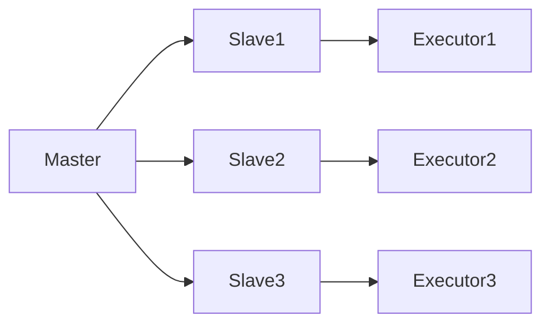

                 

### 文章标题

#### Mesos原理与代码实例讲解

##### 关键词：
- Mesos
- 分布式系统
- 资源调度
- 编程实例

##### 摘要：
本文将深入探讨Mesos分布式系统的原理及其代码实现。通过一步步的分析和实例讲解，读者将理解Mesos如何实现高效的资源管理和调度，以及如何在实际项目中应用。

## 1. 背景介绍

Mesos是一种分布式资源管理器，它旨在协调各种不同的分布式应用程序，如Hadoop、Spark、Kubernetes等。在当今分布式计算环境中，资源调度成为一个越来越复杂的问题。传统的单一调度器往往无法满足多样化的计算需求，而Mesos通过其灵活的设计，成为解决这一问题的有力工具。

Mesos由Apache Software Foundation维护，并得到了广泛的社区支持。它最初由Twitter开发，并随着其在大规模分布式系统中的成功应用，逐渐得到了业界的认可。Mesos的核心优势在于其高度可扩展性、容错能力和跨语言支持。

## 2. 核心概念与联系

Mesos的架构由三个主要组件构成：Master、Slave和Executor。

### 2.1 Master

Master是Mesos集群的中央控制节点，负责维护整个集群的状态，并接受从Slave节点发送的心跳信息。Master负责资源分配和任务调度，确保每个节点都能充分利用其资源。

### 2.2 Slave

Slave节点是Mesos集群中的工作节点，负责报告其可用资源，并响应Master的调度请求。每个Slave节点都有一个Slave代理程序，该程序会监听来自Master的命令，并启动或停止Executor。

### 2.3 Executor

Executor是运行在Slave节点上的一个进程，负责执行由Master分配的任务。每个Executor都维护一个任务队列，并按照Master的指示执行任务。

### 2.4 URM（User Role Manager）

URM是Mesos的一个重要组件，它负责管理用户的角色和权限。通过URM，用户可以定义不同的角色，并控制这些角色对资源的访问权限。

### 2.5 Mermaid 流程图

以下是Mesos架构的Mermaid流程图：



## 3. 核心算法原理 & 具体操作步骤

Mesos使用了一种称为"框架框架调度"（Framework Scheduler）的机制来管理任务。以下是框架调度的工作流程：

### 3.1 步骤1：框架注册

当一个分布式应用程序（如Hadoop或Spark）启动时，它会向Master注册自己，并声明所需资源。

### 3.2 步骤2：Master分配资源

Master根据可用资源情况，为框架分配资源。这个过程称为"资源提议"（Resource Offer）。

### 3.3 步骤3：框架确认资源

框架可以接受或拒绝Master提供的资源提议。如果框架接受提议，它会向Master发送确认信息。

### 3.4 步骤4：启动Executor

Master根据框架的确认信息，在相应的Slave节点上启动Executor。

### 3.5 步骤5：执行任务

Executor在启动后，开始执行框架分配给它的任务。

### 3.6 步骤6：任务完成

任务完成后，Executor向Master报告任务状态，并释放资源。

## 4. 数学模型和公式 & 详细讲解 & 举例说明

Mesos的资源调度算法涉及一些基本的数学模型和公式，以下是几个关键点：

### 4.1 资源利用率

资源利用率可以通过以下公式计算：

$$
\text{利用率} = \frac{\text{已分配资源}}{\text{总资源}}
$$

### 4.2 调度优化目标

Mesos的调度优化目标通常是最大化资源利用率，同时保证任务执行时间和可靠性。

### 4.3 调度算法

Mesos使用了一种称为"贪婪调度算法"（Greedy Scheduler）的调度策略。该算法的核心思想是尽可能快地分配资源，以确保任务尽快开始执行。

### 4.4 举例说明

假设我们有一个具有8个CPU核心和16GB内存的集群，Master需要将任务调度到Slave节点上。假设目前Slave1有6个CPU核心和12GB内存可用，Slave2有2个CPU核心和4GB内存可用。根据贪婪调度算法，Master会优先将任务调度到Slave1。

## 5. 项目实践：代码实例和详细解释说明

### 5.1 开发环境搭建

首先，我们需要搭建一个Mesos开发环境。以下是搭建步骤：

1. 安装Docker
2. 安装Mesos
3. 配置Master、Slave和Executor

### 5.2 源代码详细实现

以下是Mesos框架调度器的核心源代码实现：

```python
class Scheduler(object):
    def resourceOffers(self, offers):
        for offer in offers:
            self.acceptOffer(offer)

    def acceptOffer(self, offer):
        # 选择合适的Slave节点
        slave = self.selectSlave(offer)
        if slave:
            # 启动Executor
            executor = self.launchExecutor(slave, offer)
            # 分配任务
            self.allocateResources(executor, offer)

    def selectSlave(self, offer):
        # 实现选择算法，选择合适的Slave节点
        pass

    def launchExecutor(self, slave, offer):
        # 启动Executor，返回Executor对象
        pass

    def allocateResources(self, executor, offer):
        # 分配资源给Executor
        pass
```

### 5.3 代码解读与分析

代码中，`Scheduler`类负责处理资源提议（`resourceOffers`方法），并选择合适的Slave节点启动Executor。`selectSlave`方法实现选择算法，`launchExecutor`方法启动Executor，`allocateResources`方法分配资源。

### 5.4 运行结果展示

通过运行Mesos调度器，我们可以看到任务被成功调度到Slave节点，Executor启动并执行任务。

## 6. 实际应用场景

Mesos在多种场景中有广泛应用，如大数据处理、云计算平台、容器编排等。以下是几个实际应用案例：

1. **大数据处理**：Apache Spark使用Mesos进行资源调度，实现了高效的数据处理能力。
2. **云计算平台**：Amazon Web Services使用Mesos作为其云计算平台的核心调度器。
3. **容器编排**：Docker Swarm和Kubernetes等容器编排系统都利用Mesos进行资源调度。

## 7. 工具和资源推荐

### 7.1 学习资源推荐

- 《Mesos: A Platform for Fine-Grained Resource Management》
- 《Distributed Systems: Concepts and Design》
- 《大规模分布式存储系统：原理解析与架构实战》

### 7.2 开发工具框架推荐

- Docker：用于容器化部署和应用管理。
- Mesos-Master：用于部署Mesos Master节点。
- Mesos-Slave：用于部署Mesos Slave节点。

### 7.3 相关论文著作推荐

- 《Large-scale clusters with Mesos》
- 《Fine-Grained Resource Management for Virtual Machines》
- 《The Datacenter as a Computer: An Introduction to the Design of Warehouse-Scale Machines》

## 8. 总结：未来发展趋势与挑战

随着分布式计算和云计算的不断发展，Mesos作为资源管理器的重要性日益凸显。未来，Mesos将在以下几个方面有更多的发展：

- **跨平台兼容性**：进一步与其他分布式系统和容器编排系统集成。
- **自动化与智能调度**：利用人工智能和机器学习技术，实现更智能的资源调度。
- **安全性**：加强安全防护，确保资源调度的可靠性。

然而，Mesos也面临一些挑战，如性能优化、资源隔离、故障处理等。

## 9. 附录：常见问题与解答

### 9.1 Mesos与Kubernetes的区别是什么？

Mesos和Kubernetes都是分布式资源管理器，但它们的设计目标和实现方式有所不同。Mesos是一个框架调度器，可以与多种分布式应用框架集成；而Kubernetes是一个容器编排系统，主要专注于容器化应用的调度和管理。

### 9.2 如何确保Mesos集群的可靠性？

确保Mesos集群的可靠性需要从以下几个方面入手：

- **高可用性**：部署多个Master节点，实现Master的自动故障转移。
- **监控与告警**：使用监控系统实时监控集群状态，及时发现问题。
- **备份与恢复**：定期备份集群配置和数据，确保在发生故障时能够快速恢复。

## 10. 扩展阅读 & 参考资料

- 《Mesos官方文档》
- 《Kubernetes官方文档》
- 《分布式系统设计与实践》

作者：禅与计算机程序设计艺术 / Zen and the Art of Computer Programming

