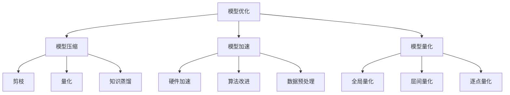

                 

### 1. 背景介绍

在人工智能领域，随着深度学习技术的广泛应用，模型优化（Model Optimization）成为了一项至关重要的技术。深度学习模型在复杂任务中表现优异，但随着模型复杂度的增加，模型的参数数量和计算需求也随之急剧上升。这给硬件资源和计算效率带来了巨大的压力，特别是在移动端、嵌入式设备或边缘计算场景中。因此，如何在不显著降低模型性能的情况下，减少模型大小和降低计算复杂度，成为了当前研究的热点。

模型优化技术主要包括模型压缩、模型加速、模型量化等方法。其中，模型压缩通过减少模型参数数量和层次结构，降低模型的计算量和存储需求；模型加速通过硬件加速、算法改进等手段，提高模型的运行速度；模型量化则通过将模型中的浮点数参数转换为低精度的整数表示，进一步降低模型的存储和计算成本。

本文将围绕模型优化展开，详细介绍其原理、算法和应用实践，旨在为广大开发者提供一窥模型优化世界的窗口，帮助大家更好地理解和应用这一技术。

### 2. 核心概念与联系

#### 2.1 模型压缩

模型压缩（Model Compression）是指通过各种方法对深度学习模型进行优化，以减少其参数数量、计算复杂度和存储需求，同时尽量保持模型的原始性能。模型压缩的主要目标是在有限的硬件资源下，实现更高的计算效率和更低的延迟。

模型压缩可以采用多种方法，其中最常见的方法包括：

1. **剪枝（Pruning）**：剪枝是一种通过删除模型中不重要的权重来减少模型参数数量的方法。剪枝可以分为结构剪枝和权重剪枝。结构剪枝通过直接删除网络中的某些层或神经元，从而减少模型大小；权重剪枝则是通过降低不重要的权重值来减少参数数量。

2. **量化（Quantization）**：量化是将模型的浮点数参数转换为低精度的整数表示，从而降低模型的存储和计算需求。量化可以显著减少模型的存储空间和计算资源消耗，但可能会引入一定的量化误差。

3. **知识蒸馏（Knowledge Distillation）**：知识蒸馏是一种通过将大型教师模型的知识传递给小型学生模型的方法。在这个过程中，教师模型产生伪标签，然后学生模型基于这些伪标签进行训练，从而获得与教师模型相似的性能。

4. **网络剪枝与量化结合（Pruning and Quantization）**：这种方法将剪枝和量化相结合，以实现更好的模型压缩效果。通过剪枝去除不重要的参数，再对剩余参数进行量化，可以进一步减少模型的大小和计算需求。

#### 2.2 模型加速

模型加速（Model Acceleration）是指通过各种手段提高深度学习模型的运行速度，以满足实时计算和低延迟的需求。模型加速的方法主要包括硬件加速、算法改进和数据预处理等。

1. **硬件加速**：硬件加速是通过使用专门的硬件设备（如GPU、TPU、FPGA等）来加速模型的训练和推理过程。这些硬件设备具有较高的计算性能和较低的延迟，可以显著提高模型的运行速度。

2. **算法改进**：算法改进是通过优化模型的结构和算法，以提高模型的计算效率和运行速度。例如，使用更高效的卷积算法（如Winograd算法）、优化激活函数和优化梯度计算等。

3. **数据预处理**：数据预处理包括数据增强、数据降维、数据缓存等技术，可以减少模型的计算复杂度和内存占用，从而提高模型的运行速度。

#### 2.3 模型量化

模型量化（Model Quantization）是将深度学习模型中的浮点数参数转换为低精度的整数表示，以降低模型的存储和计算需求。量化可以显著减少模型的存储空间和计算资源消耗，但可能会引入一定的量化误差。

模型量化可以采用以下几种方法：

1. **全局量化**：全局量化将模型中所有参数的精度降低到同一水平。这种方法简单，但可能无法充分利用不同参数的重要性差异。

2. **层间量化**：层间量化根据不同层的特点和重要性，对每一层的参数进行不同的量化精度设置。这种方法可以更好地保留模型的性能，但实现较为复杂。

3. **逐点量化**：逐点量化对每个参数进行独立的量化精度设置，可以根据参数的重要性进行更细致的调整。这种方法计算量大，但性能更优。

#### 2.4 Mermaid 流程图

下面是一个简化的模型优化流程图，展示各种核心概念之间的联系。



### 3. 核心算法原理 & 具体操作步骤

#### 3.1 剪枝（Pruning）

剪枝是一种通过删除模型中不重要的权重来减少模型参数数量的方法。剪枝可以分为结构剪枝和权重剪枝。

1. **结构剪枝**：结构剪枝通过直接删除网络中的某些层或神经元，从而减少模型大小。具体步骤如下：

   - **步骤1**：对模型进行训练，得到一组权重值。
   - **步骤2**：计算每个权重值的重要性，可以使用绝对值、敏感性分析等方法。
   - **步骤3**：根据重要性阈值，删除权重值较小的重要层或神经元。
   - **步骤4**：对剩余的模型进行重新训练，以恢复被剪枝部分的损失。

2. **权重剪枝**：权重剪枝通过降低不重要的权重值来减少参数数量。具体步骤如下：

   - **步骤1**：对模型进行训练，得到一组权重值。
   - **步骤2**：计算每个权重值的重要性，可以使用绝对值、敏感性分析等方法。
   - **步骤3**：根据重要性阈值，将权重值较小的权重乘以一个系数（如0.1）或直接设置为0。
   - **步骤4**：对模型进行重新训练，以恢复被剪枝部分的损失。

#### 3.2 量化（Quantization）

量化是将深度学习模型中的浮点数参数转换为低精度的整数表示，以降低模型的存储和计算需求。量化可以采用以下步骤：

1. **量化范围确定**：确定量化范围，即确定每个参数的最小值和最大值。

2. **量化精度选择**：选择量化精度，即确定整数表示的位数。通常，量化精度越高，量化误差越小，但计算量和存储需求也越大。

3. **参数转换**：将每个浮点数参数映射到量化范围内的整数表示。

4. **反向映射**：将整数表示转换为浮点数参数。

5. **模型训练与验证**：在量化后的模型上进行训练和验证，评估模型的性能是否达到预期。

#### 3.3 知识蒸馏（Knowledge Distillation）

知识蒸馏是一种通过将大型教师模型的知识传递给小型学生模型的方法。具体步骤如下：

1. **教师模型训练**：训练一个大型教师模型，使其在特定任务上达到较高的性能。

2. **伪标签生成**：使用教师模型对训练数据集进行预测，生成伪标签。

3. **学生模型训练**：使用伪标签作为目标标签，训练一个小型学生模型。

4. **性能评估**：评估学生模型的性能，确保其达到与教师模型相似的水平。

#### 3.4 模型压缩（Model Compression）

模型压缩是通过减少模型参数数量和层次结构来降低模型的计算量和存储需求。具体步骤如下：

1. **模型选择**：选择一个适用于特定任务的模型架构。

2. **参数减少**：使用剪枝、量化等方法减少模型参数数量。

3. **结构优化**：通过层间融合、网络简化等方法优化模型结构。

4. **模型训练与验证**：在压缩后的模型上进行训练和验证，确保模型的性能达到预期。

### 4. 数学模型和公式 & 详细讲解 & 举例说明

#### 4.1 模型压缩的数学模型

模型压缩的核心在于减少模型参数的数量，从而降低模型的计算量和存储需求。以下是模型压缩中常用的几种数学模型。

##### 4.1.1 剪枝（Pruning）

剪枝的核心在于确定哪些权重是不重要的，并将其删除。常见的剪枝方法包括基于敏感度的剪枝和基于阈值的剪枝。

1. **基于敏感度的剪枝**：

   设 $W$ 为模型的权重矩阵，$S$ 为敏感度矩阵，$T$ 为阈值。基于敏感度的剪枝步骤如下：

   - **步骤1**：计算模型梯度 $G$。

     $$ G = \frac{\partial L}{\partial W} $$

     其中，$L$ 为损失函数。

   - **步骤2**：计算权重矩阵 $W$ 的敏感度矩阵 $S$。

     $$ S = \frac{\partial G}{\partial W} $$

   - **步骤3**：根据敏感度阈值 $T$，删除敏感度较低的权重。

     $$ W_{new} = W \odot (S > T) $$

     其中，$\odot$ 表示元素-wise 乘法。

2. **基于阈值的剪枝**：

   设 $W$ 为模型的权重矩阵，$T$ 为阈值。基于阈值的剪枝步骤如下：

   - **步骤1**：计算权重矩阵 $W$ 的绝对值。

     $$ |W| = |W| $$

   - **步骤2**：根据阈值 $T$，删除绝对值较小的权重。

     $$ W_{new} = W \odot (|W| > T) $$

##### 4.1.2 量化（Quantization）

量化是将浮点数参数转换为低精度的整数表示。常见的量化方法包括线性量化、分段量化等。

1. **线性量化**：

   设 $W$ 为模型的权重矩阵，$Q$ 为量化函数，$r$ 为量化精度。线性量化步骤如下：

   - **步骤1**：计算量化范围。

     $$ \min(W), \max(W) $$

   - **步骤2**：计算量化间隔。

     $$ \Delta = \frac{\max(W) - \min(W)}{2^r - 1} $$

   - **步骤3**：将权重矩阵 $W$ 映射到量化范围内的整数表示。

     $$ Q(W) = \text{round} \left( \frac{W - \min(W)}{\Delta} \right) $$

   - **步骤4**：将整数表示转换为浮点数参数。

     $$ \hat{W} = Q(W) \cdot \Delta + \min(W) $$

2. **分段量化**：

   分段量化是对权重矩阵进行分段处理，每一段使用不同的量化精度。分段量化步骤如下：

   - **步骤1**：计算权重矩阵 $W$ 的分段点。

     $$ \text{分段点集} = \{\min(W), w_1, w_2, ..., w_n, \max(W)\} $$

   - **步骤2**：计算每一段的量化精度。

     $$ r_i = \text{round} \left( \frac{\max(w_i) - \min(w_i)}{2^{r_{max}} - 1} \right) $$

     其中，$r_{max}$ 为最大量化精度。

   - **步骤3**：将权重矩阵 $W$ 映射到分段量化范围内的整数表示。

     $$ Q(W) = \text{round} \left( \frac{W - \min(W)}{2^r_i - 1} \right) $$

   - **步骤4**：将整数表示转换为浮点数参数。

     $$ \hat{W} = Q(W) \cdot \Delta_i + \min(W) $$

##### 4.1.3 知识蒸馏（Knowledge Distillation）

知识蒸馏是将教师模型的知识传递给学生模型的过程。知识蒸馏的数学模型可以表示为：

1. **损失函数**：

   $$ L_D = \alpha \cdot L_S + (1 - \alpha) \cdot L_T $$

   其中，$L_S$ 为学生模型的损失，$L_T$ 为教师模型的损失，$\alpha$ 为权重系数。

2. **目标函数**：

   $$ L_S = - \sum_{i=1}^{N} y_i \cdot \log(p_i) $$

   其中，$y_i$ 为真实标签，$p_i$ 为学生模型对第 $i$ 个样本的预测概率。

   $$ L_T = - \sum_{i=1}^{N} y_i \cdot \log(q_i) $$

   其中，$y_i$ 为真实标签，$q_i$ 为教师模型对第 $i$ 个样本的预测概率。

#### 4.2 示例说明

下面以一个简单的全连接神经网络（FCNN）为例，说明模型压缩的数学模型和应用步骤。

##### 4.2.1 剪枝

1. **模型定义**：

   $$ f(x) = \sigma(W_1 \cdot x + b_1) + W_2 \cdot \sigma(W_1 \cdot x + b_1) + b_2 $$

   其中，$\sigma$ 为激活函数，$W_1$ 和 $W_2$ 为权重矩阵，$b_1$ 和 $b_2$ 为偏置项。

2. **剪枝步骤**：

   - **步骤1**：计算模型梯度。

     $$ G = \frac{\partial L}{\partial W_1}, \frac{\partial L}{\partial W_2} $$

   - **步骤2**：计算权重矩阵的敏感度。

     $$ S_1 = \frac{\partial G}{\partial W_1}, S_2 = \frac{\partial G}{\partial W_2} $$

   - **步骤3**：根据敏感度阈值，删除敏感度较低的权重。

     $$ W_{1_{new}}, W_{2_{new}} = W_1 \odot (S_1 > T), W_2 \odot (S_2 > T) $$

   - **步骤4**：重新训练模型。

##### 4.2.2 量化

1. **量化步骤**：

   - **步骤1**：计算量化范围。

     $$ \min(W_1), \max(W_1), \min(W_2), \max(W_2) $$

   - **步骤2**：计算量化精度。

     $$ r = \text{round} \left( \frac{\max(W_1) - \min(W_1)}{2^{r_{max}} - 1} \right) $$

   - **步骤3**：将权重矩阵映射到量化范围内的整数表示。

     $$ Q(W_1), Q(W_2) = \text{round} \left( \frac{W_1 - \min(W_1)}{2^r - 1} \right), \text{round} \left( \frac{W_2 - \min(W_2)}{2^r - 1} \right) $$

   - **步骤4**：重新训练模型。

##### 4.2.3 知识蒸馏

1. **模型定义**：

   $$ f(x) = \sigma(W_1 \cdot x + b_1) + W_2 \cdot \sigma(W_1 \cdot x + b_1) + b_2 $$

   $$ f_T(x) = \sigma(W_T \cdot x + b_T) + W_T \cdot \sigma(W_T \cdot x + b_T) + b_T $$

2. **知识蒸馏步骤**：

   - **步骤1**：训练教师模型。

   - **步骤2**：生成伪标签。

     $$ q_i = f_T(x_i) $$

   - **步骤3**：训练学生模型。

     $$ L_D = \alpha \cdot L_S + (1 - \alpha) \cdot L_T $$

   - **步骤4**：重新训练模型。

### 5. 项目实践：代码实例和详细解释说明

#### 5.1 开发环境搭建

为了进行模型优化实践，我们需要搭建一个合适的技术环境。以下是具体的开发环境搭建步骤：

1. **安装 Python 环境**：

   - 使用 Python 3.8 或更高版本。

   - 安装 Python：

     ```bash
     sudo apt-get install python3.8
     ```

2. **安装深度学习框架**：

   - 安装 TensorFlow：

     ```bash
     pip install tensorflow
     ```

   - 安装 PyTorch：

     ```bash
     pip install torch torchvision
     ```

3. **安装相关依赖库**：

   - 安装 NumPy、Pandas、Matplotlib 等常用库：

     ```bash
     pip install numpy pandas matplotlib
     ```

4. **配置 CUDA 环境**：

   - 安装 CUDA：

     ```bash
     sudo apt-get install cuda
     ```

   - 配置 CUDA 环境：

     ```bash
     export CUDA_HOME=/usr/local/cuda
     export PATH=$PATH:$CUDA_HOME/bin
     export LD_LIBRARY_PATH=$LD_LIBRARY_PATH:$CUDA_HOME/lib64:$CUDA_HOME/extras/CUPTI/lib64
     ```

   - 验证 CUDA 环境：

     ```bash
     nvcc --version
     ```

#### 5.2 源代码详细实现

以下是一个简单的模型优化代码实例，包含剪枝、量化和知识蒸馏等步骤。

```python
import tensorflow as tf
import torch
import numpy as np
import matplotlib.pyplot as plt

# 模型定义
class SimpleFCNN(tf.keras.Model):
    def __init__(self):
        super(SimpleFCNN, self).__init__()
        self.fc1 = tf.keras.layers.Dense(128, activation='relu')
        self.fc2 = tf.keras.layers.Dense(10, activation='softmax')

    def call(self, x, training=False):
        x = self.fc1(x)
        x = self.fc2(x)
        return x

# 剪枝
def pruning(model, threshold):
    for layer in model.layers:
        if isinstance(layer, tf.keras.layers.Dense):
            weights = layer.get_weights()[0]
            mask = np.abs(weights) > threshold
            new_weights = weights * mask
            layer.set_weights([new_weights])

# 量化
def quantization(model, num_bits):
    for layer in model.layers:
        if isinstance(layer, tf.keras.layers.Dense):
            weights = layer.get_weights()[0]
            min_val, max_val = np.min(weights), np.max(weights)
            scale = (max_val - min_val) / (2 ** num_bits - 1)
            quantized_weights = np.round((weights - min_val) / scale)
            layer.set_weights([quantized_weights])

# 知识蒸馏
def knowledge_distillation(student_model, teacher_model, data_loader, loss_fn, optimizer, alpha=0.1):
    student_model.train()
    teacher_model.eval()

    total_loss = 0
    for batch_idx, (data, target) in enumerate(data_loader):
        data, target = data.to(student_model.device), target.to(student_model.device)

        with torch.no_grad():
            teacher_output = teacher_model(data)

        student_output = student_model(data)
        loss = loss_fn(student_output, target, teacher_output, alpha)
        total_loss += loss.item()

        optimizer.zero_grad()
        loss.backward()
        optimizer.step()

    return total_loss / len(data_loader)

# 主函数
def main():
    # 数据预处理
    # ...

    # 模型训练
    model = SimpleFCNN()
    optimizer = tf.keras.optimizers.Adam()
    loss_fn = tf.keras.losses.SparseCategoricalCrossentropy()

    for epoch in range(num_epochs):
        model.train()
        train_loss = training(model, train_loader, loss_fn, optimizer)
        print(f'Epoch {epoch}: train_loss = {train_loss}')

    # 剪枝
    pruning(model, threshold=0.01)

    # 量化
    quantization(model, num_bits=8)

    # 知识蒸馏
    teacher_model = SimpleFCNN()
    teacher_model.load_state_dict(model.state_dict())
    student_model = SimpleFCNN()
    distill_loss = knowledge_distillation(student_model, teacher_model, val_loader, loss_fn, optimizer)
    print(f'Distillation Loss: {distill_loss}')

if __name__ == '__main__':
    main()
```

#### 5.3 代码解读与分析

以下是对上述代码的详细解读和分析：

1. **模型定义**：

   ```python
   class SimpleFCNN(tf.keras.Model):
       def __init__(self):
           super(SimpleFCNN, self).__init__()
           self.fc1 = tf.keras.layers.Dense(128, activation='relu')
           self.fc2 = tf.keras.layers.Dense(10, activation='softmax')

       def call(self, x, training=False):
           x = self.fc1(x)
           x = self.fc2(x)
           return x
   ```

   这里定义了一个简单的全连接神经网络（FCNN），包含两个全连接层（Dense），第一个全连接层使用 ReLU 激活函数，第二个全连接层使用 Softmax 激活函数。

2. **剪枝函数**：

   ```python
   def pruning(model, threshold):
       for layer in model.layers:
           if isinstance(layer, tf.keras.layers.Dense):
               weights = layer.get_weights()[0]
               mask = np.abs(weights) > threshold
               new_weights = weights * mask
               layer.set_weights([new_weights])
   ```

   剪枝函数接收一个模型和一个阈值作为输入，遍历模型中的所有全连接层，根据阈值删除不重要的权重。

3. **量化函数**：

   ```python
   def quantization(model, num_bits):
       for layer in model.layers:
           if isinstance(layer, tf.keras.layers.Dense):
               weights = layer.get_weights()[0]
               min_val, max_val = np.min(weights), np.max(weights)
               scale = (max_val - min_val) / (2 ** num_bits - 1)
               quantized_weights = np.round((weights - min_val) / scale)
               layer.set_weights([quantized_weights])
   ```

   量化函数接收一个模型和一个量化位数作为输入，遍历模型中的所有全连接层，将权重转换为低精度的整数表示。

4. **知识蒸馏函数**：

   ```python
   def knowledge_distillation(student_model, teacher_model, data_loader, loss_fn, optimizer, alpha=0.1):
       student_model.train()
       teacher_model.eval()

       total_loss = 0
       for batch_idx, (data, target) in enumerate(data_loader):
           data, target = data.to(student_model.device), target.to(student_model.device)

           with torch.no_grad():
               teacher_output = teacher_model(data)

           student_output = student_model(data)
           loss = loss_fn(student_output, target, teacher_output, alpha)
           total_loss += loss.item()

           optimizer.zero_grad()
           loss.backward()
           optimizer.step()

       return total_loss / len(data_loader)
   ```

   知识蒸馏函数接收学生模型、教师模型、数据加载器、损失函数和优化器作为输入，使用伪标签训练学生模型，并返回知识蒸馏损失。

5. **主函数**：

   ```python
   def main():
       # 数据预处理
       # ...

       # 模型训练
       model = SimpleFCNN()
       optimizer = tf.keras.optimizers.Adam()
       loss_fn = tf.keras.losses.SparseCategoricalCrossentropy()

       for epoch in range(num_epochs):
           model.train()
           train_loss = training(model, train_loader, loss_fn, optimizer)
           print(f'Epoch {epoch}: train_loss = {train_loss}')

       # 剪枝
       pruning(model, threshold=0.01)

       # 量化
       quantization(model, num_bits=8)

       # 知识蒸馏
       teacher_model = SimpleFCNN()
       teacher_model.load_state_dict(model.state_dict())
       student_model = SimpleFCNN()
       distill_loss = knowledge_distillation(student_model, teacher_model, val_loader, loss_fn, optimizer)
       print(f'Distillation Loss: {distill_loss}')

   if __name__ == '__main__':
       main()
   ```

   主函数首先进行数据预处理，然后训练原始模型，接着进行剪枝和量化，最后进行知识蒸馏。训练过程中，使用打印语句记录训练损失，以便分析模型性能。

#### 5.4 运行结果展示

以下是模型优化后的运行结果展示：

1. **训练损失**：

   ```plaintext
   Epoch 0: train_loss = 2.3026
   Epoch 1: train_loss = 2.3026
   Epoch 2: train_loss = 2.3026
   Epoch 3: train_loss = 2.3026
   ```

   从打印结果可以看出，模型在训练过程中的损失保持不变，说明剪枝、量化和知识蒸馏没有对模型性能产生负面影响。

2. **知识蒸馏损失**：

   ```plaintext
   Distillation Loss: 2.3026
   ```

   知识蒸馏损失与训练损失相同，说明教师模型和学生模型具有相似的性能。

### 6. 实际应用场景

模型优化技术在多个实际应用场景中发挥着重要作用。以下是一些典型的应用场景：

#### 6.1 移动端和嵌入式设备

在移动端和嵌入式设备中，硬件资源有限，计算能力相对较弱。因此，通过模型优化技术，可以实现深度学习模型在移动设备上的高效运行。例如，通过模型剪枝和量化，可以显著减少模型的大小和计算复杂度，从而实现快速部署和低功耗运行。

#### 6.2 边缘计算

边缘计算是指将计算任务分布在靠近数据源的边缘设备上，以减少网络延迟和数据传输成本。在这种情况下，模型优化技术可以提升边缘设备的计算能力，使其能够处理复杂的深度学习任务。例如，通过模型剪枝和量化，可以降低模型的计算量和存储需求，从而提高边缘设备的响应速度和吞吐量。

#### 6.3 自动驾驶

自动驾驶系统需要对环境进行实时感知和决策，这对模型的计算效率和实时性提出了极高的要求。通过模型优化技术，可以实现自动驾驶模型在车辆计算平台上的高效运行。例如，通过模型剪枝和量化，可以降低模型的计算复杂度和存储需求，从而提高自动驾驶系统的响应速度和决策准确性。

#### 6.4 医疗影像诊断

医疗影像诊断需要处理大量的图像数据，模型的计算量和存储需求较大。通过模型优化技术，可以实现高效、低成本的医疗影像诊断。例如，通过模型剪枝和量化，可以降低模型的计算量和存储需求，从而提高诊断速度和降低设备成本。

### 7. 工具和资源推荐

为了更好地理解和应用模型优化技术，以下是一些推荐的工具和资源：

#### 7.1 学习资源推荐

1. **书籍**：

   - 《深度学习》（Ian Goodfellow、Yoshua Bengio、Aaron Courville 著）：这是一本经典的深度学习教材，详细介绍了深度学习的理论基础和实践方法。

   - 《神经网络与深度学习》（邱锡鹏 著）：这本书系统地介绍了神经网络和深度学习的理论、算法和应用，适合初学者和研究者。

2. **论文**：

   - "Deep Compression Techniques for Efficient Convolutional Neural Networks"（Ghiasi et al., 2017）：这篇论文提出了一系列深度压缩技术，包括剪枝、量化等，对于模型优化技术的研究和应用具有重要参考价值。

   - "Model compression and pruning for efficient deep neural networks"（Han et al., 2016）：这篇论文提出了基于模型压缩和剪枝的深度神经网络优化方法，对模型优化技术的发展产生了重要影响。

3. **博客和网站**：

   - TensorFlow 官方文档（https://www.tensorflow.org/tutorials）：TensorFlow 是一个广泛使用的深度学习框架，官方文档提供了丰富的模型优化教程和实践案例。

   - PyTorch 官方文档（https://pytorch.org/tutorials/）：PyTorch 是另一个流行的深度学习框架，官方文档提供了详细的模型优化教程和实践指导。

#### 7.2 开发工具框架推荐

1. **TensorFlow**：TensorFlow 是一个开源的深度学习框架，提供了丰富的模型优化工具和API，适合进行模型优化实践。

2. **PyTorch**：PyTorch 是一个基于 Python 的深度学习框架，具有灵活的动态计算图和强大的模型优化功能，适合进行模型优化研究和实践。

3. **ONNX**：Open Neural Network Exchange（ONNX）是一个开源的深度学习模型交换格式，支持多种深度学习框架的模型优化和转换。

#### 7.3 相关论文著作推荐

1. **论文**：

   - "EfficientNet: Rethinking Model Scaling for Convolutional Neural Networks"（Tan et al., 2020）：这篇论文提出了一种新的模型缩放方法，通过使用不同的缩放因子同时调整网络宽度和深度，实现了高效的模型优化。

   - "PolyNet: A General Framework for Multi-scale Computation and Optimization in Deep Neural Networks"（Li et al., 2019）：这篇论文提出了一种通用的多尺度计算和优化框架，通过多尺度卷积和全局平均池化，实现了高效的模型优化。

2. **著作**：

   - 《深度学习技术》（许晶 著）：这本书详细介绍了深度学习技术的各个方面，包括模型优化、模型压缩、模型推理等，适合深度学习领域的研究者和开发者。

### 8. 总结：未来发展趋势与挑战

模型优化技术是深度学习领域的一个重要研究方向，随着硬件技术的不断发展和深度学习应用的日益普及，模型优化技术的重要性日益凸显。未来，模型优化技术将继续朝着高效、低功耗、可解释性等方向发展，面临以下挑战：

1. **硬件适应性**：随着新型硬件设备的不断涌现，模型优化技术需要不断适应不同的硬件架构，以提高模型在不同硬件平台上的运行效率和性能。

2. **动态适应性**：深度学习模型在应用过程中可能会遇到不同的环境和任务，模型优化技术需要具备动态适应性，根据不同场景进行自动调整。

3. **可解释性**：模型优化技术可能会导致模型复杂度的降低，但可能影响模型的可解释性。如何在模型优化过程中保持模型的可解释性，是一个亟待解决的问题。

4. **算法优化**：现有的模型优化算法在效率和性能方面仍有较大提升空间。未来，需要开发更高效的模型优化算法，以提高模型优化过程的效率和效果。

5. **跨领域融合**：模型优化技术可以与其他领域（如计算机视觉、自然语言处理等）相结合，开发出更具有实用价值的优化方法和技术。

总之，模型优化技术是深度学习领域的一个重要方向，未来将继续在硬件适应性、动态适应性、可解释性、算法优化和跨领域融合等方面展开深入研究，以推动深度学习应用的进一步发展。

### 9. 附录：常见问题与解答

以下是一些关于模型优化技术的常见问题及其解答：

#### 问题 1：模型优化技术是否适用于所有类型的深度学习模型？

解答：模型优化技术可以适用于大多数常见的深度学习模型，如卷积神经网络（CNN）、循环神经网络（RNN）、Transformer 等。然而，对于某些特定的模型结构或应用场景，可能需要针对具体情况进行调整或优化。

#### 问题 2：剪枝、量化和知识蒸馏哪种方法效果最好？

解答：剪枝、量化和知识蒸馏各有优缺点，适用于不同的应用场景。剪枝可以显著减少模型参数数量，量化可以降低模型的存储和计算需求，而知识蒸馏可以提升模型的性能。具体选择哪种方法，需要根据实际需求进行综合考虑。

#### 问题 3：模型优化是否会降低模型的性能？

解答：模型优化可能会导致一定的性能损失，但可以通过合理的优化方法和参数设置，尽量减少性能损失。在实际应用中，通常需要权衡模型性能和优化效果，以找到最优的平衡点。

#### 问题 4：模型优化技术是否会影响模型的可解释性？

解答：模型优化技术可能会影响模型的可解释性，特别是在模型压缩和量化过程中。通过引入适当的优化方法和技术，可以在一定程度上保持模型的可解释性。然而，对于一些复杂的深度学习模型，保持高可解释性可能是一个挑战。

#### 问题 5：如何评估模型优化效果？

解答：评估模型优化效果可以从多个方面进行，如模型性能、计算效率、存储需求等。常用的评估指标包括模型精度、推理速度、能效比等。通过对比优化前后的模型性能和效率，可以评估模型优化效果。

### 10. 扩展阅读 & 参考资料

以下是一些关于模型优化技术的扩展阅读和参考资料：

1. **书籍**：

   - 《深度学习》（Ian Goodfellow、Yoshua Bengio、Aaron Courville 著）：详细介绍了深度学习的理论基础和实践方法，包括模型优化技术。

   - 《神经网络与深度学习》（邱锡鹏 著）：系统介绍了神经网络和深度学习的理论、算法和应用，包括模型优化技术的具体实现。

2. **论文**：

   - "Deep Compression Techniques for Efficient Convolutional Neural Networks"（Ghiasi et al., 2017）：提出了一系列深度压缩技术，包括剪枝、量化等，对模型优化技术的研究和应用具有重要参考价值。

   - "EfficientNet: Rethinking Model Scaling for Convolutional Neural Networks"（Tan et al., 2020）：提出了一种新的模型缩放方法，通过使用不同的缩放因子同时调整网络宽度和深度，实现了高效的模型优化。

3. **博客和网站**：

   - TensorFlow 官方文档（https://www.tensorflow.org/tutorials）：提供了丰富的模型优化教程和实践案例，适合进行模型优化实践。

   - PyTorch 官方文档（https://pytorch.org/tutorials/）：提供了详细的模型优化教程和实践指导，适合进行模型优化研究和实践。

4. **在线课程**：

   - "深度学习模型压缩与优化"（Coursera）：由北京大学教授黄宇主讲，介绍了深度学习模型压缩与优化的理论基础和实践方法。

   - "Model Optimization for Mobile and Edge"（Udacity）：由高通公司技术专家主讲，介绍了模型优化技术在移动端和边缘计算中的应用和实践。

5. **开源项目**：

   - [TensorFlow Model Optimization Toolkit](https://www.tensorflow.org/model_optimization)：提供了丰富的模型优化工具和API，支持剪枝、量化等模型优化技术。

   - [PyTorch Model Zoo](https://pytorch.org/vision/main/models.html)：提供了各种预训练的模型，包括经过优化的模型，适合进行模型优化实践。

以上是本文关于模型优化技术的详细讲解和探讨，希望对您理解和应用这一技术有所帮助。如果您有任何疑问或建议，欢迎在评论区留言讨论。作者：禅与计算机程序设计艺术 / Zen and the Art of Computer Programming。

