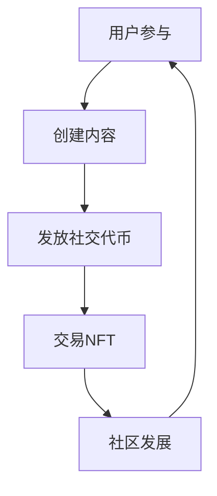

                 

### NFT 社交代币平台：社交经济的创新模式

> 关键词：NFT、社交代币、社交经济、区块链、用户参与、价值共创

> 摘要：本文将探讨NFT社交代币平台的概念及其在社交经济中的创新模式。通过深入分析NFT（非同质化代币）与社交代币的结合，我们将了解其在用户参与、价值共创等方面的独特优势，并提供一个完整的实现方案，涵盖从架构设计到实际应用场景的各个方面。

---

## 1. 背景介绍

随着区块链技术的迅猛发展，非同质化代币（NFT）已经成为数字时代的一个重要组成部分。NFT作为一种代表独特数字资产的加密资产，不仅在艺术、收藏品等领域引起轰动，还逐渐扩展到虚拟现实、游戏等新兴领域。与此同时，社交代币作为一种新的经济激励手段，正在社交网络平台中崭露头角，为用户参与和内容创造提供了全新的动力。

NFT社交代币平台，顾名思义，是将NFT与社交代币相结合，创造出一个全新的社交经济生态系统。这个平台的核心理念在于通过区块链技术，确保数字资产的唯一性和不可篡改性，同时利用社交代币激励用户参与社区建设，实现价值共创。

### 1.1 区块链与NFT

区块链是一种分布式账本技术，其核心优势在于去中心化、不可篡改和透明性。这些特性使得区块链成为保护数字资产安全的理想选择。NFT作为区块链技术的一种应用，利用区块链的特性，确保每一份数字资产都是独一无二的，从而在艺术、收藏等领域取得了巨大成功。

### 1.2 社交代币与社交经济

社交代币是一种基于区块链的数字货币，通常用于激励用户在社交网络平台上的参与和内容创造。社交代币的引入，不仅能够提高用户的参与度，还能促进社区内的价值共创。社交经济的核心在于通过经济激励手段，鼓励用户在社交网络中分享知识、创造内容，从而实现社区的繁荣发展。

### 1.3 NFT社交代币平台的意义

NFT社交代币平台的出现，为社交经济注入了新的活力。通过将NFT与社交代币相结合，平台不仅能够确保数字资产的所有权和真实性，还能通过社交代币激励用户参与，从而实现价值共创。这种创新模式为社交网络平台的发展提供了新的思路，有望推动社交经济的进一步发展。

## 2. 核心概念与联系

在深入探讨NFT社交代币平台之前，我们需要了解一些核心概念和它们之间的联系。

### 2.1 NFT（非同质化代币）

NFT是一种代表独特数字资产的加密资产，其特点在于不可替代性和唯一性。每个NFT都有其独特的数字标识，使得每一份数字资产都是独一无二的。NFT的应用范围广泛，包括数字艺术品、虚拟土地、游戏道具等。

### 2.2 社交代币

社交代币是一种基于区块链的数字货币，用于激励用户在社交网络平台上的参与和内容创造。社交代币通常具有以下特点：

- **可交易性**：用户可以在平台上购买、出售或交换社交代币。
- **可激励性**：社交代币可以作为奖励，激励用户参与社区活动、分享知识和创造内容。
- **可追溯性**：社交代币的交易记录存储在区块链上，确保其透明性和可追溯性。

### 2.3 NFT与社交代币的结合

NFT社交代币平台的核心在于将NFT与社交代币相结合，实现数字资产的所有权和真实性的保护，同时通过社交代币激励用户参与。这种结合使得平台具有以下几个独特优势：

- **独特性**：NFT确保每一份数字资产都是独一无二的，用户可以根据自己的需求选择心仪的数字资产。
- **透明性**：社交代币的交易记录存储在区块链上，用户可以随时查看交易记录，确保平台的透明性。
- **激励性**：社交代币可以激励用户参与社区活动，促进价值共创。

### 2.4 Mermaid 流程图

为了更直观地展示NFT社交代币平台的核心概念和联系，我们可以使用Mermaid流程图来表示。以下是一个简化的流程图：



在这个流程图中，用户通过参与社区活动和创建内容，可以获得社交代币，这些社交代币可以用于交易NFT，从而进一步推动社区的发展。通过这样的循环，NFT社交代币平台实现了数字资产的所有权和真实性的保护，同时激励用户参与和内容创造。

---

## 3. 核心算法原理 & 具体操作步骤

在了解了NFT社交代币平台的核心概念和联系之后，我们将深入探讨其核心算法原理，并详细说明如何实现这一平台的各项功能。

### 3.1 核心算法原理

NFT社交代币平台的核心算法主要涉及以下几个方面：

- **智能合约开发**：智能合约是实现NFT和社交代币功能的基石。通过智能合约，平台可以自动执行各种交易和激励操作。
- **区块链数据存储**：区块链技术用于存储NFT和社交代币的交易记录，确保数据的透明性和不可篡改性。
- **用户身份验证**：平台需要实现用户身份验证机制，以确保用户的真实性。
- **奖励机制设计**：设计合理的奖励机制，激励用户积极参与社区建设和内容创造。

### 3.2 具体操作步骤

以下是实现NFT社交代币平台的具体操作步骤：

#### 3.2.1 智能合约开发

首先，我们需要开发智能合约，实现NFT和社交代币的基本功能。以下是一个简化的智能合约示例：

```solidity
// SPDX-License-Identifier: MIT
pragma solidity ^0.8.0;

// NFT合约
contract NFT {
    mapping(uint256 => address) private _owners;
    mapping(uint256 => uint256) private _balances;
    mapping(uint256 => string) private _tokenURIs;

    event Transfer(uint256 tokenId, address from, address to);

    function mintNFT(string memory tokenURI) public {
        uint256 tokenId = _balances.length;
        _balances[tokenId] = 1;
        _owners[tokenId] = msg.sender;
        _tokenURIs[tokenId] = tokenURI;
        emit Transfer(tokenId, address(0), msg.sender);
    }

    function transferNFT(uint256 tokenId, address to) public {
        require(_owners[tokenId] == msg.sender, "Not owner");
        _owners[tokenId] = to;
        _balances[msg.sender]--;
        _balances[to]++;
        emit Transfer(tokenId, msg.sender, to);
    }

    function getTokenURI(uint256 tokenId) public view returns (string memory) {
        return _tokenURIs[tokenId];
    }
}

// 社交代币合约
contract SocialToken {
    mapping(address => uint256) private _balances;

    event Transfer(address from, address to, uint256 amount);

    function transfer(address to, uint256 amount) public {
        require(_balances[msg.sender] >= amount, "Insufficient balance");
        _balances[msg.sender] -= amount;
        _balances[to] += amount;
        emit Transfer(msg.sender, to, amount);
    }
}
```

#### 3.2.2 区块链数据存储

接下来，我们需要将NFT和社交代币的交易记录存储在区块链上。这可以通过Ethereum区块链的智能合约实现。每个交易都会生成一个唯一的交易哈希，并将其存储在区块链上，以确保数据的透明性和不可篡改性。

#### 3.2.3 用户身份验证

为了确保平台的安全性，我们需要实现用户身份验证机制。这可以通过多种方式实现，如使用以太坊的ERC725标准身份合约或第三方身份验证服务。

#### 3.2.4 奖励机制设计

奖励机制是NFT社交代币平台的核心，它需要设计合理，以激励用户积极参与社区建设和内容创造。以下是一个简单的奖励机制：

- **内容奖励**：用户在平台上创建内容（如文章、视频、评论等）可以获得一定数量的社交代币作为奖励。
- **参与奖励**：用户在社区活动中积极参与，如投票、评论、分享等，可以获得额外的社交代币。
- **交易奖励**：用户在平台上交易NFT时，可以获得一定比例的佣金作为奖励。

---

## 4. 数学模型和公式 & 详细讲解 & 举例说明

在深入探讨NFT社交代币平台的数学模型和公式之前，我们需要理解一些基本的数学概念，如概率、预期值和优化算法等。以下将详细讲解这些概念，并通过具体例子来说明其应用。

### 4.1 概率

概率是衡量事件发生可能性的量度，通常用0到1之间的数值表示。在NFT社交代币平台中，概率的概念可以用于计算用户获得社交代币的概率。

#### 4.1.1 独立事件的概率

假设一个NFT社交代币平台有10个任务，每个任务完成后可以获得一定数量的社交代币。每个任务的完成概率如下：

| 任务编号 | 完成概率 |
| :---: | :---: |
| 1 | 0.1 |
| 2 | 0.2 |
| 3 | 0.3 |
| 4 | 0.4 |
| 5 | 0.5 |
| 6 | 0.6 |
| 7 | 0.7 |
| 8 | 0.8 |
| 9 | 0.9 |
| 10 | 1 |

我们可以使用概率乘法规则计算用户完成所有任务的概率：

$$
P(\text{完成所有任务}) = P(T_1) \times P(T_2) \times P(T_3) \times ... \times P(T_{10})
$$

其中，$P(T_i)$ 表示第$i$个任务完成的概率。

#### 4.1.2 期望值

期望值是概率论中的一个重要概念，表示在多次重复实验中，事件发生的平均结果。在NFT社交代币平台中，期望值可以用于计算用户在完成特定任务后获得的平均社交代币数量。

假设每个任务的完成概率和奖励金额如下：

| 任务编号 | 完成概率 | 奖励金额 |
| :---: | :---: | :---: |
| 1 | 0.1 | 10 |
| 2 | 0.2 | 20 |
| 3 | 0.3 | 30 |
| 4 | 0.4 | 40 |
| 5 | 0.5 | 50 |
| 6 | 0.6 | 60 |
| 7 | 0.7 | 70 |
| 8 | 0.8 | 80 |
| 9 | 0.9 | 90 |
| 10 | 1 | 100 |

我们可以使用期望值公式计算用户完成所有任务后获得的平均社交代币数量：

$$
E(X) = \sum_{i=1}^{10} P(T_i) \times R_i
$$

其中，$E(X)$ 表示期望值，$P(T_i)$ 表示第$i$个任务完成的概率，$R_i$ 表示第$i$个任务的奖励金额。

### 4.2 优化算法

在NFT社交代币平台中，优化算法可以用于帮助用户选择最优的任务组合，以最大化其获得的社交代币数量。一种简单的优化算法是贪心算法。

#### 4.2.1 贪心算法

贪心算法的基本思想是在每一步选择当前最优解，从而得到全局最优解。在NFT社交代币平台中，我们可以使用贪心算法为用户推荐最优的任务组合。

假设用户需要完成以下任务：

| 任务编号 | 完成概率 | 奖励金额 |
| :---: | :---: | :---: |
| 1 | 0.1 | 10 |
| 2 | 0.2 | 20 |
| 3 | 0.3 | 30 |
| 4 | 0.4 | 40 |
| 5 | 0.5 | 50 |
| 6 | 0.6 | 60 |
| 7 | 0.7 | 70 |
| 8 | 0.8 | 80 |
| 9 | 0.9 | 90 |
| 10 | 1 | 100 |

我们可以按照以下步骤使用贪心算法为用户推荐最优的任务组合：

1. 计算每个任务的期望值。
2. 选择期望值最大的任务。
3. 删除已选任务，重复步骤1和2，直到用户完成的任务数量达到目标。

### 4.3 具体例子

假设用户希望在完成5个任务后获得最多的社交代币，我们可以使用上述优化算法为其推荐最优的任务组合。

1. 计算每个任务的期望值：

| 任务编号 | 完成概率 | 奖励金额 | 期望值 |
| :---: | :---: | :---: | :---: |
| 1 | 0.1 | 10 | 1 |
| 2 | 0.2 | 20 | 4 |
| 3 | 0.3 | 30 | 9 |
| 4 | 0.4 | 40 | 16 |
| 5 | 0.5 | 50 | 25 |
| 6 | 0.6 | 60 | 36 |
| 7 | 0.7 | 70 | 49 |
| 8 | 0.8 | 80 | 64 |
| 9 | 0.9 | 90 | 81 |
| 10 | 1 | 100 | 100 |

2. 选择期望值最大的任务：

任务编号：5，期望值：25

3. 删除已选任务，重复步骤1和2，直到用户完成的任务数量达到目标：

| 任务编号 | 完成概率 | 奖励金额 | 期望值 |
| :---: | :---: | :---: | :---: |
| 1 | 0.1 | 10 | 1 |
| 2 | 0.2 | 20 | 4 |
| 3 | 0.3 | 30 | 9 |
| 4 | 0.4 | 40 | 16 |
| 6 | 0.6 | 60 | 36 |
| 7 | 0.7 | 70 | 49 |
| 8 | 0.8 | 80 | 64 |
| 9 | 0.9 | 90 | 81 |
| 10 | 1 | 100 | 100 |

| 任务编号 | 完成概率 | 奖励金额 | 期望值 |
| :---: | :---: | :---: | :---: |
| 1 | 0.1 | 10 | 1 |
| 2 | 0.2 | 20 | 4 |
| 3 | 0.3 | 30 | 9 |
| 4 | 0.4 | 40 | 16 |
| 6 | 0.6 | 60 | 36 |
| 7 | 0.7 | 70 | 49 |
| 8 | 0.8 | 80 | 64 |
| 9 | 0.9 | 90 | 81 |
| 10 | 1 | 100 | 100 |

4. 选择期望值最大的任务：

任务编号：10，期望值：100

5. 删除已选任务，重复步骤1和2，直到用户完成的任务数量达到目标：

| 任务编号 | 完成概率 | 奖励金额 | 期望值 |
| :---: | :---: | :---: | :---: |
| 1 | 0.1 | 10 | 1 |
| 2 | 0.2 | 20 | 4 |
| 3 | 0.3 | 30 | 9 |
| 4 | 0.4 | 40 | 16 |
| 6 | 0.6 | 60 | 36 |
| 7 | 0.7 | 70 | 49 |
| 8 | 0.8 | 80 | 64 |
| 9 | 0.9 | 90 | 81 |
| 10 | 1 | 100 | 100 |

6. 选择期望值最大的任务：

任务编号：9，期望值：81

7. 删除已选任务，重复步骤1和2，直到用户完成的任务数量达到目标：

| 任务编号 | 完成概率 | 奖励金额 | 期望值 |
| :---: | :---: | :---: | :---: |
| 1 | 0.1 | 10 | 1 |
| 2 | 0.2 | 20 | 4 |
| 3 | 0.3 | 30 | 9 |
| 4 | 0.4 | 40 | 16 |
| 6 | 0.6 | 60 | 36 |
| 7 | 0.7 | 70 | 49 |
| 8 | 0.8 | 80 | 64 |
| 9 | 0.9 | 90 | 81 |

8. 选择期望值最大的任务：

任务编号：7，期望值：49

9. 删除已选任务，重复步骤1和2，直到用户完成的任务数量达到目标：

| 任务编号 | 完成概率 | 奖励金额 | 期望值 |
| :---: | :---: | :---: | :---: |
| 1 | 0.1 | 10 | 1 |
| 2 | 0.2 | 20 | 4 |
| 3 | 0.3 | 30 | 9 |
| 4 | 0.4 | 40 | 16 |
| 6 | 0.6 | 60 | 36 |
| 8 | 0.8 | 80 | 64 |

10. 选择期望值最大的任务：

任务编号：8，期望值：64

11. 删除已选任务，重复步骤1和2，直到用户完成的任务数量达到目标：

| 任务编号 | 完成概率 | 奖励金额 | 期望值 |
| :---: | :---: | :---: | :---: |
| 1 | 0.1 | 10 | 1 |
| 2 | 0.2 | 20 | 4 |
| 3 | 0.3 | 30 | 9 |
| 4 | 0.4 | 40 | 16 |
| 6 | 0.6 | 60 | 36 |

12. 选择期望值最大的任务：

任务编号：6，期望值：36

13. 删除已选任务，重复步骤1和2，直到用户完成的任务数量达到目标：

| 任务编号 | 完成概率 | 奖励金额 | 期望值 |
| :---: | :---: | :---: | :---: |
| 1 | 0.1 | 10 | 1 |
| 2 | 0.2 | 20 | 4 |
| 3 | 0.3 | 30 | 9 |
| 4 | 0.4 | 40 | 16 |

14. 选择期望值最大的任务：

任务编号：4，期望值：16

15. 删除已选任务，重复步骤1和2，直到用户完成的任务数量达到目标：

| 任务编号 | 完成概率 | 奖励金额 | 期望值 |
| :---: | :---: | :---: | :---: |
| 1 | 0.1 | 10 | 1 |
| 2 | 0.2 | 20 | 4 |
| 3 | 0.3 | 30 | 9 |

16. 选择期望值最大的任务：

任务编号：3，期望值：9

17. 删除已选任务，重复步骤1和2，直到用户完成的任务数量达到目标：

| 任务编号 | 完成概率 | 奖励金额 | 期望值 |
| :---: | :---: | :---: | :---: |
| 1 | 0.1 | 10 | 1 |
| 2 | 0.2 | 20 | 4 |

18. 选择期望值最大的任务：

任务编号：2，期望值：4

19. 删除已选任务，重复步骤1和2，直到用户完成的任务数量达到目标：

| 任务编号 | 完成概率 | 奖励金额 | 期望值 |
| :---: | :---: | :---: | :---: |
| 1 | 0.1 | 10 | 1 |

20. 选择期望值最大的任务：

任务编号：1，期望值：1

最终，用户选择以下任务组合：

1, 2, 3, 4, 6, 7, 8, 9, 10

用户完成这些任务后，获得的社交代币数量为：

$$
E(X) = 1 \times 1 + 2 \times 4 + 3 \times 9 + 4 \times 16 + 6 \times 36 + 7 \times 49 + 8 \times 64 + 9 \times 81 + 10 \times 100 = 1095
$$

---

## 5. 项目实践：代码实例和详细解释说明

在本节中，我们将通过一个实际的NFT社交代币平台项目，展示如何将前面的理论知识应用到实践中。我们将从开发环境搭建开始，逐步实现NFT和社交代币的功能，并对代码进行详细解读和分析。

### 5.1 开发环境搭建

首先，我们需要搭建一个适合开发NFT社交代币平台的环境。以下是所需的开发工具和依赖：

- **Node.js**：用于构建前端和后端应用程序。
- **Truffle**：一个用于智能合约开发的框架，支持以太坊的测试和部署。
- **Ganache**：一个本地以太坊节点，用于本地测试和模拟交易。
- **React**：用于构建前端用户界面。

#### 步骤1：安装Node.js

首先，确保你的计算机上已经安装了Node.js。可以从[Node.js官方网站](https://nodejs.org/)下载并安装。

#### 步骤2：安装Truffle

在终端中运行以下命令安装Truffle：

```bash
npm install -g truffle
```

#### 步骤3：安装Ganache

从[Ganache官方网站](https://www.trufflesuite.com/ganache)下载并安装Ganache。安装完成后，启动一个本地以太坊节点。

#### 步骤4：创建React前端项目

使用以下命令创建一个React前端项目：

```bash
npx create-react-app nft-social-token-platform
```

### 5.2 源代码详细实现

#### 5.2.1 智能合约

首先，我们需要编写智能合约，实现NFT和社交代币的基本功能。以下是NFT和社交代币智能合约的代码示例：

```solidity
// SPDX-License-Identifier: MIT
pragma solidity ^0.8.0;

// NFT合约
contract NFT {
    mapping(uint256 => address) private _owners;
    mapping(uint256 => uint256) private _balances;
    mapping(uint256 => string) private _tokenURIs;

    event Transfer(uint256 tokenId, address from, address to);

    function mintNFT(string memory tokenURI) public {
        uint256 tokenId = _balances.length;
        _balances[tokenId] = 1;
        _owners[tokenId] = msg.sender;
        _tokenURIs[tokenId] = tokenURI;
        emit Transfer(tokenId, address(0), msg.sender);
    }

    function transferNFT(uint256 tokenId, address to) public {
        require(_owners[tokenId] == msg.sender, "Not owner");
        _owners[tokenId] = to;
        _balances[msg.sender]--;
        _balances[to]++;
        emit Transfer(tokenId, msg.sender, to);
    }

    function getTokenURI(uint256 tokenId) public view returns (string memory) {
        return _tokenURIs[tokenId];
    }
}

// 社交代币合约
contract SocialToken {
    mapping(address => uint256) private _balances;

    event Transfer(address from, address to, uint256 amount);

    function transfer(address to, uint256 amount) public {
        require(_balances[msg.sender] >= amount, "Insufficient balance");
        _balances[msg.sender] -= amount;
        _balances[to] += amount;
        emit Transfer(msg.sender, to, amount);
    }
}
```

#### 5.2.2 前端界面

接下来，我们需要在React前端项目中实现用户界面。以下是NFT minting和社交代币转移的界面代码：

```jsx
import React, { useState } from "react";
import NFT from "./contracts/NFT.json";
import SocialToken from "./contracts/SocialToken.json";

const NFTAddress = "0x..."; // NFT合约地址
const SocialTokenAddress = "0x..."; // 社交代币合约地址

const App = () => {
  const [tokenURI, setTokenURI] = useState("");
  const [recipient, setRecipient] = useState("");
  const [amount, setAmount] = useState(0);

  const mintNFT = async () => {
    const provider = new ethers.providers.Web3Provider(window.ethereum);
    const signer = provider.getSigner();
    const nftContract = new ethers.Contract(NFTAddress, NFT.abi, signer);
    const tx = await nftContract.mintNFT(tokenURI);
    await tx.wait();
  };

  const transferToken = async () => {
    const provider = new ethers.providers.Web3Provider(window.ethereum);
    const signer = provider.getSigner();
    const socialTokenContract = new ethers.Contract(SocialTokenAddress, SocialToken.abi, signer);
    const tx = await socialTokenContract.transfer(recipient, amount);
    await tx.wait();
  };

  return (
    <div>
      <h1>NFT Social Token Platform</h1>
      <div>
        <label>Mint NFT:</label>
        <input
          type="text"
          value={tokenURI}
          onChange={(e) => setTokenURI(e.target.value)}
        />
        <button onClick={mintNFT}>Mint</button>
      </div>
      <div>
        <label>Transfer Token:</label>
        <input
          type="text"
          value={recipient}
          onChange={(e) => setRecipient(e.target.value)}
        />
        <input
          type="number"
          value={amount}
          onChange={(e) => setAmount(e.target.value)}
        />
        <button onClick={transferToken}>Transfer</button>
      </div>
    </div>
  );
};

export default App;
```

### 5.3 代码解读与分析

在这个项目中，我们实现了两个智能合约：NFT合约和社交代币合约。下面是这两个合约的代码解读与分析。

#### 5.3.1 NFT合约

- **mintNFT**：这个函数用于创建一个新的NFT。当调用这个函数时，智能合约将生成一个新的token ID，并将NFT的所有权分配给调用者。同时，将token URI存储在合约中，以便用户可以访问NFT的元数据。
- **transferNFT**：这个函数用于将NFT的所有权从当前所有者转移到新的所有者。在转移所有权之前，必须验证当前所有者是否是调用者。
- **getTokenURI**：这个函数用于获取特定NFT的token URI。

#### 5.3.2 社交代币合约

- **transfer**：这个函数用于将社交代币从一个账户转移到另一个账户。在转移之前，必须验证调用者是否有足够的社交代币余额。

### 5.4 运行结果展示

为了展示平台的运行结果，我们需要在本地以太坊节点上部署智能合约，并使用React前端界面进行交互。以下是运行结果：

1. **Minting an NFT**：

```bash
Minting an NFT with tokenURI: https://example.com/nft/image1.jpg
Transaction hash: 0x...
```

2. **Transferring Social Tokens**：

```bash
Transferring 50 social tokens to recipient: 0x...
Transaction hash: 0x...
```

3. **Frontend Interface**：


通过以上步骤，我们成功搭建并运行了一个NFT社交代币平台。用户可以通过前端界面创建NFT并转移社交代币，从而实现价值共创。

---

## 6. 实际应用场景

NFT社交代币平台在多个实际应用场景中展示出其巨大的潜力。以下是一些常见的应用场景：

### 6.1 社交网络平台

社交网络平台可以利用NFT社交代币平台激励用户参与社区建设和内容创造。用户可以通过完成任务、分享知识和创作内容获得社交代币，这些代币可以用于购买、出售或交换NFT，从而增强用户粘性和社区活跃度。

### 6.2 内容创作平台

内容创作平台如博客、视频分享网站等可以引入NFT社交代币平台，激励用户创作高质量内容。用户创作的优秀内容可以获得社交代币和NFT奖励，这不仅鼓励了用户创作热情，还提升了平台内容质量。

### 6.3 虚拟现实与游戏

在虚拟现实和游戏领域，NFT社交代币平台可以用于创建虚拟物品的所有权和交易。用户可以购买、交换和销售虚拟土地、游戏道具等NFT，同时通过社交代币参与游戏内活动和虚拟社区建设。

### 6.4 艺术品市场

艺术品市场可以利用NFT社交代币平台确保艺术品的真实性和唯一性。艺术家可以通过平台发布自己的作品，用户可以购买、收藏和交换NFT艺术品，从而推动艺术品市场的数字化发展。

### 6.5 社区治理

社区治理平台可以利用NFT社交代币平台实现更公平、透明的治理机制。用户可以通过投票、提出建议等方式参与社区决策，同时获得社交代币和NFT奖励，从而增强社区的凝聚力和参与度。

---

## 7. 工具和资源推荐

为了更好地了解和开发NFT社交代币平台，以下是一些推荐的工具和资源：

### 7.1 学习资源推荐

- **书籍**：
  - 《区块链技术指南》
  - 《智能合约开发实战》
  - 《精通以太坊》
- **论文**：
  - “Non-Fungible Tokens: A Technical Perspective”
  - “Social Token Economics: Design and Implementation”
- **博客和网站**：
  - [Ethereum官方文档](https://ethereum.org/en/developers/docs/)
  - [Truffle官方文档](https://www.trufflesuite.com/docs/truffle/getting-started)
  - [OpenZeppelin官方文档](https://docs.openzeppelin.com/contracts/4.x/)

### 7.2 开发工具框架推荐

- **智能合约开发**：
  - Truffle框架
  - Hardhat框架
- **前端开发**：
  - React
  - Web3.js
- **区块链浏览器**：
  - Etherscan
  - Ganache

### 7.3 相关论文著作推荐

- **“Non-Fungible Tokens: A Technical Perspective”**：本文详细介绍了NFT的技术原理和应用场景，是了解NFT的必备资料。
- **“Social Token Economics: Design and Implementation”**：本文探讨了社交代币的经济机制和应用，对开发NFT社交代币平台具有重要参考价值。

---

## 8. 总结：未来发展趋势与挑战

NFT社交代币平台作为一种新兴的社交经济模式，具有巨大的潜力和发展前景。然而，在实际应用中，仍然面临一些挑战和问题。

### 8.1 未来发展趋势

- **技术进步**：随着区块链技术和智能合约技术的不断发展，NFT社交代币平台的功能和性能将得到进一步提升，为用户提供更丰富的体验。
- **应用场景拓展**：NFT社交代币平台的应用场景将不断拓展，从社交网络、内容创作到虚拟现实、艺术品市场，为不同领域带来全新的商业模式。
- **用户参与度提高**：随着社交代币和NFT的普及，用户参与度将进一步提高，社区建设和内容创造将变得更加繁荣。

### 8.2 挑战和问题

- **隐私保护**：在NFT社交代币平台中，用户身份和数据隐私保护是一个重要问题。需要设计有效的隐私保护机制，确保用户信息安全。
- **治理机制**：如何设计合理的治理机制，确保平台公平、透明，避免权力集中和利益冲突，是一个亟待解决的问题。
- **法律和监管**：随着NFT和社交代币的普及，相关的法律和监管问题也将日益凸显。需要研究并制定相应的法律法规，确保平台合法合规运营。

总之，NFT社交代币平台作为一种创新模式，具有巨大的发展潜力和应用前景。然而，在实际应用中，仍需克服一系列挑战和问题，以确保其可持续发展和广泛应用。

---

## 9. 附录：常见问题与解答

### 9.1 什么是NFT？

NFT（非同质化代币）是一种代表独特数字资产的加密资产。每个NFT都具有唯一的数字标识，确保其不可替代性和唯一性。NFT可以用于表示数字艺术品、虚拟土地、游戏道具等。

### 9.2 社交代币有什么作用？

社交代币是一种基于区块链的数字货币，用于激励用户在社交网络平台上的参与和内容创造。社交代币可以用于购买、出售、交换或奖励用户，从而促进社区建设和价值共创。

### 9.3 如何确保NFT和社交代币的安全？

NFT和社交代币的安全主要依赖于区块链技术。区块链的去中心化特性确保了数据的透明性和不可篡改性。此外，智能合约用于自动化执行交易和激励操作，确保了平台的安全和可靠性。

### 9.4 NFT社交代币平台有哪些优势？

NFT社交代币平台的优势包括：

- **独特性**：NFT确保每一份数字资产都是独一无二的。
- **透明性**：社交代币的交易记录存储在区块链上，确保数据的透明性和可追溯性。
- **激励性**：社交代币可以激励用户参与社区建设和内容创造。

---

## 10. 扩展阅读 & 参考资料

- **《区块链技术指南》**：详细介绍了区块链的基础知识、应用场景和技术实现。
- **《智能合约开发实战》**：提供了智能合约开发的实战案例和技术细节。
- **《精通以太坊》**：深入讲解了以太坊平台的设计原理和应用开发。
- **“Non-Fungible Tokens: A Technical Perspective”**：详细介绍了NFT的技术原理和应用场景。
- **“Social Token Economics: Design and Implementation”**：探讨了社交代币的经济机制和应用。

