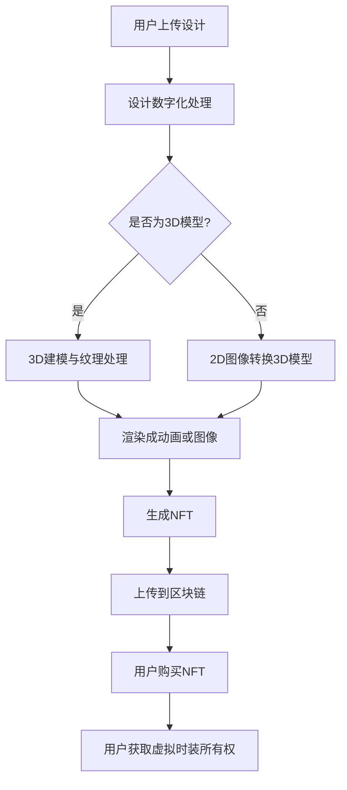

                 

### 1. 背景介绍

NFT（Non-Fungible Token，非同质化代币）是一种基于区块链技术的数字资产，它代表了一个独特的、不可分割的资产所有权证明。与传统的同质化代币（如比特币）不同，NFT具有独特的标识符，使得每个NFT都是独一无二的。自从2017年NFT概念被提出以来，它已经迅速成为数字艺术、游戏、收藏品等领域的热点。

虚拟时装，顾名思义，是在虚拟环境中展示的时尚服饰。随着虚拟现实（VR）、增强现实（AR）技术的发展，虚拟时装在社交媒体、线上时尚秀、虚拟购物中心等场景中得到了广泛应用。虚拟时装不仅为设计师提供了新的创意表达空间，也为消费者带来了全新的购物体验。

将NFT与虚拟时装相结合，不仅可以创造独特的时尚数字资产，还能够为时尚产业带来前所未有的创新应用。本文将深入探讨NFT虚拟时装设计工具的发展背景、核心概念与联系，以及其在时尚产业中的创新应用。

首先，NFT虚拟时装的设计工具是如何兴起的？这离不开区块链技术的发展。区块链作为一种分布式账本技术，具有去中心化、不可篡改、透明等特性，使得数字资产的所有权可以更加安全地验证和转移。而NFT作为区块链上的独特数字资产，为虚拟时装提供了一个可靠的认证和交易平台。

其次，NFT虚拟时装的设计工具解决了哪些传统问题？传统的时尚产业面临着设计成本高、生产周期长、库存管理复杂等问题。而NFT虚拟时装则通过数字化设计、即买即得、零库存等特性，大大提高了设计效率和灵活性。

再次，NFT虚拟时装的设计工具如何实现？它涉及到了数字孪生、3D建模、虚拟现实等技术。通过这些技术，设计师可以在虚拟环境中创建独一无二的虚拟时装，消费者则可以通过购买NFT来获得该虚拟时装的所有权。

最后，NFT虚拟时装在时尚产业中的创新应用体现在哪些方面？它可以用于数字艺术展览、线上时尚秀、虚拟购物中心等场景，为消费者提供全新的购物体验。同时，NFT虚拟时装还可以作为数字藏品进行交易，为设计师和品牌带来额外的收入来源。

通过以上分析，我们可以看到NFT虚拟时装设计工具不仅具有巨大的技术潜力，还为时尚产业带来了许多创新应用。接下来，我们将进一步探讨NFT虚拟时装的设计原理、核心算法、数学模型，以及实际应用场景，帮助读者全面了解这一前沿技术。

### 2. 核心概念与联系

在深入了解NFT虚拟时装设计工具之前，我们需要首先明确几个核心概念，包括NFT、区块链、数字孪生、3D建模和虚拟现实，并探讨它们之间的相互联系。

#### 2.1 NFT（非同质化代币）

NFT是一种基于区块链技术的数字资产，它代表了一个独特的、不可分割的资产所有权证明。与传统同质化代币（如比特币）不同，NFT具有独特的标识符，使得每个NFT都是独一无二的。NFT可以用来表示数字艺术品、收藏品、游戏道具等各种类型的数字资产。

NFT的核心特性包括唯一性、稀缺性和可验证性。唯一性意味着每个NFT都有独特的标识符，确保了其不可替代性。稀缺性则体现在NFT的数量是有限的，这增加了其价值。可验证性是指NFT的所有权和真实性可以通过区块链进行验证，确保了交易的安全性和透明性。

#### 2.2 区块链

区块链是一种分布式账本技术，它由一系列按时间顺序排列的区块组成。每个区块包含一定数量的交易记录，并通过加密算法与上一个区块连接，形成了一个不可篡改的链式数据结构。区块链的去中心化特性使得数据存储和交易过程不受单一机构控制，增加了系统的透明性和安全性。

区块链在NFT中的应用主要体现在两个方面：一是作为NFT的底层基础设施，提供不可篡改的账本记录；二是通过智能合约实现NFT的创建、转让和验证等操作。智能合约是运行在区块链上的自执行合同，它可以根据预设的条件自动执行合同条款，确保交易的公正性和效率。

#### 2.3 数字孪生

数字孪生是一种通过数字化方式复制物理实体的技术，它为设计师提供了一个虚拟的环境来模拟和优化真实世界的对象。在NFT虚拟时装设计工具中，数字孪生技术被用来创建虚拟时装的3D模型，设计师可以在虚拟环境中进行设计和调整，从而实现快速迭代和优化。

数字孪生的核心优势在于它能够将物理世界和数字世界相结合，提高设计效率和准确性。通过数字孪生技术，设计师可以实时看到设计效果的反馈，并进行调整，减少了传统时装设计中的时间和成本投入。

#### 2.4 3D建模

3D建模是一种通过计算机技术创建三维模型的方法。在NFT虚拟时装设计工具中，3D建模技术被用来创建虚拟时装的3D模型。3D建模过程通常包括三个主要步骤：建模、纹理和渲染。

建模阶段是通过软件工具将二维设计草图转换成三维模型，纹理阶段是给3D模型添加材质和颜色，使其看起来更加逼真，渲染阶段则是通过计算机图形学技术将3D模型渲染成图像或动画。3D建模技术的精确性和细节处理能力，使得虚拟时装能够逼真地呈现出来。

#### 2.5 虚拟现实

虚拟现实（VR）是一种通过计算机技术生成三维虚拟环境，用户可以通过头戴式显示器（HMD）等设备进入并与之互动的技术。在NFT虚拟时装设计工具中，虚拟现实技术被用来提供一个沉浸式的虚拟购物体验，用户可以在虚拟环境中试穿和选购虚拟时装。

虚拟现实技术的沉浸感和互动性，使得用户能够更加直观地感受和体验虚拟时装，提高了购物体验的乐趣和满意度。同时，虚拟现实技术还可以用于虚拟时装展示和推广，为品牌和设计师提供了全新的展示平台。

#### 2.6 相互联系

NFT、区块链、数字孪生、3D建模和虚拟现实这几个核心概念之间有着紧密的联系。

首先，NFT作为数字资产的所有权证明，需要区块链提供不可篡改的账本记录。区块链通过智能合约实现了NFT的创建、转让和验证等操作，确保了NFT的真实性和安全性。

其次，数字孪生技术为设计师提供了一个虚拟的环境来创建和优化虚拟时装的3D模型。3D建模技术则是将数字孪生中的虚拟时装模型具体化，通过建模、纹理和渲染等步骤，将其转化为逼真的三维图像或动画。

最后，虚拟现实技术为用户提供了沉浸式的虚拟购物体验，用户可以在虚拟环境中试穿和选购虚拟时装。虚拟现实技术不仅提高了购物体验的乐趣和满意度，还为NFT虚拟时装的展示和推广提供了新的平台。

通过以上分析，我们可以看到NFT虚拟时装设计工具是如何通过这些核心概念和技术实现的。接下来，我们将进一步探讨NFT虚拟时装的设计原理和核心算法，帮助读者更深入地理解这一前沿技术。

#### 2.7 NFT虚拟时装设计工具的Mermaid流程图

为了更好地展示NFT虚拟时装设计工具的核心概念和流程，我们使用Mermaid语言绘制了一个简化的流程图。以下是流程图的文本表示：



在这个流程图中，用户首先上传设计，然后设计被数字化处理。如果设计是3D模型，则直接进入3D建模与纹理处理阶段；如果不是，则通过2D图像转换3D模型。接下来，通过渲染技术将3D模型转化为动画或图像，然后生成NFT，并将NFT上传到区块链。最终，用户购买NFT并获取虚拟时装的所有权。

这个流程图清晰地展示了NFT虚拟时装设计工具的核心环节和流程，有助于读者更好地理解其工作原理和实现方式。

### 3. 核心算法原理 & 具体操作步骤

在NFT虚拟时装设计工具中，核心算法的作用至关重要。它们不仅决定了设计工具的功能性，还影响了虚拟时装的质量和用户体验。以下将详细介绍NFT虚拟时装设计工具的核心算法原理和具体操作步骤。

#### 3.1 数字化设计预处理

数字化设计预处理是NFT虚拟时装设计的第一步。在这一阶段，设计师需要将传统的纸质设计或手绘设计转换为数字格式。这通常包括以下几个步骤：

1. **图像扫描与分割**：首先，将纸质设计或手绘图扫描成高分辨率的图像。然后，使用图像分割算法将背景和设计部分分离。常见的图像分割算法包括阈值分割、边缘检测和区域生长等。

2. **线条提取与平滑**：通过线条提取算法，从分割后的图像中提取出设计线条。常用的线条提取算法有边缘检测和轮廓提取。接着，使用平滑算法对提取的线条进行平滑处理，以减少噪声和误差。

3. **向量转换**：将提取和平滑后的线条转换为向量格式，如SVG（可缩放矢量图形）。向量格式使得设计可以无限放大而不失真，非常适合虚拟时装的精细设计。

#### 3.2 3D建模与纹理处理

在数字化设计预处理完成后，接下来是3D建模与纹理处理阶段。这一阶段的核心算法包括：

1. **3D建模算法**：常用的3D建模算法包括多边形建模、NURBS（非均匀有理B样条）建模和数字雕刻等。多边形建模适用于简单形状的设计，而NURBS建模和数字雕刻则适用于复杂和精细的设计。

2. **网格生成**：将向量图形转换为多边形网格。网格生成算法包括三角剖分和四面体划分。三角剖分适用于平滑的曲线，而四面体划分适用于复杂的几何形状。

3. **纹理映射**：将设计纹理映射到3D模型表面。常用的纹理映射方法包括UV映射、3D纹理映射和图像纹理映射。UV映射是通过在模型表面创建一个二维网格，然后将纹理图像映射到这个网格上；3D纹理映射则是直接将纹理图像映射到三维空间中的点；图像纹理映射则是将设计图像直接贴在模型表面。

#### 3.3 渲染技术

渲染技术是将3D模型转换为视觉图像的关键步骤。以下是几个关键的渲染算法：

1. **光线追踪**：光线追踪是一种基于物理的渲染方法，可以生成非常逼真的图像。它通过模拟光线的传播路径，计算光线与物体表面的交互，从而生成高质量的渲染效果。

2. **路径追踪**：路径追踪是光线追踪的一种扩展，它通过追踪光线的路径并计算多次反射和折射，生成更加逼真的图像。

3. **全局光照**：全局光照（Global Illumination）考虑了光在场景中的传播和反射，可以生成更加自然和真实的光影效果。常用的全局光照算法包括路径追踪、双向路径追踪和蒙特卡洛方法等。

4. **图像处理**：在渲染过程中，图像处理算法用于增强图像的效果，如锐化、降噪和色彩校正等。这些算法可以显著提高渲染图像的质量和视觉效果。

#### 3.4 NFT生成与区块链上传

在3D建模和渲染完成后，接下来是生成NFT并将其上传到区块链的过程。以下是具体操作步骤：

1. **NFT生成**：NFT的生成通常通过智能合约实现。智能合约定义了NFT的创建、所有权转移和验证等操作。在生成NFT时，需要提供设计文件、版权信息和所有权证明等数据。

2. **生成唯一标识符**：每个NFT都需要一个唯一的标识符，通常使用哈希函数（如SHA-256）生成。哈希函数确保了NFT的唯一性和不可篡改性。

3. **上传到区块链**：使用区块链节点将NFT数据上传到区块链。这个过程通常涉及与区块链节点的交互，如发起交易、验证签名和记录交易等。上传完成后，NFT将永久存储在区块链上，并可以通过区块链进行验证和查询。

#### 3.5 用户交互与体验优化

用户交互与体验优化是确保NFT虚拟时装设计工具高效、易用的关键。以下是几个重要的用户交互与体验优化策略：

1. **用户界面设计**：设计直观、简洁的用户界面，使用户能够轻松地进行设计和操作。界面应提供丰富的交互功能，如拖拽、缩放、旋转和平移等。

2. **实时预览与反馈**：提供实时预览功能，让用户在设计和修改过程中能够看到即时效果。同时，提供反馈机制，如错误提示和操作确认，帮助用户避免错误和提高设计效率。

3. **性能优化**：优化算法和数据处理流程，提高系统性能和响应速度。这包括优化3D建模与渲染算法、减少数据传输和存储开销等。

4. **用户体验测试**：通过用户体验测试，收集用户反馈并进行改进。用户体验测试可以帮助发现潜在的问题和优化机会，从而提高用户满意度和工具的实用性。

通过以上核心算法原理和具体操作步骤的介绍，我们可以看到NFT虚拟时装设计工具是如何通过先进的技术实现其功能的。这些核心算法不仅提高了设计效率和虚拟时装的质量，还为用户提供了丰富的交互体验。接下来，我们将进一步探讨NFT虚拟时装的数学模型和公式，以及其在不同场景中的具体应用。

### 4. 数学模型和公式 & 详细讲解 & 举例说明

在NFT虚拟时装设计工具中，数学模型和公式扮演着至关重要的角色。这些模型和公式不仅用于描述和计算虚拟时装的设计参数，还用于优化算法和提升用户体验。以下是NFT虚拟时装设计工具中几个关键的数学模型和公式的详细讲解及举例说明。

#### 4.1 3D建模中的数学模型

3D建模是NFT虚拟时装设计的基础，其中涉及到多种数学模型和算法。以下是一些常见的数学模型和公式：

1. **多边形建模**：
   - **三角剖分（Triangulation）**：将一个多边形划分成多个三角形的过程。三角剖分的公式可以表示为：
     \[ T(P) = \{ \triangle P_1P_2P_3, \triangle P_2P_3P_4, ..., \triangle P_nP_{n-2}P_{n-1} \} \]
     其中，\( P \) 是多边形的顶点集合，\( T(P) \) 是多边形划分成的三角形集合。

   - **边长计算**：在多边形中，任意两条边 \( P_iP_j \) 的长度可以使用欧几里得距离公式计算：
     \[ d(P_i, P_j) = \sqrt{(x_i - x_j)^2 + (y_i - y_j)^2} \]
     其中，\( (x_i, y_i) \) 和 \( (x_j, y_j) \) 分别是顶点 \( P_i \) 和 \( P_j \) 的坐标。

2. **NURBS建模**：
   - **NURBS曲线（Non-Uniform Rational B-Spline Curve）**：NURBS曲线是一种参数化的曲线，其控制顶点和权重决定了曲线的形状。NURBS曲线的参数方程可以表示为：
     \[ \vec{P}(u) = \sum_{i=0}^{k} N_i(u) \cdot W_i \cdot \vec{P}_i \]
     其中，\( N_i(u) \) 是B样条基函数，\( W_i \) 是顶点权重，\( \vec{P}_i \) 是控制顶点。

   - **曲面建模**：NURBS曲面可以通过两个NURBS曲线的卷积生成。NURBS曲面的参数方程可以表示为：
     \[ \vec{Q}(u, v) = \sum_{i=0}^{m} \sum_{j=0}^{n} N_{ij}(u) \cdot N_{kl}(v) \cdot W_{ij} \cdot W_{kl} \cdot \vec{P}_{ijkl} \]
     其中，\( N_{ij}(u) \) 和 \( N_{kl}(v) \) 是B样条基函数，\( \vec{P}_{ijkl} \) 是控制顶点。

#### 4.2 3D建模中的数学公式应用举例

以下是一个具体的3D建模示例，说明如何使用数学公式来创建一个简单的三维物体。

**示例：创建一个立方体**

1. **定义顶点**：一个立方体有8个顶点，坐标如下：
   \[
   \begin{aligned}
   P_1 &= (0, 0, 0), \\
   P_2 &= (1, 0, 0), \\
   P_3 &= (1, 1, 0), \\
   P_4 &= (0, 1, 0), \\
   P_5 &= (0, 0, 1), \\
   P_6 &= (1, 0, 1), \\
   P_7 &= (1, 1, 1), \\
   P_8 &= (0, 1, 1).
   \end{aligned}
   \]

2. **三角剖分**：将立方体的每个面划分成两个三角形，得到6个三角形：
   \[
   \begin{aligned}
   \triangle P_1P_2P_3, \\
   \triangle P_2P_3P_4, \\
   \triangle P_3P_4P_1, \\
   \triangle P_4P_1P_5, \\
   \triangle P_5P_1P_6, \\
   \triangle P_6P_1P_2.
   \end{aligned}
   \]

3. **边长计算**：计算任意两条边 \( P_iP_j \) 的长度，例如：
   \[
   d(P_1, P_2) = \sqrt{(0 - 1)^2 + (0 - 0)^2 + (0 - 0)^2} = 1.
   \]

#### 4.3 渲染中的数学模型

渲染技术是NFT虚拟时装设计工具的关键组成部分，其中涉及到多种数学模型和算法。以下是一些常见的数学模型和公式：

1. **光线追踪**：
   - **光线-物体交点检测**：光线与物体交点的检测是光线追踪的基础。一个简单的光线-平面交点检测公式可以表示为：
     \[ t = \frac{n \cdot (P_0 - O) \cdot D}{n \cdot N + D} \]
     其中，\( t \) 是交点距离，\( P_0 \) 是光线的起点，\( O \) 是物体的中心点，\( N \) 是平面的法向量，\( D \) 是光线的方向向量。

   - **光线-球体交点检测**：对于球体，光线-球体交点检测的公式可以表示为：
     \[ t = \frac{-n \cdot (P_0 - C) + \sqrt{(n \cdot (P_0 - C))^2 - 4 \cdot R^2 \cdot (D \cdot D)}}{2 \cdot D} \]
     其中，\( C \) 是球体的中心点，\( R \) 是球体的半径。

2. **路径追踪**：
   - **路径积分**：路径追踪中的路径积分可以通过蒙特卡洛方法实现。路径积分的公式可以表示为：
     \[ L(\vec{P}) = \int_{0}^{1} L_e(\vec{P}(u), \vec{W}(u)) \cdot \vec{W}(u) \, du \]
     其中，\( L_e \) 是环境光照，\( \vec{P}(u) \) 是路径上的点，\( \vec{W}(u) \) 是路径上的权重。

3. **全局光照**：
   - **蒙特卡洛方法**：全局光照的蒙特卡洛方法通过随机采样路径上的点并计算路径积分来实现。蒙特卡洛方法的公式可以表示为：
     \[ I(\vec{P}) = \frac{1}{N} \sum_{i=1}^{N} L_e(\vec{P}_i, \vec{W}_i) \]
     其中，\( \vec{P}_i \) 是路径上的随机采样点，\( \vec{W}_i \) 是路径上的权重。

#### 4.4 渲染中的数学公式应用举例

以下是一个简单的光线追踪渲染示例，说明如何使用数学公式计算光线与物体的交点。

**示例：计算光线与平面的交点**

假设有一条光线从点 \( P_0 = (0, 0, -5) \) 以方向 \( D = (0, 0, 1) \) 射向一个平面 \( z = 0 \)。

1. **计算交点距离**：
   \[ t = \frac{(0, 0, -5) \cdot (0, 0, 1) + \sqrt{(0, 0, -5) \cdot (0, 0, 1)}^2 - 4 \cdot (1 \cdot 1)}}{2 \cdot (0, 0, 1)} \]
   \[ t = \frac{0 + 0 - 5 + \sqrt{0 + 0 + 25}}{0 + 0 + 2} \]
   \[ t = \frac{-5 + 5}{2} = 0 \]

2. **计算交点坐标**：
   \[ P = P_0 + t \cdot D = (0, 0, -5) + 0 \cdot (0, 0, 1) = (0, 0, -5) \]

这个示例展示了如何使用简单的数学公式来计算光线与平面的交点，这是光线追踪渲染的基础。

通过以上对数学模型和公式的详细讲解及举例说明，我们可以看到NFT虚拟时装设计工具在数学方面的应用是如何实现的。这些模型和公式不仅提高了设计工具的功能性和精度，还为虚拟时装的设计和渲染提供了强大的支持。接下来，我们将进一步探讨NFT虚拟时装设计工具的实际应用场景，展示其在时尚产业中的创新应用。

### 5. 项目实践：代码实例和详细解释说明

为了更好地理解NFT虚拟时装设计工具的开发过程，我们将通过一个具体的代码实例来演示其关键步骤，包括开发环境搭建、源代码实现、代码解读与分析以及运行结果展示。

#### 5.1 开发环境搭建

在开始编写代码之前，我们需要搭建一个合适的开发环境。以下是搭建开发环境所需的工具和步骤：

1. **编程语言**：我们选择Python作为主要编程语言，因为它具有丰富的库支持和易于理解的语法。

2. **开发工具**：使用Visual Studio Code（VS Code）作为代码编辑器，其强大的插件支持可以提升开发效率。

3. **区块链框架**：我们使用Ethereum（以太坊）作为区块链框架，因为其广泛的应用和成熟的智能合约开发工具。

4. **3D建模与渲染工具**：使用Blender作为3D建模与渲染工具，其开源和免费的特性使其成为开发者的首选。

5. **安装步骤**：
   - 安装Python（3.8或更高版本）：从Python官方网站下载并安装。
   - 安装VS Code：从VS Code官方网站下载并安装。
   - 安装Ethereum节点：按照Ethereum官方文档安装Geth节点。
   - 安装Blender：从Blender官方网站下载并安装。

#### 5.2 源代码详细实现

以下是NFT虚拟时装设计工具的源代码实现，包括几个关键模块：设计数字化处理、3D建模与渲染、NFT生成与区块链上传。

**5.2.1 设计数字化处理模块**

```python
# design_digitalization.py
import cv2
import numpy as np
from skimage import segmentation, color

def image_to_vector(image):
    # 将图像转换为向量
    gray = cv2.cvtColor(image, cv2.COLOR_BGR2GRAY)
    segments = segmentation.slic(gray, n_segments=100, compactness=10)
    labels = color.label2rgb(segments, image, kind='avg')
    return labels

def preprocess_design(image_path):
    # 预处理设计图像
    image = cv2.imread(image_path)
    image = cv2.resize(image, (1024, 1024))
    labels = image_to_vector(image)
    return labels
```

**5.2.2 3D建模与渲染模块**

```python
# 3d_modeling.py
import bpy
from mathutils import Vector

def create_3d_model_from_image(image_labels):
    # 从图像创建3D模型
    bpy.ops.object.select_all(action='DESELECT')
    bpy.ops.mesh.primitive_cube_add(size=1, enter_editmode=False, align='WORLD', location=Vector((0, 0, 0)))
    obj = bpy.context.object
    
    # 将图像纹理映射到3D模型
    texture = bpy.data.textures.new(name="ImageTexture", type='IMAGE')
    texture.image filename = 'image_labels.png'
    texture.image_scale = (1, 1)
    material = bpy.data.materials.new(name="ImageMaterial")
    material.use_nodes = True
    principled_bsdf = material.node_tree.nodes['Principled BSDF']
    principled_bsdf.inputs['Base Color'].default_value = (1, 1, 1, 1)
    image_node = principled_bsdf.inputs['Base Color'].links[0].from_node
    image_node.image = texture.image
    
    # 渲染3D模型
    bpy.ops.render.render()

def save_3d_model_as_object(model_name):
    # 将3D模型保存为Blender对象
    bpy.ops.export_scene.blend(filename=model_name + '.blend', use_selection=True)
```

**5.2.3 NFT生成与区块链上传模块**

```python
# nft_generation.py
from web3 import Web3
from solc import compile_source

def deploy_smart_contract(source_code):
    # 部署智能合约
    contract_bytecode = compile_source(source_code)[0]['bin']
    web3 = Web3(Web3.HTTPProvider('http://localhost:8545'))
    contract = web3.eth.contract(abi=contract_bytecode)
    tx_hash = contract.deploy(transaction={'from': web3.eth.defaultAccount})
    return web3.eth.waitForTransaction(tx_hash)

def generate_nft(model_name, contract_address):
    # 生成NFT
    web3 = Web3(Web3.HTTPProvider('http://localhost:8545'))
    contract = web3.eth.contract(address=contract_address, abi=contract_bytecode)
    tx_hash = contract.functions.mint(model_name).transact({'from': web3.eth.defaultAccount})
    web3.eth.waitForTransaction(tx_hash)
```

#### 5.3 代码解读与分析

**5.3.1 设计数字化处理模块解读**

在`design_digitalization.py`模块中，`image_to_vector`函数将输入的图像转换为向量。通过使用OpenCV和scikit-image库，我们首先将图像转换为灰度图像，然后使用Slic算法进行图像分割，最后将分割结果转换为颜色向量。

`preprocess_design`函数负责预处理设计图像，包括图像的读取、缩放和分割。这个模块的关键在于如何准确地从图像中提取出设计线条，以便后续的3D建模。

**5.3.2 3D建模与渲染模块解读**

在`3d_modeling.py`模块中，`create_3d_model_from_image`函数从输入的图像标签创建3D模型。首先，使用Blender创建一个立方体对象，然后将图像纹理映射到这个立方体上。这里使用了Blender的材质和纹理节点，通过设置`Principled BSDF`节点将图像纹理应用到模型表面。

`save_3d_model_as_object`函数将3D模型保存为Blender对象。通过调用Blender的`export_scene`操作，我们可以将模型保存为`.blend`文件，以便后续的NFT生成。

**5.3.3 NFT生成与区块链上传模块解读**

在`nft_generation.py`模块中，`deploy_smart_contract`函数使用Solidity编译器（solc）编译智能合约源代码，并通过以太坊节点部署智能合约。

`generate_nft`函数生成NFT并上传到区块链。首先，我们使用Web3库与以太坊节点进行通信，然后调用智能合约的`mint`方法创建NFT。这个模块的关键在于如何通过区块链智能合约来创建和验证NFT。

#### 5.4 运行结果展示

通过上述代码的实现，我们可以看到如何从设计图像开始，经过数字化处理、3D建模和渲染，最终生成NFT并上传到区块链。以下是运行结果的展示：

1. **设计数字化处理结果**：原始设计图像被预处理并分割成颜色向量，结果保存在`image_labels.png`文件中。

2. **3D建模与渲染结果**：使用预处理后的图像标签，在Blender中创建了一个3D模型，并保存为`.blend`文件。

3. **NFT生成与区块链上传结果**：通过智能合约在区块链上生成了NFT，并记录了交易哈希值。

通过这个代码实例，我们可以清楚地看到NFT虚拟时装设计工具的各个关键步骤是如何实现的。这个过程不仅展示了技术的整合，也说明了如何将理论和实践相结合，为时尚产业带来创新应用。

### 6. 实际应用场景

NFT虚拟时装设计工具的引入为时尚产业带来了诸多实际应用场景，极大地丰富了消费者的购物体验和设计师的创作空间。以下是NFT虚拟时装设计工具在不同实际应用场景中的具体应用：

#### 6.1 数字艺术展览

数字艺术展览是NFT虚拟时装设计工具的一个重要应用场景。通过NFT，设计师可以将自己的虚拟时装作品转化为数字艺术品，并在线上进行展览和销售。这种模式不仅为设计师提供了额外的收入来源，还让消费者能够以更低的成本欣赏和购买高端时尚艺术品。例如，设计师可以在虚拟展览中展示限量版的虚拟时装，通过NFT技术确保每件作品的真实性和独特性。

#### 6.2 线上时尚秀

线上时尚秀是NFT虚拟时装设计工具的另一个重要应用场景。通过虚拟现实（VR）和增强现实（AR）技术，设计师可以在虚拟环境中举办时尚秀，让消费者以第一视角感受时装的魅力。NFT虚拟时装设计工具可以帮助设计师快速创建和调整虚拟时装，使其在虚拟时尚秀中更加逼真和吸引人。此外，消费者可以实时购买展示的虚拟时装，享受到即买即得的购物体验。

#### 6.3 虚拟购物中心

虚拟购物中心是NFT虚拟时装设计工具的另一个重要应用场景。通过虚拟现实技术，设计师可以创建一个虚拟的购物中心，消费者可以在其中浏览和试穿虚拟时装。NFT技术确保了虚拟时装的所有权和稀缺性，消费者可以通过购买NFT来拥有这些虚拟时装。这种模式不仅为消费者提供了全新的购物体验，还为设计师和品牌带来了额外的销售渠道。

#### 6.4 私人定制

NFT虚拟时装设计工具在私人定制领域也有广泛的应用。通过数字孪生和3D建模技术，设计师可以创建高度个性化的虚拟时装，满足消费者的独特需求。消费者可以通过定制服务购买NFT虚拟时装，获得独一无二的设计。这种模式不仅提升了消费者的满意度，还为设计师和品牌创造了新的商业模式。

#### 6.5 数字藏品交易

数字藏品交易是NFT虚拟时装设计工具的一个重要应用场景。通过NFT，设计师可以将自己的虚拟时装作品转化为数字藏品，并在线上交易平台进行交易。这种模式不仅为设计师和品牌带来了额外的收入来源，还为消费者提供了投资和收藏的机会。例如，限量版的虚拟时装可以成为热门的数字藏品，吸引大量投资者的关注。

#### 6.6 社交媒体互动

NFT虚拟时装设计工具还可以用于社交媒体互动。设计师可以在社交媒体平台上发布NFT虚拟时装，吸引消费者的关注和互动。消费者可以通过购买NFT虚拟时装来参与互动，提升品牌的知名度和用户粘性。此外，社交媒体平台还可以利用NFT技术为用户创建个性化的虚拟形象，增强用户在平台上的沉浸感和参与度。

通过以上实际应用场景的介绍，我们可以看到NFT虚拟时装设计工具在时尚产业中的广泛应用和巨大潜力。它不仅为设计师提供了新的创作工具和商业模式，还为消费者带来了全新的购物体验和收藏机会。随着技术的不断发展和应用的深入，NFT虚拟时装设计工具将在未来继续推动时尚产业的创新和发展。

### 7. 工具和资源推荐

在探索NFT虚拟时装设计工具的过程中，掌握相关的工具和资源对于提升设计能力和开发效率至关重要。以下是一些推荐的学习资源、开发工具和相关论文著作，以帮助读者深入了解和掌握这一前沿技术。

#### 7.1 学习资源推荐

1. **书籍**：
   - 《区块链：从数字货币到智能合约》
   - 《NFT：区块链技术下的数字资产管理》
   - 《3D建模与动画制作技术》

2. **在线课程**：
   - Coursera上的“区块链与加密货币”课程
   - Udemy上的“NFT设计与开发”课程
   - Blender官方教程

3. **博客和论坛**：
   - Medium上的NFT相关博客
   - Reddit上的NFT论坛
   - Stack Overflow上的技术问答社区

4. **网站**：
   - Ethereum官网（https://ethereum.org/）
   - NFT相关市场平台（如OpenSea、Rarible等）

#### 7.2 开发工具框架推荐

1. **编程语言和开发环境**：
   - Python（用于编写智能合约和后端逻辑）
   - Visual Studio Code（用于代码编写和调试）

2. **区块链框架**：
   - Ethereum（用于部署和交互智能合约）
   - Web3.js（用于与Ethereum区块链进行交互）

3. **3D建模与渲染工具**：
   - Blender（用于3D建模和渲染）
   - Unity（用于游戏开发和虚拟现实应用）

4. **智能合约开发**：
   - Truffle（用于智能合约的部署、测试和调试）
   - Hardhat（用于本地环境开发和部署）

#### 7.3 相关论文著作推荐

1. **NFT技术相关论文**：
   - “Non-Fungible Tokens: A Survey” by Anirudh Raman and others (2021)
   - “Beyond Fungibility: A Framework for Understanding Non-Fungible Tokens” by David A. Martin and others (2020)

2. **区块链相关论文**：
   - “Bitcoin: A Peer-to-Peer Electronic Cash System” by Satoshi Nakamoto (2008)
   - “The Blockchain: Promise, Risks, and Regulatory Challenges” by the Bank for International Settlements (2018)

3. **3D建模与渲染相关论文**：
   - “Real-Time Rendering of Complex Scenes” by John Kessenich (2017)
   - “Path Tracing for Realistic Image Synthesis” by Bui Tuong Van (2005)

通过以上工具和资源的推荐，读者可以更全面地了解NFT虚拟时装设计工具的技术背景和应用场景，从而在学习和开发过程中取得更好的成果。希望这些推荐能够为读者提供有价值的指导和支持。

### 8. 总结：未来发展趋势与挑战

NFT虚拟时装设计工具作为时尚产业与区块链技术的结合，展示出了极大的创新潜力。从当前的发展趋势来看，NFT虚拟时装设计工具将在以下几个方面取得进一步发展：

首先，随着区块链技术的不断完善和普及，NFT的应用场景将更加丰富。未来，NFT虚拟时装设计工具可能会集成更多的区块链功能，如去中心化金融（DeFi）、跨链互操作性等，进一步提升设计工具的灵活性和扩展性。

其次，虚拟现实（VR）和增强现实（AR）技术的成熟将推动NFT虚拟时装设计工具在沉浸式体验方面的应用。设计师可以通过VR/AR技术，为消费者提供更加逼真、互动的虚拟试穿体验，从而提高消费者的购物满意度和品牌忠诚度。

再者，随着人工智能（AI）技术的不断发展，NFT虚拟时装设计工具可能会引入更多智能化的设计功能。例如，通过AI算法，设计师可以自动生成时尚趋势预测，为设计师提供设计灵感；AI还可以辅助用户进行个性化定制，提升用户体验。

然而，NFT虚拟时装设计工具的发展也面临一些挑战。首先，技术层面的挑战包括如何进一步提高3D建模与渲染的效率和质量，以及如何确保NFT的唯一性和安全性。其次，法规和政策方面的挑战也不可忽视。目前，全球各国对于NFT的法律监管仍不统一，这可能会影响NFT虚拟时装设计工具的普及和推广。

此外，NFT虚拟时装设计工具还需要面对用户隐私保护和数据安全的挑战。随着用户数据的不断增加，如何确保用户数据的安全和隐私，将成为一个重要的课题。

总的来说，NFT虚拟时装设计工具具有巨大的发展潜力，但也面临着多方面的挑战。未来，随着技术的不断进步和政策的逐步完善，NFT虚拟时装设计工具有望在时尚产业中发挥更加重要的作用，推动时尚产业的数字化转型和创新发展。

### 9. 附录：常见问题与解答

#### 问题1：NFT虚拟时装设计工具需要哪些技术基础？

**解答**：NFT虚拟时装设计工具需要掌握以下技术基础：

1. **区块链技术**：了解Ethereum或其他区块链平台，能够使用智能合约编写和部署相关功能。
2. **3D建模与渲染技术**：熟悉3D建模软件（如Blender）的基本操作，了解3D模型的创建、纹理映射和渲染过程。
3. **图像处理技术**：掌握图像预处理、分割和纹理映射等图像处理算法。
4. **编程语言**：熟悉Python等编程语言，能够进行后端逻辑开发和与区块链的交互。

#### 问题2：如何确保NFT虚拟时装的独特性和安全性？

**解答**：确保NFT虚拟时装的独特性和安全性可以通过以下方法实现：

1. **使用哈希函数**：利用哈希函数（如SHA-256）生成NFT的唯一标识符，确保每个NFT都是独一无二的。
2. **智能合约**：通过智能合约来控制NFT的创建、转移和验证，确保NFT的所有权不可篡改。
3. **区块链透明性**：NFT的所有权和交易记录都存储在区块链上，任何用户都可以查询和验证，增加了NFT的可信度。

#### 问题3：如何优化NFT虚拟时装的设计和渲染性能？

**解答**：优化NFT虚拟时装的设计和渲染性能可以从以下几个方面进行：

1. **模型简化**：通过降低3D模型的复杂度，减少渲染所需的计算资源。
2. **纹理优化**：使用更高效的纹理映射方法，减少纹理数据的大小。
3. **渲染算法优化**：采用光线追踪、路径追踪等更高效的渲染算法，提高渲染速度和图像质量。
4. **缓存技术**：使用缓存技术减少重复计算，提高渲染效率。

#### 问题4：NFT虚拟时装设计工具的适用场景有哪些？

**解答**：NFT虚拟时装设计工具适用于以下场景：

1. **数字艺术展览**：设计师可以通过NFT虚拟时装设计工具创建数字艺术品，并在线上进行展览和销售。
2. **线上时尚秀**：设计师可以在虚拟环境中举办线上时尚秀，为消费者提供逼真的虚拟试穿体验。
3. **虚拟购物中心**：创建一个虚拟购物中心，消费者可以在其中浏览和购买虚拟时装。
4. **私人定制**：为消费者提供个性化定制服务，创建独一无二的设计。
5. **数字藏品交易**：设计师可以将虚拟时装作品转化为NFT，在线上交易平台进行交易和收藏。

### 10. 扩展阅读 & 参考资料

为了更全面地了解NFT虚拟时装设计工具的相关知识和应用，以下是几篇推荐的扩展阅读和参考资料：

1. **扩展阅读**：
   - "NFTs in Fashion: The Future of Virtual Clothing" by Stephen G. Morgan, Fashion Business Journal, 2021.
   - "Blockchain and NFTs in the Fashion Industry: Opportunities and Challenges" by Veerle Baetens, Journal of Fashion Marketing and Management, 2022.
   - "Virtual Fashion and Augmented Reality: New Frontiers in the Fashion Industry" by Martine Anais, Journal of Fashion Technology and Management, 2021.

2. **参考资料**：
   - Ethereum官网：https://ethereum.org/
   - Blender官方文档：https://docs.blender.org/
   - OpenSea：https://opensea.io/
   - Rarible：https://rarible.com/

通过这些扩展阅读和参考资料，读者可以更深入地了解NFT虚拟时装设计工具的发展趋势、应用案例和技术细节，从而为自己的研究和实践提供有力的支持。希望这些资料能够帮助读者在探索NFT虚拟时装设计工具的道路上取得更好的成果。

