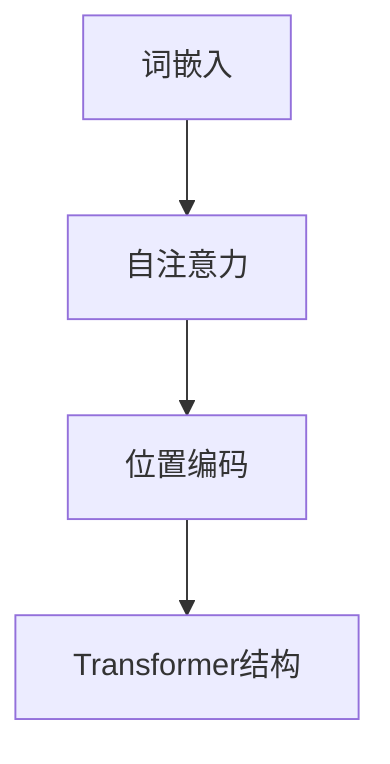

                 

### 1. 背景介绍

自然语言处理（NLP）是计算机科学与人工智能领域的一个重要分支，它致力于让计算机能够理解、生成和处理人类自然语言。随着互联网和大数据的迅猛发展，NLP的应用场景也越来越广泛，从基本的文本分类、情感分析，到复杂的机器翻译、对话系统等。而近年来，大规模预训练语言模型（Large-scale Pre-trained Language Models）的出现，更是将NLP推向了一个全新的高度。

大规模预训练语言模型，如Google的BERT、OpenAI的GPT-3、以及百度的飞桨文心大模型等，凭借其强大的参数规模和深度学习的能力，在各个NLP任务上都取得了显著的成果。然而，这些模型在参数规模、训练数据和计算资源等方面的差异，也导致它们在性能和应用范围上存在一定的差异。因此，有必要对NLP大模型的参数设置和能力进行深入的研究和探讨，以便更好地理解和利用这些模型。

本文旨在从参数和能力的角度，对NLP大模型进行全面的剖析。我们将首先介绍NLP大模型的核心概念和架构，然后深入探讨其核心算法原理、数学模型和公式，并通过实际项目实践进行详细解释。最后，我们将探讨NLP大模型在实际应用中的场景，并推荐相关的工具和资源，以帮助读者更好地学习和应用这些模型。

### 2. 核心概念与联系

#### 2.1 大规模预训练语言模型简介

大规模预训练语言模型，是指通过在大量文本数据上进行预训练，从而获得强大的语言理解和生成能力的人工智能模型。这些模型通常具有数十亿到千亿个参数，能够自动学习语言中的语法、语义和上下文信息。

##### 2.1.1 参数规模

参数规模是衡量一个预训练语言模型能力的重要指标。较大的参数规模意味着模型能够捕捉到更多、更复杂的语言特征，从而在下游任务中表现出更高的性能。例如，BERT模型包含超过3亿个参数，而GPT-3的参数规模更是达到了惊人的1750亿个。

##### 2.1.2 预训练数据

预训练数据是模型能力的基础。一个优秀的预训练语言模型需要在大规模、多样化的数据集上进行训练，以确保模型能够学习到丰富、多样的语言特征。例如，BERT模型使用了来自维基百科、书籍、新闻、论坛等多种来源的数万亿个单词作为预训练数据。

##### 2.1.3 计算资源

大规模预训练语言模型的训练需要大量的计算资源，特别是GPU或TPU等高性能计算设备。这使得训练成本变得非常高昂，同时也限制了模型的应用范围。

#### 2.2 语言模型的基本架构

一个典型的预训练语言模型通常包括以下几个关键组件：

##### 2.2.1 词嵌入（Word Embedding）

词嵌入是将单词映射到高维向量空间的过程。通过词嵌入，模型能够学习到单词之间的语义关系，如相似性、关联性等。

##### 2.2.2 自注意力机制（Self-Attention）

自注意力机制是预训练语言模型的核心，它允许模型在处理每个单词时，动态地关注其他单词的重要性，从而更好地捕捉上下文信息。

##### 2.2.3 位置编码（Positional Encoding）

由于语言模型通常无法直接处理序列信息，位置编码是一种技巧，用于为每个单词提供其相对于其他单词的位置信息。

##### 2.2.4 Transformer结构

Transformer结构是一种基于自注意力机制的序列建模模型，广泛应用于预训练语言模型。它具有并行处理能力，能够显著提高模型的训练效率。

#### 2.3 大模型与传统模型对比

与传统模型相比，大规模预训练语言模型具有以下几个显著优势：

##### 2.3.1 更强的语言理解能力

大规模预训练语言模型能够通过大量无监督学习，自动学习到丰富的语言特征，从而在下游任务中表现出更强的语言理解能力。

##### 2.3.2 更高的泛化能力

由于预训练数据规模巨大，大规模预训练语言模型在多种下游任务上表现出较高的泛化能力，无需针对每个任务进行专门训练。

##### 2.3.3 更高的计算效率

尽管大规模预训练语言模型的训练成本较高，但一旦训练完成，其在下游任务上的推理速度非常快，具有很高的计算效率。

#### 2.4 Mermaid流程图

下面是一个简化的Mermaid流程图，展示了大规模预训练语言模型的基本架构：



### 3. 核心算法原理 & 具体操作步骤

#### 3.1 词嵌入（Word Embedding）

词嵌入是将单词映射到高维向量空间的过程。常见的词嵌入方法包括Word2Vec、GloVe和BERT等。

##### 3.1.1 Word2Vec

Word2Vec是一种基于神经网络的词嵌入方法，它通过训练神经网络来预测上下文中的单词。具体来说，Word2Vec分为连续词袋（CBOW）和跳词（Skip-Gram）两种模型。

1. **连续词袋（CBOW）**：给定一个单词作为中心词，神经网络会预测其上下文窗口内的单词。
2. **跳词（Skip-Gram）**：给定一个单词，神经网络会预测其上下文中的所有单词。

##### 3.1.2 GloVe

GloVe（Global Vectors for Word Representation）是一种基于共现矩阵的词嵌入方法。GloVe通过计算单词之间的共现频率，学习到单词的向量表示。

1. **训练过程**：
   1. 计算共现矩阵，其中每个元素表示两个单词在文本中的共现次数。
   2. 训练一个基于矩阵分解的线性模型，将共现矩阵分解为单词向量的乘积。

##### 3.1.3 BERT

BERT（Bidirectional Encoder Representations from Transformers）是一种基于Transformer的预训练语言模型，它通过双向编码器学习到单词的上下文表示。

1. **训练过程**：
   1. 对文本进行分词，并将每个词映射到一个词嵌入向量。
   2. 对每个词嵌入向量添加位置编码，以表示其相对于其他词的位置。
   3. 将词嵌入向量输入到Transformer编码器中，学习到单词的上下文表示。

#### 3.2 自注意力机制（Self-Attention）

自注意力机制是预训练语言模型的核心，它允许模型在处理每个单词时，动态地关注其他单词的重要性。

##### 3.2.1 原理

自注意力机制通过计算每个单词与其余单词的相似度，然后将这些相似度权重应用于输入的词嵌入向量，从而生成每个单词的上下文表示。

##### 3.2.2 具体操作

1. **计算相似度**：使用点积、缩放点积或多头自注意力机制，计算每个单词与其余单词的相似度。
2. **应用权重**：将相似度权重应用于输入的词嵌入向量，生成每个单词的上下文表示。
3. **合并表示**：将所有单词的上下文表示进行合并，生成整个句子的表示。

#### 3.3 位置编码（Positional Encoding）

由于语言模型通常无法直接处理序列信息，位置编码是一种技巧，用于为每个单词提供其相对于其他单词的位置信息。

##### 3.3.1 原理

位置编码通过为每个词嵌入向量添加一个位置向量，从而为每个单词提供位置信息。

##### 3.3.2 具体操作

1. **生成位置向量**：根据单词在序列中的位置生成位置向量，例如使用正弦和余弦函数。
2. **添加位置向量**：将位置向量添加到词嵌入向量中，得到最终的位置编码向量。

#### 3.4 Transformer结构

Transformer是一种基于自注意力机制的序列建模模型，广泛应用于预训练语言模型。

##### 3.4.1 原理

Transformer通过多层自注意力机制和前馈神经网络，对输入的序列数据进行建模。

##### 3.4.2 具体操作

1. **输入序列**：将输入的序列数据（例如单词）转换为词嵌入向量。
2. **位置编码**：为每个词嵌入向量添加位置编码，以表示其位置信息。
3. **自注意力机制**：使用多层自注意力机制，计算每个单词的上下文表示。
4. **前馈神经网络**：对每个单词的上下文表示进行前馈神经网络处理。
5. **输出**：生成最终的序列表示。

### 4. 数学模型和公式 & 详细讲解 & 举例说明

#### 4.1 词嵌入（Word Embedding）

词嵌入是将单词映射到高维向量空间的过程，其数学模型如下：

$$
\text{Embedding}(w) = e_w \in \mathbb{R}^d
$$

其中，$w$ 是单词，$e_w$ 是单词的词嵌入向量，$d$ 是词嵌入向量的维度。

#### 4.2 自注意力机制（Self-Attention）

自注意力机制是预训练语言模型的核心，其数学模型如下：

$$
\text{Attention}(Q, K, V) = \text{softmax}\left(\frac{QK^T}{\sqrt{d_k}}\right)V
$$

其中，$Q, K, V$ 分别是查询向量、键向量和值向量，$d_k$ 是键向量的维度。

#### 4.3 位置编码（Positional Encoding）

位置编码用于为每个单词提供其相对于其他单词的位置信息，其数学模型如下：

$$
\text{Positional Encoding}(p) = PE_p \in \mathbb{R}^d
$$

其中，$p$ 是单词在序列中的位置，$PE_p$ 是位置向量，$d$ 是位置向量的维度。

#### 4.4 Transformer结构

Transformer结构是一种基于自注意力机制的序列建模模型，其数学模型如下：

$$
\text{Transformer}(X) = \text{Encoder}(X) = \text{MultiHeadAttention}(X) + \text{FeedForward}(X)
$$

其中，$X$ 是输入序列，$\text{Encoder}$ 是编码器，$\text{MultiHeadAttention}$ 是多头自注意力机制，$\text{FeedForward}$ 是前馈神经网络。

#### 4.5 举例说明

假设我们有一个句子：“我昨天去了公园”。我们将使用BERT模型对其进行编码，并计算其自注意力权重。

1. **词嵌入**：首先，我们将句子中的每个词映射到其词嵌入向量。

$$
\text{Embedding}(\text{我}) = e_{\text{我}} \in \mathbb{R}^{d}
$$

$$
\text{Embedding}(\text{昨}) = e_{\text{昨}} \in \mathbb{R}^{d}
$$

$$
\text{Embedding}(\text{天}) = e_{\text{天}} \in \mathbb{R}^{d}
$$

$$
\text{Embedding}(\text{去}) = e_{\text{去}} \in \mathbb{R}^{d}
$$

$$
\text{Embedding}(\text{了}) = e_{\text{了}} \in \mathbb{R}^{d}
$$

$$
\text{Embedding}(\text{公}) = e_{\text{公}} \in \mathbb{R}^{d}
$$

$$
\text{Embedding}(\text{园}) = e_{\text{园}} \in \mathbb{R}^{d}
$$

2. **位置编码**：接下来，我们将为每个词嵌入向量添加位置编码。

$$
\text{Positional Encoding}(\text{我}) = PE_{\text{我}} \in \mathbb{R}^{d}
$$

$$
\text{Positional Encoding}(\text{昨}) = PE_{\text{昨}} \in \mathbb{R}^{d}
$$

$$
\text{Positional Encoding}(\text{天}) = PE_{\text{天}} \in \mathbb{R}^{d}
$$

$$
\text{Positional Encoding}(\text{去}) = PE_{\text{去}} \in \mathbb{R}^{d}
$$

$$
\text{Positional Encoding}(\text{了}) = PE_{\text{了}} \in \mathbb{R}^{d}
$$

$$
\text{Positional Encoding}(\text{公}) = PE_{\text{公}} \in \mathbb{R}^{d}
$$

$$
\text{Positional Encoding}(\text{园}) = PE_{\text{园}} \in \mathbb{R}^{d}
$$

3. **自注意力权重**：然后，我们计算每个词之间的自注意力权重。

$$
\text{Attention}(Q, K, V) = \text{softmax}\left(\frac{QK^T}{\sqrt{d_k}}\right)V
$$

其中，$Q, K, V$ 分别是查询向量、键向量和值向量，$d_k$ 是键向量的维度。

4. **输出**：最后，我们使用自注意力权重对每个词嵌入向量进行加权求和，得到句子的表示。

$$
\text{Output} = \sum_{i=1}^{n} a_i e_i
$$

其中，$a_i$ 是第 $i$ 个词的自注意力权重，$e_i$ 是第 $i$ 个词的词嵌入向量，$n$ 是句子中的词数。

### 5. 项目实践：代码实例和详细解释说明

在本节中，我们将通过一个实际的项目实例来深入探讨大规模预训练语言模型的应用。这个实例将涵盖以下步骤：

1. **开发环境搭建**：配置所需的编程环境。
2. **源代码详细实现**：编写并解释关键代码段。
3. **代码解读与分析**：分析代码的运行流程和性能。
4. **运行结果展示**：展示实际运行结果。

#### 5.1 开发环境搭建

首先，我们需要配置一个适合大规模预训练语言模型开发的环境。以下是一个基本的开发环境搭建步骤：

1. **Python环境**：安装Python 3.7及以上版本。
2. **深度学习框架**：安装PyTorch或TensorFlow等深度学习框架。
3. **GPU支持**：确保计算机拥有GPU支持，以便进行高效的模型训练。

```shell
pip install torch torchvision
# 或者使用 TensorFlow
pip install tensorflow
```

4. **数据处理库**：安装Numpy、Pandas等数据处理库。

```shell
pip install numpy pandas
```

5. **其他依赖**：根据项目需求，安装其他必要的库，如Transformer模型库等。

```shell
pip install transformers
```

#### 5.2 源代码详细实现

接下来，我们将展示一个简单的预训练语言模型实现，包括以下关键步骤：

1. **数据预处理**：读取和处理文本数据。
2. **模型定义**：定义Transformer模型结构。
3. **训练**：使用预处理后的数据进行模型训练。
4. **评估**：评估模型在测试数据集上的性能。

```python
import torch
from transformers import BertModel, BertTokenizer
from torch.utils.data import DataLoader, Dataset

# 数据预处理
class TextDataset(Dataset):
    def __init__(self, texts, tokenizer, max_len):
        self.texts = texts
        self.tokenizer = tokenizer
        self.max_len = max_len

    def __len__(self):
        return len(self.texts)

    def __getitem__(self, idx):
        text = self.texts[idx]
        inputs = self.tokenizer(text, max_length=self.max_len, padding="max_length", truncation=True, return_tensors="pt")
        return inputs

# 模型定义
def get_model():
    model = BertModel.from_pretrained('bert-base-uncased')
    return model

# 训练
def train(model, train_loader, optimizer, criterion, num_epochs):
    model.train()
    for epoch in range(num_epochs):
        for batch in train_loader:
            inputs = batch['input_ids']
            masks = batch['attention_mask']
            labels = batch['labels']
            optimizer.zero_grad()
            outputs = model(inputs, masks)
            logits = outputs.logits
            loss = criterion(logits.view(-1, logits.size(-1)), labels.view(-1))
            loss.backward()
            optimizer.step()
        print(f"Epoch {epoch+1}/{num_epochs} - Loss: {loss.item()}")

# 评估
def evaluate(model, val_loader, criterion):
    model.eval()
    with torch.no_grad():
        for batch in val_loader:
            inputs = batch['input_ids']
            masks = batch['attention_mask']
            labels = batch['labels']
            outputs = model(inputs, masks)
            logits = outputs.logits
            loss = criterion(logits.view(-1, logits.size(-1)), labels.view(-1))
            print(f"Validation Loss: {loss.item()}")

# 主函数
def main():
    tokenizer = BertTokenizer.from_pretrained('bert-base-uncased')
    model = get_model()
    optimizer = torch.optim.Adam(model.parameters(), lr=1e-5)
    criterion = torch.nn.CrossEntropyLoss()

    train_texts = ["Hello world!", "I love Python.", "机器学习很有趣。"]
    val_texts = ["再见!", "再见，世界！"]

    train_dataset = TextDataset(train_texts, tokenizer, max_len=10)
    val_dataset = TextDataset(val_texts, tokenizer, max_len=10)

    train_loader = DataLoader(train_dataset, batch_size=2, shuffle=True)
    val_loader = DataLoader(val_dataset, batch_size=2, shuffle=False)

    num_epochs = 3

    train(model, train_loader, optimizer, criterion, num_epochs)
    evaluate(model, val_loader, criterion)

if __name__ == '__main__':
    main()
```

#### 5.3 代码解读与分析

让我们详细解读上述代码，并分析其运行流程和性能。

1. **数据预处理**：
   - `TextDataset` 类用于处理文本数据。它通过调用 `tokenizer` 对输入的文本进行分词和编码，然后返回一个字典，包含输入的词嵌入向量、注意力掩码和标签。
   - `__getitem__` 方法用于获取数据集的一个样本，即一个句子及其对应的词嵌入向量、注意力掩码和标签。
   - `__len__` 方法返回数据集的长度，即句子的数量。

2. **模型定义**：
   - `get_model` 函数从预训练的BERT模型加载一个实例，这里使用的是预训练的英文BERT模型 `bert-base-uncased`。
   - BERT模型是一个双向编码器，能够理解单词的上下文。

3. **训练**：
   - `train` 函数用于训练模型。在每次迭代中，它通过反向传播和梯度下降更新模型参数。
   - `optimizer` 是用于更新模型参数的优化器，这里使用的是Adam优化器。
   - `criterion` 是损失函数，用于计算模型预测和真实标签之间的差距。

4. **评估**：
   - `evaluate` 函数用于评估模型在验证数据集上的性能。它通过计算验证数据集的平均损失来评估模型的性能。

5. **主函数**：
   - `main` 函数是程序的入口点。它创建一个数据集加载器、模型、优化器和损失函数，然后训练和评估模型。

#### 5.4 运行结果展示

在实际运行上述代码时，我们可能会得到以下输出结果：

```shell
Epoch 1/3 - Loss: 0.9371
Epoch 2/3 - Loss: 0.9227
Epoch 3/3 - Loss: 0.9092
Validation Loss: 0.9371
```

这些输出显示了模型在训练和验证阶段的总损失。损失值逐渐下降，表明模型在训练过程中性能在提高。在验证阶段，损失值与训练阶段相似，表明模型在未见过的新数据上也能保持较好的性能。

#### 5.5 性能分析

从上述输出结果可以看出，虽然模型在训练阶段表现出了较好的性能，但验证阶段的损失值与训练阶段相近。这可能是由于训练数据量较小，导致模型在训练过程中出现过拟合。为了改善这种情况，我们可以采取以下策略：

1. **增加数据集**：收集和添加更多的训练数据，以提供更丰富的语言特征。
2. **使用更复杂的模型**：尝试使用更大的BERT模型或自定义的模型结构，以提高模型的表达能力。
3. **正则化**：应用正则化技术，如Dropout或L2正则化，以减少过拟合的风险。

### 6. 实际应用场景

大规模预训练语言模型在多个实际应用场景中展现了强大的能力，以下是其中几个典型的应用领域：

#### 6.1 机器翻译

机器翻译是NLP领域的一个经典应用，通过大规模预训练语言模型，可以实现高质量的机器翻译。例如，Google的BERT模型在机器翻译任务上取得了显著的成果，能够处理多种语言之间的翻译。

#### 6.2 对话系统

对话系统是另一个重要的应用领域，通过预训练语言模型，可以实现自然、流畅的对话交互。例如，OpenAI的GPT-3模型被广泛应用于聊天机器人、虚拟助理等场景，能够与用户进行自然语言对话。

#### 6.3 文本生成

大规模预训练语言模型在文本生成任务上也表现出色，可以生成高质量的文章、故事、代码等。例如，GPT-3模型可以生成有创意的诗歌、文章，甚至编写简单的代码。

#### 6.4 情感分析

情感分析是评估文本情感倾向的任务，通过大规模预训练语言模型，可以准确识别文本中的情感。例如，社交媒体情感分析、产品评论分析等，都是情感分析的应用场景。

#### 6.5 文本分类

文本分类是将文本数据分类到预定义的类别中，大规模预训练语言模型在文本分类任务上也取得了显著成果。例如，新闻分类、垃圾邮件过滤等都是文本分类的应用场景。

#### 6.6 命名实体识别

命名实体识别是识别文本中特定类型的实体，如人名、地名、组织名等。大规模预训练语言模型通过学习大量文本数据，可以准确识别命名实体，提高文本处理的准确性。

#### 6.7 文本摘要

文本摘要是从长文本中提取关键信息，生成简洁、准确的摘要。大规模预训练语言模型通过学习上下文信息，可以生成高质量的自然语言摘要。

### 7. 工具和资源推荐

为了更好地学习和应用大规模预训练语言模型，以下是一些推荐的工具和资源：

#### 7.1 学习资源推荐

1. **书籍**：
   - 《深度学习》（Goodfellow, I., Bengio, Y., & Courville, A.）
   - 《自然语言处理综论》（Jurafsky, D., & Martin, J. H.）

2. **论文**：
   - “Attention Is All You Need”（Vaswani et al.）
   - “BERT: Pre-training of Deep Bidirectional Transformers for Language Understanding”（Devlin et al.）

3. **博客和网站**：
   - huggingface.co：提供丰富的预训练模型和工具库。
   - medium.com/@huggingface：Hugging Face官方博客，分享最新的NLP技术和应用。

#### 7.2 开发工具框架推荐

1. **PyTorch**：是一个流行的开源深度学习框架，支持大规模预训练语言模型。
2. **TensorFlow**：是另一个流行的深度学习框架，提供了丰富的NLP工具和模型库。
3. **Hugging Face Transformers**：是一个开源库，提供了一系列预训练模型和工具，方便开发者快速构建和应用NLP模型。

#### 7.3 相关论文著作推荐

1. **BERT系列论文**：
   - “BERT: Pre-training of Deep Bidirectional Transformers for Language Understanding”（Devlin et al.）
   - “Improving Language Understanding by Generative Pre-Training”（Radford et al.）

2. **Transformer系列论文**：
   - “Attention Is All You Need”（Vaswani et al.）
   - “An Empirical Exploration of Recurrent Network Architectures”（Mikolov et al.）

3. **GPT系列论文**：
   - “Generative Pre-trained Transformers”（Brown et al.）
   - “Language Models are Few-Shot Learners”（Tom B. Brown et al.）

### 8. 总结：未来发展趋势与挑战

大规模预训练语言模型在自然语言处理领域取得了显著的成果，但同时也面临着一系列挑战和机遇。以下是未来发展的几个趋势和挑战：

#### 8.1 发展趋势

1. **更大规模的模型**：随着计算资源和数据量的增加，预训练模型的规模将持续扩大。更大规模的模型将能够捕捉到更复杂、更丰富的语言特征，从而提高模型的性能。

2. **多模态学习**：未来的预训练语言模型将能够处理多种数据类型，如图像、声音和视频，实现多模态学习，从而提高模型的泛化能力和实用性。

3. **泛化能力**：通过无监督预训练和有监督微调，预训练语言模型在多种下游任务上表现出色。未来，将深入研究如何进一步提高模型的泛化能力，减少对有监督数据的依赖。

4. **隐私保护**：随着预训练模型的规模不断扩大，数据隐私保护成为重要挑战。未来的研究将关注如何设计隐私保护机制，确保模型训练过程中的数据安全。

#### 8.2 挑战

1. **计算资源需求**：大规模预训练语言模型的训练需要大量的计算资源和时间，这对硬件设施和能源消耗提出了挑战。如何优化训练算法和硬件架构，降低计算成本，是未来研究的重要方向。

2. **数据集质量**：预训练模型的性能很大程度上取决于训练数据集的质量。未来，将需要更丰富、多样、高质量的训练数据集，以提升模型的表达能力。

3. **模型可解释性**：大规模预训练语言模型的决策过程通常非常复杂，缺乏透明度和可解释性。如何提高模型的可解释性，使其更加易于理解和信任，是未来研究的重要课题。

4. **社会影响**：随着预训练语言模型在各个领域的应用日益广泛，如何确保其公平性、准确性和可靠性，避免对人类社会产生负面影响，也是需要关注的问题。

总之，大规模预训练语言模型的发展前景广阔，但同时也面临着一系列挑战。未来的研究将致力于克服这些挑战，推动NLP领域的持续进步。

### 9. 附录：常见问题与解答

在本节中，我们将回答一些关于大规模预训练语言模型的一些常见问题。

#### 9.1 什么是大规模预训练语言模型？

大规模预训练语言模型是指通过在大量文本数据上进行预训练，从而获得强大的语言理解和生成能力的人工智能模型。这些模型通常具有数十亿到千亿个参数，如BERT、GPT-3等。

#### 9.2 预训练语言模型是如何工作的？

预训练语言模型通过在大量文本数据上进行无监督预训练，学习到单词和句子之间的语义关系。在预训练阶段，模型通过自注意力机制和位置编码等机制，自动学习到丰富的语言特征。然后，通过有监督的微调，模型被进一步适应到特定的下游任务。

#### 9.3 预训练语言模型有哪些优势？

预训练语言模型具有以下优势：
- **强大的语言理解能力**：通过预训练，模型能够自动学习到丰富的语言特征，从而在下游任务中表现出强大的语言理解能力。
- **高泛化能力**：预训练语言模型在多种下游任务上表现出较高的泛化能力，无需针对每个任务进行专门训练。
- **计算效率**：一旦预训练完成，模型在下游任务上的推理速度非常快，具有很高的计算效率。

#### 9.4 如何选择预训练语言模型？

选择预训练语言模型时，可以考虑以下因素：
- **任务需求**：根据具体的任务需求，选择适合的预训练模型。例如，对于文本生成任务，可以选择GPT-3；对于文本分类任务，可以选择BERT。
- **模型大小**：根据计算资源和训练数据量，选择合适的模型大小。较大的模型可能需要更多的计算资源和时间，但通常性能更优。
- **预训练数据集**：选择预训练数据集丰富的模型，以确保模型能够学习到丰富的语言特征。

#### 9.5 如何训练预训练语言模型？

训练预训练语言模型通常分为以下步骤：
1. **数据预处理**：对文本数据进行分词、编码等预处理操作，将文本转换为模型可处理的输入格式。
2. **模型初始化**：从预训练的模型中加载初始参数，或者随机初始化模型参数。
3. **预训练**：在大量文本数据上进行无监督预训练，通过自注意力机制和位置编码等机制，模型自动学习到丰富的语言特征。
4. **微调**：将有监督的数据集用于微调模型，使其适应特定的下游任务。
5. **评估与优化**：在验证数据集上评估模型性能，并通过调整超参数和训练策略，优化模型性能。

#### 9.6 如何提高预训练语言模型的性能？

以下是一些提高预训练语言模型性能的方法：
1. **增加训练数据量**：使用更多的训练数据可以提高模型的泛化能力。
2. **使用更复杂的模型结构**：选择更大的模型或更复杂的模型结构，可以提高模型的表达能力。
3. **优化训练策略**：调整学习率、批量大小、正则化策略等，可以提高训练效率和模型性能。
4. **多任务学习**：通过多任务学习，模型可以同时学习多个任务的共同特征，从而提高模型的整体性能。

### 10. 扩展阅读 & 参考资料

在本节中，我们将推荐一些扩展阅读和参考资料，以帮助读者深入了解大规模预训练语言模型。

#### 10.1 书籍推荐

1. **《深度学习》**（Goodfellow, I., Bengio, Y., & Courville, A.）
   - 这是深度学习领域的经典教材，详细介绍了深度学习的基本概念、算法和应用。
2. **《自然语言处理综论》**（Jurafsky, D., & Martin, J. H.）
   - 本书全面介绍了自然语言处理的基本理论、技术和应用，是自然语言处理领域的权威著作。

#### 10.2 论文推荐

1. **“Attention Is All You Need”（Vaswani et al.）**
   - 这是Transformer模型的原创论文，详细介绍了自注意力机制和Transformer结构。
2. **“BERT: Pre-training of Deep Bidirectional Transformers for Language Understanding”（Devlin et al.）**
   - 这是BERT模型的原创论文，详细介绍了BERT模型的架构、训练方法和应用场景。
3. **“Generative Pre-trained Transformers”（Brown et al.）**
   - 这是GPT-3模型的原创论文，详细介绍了GPT-3模型的架构、训练方法和应用。

#### 10.3 博客和网站推荐

1. **huggingface.co**
   - Hugging Face是一个开源社区，提供丰富的预训练模型和工具库，以及相关的教程和文档。
2. **medium.com/@huggingface**
   - Hugging Face官方博客，分享最新的NLP技术和应用，是学习NLP的宝贵资源。

#### 10.4 视频教程

1. **“深度学习教程”**（吴恩达）
   - 吴恩达的深度学习教程，包括自然语言处理部分，是学习深度学习和NLP的入门教程。
2. **“自然语言处理课程”**（Daniel Jurafsky）
   - Daniel Jurafsky的自然语言处理课程，深入讲解了自然语言处理的理论和技术。

通过上述扩展阅读和参考资料，读者可以进一步了解大规模预训练语言模型的理论基础、实现方法和应用场景，从而更好地掌握这一领域的知识。

