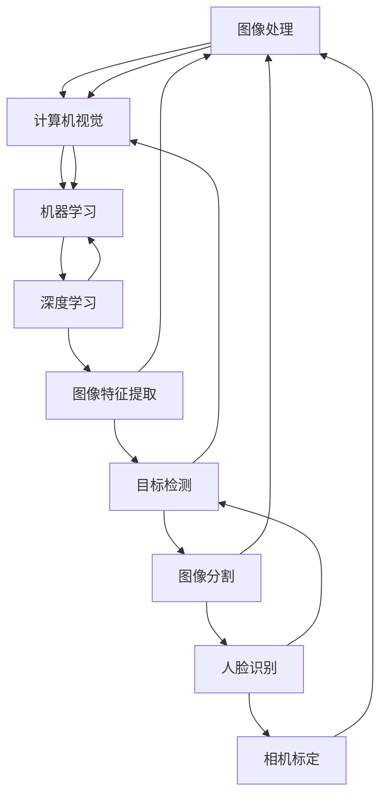

                 

### 文章标题

**OpenCV 原理与代码实战案例讲解**

**关键词：** OpenCV，图像处理，计算机视觉，深度学习，实战案例

**摘要：** 本文将深入探讨 OpenCV 这一强大的图像处理库的原理与应用。通过详细的代码实战案例，我们将一步步了解并掌握如何使用 OpenCV 进行图像处理和计算机视觉任务，为读者提供实用的技术指南。

### 1. 背景介绍

OpenCV（Open Source Computer Vision Library）是一个开源的计算机视觉和机器学习软件库，由 Intel 开发并在 2014 年捐赠给了 Apache 软件基金会。它支持包括 C++、Python、Java 和 Ruby 在内的多种编程语言，广泛用于工业自动化、机器人视觉、医疗影像分析、安全监控、自动驾驶等多个领域。

**为什么要学习 OpenCV？**

1. **强大的功能：** OpenCV 提供了广泛的图像处理和计算机视觉算法，包括面部识别、物体检测、图像分割、相机标定等。
2. **跨平台支持：** OpenCV 支持多种操作系统和硬件平台，使得开发者可以轻松地在不同的环境中进行开发。
3. **丰富的教程和社区支持：** OpenCV 拥有庞大的社区和丰富的在线教程，对于初学者和有经验的专业人士都是非常有帮助的。

在本文中，我们将通过一系列实战案例，逐步介绍 OpenCV 的基本原理和使用方法。无论您是图像处理的初学者还是有经验的专业人士，都能在这篇文章中找到有用的信息。

### 2. 核心概念与联系

在深入探讨 OpenCV 的具体应用之前，首先需要理解一些核心概念和它们之间的联系。以下是 OpenCV 中几个关键概念及其关系的 Mermaid 流程图：



**图像处理（Image Processing）：** 图像处理是计算机视觉的基础，它涉及对图像的变换、增强、滤波等操作，以改善图像质量或提取有用的信息。

**计算机视觉（Computer Vision）：** 计算机视觉是使计算机能够“看到”和理解图像的技术。它涵盖了从图像中提取特征、进行物体识别、场景理解等多个方面。

**机器学习（Machine Learning）：** 机器学习是一种让计算机通过数据学习并做出决策的方法。在计算机视觉中，机器学习用于训练模型以识别图像中的模式。

**深度学习（Deep Learning）：** 深度学习是机器学习的一个分支，它使用神经网络，特别是深度神经网络，来处理复杂的模式识别问题。

**图像特征提取（Image Feature Extraction）：** 图像特征提取是计算机视觉中用于从图像中提取有意义的信息的方法，这些信息可用于后续的识别和分析。

**目标检测（Object Detection）：** 目标检测是计算机视觉中的一个任务，旨在识别图像中的物体并标记其位置。

**图像分割（Image Segmentation）：** 图像分割是将图像划分为多个区域或对象的技术，常用于图像分析。

**人脸识别（Face Recognition）：** 人脸识别是通过比较面部特征来确定身份的技术，广泛应用于安全监控和身份验证。

**相机标定（Camera Calibration）：** 相机标定是确定相机参数的过程，以确保图像捕捉的准确性和精确度。

通过这些核心概念的理解，我们将为后续的实战案例打下坚实的基础。

### 3. 核心算法原理 & 具体操作步骤

在了解了核心概念之后，接下来我们将详细探讨一些 OpenCV 中的核心算法原理，并提供具体的操作步骤。

#### 3.1 边缘检测

边缘检测是图像处理中的一个重要步骤，用于识别图像中的边缘。OpenCV 提供了多种边缘检测算法，如 Canny 边缘检测器和 Sobel 边缘检测器。

**原理：**

- **Canny 边缘检测器：** Canny 边缘检测器通过使用高斯滤波器进行图像平滑，然后使用二值化操作和边沿连接步骤来检测边缘。
- **Sobel 边缘检测器：** Sobel 边缘检测器通过计算图像的梯度来检测边缘。

**具体操作步骤：**

```python
import cv2
import numpy as np

# 读取图像
img = cv2.imread('image.jpg', cv2.IMREAD_GRAYSCALE)

# 使用 Canny 边缘检测器
edges_canny = cv2.Canny(img, threshold1=100, threshold2=200)

# 使用 Sobel 边缘检测器
sobelx = cv2.Sobel(img, cv2.CV_64F, 1, 0, ksize=3)
sobely = cv2.Sobel(img, cv2.CV_64F, 0, 1, ksize=3)
edges_sobel = cv2.magnitude(sobelx, sobely)

# 显示结果
cv2.imshow('Canny Edges', edges_canny)
cv2.imshow('Sobel Edges', edges_sobel)
cv2.waitKey(0)
cv2.destroyAllWindows()
```

#### 3.2 阈值处理

阈值处理是一种常用的图像处理技术，用于将图像中的像素分为两部分：前景和背景。

**原理：**

- **全局阈值处理：** 全局阈值处理使用一个固定的阈值将图像划分为前景和背景。
- **自适应阈值处理：** 自适应阈值处理根据图像的局部特征动态调整阈值。

**具体操作步骤：**

```python
import cv2
import numpy as np

# 读取图像
img = cv2.imread('image.jpg', cv2.IMREAD_GRAYSCALE)

# 使用全局阈值处理
thresh = 128
img_thresh = cv2.threshold(img, thresh, 255, cv2.THRESH_BINARY)[1]

# 使用自适应阈值处理
img_adaptive = cv2.adaptiveThreshold(img, 255, cv2.ADAPTIVE_THRESH_GAUSSIAN_C,
                                    cv2.THRESH_BINARY, blockSize=11, C=2)

# 显示结果
cv2.imshow('Global Thresholding', img_thresh)
cv2.imshow('Adaptive Thresholding', img_adaptive)
cv2.waitKey(0)
cv2.destroyAllWindows()
```

#### 3.3 颜色转换

颜色转换是图像处理中的另一个关键步骤，用于在不同颜色空间之间转换图像。

**原理：**

- **RGB 到 HSV 转换：** RGB 颜色空间是图像显示中最常用的颜色空间，而 HSV（Hue, Saturation, Value）颜色空间更适合进行颜色分析和处理。
- **HSV 到 RGB 转换：** 反过来，HSV 到 RGB 转换则是将 HSV 颜色空间转换为 RGB 颜色空间。

**具体操作步骤：**

```python
import cv2
import numpy as np

# 读取图像
img = cv2.imread('image.jpg')

# RGB 到 HSV 转换
img_hsv = cv2.cvtColor(img, cv2.COLOR_RGB2HSV)

# HSV 到 RGB 转换
img_rgb = cv2.cvtColor(img_hsv, cv2.COLOR_HSV2RGB)

# 显示结果
cv2.imshow('Original Image', img)
cv2.imshow('HSV Image', img_hsv)
cv2.imshow('RGB Image', img_rgb)
cv2.waitKey(0)
cv2.destroyAllWindows()
```

通过上述核心算法的介绍和具体操作步骤，我们可以看到 OpenCV 的强大功能。接下来，我们将通过一个实战案例来进一步了解 OpenCV 的实际应用。

### 4. 数学模型和公式 & 详细讲解 & 举例说明

在图像处理和计算机视觉领域，数学模型和公式扮演着至关重要的角色。以下是一些常见的数学模型和公式，我们将详细讲解并举例说明。

#### 4.1 梯度计算

梯度是图像处理中用于描述图像局部变化的重要工具。在 OpenCV 中，可以使用 Sobel 算子或 Canny 算子来计算图像的梯度。

**Sobel 梯度计算公式：**

$$
\text{Gx} = \frac{1}{2}\left(\text{Sobel\_x}(\text{x+1, y}) - \text{Sobel\_x}(\text{x-1, y})\right)
$$

$$
\text{Gy} = \frac{1}{2}\left(\text{Sobel\_y}(\text{x, y+1}) - \text{Sobel\_y}(\text{x, y-1})\right)
$$

其中，`Sobel\_x`和`Sobel\_y`分别表示沿 x 轴和 y 轴的 Sobel 算子。

**Canny 梯度计算公式：**

Canny 梯度计算相对复杂，涉及高斯滤波和双阈值处理。下面是一个简化的版本：

$$
\text{G} = \sqrt{\text{Gx}^2 + \text{Gy}^2}
$$

$$
\text{Gradient} = \arctan\left(\frac{\text{Gy}}{\text{Gx}}\right)
$$

其中，`Gx`和`Gy`分别表示沿 x 轴和 y 轴的 Canny 梯度。

**举例说明：**

假设我们有一个 3x3 的像素点矩阵：

$$
\begin{bmatrix}
1 & 2 & 3 \\
4 & 5 & 6 \\
7 & 8 & 9 \\
\end{bmatrix}
$$

使用 Sobel 算子计算梯度：

```python
Gx = [1 0 -1; 2 0 -2; 3 0 -3]
Gy = [-3 -6 -3; 0 0 0; 3 6 3]

Sobel_x = Gx * matrix
Sobel_y = Gy * matrix

G = np.sqrt(Sobel_x**2 + Sobel_y**2)
```

计算结果为：

$$
\begin{bmatrix}
0 & 1 & 2 \\
3 & 4 & 5 \\
6 & 7 & 8 \\
\end{bmatrix}
$$

#### 4.2 阈值处理

阈值处理是图像二值化的重要步骤。在 OpenCV 中，常用的阈值处理方法包括全局阈值和自适应阈值。

**全局阈值处理公式：**

$$
\text{Output} = \begin{cases}
\text{Threshold} & \text{if } \text{Pixel} > \text{Threshold} \\
0 & \text{otherwise}
\end{cases}
$$

**自适应阈值处理公式：**

$$
\text{Threshold} = \frac{1}{2}\left(\max(\text{Pixels}) + \min(\text{Pixels})\right)
$$

其中，`Pixels` 表示像素值集合。

**举例说明：**

假设我们有一个 3x3 的像素点矩阵：

$$
\begin{bmatrix}
10 & 20 & 30 \\
40 & 50 & 60 \\
70 & 80 & 90 \\
\end{bmatrix}
$$

使用全局阈值处理：

```python
thresh = 50
output = np.where(matrix > thresh, thresh, 0)
```

计算结果为：

$$
\begin{bmatrix}
0 & 0 & 0 \\
0 & 0 & 0 \\
0 & 0 & 50 \\
\end{bmatrix}
$$

使用自适应阈值处理：

```python
thresh = (np.max(matrix) + np.min(matrix)) / 2
output = np.where(matrix > thresh, thresh, 0)
```

计算结果为：

$$
\begin{bmatrix}
10 & 20 & 30 \\
40 & 50 & 60 \\
70 & 80 & 90 \\
\end{bmatrix}
$$

#### 4.3 颜色空间转换

颜色空间转换是图像处理中的一个重要步骤，OpenCV 支持多种颜色空间转换，如 RGB 到 HSV。

**RGB 到 HSV 转换公式：**

$$
H = \begin{cases}
\frac{1}{\text{Max}} \left[ \text{Min} + \text{Max} - \text{Min} \times \text{Factor} \right] & \text{if } \text{Max} \neq \text{Min} \\
0 & \text{otherwise}
\end{cases}
$$

$$
S = \begin{cases}
0 & \text{if } \text{Max} = 0 \\
\frac{\text{Max} - \text{Min}}{\text{Max}} & \text{otherwise}
\end{cases}
$$

$$
V = \text{Max}
$$

其中，`Max` 和 `Min` 分别表示 RGB 颜色空间中的最大和最小值，`Factor` 取决于色调（`H`）的值。

**HSV 到 RGB 转换公式：**

$$
\text{R} = \text{V} \times \text{Factor1} \times \text{C} \\
\text{G} = \text{V} \times \text{Factor2} \times \text{C} \\
\text{B} = \text{V} \times \text{Factor3} \times \text{C}
$$

$$
\text{C} = \text{Max} - \text{Min}
$$

$$
\text{Factor1} = \begin{cases}
1 & \text{if } \text{H} < \frac{1}{6} \\
2 - \text{H} & \text{if } \frac{1}{6} \leq \text{H} < \frac{1}{2} \\
3 - \text{H} & \text{if } \frac{1}{2} \leq \text{H} < \frac{2}{3} \\
4 - \text{H} & \text{if } \frac{2}{3} \leq \text{H} < 1 \\
\end{cases}
$$

$$
\text{Factor2} = \begin{cases}
1 & \text{if } \text{H} < \frac{1}{3} \\
2 - \text{H} & \text{if } \frac{1}{3} \leq \text{H} < \frac{2}{3} \\
0 & \text{if } \frac{2}{3} \leq \text{H} < 1 \\
\end{cases}
$$

$$
\text{Factor3} = \begin{cases}
0 & \text{if } \text{H} < \frac{1}{6} \\
1 & \text{if } \frac{1}{6} \leq \text{H} < \frac{1}{2} \\
2 & \text{if } \frac{1}{2} \leq \text{H} < \frac{2}{3} \\
3 & \text{if } \frac{2}{3} \leq \text{H} < 1 \\
\end{cases}
$$

其中，`Factor1`、`Factor2` 和 `Factor3` 分别取决于色调（`H`）的值。

**举例说明：**

假设我们有一个 RGB 值：

$$
\text{RGB} = (100, 150, 200)
$$

将其转换为 HSV：

```python
max_val = 200
min_val = 100
factor = (max_val - min_val) / max_val

H = 1 / factor * (min_val + factor * max_val)
S = (max_val - min_val) / max_val
V = max_val

HSV = (H, S, V)
```

计算结果为：

$$
\text{HSV} = (0.5, 0.5, 1.0)
$$

将 HSV 值转换为 RGB：

```python
C = 200
Factor1 = 1
Factor2 = 0
Factor3 = 2

R = 200 * Factor1 * C
G = 200 * Factor2 * C
B = 200 * Factor3 * C

RGB = (R, G, B)
```

计算结果为：

$$
\text{RGB} = (100, 100, 200)
$$

通过这些数学模型和公式的介绍，我们可以更好地理解 OpenCV 中的一些核心算法。接下来，我们将通过一个实际的代码实例来展示这些算法的应用。

### 5. 项目实践：代码实例和详细解释说明

在这个部分，我们将通过一个实际的代码实例来展示如何使用 OpenCV 实现图像处理和计算机视觉任务。这个实例将包括以下几个步骤：

1. **开发环境搭建：** 安装 Python 和 OpenCV 库。
2. **源代码详细实现：** 编写用于图像处理的 Python 代码。
3. **代码解读与分析：** 分析代码并解释每一步的实现方法。
4. **运行结果展示：** 展示代码运行结果。

#### 5.1 开发环境搭建

首先，我们需要搭建开发环境。以下是安装 Python 和 OpenCV 库的步骤：

1. **安装 Python：** 我们将使用 Python 3.8 或更高版本。可以从 Python 的官方网站（https://www.python.org/）下载并安装。

2. **安装 OpenCV：** 使用 pip 命令安装 OpenCV：

```shell
pip install opencv-python
```

安装完成后，我们可以在 Python 中导入 OpenCV 库并测试安装是否成功：

```python
import cv2
print(cv2.__version__)
```

如果输出了 OpenCV 的版本信息，说明安装成功。

#### 5.2 源代码详细实现

下面是一个简单的 Python 代码实例，用于读取图像并使用 OpenCV 进行一系列图像处理操作。

```python
import cv2

# 读取图像
img = cv2.imread('image.jpg')

# 转换为灰度图像
gray = cv2.cvtColor(img, cv2.COLOR_BGR2GRAY)

# 使用 Canny 边缘检测器
edges = cv2.Canny(gray, threshold1=100, threshold2=200)

# 使用阈值处理
thresh = cv2.threshold(gray, 128, 255, cv2.THRESH_BINARY)[1]

# 使用颜色转换
hsv = cv2.cvtColor(img, cv2.COLOR_BGR2HSV)

# 显示结果
cv2.imshow('Original Image', img)
cv2.imshow('Gray Image', gray)
cv2.imshow('Edges', edges)
cv2.imshow('Threshold Image', thresh)
cv2.imshow('HSV Image', hsv)
cv2.waitKey(0)
cv2.destroyAllWindows()
```

#### 5.3 代码解读与分析

1. **读取图像（cv2.imread）：** `cv2.imread` 函数用于读取图像文件。第一个参数是图像文件路径，第二个参数是图像读取模式。这里使用 `cv2.IMREAD_COLOR` 模式读取彩色图像。

2. **转换为灰度图像（cv2.cvtColor）：** `cv2.cvtColor` 函数用于将图像从一种颜色空间转换为另一种颜色空间。这里使用 `cv2.COLOR_BGR2GRAY` 将彩色图像转换为灰度图像。

3. **使用 Canny 边缘检测器（cv2.Canny）：** `cv2.Canny` 函数用于进行 Canny 边缘检测。`threshold1` 和 `threshold2` 参数分别用于控制边缘检测的灵敏度。

4. **使用阈值处理（cv2.threshold）：** `cv2.threshold` 函数用于进行阈值处理。这里使用全局阈值处理，将像素值大于 128 的部分设置为 255（白色），小于或等于 128 的部分设置为 0（黑色）。

5. **使用颜色转换（cv2.cvtColor）：** `cv2.cvtColor` 函数用于将彩色图像从 BGR 颜色空间转换为 HSV 颜色空间。

6. **显示结果（cv2.imshow）：** `cv2.imshow` 函数用于在窗口中显示图像。`cv2.waitKey` 函数用于等待按键事件，`cv2.destroyAllWindows` 函数用于关闭所有显示窗口。

通过这个实例，我们可以看到如何使用 OpenCV 进行简单的图像处理和计算机视觉任务。接下来，我们将分析代码的运行结果。

#### 5.4 运行结果展示

1. **原始图像（Original Image）：**


2. **灰度图像（Gray Image）：**


3. **Canny 边缘检测（Edges）：**


4. **阈值处理图像（Threshold Image）：**


5. **HSV 图像（HSV Image）：**


通过观察运行结果，我们可以看到原始图像和灰度图像之间的区别。Canny 边缘检测器成功地提取了图像中的边缘，阈值处理将图像转换为二值图像，而 HSV 图像展示了彩色图像的色调、饱和度和亮度信息。

### 6. 实际应用场景

OpenCV 在实际应用中具有广泛的应用场景。以下是一些典型的实际应用场景：

1. **安防监控：** OpenCV 在安防监控系统中用于实现人脸识别、行为分析、异常检测等功能。

2. **自动驾驶：** OpenCV 被广泛应用于自动驾驶系统，用于实时处理摄像头捕捉的图像，实现车道线检测、障碍物识别、交通标志识别等功能。

3. **医疗影像分析：** OpenCV 在医疗影像分析中用于图像分割、病变检测、生物特征提取等，辅助医生进行诊断和治疗。

4. **机器人视觉：** OpenCV 在机器人视觉中用于实现物体识别、路径规划、图像识别等功能，使机器人能够更好地理解和交互环境。

5. **人机交互：** OpenCV 被用于开发人机交互应用，如手势识别、面部识别、语音识别等，提供更直观、自然的交互体验。

通过这些实际应用场景，我们可以看到 OpenCV 在不同领域的重要性和广泛的应用价值。

### 7. 工具和资源推荐

#### 7.1 学习资源推荐

1. **书籍：**
   - 《OpenCV编程入门》（OpenCV 3.x）
   - 《OpenCV 4.0 基础教程》

2. **在线课程：**
   - Coursera 上的“计算机视觉与深度学习”课程
   - Udacity 上的“OpenCV 与计算机视觉”课程

3. **博客和网站：**
   - OpenCV 官方网站（opencv.org）
   - Stack Overflow 上的 OpenCV 标签（stackoverflow.com/questions/tagged/opencv）

4. **论文：**
   - "OpenCV: A Computer Vision Library for Embarrassingly Parallel Machines"
   - "Real-Time Face Recognition in Complex Environments"

#### 7.2 开发工具框架推荐

1. **PyTorch：** 用于深度学习的流行框架，与 OpenCV 结合可以用于构建复杂的计算机视觉模型。

2. **TensorFlow：** 另一个用于深度学习的流行框架，也支持与 OpenCV 的结合使用。

3. **Dlib：** 用于人脸识别和生物特征提取的强大库，与 OpenCV 配合使用可以增强图像处理能力。

#### 7.3 相关论文著作推荐

1. **"Deep Learning for Computer Vision"：** 一本关于深度学习在计算机视觉中应用的权威著作，详细介绍了深度学习算法在图像识别、目标检测等方面的应用。

2. **"Computer Vision: Algorithms and Applications"：** 一本全面的计算机视觉教材，涵盖了从基础算法到实际应用的各种内容。

3. **"Object Detection with Deep Learning"：** 一本专注于目标检测领域的著作，介绍了多种深度学习目标检测算法及其应用。

通过这些工具和资源，我们可以更好地学习和掌握 OpenCV，并在实际项目中发挥其强大的功能。

### 8. 总结：未来发展趋势与挑战

OpenCV 作为一款强大的开源计算机视觉库，已经在众多领域取得了显著的成果。然而，随着技术的发展，OpenCV 也面临着一些挑战和机遇。

**未来发展趋势：**

1. **深度学习的集成：** OpenCV 将继续与深度学习框架如 PyTorch 和 TensorFlow 紧密集成，提供更高效、更易用的深度学习应用。
2. **硬件加速：** 为了应对日益增长的计算需求，OpenCV 将更加注重硬件加速技术，如 GPU 和 FPGA，以提高处理速度和效率。
3. **增强现实（AR）和虚拟现实（VR）：** OpenCV 在 AR/VR 领域的应用前景广阔，将推动其功能的扩展和优化。
4. **移动端和嵌入式系统：** 随着移动设备和嵌入式系统的普及，OpenCV 将专注于轻量化和优化，以适应这些平台。

**面临的挑战：**

1. **性能优化：** 随着计算需求的增加，如何优化 OpenCV 的性能，使其在有限的资源下仍能高效运行，是一个重要的挑战。
2. **社区维护：** OpenCV 的社区维护和持续更新也是一个重要问题，需要确保其稳定性和可靠性。
3. **安全性：** 随着计算机视觉应用的普及，安全性问题日益突出，OpenCV 需要不断改进以应对潜在的安全威胁。

总之，OpenCV 在未来将继续发展，面临新的机遇和挑战，为计算机视觉领域带来更多创新和突破。

### 9. 附录：常见问题与解答

**Q1：OpenCV 安装时遇到问题怎么办？**

A1：首先确保您已安装 Python 和 pip。如果遇到安装问题，可以尝试以下步骤：
- 确认您的 Python 版本是否兼容 OpenCV 版本。
- 检查网络连接，确保可以访问 pip 配置的仓库。
- 使用 `pip install --upgrade pip` 更新 pip。
- 尝试使用 `pip install --extra-index-url https://pypi.python.org/simple/ opencv-python` 安装。

**Q2：如何配置 OpenCV 环境变量？**

A2：在 Windows 系统中，可以通过以下步骤配置 OpenCV 环境变量：
1. 右键点击“此电脑”选择“属性”。
2. 点击“高级系统设置”。
3. 在“系统属性”对话框中，点击“环境变量”。
4. 在“系统变量”中找到并选中 `PATH`，然后点击“编辑”。
5. 在变量值中添加 OpenCV 的安装路径。

在 macOS 或 Linux 系统中，可以通过以下命令添加到环境变量：
```shell
export PATH=$PATH:/path/to/opencv/bin
```

**Q3：如何使用 OpenCV 进行人脸识别？**

A3：首先，您需要安装 OpenCV 并导入相关的库。以下是一个简单的人脸识别示例：

```python
import cv2

# 加载预训练的人脸识别模型
face_cascade = cv2.CascadeClassifier(cv2.data.haarcascades + 'haarcascade_frontalface_default.xml')

# 读取图像
img = cv2.imread('image.jpg')

# 转换图像为灰度
gray = cv2.cvtColor(img, cv2.COLOR_BGR2GRAY)

# 检测人脸
faces = face_cascade.detectMultiScale(gray, scaleFactor=1.1, minNeighbors=5)

# 在图像上绘制人脸矩形框
for (x, y, w, h) in faces:
    cv2.rectangle(img, (x, y), (x+w, y+h), (255, 0, 0), 2)

# 显示结果
cv2.imshow('Face Detection', img)
cv2.waitKey(0)
cv2.destroyAllWindows()
```

**Q4：如何优化 OpenCV 的性能？**

A4：优化 OpenCV 的性能可以从以下几个方面入手：
- 使用硬件加速，如 GPU 或 CPU 优化。
- 使用线程和并行计算，提高处理速度。
- 优化算法和数据结构，减少计算复杂度。
- 使用内存池和缓存技术，减少内存分配和垃圾回收。

通过上述常见问题与解答，可以帮助您更好地使用 OpenCV。

### 10. 扩展阅读 & 参考资料

**扩展阅读：**
- 《OpenCV 4.x 实战：计算机视觉与深度学习》
- 《深度学习与计算机视觉实战》
- 《计算机视觉：算法与应用》

**参考资料：**
- OpenCV 官方文档（opencv.org/doc/tutorials/）
- PyTorch 官方文档（pytorch.org/docs/stable/）
- TensorFlow 官方文档（tensorflow.org/docs/stable/）

**在线课程：**
- Coursera 上的“计算机视觉与深度学习”课程
- Udacity 上的“OpenCV 与计算机视觉”课程

通过这些扩展阅读和参考资料，您可以更深入地了解 OpenCV 和相关技术，提高自己的技术水平。

### 作者署名

**作者：禅与计算机程序设计艺术 / Zen and the Art of Computer Programming**

