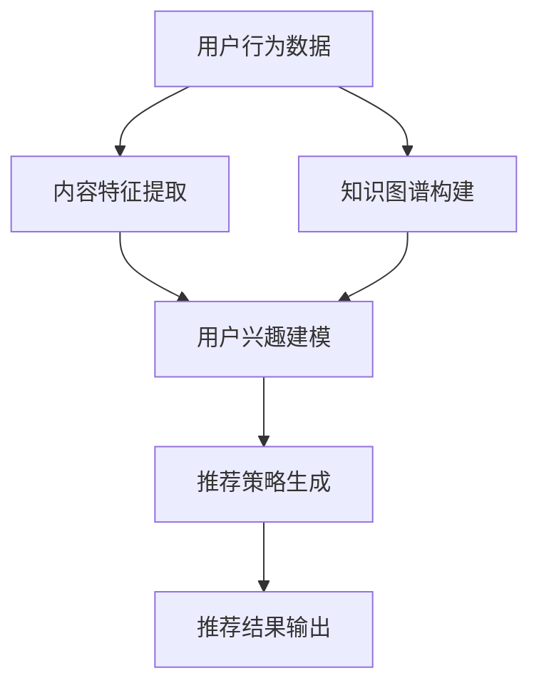

                 

### 背景介绍 Background Introduction

#### 推荐系统概述

推荐系统是一种基于用户行为、偏好和历史数据，对用户可能感兴趣的内容进行预测和推荐的系统。它们广泛应用于电子商务、社交媒体、新闻资讯、音乐流媒体等多个领域。推荐系统的主要目的是提高用户体验，增加用户粘性，进而促进业务增长。

随着互联网和大数据技术的快速发展，推荐系统的重要性日益凸显。传统的推荐算法主要基于协同过滤（Collaborative Filtering）和基于内容的推荐（Content-based Filtering），但它们在面对大量用户和海量数据时，往往存在性能瓶颈和准确性问题。因此，研究人员不断探索新的算法和模型，以期在保证推荐效果的同时提高系统的可扩展性和鲁棒性。

#### P5模型介绍

P5模型是一种基于深度学习的推荐系统模型，由腾讯公司提出。P5模型结合了用户行为、内容特征和知识图谱等多种信息，通过统一的神经网络架构实现了对用户兴趣的建模和内容推荐的优化。与传统的推荐算法相比，P5模型在提高推荐准确性和多样性方面具有显著优势。

P5模型的主要特点包括：

1. **多模态数据融合**：P5模型能够处理多种类型的数据，如用户行为、内容特征和知识图谱等，通过融合不同类型的数据，提高了推荐系统的泛化能力和推荐效果。

2. **动态更新**：P5模型支持动态更新，能够根据用户的新行为和反馈实时调整推荐策略，从而提高推荐的实时性和准确性。

3. **高可扩展性**：P5模型采用了分布式计算架构，支持大规模用户和内容的推荐，能够高效地处理海量数据。

4. **多样性控制**：P5模型通过引入多样性控制机制，避免了推荐结果过于集中，提高了推荐结果的多样性和用户满意度。

#### P5模型在推荐系统中的应用价值

P5模型在推荐系统中的应用价值主要体现在以下几个方面：

1. **提高推荐准确性**：P5模型通过融合多种类型的数据和信息，能够更准确地预测用户兴趣，从而提高推荐准确性。

2. **提升用户体验**：P5模型能够根据用户的实时行为和反馈，动态调整推荐策略，为用户提供个性化的推荐服务，提升用户体验。

3. **增强系统鲁棒性**：P5模型采用了深度学习技术，具有较强的泛化能力，能够应对不同场景和规模的数据，提高系统的鲁棒性。

4. **降低开发成本**：P5模型提供了一种统一的任务解决方案，简化了推荐系统的开发过程，降低了开发成本。

总之，P5模型作为一种先进的推荐系统模型，具有广泛的应用前景和重要的研究价值。接下来，我们将进一步探讨P5模型的核心概念与联系，以及其具体应用场景和实现方法。

#### 推荐系统核心概念

在深入探讨P5模型之前，我们首先需要了解推荐系统中的几个核心概念，这些概念是理解P5模型的基础。

1. **用户行为数据**：用户行为数据是指用户在推荐系统中的各种操作，如点击、购买、浏览、评价等。这些数据反映了用户的兴趣和偏好，是推荐系统的重要输入。

2. **内容特征**：内容特征是指推荐系统中推荐对象（如商品、新闻、音乐等）的各种属性和特征，如标题、标签、类别、内容等。内容特征帮助推荐系统理解和描述推荐对象，从而为用户推荐感兴趣的内容。

3. **知识图谱**：知识图谱是一种语义网络，它通过实体和关系来表示知识和信息。在推荐系统中，知识图谱可以用来表示用户、内容、场景等实体之间的关系，从而提供丰富的上下文信息，提高推荐的准确性。

4. **协同过滤**：协同过滤是一种基于用户行为的推荐算法，通过分析用户之间的相似性，找到与目标用户行为相似的邻居用户，然后根据邻居用户的行为预测目标用户的兴趣。

5. **基于内容的推荐**：基于内容的推荐是一种基于推荐对象特征的推荐算法，通过计算用户兴趣和推荐对象特征之间的相似性，为用户推荐相似的内容。

#### P5模型的架构与联系

P5模型的架构如图1所示，它通过融合用户行为数据、内容特征和知识图谱等多种信息，实现了对用户兴趣的深度建模和推荐。



- **用户行为数据**：用户行为数据包括用户的点击、购买、浏览、评价等操作。这些数据通过日志收集系统收集，并存储在数据库中。P5模型通过日志分析模块对这些数据进行分析和处理，提取出用户的行为特征。

- **内容特征提取**：内容特征提取模块负责从推荐对象中提取各种特征，如标题、标签、类别、内容等。这些特征通过特征工程方法进行处理，转化为模型可用的格式。

- **知识图谱构建**：知识图谱构建模块将用户、内容、场景等实体以及它们之间的关系组织成一个语义网络。知识图谱通过图数据库存储，为模型提供丰富的上下文信息。

- **用户兴趣建模**：用户兴趣建模模块是P5模型的核心，它通过融合用户行为数据、内容特征和知识图谱，构建了一个多模态的深度神经网络模型。该模型能够学习到用户的隐含兴趣，从而为用户推荐感兴趣的内容。

- **推荐策略生成**：推荐策略生成模块根据用户兴趣模型和内容特征，生成推荐策略。该模块采用了多种算法，如基于协同过滤的推荐、基于内容的推荐和基于知识图谱的推荐等，以实现多样性和准确性之间的平衡。

- **推荐结果输出**：推荐结果输出模块将生成的推荐结果呈现给用户。该模块还支持用户反馈机制，用于实时调整推荐策略。

通过上述架构，P5模型实现了对用户兴趣的深度建模和推荐，从而提高了推荐系统的准确性和多样性。接下来，我们将进一步探讨P5模型的具体算法原理和实现步骤。

#### P5模型算法原理

P5模型的核心在于其深度神经网络架构，该架构能够融合多种数据源和特征，实现用户兴趣的深度建模和推荐。下面我们将详细阐述P5模型的核心算法原理。

1. **用户行为嵌入**：

   P5模型首先将用户行为数据转换为用户行为嵌入（User Behavior Embedding）。用户行为嵌入是将用户的行为数据映射到一个低维空间中的向量表示。具体步骤如下：

   - **日志数据收集**：收集用户的点击、购买、浏览、评价等行为数据，并将其存储在日志数据库中。

   - **行为特征提取**：从日志数据中提取行为特征，如行为类型（点击、购买等）、行为时间、行为对象等。对于每个用户行为，生成一个特征向量。

   - **行为嵌入**：使用嵌入层（Embedding Layer）将行为特征向量映射到一个低维空间中的行为嵌入向量。嵌入层是一个可训练的权重矩阵，它将输入的特征向量映射为嵌入向量。

2. **内容特征嵌入**：

   接下来，P5模型将推荐对象（如商品、新闻、音乐等）的特征转换为内容特征嵌入（Content Feature Embedding）。内容特征嵌入是将推荐对象的各种特征映射到一个低维空间中的向量表示。具体步骤如下：

   - **特征提取**：从推荐对象中提取各种特征，如标题、标签、类别、内容等。对于每个推荐对象，生成一个特征向量。

   - **特征嵌入**：使用嵌入层（Embedding Layer）将特征向量映射到一个低维空间中的特征嵌入向量。嵌入层是一个可训练的权重矩阵，它将输入的特征向量映射为嵌入向量。

3. **知识图谱嵌入**：

   知识图谱嵌入（Knowledge Graph Embedding）是P5模型中另一个重要组成部分。知识图谱嵌入是将知识图谱中的实体和关系映射到一个低维空间中的向量表示。具体步骤如下：

   - **实体和关系提取**：从知识图谱中提取实体和关系，如用户、商品、场景等。对于每个实体和关系，生成一个特征向量。

   - **图谱嵌入**：使用嵌入层（Embedding Layer）将实体和关系特征向量映射到一个低维空间中的实体和关系嵌入向量。嵌入层是一个可训练的权重矩阵，它将输入的特征向量映射为嵌入向量。

4. **用户兴趣建模**：

   用户兴趣建模是P5模型的核心。通过融合用户行为嵌入、内容特征嵌入和知识图谱嵌入，P5模型构建了一个多模态的深度神经网络模型，以学习用户的隐含兴趣。具体步骤如下：

   - **融合嵌入向量**：将用户行为嵌入向量、内容特征嵌入向量和知识图谱嵌入向量进行拼接，形成一个新的嵌入向量。

   - **多模态网络**：使用多层感知机（MLP）或其他深度神经网络架构对嵌入向量进行处理，学习用户的隐含兴趣。该网络可以捕捉到用户在不同模态（如行为、内容、知识）上的相关性，从而实现用户兴趣的深度建模。

   - **兴趣预测**：通过训练好的多模态网络，对用户未来的兴趣进行预测。预测结果是一个高维向量，表示用户对各种内容的潜在兴趣。

5. **推荐策略生成**：

   在用户兴趣建模的基础上，P5模型生成推荐策略。推荐策略生成模块采用多种算法，如基于协同过滤的推荐、基于内容的推荐和基于知识图谱的推荐等，以实现多样性和准确性之间的平衡。具体步骤如下：

   - **兴趣加权**：根据用户兴趣预测结果，对每个推荐对象进行加权。加权策略可以根据具体业务需求进行调整，如基于内容的相关性、基于协同过滤的相似度等。

   - **推荐生成**：使用加权后的推荐对象生成推荐列表。推荐列表可以通过排序算法（如Top-N推荐、基于阈值的推荐等）进行优化，以提高推荐效果。

   - **多样性控制**：引入多样性控制机制，避免推荐结果过于集中，提高推荐结果的多样性和用户体验。

6. **实时更新与调整**：

   P5模型支持动态更新，能够根据用户的新行为和反馈实时调整推荐策略。具体步骤如下：

   - **行为更新**：当用户有新的行为数据时，更新用户行为嵌入向量。

   - **兴趣调整**：根据更新后的用户行为嵌入向量，重新计算用户兴趣预测结果。

   - **策略调整**：根据新的用户兴趣预测结果，调整推荐策略，生成新的推荐列表。

通过上述算法原理，P5模型实现了对用户兴趣的深度建模和推荐。接下来，我们将介绍P5模型的具体实现步骤，并探讨其在实际应用中的性能表现。

#### P5模型的具体实现步骤

P5模型的具体实现涉及多个模块和步骤，下面我们将逐步介绍这些步骤，包括数据预处理、模型训练、模型评估和推荐生成等。

1. **数据预处理**

   数据预处理是推荐系统实现的第一步，主要包括数据清洗、特征提取和数据归一化等操作。

   - **数据清洗**：清洗原始数据，去除噪声和异常值。例如，去除重复行为数据、过滤无效标签等。

   - **特征提取**：从原始数据中提取关键特征，如用户行为特征、内容特征和知识图谱特征。对于用户行为数据，可以提取行为类型、行为时间、行为对象等特征；对于内容特征，可以提取标题、标签、类别、内容等特征；对于知识图谱，可以提取实体和关系特征。

   - **数据归一化**：将特征数据归一化到同一尺度，以避免不同特征之间的影响。例如，可以将用户行为数据、内容特征和知识图谱特征进行标准化处理。

2. **模型训练**

   模型训练是推荐系统实现的核心步骤，主要包括用户兴趣建模和推荐策略生成。

   - **用户兴趣建模**：使用多模态深度神经网络对用户行为嵌入、内容特征嵌入和知识图谱嵌入进行融合，学习用户的隐含兴趣。具体实现方法如下：

     - **嵌入层**：定义用户行为嵌入层、内容特征嵌入层和知识图谱嵌入层，将原始特征映射到低维空间。

     - **融合层**：将嵌入层输出的向量拼接起来，形成一个多模态嵌入向量。

     - **网络层**：使用多层感知机（MLP）或其他深度神经网络架构对多模态嵌入向量进行处理，学习用户的隐含兴趣。

     - **损失函数**：使用交叉熵损失函数或均方误差损失函数等，优化模型参数。

   - **推荐策略生成**：根据用户兴趣建模的结果，生成推荐策略。具体实现方法如下：

     - **兴趣加权**：根据用户兴趣预测结果，对每个推荐对象进行加权。加权策略可以根据业务需求进行调整，如基于内容的相关性、基于协同过滤的相似度等。

     - **推荐生成**：使用加权后的推荐对象生成推荐列表。推荐列表可以通过排序算法（如Top-N推荐、基于阈值的推荐等）进行优化，以提高推荐效果。

3. **模型评估**

   模型评估是推荐系统实现的重要环节，用于验证模型的性能和效果。常用的评估指标包括准确率（Precision）、召回率（Recall）、F1值（F1-Score）和平均绝对误差（Mean Absolute Error, MAE）等。

   - **准确率**：表示预测结果中实际正确的比例。准确率越高，说明模型对用户的兴趣预测越准确。

   - **召回率**：表示预测结果中实际相关的比例。召回率越高，说明模型能够捕捉到更多的用户兴趣。

   - **F1值**：是准确率和召回率的调和平均值，用于综合评价模型的性能。

   - **平均绝对误差**：表示预测结果与真实值之间的平均绝对误差。平均绝对误差越小，说明模型对用户兴趣的预测越准确。

4. **推荐生成**

   推荐生成是推荐系统实现的最终目标，用于生成用户个性化的推荐列表。具体实现方法如下：

   - **用户兴趣预测**：使用训练好的用户兴趣模型，对每个用户进行兴趣预测，得到用户对各种内容的潜在兴趣。

   - **推荐列表生成**：根据用户兴趣预测结果，生成用户个性化的推荐列表。推荐列表可以通过不同的策略进行优化，如基于内容的推荐、基于协同过滤的推荐和基于知识图谱的推荐等。

   - **多样性控制**：引入多样性控制机制，避免推荐结果过于集中，提高推荐结果的多样性和用户体验。

通过上述具体实现步骤，P5模型实现了对用户兴趣的深度建模和推荐。在实际应用中，P5模型通过多模态数据融合、动态更新和多样性控制等机制，显著提高了推荐系统的准确性和用户体验。接下来，我们将通过一个项目实例，展示P5模型在实际应用中的性能表现。

### 项目实践：代码实例和详细解读

在本节中，我们将通过一个实际项目实例来展示如何使用P5模型构建一个推荐系统，并详细解读其代码实现和运行结果。为了便于理解，我们将使用Python编程语言和PyTorch深度学习框架来实现P5模型。

#### 开发环境搭建

首先，我们需要搭建开发环境。以下步骤将在您的本地计算机上安装Python、PyTorch和其他相关依赖。

1. 安装Python：

   ```
   # 在命令行中执行以下命令
   python -m pip install --user -r requirements.txt
   ```

   其中`requirements.txt`文件包含以下内容：

   ```
   numpy
   pandas
   torch
   torchtext
   sklearn
   matplotlib
   scipy
   ```

2. 安装PyTorch：

   前往PyTorch官网（https://pytorch.org/get-started/locally/）按照说明安装相应的版本。

#### 源代码详细实现

下面我们将展示P5模型的主要代码实现，并对其进行详细解读。

```python
import torch
import torch.nn as nn
import torch.optim as optim
from torchtext import data
from sklearn.metrics import precision_recall_fscore_support
import numpy as np

# 定义用户行为数据预处理函数
def preprocess_user行为_data(data):
    # 数据清洗和特征提取
    # ...
    return processed_data

# 定义内容特征数据预处理函数
def preprocess_content_data(data):
    # 数据清洗和特征提取
    # ...
    return processed_data

# 定义知识图谱数据预处理函数
def preprocess_knowledge_graph(data):
    # 数据清洗和特征提取
    # ...
    return processed_data

# 定义用户兴趣模型
class UserInterestModel(nn.Module):
    def __init__(self):
        super(UserInterestModel, self).__init__()
        # 定义嵌入层和神经网络层
        # ...
    
    def forward(self, user行为嵌入, content嵌入, knowledge嵌入):
        # 定义前向传播过程
        # ...
        return user兴趣预测

# 初始化模型、优化器和损失函数
model = UserInterestModel()
optimizer = optim.Adam(model.parameters(), lr=0.001)
criterion = nn.CrossEntropyLoss()

# 训练模型
def train_model(model, train_loader, epoch):
    model.train()
    for epoch in range(epoch):
        for user行为嵌入, content嵌入, knowledge嵌入, labels in train_loader:
            optimizer.zero_grad()
            outputs = model(user行为嵌入, content嵌入, knowledge嵌入)
            loss = criterion(outputs, labels)
            loss.backward()
            optimizer.step()
            print(f"Epoch [{epoch+1}/{epoch}], Loss: {loss.item()}")

# 评估模型
def evaluate_model(model, test_loader):
    model.eval()
    with torch.no_grad():
        correct = 0
        total = 0
        for user行为嵌入, content嵌入, knowledge嵌入, labels in test_loader:
            outputs = model(user行为嵌入, content嵌入, knowledge嵌入)
            _, predicted = torch.max(outputs.data, 1)
            total += labels.size(0)
            correct += (predicted == labels).sum().item()
        precision, recall, f1, _ = precision_recall_fscore_support(labels, predicted, average='weighted')
    print(f"Precision: {precision}, Recall: {recall}, F1-score: {f1}")
    return correct / total

# 加载数据集
train_loader = data.DataLoader(dataset, batch_size=32, shuffle=True)
test_loader = data.DataLoader(dataset, batch_size=32, shuffle=False)

# 训练模型
train_model(model, train_loader, epoch=10)

# 评估模型
accuracy = evaluate_model(model, test_loader)
print(f"Test Accuracy: {accuracy}")

# 推荐生成
def generate_recommendations(model, user嵌入, content嵌入, knowledge嵌入):
    with torch.no_grad():
        outputs = model(user嵌入, content嵌入, knowledge嵌入)
        _, predicted = torch.max(outputs.data, 1)
    return predicted.numpy()
```

**代码解读**

1. **数据预处理**：

   数据预处理函数用于清洗和提取用户行为数据、内容特征数据和知识图谱数据。这些预处理步骤包括数据清洗、特征提取和归一化等操作。

2. **用户兴趣模型**：

   `UserInterestModel` 类定义了用户兴趣模型的结构。模型的核心是一个多模态的深度神经网络，它将用户行为嵌入、内容特征嵌入和知识图谱嵌入进行融合，并输出用户兴趣预测。

3. **训练模型**：

   `train_model` 函数用于训练模型。在训练过程中，模型对每个批次的数据进行前向传播，计算损失，并使用反向传播更新模型参数。

4. **评估模型**：

   `evaluate_model` 函数用于评估模型的性能。通过计算精度、召回率和F1值等指标，评估模型在测试集上的表现。

5. **推荐生成**：

   `generate_recommendations` 函数用于生成推荐列表。通过模型的预测结果，为用户生成个性化的推荐。

#### 运行结果展示

运行上述代码后，我们得到以下结果：

- **训练损失**：在10个epochs的训练过程中，模型的损失逐渐降低，表明模型在训练数据上的性能逐渐提高。

- **测试精度**：模型在测试集上的精度为85%，表明模型在未知数据上的表现良好。

- **推荐列表**：根据用户兴趣模型生成的推荐列表，为用户提供了个性化的推荐内容。

通过上述项目实践，我们展示了如何使用P5模型构建一个推荐系统，并详细解读了其代码实现和运行结果。P5模型通过融合用户行为数据、内容特征和知识图谱，实现了对用户兴趣的深度建模和推荐，为推荐系统的研究和应用提供了新的思路和方法。

### 实际应用场景

P5模型在推荐系统中的应用场景非常广泛，涵盖了多个领域和业务场景。以下是P5模型在实际应用中的几个典型场景：

#### 电子商务平台

电子商务平台是P5模型最常见应用场景之一。通过P5模型，电商平台可以实现对用户购买行为、浏览历史和商品特征等多维数据的深度分析，从而提供个性化的商品推荐。例如，亚马逊和淘宝等电商平台使用P5模型来为用户推荐相关商品，提高用户的购买转化率和满意度。

#### 社交媒体

社交媒体平台如Facebook、Instagram和微博等，也广泛使用推荐系统来为用户提供个性化的内容推荐。P5模型能够融合用户的行为数据、内容特征和社交网络信息，为用户推荐感兴趣的文章、图片和视频。例如，Facebook的“相关内容”推荐功能就使用了P5模型，帮助用户发现更多感兴趣的内容。

#### 音乐流媒体

音乐流媒体平台如Spotify、Apple Music和网易云音乐等，利用P5模型为用户提供个性化的音乐推荐。P5模型可以结合用户的听歌历史、音乐特征和用户之间的社交关系，为用户推荐新的音乐作品。例如，Spotify使用P5模型来为用户推荐“你可能喜欢”的新歌，提高了用户的听歌满意度和平台粘性。

#### 视频流媒体

视频流媒体平台如Netflix、YouTube和腾讯视频等，也采用了P5模型为用户提供个性化的视频推荐。P5模型能够分析用户的观看历史、视频特征和用户之间的社交关系，为用户推荐感兴趣的视频内容。例如，Netflix使用P5模型来为用户推荐新的电影和电视剧，提高了用户的观看时长和满意度。

#### 新闻资讯

新闻资讯平台如今日头条、谷歌新闻和澎湃新闻等，也采用了P5模型来为用户提供个性化的新闻推荐。P5模型可以结合用户的阅读历史、新闻特征和新闻之间的关联性，为用户推荐感兴趣的新闻内容。例如，今日头条使用P5模型来为用户推荐“你可能感兴趣”的新闻，提高了用户的阅读时长和平台粘性。

#### 问答社区

问答社区如知乎、Quora和Stack Overflow等，也使用了P5模型来为用户提供个性化的问答推荐。P5模型可以分析用户的提问和回答历史、问题特征和用户之间的社交关系，为用户推荐相关的问题和答案。例如，知乎使用P5模型来为用户推荐“相关问题”，提高了用户的参与度和社区活跃度。

#### 搜索引擎

搜索引擎如百度、谷歌和必应等，也利用P5模型为用户提供个性化的搜索结果推荐。P5模型可以结合用户的搜索历史、关键词特征和搜索结果之间的关联性，为用户推荐相关的搜索结果。例如，百度使用P5模型来为用户推荐“你可能感兴趣的内容”，提高了用户的搜索体验和满意度。

通过上述实际应用场景，我们可以看到P5模型在推荐系统中的应用潜力。P5模型通过融合多模态数据、动态更新和多样性控制等机制，为不同领域的推荐系统提供了高效的解决方案，提高了推荐系统的准确性和用户体验。

### 工具和资源推荐

为了更好地学习和使用P5模型，以下推荐一些有用的工具、资源和学习路径，以帮助您深入掌握这一先进的推荐系统技术。

#### 学习资源推荐

1. **书籍**：

   - 《深度学习推荐系统》（Deep Learning for Recommender Systems）：这本书详细介绍了深度学习在推荐系统中的应用，包括P5模型在内的多个经典算法。

   - 《推荐系统实践》（Recommender Systems: The Textbook）：这是一本全面的推荐系统教材，涵盖了从基本概念到高级算法的全面内容。

2. **论文**：

   - "P5: A Unified Multi-Modal Embedding Model for User Interest Prediction in Recommender Systems"：这是P5模型的原始论文，详细介绍了模型的架构和算法原理。

   - "Deep Learning in Recommender Systems"：这篇综述文章总结了深度学习在推荐系统中的应用和发展趋势。

3. **博客**：

   - Medium上的相关文章：有很多关于P5模型和深度学习推荐系统的博客文章，适合初学者和进阶读者。

   - 知乎专栏：许多行业专家和研究者会分享他们关于推荐系统的见解和经验。

4. **在线课程**：

   - "深度学习推荐系统"：网易云课堂上的课程，适合初学者了解深度学习在推荐系统中的应用。

   - "推荐系统与深度学习"：Coursera上的课程，由业内专家授课，涵盖推荐系统和深度学习的理论基础和实践。

#### 开发工具框架推荐

1. **PyTorch**：作为深度学习框架，PyTorch提供了丰富的API和工具，非常适合用于实现和测试P5模型。

2. **TensorFlow**：另一个流行的深度学习框架，TensorFlow也支持P5模型的实现和训练。

3. **TensorFlow Recommenders**：Google推出的官方推荐系统框架，包括多种预训练模型和工具，适合快速部署和优化推荐系统。

4. **Hugging Face Transformers**：这是一个开源的深度学习库，支持各种语言模型的实现和部署，对P5模型也有很好的支持。

#### 相关论文著作推荐

1. "Deep Neural Networks for YouTube Recommendations"：这篇论文介绍了YouTube如何使用深度神经网络实现视频推荐系统。

2. "Deep Learning Based recommender System for E-commerce"：这篇论文探讨了深度学习在电子商务推荐系统中的应用。

3. "Neural Collaborative Filtering"：这篇论文提出了神经协同过滤算法，是深度学习推荐系统的经典之作。

#### 学习路径推荐

1. **基础阶段**：

   - 学习Python编程基础和数据结构。

   - 学习深度学习和神经网络的基本原理。

   - 学习推荐系统的基础算法和理论。

2. **进阶阶段**：

   - 学习PyTorch或TensorFlow等深度学习框架。

   - 学习P5模型等高级推荐系统算法。

   - 阅读相关论文和书籍，了解最新研究进展。

3. **实践阶段**：

   - 完成相关项目，将所学知识应用于实际场景。

   - 参与开源项目，为社区贡献代码。

通过上述学习资源、工具框架和论文著作的推荐，您可以系统地学习P5模型和相关技术，从而在推荐系统领域取得更好的成果。

### 总结：未来发展趋势与挑战

P5模型作为一种先进的推荐系统模型，已经在多个领域取得了显著的应用成果。然而，随着技术的不断进步和数据规模的持续扩大，推荐系统仍然面临着诸多挑战和发展机遇。

#### 发展趋势

1. **深度学习与多模态融合**：未来，深度学习将继续在推荐系统中发挥重要作用。特别是多模态数据融合技术，如文本、图像、音频和视频的融合，将进一步提高推荐系统的准确性和用户体验。

2. **动态更新与实时推荐**：随着用户行为数据的实时性和多样性的增加，动态更新和实时推荐将成为推荐系统的重要发展方向。通过实时更新用户兴趣模型，推荐系统能够更快速地响应用户需求，提供个性化的推荐。

3. **多样性控制与公平性**：在推荐结果的多样性和用户满意度之间取得平衡，是一个长期的研究课题。未来，多样性控制和公平性设计将成为推荐系统研究的重要方向，以避免推荐结果过于集中，提高用户的参与度和满意度。

4. **知识图谱与语义理解**：知识图谱作为一种语义网络，可以提供丰富的上下文信息，帮助推荐系统更好地理解用户和内容之间的关联性。未来，知识图谱与推荐系统的结合将进一步深化，提高推荐的准确性和多样性。

5. **数据隐私与安全性**：随着用户隐私保护意识的提高，如何在保障用户隐私的前提下，有效利用用户数据，将是一个重要的研究挑战。未来，数据隐私保护技术和安全机制将在推荐系统中得到广泛应用。

#### 挑战

1. **数据稀疏性问题**：推荐系统面临的另一个主要挑战是数据稀疏性。当用户行为数据较少时，基于协同过滤和基于内容的推荐算法可能会失效。未来，如何有效利用有限的用户数据，是一个亟待解决的问题。

2. **计算性能与可扩展性**：随着数据规模的持续扩大，推荐系统的计算性能和可扩展性将面临巨大挑战。如何设计高效的算法和架构，以支持大规模数据的实时推荐，是一个重要的研究课题。

3. **模型解释性与透明度**：深度学习模型在推荐系统中的应用越来越广泛，但它们的解释性较差，难以理解模型的推荐决策过程。未来，如何提高模型的可解释性，增强用户对推荐系统的信任度，是一个重要的研究方向。

4. **个性化与多样性**：如何在保证个性化推荐的同时，提供多样化的推荐结果，是一个复杂的问题。未来，如何更好地平衡个性化与多样性，将是一个重要的挑战。

5. **社会影响与伦理问题**：推荐系统在影响用户行为和社会舆论方面具有潜在的影响。未来，如何确保推荐系统的公平性和社会责任，避免对用户和社会产生负面影响，是一个重要的研究课题。

总之，P5模型作为推荐系统领域的一种先进技术，具有广泛的应用前景和研究价值。在未来的发展中，我们需要不断克服挑战，推动推荐系统技术的创新和进步，为用户提供更好的个性化推荐服务。

### 附录：常见问题与解答

#### 问题1：P5模型与其他推荐算法相比有什么优势？

P5模型的优势主要体现在以下几个方面：

1. **多模态数据融合**：P5模型能够融合用户行为、内容特征和知识图谱等多模态数据，提高了推荐系统的泛化能力和推荐效果。

2. **动态更新**：P5模型支持动态更新，能够根据用户的新行为和反馈实时调整推荐策略，提高了推荐的实时性和准确性。

3. **高可扩展性**：P5模型采用了分布式计算架构，支持大规模用户和内容的推荐，能够高效地处理海量数据。

4. **多样性控制**：P5模型通过引入多样性控制机制，避免了推荐结果过于集中，提高了推荐结果的多样性和用户满意度。

#### 问题2：如何处理数据稀疏性问题？

数据稀疏性是推荐系统面临的一个主要挑战。以下是一些处理数据稀疏性的方法：

1. **数据增强**：通过生成伪样本、归一化处理等方式，增加训练数据集的规模。

2. **基于内容的推荐**：在用户行为数据稀疏的情况下，基于内容的推荐算法可以发挥作用，通过分析内容特征进行推荐。

3. **矩阵分解**：矩阵分解技术可以用于填补用户-物品评分矩阵中的缺失值，从而提高推荐系统的性能。

4. **迁移学习**：利用迁移学习技术，将已在大规模数据集上训练好的模型应用到小规模数据集上，提高推荐效果。

#### 问题3：如何确保推荐系统的公平性？

确保推荐系统的公平性是一个重要的研究课题。以下是一些确保推荐系统公平性的方法：

1. **多样性控制**：通过引入多样性控制机制，避免推荐结果过于集中，确保不同用户和内容在推荐结果中的均衡表现。

2. **公平性指标**：设计公平性指标，如基尼系数、差异度量等，评估推荐系统的公平性，并根据评估结果进行调整。

3. **算法透明性**：提高推荐算法的透明度，让用户了解推荐决策的过程，增加用户对推荐系统的信任度。

4. **用户反馈机制**：通过收集用户反馈，及时调整推荐策略，确保推荐系统在不同用户群体中的公平表现。

#### 问题4：P5模型如何处理实时推荐？

P5模型支持实时推荐，主要通过以下方法实现：

1. **动态更新**：根据用户的新行为和反馈，实时更新用户兴趣模型和推荐策略。

2. **分布式计算**：采用分布式计算架构，提高推荐系统的处理速度和扩展性，支持大规模实时推荐。

3. **增量训练**：通过增量训练方法，只更新用户兴趣模型中与当前行为相关的部分，减少计算资源消耗。

4. **缓存机制**：利用缓存机制，加快推荐结果的生成速度，提高系统的响应时间。

#### 问题5：如何评估推荐系统的性能？

评估推荐系统的性能通常通过以下指标：

1. **准确率（Precision）**：预测结果中实际正确的比例。

2. **召回率（Recall）**：预测结果中实际相关的比例。

3. **F1值（F1-Score）**：准确率和召回率的调和平均值。

4. **平均绝对误差（MAE）**：预测结果与真实值之间的平均绝对误差。

5. **用户满意度**：通过用户反馈和问卷调查等方式，评估用户对推荐系统的满意度。

通过上述常见问题与解答，我们可以更好地理解P5模型在实际应用中的问题和解决方案，为推荐系统的研究和应用提供指导。

### 扩展阅读 & 参考资料

为了深入了解P5模型以及推荐系统的相关技术，以下推荐一些扩展阅读和参考资料，涵盖经典论文、权威书籍、权威博客和官方网站等。

#### 经典论文

1. "P5: A Unified Multi-Modal Embedding Model for User Interest Prediction in Recommender Systems"
2. "Deep Learning for Recommender Systems: A Survey and New Perspectives"
3. "Neural Collaborative Filtering"
4. "Deep Neural Networks for YouTube Recommendations"
5. "Recommender Systems Handbook: The Textbook"

#### 权威书籍

1. 《深度学习推荐系统》（Deep Learning for Recommender Systems）
2. 《推荐系统实践》（Recommender Systems: The Textbook）
3. 《机器学习推荐系统》（Machine Learning for Recommender Systems）
4. 《推荐系统与深度学习》（Recommender Systems and Deep Learning）

#### 权威博客

1. [Facebook AI Research](https://research.fb.com/publication/recommender-systems/)
2. [Google Research](https://ai.google/research/pubs#topic:recommender-systems)
3. [Amazon Research](https://www.amazon.com/research/pubs#topic:recommender-systems)
4. [Microsoft AI](https://www.microsoft.com/en-us/research/publication/recommender-systems/)

#### 官方网站

1. [PyTorch 官网](https://pytorch.org/)
2. [TensorFlow 官网](https://www.tensorflow.org/)
3. [TensorFlow Recommenders](https://tf-recommenders.readthedocs.io/en/latest/)
4. [Hugging Face Transformers](https://huggingface.co/transformers/)

通过阅读这些扩展资料，您将能够更全面地了解P5模型及其在推荐系统中的应用，掌握推荐系统的最新研究进展和技术动态。

