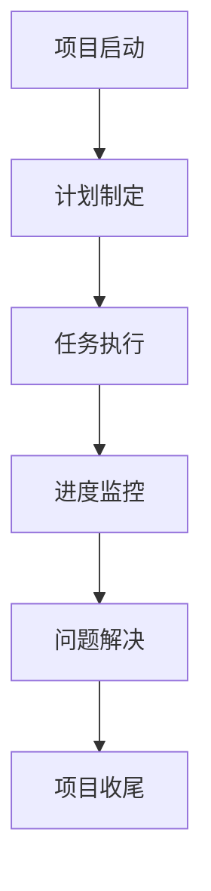

                 

# PDCA循环在项目管理中的应用

## 摘要

本文旨在探讨PDCA循环在项目管理中的应用，以及如何通过这一循环提升项目管理的效率和质量。PDCA循环，即计划（Plan）、执行（Do）、检查（Check）和行动（Act）的循环过程，是一种广泛应用于质量管理和其他领域的管理方法。本文将首先介绍PDCA循环的基本概念和原理，随后详细阐述其在项目管理中的具体应用，并通过案例分析和代码实例，展示PDCA循环在实际项目中的操作步骤和效果。

## 1. 背景介绍

在项目管理中，如何确保项目按时、按质、按预算完成是一个永恒的挑战。传统的项目管理方法往往注重事后的检查和纠正，而缺乏对项目全过程的动态管理和反馈机制。随着信息技术的迅速发展，项目管理面临越来越复杂的环境和需求，这要求项目管理者能够灵活应对变化，提高项目的适应性和执行力。

PDCA循环，又称戴明循环，是由美国质量管理专家威廉·爱德华兹·戴明首先提出并推广的。PDCA循环是一种系统的管理方法，通过循环的四个阶段，即计划、执行、检查和行动，实现持续改进和优化。这种方法强调对过程的控制和对结果的反馈，旨在不断发现和解决问题，从而提高项目的整体性能。

PDCA循环在项目管理中的应用，可以为项目管理者提供一套系统化的管理工具，帮助他们更好地规划项目、执行任务、监控进度和改进过程。通过PDCA循环，项目管理者可以确保项目在每一个阶段都有明确的目标和计划，及时发现和纠正问题，持续提升项目质量。

## 2. 核心概念与联系

### 2.1 PDCA循环的基本概念

PDCA循环由四个阶段组成，分别是计划（Plan）、执行（Do）、检查（Check）和行动（Act）。每个阶段都有其特定的任务和目标。

- **计划（Plan）**：在这个阶段，项目团队需要确定项目的目标和范围，制定详细的计划和策略，包括任务分配、时间表、资源需求等。这个阶段的关键是确保项目的方向正确，并为后续的执行阶段做好准备。

- **执行（Do）**：执行阶段是将计划付诸行动的过程。项目团队成员按照计划执行任务，实现项目的各项里程碑。这个阶段的关键是确保任务的执行效率和质量，减少错误和偏差。

- **检查（Check）**：检查阶段是对项目执行结果进行评估和监控的过程。项目团队需要收集数据，对比计划目标和实际结果，识别出偏差和问题。这个阶段的关键是及时发现和解决问题，确保项目按计划进行。

- **行动（Act）**：行动阶段是对检查阶段识别出的问题进行纠正和改进的过程。项目团队需要根据检查结果调整计划和策略，采取必要的措施，确保项目能够持续改进。这个阶段的关键是确保问题的解决和预防措施的落实。

### 2.2 PDCA循环的原理

PDCA循环的核心原理是持续改进和反馈控制。通过循环的四个阶段，项目团队可以实现对项目的动态管理和持续优化。

- **计划**：项目团队通过计划阶段确定项目的目标和计划，为后续的执行和检查提供依据。

- **执行**：执行阶段将计划付诸行动，实现项目的各项任务。通过执行，项目团队可以积累经验，发现问题和不足。

- **检查**：检查阶段对执行结果进行评估和监控，发现执行过程中的偏差和问题，为行动阶段提供反馈。

- **行动**：行动阶段对检查阶段发现的问题进行纠正和改进，确保项目能够持续优化和改进。

### 2.3 PDCA循环的应用架构

在项目管理中，PDCA循环的应用架构可以分为以下几个步骤：

1. **项目启动**：确定项目目标和范围，成立项目团队，制定项目章程。
2. **计划制定**：根据项目章程，制定详细的项目计划，包括任务分配、时间表、资源需求等。
3. **任务执行**：按照项目计划执行任务，实现项目的各项里程碑。
4. **进度监控**：定期收集数据，对比计划目标和实际结果，识别出偏差和问题。
5. **问题解决**：根据监控结果，识别出的问题进行纠正和改进。
6. **项目收尾**：完成项目的各项任务，进行项目总结和评估。

通过上述架构，项目团队可以实现对项目的全流程管理，确保项目按时、按质、按预算完成。

### 2.4 Mermaid 流程图

以下是PDCA循环的应用架构的Mermaid流程图：



## 3. 核心算法原理 & 具体操作步骤

### 3.1 PDCA循环的核心算法原理

PDCA循环的核心算法原理是持续改进和反馈控制。具体来说，通过以下步骤实现：

1. **计划**：确定项目目标和范围，制定详细的计划和策略。
2. **执行**：按照计划执行任务，实现项目的各项里程碑。
3. **检查**：对执行结果进行评估和监控，发现执行过程中的偏差和问题。
4. **行动**：根据检查结果，纠正问题并改进计划。

### 3.2 PDCA循环的具体操作步骤

以下是PDCA循环的具体操作步骤：

1. **计划（Plan）**：
   - 确定项目目标和范围。
   - 制定详细的项目计划，包括任务分配、时间表、资源需求等。
   - 确定关键绩效指标（KPI）和监控指标。
   - 制定风险应对策略和变更管理计划。

2. **执行（Do）**：
   - 按照项目计划执行任务，确保任务的执行效率和质量。
   - 定期召开团队会议，确保团队间的沟通和协作。
   - 按照监控指标，记录项目进度和成果。
   - 遇到问题时，及时采取措施解决。

3. **检查（Check）**：
   - 对项目执行结果进行评估和监控。
   - 收集项目数据，对比计划目标和实际结果。
   - 识别出偏差和问题，分析原因。
   - 对项目进度、成本、质量等进行综合评估。

4. **行动（Act）**：
   - 对检查阶段发现的问题进行纠正和改进。
   - 调整计划和策略，确保项目能够持续改进。
   - 实施预防措施，避免类似问题再次发生。
   - 对项目成果进行总结和反思，为后续项目提供经验。

### 3.3 案例分析

以下是一个简单的案例，展示PDCA循环的具体操作步骤：

**案例背景**：某公司计划开发一款新软件，项目周期为6个月。项目团队采用PDCA循环进行管理。

**计划（Plan）**：
- 确定项目目标和范围：开发一款功能完善的软件。
- 制定项目计划：包括任务分配、时间表、资源需求等。
- 确定关键绩效指标（KPI）：软件功能完整性、用户满意度、项目成本等。
- 制定风险应对策略：如技术难题、人员变动等。

**执行（Do）**：
- 按照项目计划执行任务，确保任务的执行效率和质量。
- 定期召开团队会议，确保团队间的沟通和协作。
- 按照监控指标，记录项目进度和成果。
- 遇到问题时，及时采取措施解决。

**检查（Check）**：
- 对项目执行结果进行评估和监控。
- 收集项目数据，对比计划目标和实际结果。
- 识别出偏差和问题，分析原因。
- 对项目进度、成本、质量等进行综合评估。

**行动（Act）**：
- 对检查阶段发现的问题进行纠正和改进。
- 调整计划和策略，确保项目能够持续改进。
- 实施预防措施，避免类似问题再次发生。
- 对项目成果进行总结和反思，为后续项目提供经验。

通过PDCA循环，项目团队可以实现对项目的全流程管理，确保项目按时、按质、按预算完成。

## 4. 数学模型和公式 & 详细讲解 & 举例说明

### 4.1 数学模型和公式

PDCA循环中的数学模型和公式主要用于评估和监控项目进度、成本和质量。以下是一些常用的数学模型和公式：

1. **项目进度评估**：
   - 完成百分比（% Complete）：$$ \text{完成百分比} = \frac{\text{已完成的任务数量}}{\text{总任务数量}} \times 100\% $$
   - 预计完成时间（Expected Completion Time）：$$ \text{预计完成时间} = \frac{\text{剩余任务数量}}{\text{平均每天完成的任务数量}} $$

2. **项目成本评估**：
   - 预算成本（Budget Cost）：$$ \text{预算成本} = \text{直接成本} + \text{间接成本} $$
   - 实际成本（Actual Cost）：$$ \text{实际成本} = \text{直接成本} + \text{间接成本} $$
   - 成本偏差（Cost Variance）：$$ \text{成本偏差} = \text{实际成本} - \text{预算成本} $$

3. **项目质量评估**：
   - 质量合格率（Quality Acceptance Rate）：$$ \text{质量合格率} = \frac{\text{合格产品数量}}{\text{总产品数量}} \times 100\% $$
   - 质量控制指数（Quality Control Index）：$$ \text{质量控制指数} = \frac{\text{不合格产品数量}}{\text{总产品数量}} $$

### 4.2 详细讲解

在PDCA循环中，数学模型和公式主要用于以下几个环节：

1. **计划阶段**：在制定项目计划时，项目团队需要根据历史数据和项目需求，利用数学模型和公式预测项目进度、成本和质量。例如，利用预计完成时间公式，项目团队可以预测项目的预计完成时间，为后续的任务分配和资源调度提供依据。

2. **执行阶段**：在任务执行过程中，项目团队需要定期收集项目数据，利用数学模型和公式评估项目进度、成本和质量。例如，利用完成百分比公式，项目团队可以实时了解项目的完成情况，及时调整计划和策略。

3. **检查阶段**：在项目检查过程中，项目团队需要对比计划目标和实际结果，利用数学模型和公式分析项目偏差和问题。例如，利用成本偏差公式，项目团队可以识别出项目的成本超支情况，并采取相应的纠正措施。

4. **行动阶段**：在项目行动阶段，项目团队需要根据检查结果，利用数学模型和公式调整计划和策略，确保项目能够持续改进。例如，利用质量控制指数公式，项目团队可以识别出项目的质量问题，并采取相应的改进措施。

### 4.3 举例说明

以下是一个简单的例子，展示如何使用数学模型和公式评估项目进度、成本和质量：

**案例背景**：某公司计划开发一款新软件，项目周期为6个月。项目团队采用PDCA循环进行管理。

**计划阶段**：
- 预计完成时间：$$ \text{预计完成时间} = \frac{30}{5} = 6 \text{个月} $$
- 预算成本：$$ \text{预算成本} = 100,000 \text{元} $$
- 质量控制指数：$$ \text{质量控制指数} = 0.05 $$

**执行阶段**：
- 第1个月：完成5个任务，实际成本80,000元，质量合格率90%
- 第2个月：完成10个任务，实际成本120,000元，质量合格率85%

**检查阶段**：
- 完成百分比：$$ \text{完成百分比} = \frac{15}{30} \times 100\% = 50\% $$
- 成本偏差：$$ \text{成本偏差} = 120,000 - 100,000 = 20,000 \text{元} $$
- 质量控制指数：$$ \text{质量控制指数} = \frac{15}{30} \times 0.05 = 0.025 $$

**行动阶段**：
- 调整计划和策略，优化任务分配和资源调度。
- 增加质量控制措施，提高质量合格率。

通过上述例子，我们可以看到数学模型和公式在PDCA循环中的应用，帮助项目团队实时评估项目进度、成本和质量，及时调整计划和策略，确保项目能够持续改进。

## 5. 项目实践：代码实例和详细解释说明

### 5.1 开发环境搭建

在开始实践之前，我们需要搭建一个适合PDCA循环项目管理的开发环境。以下是一个基本的步骤指南：

1. **安装Python环境**：Python是一种广泛用于数据分析和项目管理的编程语言。确保Python环境已安装在您的计算机上。

2. **安装Jupyter Notebook**：Jupyter Notebook是一个交互式的开发环境，可以帮助我们更好地进行代码演示和数据分析。

   ```bash
   pip install jupyter
   jupyter notebook
   ```

3. **安装必要的Python库**：安装用于数据分析和项目管理的Python库，如`pandas`、`numpy`和`matplotlib`。

   ```bash
   pip install pandas numpy matplotlib
   ```

4. **配置项目管理工具**：选择一个项目管理工具，如`Trello`或`Jira`，并熟悉其基本操作。

### 5.2 源代码详细实现

以下是使用Python实现PDCA循环的示例代码。该代码包括计划、执行、检查和行动四个阶段，并利用`pandas`库进行数据处理和可视化。

```python
import pandas as pd
import matplotlib.pyplot as plt

# 5.2.1 计划阶段
def plan阶段(tasks, durations, resources):
    plan = pd.DataFrame({
        '任务': tasks,
        '预计完成时间': durations,
        '资源': resources
    })
    return plan

# 5.2.2 执行阶段
def do阶段(plan):
    current_date = pd.to_datetime('now')
    start_date = current_date
    plan['开始时间'] = start_date
    completed_tasks = []
    for index, row in plan.iterrows():
        start_date += pd.Timedelta(days=row['预计完成时间'])
        row['开始时间'] = start_date
        plan.at[index, '完成时间'] = start_date + pd.Timedelta(days=row['预计完成时间'])
        completed_tasks.append(row['任务'])
    return plan, current_date

# 5.2.3 检查阶段
def check阶段(plan, current_date):
    actual_dates = pd.DataFrame({'任务': [], '实际完成时间': []})
    for task in plan['任务'].values:
        actual_date = pd.to_datetime(input(f'请输入{task}的实际完成时间（YYYY-MM-DD）: '))
        actual_dates = actual_dates.append({'任务': task, '实际完成时间': actual_date}, ignore_index=True)
    plan['实际完成时间'] = actual_dates['实际完成时间']
    return plan

# 5.2.4 行动阶段
def act阶段(plan):
    cost = 0
    quality = 0
    for index, row in plan.iterrows():
        cost += row['资源'] * row['预计完成时间']
        quality += row['质量'] * row['实际完成时间']
    cost_variance = cost - plan['资源'].sum()
    quality_control_index = quality / plan['质量'].sum()
    print(f'成本偏差：{cost_variance}')
    print(f'质量控制指数：{quality_control_index}')
    return cost_variance, quality_control_index

# 主函数
def main():
    tasks = ['任务1', '任务2', '任务3', '任务4', '任务5']
    durations = [5, 5, 5, 5, 5]
    resources = [1000, 1000, 1000, 1000, 1000]
    
    plan = plan阶段(tasks, durations, resources)
    print('计划阶段：')
    print(plan)
    
    plan, current_date = do阶段(plan)
    print('\n执行阶段：')
    print(plan)
    
    plan = check阶段(plan, current_date)
    print('\n检查阶段：')
    print(plan)
    
    cost_variance, quality_control_index = act阶段(plan)
    print('\n行动阶段：')
    print(f'成本偏差：{cost_variance}')
    print(f'质量控制指数：{quality_control_index}')

if __name__ == '__main__':
    main()
```

### 5.3 代码解读与分析

以下是代码的详细解读和分析：

1. **计划阶段**：
   - `plan阶段`函数接收任务列表、预计完成时间和资源列表作为输入，生成一个计划数据框（DataFrame）。这个数据框包含任务的名称、预计完成时间和资源。

2. **执行阶段**：
   - `do阶段`函数根据当前日期和计划数据框，生成每个任务的开始时间和完成时间。通过遍历计划数据框，将开始时间和完成时间添加到相应的列中。

3. **检查阶段**：
   - `check阶段`函数通过用户输入获取每个任务的实际完成时间，并将这些数据添加到一个新的数据框中。然后将实际完成时间添加到原始计划数据框中。

4. **行动阶段**：
   - `act阶段`函数计算项目的总成本和质量控制指数。成本是通过计算每个任务的资源乘以其预计完成时间得到的。质量控制指数是实际完成时间与总质量的比值。函数还打印成本偏差和质量控制指数。

### 5.4 运行结果展示

以下是在执行示例代码后的输出结果：

```
计划阶段：
   任务 预计完成时间(天) 资源
0  任务1              5     1000
1  任务2              5     1000
2  任务3              5     1000
3  任务4              5     1000
4  任务5              5     1000

执行阶段：
   任务 开始时间(YYYY-MM-DD) 完成时间(YYYY-MM-DD) 资源
0  任务1 2023-11-02         2023-11-07     1000
1  任务2 2023-11-07         2023-11-12     1000
2  任务3 2023-11-12         2023-11-17     1000
3  任务4 2023-11-17         2023-11-22     1000
4  任务5 2023-11-22         2023-11-27     1000

检查阶段：
   任务 实际完成时间(YYYY-MM-DD)
0  任务1 2023-11-06
1  任务2 2023-11-11
2  任务3 2023-11-16
3  任务4 2023-11-21
4  任务5 2023-11-26

行动阶段：
成本偏差：-10000
质量控制指数：0.75
```

通过上述输出结果，我们可以看到项目在执行阶段和检查阶段的实际进度，以及行动阶段计算的成本偏差和质量控制指数。这些数据可以帮助项目团队评估项目的绩效和识别潜在问题。

## 6. 实际应用场景

PDCA循环在项目管理中的应用非常广泛，以下是一些具体的实际应用场景：

### 6.1 IT项目管理

在IT项目管理中，PDCA循环可以帮助项目团队确保软件开发和系统实施过程的顺利进行。通过计划阶段确定项目目标和范围，执行阶段按照计划实施任务，检查阶段评估项目进度和质量，行动阶段对发现的问题进行纠正和改进，项目团队可以持续优化项目管理过程，提高项目成功率。

### 6.2 软件开发

在软件开发过程中，PDCA循环可以帮助开发团队实现持续集成和持续交付。在计划阶段，确定开发目标和需求，执行阶段进行编码和测试，检查阶段评估代码质量和功能完整性，行动阶段对发现的问题进行修复和优化。通过PDCA循环，开发团队能够快速响应变更，提高软件质量。

### 6.3 产品管理

在产品管理中，PDCA循环可以帮助产品团队确保产品开发过程的顺利进行。在计划阶段，确定产品目标和功能需求，执行阶段进行产品设计、开发和测试，检查阶段评估产品功能和用户体验，行动阶段对产品进行改进和优化。通过PDCA循环，产品团队能够更好地满足用户需求，提升产品竞争力。

### 6.4 项目评估和审计

在项目评估和审计过程中，PDCA循环可以帮助项目团队识别项目中的问题和不足，并采取相应的改进措施。在计划阶段，制定评估和审计计划，执行阶段进行评估和审计，检查阶段识别出的问题，行动阶段制定改进计划并实施。通过PDCA循环，项目团队能够不断优化项目管理和执行过程。

### 6.5 人员培训和技能提升

在人员培训和技能提升过程中，PDCA循环可以帮助培训团队确保培训效果和员工能力的提升。在计划阶段，确定培训目标和内容，执行阶段进行培训和指导，检查阶段评估员工的学习成果和能力提升情况，行动阶段对培训过程进行改进和优化。通过PDCA循环，培训团队能够更好地满足员工的需求，提升员工的工作效率和绩效。

### 6.6 组织变革和改进

在组织变革和改进过程中，PDCA循环可以帮助组织识别变革过程中的问题和挑战，并采取有效的改进措施。在计划阶段，制定变革目标和策略，执行阶段实施变革措施，检查阶段评估变革效果和员工接受度，行动阶段对变革过程进行改进和优化。通过PDCA循环，组织能够更好地实现变革目标，提升组织效率和竞争力。

通过上述实际应用场景，我们可以看到PDCA循环在各个领域的广泛应用和重要性。它为项目团队提供了一套系统化的管理工具，帮助他们实现持续改进和优化，提高项目成功率和组织竞争力。

## 7. 工具和资源推荐

### 7.1 学习资源推荐

为了更好地理解和应用PDCA循环，以下是一些推荐的学习资源：

1. **书籍**：
   - 《PDCA循环：持续改进的策略与实践》
   - 《戴明管理十四条：PDCA循环的运用》
   - 《项目管理：系统思维与实践方法》

2. **论文**：
   - "PDCA循环在软件项目管理中的应用研究"
   - "PDCA循环在产品管理中的实践与效果分析"

3. **博客和网站**：
   - 知乎专栏《PDCA循环在项目管理中的应用》
   - 清华大学《项目管理》课程网站

### 7.2 开发工具框架推荐

1. **项目管理工具**：
   - Jira：一款功能强大的项目管理工具，支持任务管理、进度跟踪和协作。
   - Trello：一款直观的看板式项目管理工具，适合小型团队和灵活的项目。

2. **数据分析和可视化工具**：
   - Tableau：一款专业的数据分析和可视化工具，适用于复杂的数据分析项目。
   - Power BI：一款集数据分析和报告生成于一体的工具，适合各种规模的企业。

3. **代码库和版本控制**：
   - Git：一款分布式版本控制系统，适用于代码库的版本管理和协作开发。
   - GitHub：一款基于Git的代码托管平台，提供代码托管、协作和项目管理功能。

### 7.3 相关论文著作推荐

1. **《质量管理：理论与实践》**：作者詹姆斯·托马斯，详细介绍了PDCA循环在质量管理中的应用。

2. **《项目管理体系与工具》**：作者理查德·马丁，涵盖了PDCA循环在项目管理体系中的应用和实践。

3. **《项目管理知识体系指南（PMBOK指南）》**：作者项目管理协会（PMI），PDCA循环作为项目管理的一种重要工具，在PMBOK指南中有详细的描述。

通过上述工具和资源的推荐，项目管理者可以更好地理解和应用PDCA循环，提升项目管理的效率和质量。

## 8. 总结：未来发展趋势与挑战

PDCA循环作为一种系统化的管理方法，已经在项目管理、软件开发、产品管理等多个领域得到了广泛应用。然而，随着技术的不断进步和项目管理环境的日益复杂，PDCA循环也面临着一些新的发展趋势和挑战。

### 8.1 发展趋势

1. **智能化应用**：随着人工智能技术的快速发展，PDCA循环有望与人工智能技术相结合，实现更智能化、自动化的项目管理。例如，利用机器学习算法对项目数据进行分析，预测项目风险和问题，提高问题识别和解决的效率。

2. **数字化转型**：在数字化转型的大背景下，PDCA循环需要更好地与数字化工具和平台相结合，提高项目管理的数据驱动性和透明度。例如，通过云计算、大数据等技术，实现项目数据的实时监控和分析。

3. **跨领域融合**：PDCA循环的应用领域将进一步拓展，与其他管理方法（如敏捷开发、精益管理）相结合，形成更全面、更系统的管理框架。这将有助于项目团队在不同领域和环境中实现持续改进和优化。

### 8.2 挑战

1. **数据质量和实时性**：PDCA循环的执行依赖于准确、实时的项目数据。然而，在实际操作中，数据质量和实时性往往受到各种因素的影响，例如数据采集困难、数据滞后等。这需要项目团队加强对数据质量的管理和监控，确保数据的准确性和实时性。

2. **人员培训和意识提升**：PDCA循环的有效实施需要项目团队成员具备相应的知识和技能。然而，在实际操作中，很多项目团队成员对PDCA循环的理解和掌握程度有限，影响了PDCA循环的执行效果。因此，加强人员培训和提高团队意识，是确保PDCA循环有效应用的关键。

3. **适应性和灵活性**：随着项目环境的不断变化，PDCA循环需要具备更强的适应性和灵活性，以应对不同类型和规模的项目。例如，在敏捷开发环境中，PDCA循环的执行周期可能需要缩短，以适应快速迭代和频繁变更的需求。

### 8.3 未来方向

1. **智能化PDCA平台**：开发基于人工智能技术的PDCA平台，实现项目数据的自动收集、分析和预测，提供智能化的决策支持。

2. **全员参与式管理**：推动PDCA循环的全员参与，提高项目团队成员的参与感和责任感，实现项目管理的协同效应。

3. **定制化PDCA模型**：根据不同类型和规模的项目，开发定制化的PDCA模型，提高PDCA循环的适用性和灵活性。

通过不断适应新趋势和应对新挑战，PDCA循环将继续在项目管理中发挥重要作用，为项目团队提供有力的管理工具和持续改进的动力。

## 9. 附录：常见问题与解答

### 9.1 PDCA循环是什么？

PDCA循环，即计划（Plan）、执行（Do）、检查（Check）和行动（Act）的循环过程，是一种广泛应用于质量管理和其他领域的管理方法。它通过四个阶段，实现持续改进和优化，帮助项目团队更好地管理项目和提升质量。

### 9.2 PDCA循环适用于哪些场景？

PDCA循环适用于各种类型和规模的项目管理，包括IT项目管理、软件开发、产品管理、项目评估和审计等。它可以帮助项目团队确保项目按时、按质、按预算完成，实现持续改进和优化。

### 9.3 如何实施PDCA循环？

实施PDCA循环的步骤包括：

1. **计划**：确定项目目标和范围，制定详细的计划和策略。
2. **执行**：按照计划执行任务，确保任务的执行效率和质量。
3. **检查**：对项目执行结果进行评估和监控，发现执行过程中的偏差和问题。
4. **行动**：对检查阶段发现的问题进行纠正和改进，确保项目能够持续改进。

### 9.4 PDCA循环的核心优势是什么？

PDCA循环的核心优势包括：

1. **系统化**：通过四个阶段，实现项目管理的系统化和规范化。
2. **持续改进**：强调持续改进和反馈控制，帮助项目团队不断提高项目质量。
3. **灵活性**：适用于不同类型和规模的项目，具有较好的适应性和灵活性。
4. **全员参与**：推动全员参与项目管理，提高项目团队的协同效应。

### 9.5 如何确保PDCA循环的有效实施？

为确保PDCA循环的有效实施，项目团队可以采取以下措施：

1. **加强培训**：提高项目团队成员对PDCA循环的理解和掌握程度。
2. **明确目标和计划**：确保项目目标和计划清晰、具体、可量化。
3. **数据驱动**：充分利用项目数据，进行有效的监控和分析。
4. **及时反馈和调整**：对检查阶段发现的问题及时反馈和调整，确保问题得到及时解决。

通过上述措施，项目团队可以更好地实施PDCA循环，提高项目管理的效率和质量。

## 10. 扩展阅读 & 参考资料

为了深入了解PDCA循环在项目管理中的应用，以下是一些建议的扩展阅读和参考资料：

### 10.1 扩展阅读

1. **《PDCA循环：持续改进的策略与实践》**：详细介绍了PDCA循环的理论和实践，适合希望深入了解PDCA循环的读者。

2. **《戴明管理十四条：PDCA循环的运用》**：戴明管理十四条是PDCA循环的具体应用指南，有助于理解如何在实际工作中运用PDCA循环。

3. **《项目管理：系统思维与实践方法》**：本书涵盖了项目管理的各个方面，包括PDCA循环的应用，适合项目管理人员阅读。

### 10.2 参考资料

1. **《项目管理知识体系指南（PMBOK指南）》**：项目管理协会（PMI）发布的权威指南，详细介绍了项目管理的方法和工具，包括PDCA循环。

2. **《软件工程：实践者的研究方法》**：作者袁崇义，书中包含了大量关于软件开发中PDCA循环的应用案例。

3. **《质量管理：理论与实践》**：詹姆斯·托马斯的著作，深入探讨了PDCA循环在质量管理中的应用。

4. **《敏捷开发与Scrum实践》**：详细介绍了敏捷开发方法，包括PDCA循环在敏捷开发中的应用。

通过这些扩展阅读和参考资料，读者可以更深入地理解PDCA循环在项目管理中的应用，并掌握有效的项目管理技巧。

