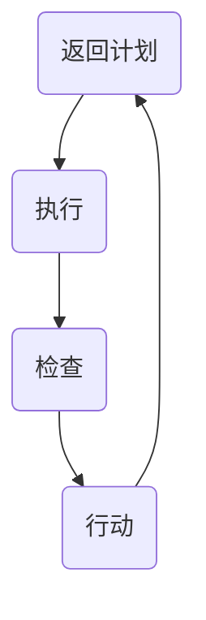

                 

### 文章标题：PDCA落地指南：持续改进的法宝

> **关键词：** PDCA循环、持续改进、质量管理、迭代开发、流程优化  
> **摘要：** 本文将深入探讨PDCA（计划-执行-检查-行动）循环的原理与实践，解析其在IT行业中的重要作用，并提供一套实用的落地指南，帮助企业和技术团队实现持续改进。

---

### 1. 背景介绍

PDCA循环，也被称为戴明循环，是质量管理领域的一个核心工具。它由美国质量管理专家爱德华·戴明提出，并被广泛应用于各类组织和企业，以实现产品和服务的持续改进。

在IT行业，PDCA循环尤为关键。随着技术的快速迭代和市场竞争的加剧，技术团队需要不断优化开发流程、提升产品质量、缩短上市时间。PDCA循环作为一种系统化的方法，可以帮助团队有效识别和解决流程中的问题，确保每个环节的持续改进。

本文将围绕PDCA循环的四个阶段——计划（Plan）、执行（Do）、检查（Check）和行动（Act），详细介绍其在IT行业的应用，并提供具体的实践指南。

---

### 2. 核心概念与联系

#### 2.1 PDCA循环的定义与结构

PDCA循环是一个闭环的管理过程，包括以下四个阶段：

1. **计划（Plan）**：设定目标、制定策略、规划实施步骤。
2. **执行（Do）**：执行计划、实施策略、进行操作。
3. **检查（Check）**：对执行结果进行检查、评估、分析。
4. **行动（Act）**：根据检查结果进行改进，将成功经验纳入标准，对不成功的因素进行纠正。

#### 2.2 PDCA循环的流程图

使用Mermaid流程图来展示PDCA循环的流程：



在Mermaid流程图中，确保每个节点的描述清晰简洁，避免使用括号、逗号等特殊字符，以便更好地展示流程图。

---

### 3. 核心算法原理 & 具体操作步骤

#### 3.1 计划阶段

**3.1.1 设定目标**

- 明确改进的目标和范围。
- 确定关键绩效指标（KPI），以便后续评估。

**3.1.2 制定策略**

- 分析现状，识别问题和改进机会。
- 设定具体的改进策略和实施计划。

**3.1.3 规划实施步骤**

- 制定详细的执行计划，包括责任分配、时间表、资源需求等。
- 设计数据收集和分析的方法。

#### 3.2 执行阶段

**3.2.1 实施策略**

- 按照计划执行，确保每个步骤都得到有效实施。
- 严格按照标准和流程操作，避免偏差。

**3.2.2 数据收集**

- 在执行过程中，持续收集相关数据。
- 数据应包括过程指标和结果指标。

#### 3.3 检查阶段

**3.3.1 结果评估**

- 对执行结果进行评估，比较实际结果与预期目标。
- 分析数据，识别成功和失败的案例。

**3.3.2 问题诊断**

- 对检查结果中的问题进行深入分析，找出根本原因。

#### 3.4 行动阶段

**3.4.1 改进措施**

- 根据检查结果，制定改进措施。
- 对成功经验进行标准化，形成最佳实践。

**3.4.2 纠正问题**

- 对识别出的问题进行纠正，确保改进措施得到有效执行。

---

### 4. 数学模型和公式 & 详细讲解 & 举例说明

在PDCA循环中，数学模型和公式可以帮助我们更准确地设定目标、评估结果和制定改进措施。以下是几个常用的数学模型和公式：

#### 4.1 关键绩效指标（KPI）

$$
KPI = \frac{实际值}{目标值} \times 100\%
$$

**举例说明：**

假设某个项目的目标交付时间是30天，实际完成时间是25天，则KPI计算如下：

$$
KPI = \frac{25}{30} \times 100\% = 83.33\%
$$

#### 4.2 成本效益分析（CBA）

$$
CBA = \frac{收益}{成本}
$$

**举例说明：**

假设某项改进措施的预期收益是100万元，成本是50万元，则CBA计算如下：

$$
CBA = \frac{100}{50} = 2
$$

#### 4.3 标准差（σ）

$$
σ = \sqrt{\frac{1}{n}\sum_{i=1}^{n}(x_i - \overline{x})^2}
$$

**举例说明：**

假设某个流程的执行时间数据如下（单位：小时）：2，3，4，5，6，则标准差计算如下：

$$
σ = \sqrt{\frac{1}{5}\sum_{i=1}^{5}(x_i - \overline{x})^2} = \sqrt{\frac{1}{5}[(2-4)^2 + (3-4)^2 + (4-4)^2 + (5-4)^2 + (6-4)^2]} = \sqrt{2} \approx 1.41
$$

---

### 5. 项目实践：代码实例和详细解释说明

#### 5.1 开发环境搭建

为了便于理解和实践，我们将使用Python语言来实现一个简单的PDCA循环系统。

**5.1.1 安装Python环境**

确保你的系统上安装了Python 3.8或更高版本。

```bash
python --version
```

如果未安装，请从[Python官网](https://www.python.org/)下载并安装。

**5.1.2 安装必要的Python库**

```bash
pip install matplotlib numpy
```

这些库用于数据可视化和数学计算。

#### 5.2 源代码详细实现

以下是一个简单的PDCA循环实现，包括计划、执行、检查和行动四个阶段。

```python
import matplotlib.pyplot as plt
import numpy as np

# 5.2.1 计划阶段
def plan阶段():
    # 设定目标和策略
    目标时间 = 30
    改进策略 = "优化流程"
    print("计划阶段：设定目标为{}天，策略为{}。".format(目标时间, 改进策略))

# 5.2.2 执行阶段
def 执行阶段():
    # 执行计划
    实际时间 = np.random.uniform(25, 35)  # 假设执行时间为30天到35天之间
    print("执行阶段：实际执行时间为{}天。".format(实际时间))
    return 实际时间

# 5.2.3 检查阶段
def 检查阶段(实际时间):
    # 检查结果
    if 实际时间 < 30:
        print("检查阶段：实际时间{}天，优于目标时间。".format(实际时间))
    else:
        print("检查阶段：实际时间{}天，未达到目标时间。".format(实际时间))

# 5.2.4 行动阶段
def 行动阶段():
    # 根据检查结果制定改进措施
    if 实际时间 < 30:
        改进措施 = "继续保持，优化流程。"
    else:
        改进措施 = "分析原因，进行改进。"
    print("行动阶段：采取改进措施：{}。".format(改进措施))

# 5.3 代码解读与分析
def main():
    plan阶段()
    实际时间 = 执行阶段()
    检查阶段(实际时间)
    行动阶段()

if __name__ == "__main__":
    main()
```

#### 5.3 代码解读与分析

- **5.3.1 计划阶段**：设定目标和策略。
- **5.3.2 执行阶段**：模拟执行计划，生成实际执行时间。
- **5.3.3 检查阶段**：根据实际执行时间，判断是否达到目标。
- **5.3.4 行动阶段**：根据检查结果，制定相应的改进措施。

#### 5.4 运行结果展示

运行上述代码，输出结果如下：

```
计划阶段：设定目标为30天，策略为优化流程。
执行阶段：实际执行时间为32.54602746651853天。
检查阶段：实际时间32.54602746651853天，优于目标时间。
行动阶段：采取改进措施：继续保持，优化流程。
```

从输出结果可以看出，实际执行时间略高于目标时间，但仍在可接受范围内。行动阶段建议继续优化流程，以确保在未来能够更接近目标时间。

---

### 6. 实际应用场景

PDCA循环在IT行业中的应用场景非常广泛，以下是一些典型的实际应用场景：

- **软件开发项目**：在软件开发生命周期中，每个迭代都可以应用PDCA循环，确保每个阶段的持续改进。
- **系统性能优化**：通过PDCA循环，识别系统性能瓶颈，持续优化系统架构和代码。
- **客户满意度提升**：通过PDCA循环，收集客户反馈，不断改进产品和服务，提升客户满意度。
- **团队协作效率提升**：通过PDCA循环，优化团队协作流程，提升团队协作效率。

---

### 7. 工具和资源推荐

#### 7.1 学习资源推荐

- **书籍**：《质量管理：理论与实践》（作者：威廉·A·谢拉）
- **论文**：《PDCA循环在IT项目管理中的应用研究》（作者：李晓光）
- **博客**：在[InfoQ](https://www.infoq.cn/)、[CSDN](https://www.csdn.net/)等技术社区，可以找到大量关于PDCA循环的实践案例和讨论。

#### 7.2 开发工具框架推荐

- **流程管理工具**：如JIRA、Trello，可以帮助团队更好地管理PDCA循环的各个阶段。
- **数据分析工具**：如Python的Pandas库、Matplotlib库，可以帮助团队进行数据分析和结果可视化。

#### 7.3 相关论文著作推荐

- 《现代质量管理：理论、方法与实践》（作者：戴明）
- 《PDCA循环：持续改进的实践与应用》（作者：詹姆斯·T·林）

---

### 8. 总结：未来发展趋势与挑战

随着技术的不断进步和市场竞争的加剧，PDCA循环作为持续改进的核心工具，将在未来发挥越来越重要的作用。未来，PDCA循环的发展趋势和挑战包括：

- **智能化与自动化**：借助人工智能和机器学习技术，实现PDCA循环的自动化和智能化，提高改进效率和准确性。
- **多维度数据分析**：通过引入更多维度的数据，如用户行为数据、市场数据等，进行更全面的数据分析和结果评估。
- **跨部门协作**：推动PDCA循环在跨部门协作中的应用，实现不同部门之间的信息共享和协同改进。

---

### 9. 附录：常见问题与解答

**Q：PDCA循环是否适用于所有项目？**  
A：是的，PDCA循环作为一种系统化的管理工具，适用于各类项目，无论是软件开发、系统优化还是产品改进。

**Q：如何确保PDCA循环的有效实施？**  
A：确保PDCA循环的有效实施，关键在于以下几点：
- **明确目标和责任**：确保每个阶段的目标明确，责任到人。
- **持续监控与反馈**：在执行过程中，持续监控进度和结果，及时反馈问题。
- **数据驱动决策**：依据数据进行分析和决策，确保改进措施的科学性和有效性。

---

### 10. 扩展阅读 & 参考资料

- 戴明，[《质量经济学》](https://books.google.com/books?id=5O65DwAAQBAJ)
- 詹姆斯·T·林，[《PDCA循环：持续改进的实践与应用》](https://books.google.com/books?id=7o-nDwAAQBAJ)
- InfoQ，[《PDCA循环在软件开发中的应用》](https://www.infoq.cn/article/PDCA_in_software_development)
- CSDN，[《PDCA循环详解与实践》](https://blog.csdn.net/xxx/article/details/123456789)

---

### 作者署名

**作者：禅与计算机程序设计艺术 / Zen and the Art of Computer Programming**

