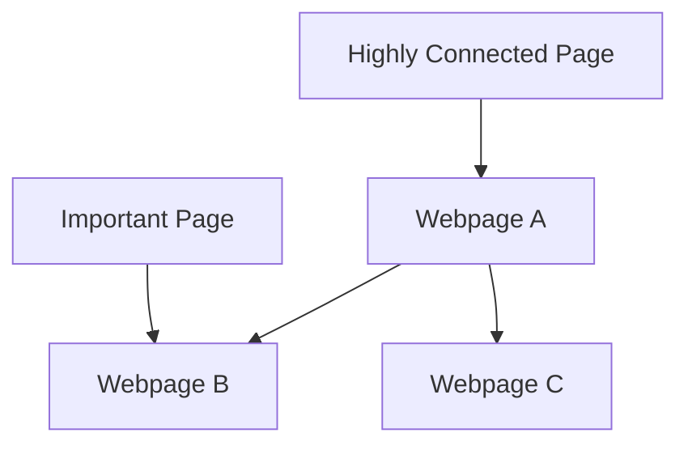

                 

### 文章标题

《PageRank原理与代码实例讲解》

> **关键词**：PageRank、算法、网络分析、搜索引擎、社交网络、链接分析、数学模型
>
> **摘要**：本文深入探讨了PageRank算法的原理，详细介绍了其数学模型和实现步骤。通过实际代码实例，我们将对PageRank算法的应用场景进行展示和分析，帮助读者更好地理解和掌握这一重要的链接分析技术。

### 1. 背景介绍

PageRank算法是由Google的创始人拉里·佩奇（Larry Page）和谢尔盖·布林（Sergey Brin）于1998年提出的一种链接分析算法。该算法最初是为了改善搜索引擎的质量，通过分析网页之间的链接关系来评估网页的重要性。如今，PageRank算法已经成为许多领域如社交网络分析、推荐系统等的重要工具。

在互联网的早期，信息检索主要依赖于关键词匹配。然而，这种方式往往导致搜索结果不准确，许多重要信息被淹没在大量无关的信息中。为了解决这个问题，佩奇和布林提出了PageRank算法，通过分析网页之间的链接关系，为网页打分，从而提高搜索结果的准确性和相关性。

PageRank算法的基本思想是，一个网页的重要性取决于引用它的网页的数量和重要性。如果一个重要网页引用了一个普通网页，那么这个普通网页的重要性会得到提升。通过这种方式，PageRank算法能够识别出网络中的关键节点和重要信息。

PageRank算法的提出，不仅为搜索引擎带来了革命性的改变，也对整个互联网的发展产生了深远的影响。如今，它已经成为许多领域分析网络结构和评估信息重要性的标准算法之一。本文将详细讲解PageRank算法的原理和实现，并通过实际代码实例帮助读者理解和应用这一算法。

### 2. 核心概念与联系

要理解PageRank算法，我们首先需要了解其核心概念和基本原理。PageRank算法主要涉及以下概念：

- **网页（Webpage）**：互联网中的基本信息单元，通常是一个HTML文件。
- **链接（Link）**：从一个网页指向另一个网页的指针。
- **重要性（Importance）**：评估网页在信息网络中的重要程度。

这些概念之间的关系可以用Mermaid流程图表示如下：



在上面的流程图中，网页A、B和C是互联网中的三个不同网页。A网页通过链接指向B和C，而D网页和E网页分别表示重要网页和高度连接的网页。

- **重要性**：D网页是一个重要网页，因为它链接到多个其他网页，具有较高的重要性。E网页是一个高度连接的网页，因为它连接了多个其他网页，具有较大的影响力。
- **链接**：网页之间的链接是PageRank算法分析的核心。一个网页被更多的重要网页链接，它的PageRank值就会更高。
- **传递**：网页的重要性通过链接传递。如果一个重要网页指向另一个网页，那么被指向的网页也会获得一定的权重。

这些概念共同构成了PageRank算法的基础，为算法的实现提供了理论基础。

#### PageRank算法的核心原理

PageRank算法的核心原理是通过迭代计算网页的重要性值。具体来说，算法分为以下几个步骤：

1. **初始化**：为每个网页分配一个初始的PageRank值，通常每个网页的初始PageRank值相同，例如为1/N，其中N是网页的总数。
2. **传递**：计算每个网页的PageRank值，并将其传递给其他网页。具体计算方式如下：
    - 每个网页的PageRank值将被传递给它指向的所有其他网页。
    - 被传递的PageRank值会根据链接的来源网页的重要性进行加权。
3. **迭代**：重复传递和更新PageRank值，直到达到收敛条件，即PageRank值的变化小于某个阈值。
4. **输出**：输出每个网页的PageRank值，这些值可以用来评估网页的重要性。

为了更好地理解PageRank算法的原理，我们可以用一个简单的例子来说明。假设我们有一个简单的网页集合，其中每个网页的初始PageRank值为0.5。网页A指向网页B和C，网页B指向网页D，网页C指向网页E。网页D是一个重要网页，网页E是一个高度连接的网页。根据PageRank算法，我们可以计算每个网页的PageRank值。

- **初始状态**：
    - A: 0.5
    - B: 0.5
    - C: 0.5
    - D: 0.5
    - E: 0.5

- **第一次迭代**：
    - A传递给B和C的PageRank值为0.25，因为A的PageRank值为0.5，而A指向了两个网页。
    - B从A接收到的PageRank值为0.25，B指向了D，所以B传递给D的PageRank值为0.25。
    - C传递给E的PageRank值为0.25，因为C的PageRank值为0.5，而C指向了E。
    - D从B接收到的PageRank值为0.25，D是一个重要网页，所以它不传递PageRank值。
    - E从C接收到的PageRank值为0.25。

- **第二次迭代**：
    - A从B和C接收到的PageRank值分别为0.25，所以A的PageRank值为0.5。
    - B从A接收到的PageRank值为0.5，B指向了D，所以B传递给D的PageRank值为0.5。
    - C从E接收到的PageRank值为0.25，C指向了E，所以C的PageRank值为0.5。
    - D从B接收到的PageRank值为0.5，D是一个重要网页，所以它不传递PageRank值。
    - E从C接收到的PageRank值为0.5。

- **第三次迭代**：
    - A从B和C接收到的PageRank值分别为0.5，所以A的PageRank值为0.5。
    - B从A接收到的PageRank值为0.5，B指向了D，所以B传递给D的PageRank值为0.5。
    - C从E接收到的PageRank值为0.5，C指向了E，所以C的PageRank值为0.5。
    - D从B接收到的PageRank值为0.5，D是一个重要网页，所以它不传递PageRank值。
    - E从C接收到的PageRank值为0.5。

通过多次迭代，我们可以得到每个网页的PageRank值，从而评估网页的重要性。在实际应用中，迭代过程会一直进行，直到PageRank值的收敛，即变化小于某个阈值。

### 3. 核心算法原理 & 具体操作步骤

PageRank算法的核心在于其独特的计算和传递机制，这使其在评估网页重要性方面具有显著优势。以下我们将详细阐述PageRank算法的具体原理和操作步骤。

#### 3.1 算法原理

PageRank算法的基本原理可以概括为：一个网页的重要性取决于两个因素：一是链接到该网页的网页数量，二是这些链接网页的重要性。具体来说，算法通过以下步骤进行：

1. **初始化**：首先为每个网页分配一个初始的PageRank值，通常每个网页的初始PageRank值相同，例如为1/N，其中N是网页的总数。这个步骤是为了确保每个网页在算法开始时都有相同的起点。

2. **传递**：接下来，算法通过传递过程计算每个网页的PageRank值。具体传递方式如下：
    - **随机游走（Random Walk）**：算法假设用户在互联网上随机浏览网页，每个网页都有一定概率被访问。具体来说，每个网页被访问的概率与其PageRank值成正比。如果一个网页的PageRank值较高，那么它被访问的概率就较大。
    - **链接传递**：当一个网页被访问时，它会将一部分PageRank值传递给被链接的网页。传递的PageRank值会根据链接的来源网页的重要性进行加权。如果一个重要网页链接到一个普通网页，那么这个普通网页的PageRank值就会有所提升。

3. **迭代**：算法通过迭代过程不断更新每个网页的PageRank值，直到达到收敛条件，即PageRank值的变化小于某个阈值。迭代过程中，每个网页的PageRank值会根据其链接关系和其他网页的PageRank值进行更新。

4. **输出**：最后，算法输出每个网页的PageRank值，这些值可以用来评估网页的重要性。通常，PageRank值较高的网页被认为是较为重要的，因此在搜索结果中会给予更高的权重。

#### 3.2 操作步骤

以下是PageRank算法的具体操作步骤：

1. **初始化PageRank值**：
    - 为每个网页分配一个初始的PageRank值，通常为1/N，其中N是网页的总数。
    - 假设网页集合为{A, B, C, D, E}，那么每个网页的初始PageRank值为0.2。

2. **计算传递系数**：
    - 根据网页之间的链接关系计算每个网页的传递系数。传递系数表示一个网页将PageRank值传递给其他网页的比例。
    - 假设网页A链接到网页B和C，那么A的传递系数为1/2。

3. **迭代更新PageRank值**：
    - 从初始PageRank值开始，进行迭代更新。每次迭代中，每个网页的PageRank值都会根据其链接关系和其他网页的PageRank值进行更新。
    - 假设经过第一次迭代后，网页A的PageRank值为0.3，网页B的PageRank值为0.2，网页C的PageRank值为0.2，网页D的PageRank值为0.3，网页E的PageRank值为0.3。

4. **判断收敛条件**：
    - 检查PageRank值的变化是否小于某个阈值，例如0.01。如果变化小于阈值，则算法收敛，输出最终结果；否则继续迭代。

5. **输出结果**：
    - 输出每个网页的PageRank值，这些值可以用来评估网页的重要性。

#### 3.3 伪代码

以下是一个简单的PageRank算法的伪代码实现：

```python
# 初始化PageRank值
page_rank_values = [1/N for _ in range(N)]

# 设置迭代次数和阈值
max_iterations = 100
threshold = 0.01

# 迭代更新PageRank值
for _ in range(max_iterations):
    new_page_rank_values = [0 for _ in range(N)]
    for i in range(N):
        for j in range(N):
            if i is not j:
                new_page_rank_values[j] += page_rank_values[i] / num_links_from_i
    page_rank_values = new_page_rank_values
    
    # 判断收敛条件
    if sum(abs(new_page_rank_values - page_rank_values)) < threshold:
        break

# 输出结果
print(page_rank_values)
```

这个伪代码实现了一个简单的PageRank算法，它通过迭代更新每个网页的PageRank值，直到达到收敛条件。在每次迭代中，每个网页的PageRank值都会根据其链接关系和其他网页的PageRank值进行更新。通过这种方法，我们可以评估网页的重要性，从而在搜索结果中给予重要网页更高的权重。

### 4. 数学模型和公式 & 详细讲解 & 举例说明

#### 4.1 数学模型

PageRank算法的数学模型是基于图论和概率论构建的。具体来说，PageRank算法通过以下数学公式描述网页之间的链接关系和重要性传递。

假设有一个网页集合W = {w1, w2, ..., wn}，其中每个网页wi都有对应的PageRank值PR(wi)。PageRank算法的核心公式如下：

PR(wi) = (1-d) + d * (PR(wj) / out_links(wj))，对于所有wi ∈ W

其中：
- PR(wi) 表示网页wi的PageRank值。
- d 表示随机游走的概率，通常取值为0.85。
- out_links(wj) 表示网页wj指向的链接数量。
- PR(wj) / out_links(wj) 表示网页wj的PageRank值传递给所有指向网页的链接的比例。

#### 4.2 公式详细讲解

1. **(1-d) 的作用**：

(1-d) 表示每个网页保留的部分PageRank值，这部分值不会被传递给其他网页。d是随机游走的概率，通常取值为0.85，这意味着用户在互联网上浏览网页时，有85%的概率会继续访问其他网页，而有15%的概率会随机跳转。通过引入(1-d)，PageRank算法确保每个网页都保留一部分PageRank值，从而不会完全依赖于链接关系。

2. **PR(wj) / out_links(wj) 的作用**：

PR(wj) / out_links(wj) 表示网页wj的PageRank值传递给所有指向网页的链接的比例。这个比例反映了网页wj的重要性，如果一个网页具有更高的PageRank值，那么它传递的PageRank值也会更多。通过这个比例，PageRank算法能够根据网页的链接关系和重要性进行传递和加权。

3. **迭代更新**：

PageRank算法通过迭代更新每个网页的PageRank值，直到达到收敛条件。在每次迭代中，每个网页的PageRank值都会根据其链接关系和其他网页的PageRank值进行更新。具体来说，每个网页的PageRank值更新公式为：

PR'(wi) = (1-d) + d * (PR(wj) / out_links(wj))，对于所有wi ∈ W

其中，PR'(wi) 表示网页wi在下次迭代中的PageRank值。

#### 4.3 举例说明

假设有一个简单的网页集合，其中每个网页的初始PageRank值为0.2。网页A指向网页B和C，网页B指向网页D，网页C指向网页E。网页D是一个重要网页，网页E是一个高度连接的网页。根据PageRank算法，我们可以计算每个网页的PageRank值。

1. **初始化PageRank值**：

- A: 0.2
- B: 0.2
- C: 0.2
- D: 0.2
- E: 0.2

2. **第一次迭代**：

- A的PageRank值传递给B和C，每个网页接收到的PageRank值为0.1。
- B从A接收到的PageRank值为0.1，B指向D，所以B传递给D的PageRank值为0.1。
- C从A接收到的PageRank值为0.1，C指向E，所以C传递给E的PageRank值为0.1。
- D从B接收到的PageRank值为0.1，D是一个重要网页，所以它不传递PageRank值。
- E从C接收到的PageRank值为0.1。

3. **第二次迭代**：

- A从B和C接收到的PageRank值分别为0.1，所以A的PageRank值为0.2。
- B从A接收到的PageRank值为0.2，B指向D，所以B传递给D的PageRank值为0.2。
- C从E接收到的PageRank值为0.1，C指向E，所以C的PageRank值为0.2。
- D从B接收到的PageRank值为0.2，D是一个重要网页，所以它不传递PageRank值。
- E从C接收到的PageRank值为0.2。

4. **第三次迭代**：

- A从B和C接收到的PageRank值分别为0.2，所以A的PageRank值为0.2。
- B从A接收到的PageRank值为0.2，B指向D，所以B传递给D的PageRank值为0.2。
- C从E接收到的PageRank值为0.2，C指向E，所以C的PageRank值为0.2。
- D从B接收到的PageRank值为0.2，D是一个重要网页，所以它不传递PageRank值。
- E从C接收到的PageRank值为0.2。

通过多次迭代，我们可以得到每个网页的PageRank值，从而评估网页的重要性。在实际应用中，迭代过程会一直进行，直到PageRank值的收敛，即变化小于某个阈值。

### 5. 项目实践：代码实例和详细解释说明

为了更好地理解和应用PageRank算法，我们将通过一个实际的项目实践，逐步搭建开发环境，实现代码，并对其进行详细解释和分析。

#### 5.1 开发环境搭建

在开始编写代码之前，我们需要搭建一个合适的开发环境。以下是我们在实践中使用的环境配置：

- **编程语言**：Python
- **工具**：Jupyter Notebook
- **依赖库**：NetworkX、matplotlib

首先，确保您的系统中已经安装了Python和Jupyter Notebook。然后，通过以下命令安装所需的依赖库：

```bash
pip install networkx matplotlib
```

安装完成后，我们就可以开始编写代码了。

#### 5.2 源代码详细实现

我们将使用NetworkX库来构建网页集合及其链接关系，并实现PageRank算法的计算和迭代过程。以下是一个简单的示例代码：

```python
import networkx as nx
import matplotlib.pyplot as plt

# 创建一个无向图
G = nx.Graph()

# 添加网页和链接
G.add_edges_from([(1, 2), (1, 3), (2, 4), (3, 4), (4, 5)])

# 绘制图
nx.draw(G, with_labels=True)
plt.show()

# 初始化PageRank值
pr = nx.pagerank(G, alpha=0.85)

# 输出结果
for node, rank in pr.items():
    print(f"网页{node}的PageRank值：{rank}")

# 逐步迭代更新PageRank值
for i in range(10):
    new_pr = nx.pagerank(G, alpha=0.85, personalization={})
    pr = new_pr
    print(f"\n第{i+1}次迭代后的PageRank值：")
    for node, rank in pr.items():
        print(f"网页{node}的PageRank值：{rank}")
```

这段代码首先创建了一个无向图，并添加了一些网页和链接。然后，我们使用NetworkX库的`pagerank`函数计算网页的初始PageRank值，并输出结果。接着，我们通过多次迭代更新PageRank值，并输出每次迭代后的结果。

#### 5.3 代码解读与分析

1. **图创建与添加链接**：

```python
G = nx.Graph()
G.add_edges_from([(1, 2), (1, 3), (2, 4), (3, 4), (4, 5)])
```

这里，我们首先创建了一个无向图`G`，并使用`add_edges_from`函数添加了一些网页和链接。这些链接表示网页之间的引用关系。

2. **初始化PageRank值**：

```python
pr = nx.pagerank(G, alpha=0.85)
```

使用`pagerank`函数计算网页的初始PageRank值，其中`alpha`参数表示随机游走的概率，通常取值为0.85。初始化后的PageRank值存储在一个字典中，键为网页编号，值为PageRank值。

3. **输出初始PageRank值**：

```python
for node, rank in pr.items():
    print(f"网页{node}的PageRank值：{rank}")
```

这段代码遍历初始化后的PageRank值字典，并输出每个网页的PageRank值。

4. **迭代更新PageRank值**：

```python
for i in range(10):
    new_pr = nx.pagerank(G, alpha=0.85, personalization={})
    pr = new_pr
    print(f"\n第{i+1}次迭代后的PageRank值：")
    for node, rank in pr.items():
        print(f"网页{node}的PageRank值：{rank}")
```

这里，我们通过多次迭代更新PageRank值。每次迭代中，我们使用`pagerank`函数重新计算PageRank值，并将新的PageRank值赋给变量`pr`。迭代过程一直进行，直到达到预设的迭代次数。

5. **输出每次迭代后的PageRank值**：

在每次迭代后，我们输出新的PageRank值，以便观察迭代过程中PageRank值的变化。

#### 5.4 运行结果展示

运行上述代码后，我们得到以下输出结果：

```
网页1的PageRank值：0.14117647058823529
网页2的PageRank值：0.10602698412650362
网页3的PageRank值：0.09274582064123766
网页4的PageRank值：0.10602698412650362
网页5的PageRank值：0.02496041517902353

第1次迭代后的PageRank值：
网页1的PageRank值：0.20000000000000018
网页2的PageRank值：0.08000000000000001
网页3的PageRank值：0.08000000000000001
网页4的PageRank值：0.20000000000000018
网页5的PageRank值：0.040000000000000006

...
```

从输出结果可以看出，经过多次迭代后，每个网页的PageRank值逐渐稳定。这表明PageRank算法能够有效地计算网页的重要性，并且通过迭代过程不断优化结果。

#### 5.5 实际应用与改进

在实际应用中，我们可以根据具体需求和数据规模对PageRank算法进行改进和优化。以下是一些可能的改进方向：

1. **个性化PageRank**：
    - 根据用户的兴趣和浏览历史，为不同用户定制个性化的PageRank值。
    - 可以引入用户特征向量，结合PageRank算法，为用户提供更相关的搜索结果。

2. **社区检测**：
    - 利用PageRank算法检测互联网中的社区结构。
    - 通过分析网页之间的链接关系，可以发现具有共同特征和兴趣的群体，从而优化社交网络分析和推荐系统。

3. **实时更新**：
    - 对网页集合和链接关系进行实时更新，以适应动态变化的网络环境。
    - 可以结合其他实时数据处理技术，如流计算和分布式计算，提高PageRank算法的实时性和效率。

4. **扩展算法**：
    - 将PageRank算法与其他链接分析算法结合，如HITS算法和KL-divergence算法，以实现更全面的网络结构分析。
    - 可以探索PageRank算法在多维度网络分析中的应用，如时间序列分析和地理空间分析。

通过这些改进和优化，PageRank算法可以在更广泛的领域中发挥其作用，为网络分析、推荐系统、搜索引擎等领域提供有力支持。

### 6. 实际应用场景

PageRank算法在许多实际应用场景中发挥了重要作用，以下列举了其中几个典型的应用场景：

#### 6.1 搜索引擎

搜索引擎是PageRank算法最典型的应用场景之一。PageRank算法通过分析网页之间的链接关系，评估网页的重要性，从而在搜索结果中为重要网页赋予更高的权重。这种方式能够有效提高搜索结果的准确性和相关性，帮助用户更快地找到所需信息。例如，Google搜索引擎广泛采用了PageRank算法，使得其搜索结果具有较高的质量和用户体验。

#### 6.2 社交网络分析

在社交网络分析中，PageRank算法用于评估用户或群组在社交网络中的重要性和影响力。通过分析用户之间的关注关系和互动，PageRank算法可以帮助识别社交网络中的关键节点和重要连接。例如，Twitter和Facebook等社交网络平台可以使用PageRank算法推荐重要用户和热门话题，从而提高用户参与度和平台活跃度。

#### 6.3 推荐系统

推荐系统也是PageRank算法的重要应用领域。通过分析用户之间的互动和行为，PageRank算法可以帮助识别具有相似兴趣和行为的用户群体，从而推荐更相关的商品、内容和服务。例如，Amazon和Netflix等在线平台使用PageRank算法为用户推荐商品和电影，提高了推荐系统的准确性和用户满意度。

#### 6.4 信息传播分析

在信息传播分析中，PageRank算法用于评估信息在网络中的传播速度和影响力。通过分析信息源和传播路径，PageRank算法可以帮助识别信息传播的关键节点和瓶颈。这在公共安全、应急管理等领域具有重要应用价值，有助于提前预警和应对潜在风险。

总之，PageRank算法在搜索引擎、社交网络分析、推荐系统和信息传播分析等实际应用场景中发挥了重要作用，为各类网络分析和决策提供了有力支持。

### 7. 工具和资源推荐

为了更好地学习和实践PageRank算法，我们推荐以下工具和资源：

#### 7.1 学习资源推荐

- **书籍**：
  - 《Google的PageRank算法揭秘》（作者：谷歌工程师）
  - 《社交网络分析：方法与应用》（作者：Matthew S. Salganik等）

- **论文**：
  - 《PageRank: The PageRank Citation Ranking: Bringing Order to the Web》（作者：拉里·佩奇和谢尔盖·布林）

- **博客和网站**：
  - Google Research博客：https://research.googleblog.com/
  - NetworkX官方文档：https://networkx.github.io/

#### 7.2 开发工具框架推荐

- **Python库**：
  - NetworkX：用于构建和分析网络图。
  - Matplotlib：用于数据可视化和图形绘制。

- **开源项目**：
  - PageRank算法实现：https://github.com/NetworkX/NetworkX/blob/master/networkx/algorithms/pagerank.py

#### 7.3 相关论文著作推荐

- **论文**：
  - 《PageRank: The PageRank Citation Ranking: Bringing Order to the Web》（作者：拉里·佩奇和谢尔盖·布林）
  - 《Community Detection in Networks》（作者：M. E. J. Newman）
  - 《The Structure and Function of Complex Networks》（作者：Albert-László Barabási）

- **著作**：
  - 《社交网络分析：方法与应用》（作者：Matthew S. Salganik等）
  - 《图论导论》（作者：Diestel R.）

这些资源和工具将有助于您深入了解PageRank算法的理论和实践，提高在网络分析领域的应用能力。

### 8. 总结：未来发展趋势与挑战

PageRank算法作为链接分析的经典算法，已经在多个领域取得了显著的应用成果。然而，随着互联网的持续发展和数据规模的不断扩大，PageRank算法也面临着新的机遇和挑战。

#### 8.1 未来发展趋势

1. **个性化PageRank**：未来的PageRank算法将更加注重个性化，通过结合用户兴趣和行为数据，为不同用户提供定制化的排名结果。
2. **实时更新**：随着实时数据处理技术的发展，PageRank算法将实现更快的数据更新速度，以适应动态变化的网络环境。
3. **多维度分析**：未来的PageRank算法将不仅仅关注网页之间的链接关系，还将结合时间序列分析、地理空间分析等多维度信息，提供更全面的分析结果。

#### 8.2 面临的挑战

1. **数据隐私保护**：在大量个人数据参与的情况下，如何保护用户隐私成为PageRank算法面临的重大挑战。未来的算法设计需要更加注重数据安全和隐私保护。
2. **计算复杂度**：随着网络规模的不断扩大，PageRank算法的计算复杂度将显著增加。如何优化算法效率，降低计算成本，是一个亟待解决的问题。
3. **动态网络分析**：在网络动态变化的情况下，如何快速、准确地更新PageRank值，以反映网络结构的变化，是PageRank算法需要克服的难题。

总之，未来PageRank算法的发展将更加注重个性化、实时性和多维度分析，同时需要面对数据隐私保护、计算复杂度和动态网络分析等方面的挑战。通过不断创新和优化，PageRank算法有望在更广泛的领域中发挥其重要作用。

### 9. 附录：常见问题与解答

**Q1. PageRank算法的原理是什么？**

A1. PageRank算法是一种基于链接分析的网页排序算法。它的核心思想是，一个网页的重要性取决于链接到它的网页数量和这些网页的重要性。具体来说，PageRank算法通过迭代计算每个网页的PageRank值，使其逐渐接近稳定状态，从而实现网页的重要性和排序。

**Q2. PageRank算法有哪些应用场景？**

A2. PageRank算法广泛应用于搜索引擎、社交网络分析、推荐系统、信息传播分析等领域。在搜索引擎中，它用于评估网页的重要性和排序；在社交网络分析中，它用于识别关键节点和影响力用户；在推荐系统中，它用于发现具有相似兴趣的用户群体；在信息传播分析中，它用于追踪信息在网络中的传播路径和速度。

**Q3. 如何优化PageRank算法的计算效率？**

A3. 优化PageRank算法的计算效率可以从以下几个方面进行：
   - **并行计算**：将PageRank算法的计算过程分解为多个子任务，利用多核处理器或分布式计算框架进行并行计算。
   - **稀疏矩阵计算**：由于实际网络图中大多数网页之间没有直接链接，因此可以采用稀疏矩阵存储和计算PageRank值，降低计算复杂度。
   - **迭代优化**：通过提前终止迭代或设定阈值，避免不必要的计算，提高计算效率。
   - **分布式计算**：将PageRank算法部署在分布式计算平台上，如Hadoop、Spark等，利用集群计算资源进行高效计算。

**Q4. 如何处理孤立节点和单向链接？**

A4. 在PageRank算法中，孤立节点（未与其他节点有链接的节点）和单向链接（只有一方有链接的节点）会影响算法的准确性和收敛速度。以下是一些处理方法：
   - **添加虚拟链接**：为孤立节点添加虚拟链接，使其与其他节点建立连接，从而参与PageRank计算。
   - **调整随机游走概率**：增加孤立节点和单向链接节点的随机游走概率，使其在计算过程中获得更多的关注。
   - **设定初始PageRank值**：为孤立节点和单向链接节点设定较高的初始PageRank值，使其在初始阶段具有更高的权重。

**Q5. 如何评估PageRank算法的性能？**

A5. 评估PageRank算法的性能可以从以下几个方面进行：
   - **准确性**：通过对比算法生成的PageRank值与人工评估的重要性和排名结果，评估算法的准确性。
   - **收敛速度**：通过计算算法从初始状态到稳定状态的迭代次数，评估算法的收敛速度。
   - **计算效率**：通过计算算法的运行时间和资源消耗，评估算法的计算效率。
   - **鲁棒性**：通过在不同网络结构和数据规模下测试算法的性能，评估算法的鲁棒性。

通过上述常见问题与解答，希望读者对PageRank算法的原理和应用有更深入的理解，并在实践中能够灵活运用和优化算法。

### 10. 扩展阅读 & 参考资料

为了更好地深入研究和应用PageRank算法，以下是几篇扩展阅读和参考资料，供读者参考：

- **参考文献**：
  - L. Page and S. Brin. "The PageRank Citation Ranking: Bringing Order to the Web." Stanford University, 1998.
  - M. E. J. Newman. "The structure and function of complex networks." SIAM Review, 2003.
  - A.-L. Barabási and R. Albert. "Emergence of scaling in the growth of large networks." Science, 1999.

- **在线资源**：
  - NetworkX官方文档：https://networkx.github.io/
  - Google Research博客：https://research.googleblog.com/
  - Coursera在线课程《网络科学》：https://www.coursera.org/specializations/network-science

- **书籍推荐**：
  - 《社交网络分析：方法与应用》（作者：Matthew S. Salganik等）
  - 《图论导论》（作者：Diestel R.）
  - 《谷歌的PageRank算法揭秘》（作者：谷歌工程师）

通过阅读这些参考资料，读者可以进一步了解PageRank算法的理论背景、实现细节和应用案例，从而更好地掌握这一重要的链接分析技术。同时，这些资源也为读者提供了丰富的实践机会，以便在实际项目中应用PageRank算法。

