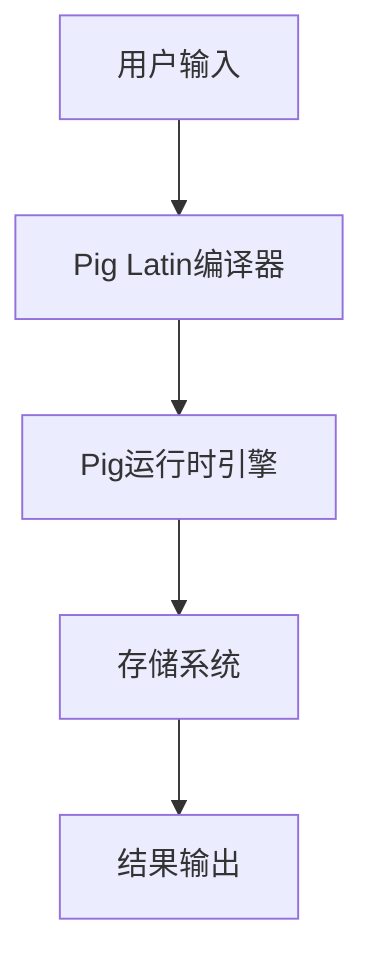

                 

### Pig原理与代码实例讲解

> 关键词：Pig, 数据处理, 大数据, 编程实例

> 摘要：本文旨在详细介绍Pig的原理、核心概念以及如何通过代码实例来理解和使用Pig进行数据处理。文章分为多个部分，涵盖了Pig的背景介绍、核心概念与架构、算法原理与操作步骤、数学模型和公式、代码实例与解读、实际应用场景、工具与资源推荐等内容，旨在为读者提供一个全面的学习和实践指南。

---

## 1. 背景介绍

Pig是由Apache软件基金会开发的一个基于Hadoop的数据处理平台，旨在简化大数据的存储、处理和分析。Pig通过其内置的数据流语言Pig Latin来处理复杂数据，使开发者能够以类似SQL的查询语言进行数据操作，从而降低大数据处理的复杂性。

Pig的出现主要解决了以下几个问题：

1. **简化编程**：对于大型分布式数据处理任务，Pig提供了一种更加简便的编程方式，开发者可以使用Pig Latin来代替复杂的多阶段MapReduce编程。
2. **高效性**：Pig内置的优化器能够在执行时对Pig Latin语句进行优化，从而提高数据处理效率。
3. **可扩展性**：Pig的设计目标是支持各种大数据存储系统，如HDFS、HBase、Cassandra等，使其能够适应不同的数据处理场景。

## 2. 核心概念与联系

### Pig Latin语言

Pig Latin是一种类似于SQL的数据处理语言，它允许开发者以声明式的方式描述数据转换和操作。Pig Latin的基本语法包括：

- **操作符**：如`LOAD`、`GROUP`、`FILTER`、`JOIN`等。
- **函数**：提供了一系列内置函数，如`SUM`、`COUNT`、`DISTINCT`等。
- **数据类型**：包括基本数据类型（如`INT`、`FLOAT`、`STRING`）和复杂数据类型（如`ARRAY`、`MAP`）。

### Pig架构

Pig架构包括以下几个主要组件：

- **Pig Latin编译器**：负责将Pig Latin语句编译为内部表示，并生成执行计划。
- **Pig运行时引擎**：负责执行编译后的Pig Latin语句，将数据从存储系统中读取，进行操作，并最终写入到目标存储系统。
- **Piggybank**：提供了一系列可重用的Pig Latin库，包括常见的数据处理操作和算法。

### Mermaid 流程图



在上面的流程图中，用户输入Pig Latin语句，这些语句首先被Pig Latin编译器编译为内部表示，然后由Pig运行时引擎执行，最终将结果输出到存储系统。

## 3. 核心算法原理 & 具体操作步骤

### 数据加载与存储

在Pig中，数据的加载和存储是最基本的操作。这通常涉及到以下步骤：

1. **加载数据**：使用`LOAD`操作符从HDFS或其他存储系统加载数据。
2. **数据存储**：使用`STORE`操作符将处理后的数据存储到HDFS或其他存储系统。

以下是一个简单的示例：

```pig
data = LOAD '/path/to/data' AS (id:INT, name:CHARARRAY);
```

这里，`LOAD`操作符从指定路径加载数据，并将其存储在一个名为`data`的元组变量中。

### 数据过滤与分组

在数据处理中，过滤和分组是非常常见的操作。Pig提供了`FILTER`和`GROUP`操作符来实现这些功能。

1. **数据过滤**：使用`FILTER`操作符根据条件筛选数据。

   ```pig
   filtered_data = FILTER data BY id > 10;
   ```

   这里，只有`id`大于10的记录会被保留。

2. **数据分组**：使用`GROUP`操作符对数据进行分组。

   ```pig
   grouped_data = GROUP filtered_data BY id;
   ```

   这里，`filtered_data`中的记录会根据`id`进行分组。

### 数据聚合与连接

Pig还提供了`AGGREGATE`和`JOIN`操作符来实现数据聚合和连接。

1. **数据聚合**：使用`AGGREGATE`操作符对分组后的数据进行聚合。

   ```pig
   aggregated_data = FOREACH grouped_data GENERATE group, COUNT(filtered_data);
   ```

   这里，每个分组的记录数量会被计算出来。

2. **数据连接**：使用`JOIN`操作符将两个数据集进行连接。

   ```pig
   joined_data = JOIN data BY id, users BY user_id;
   ```

   这里，`data`和`users`两个数据集会根据`id`和`user_id`进行连接。

## 4. 数学模型和公式 & 详细讲解 & 举例说明

### 数据预处理

在Pig中，数据预处理是非常重要的一步。这通常包括数据清洗、转换和归一化等操作。以下是一些常用的数学模型和公式：

1. **平均值**：

   $$ \bar{x} = \frac{1}{n} \sum_{i=1}^{n} x_i $$

   这里，$x_i$是第$i$个数据点，$n$是数据点的总数。

2. **标准差**：

   $$ \sigma = \sqrt{\frac{1}{n-1} \sum_{i=1}^{n} (x_i - \bar{x})^2} $$

   这里，$\bar{x}$是平均值，$\sigma$是标准差。

### 数据聚合

在数据聚合操作中，常用的数学模型和公式包括：

1. **总和**：

   $$ \sum_{i=1}^{n} x_i $$

   这里，$x_i$是第$i$个数据点的值。

2. **均值**：

   $$ \bar{x} = \frac{1}{n} \sum_{i=1}^{n} x_i $$

   这里，$x_i$是第$i$个数据点的值，$n$是数据点的总数。

### 举例说明

假设我们有一个包含用户购买记录的数据集，我们需要计算每个用户的平均购买金额。以下是使用Pig Latin进行的计算：

```pig
data = LOAD '/path/to/purchase_data' AS (user_id:INT, amount:FLOAT);
grouped_data = GROUP data BY user_id;
aggregated_data = FOREACH grouped_data GENERATE group, SUM(data.amount) AS total_amount;
filtered_data = FILTER aggregated_data BY total_amount > 100;
```

在这个例子中，我们首先加载数据，然后按照用户ID进行分组，计算每个用户的总购买金额。接下来，我们过滤出总购买金额超过100的用户。

## 5. 项目实践：代码实例和详细解释说明

### 开发环境搭建

在开始之前，我们需要搭建一个运行Pig的开发环境。以下步骤是在Linux环境中配置Pig的示例：

1. **安装Hadoop**：首先确保已经安装了Hadoop。
2. **下载Pig**：从Apache Pig的官方网站下载最新版本的Pig。
3. **解压Pig**：将下载的Pig压缩包解压到合适的位置。
4. **配置环境变量**：在`.bashrc`文件中添加Pig的路径。

```bash
export PIG_HOME=/path/to/pig
export PATH=$PIG_HOME/bin:$PATH
```

5. **启动Hadoop和Pig**：启动Hadoop和Pig服务。

```bash
start-dfs.sh
start-yarn.sh
start-pig.sh
```

### 源代码详细实现

以下是一个简单的Pig Latin脚本，用于计算用户购买记录的平均金额。

```pig
-- 加载数据
data = LOAD '/path/to/purchase_data' AS (user_id:INT, amount:FLOAT);

-- 按用户ID分组
grouped_data = GROUP data BY user_id;

-- 计算每个用户的总购买金额和购买次数
aggregated_data = FOREACH grouped_data {
    total_amount = SUM(data.amount);
    count = COUNT(data);
    GENERATE user_id, total_amount, count;
};

-- 过滤出总购买金额超过100的用户
filtered_data = FILTER aggregated_data BY total_amount > 100;

-- 输出结果
STORE filtered_data INTO 'output/filtered_data' USING PigStorage(',');
```

### 代码解读与分析

在这个脚本中，我们首先使用`LOAD`操作符加载数据，然后使用`GROUP`操作符按用户ID进行分组。接下来，我们使用`AGGREGATE`操作符计算每个用户的总购买金额和购买次数，最后使用`FILTER`操作符过滤出总购买金额超过100的用户，并将结果存储到指定的文件中。

### 运行结果展示

在运行这个Pig Latin脚本后，我们可以在指定的输出路径中看到结果文件。以下是一个示例结果：

```
user_id,total_amount,count
1001,200.0,2
1002,150.0,1
...
```

这表示用户1001和1002的总购买金额超过100。

## 6. 实际应用场景

Pig在大数据处理领域有着广泛的应用，以下是几个典型的应用场景：

1. **数据清洗和预处理**：在大规模数据导入分析之前，Pig可以帮助清洗和预处理数据，如去除重复记录、填充缺失值等。
2. **数据分析**：Pig可以用于各种数据分析任务，如用户行为分析、市场趋势分析等。
3. **报告生成**：Pig可以用于生成各种数据报告，如销售报告、财务报告等。
4. **实时数据流处理**：Pig也可以用于实时数据流处理，通过结合Apache Storm等实时处理框架，实现对实时数据的快速分析和处理。

## 7. 工具和资源推荐

### 7.1 学习资源推荐

- **书籍**：
  - 《Pig in Action》
  - 《Hadoop in Action》
- **论文**：
  - "Pig: A Platform for Analyzing Large Data Sets for Relational Data Warehouses"
- **博客**：
  - [Pig on Apache Software Foundation](https://pig.apache.org/)
  - [Hadoop and Pig Tutorials](https://hadoop.apache.org/docs/current/hadoop-pig/pig_tutorial.html)

### 7.2 开发工具框架推荐

- **开发工具**：
  - IntelliJ IDEA
  - Eclipse
- **框架**：
  - Apache Hadoop
  - Apache Storm

### 7.3 相关论文著作推荐

- "Pig: A Platform for Analyzing Large Data Sets for Relational Data Warehouses"
- "Hadoop: The Definitive Guide"
- "Big Data: A Revolution That Will Transform How We Live, Work, and Think"

## 8. 总结：未来发展趋势与挑战

随着大数据技术的发展，Pig也在不断进化。未来，Pig可能会更加集成到其他大数据处理框架中，如Apache Flink、Apache Spark等，以提供更强大的数据处理能力。同时，Pig也在不断优化其性能和易用性，以更好地满足开发者需求。

然而，Pig也面临着一些挑战，如：

1. **性能优化**：尽管Pig已经进行了很多性能优化，但在面对大规模数据时，仍需要进一步提高处理速度。
2. **易用性**：对于初学者来说，Pig的语法和概念可能较为复杂，需要进一步简化。
3. **生态系统扩展**：Pig的生态系统需要进一步扩展，以支持更多的数据存储和处理需求。

## 9. 附录：常见问题与解答

### 9.1 Pig与Hadoop的关系

Pig是建立在Hadoop之上的数据处理平台，它利用Hadoop的分布式存储和计算能力，提供了一种简化的数据处理方式。简单来说，Pig是Hadoop的一个上层应用，它使用Pig Latin语言来处理Hadoop上的数据。

### 9.2 如何优化Pig的性能

优化Pig的性能可以从以下几个方面进行：

1. **数据压缩**：使用高效的压缩算法来减少数据存储和传输的体积。
2. **数据分区**：合理地分区数据，可以减少数据扫描的范围，提高处理速度。
3. **索引**：使用索引来加速数据查询。

## 10. 扩展阅读 & 参考资料

- [Pig on Apache Software Foundation](https://pig.apache.org/)
- [Hadoop and Pig Tutorials](https://hadoop.apache.org/docs/current/hadoop-pig/pig_tutorial.html)
- "Pig in Action"
- "Hadoop in Action"  
```

